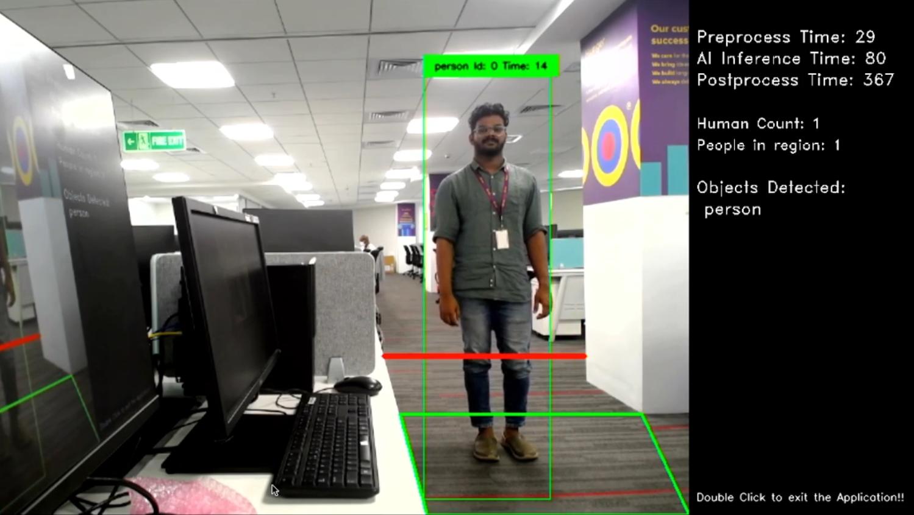

# Footfall Counter

## Application: Overview
This application is designed to track and count the number of people entering a designated boundary line,
while simultaneously reducing the count for those exiting the boundary line.

Additionally, the application 
has the ability to measure the time spent by a particular person within a specified region of interest.

This software could be useful in a variety of settings, such as retail stores, museums, and events,
where managers need to monitor and analyze traffic flow and customer behavior.

The AI model used for the sample application is [TinyYoloV3](https://arxiv.org/pdf/1804.02767.pdf).

**NOTE:** This sample application can be used to track different objects, like animal, car, etc. The list of objects that can be tracked are provided in [coco labels txt](./exe/coco-labels-2014_2017.txt) file. 

It has 2 modes of running.

1. Using MIPI Camera as input
2. Using USB Camera as input

#### Demo 


## Application: Requirements

#### Hardware Requirements
- RZ/V2L Evaluation Board Kit
  - MIPI Camera
- USB Camera 
- USB Keyboard
- USB Mouse
- USB Hub
- HDMI monitor with resolution 1280x720 
- micro HDMI to HDMI cable 
- SD Card (for file system)

[Hardware Setup Steps](https://github.com/renesas-rz/rzv_ai_sdk/#hardware-requirements-and-setup)

>**Note:** All external devices will be attached to the board and does not require any driver installation (Plug n Play Type)

#### Software Requirements
- Ubuntu 20.04
- OpenCV 4.x
- C++11 or higher 
- git 2.41 (or above)

## Application: Build Stage

>**Note:** User can skip to the next stage (deploy) if they don't want to build the application. All pre-built binaries are provided.

**Note:** This project expects the user to have completed [Getting Started Guide](https://renesas-rz.github.io/rzv_ai_sdk/latest/getting_started) provided by Renesas. 

After completion of the guide, the user is expected of following things.
- The Board Set Up and booted. 
- SD Card Prepared 
- The docker image amd container for `rzv2l_ai_sdk_image` running on host machine.

>**Note:** Docker container is required for building the sample application. By default the Renesas will provide the container named as `rzv2l_ai_sdk_container`. Please use the docker container name as assigned by the user when building the container.

#### Application File Generation
1. Copy the repository from the GitHub to the desired location. 
    1. It is recommended to copy/clone the repository on the `data` folder which is mounted on the `rzv2l_ai_sdk_container` docker container. 
    ```sh
    cd <path_to_data_folder_on_host>
    git clone https://github.com/renesas-rz/rzv_ai_sdk.git
    ```
    > Note 1: Please verify the git repository url if error occurs.

    > Note 2: This command will download the whole repository, which include all other applications. If you have already downloaded the repository of the same version, you may not need to run this command.

2. Run(or start) the docker container and open the bash terminal on the container.

> Note: All the build steps/commands listed below are executed on the docker container bash terminal.

3. Assign path to the `data` directory mounted on the `rzv2l_ai_sdk_container` docker container

```sh
export PROJECT_PATH=/drp-ai_tvm/data/
```
4. Go to the `src` directory of the application

```sh
cd ${PROJECT_PATH}/rzv_ai_sdk/Q01_footfall_counter/src/
```
5. Build the application on docker environment by following the steps below

```sh
mkdir -p build && cd build
```
```sh
cmake -DCMAKE_TOOLCHAIN_FILE=./toolchain/runtime.cmake ..
```
```sh
make -j$(nproc)
```
The following application file would be generated in the `src/build` directory
- object_tracker

## Application: Deploy Stage

For the ease of deployment all the deployable files and folders for RZ/V2L are provided on the [exe](./exe) folder.

|File | Details |
|:---|:---|
|tinyyolov3_onnx | Model object files for deployment. |
|coco-labels-2014_2017.txt | Label list for Object Detection. |
|config.ini | user input config for line, region and object. |
|object_tracker | application file. |


Follow the steps mentioned below to deploy the project on RZ/V2L Evaluation Board Kit. 
1. Copy following files to the `/home/root/tvm` directory of the rootfs (on SD Card) for RZ/V2L Evaluation Board Kit.
   1. The files present in [exe](./exe) directory, which are listed in the table above.
   2. The generated `object_tracker` application file if the application file is built at [build stage](#application-build-stage)

2. Check if libtvm_runtime.so is there on `/usr/lib64` directory of the rootfs (SD card) RZ/V2L Evaluation Board Kit.


Folder structure in the rootfs (SD Card) would look like:
```sh
├── usr/
│   └── lib64/
│       └── libtvm_runtime.so
└── home/
    └── root/
        └── tvm/ 
            ├── tinyyolov3_onnx/
            │   ├── preprocess/
            │   ├── deploy.json
            │   ├── deploy.params
            │   └── deploy.so
            ├── coco-labels-2014_2017.txt
            ├── config.ini
            └── object_tracker

```
>**Note:** The directory name could be anything instead of `tvm`. If you copy the whole `exe` folder on the board. You are not required to rename it `tvm`.

## Application: Run Stage

* For running the application, run the commands as shown below on the RZ/V2L Evaluation Board console.
  * Go to the `/home/root/tvm` directory of the rootfs
  ```sh
  cd /home/root/tvm
  ```
  * Change the values in `config.ini` as per the requirements. Detailed explanation of the `config.ini` file is given at [Application:Configuration](#explanation-of-the-configini-file)
  ```sh
  vi config.ini
  ```
  * Run the application in the terminal of the RZ/V2L evaluation board kit using the command
    - For USB Camera
    ```sh
    ./object_tracker USB
    ```
    - For MIPI Camera
    ```sh
    ./object_tracker MIPI
    ```
* The expected output will be the same as shown in the demo video

#### Application: Runtime output details


The runtime application will look something like this 


 
- The application will track the person if the person crossed the `red line` and increment the `human count` and decrement it when the person crosses again.
    - As per current logic, left to right crossing will increment the human count, and right to left crossing will decrement the count.
    - Users need to arrange the line according to the requirement.
- The application will also keep track of the person in the available region `green box` and increment the `person in region` count. It will also decrement the count if the person leaves the area.
- The pre-processing time, inference time, and post-processing time are displayed in the top right corner, respectively. 
- Each person tracked is given a unique `id`.
    - The `time` parameter of the tracked person indicates the time spent on the desired location. This incremented at regular interval.

#### Application: Termination
- Application can be terminated by clicking the left mouse double click.
- Alternatively, to force close the application, switch from the application window to the terminal by pressing `Super(windows key)+Tab` and press `CTRL + C`.

## Application: Configuration 

###### Explanation of the `config.ini` file 

The file contains four sections: [**line**], [**region**], [**tracking**] and [**display**].

>**Note:** The x,y coordinates are ranged from [0,0] to [img_height, img_width]. The img_height and img_width depends on the camera capture resolution. This sample application is tested on 640x480 image.

- The [**line**] section contains four key-value pairs that define the coordinates of the boundary line to be drawn.\
The x1, y1, x2, and y2 values correspond to the x and y coordinates of the boundary line's
starting and ending points.

- The [**region**] section contains 9 key-value pairs, which defines the Region of Interest.\
The n value indicates the number of points that define a region, followed by x and y coordinates
for each point.\
The region is defined by connecting these points in the order they are listed.

- The [**tracking**] section contains 3 key-value pairs.\
The conf value is a confidence threshold used for object tracking, and the kmin value is the minimum number of key-points required for tracking.
The "objects" is for which objects to be tracked. Please specify any other classes present in the [coco labels](exe/coco-labels-2014_2017.txt) to change the tracked object.

- The [**display**] section contains two key-value pairs.\
The "display text" is the text shown on GUI for the number of objects that crossed the line.
The "region_display_text" is the text shown on GUI for the number of object present in the region

>**Note:** The object tracked here is of class "Person", it can be changed to other classes present on the coco labels.


To modify the configuration settings, edit the values in this file using VI Editor, from the RZ/V2L Evaluation Board Kit.

###### AI inference time
The AI inference time is 100-120 msec.

### Time Tracking Backend Integration

>**Note:**  As per recent development status, the application have been tested for 100 numbers of people on the certain region without any error occurring, so if the use cases are expected for the number of people on the certain region to be less than 100, there is no need for code modification.

- Currently for storing the person id and the time spent on the region of interest [ROI] is stored on the board memory as key-value pair. As board memory consumption is limited, this procedure could be moved to the Database/Cache which could be hosted on the cloud or host machine.

- Customers can install SQL Database/Cache on the cloud or host-machine. 

- After each sec the application can call the API for inserting the data on the DB, if not present. and show the time taken for the persons in the ROI

- When the person goes out of the ROI, the application can call the API to remove the person data from the DB and cache.
