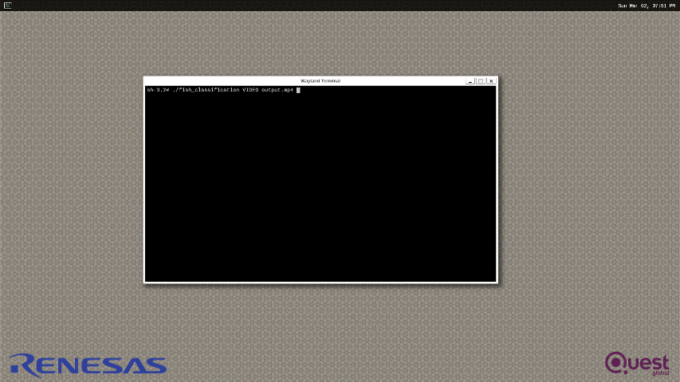

# Fish Classification Application

## Application: Overview
The fish classification application allows to classify between 31 different fish species.

'Bangus', 'Big Head Carp', 'Black Spotted Barb', 'Catfish', 'Climbing Perch', 'Fourfinger Threadfin', 'Freshwater Eel', 'Glass Perchlet', 'Goby', 'Gold Fish', 'Gourami', 'Grass Carp', 'Green Spotted Puffer', 'Indian Carp', 'Indo-Pacific Tarpon', 'Jaguar Gapote', 'Janitor Fish', 'Knifefish', 'Long-Snouted Pipefish', 'Mosquito Fish', 'Mudfish', 'Mullet', 'Pangasius', 'Perch', 'Scat Fish', 'Silver Barb', 'Silver Carp','Silver Perch', 'Snakehead', 'Tenpounder', 'Tilapia'

The application could be used to classify fishes during fish farming, or from certain areas on the sea/river through drones, etc.  

It has 4 modes of running.

1. Using MIPI Camera
2. Using Image as input
3. Using Video as input
4. Input from Websocket [Link to Readme](./fish_application/etc/readme.md)

#### Demo Video:
The Demo videos for the fish classification application can be found at




## Application: Requirements

#### Hardware Requirements
- RZ/V2L Evaluation Board Kit
    - Coral Camera
- USB Mouse
- USB Keyboard
- USB Hub
- HDMI monitor & Micro HDMI Cable


[Details](https://github.com/renesas-rz/rzv_ai_sdk/blob/main/README.md)

#### Software Requirements for building the application
- Ubuntu 20.04
- OpenCV 4.x
- C++11 or higher

## Application: Build Stage

>**Note:** User can skip to the next stage (deploy) if they don't want to build the application. All pre-built binaries are provided.

**Note:** This project expects the user to have completed [Getting Startup Guide](../README.md#startup-guide) provided by Renesas. 

After completion of the guide, the user is expected of following things.
- The Board Set Up and booted. 
- SD Card Prepared 
- The docker image amd container for `rzv2l_ai_sdk_image` running on host machine.

>**Note:** Docker container is required for building the sample application. By default the Renesas will provide the container named as `rzv2l_ai_sdk_container`. Please use the docker container name as assigned by the user when building the container.

#### Application: File Generation

1. Copy the repository from the GitHub to the desired location. 
    1. It is recommended to copy/clone the repository on the `data` folder which is mounted on the `rzv2l_ai_sdk_container` docker container. 
    ```sh
    cd <path_to_data_folder_on_host>
    git clone https://github.com/renesas-rz/rzv_ai_sdk.git
    ```
   >Note: Please verify the git repository url if error occurs.
2. Run the docker container and open the bash terminal on the container.

> Note: All the build steps/commands listed below are executed on the docker container terminal.

3. Assign path to the `data` directory mounted on the `rzv2l_ai_sdk_container` docker container

```sh
export PROJECT_PATH=/drp-ai_tvm/data/
```

4. Go to the `src` directory of the application

```sh
cd ${PROJECT_PATH}/rzv_ai_sdk/Q04_fish_classification/fish_application/src/
```
>**Note:**`rzv_ai_sdk` is the repository name corresponding to the cloned repository. Please verify the repository name if error occurs.
5. Build the application on docker environment by following the steps below

```sh
mkdir -p build && cd build
```
```sh
cmake -DCMAKE_TOOLCHAIN_FILE=./toolchain/runtime.cmake ..
```
```sh
make -j$(nproc)
```

The following application file would be generated in the `src/build` directory
- fish_classification


## Application: Deploy Stage

#### Mode: Board Deployment
##### Folder Structure in the board
```sh
/
└── home
    └── root
        └── tvm
            ├── fish_classification_model
            │   ├── deploy.json
            │   ├── deploy.params
            │   └── deploy.so
            │  
            └── fish_classification

```


## Application: Runtime Stage

##### Mode: Camera Input
- The application takes input from MIPI Coral Camera.

```sh
cd /home/root/tvm
```

> Note: The output resolution depends on the input camera resolution, which could be modified from the script, before running it. Default resolution:1920x1080
```sh 
./fish_classification CAMERA 
```


##### Mode: Image Input

```sh
cd /home/root/tvm
```
```sh
./fish_classification IMAGE <img_file_path>
```
> Note: Tested with image file format `.png` and `.jpg`.


##### Mode: Video Input

```sh
cd /home/root/tvm
```
```sh 
./fish_classification VIDEO <video_file_path>
```
> Note: Tested with video file format `.mp4` and `.avi`.


### Application: Termination
- Press `Esc` key to terminate the application.


## Application: Specifications

#### Model Details

```python
==========================================================================================
Layer (type:depth-idx)                   Output Shape              Param #
==========================================================================================
├─Sequential: 1-1                        [-1, 512, 7, 7]           --
|    └─Conv2d: 2-1                       [-1, 64, 112, 112]        9,408
|    └─BatchNorm2d: 2-2                  [-1, 64, 112, 112]        128
|    └─ReLU: 2-3                         [-1, 64, 112, 112]        --
|    └─MaxPool2d: 2-4                    [-1, 64, 56, 56]          --
|    └─Sequential: 2-5                   [-1, 64, 56, 56]          --
|    |    └─BasicBlock: 3-1              [-1, 64, 56, 56]          73,984
|    |    └─BasicBlock: 3-2              [-1, 64, 56, 56]          73,984
|    |    └─BasicBlock: 3-3              [-1, 64, 56, 56]          73,984
|    └─Sequential: 2-6                   [-1, 128, 28, 28]         --
|    |    └─BasicBlock: 3-4              [-1, 128, 28, 28]         230,144
|    |    └─BasicBlock: 3-5              [-1, 128, 28, 28]         295,424
|    |    └─BasicBlock: 3-6              [-1, 128, 28, 28]         295,424
|    |    └─BasicBlock: 3-7              [-1, 128, 28, 28]         295,424
|    └─Sequential: 2-7                   [-1, 256, 14, 14]         --
|    |    └─BasicBlock: 3-8              [-1, 256, 14, 14]         919,040
|    |    └─BasicBlock: 3-9              [-1, 256, 14, 14]         1,180,672
|    |    └─BasicBlock: 3-10             [-1, 256, 14, 14]         1,180,672
|    |    └─BasicBlock: 3-11             [-1, 256, 14, 14]         1,180,672
|    |    └─BasicBlock: 3-12             [-1, 256, 14, 14]         1,180,672
|    |    └─BasicBlock: 3-13             [-1, 256, 14, 14]         1,180,672
|    └─Sequential: 2-8                   [-1, 512, 7, 7]           --
|    |    └─BasicBlock: 3-14             [-1, 512, 7, 7]           3,673,088
|    |    └─BasicBlock: 3-15             [-1, 512, 7, 7]           4,720,640
|    |    └─BasicBlock: 3-16             [-1, 512, 7, 7]           4,720,640
├─Sequential: 1-2                        [-1, 31]                  --
|    └─AdaptiveConcatPool2d: 2-9         [-1, 1024, 1, 1]          --
|    |    └─AdaptiveMaxPool2d: 3-17      [-1, 512, 1, 1]           --
|    |    └─AdaptiveAvgPool2d: 3-18      [-1, 512, 1, 1]           --
|    └─Flatten: 2-10                     [-1, 1024]                --
|    └─BatchNorm1d: 2-11                 [-1, 1024]                2,048
|    └─Dropout: 2-12                     [-1, 1024]                --
|    └─Linear: 2-13                      [-1, 512]                 524,288
|    └─ReLU: 2-14                        [-1, 512]                 --
|    └─BatchNorm1d: 2-15                 [-1, 512]                 1,024
|    └─Dropout: 2-16                     [-1, 512]                 --
|    └─Linear: 2-17                      [-1, 31]                  15,872
==========================================================================================
Total params: 21,827,904
Trainable params: 21,827,904
Non-trainable params: 0
Total mult-adds (G): 3.71
==========================================================================================
Input size (MB): 0.57
Forward/backward pass size (MB): 54.38
Params size (MB): 83.27
Estimated Total Size (MB): 138.21
```

#### Dataset 


'Bangus', 'Big Head Carp', 'Black Spotted Barb', 'Catfish', 'Climbing Perch', 'Fourfinger Threadfin', 'Freshwater Eel', 'Glass Perchlet', 'Goby', 'Gold Fish', 'Gourami', 'Grass Carp', 'Green Spotted Puffer', 'Indian Carp', 'Indo-Pacific Tarpon', 'Jaguar Gapote', 'Janitor Fish', 'Knifefish', 'Long-Snouted Pipefish', 'Mosquito Fish', 'Mudfish', 'Mullet', 'Pangasius', 'Perch', 'Scat Fish', 'Silver Barb', 'Silver Carp','Silver Perch', 'Snakehead', 'Tenpounder', 'Tilapia'

Dataset properties:
The total number of images: 13,304 image
Training set size: 8791 images
Test set size: 2751 images
The number of classes: 1760

[Dataset-Link](https://www.kaggle.com/datasets/markdaniellampa/fish-dataset)

#### AI Inference time
Total AI inference time (Pre-processing + AI model inference) - 65ms (15 FPS)

| Training Accuracy   |Validation Accuracy   |  Testing Accuracy |
|---|---|---|
|  98.2 | 97.7  | 94.5  |

