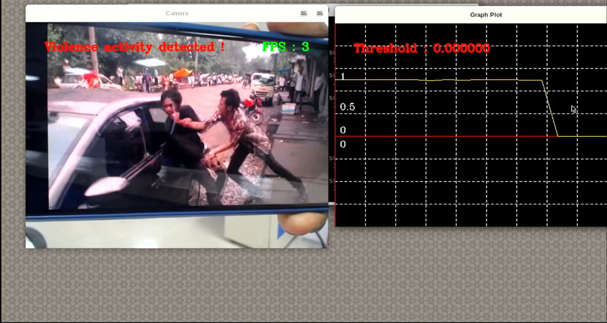

# Suspicious Activity Classification Application

## Application: Overview
The susspicious  activity classification application allows to classify between Violence and Non-Violence from video input using a custom AI model which has a CNN module for feature extraction and MLP for aggregating features.

It has 2 modes of running.

1. Using Video as input
2. Using MIPI Camera as Input

#### Demo:


## Application: Requirements

#### Hardware Requirements
- RZ/V2L Evaluation Board Kit
    - Coral Camera
- USB Mouse
- USB Keyboard
- USB Hub
- HDMI monitor & Micro HDMI Cable
- SD Card (for file system)

[Details](https://github.com/renesas-rz/rzv_ai_sdk/blob/main/README.md)

#### Software Requirements for building the application
- Ubuntu 20.04
- OpenCV 4.x
- C++11 or higher

	
## Application: Build Stage

>**Note:** User can skip to the next stage (deploy) if they don't want to build the application. All pre-built binaries are provided.

**Note:** This project expects the user to have completed [Getting Startup Guide](https://github.com/renesas-rz/rzv_ai_sdk/blob/main/README.md#startup-guide) provided by Renesas. 

After completion of the guide, the user is expected of following things.
- The Board Set Up and booted. 
- SD Card Prepared 
- The docker image amd container for `rzv2l_ai_sdk_image` running on host machine.

>**Note:** Docker container is required for building the sample application. By default the Renesas will provide the container named as `rzv2l_ai_sdk_container`. Please use the docker container name as assigned by the user when building the container.

#### Application: File Generation

1. Copy the repository from the GitHub to the desired location. 
    1. It is recommended to copy/clone the repository on the `data` folder which is mounted on the `rzv2l_ai_sdk_container` docker container. 
    ```sh
    cd <path_to_data_folder_on_host>
    git clone https://github.com/renesas-rz/rzv_ai_sdk.git
    ```
   >Note: Please verify the git repository url if error occurs.
2. Run the docker container and open the bash terminal on the container.

> Note: All the build steps/commands listed below are executed on the docker container terminal.

3. Assign path to the `data` directory mounted on the `rzv2l_ai_sdk_container` docker container

```sh
export PROJECT_PATH=/drp-ai_tvm/data/
```

4. Go to the `src` directory of the application

```sh
cd ${PROJECT_PATH}/rzv_ai_sdk/Q05_suspicious_activity/src/
```
>**Note:**`rzv_ai_sdk` is the repository name corresponding to the cloned repository. Please verify the repository name if error occurs.
5. Build the application on docker environment by following the steps below

```sh
mkdir -p build && cd build
```
```sh
cmake -DCMAKE_TOOLCHAIN_FILE=./toolchain/runtime.cmake ..
```
```sh
make -j$(nproc)
```

The following application file would be generated in the `src/build` directory
- suspicious_activity


## Application: Deploy Stage

For the ease of deployment all the deployable files and folders for RZ/V2L are provided on the [exe](./exe) folder.

|File | Details |
|:---|:---|
|mlp_module | Model object files of MLP for deployment.|
|cnn_module | Model object files of CNN for deployment.|
|suspicious_activity | application file. |
|violence.mp4 | Sample Output video |
|non_violence.mp4 | Sample Output video |

Follow the steps mentioned below to deploy the project on RZ/V2L Board. 
* At the `/home/root/tvm` directory of the rootfs (on SD Card) for RZ/V2L board.
   * Copy the files present in [exe](./exe) directory, which are listed in the table above.
   * Copy the generated `suspicious_activity` application file if the application file is built at [build stage](#application-build-stage)

* Check if libtvm_runtime.so is there on `/usr/lib64` directory of the rootfs (SD card) RZ/V2L board.


##### Folder Structure in the board
```sh
/
└── home
    └── root
        └── tvm
            ├── cnn_module
            │   ├── deploy.json
            │   ├── deploy.params
            │   └── deploy.so
            │   
            ├── mlp_module
            │   ├── deploy.json
            │   ├── deploy.params
            │   └── deploy.so
            ├── violence.mp4
            ├── non_violence.mp4
            └── suspicious_activity

```


## Application: Runtime Stage

##### Mode: Camera Input
- The application takes input from MIPI Coral Camera.

```sh 
./suspicious_activity CAMERA 
```

##### Mode: Video Input

```sh 
./suspicious_activity VIDEO violence.mp4
```
> Note: Tested with video file format `.mp4` and `.avi`.

- User can pass the config for `FRAME_INTERVAL` and `BUFFER_SIZE` like this

```sh 
./suspicious_activity VIDEO non_violence 5 5
```

- Press `Esc` key to terminate the application.

#### Application: Runtime Details

- The application when running will look something like below



- The chart shown here will store the value of the previous 20 thresholds. 
- The threshold represent whether the suspicious activity is being done or not.
- With `0` being the suspicious activity being done and `1` for non-suspicious. The cut-off threshold is `0.5`.
- On the display out, FPS(Frame Per Sec) and classification of activity is also shown. 

## Application: Specifications

The application uses 2 model, 1 CNN and 1 MLP model. 
- For each frame from the video/camera, CNN will produce `128` linear output. 
- For every `FRAME_INTERVAL`, default 10, each frame will be processed to the CNN. The output vector is stored in the vector. 
    - `FRAME_INTERVAL` can also mean, skipping `FRAME_INTERVAL` frames and then selecting 1 frame.
    - This parameter is user configurable
    - User can pass int value ranging from [`2 - 15`]
 
- The `BUFFER_SIZE` (default 2) will determine, the consecutive frames to be added or removed for the vector. 
    - The `BUFFER_SIZE` is User configurable with range [`1 - 9`]. 

- For a `BATCH_SIZE` (fixed to 10), there will be `1280` vector size, which will be fed to the MLP for the classification. This variable is fixed and related to the AI model. 


#### Model Details

##### CNN Module

```python
==========================================================================================
Layer (type:depth-idx)                   Output Shape              Param #
==========================================================================================
├─Sequential: 1-1                        [-1, 512, 7, 7]           --
|    └─Conv2d: 2-1                       [-1, 64, 112, 112]        9,408
|    └─BatchNorm2d: 2-2                  [-1, 64, 112, 112]        128
|    └─ReLU: 2-3                         [-1, 64, 112, 112]        --
|    └─MaxPool2d: 2-4                    [-1, 64, 56, 56]          --
|    └─Sequential: 2-5                   [-1, 64, 56, 56]          --
|    |    └─BasicBlock: 3-1              [-1, 64, 56, 56]          73,984
|    |    └─BasicBlock: 3-2              [-1, 64, 56, 56]          73,984
|    |    └─BasicBlock: 3-3              [-1, 64, 56, 56]          73,984
|    └─Sequential: 2-6                   [-1, 128, 28, 28]         --
|    |    └─BasicBlock: 3-4              [-1, 128, 28, 28]         230,144
|    |    └─BasicBlock: 3-5              [-1, 128, 28, 28]         295,424
|    |    └─BasicBlock: 3-6              [-1, 128, 28, 28]         295,424
|    |    └─BasicBlock: 3-7              [-1, 128, 28, 28]         295,424
|    └─Sequential: 2-7                   [-1, 256, 14, 14]         --
|    |    └─BasicBlock: 3-8              [-1, 256, 14, 14]         919,040
|    |    └─BasicBlock: 3-9              [-1, 256, 14, 14]         1,180,672
|    |    └─BasicBlock: 3-10             [-1, 256, 14, 14]         1,180,672
|    |    └─BasicBlock: 3-11             [-1, 256, 14, 14]         1,180,672
|    |    └─BasicBlock: 3-12             [-1, 256, 14, 14]         1,180,672
|    |    └─BasicBlock: 3-13             [-1, 256, 14, 14]         1,180,672
|    └─Sequential: 2-8                   [-1, 512, 7, 7]           --
|    |    └─BasicBlock: 3-14             [-1, 512, 7, 7]           3,673,088
|    |    └─BasicBlock: 3-15             [-1, 512, 7, 7]           4,720,640
|    |    └─BasicBlock: 3-16             [-1, 512, 7, 7]           4,720,640
├─Sequential: 1-2                        [-1, 31]                  --
|    └─AdaptiveConcatPool2d: 2-9         [-1, 1024, 1, 1]          --
|    |    └─AdaptiveMaxPool2d: 3-17      [-1, 512, 1, 1]           --
|    |    └─AdaptiveAvgPool2d: 3-18      [-1, 512, 1, 1]           --
|    └─Flatten: 2-10                     [-1, 1024]                --
|    └─BatchNorm1d: 2-11                 [-1, 1024]                2,048
|    └─Dropout: 2-12                     [-1, 1024]                --
|    └─Linear: 2-13                      [-1, 512]                 524,288
|    └─ReLU: 2-14                        [-1, 512]                 --
|    └─BatchNorm1d: 2-15                 [-1, 512]                 1,024
|    └─Dropout: 2-16                     [-1, 512]                 --
|    └─Linear: 2-17                      [-1, 31]                  15,872
==========================================================================================
Total params: 21,827,904
Trainable params: 21,827,904
Non-trainable params: 0
Total mult-adds (G): 3.71
==========================================================================================
Input size (MB): 0.57
Forward/backward pass size (MB): 54.38
Params size (MB): 83.27
Estimated Total Size (MB): 138.21

##### MLP Module

==========================================================================================
Layer (type:depth-idx)                   Output Shape              Param #
==========================================================================================
├─Linear: 1-1                            [-1, 1, 128]              1,280,128
├─ReLU: 1-2                              [-1, 1, 128]              --
├─Linear: 1-3                            [-1, 1, 1]                129
├─Sigmoid: 1-4                           [-1, 1, 1]                --
==========================================================================================
Total params: 1,280,257
Trainable params: 1,280,257
Non-trainable params: 0
Total mult-adds (M): 1.28
==========================================================================================
Input size (MB): 0.04
Forward/backward pass size (MB): 0.00
Params size (MB): 4.88
Estimated Total Size (MB): 4.92

```

#### Dataset 
Dataset Contains 1000 Violence and 1000 non-violence videos collected from youtube videos.
[Dataset-Link](https://www.kaggle.com/datasets/mohamedmustafa/real-life-violence-situations-dataset)
#### AI Inference time
Total AI inference time (Pre-processing + AI model inference) - 350 ms
| Training Accuracy   |Validation Accuracy   |  Testing Accuracy |
|---|---|---|

