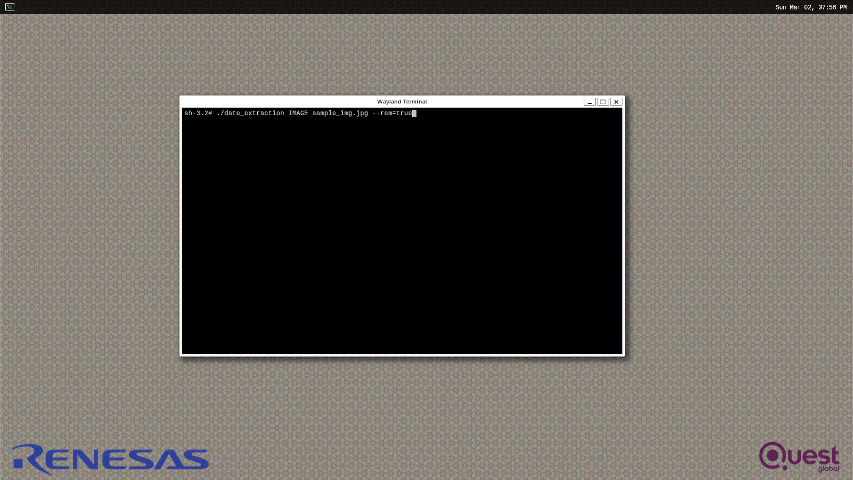

# Expiry Date Extraction

## Application: Overview
This application is designed to extract expiry date information from the food items or medicines. 

The application was made to extract year, month and day from certain YYMMDD formats. 
Extracted date formats from 

"DD-MMM-YY",
"YY-MMM-DD",
"MMM-DD-YY",
"YYYY-MMM-DD",
"DD-MMM-YYYY",
"DDst-MMM-YYYY",
"MMM-DD-YYYY"

>Note: The separator is not limited to "-", it could be any special character like [`@`,`,`,`-`,`.`,` `, `/`].  

This software caters to the needs of managers and users in diverse environments like retail and healthcare, where verifying product expiry dates is crucial.

There are 4 classes for object detection.
- Date : Expiry date
- Code : Product code if any 
- Prod : Production tag 
- Due : Due date tag

It has following mode of running.
| Mode | RZ/V2L | RZ/V2H |
|:---|:---|:---|
| MIPI Camera | Supported | - |
| USB Camera | Supported | Supported |
| Image | Supported | Supported |


### Supported Product
- RZ/V2L Evaluation Board Kit (RZ/V2L EVK)
- RZ/V2H Evaluation Board Kit (RZ/V2H EVK)

### Demo

Following is the demo for RZ/V2H EVK.  


## Application: Requirements

### Hardware Requirements
<table class="gstable">
    <tr>
      <th>For</th>
      <th>Equipment</th>
      <th>Details</th>
    </tr>
    <tr>
      <td rowspan="3">RZ/V2L</td>
      <td>RZ/V2L EVK</td>
      <td>Evaluation Board Kit for RZ/V2L.<br>Includes followings.
        <ul class="mb-1">
          <li>
            MIPI Camera Module(Google Coral Camera)
          </li>
          <li>MicroUSB to Serial Cable for serial communication.</li>
        </ul>
      </td>
    </tr>
    <tr>
      <td>AC Adapter</td>
      <td>USB Power Delivery adapter for the board power supply.</td>
    </tr>
    <tr>
      <td>MicroHDMI Cable</td>
      <td>Used to connect the HDMI Monitor and the board.<br>
      RZ/V2L EVK has microHDMI port.</td>
    </tr>
    <tr>
      <td rowspan="4">RZ/V2H</td>
      <td>RZ/V2H EVK</td>
      <td>Evaluation Board Kit for RZ/V2H.</td>
    </tr>
    <tr>
      <td>AC Adapter</td>
      <td>USB Power Delivery adapter for the board power supply.<br>
      100W is required.</td>
    </tr>
    <tr>
      <td>HDMI Cable</td>
      <td>Used to connect the HDMI Monitor and the board.<br>
      RZ/V2H EVK has HDMI port.</td>
    </tr>
    <tr>
      <td>USB Camera</td>
      <td>Used as a camera input source.</td>
    </tr>
    <tr>
      <td rowspan="8">Common</td>
      <td>USB Cable Type-C</td>
      <td>Connect AC adapter and the board.</td>
    </tr>
    <tr>
      <td>HDMI Monitor</td>
      <td>Used to display the graphics of the board.</td>
    </tr>
    <tr>
      <td>microSD card</td>
      <td>Used as the filesystem.<br>
      Must have over 4GB capacity of blank space.<br>
      Operating Environment: Transcend UHS-I microSD 300S 16GB</td>
    </tr>
    <tr>
      <td>Linux PC</td>
      <td>Used to build application and setup microSD card.<br>
      Operating Environment: Ubuntu 20.04</td>
    </tr>
    <tr>
      <td>SD card reader</td>
      <td>Used for setting up microSD card.<br></td>
    </tr>
    <tr>
      <td>USB Hub</td>
      <td>Used to connect USB Keyboard and USB Mouse to the board.</td>
    </tr>
    <tr>
      <td>USB Keyboard</td>
      <td>Used to type strings on the terminal of board.</td>
    </tr>
    <tr>
      <td>USB Mouse</td>
      <td>Used to operate the mouse on the screen of board.</td>
    </tr>
  </table>

>**Note:** All external devices will be attached to the board and does not require any driver installation (Plug n Play Type)   

Connect the hardware as shown below.  

|RZ/V2L EVK | RZ/V2H EVK |
|:---|:---|
||  |

>**Note 1:** When using the keyboard connected to RZ/V Evaluation Board, the keyboard layout and language are fixed to English.   
>**Note 2:** For RZ/V2H EVK, there are USB 2.0 and USB 3.0 ports.  
USB camera needs to be connected to appropriate port based on its requirement.

## Application: Build Stage

>**Note:** User can skip to the [next stage (deploy)](#application-deploy-stage) if they do not want to build the application.  
All pre-built binaries are provided.

### Prerequisites
This section expects the user to have completed Step 5 of [Getting Started Guide](https://renesas-rz.github.io/rzv_ai_sdk/latest/getting_started.html) provided by Renesas. 

After completion of the guide, the user is expected of following things.
- AI SDK setup is done.
- Following docker container is running on the host machine.
    |Board | Docker container |
    |:---|:---|
    |RZ/V2L EVK|`rzv2l_ai_sdk_container`  |
    |RZ/V2H EVK|`rzv2h_ai_sdk_container`  |

    >**Note:** Docker environment is required for building the sample application. 


### Application File Generation
1. On your host machine, copy the repository from the GitHub to the desired location. 
    1. It is recommended to copy/clone the repository on the `data` folder, which is mounted on the Docker container. 
    ```sh
    cd <path_to_data_folder_on_host>/data
    git clone https://github.com/renesas-rz/rzv_ai_sdk.git
    ```
    >Note: This command will download the whole repository, which include all other applications.  
    If you have already downloaded the repository of the same version, you may not need to run this command.  

2. Run (or start) the docker container and open the bash terminal on the container.  
E.g., for RZ/V2L, use the `rzv2l_ai_sdk_container` as the name of container created from  `rzv2l_ai_sdk_image` docker image.  
    > Note that all the build steps/commands listed below are executed on the docker container bash terminal.  

3. Set your clone directory to the environment variable.  
    ```sh
    export PROJECT_PATH=/drp-ai_tvm/data/rzv_ai_sdk
    ```
4. Go to the application source code directory.  
    ```sh
    cd ${PROJECT_PATH}/Q06_expiry_date_detection/src
    ```
5. Download the `boost` tar file
   ```sh
   wget https://boostorg.jfrog.io/artifactory/main/release/1.81.0/source/boost_1_81_0.tar.bz2
   ```
   >**Note:** It is expected that the docker container is able to connect to the internet. If that's not the case, User can use the same command on the host PC to download the file. Make sure you are on the src folder present on the mounted `data` directory.

6. Extract tar file to the current location 
   ```sh
   tar -xvf boost_1_81_0.tar.bz2
   ```

7. Copy the boost files to the `include` folder 

    ```sh
    mkdir -p include
    cp -r boost_1_81_0/boost include/
    ```
8. Remove boost files [Optional]

    ```sh
    rm boost_1_81_0.tar.bz2
    rm -rf boost_1_81_0
    ```
9. Create and move to the `build` directory.
    ```sh
    mkdir -p build && cd build
    ```
10. Build the application by following the commands below.  
    **For RZ/V2L**
    ```sh
    cmake -DCMAKE_TOOLCHAIN_FILE=./toolchain/runtime.cmake ..
    make -j$(nproc)
    ```
    **For RZ/V2H**
    ```sh
    cmake -DCMAKE_TOOLCHAIN_FILE=./toolchain/runtime.cmake -DV2H=ON ..
    make -j$(nproc)
    ```
11. The following application file would be generated in the `${PROJECT_PATH}/Q06_expiry_date_detection/src/build` directory
    - date_extraction


## Application: Deploy Stage
### Prerequisites
This section expects the user to have completed Step 7-1 of [Getting Started Guide](https://renesas-rz.github.io/rzv_ai_sdk/latest/getting_started.html#step7) provided by Renesas. 

After completion of the guide, the user is expected of following things.
- microSD card setup is done.

### File Configuration
For the ease of deployment all the deployable file and folders are provided in following folders.  
|Board | `EXE_DIR` |
|:---|:---|
|RZ/V2L EVK|[exe_v2l](./exe_v2l)  |
|RZ/V2H EVK|[exe_v2h](./exe_v2h)  |

Each folder contains following items.
|File | Details |
|:---|:---|
|date_detection_tinyyolov3 | [RZ/V2L only] Model object files for deployment |
|expiry_yolov3_onnx | [RZ/V2H only] Model object files for deployment |
|date_class_labels.txt | Label list for Object Detection |
|date_detection | application file |
|sample_img.jpg | sample image for image mode |


### Instruction
1. [FOR RZ/V2H only] Run following commands to download the necessary file.  
    ```sh
     cd <path_to_data_folder_on_host>/data/rzv_ai_sdk/Q06_expiry_date_detection/exe_v2h/expiry_yolov3_onnx/
     wget https://github.com/renesas-rz/rzv_ai_sdk/releases/download/v5.00/Q06_expiry_date_detection_deploy_tvm_v2h-v230.so
    ```
    
2. [FOR RZ/V2H only] Rename the `Q06_expiry_date_detection_deploy_*.so` to `deploy.so`.
    ```sh
    mv Q06_expiry_date_detection_deploy_*.so deploy.so
    ```
3. Copy the following files to the `/home/root/tvm` directory of the rootfs (SD Card) for the board.
    |File | Details |
    |:---|:---|
    |All files in `EXE_DIR` directory | Including `deploy.so` file. |
    |`date_extraction` application file | Generated the file according to [Application File Generation](#application-file-generation) |

4. Check if `libtvm_runtime.so` exists under `/usr/lib64` directory of the rootfs (SD card) on the board.

5. Folder structure in the rootfs (SD Card) would look like:
    ```
    |-- usr
    |   `-- lib64
    |       `-- libtvm_runtime.so
    `-- home
        `-- root
            `-- tvm
                |-- date_detection_tinyyolov3   #RZ/V2L only
                |   |-- deploy.json             #RZ/V2L only
                |   |-- deploy.params           #RZ/V2L only
                |   `-- deploy.so               #RZ/V2L only
                |-- expiry_yolov3_onnx          #RZ/V2H only
                |   |-- deploy.json             #RZ/V2H only
                |   |-- deploy.params           #RZ/V2H only
                |   `-- deploy.so               #RZ/V2H only
                |-- date_class_labels.txt
                |-- date_extraction
                `-- sample_img.jpg
    ```
>**Note:** The directory name could be anything instead of `tvm`. If you copy the whole `EXE_DIR` folder on the board, you are not required to rename it `tvm`.

## Application: Run Stage

### Prerequisites
This section expects the user to have completed Step 7-3 of [Getting Started Guide](https://renesas-rz.github.io/rzv_ai_sdk/latest/getting_started.html#step7-3) provided by Renesas. 

After completion of the guide, the user is expected of following things.  
- The board setup is done.  
- The board is booted with microSD card, which contains the application file.  

### Instruction
1. [Optional] The date on the RZ/V board may be different. [Mandatory in case opted for remaining day calculation].
    - To check use following on board terminal.
    ```sh
    date
    ```
    - To set to current date in the format `YYYYMMDD` [if different] 
    ```sh
    date +%Y%m%d -s "20230615" 
    ```

2. On Board terminal, go to the `tvm` directory of the rootfs.
    ```sh
    cd /home/root/tvm/
    ```
    
3. Run the application.
    - For Image Mode
    ```sh
    ./date_extraction IMAGE sample_img.jpg [--rem=true]
    ```
    - For USB Camera Mode
    ```sh
    ./date_extraction USB [--rem=true]
    ```
    - For MIPI Camera Mode (RZ/V2L only)
    ```sh
    ./date_extraction MIPI -[-rem=true]
    ```
    > -rem is an optional argument to display the remaining days to expire   
4. Following window shows up on HDMI screen.  

    |RZ/V2L EVK | RZ/V2H EVK |
    |:---|:---|
    ||   |

    On application window, following information is displayed.  
    - Camera capture  
    - Object Detection result (Bounding boxes, class name and score.)
    - Remaining days: Number of days remaining until expiration date (if "-rem" option is specified)
    - Processing time  
        - Total AI Time: Sum of all processing time below.  
        - Inference: Processing time taken for AI inference.  
        - PreProcess: Processing time taken for AI pre-processing.  
        - PostProcess: Processing time taken for AI post-processing.<br>(excluding the time for drawing on HDMI screen).  
        
5. To terminate the application, switch the application window to the terminal by using `Super(windows key)+Tab ` and press ENTER key on the terminal of the board.


## Application: Configuration 
### AI Model
- RZ/V2L
    - Tiny YOLOv3: [Darknet](https://pjreddie.com/darknet/yolo/)  
    Dataset: Custom labelled dataset with classes listed [here](./exe_v2l/date_class_labels.txt)   
    Input size: 1x3x416x416  
    Output1 size: 1x13x13x27  
    Output2 size: 1x26x26x27  
  
- RZ/V2H
    - YOLOv3: [Darknet](https://pjreddie.com/darknet/yolo/)  
    Dataset: Custom labelled dataset with classes listed [here](./exe_v2h/date_class_labels.txt)  
    Input size: 1x3x416x416  
    Output1 size: 1x13x13x27  
    Output2 size: 1x26x26x27  
    Output3 size: 1x52x52x27 

### AI inference time
|Board | AI model | AI inference time|
|:---|:---|:---|
|RZ/V2L EVK|Tiny YOLOv3| Approximately 63 ms  |
|RZ/V2H EVK |YOLOv3 | Approximately 26 ms  |

### Processing

|Processing | Details |
|:---|:---|
|Pre-processing | Processed by CPU. <br> |
|Inference | Processed by DRP-AI and CPU. |
|Post-processing | Processed by CPU. |


### Image buffer size

|Board | Camera capture buffer size|HDMI output buffer size|
|:---|:---|:---|
|RZ/V2L EVK| VGA (640x480) in YUYV format  | HD (1280x720) in BGRA format  |
|RZ/V2H EVK | VGA (640x480) in YUYV format  | FHD (1920x1080) in BGRA format  |
  
  
## Reference
 
- For RZ/V2H EVK, this application supports USB camera only with 640x480 resolution.\
To use FHD, please use MIPI camera.\
Please refer to following URL for how to change camera input to MIPI camera.\
[https://renesas-rz.github.io/rzv_ai_sdk/latest/about-applications](https://renesas-rz.github.io/rzv_ai_sdk/latest/about-applications#mipi).

## License
Apache License 2.0
For third party OSS library, please see the source code file itself. 