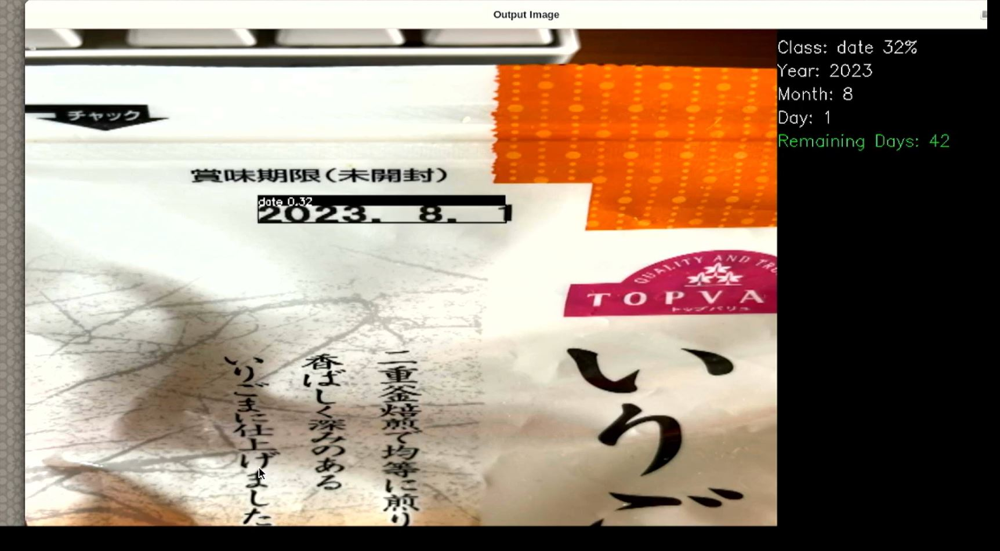
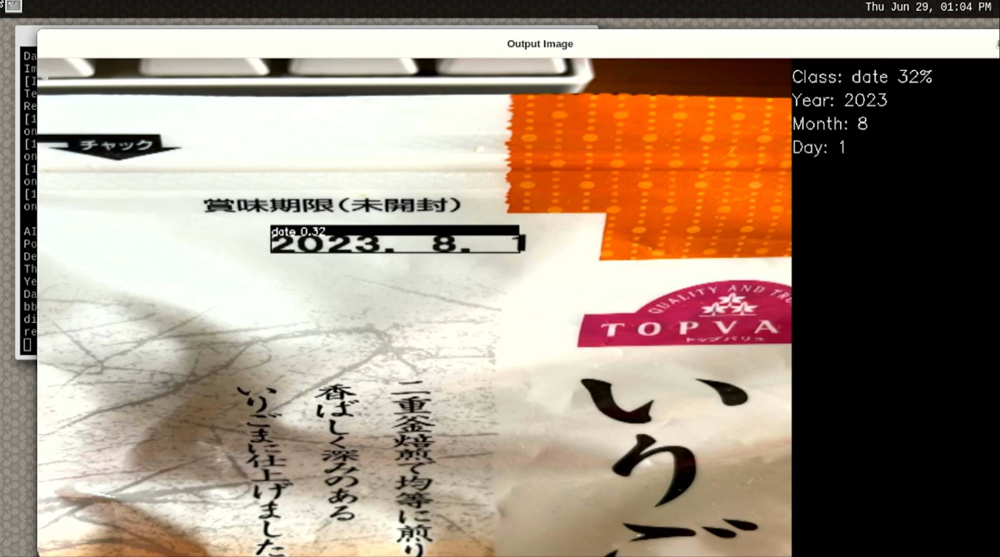

# Date Extraction: Image Mode

## Application: Overview 
This is image mode implementation of the expiry date detection application [`readme`](../../readme.md)

## Application: Requirements 

It is same as mentioned in the [Requirements](../../readme.md#application-requirements)

## Application: Build Stage 
- Follow the same as mentioned in the [Built Stage](../../readme.md#application-build-stage)
- On step 9, For timed termination, User need to comment out [`#define USER_KEY_HIT`](./define.h#L114) at path `./define.h`, Default is 10 sec termination. 
- At step 10, build with `make` command 
```sh
make -j$(nproc) date_extraction_img
```


The output file generated will be 
- date_extraction_img

## Application: Deploy Stage

For the ease of deployment all the deployable files and folders for RZ/V2L are provided on the [exe](../../exe/) folder.

|File | Details |
|:---|:---|
|date_tinyyolov3_onnx | Model object files and pre-process files for deployment. |
|date_class_labels.txt | Label list for Object Detection. |
|date_extraction_img | application file for image. |
|sample_img.jpg | Sample image file |
|date_extraction_img_exp | image mode application file showing remaining expiry date[optional]

Follow the steps mentioned below to deploy the project on RZ/V2L Board. 
* At the `/home/root/tvm` directory of the rootfs (on SD Card) for RZ/V2L board.
   * Copy the files present in [exe](../../exe) directory, which are listed in the table above.
   * Copy the generated `date_extraction_img` application file if the application file is built at [build stage](#application-build-stage)

* Check if libtvm_runtime.so is there on `/usr/lib64` directory of the rootfs (SD card) RZ/V2L board.


Folder structure in the rootfs (SD Card) would look like:

```sh
├── usr/
│   └── lib64/
│       └── libtvm_runtime.so
└── home/
    └── root/
        └── tvm/ 
            ├── date_tinyyolov3_onnx/
            │   ├── deploy.json
            │   ├── deploy.params
            │   └── deploy.so 
            │   └── preprocess/
            ├── date_class_labels.txt
            ├── sample_img.jpg
            └── date_extraction_img

```
>**Note:** The directory name could be anything instead of `tvm`. If you copy the whole `exe` folder on the board. You are not required to rename it `tvm`.

## Application: Run Stage

#### With Remaining Days shown 
* For running the application, run the commands as shown below on the RZ/V2L Evaluation Board Kit console.
    * Go to the `/home/root/tvm` directory of the rootfs
    ```sh
    cd /home/root/tvm
    ```
    * Run the application
    ```sh
    ./date_extraction_img sample_img.jpg -rem
    ```
    
    


#### Default Mode 
* For running the application, run the commands as shown below on the RZ/V2L Evaluation Board Kit console.
    * Go to the `/home/root/tvm` directory of the rootfs
    ```sh
    cd /home/root/tvm
    ```
    * Run the application
    ```sh
    ./date_extraction_img sample_img.jpg 
    ```

    

#### Application: Termination
* User needs to press `Esc` key to stop the application. 
* For timed termination case, it will terminated gracefully after default 10 sec.