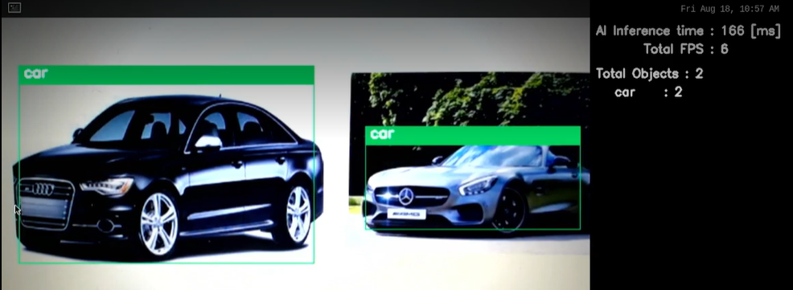
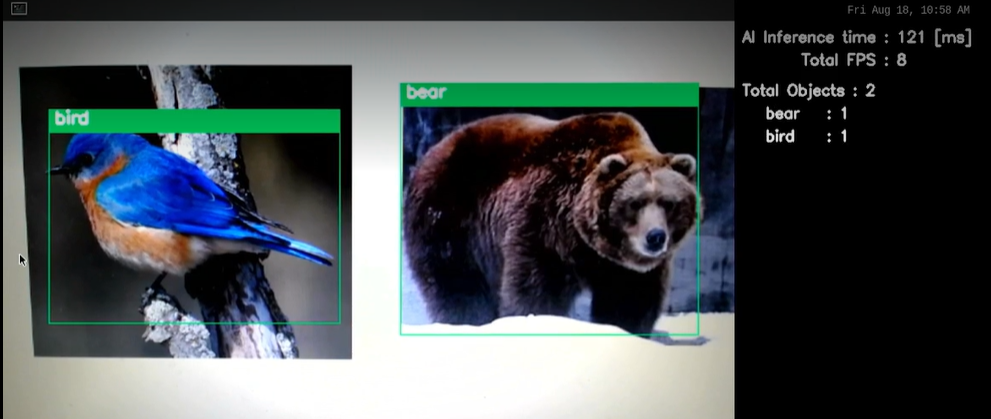
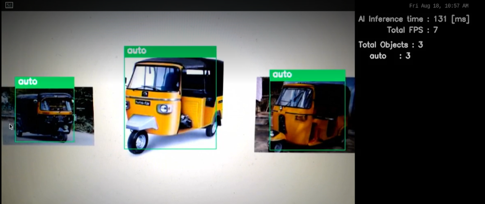

# Object Counter Application

## Application: Overview
The Object Counter Application is a user-friendly and efficient generic software tool that can be used to create custom counting applications for any scenario. This application uses the advanced Tiny-YOLOv3 algorithm to identify and count objects in images or videos.

### Use Cases
The Generic Counter Application is a powerful tool that can be used to count objects in a variety of settings, including:

- **Animal Counting**: The application can be fine tuned to count the animals only. This application can be used for zoo or farm monitoring, also could be used to prevent the road hazards due to animal interference. The list of animals on which the AI model is trained is available [animal_class.txt](./exe/animal/animal_class.txt)

- **Vehicle Counting**: The application can be fine tuned to count the vehicle instances per frame. This application can then be used for traffic monitoring at government/corporate buildings.The list of vehicles on which the AI model is trained is available [vehicle_class.txt](./exe/vehicle/vehicle_class.txt)

- **General Counting**: The general counting applications can be used to count any type of object, from people and cars to inventory and products. They are often used in businesses to track customer traffic, inventory levels, and employee productivity. The list of object on which the AI model is trained is available [coco_class.txt](./exe/coc/coco_class.txt)

The other use cases could be: 

- **Manufacturing**: The application can be used to count parts on a production line or to measure the output of a machine.
- **Retail**: The application can be used to count products on a shelf or to track the number of customers in a store.
- **Safety**: The application can be used to count people in a crowd or to monitor the traffic flow in a city.

### Key Features
Here are some of the key features of the Generic Counter Application:

- **Automatic Object Detection**: 
    The application utilizes Tiny-yolov3 model for detection, identifying and localizing objects specified within the provided frame.
- **Flexible**: 
    The application can be customized to meet the specific needs of any counting scenario.
- **Customizable Settings**: 
    Users can adjust the detection and classification parameters by using the config file provided in the repository.

### Demo 


## Applications: Requirements

### Hardware Requirements

- RZ/V2L Evaluation Board Kit
    - MIPI Camera
- USB camera 
- USB Keyboard
- USB Mouse
- USB Hub
- HDMI monitor with resolution 1280x720 
- micro HDMI to HDMI cable 
- SD Card (for file system)

[Hardware Setup Steps](https://github.com/renesas-rz/rzv_ai_sdk/#hardware-requirements-and-setup)

### Software Requirements

- Ubuntu 20.04
- OpenCV 4.x
- C++11 or higher

## Application: Build Stage

>**Note:** User can skip to the next stage [deploy](#application-deploy-stage) if they don't want to build the application. All pre-built binaries are provided.

**Note:** This project expects the user to have completed [Getting Started Guide](https://github.com/renesas-rz/rzv_ai_sdk/blob/main/README.md#startup-guide) provided by Renesas

After completion of the guide, the user is expected of following things.
- The Board Set Up and booted. 
- SD Card Prepared 
- The docker image amd container for `rzv2l_ai_sdk_image` running on host machine.

>**Note:** Docker container is required for building the sample application. By default the Renesas will provide the container named as `rzv2l_ai_sdk_container`. Please use the docker container name as assigned by the user when building the container.

#### Application: File Generation
1. Copy the repository from the GitHub to the desired location. 
2. It is recommended to copy/clone the repository on the `data` folder which is mounted on the `rzv2l_ai_sdk_container` docker container. 

    ```sh
    cd <path_to_data_folder_on_host>
    git clone -b object_counter --single-branch  https://github.com/renesas-rz/rzv_ai_sdk.git
    ```

3. Run(or start) the docker container and open the bash terminal on the container.

> Note: All the build steps/commands listed below are executed on the docker container bash terminal.

4. Assign path to the `data` directory mounted on the `rzv2l_ai_sdk_container` docker container.

    ```sh
    export PROJECT_PATH=/drp-ai_tvm/data/
    ```

5. Go to the `src` directory of the application

    ```sh
    cd ${PROJECT_PATH}/rzv_ai_sdk/Q08_object_counter/src/
    ```
6. Build the application on docker environment by following the steps below

    ```sh
    mkdir -p build && cd build
    ```
    ```sh
    cmake -DCMAKE_TOOLCHAIN_FILE=./toolchain/runtime.cmake ..
    ```
    ```sh
    make -j$(nproc)
    ```
The following application file would be generated in the `src/build` directory
- object_counter


## Application: Deploy Stage

For the ease of deployment all the deployable files and folders for RZ/V2L are provided on the [exe](./exe) folder.

|File | Details |
|:---|:---|
|coco/tinyyolov3_onnx | Model object files for Coco Detection |
|coco/coco_class.txt | Label list for Coco Detection |
|coco/config.ini | User input model config object | 
|animal/animal_onnx | Model object files for Animal Detection |
|animal/animal_class.txt | Label list for Animal Detection |
|animal/config.ini | User input model config object | 
|vehicle/vehicle_onnx | Model object files for Vehicle Detection |
|vehicle/vehicle_class.txt | Label list for Vehicle Detection |
|vehicle/config.ini | User input model config object | 
|app_conf.ini | User input application config object |
|object_counter | Application file |

Follow the steps mentioned below to deploy the project on RZ/V2L Evaluation Board Kit. 
1. At the `/home/root/tvm` directory of the rootfs (on SD Card) for RZ/V2L Evaluation Board Kit.
    1. Copy the files present in [exe](./exe) directory, which are listed in the table above.
    2. Copy the generated `object_counter` application file if the application file is built at [build stage](#application-build-stage)
2. Check if libtvm_runtime.so is there on `/usr/lib64` directory of the rootfs (SD card) RZ/V2L Evaluation Board Kit.

Folder structure in the rootfs (SD Card) would look like:
```sh
├── usr/
│   └── lib64/
│       └── libtvm_runtime.so
└── home/
    └── root/
        └── tvm/ 
            ├── coco/
            │   ├── tinyyolov3_onnx/
            │   │   ├── deploy.json
            │   │   ├── deploy.params
            │   │   ├── deploy.so
            │   │   └── preprocess/
            │   │   
            │   ├── coco_class.txt
            │   └── config.ini
            ├── animal/
            │   ├── animal_onnx/
            │   │   ├── deploy.json
            │   │   ├── deploy.params
            │   │   ├── deploy.so
            │   │   └── preprocess/
            │   │   
            │   ├── animal_class.txt
            │   └── config.ini
            ├── vehicle/
            │   ├── vehicle_onnx/
            │   │   ├── deploy.json
            │   │   ├── deploy.params
            │   │   ├── deploy.so
            │   │   └── preprocess/
            │   │   
            │   ├── vehicle_class.txt
            │   └── config.ini
            │   
            ├── app_conf.ini
            └── object_counter

```


>**Note:** The directory name could be anything instead of `tvm`. If you copy the whole `exe` folder on the board. You are not required to rename it `tvm`.

## Application: Run Stage

For running the application, run the commands as shown below on the RZ/V2L Evaluation Board console.

1. Go to the `/home/root/tvm` directory of the rootfs
    ```sh
    cd /home/root/tvm
    ```

2. Change the values in `app_conf.ini` as per the requirements. Detailed explanation of the `app_conf.ini` file is given at below section.
    ```sh
    vi app_conf.ini
    ```

3. Run the application in the terminal of the RZ/V2L evaluation board kit using the command
  #### For MIPI Camera
  - COCO mode
    ```sh
    ./object_counter COCO
    ```
  - animal 
    ```sh
    ./object_counter animal
    ```
  - vehicle
    ```sh
    ./object_counter vehicle
    ```
  #### For USB Camera
  - COCO mode

    ```sh
    ./object_counter COCO USB
    ```
  - animal 
    ```sh
    ./object_counter animal USB
    ```
  - vehicle
     ```sh
    ./object_counter vehicle USB
    ```
 
>**Note:** The mode will be the section name in app_conf.ini file.

The expected output will be the same as shown in the demo video

### Application: Runtime output details

The runtime application will look something like this

#### Coco Object counting 




#### Animal Counting



#### Vehicle Counting



- AI Infernce time is shown on top right
- Frame Per Sec (FPS) is shown below this.
- Total detected object counts are shown , alongside the counts for each user-defined classes

### Application: Termination 
Switch from the application window to the terminal with using `Super(windows key)+Tab` and press `ENTER` key on the terminal of RZ/V2L Evaluation Board Kit.

## Application: Specifications

### AI Model Details

Tiny Yolov3 is used for better performance. Model weights are taken from [Darknet-Yolo](https://pjreddie.com/darknet/yolo/).

Then the model is retrained with below mentioned dataset. 

### Dataset

Dataset used is the same as mentioned in the below research paper 
[Link](https://cocodataset.org/#download)

### AI inference time
The AI inference time is 150-190 msec.

## Application: Configuration 

### Explanation of the `app_conf.ini` file

- The section name can be of your choice. And it will be the mode name.

- The section should contains three variables - `model_path`, `label_path` & `config_path`.

- The `model_path` value is the path to the folder containing compiled model. The folder should also contains also contain preprocess folder. 

- The `label_path` value is the path to the label list the model supports.

- The `config_path` value is the path to the model configuration ini file. Detailed explanation of the `config.ini` file is given at below section.

### Explanation of the `config.ini` file

- The [**detect**] section contains three variables - 'conf', 'anchors' & 'objects'.

- The `conf` value is the confidence threshold used for object detection,
- The `anchors` are the yolo anchors for the object detection. 
- The `objects` represents class to be identified and it can be changed to other classes present on the class label list.

- To modify the configuration settings, edit the values in this file using VI Editor, from the RZ/V2L Evaluation Board Kit.

```sh
vi config.ini
```
