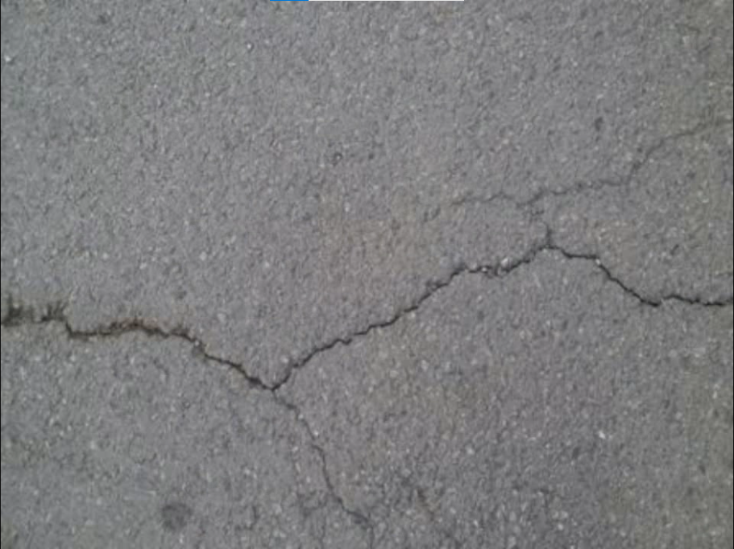
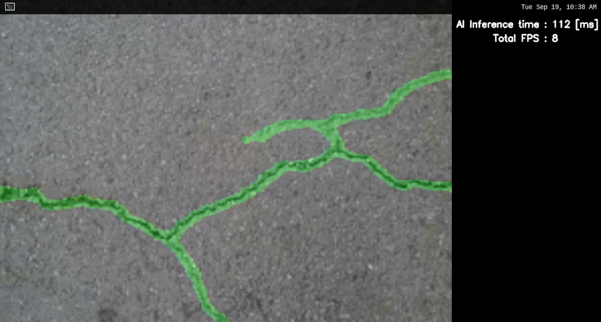

# Surface Defect Segmentation Application

## Application: Overview

Surface crack segmentation is the task of automatically identifying and segmenting cracks in images of surfaces. This is a challenging task due to the variability in crack appearance, the presence of noise and other artifacts, and the need to distinguish cracks from other surface features.

Surface crack segmentation has a wide range of applications, including:

- Structural health monitoring: The early detection of cracks in infrastructure can help to prevent major structural failures.
- Road condition assessment: The identification of cracks in roads can help to improve safety and reduce maintenance costs.
- Concrete inspection: The detection of cracks in concrete can help to identify potential problems with the structural integrity of the material.
- Painting and coating inspection: The identification of cracks in paint or coatings can help to prevent the ingress of moisture and other harmful substances.


It has 4 modes of running.

1. Using MIPI Camera as input
2. Using USB Camera as input
3. Using Image as input
4. Using Video as input

### Demo:


#### Video Mode


## Application: Requirements

#### Hardware Requirements
- RZ/V2L Evaluation Board Kit
    - Coral Camera
- USB Keyboard
- USB Mouse
- USB Hub
- HDMI monitor & Micro HDMI Cable
- USB Camera (Optional) 
- microSD Card (for file system)

[Hardware Setup Steps](https://github.com/renesas-rz/rzv_ai_sdk/#hardware-requirements-and-setup)

#### Software Requirements for building the application
- Ubuntu 20.04
- OpenCV 4.x
- C++14 or higher

## Application: Build Stage

>**Note:** User can skip to the next stage [deploy](#application-deploy-stage) if they don't want to build the application. All pre-built binaries are provided.

**Note:** This project expects the user to have completed [Getting Started Guide](https://renesas-rz.github.io/rzv_ai_sdk/latest/getting_started) provided by Renesas. 

After completion of the guide, the user is expected of following things.
- The Board Set Up and booted. 
- SD Card Prepared 
- The docker image amd container for `rzv2l_ai_sdk_image` running on host machine.

>**Note:** Docker container is required for building the sample application. By default the Renesas will provide the container named as `rzv2l_ai_sdk_container`. Please use the docker container name as assigned by the user when building the container.

### Application: File Generation

1. Copy the repository from the GitHub to the desired location. 

> It is recommended to copy/clone the repository on the `data` folder which is mounted on the `rzv2l_ai_sdk_container` docker container. 
```sh
cd <path_to_data_folder_on_host>
git clone https://github.com/renesas-rz/rzv_ai_sdk.git
```
> Note 1: Please verify the git repository url if error occurs

> Note 2: This command will download whole repository, which include all other applications, if you have already downloaded the repository of the same version, you may not need to run this command.

2. Run the docker container and open the bash terminal on the container.

> Note: All the build steps/commands listed below are executed on the docker container terminal.

3. Assign path to the `data` directory mounted on the `rzv2l_ai_sdk_container` docker container

```sh
export PROJECT_PATH=/drp-ai_tvm/data/
```

4. Go to the `src` directory of the application

```sh
cd ${PROJECT_PATH}/rzv_ai_sdk/Q09_crack_segmentation/src/
```
>**Note:**`rzv_ai_sdk` is the repository name corresponding to the cloned repository. Please verify the repository name if error occurs.
5. Build the application on docker environment by following the steps below

```sh
mkdir -p build && cd build
```
```sh
cmake -DCMAKE_TOOLCHAIN_FILE=./toolchain/runtime.cmake ..
```
```sh
make -j$(nproc)
```

The following application file would be generated in the `src/build` directory
- crack_segmentation


## Application: Deploy Stage

For the ease of deployment all the deployable files and folders for RZ/V2L are provided on the [exe](./exe) folder.

|File | Details |
|:---|:---|
|crack_segmentation_model | Model object files for deployment |
|sample.jpg | sample image |
|output.mp4 | sample video |
|crack_segmentation | application file |

Follow the steps mentioned below to deploy the project on RZ/V2L Evaluation Board Kit. 
1. Copy following files to the `/home/root/tvm` directory of the rootfs (on SD Card) for RZ/V2L Evaluation Board Kit.
   1. The files present in [exe](./exe) directory, which are listed in the table above.
   2. The generated `crack_segmentation` application file if the application file is built at [build stage](#application-build-stage)

2. Check if libtvm_runtime.so is there on `/usr/lib64` directory of the rootfs (SD card) RZ/V2L Evaluation Board Kit.

#### Folder Structure in the board
```sh
├── usr/
│   └── lib64/
│       └── libtvm_runtime.so
└── home
    └── root
        └── tvm
            ├── crack_segmentation_model
            │   ├── deploy.json
            │   ├── deploy.params
            │   └── deploy.so
            ├── sample.jpg
            ├── output.mp4
            └── crack_segmentation

```

>**Note:** The directory name could be anything instead of `tvm`. If you copy the whole `exe` folder on the board. You are not required to rename it `tvm`.

## Application: Runtime Stage

For running the application, run the commands as shown below on the RZ/V2L Evaluation Board console.

1. Go to the `/home/root/tvm` directory of the rootfs
    
    ```sh
    cd /home/root/tvm
    ```

2. Run the application in the terminal of the RZ/V2L evaluation board kit using the command

    - For MIPI Camera Mode
    ```sh
    ./crack_segmentation MIPI
    ```
    - For USB Camera Mode
    ```sh
    ./crack_segmentation USB
    ```
    - For Image Input Mode
    ```sh
    ./crack_segmentation IMAGE sample.jpg
    ```
    > Note: Tested with image file format `.png` and `.jpg`.
    - For Video Input Mode
    ```sh 
    ./crack_segmentation VIDEO output.mp4
    ```
    > Note: Tested with video file format `.mp4` and `.avi`.

3. The runtime application will look something like this

    | Input Image       | Output Image   |
    |-------------------|----------------|
    |   |     |

    - AI inferece time and Frames Per Sec (FPS) is shown on top right corner.
    - The cracks detected are shown in green mask/region.

4. For Termination: Switch from the application window to the terminal with using `Super(windows key)+Tab` and press `ENTER` key on the terminal of RZ/V2L Evaluation Board Kit.


## Application: Specifications

#### Model Details

- Model: [Unet](https://arxiv.org/pdf/1505.04597.pdf) model with resnet34 backbone.
- Dataset: [Crack Segmentation Dataset](https://www.kaggle.com/datasets/lakshaymiddha/crack-segmentation-dataset)
- Input Shape: 1x3x224x224
- Output Shape: 1x1x224x224

#### AI Inference time
Total AI inference time (Pre-processing + AI model inference) - 115ms (8 FPS)

## Known Issue
- Noise may be visible on the application window when using a USB camera because the frame is downscaled for inference and upscaled for output by a large factor.