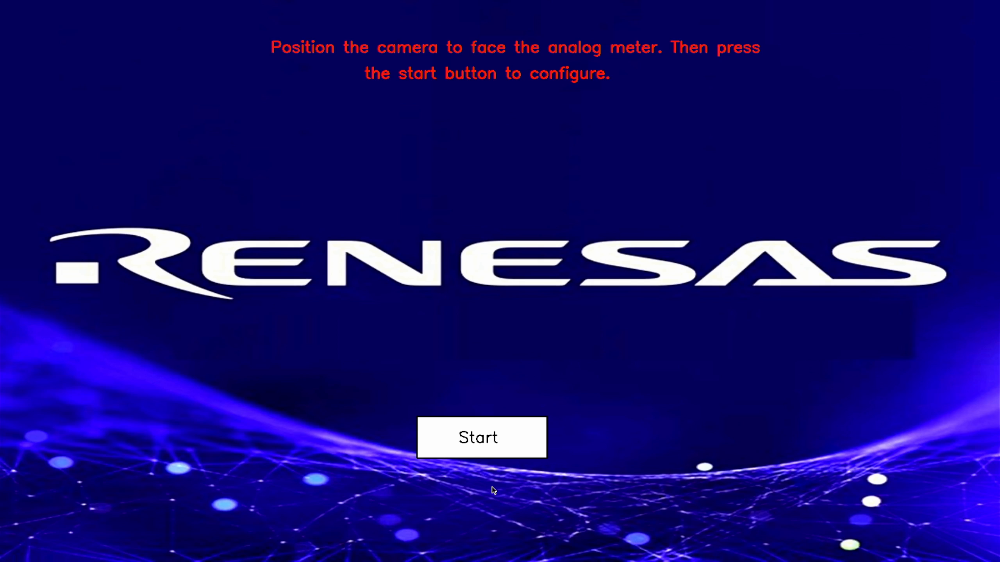
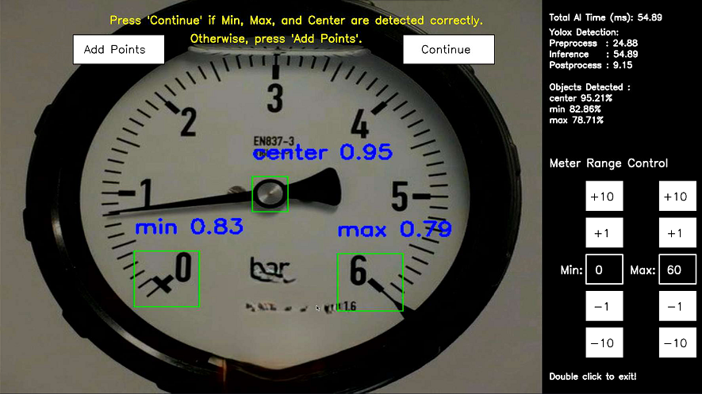
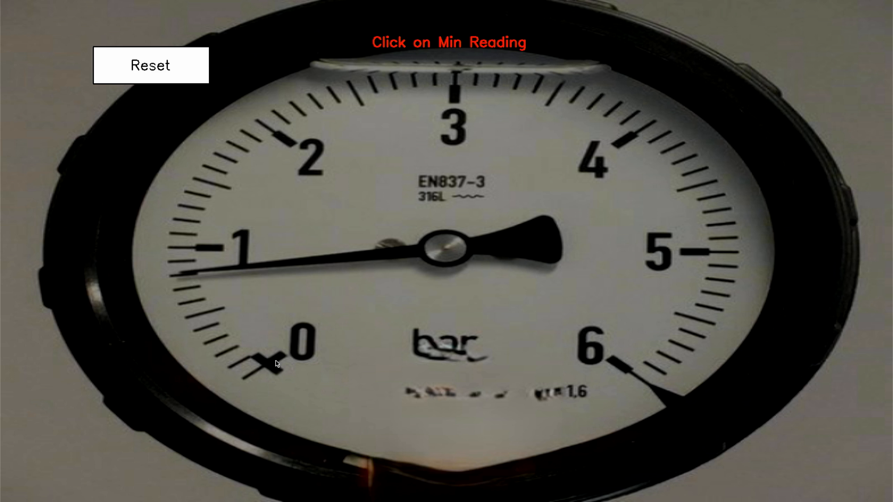
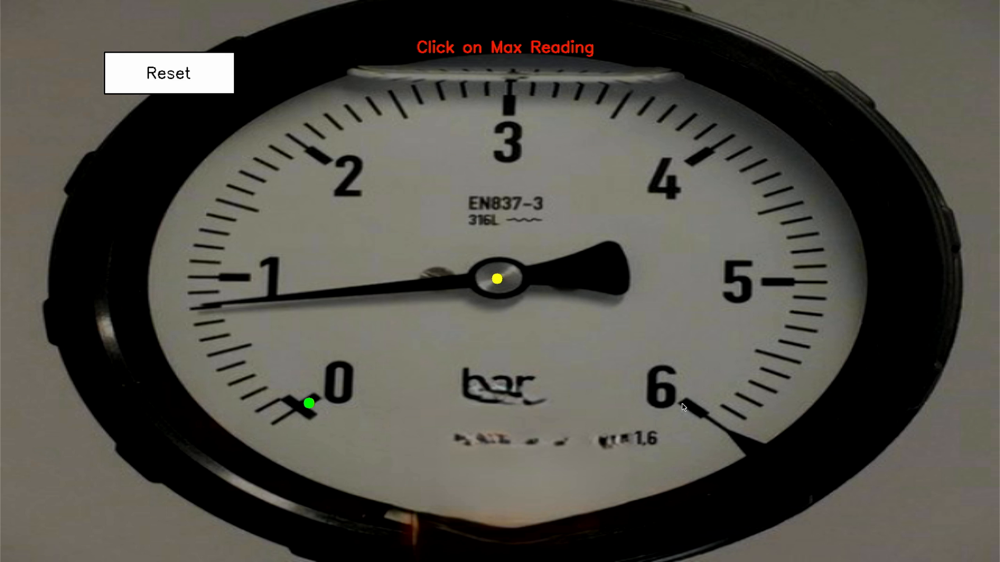
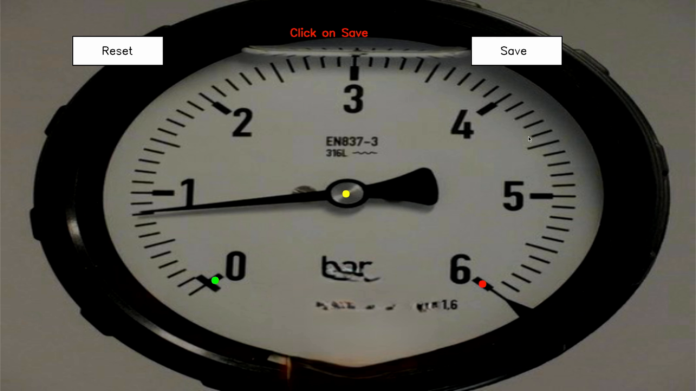
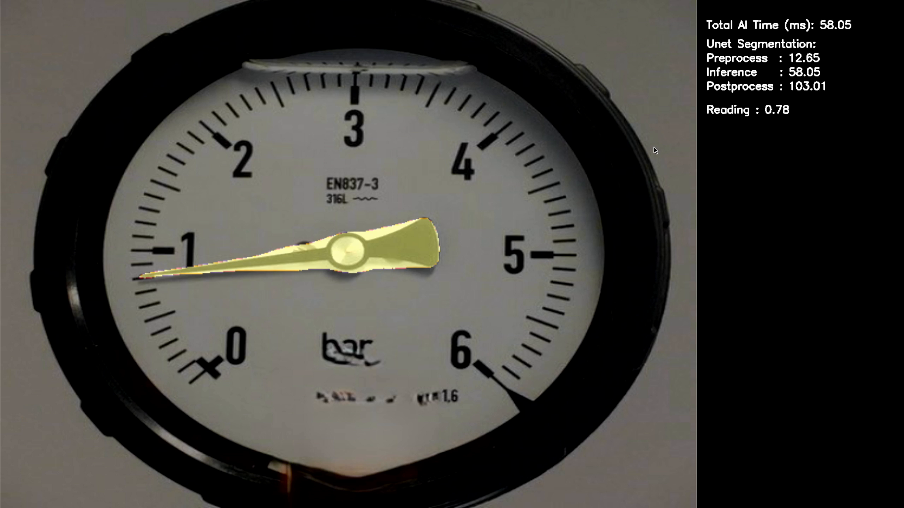
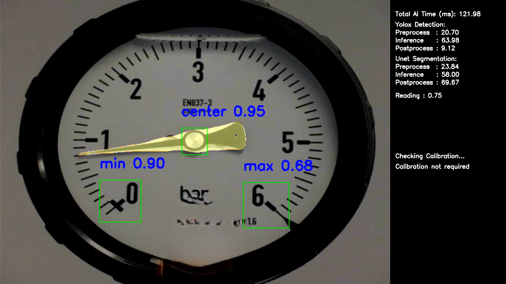

# Analog Meter Reader

## Application: Overview

An analog meter reader is an application designed to capture and interpret the readings from traditional analog meters, such as electricity, gas, or water meters. Unlike digital meters that provide data electronically, analog meters use mechanical dials, needles, or rotating counters to display consumption values. An analog meter reader typically involves either manual observation by personnel or automated solutions such as image recognition and sensor-based systems that convert these visual readings into digital data. This enables utilities and industries to bridge the gap between older infrastructure and modern data management systems without the need for immediate full-scale upgrades to digital smart meters.

The primary use case of analog meter readers is in utility management, where accurate and timely data collection is critical for billing, monitoring usage, and detecting anomalies. For example, utility companies can deploy automated analog meter readers to reduce the labor and time required for manual inspections while minimizing human error. In industrial settings, analog meter readers are also used for monitoring legacy equipment where replacing meters is not cost-effective. Additionally, they play an important role in remote or hard-to-reach areas, where automated meter readers with image processing and wireless data transmission can ensure consistent data collection and integration into centralized monitoring platforms.

It has following mode of running.

| Mode | RZ/V2H | RZ/V2N |
|:---|:---|:---|
| USB Camera|  Supported | Supported |
| Image |  Supported | Supported |
| Video |  Supported | - |

### Supported Product  
 <table>
     <tr>
       <th>Product</th>
       <th>Supported AI SDK version</th>
     </tr>
     <tr>
       <td>RZ/V2H Evaluation Board Kit (RZ/V2H EVK)</td>
       <td>RZ/V2H AI SDK v6.00</td>
     </tr>
     <tr>
       <td>RZ/V2N Evaluation Board Kit (RZ/V2N EVK)</td>
       <td>RZ/V2N AI SDK v6.00</td>
     </tr>
 </table>

### Demo 
Following is the demo for RZ/V2H EVK.  


## Application: Requirements

### Hardware Requirements
<table>
    <tr>
      <th>For</th>
      <th>Equipment</th>
      <th>Details</th>
    </tr>
    <tr>
      <td rowspan="4">RZ/V2H</td>
      <td>RZ/V2H EVK</td>
      <td>Evaluation Board Kit for RZ/V2H.</td>
    </tr>
    <tr>
      <td>AC Adapter</td>
      <td>USB Power Delivery adapter for the board power supply.<br>
      100W is required.</td>
    </tr>
    <tr>
      <td>HDMI Cable</td>
      <td>Used to connect the HDMI Monitor and the board.<br>
      RZ/V2H EVK has HDMI port.</td>
    </tr>
    <tr>
      <td>USB Camera</td>
      <td>Used as a camera input source.</td>
    </tr>
        <tr>
       <td rowspan="4">RZ/V2N</td>
       <td>RZ/V2N EVK</td>
       <td>Evaluation Board Kit for RZ/V2N.</td>
     </tr>
     <tr>
       <td>AC Adapter</td>
       <td>USB Power Delivery adapter for the board power supply.<br>
       60W is required.</td>
     </tr>
     <tr>
       <td>HDMI Cable</td>
       <td>Used to connect the HDMI Monitor and the board.<br>
       RZ/V2N EVK has HDMI port.</td>
     </tr>
     <tr>
       <td>USB Camera</td>
       <td>Used as a camera input source.</td>
     </tr>
    <tr>
      <td rowspan="8">Common</td>
      <td>USB Cable Type-C</td>
      <td>Connect AC adapter and the board.</td>
    </tr>
    <tr>
      <td>HDMI Monitor</td>
      <td>Used to display the graphics of the board.</td>
    </tr>
    <tr>
      <td>microSD card</td>
      <td>Used as the filesystem.<br>
      Must have over 4GB capacity of blank space.<br>
      Operating Environment: Transcend UHS-I microSD 300S 16GB</td>
    </tr>
    <tr>
      <td>Linux PC</td>
      <td>Used to build application and setup microSD card.<br>
      Operating Environment: Ubuntu 22.04.</td>
    </tr>
    <tr>
      <td>SD card reader</td>
      <td>Used for setting up microSD card.<br></td>
    </tr>
    <tr>
      <td>USB Hub</td>
      <td>Used to connect USB Keyboard and USB Mouse to the board.</td>
    </tr>
    <tr>
      <td>USB Keyboard</td>
      <td>Used to type strings on the terminal of board.</td>
    </tr>
    <tr>
      <td>USB Mouse</td>
      <td>Used to operate the mouse on the screen of board.</td>
    </tr>
  </table>

>**Note:** All external devices will be attached to the board and does not require any driver installation (Plug n Play Type)

Connect the hardware as shown below.  

| RZ/V2H EVK | RZ/V2N EVK |
 |:---|:---|
 |  |  |

>**Note 1:** When using the keyboard connected to RZ/V Evaluation Board, the keyboard layout and language are fixed to English.  
**Note 2:** For RZ/V2H EVK, there are USB 2.0 and USB 3.0 ports.  
USB camera needs to be connected to appropriate port based on its requirement.

## Application: Build Stage

>**Note:** User can skip to the [next stage (deploy)](#application-deploy-stage) if they do not want to build the application.  
All pre-built binaries are provided.

### Prerequisites
This section expects the user to have completed Step 5 of [Getting Started Guide](https://renesas-rz.github.io/rzv_ai_sdk/latest/getting_started.html) provided by Renesas. 

After completion of the guide, the user is expected of following things.
- AI SDK setup is done.
- Following docker container is running on the host machine.
    |Board | Docker container |
    |:---|:---|
    |RZ/V2H EVK|`rzv2h_ai_sdk_container`  |
    |RZ/V2N EVK|`rzv2n_ai_sdk_container`  |

    >**Note 1:** Docker environment is required for building the sample application.  


### Application File Generation
1. On your host machine, copy the repository from the GitHub to the desired location. 
    1. It is recommended to copy/clone the repository on the `data` folder, which is mounted on the Docker container. 
    ```sh
    cd <path_to_data_folder_on_host>/data
    git clone https://github.com/renesas-rz/rzv_ai_sdk.git
    ```
    >Note: This command will download the whole repository, which include all other applications.  
    If you have already downloaded the repository of the same version, you may not need to run this command.  

2. Run (or start) the docker container and open the bash terminal on the container.  
E.g., for RZ/V2N, use the `rzv2n_ai_sdk_container` as the name of container created from  `rzv2n_ai_sdk_image` docker image.  
    > Note that all the build steps/commands listed below are executed on the docker container bash terminal.  

3. Set your clone directory to the environment variable.  
    ```sh
    export PROJECT_PATH=/drp-ai_tvm/data/rzv_ai_sdk
    ```
4. Go to the application source code directory.  
    ```sh
    cd ${PROJECT_PATH}/Q13_analog_meter_reader/src
    ```
5. Create and move to the `build` directory.
    ```sh
    mkdir -p build && cd build
    ``````
6. Build the application by following the commands below.  
    ```sh
    cmake -DCMAKE_TOOLCHAIN_FILE=./toolchain/runtime.cmake ..
    make -j$(nproc)
    ```
   
7. The following application file would be generated in the `${PROJECT_PATH}/Q13_analog_meter_reader/src/build` directory
    - analog_reader


## Application: Deploy Stage
### Prerequisites
This section expects the user to have completed Step 7-1 of [Getting Started Guide](https://renesas-rz.github.io/rzv_ai_sdk/latest/getting_started.html#step7) provided by Renesas. 

After completion of the guide, the user is expected of following things.
- microSD card setup is done.

### File Configuration
For ease of deployment, all deployable files and folders are provided in the following folders.  
|Board | `EXE_DIR` |
|:---|:---|
|RZ/V2H EVK|[exe_v2h](./exe_v2h)  |
|RZ/V2N EVK|[exe_v2n](./exe_v2n)  |

Each folder contains following items.

|File | Details |
|:---|:---|
| unet_model | Model object files for deployment. <br> Note: This model is compiled with DRP-AI TVM v2.6.0 due to the compilation capabiliity. |
| yolox_model | Model object files for deployment. |
| background_image.jpg | Background image. |
| analog_reader | application file. |
| sample_image.jpg | 	Sample input image file. |
| video_sample.mp4 | Sample input video file (RZ/V2H only). |

### Instruction
1. **[For RZ/V2H]** Run following commands to download the necessary file.  
    ```sh
      cd <path_to_data_folder_on_host>/data/rzv_ai_sdk/Q13_analog_meter_reader/exe_v2h/yolox_model
      wget https://github.com/renesas-rz/rzv_ai_sdk/releases/download/v6.20/Q13_analog_meter_reader_deploy_tvm_v2h-v251.so
    ```
    **[For RZ/V2N]** Run following commands to download the necessary file.  
    ```sh
      cd <path_to_data_folder_on_host>/data/rzv_ai_sdk/Q13_analog_meter_reader/exe_v2n/yolox_model
      wget https://github.com/renesas-rz/rzv_ai_sdk/releases/download/v6.20/Q13_analog_meter_reader_deploy_tvm_v2n-v251.so
    ```
2. **[For RZ/V2H and RZ/V2N]** Rename the `Q13_analog_meter_reader_deploy_*.so` to `deploy.so`.
    ```sh
    mv Q13_analog_meter_reader_deploy_*.so deploy.so
    ```
3. Copy the following files to the `/home/weston/tvm` directory of the rootfs (SD Card) for the board.
    |File | Details |
    |:---|:---|
    |All files in `EXE_DIR` directory | Including `deploy.so` file. |
    |`analog_reader` application file | Generated the file according to [Application File Generation](#application-file-generation) |

4. Check if `libtvm_runtime.so` exists under `/usr/lib` directory of the rootfs (SD card) on the board.

5. Folder structure in the rootfs (SD Card) would look like:

   For RZ/V2H and RZ/V2N
    ```
    |-- usr
    |   `-- lib
    |       `-- libtvm_runtime.so
    `-- home
        `-- weston
            `-- tvm
                |-- unet_model          
                |   |-- deploy.json   
                |   |-- deploy.params 
                |   `-- deploy.so     
                |
                |-- yolox_model         
                |   |-- deploy.json   
                |   |-- deploy.params 
                |   `-- deploy.so     
                |-- sample_image.jpg
                |-- video_sample.mp4    #RZ/V2H only
                |-- background_image.jpg
                `-- analog_reader
    ```
   
>**Note:** The directory name could be anything instead of `tvm`. If you copy the whole `EXE_DIR` folder on the board, you are not required to rename it `tvm`.

## Application: Run Stage

### Prerequisites
This section expects the user to have completed Step 7-3 of [Getting Started Guide](https://renesas-rz.github.io/rzv_ai_sdk/latest/getting_started.html#step7-3) provided by Renesas. 

After completion of the guide, the user is expected of following things.  
- The board setup is done.  
- The board is booted with microSD card, which contains the application file.  

### Instruction
1. On Board terminal, go to the `tvm` directory of the rootfs.

   - For RZ/V2H and RZ/V2N
   ```sh
    cd /home/weston/tvm
    su # To change user to root.
   ```
   >**Note:** Root previlage is required to access root owned hardware devices the application use. Run `exit` to end the root user mode.

2. Run the application.
   
    - For USB Camera Mode
    ```sh
    ./analog_reader USB
    ```
    - For IMAGE Mode
    ```sh
    ./analog_reader IMAGE <image file>
    ```
    - For VIDEO Mode [RZ/V2H only]
    ```sh
    ./analog_reader VIDEO <video file>
    ``` 
    >**Note:** Enabling --dev_mode=true option allows users to view the points taken for angle calculation. You can set analog meter range with --meter_min=0 and --meter_max=6.

  > Note:  On RZ/V2H, CPU codec (i.e., MPEG-4, etc.) is not available if you use RZ/V2H AI SDK v6.00 and later.  Please see [RZ/V2H AI SDK Configuration](https://renesas-rz.github.io/rzv_ai_sdk/latest/v2h-configuration.html).

  >Note : On RZ/V2N, VIDEO mode is not available since hardware decoding (H.264/H.265) cannot be used when DRP-AI is running. See [RZ/V2N AI SDK specification](https://renesas-rz.github.io/rzv_ai_sdk/latest/ai-sdk.html#footnote_v2n_drp_ai) for more details.

3. Following window shows up on HDMI screen.  
    Page 1: Splash Screen
    
      

    Page 2: Configuration Screen

    YoloX inference provides the coordinates of min, center and max for angle calculation. Here user verifies the yolox inference is correct else manual configuration is needed.

      

    Page 3: Manual Configuration Page

    This is an optional step to add points incase min, center and max points are not detected properly.

    Page 3a: Add min point Screen

    Here the user can select the correct min point.

     

    Page 3b: Add center point Screen

    Here the user can select the correct center point.

    

    Page 3c: Add max point Screen

    Here the user can select the correct max point.

    

    Page 3d: Save points Screen

    Here the user can confirm min, center and max points.

     

    Page 4: Segmentation Screen

    Unet inference is used to calculate the tip. Then distance and angles are calculates between min, center, max and tip. Meter reading is extrapolated from angles. 
    
      

    Page 5: Calibration Screen

    Both Yolox and Unet inference are shown in calibration screen. Yolox inference is used to check if min, center and max values are valid.

       

5. To terminate the application, double click the application window.
6. [FOR RZ/V2H and RZ/V2N] Run `exit` command to end the root user mode.
    ```
    exit
    ```


## Application: Configuration 
### AI Model

1. [YoloX](https://arxiv.org/abs/2107.08430): [repo](https://github.com/Megvii-BaseDetection/YOLOX)   
   Dataset: [dataset](https://universe.roboflow.com/gaugedetection/gauge-detection-v1pdb)   
   Input size: 1x3x640x640    
   Output size: 1x8400x10    

2. [Unet](https://arxiv.org/abs/1505.04597): [repo](https://github.com/qubvel-org/segmentation_models.pytorch)  
   Dataset: [dataset](https://universe.roboflow.com/intern-bqwzq/analog_needle_segmentation)    
   Input size: 1x3x640x640  
   Output size: 1x3x640x640 

### AI inference time
|Board | AI model | AI inference time|
|:---|:---|:---|
|RZ/V2H EVK |YoloX | Approximately 60 ms  |
|RZ/V2H EVK |Unet  | Approximately 48 ms  |
|RZ/V2N EVK |YoloX | Approximately 180 ms  |
|RZ/V2N EVK |Unet  | Approximately 220 ms  |

### Processing

|Processing  | RZ/V2H EVK and RZ/V2N EVK |
|:---|:---|
|Pre-processing | Processed by CPU. |
|Inference  | Processed by DRP-AI and CPU. |
|Post-processing  |Processed by CPU. |


### Image buffer size

|Board | Camera capture buffer size|HDMI output buffer size|
|:---|:---|:---|
|RZ/V2H EVK | VGA (640x480) in YUYV format  | FHD (1920x1080) in BGRA format  |
|RZ/V2N EVK | VGA (640x480) in YUYV format  | FHD (1920x1080) in BGRA format  |


## Reference
- For RZ/V2H EVK and RZ/V2N EVK, this application supports USB camera only with 640x480 resolution.  
FHD resolution is supported by e-CAM22_CURZH camera (MIPI).  
Please refer to following URL for how to change camera input to MIPI camera.  
[https://renesas-rz.github.io/rzv_ai_sdk/latest/about-applications](https://renesas-rz.github.io/rzv_ai_sdk/latest/about-applications#mipi).  

## License 
Apache License 2.0   
For third party OSS library, please see the source code file itself.