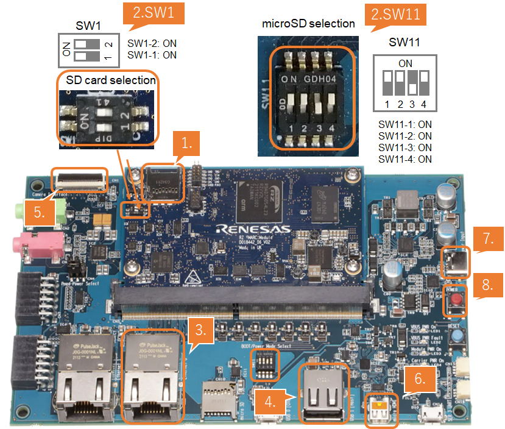

<h3>Set up RZ/V2L Evaluation Board Kit</h3>
To boot the RZ/V2L Evaluation Board, follow the two steps below. 

  Note
  This guide uses the following environment:
  <ul>
      <li><b>Target board</b>:  RZ/V2L Evaluation Board Kit</li>
      <li><b>Boot loader</b>:  eSD Boot loader, the board boots up using the bootloader written on microSD card.</li>
      <li><b>Working directory(${WORK})</b>:  The directory where the downloaded RZ/V2L AI SDK zip file is expanded. Assume that you have already unzipped to /home/{user}/ai_sdk_work and that you have run "$export WORK=/home/{user}/ai_sdk_work".</li>
  </ul>

 

<h4 id="step1_setup_V2Lboard" >Step 1: Setup RZ/V2L Evaluation Board Kit</h4>
You need to prepare a microSD card containing the boot loaders, the Linux kernel, and the root filesystem to boot the board. 
You can use a Linux PC to format the microSD card and expand the kernel and the root filesystem using an SD card reader. 

  Note
  This step is required only when starting the AI SDK or when using the new version of AI SDK. 
  If you have already setup the microSD card with the latest boot loader, Linux kernel, Linux device tree file and root filesystem, skip this step and proceed to <a href="#step2_boot_V2Lboard">the next procedure (2. Boot RZ/V2L Evaluation Board Kit)</a>.

<ol>
  <h5 id="stepa">
    <li type="A">Format SD card </li>
  </h5>
  Create the following partitions on microSD card according to "<a href="{{ site.url }}{{ site.baseurl }}">Format SD card for eSD Boot</a>". 
   
  <table class="gstable">
    <tr>
      <th width=120>Type/Number</th>
      <th>Size</th>
      <th width=120>Filesystem</th>
      <th width=120>Contents</th>
    </tr>
    <tr>
      <td>Primary #1</td>
      <td>500MB (minimum 128MB)</td>
      <td>Ext4</td>
      <td>Linux kernel Device tree</td>
    </tr>
    <tr>
      <td>Primary #2</td>
      <td>All remaining</td>
      <td>Ext4</td>
      <td>Root filesystem</td>
    </tr>
  </table>

  <h5 id="stepb">
    <li type="A">Write the Linux files to SD card</li>
  </h5>
  At first, run the below command to decompress <code>${WORK}/board_setup/eSD.zip</code>. 

cd ${WORK}/board_setup
unzip eSD.zip

  Following three files are necessary, which must be placed on each partitions on microSD card. 
  They are in the <code>${WORK}/board_setup/eSD</code> directory. 
   
  <table class="gstable">
    <tr>
      <th>File</th>
      <th>Description</th>
      <th>microSD card partition</th>
    </tr>
    <tr>
      <td>Image-smarc-rzv2l.bin</td>
      <td>Linux kernel image (The boot program) </td>
      <td>Partition 1</td>
    </tr>
    <tr>
      <td>Image-r9a07g054l2-smarc.dtb </td>
      <td>Linux device tree file (The configuration file for booting) </td>
      <td>Partition 1</td>
    </tr>
    <tr>
      <td>core-image-weston-smarc-rzv2l.tar.bz2</td>
      <td>Linux Root filesystem</td>
      <td>Partition 2</td>
    </tr>
  </table>
  Follow the instruction below to prepare the microSD card. 
  

    Warning
      Here, we use "<b><code>/dev/sdb</code></b>" as microSD card device name.
  

  <ol>
    <li>Check if the two partitions are created successfully by running <code>df</code> command. 

df -h
Filesystem 	Size		Used	Avail	Use %	Mounted on	
...		…		…	…	…	…
/dev/sdb1		…		…	…	…	…	
/dev/sdb2		…		…	…	…	…	

      

          Warning
          Device name of microSD card, <code>/dev/sdb</code> may differ depending on your environment. 
      

    </li>
    <li>Run the following commands to setup the partition 1. 

sudo mkdir -p /mnt/sd
sudo mount /dev/sdb1 /mnt/sd
sudo cp $WORK/board_setup/eSD/Image-smarc-rzv2l.bin /mnt/sd
sudo cp $WORK/board_setup/eSD/Image-r9a07g054l2-smarc.dtb /mnt/sd
sync
sudo umount /mnt/sd

    

      Warning
      Change <code>/dev/sdb</code> to your microSD card device name. 
    

    </li>
    <li>Run the following commands to setup the partition 2, which is the root filesystem of the board. 

sudo mount /dev/sdb2 /mnt/sd
sudo tar xfj $WORK/board_setup/eSD/core-image-weston-smarc-rzv2l.tar.bz2 -C /mnt/sd
sync
sudo umount /mnt/sd

      

        Warning
        Change <code>/dev/sdb</code> to your microSD card device name. 
      

    </li>
  </ol>
  
  <h5 id="stepc">
    <li type="A">Write the bootloaders to SD card
    </li>
  </h5>
  Before booting up the board, you must write the latest bootloaders to microSD card. 
  This procedures needs to be done only once as long as you use the same version of AI SDK. 
   
  There are three files in <code>${WORK}/board_setup/eSD/bootloader</code> to boot up the board. 
  <ul>
    <li><code>bl2_bp_esd-smarc-rzv2l_pmic.bin</code></li>
    <li><code>bl2_bp-smarc-rzv2l_pmic.srec</code></li>
    <li><code>fip-smarc-rzv2l_pmic.srec</code></li>
  </ul>
   
  Run the following commands to write these files to the microSD card to boot for eSD. 

cd ${WORK}/board_setup/eSD/bootloader
sudo dd if=bl2_bp_esd-smarc-rzv2l_pmic.bin of=/dev/sdb seek=1 count=1
sudo dd if=bl2-smarc-rzv2l_pmic.bin of=/dev/sdb seek=8
sudo dd if=fip-smarc-rzv2l_pmic.bin of=/dev/sdb seek=128
sync

  

    Warning
    Change <code>/dev/sdb</code>, to your microSD card device name. 
  

  

    Note
    If you would like to eject the microSD card, please run following command and remove the microSD card from Linux PC.
     

sudo eject /dev/sdb

    

      Warning
      Change <code>/dev/sdb</code> to your microSD card device name. 
    

  

</ol> 
 
<h4 id="step2_boot_V2Lboard" >Step 2: Boot RZ/V2L Evaluation Board Kit</h4>
Once the <a href="#step1_setup_V2Lboard"><b>Setup RZ/V2L Evaluation Board Kit</b></a> chapter has been completed, you can boot the board in the following way.

  

    

      <ol>
        <li>
          Insert the microSD card to the Board.
          

            Note
            Use the microSD card slot <b>CN3</b> as shown in the figure.
          

        </li> 
        <li>Change SW1 and SW11 setting as shown in the figure.</li> 
        <li>Connect an Ethernet cable between the board and Linux PC.
          

            Note
            Use the Ethernet connector <b>Ethernet 0</b> as shown in the figure.
          

        </li>
        <li>Connect the USB mouse and USB keyboard via USB hub.</li> 
        <li>Connect the Google Coral camera to the Board.</li> 
        <li>Connect the HDMI monitor to the Board.</li> 
        <li>Connect the power cable to the Board.</li> 
        <li>Press power button for 1 second to turn on the board.</li>
      </ol>
    

    

      
    

  
  
  

    

      <ol>
        <li value = "9">After the boot-up, following screen will be displayed on HDMI monitor.</li>
      </ol>
    

    

      
    

  

  

    

      <ol>
        <li value = "10">Click the icon at the top-left corner to open the terminal.</li>
      </ol>
    

    

      
    

  

  

    

      <ol>
        <li value = "11">To communicate between your Linux PC and the target board via Ethernet, configure their respective IP addresses. 
        <ul>
          <li><b>Linux PC</b>: 
          This uses the device name of the Ethernet interface "enp2s1" as an example and sets its IP address to <b>192.168.1.10.</b>. 

ifconfig enp2s1 192.168.1.10

          </li>
          <li><b>Target board</b>: 
          Use <b>eth0</b> and set its IP address to <b>192.168.1.11</b>. 

ifconfig eth0 192.168.1.11

          </li> 
        </ul>
        </li>
      </ol>
    

    
       
    

  

