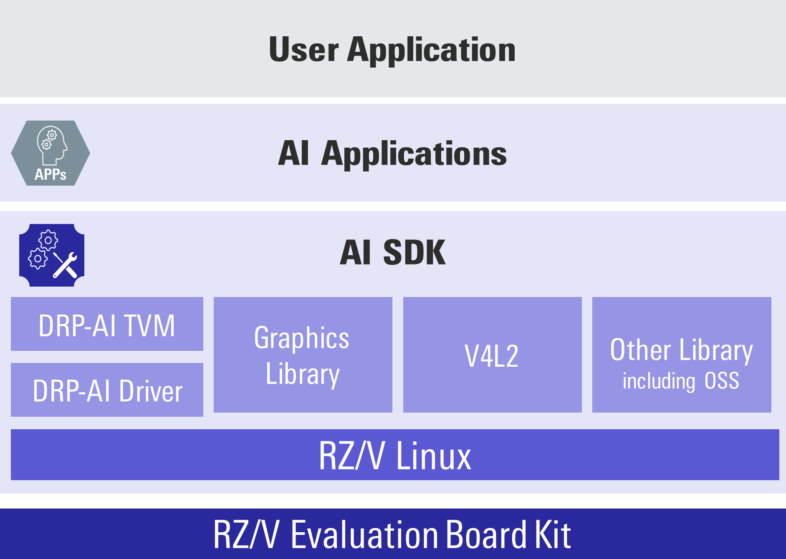
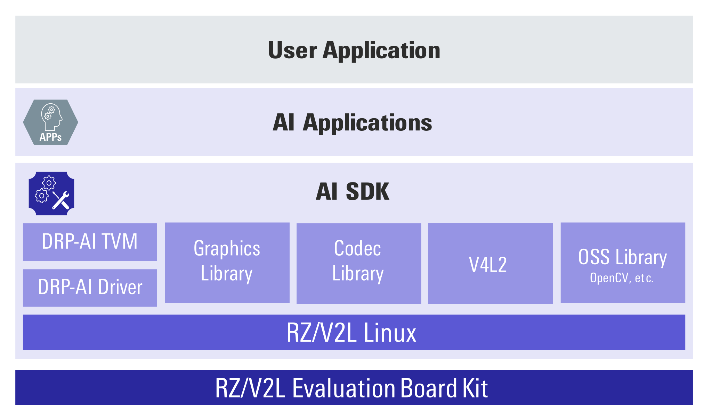
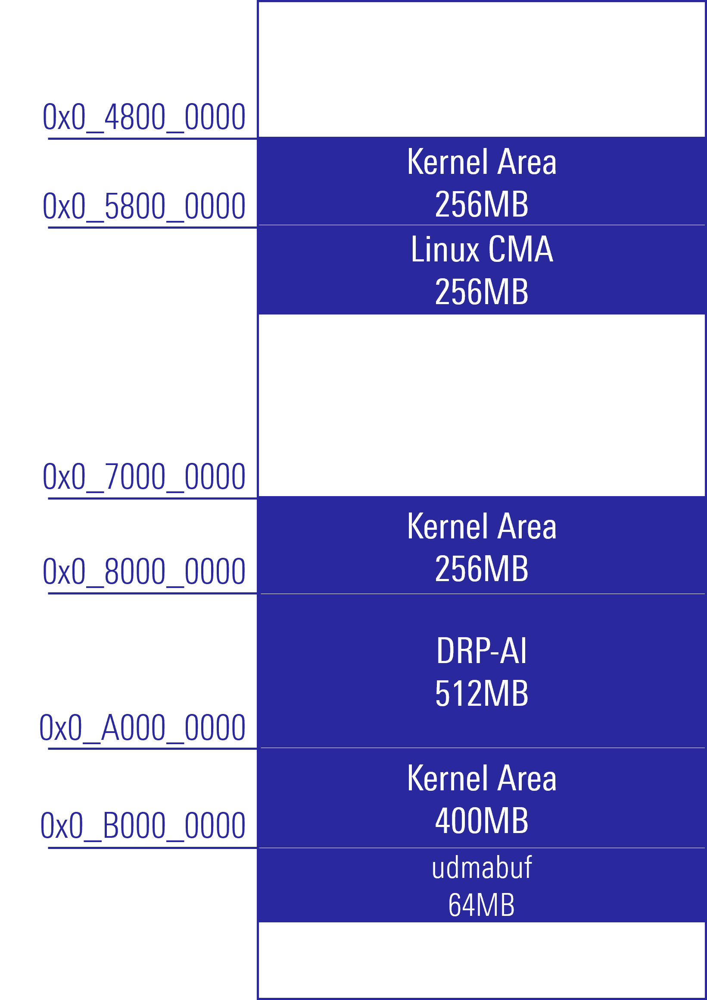
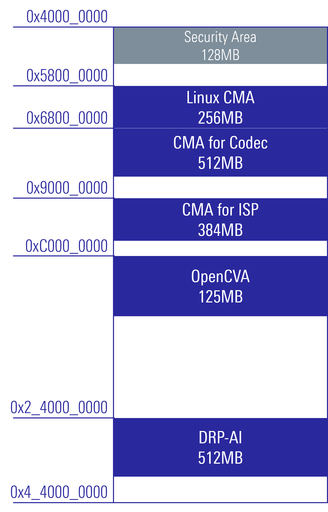

    

        

            AI SDK
        

    

 
 

    

        

            AI Software Development Kit (AI SDK) is an AI application development environment for Evaluation Board Kit of RZ/V series.
             
             
            Since it contains Yocto Linux with bootloader, Linux Kernel, Cross Compiler and a complete set of libraries for DRP-AI and graphics, users can develop AI Applications <b>easily</b> and <b>quickly</b> with AI SDK.
             
            In the AI Applications, USB/MIPI camera can be used with Video for Linux 2 (V4L2) API.
             
             
            AI SDK is specifically made for the supported Evaluation Board Kit with fixed Linux components.
            For those of you who would like to customize Linux environment, i.e., change memory map or develop your own board, you need to build the Yocto Linux source code.
             
            Yocto Linux source code is provided as AI SDK Source Code.
              
            Please refer to How to Build AI SDK page shown below for more details. 
            <a class="btn btn-secondary square-button-gray ms-3 mt-1" style="text-align:left;" href="{{ site.url }}{{ site.baseurl }}" role="button">
            How to Build RZ/V2L AI SDK
            
            How can I build RZ/V2L AI SDK Source Code? 
            
            </a>
             
            <a class="btn btn-secondary square-button-gray ms-3 mt-1" style="text-align:left;" href="{{ site.url }}{{ site.baseurl }}" role="button">
            How to Build RZ/V2H AI SDK
            
            How can I build RZ/V2H AI SDK Source Code? 
            
            </a>
             
             
            AI SDK has a CUI enviroment and a GUI environment. 
            Each has the following functions. 
            <table class="gstable mt-1">
                <tr>
                    <th>Functions</th>
                    <th>CUI env.</th>
                    <th>GUI env. (e2 studio)</th>
                </tr>
                <tr>
                    <td>Install AI SDK</td>
                    <td>&#10004;</td>
                    <td>&#10004;</td>
                </tr>
                <tr>
                    <td>Build AI Applications</td>
                    <td>&#10004;</td>
                    <td>&#10004;<a href="#footnote_gui">*1</a></td>
                </tr>
                <tr>
                    <td>Build AI SDK</td>
                    <td>&#10004;</td>
                    <td>-</td>
                </tr>
                <tr>
                    <td>Transfer Learning</td>
                    <td>-</td>
                    <td>&#10004;<a href="#footnote_gui">*1</a></td>
                </tr>
            </table>
            *1: There is a limit to the number of AI Applications supported.
             
             
             
            For more information, see each AI SDK download page. 
            <a class="btn btn-secondary square-button ms-3 mt-1" style="text-align:left;" href="{{ site.url }}{{ site.baseurl }}" role="button">
                Board and Software
                
                Get the board and software for RZ/V series. 
                
            </a>
             
             
             
        

        

             
        

    

    

        

            <h3>Key Features</h3>
            AI SDK provides following components.
             
             
            <h6>
            <!-- Memo: Need to update based on the AI SDK Release Note. -->
            <!-- <table class="gstable">
                <tr>
                    <th>Items</th>
                    <th>Details</th>
                    <th>RZ/V2L AI SDK</th>
                    <th>RZ/V2H AI SDK</th>
                </tr>
                <tr>
                    <td>Bootloader</td>
                    <td>Files to boot the board.</td>
                    <td rowspan="3">Provided as individual files. Supports eSD/eMMC bootloader.</td>
                    <td rowspan="3">Provided as WIC format image. Supports eSD bootloader.</td>
                </tr>
                <tr>
                    <td>Linux Kernel Files</td>
                    <td>Pre-build binary files for RZ/V Linux Kernel.</td>
                </tr>
                <tr>
                    <td>Root filesystem</td>
                    <td>Filesystem for the RZ/V Linux.</td>
                </tr>
                <tr>
                    <td>Cross Compiler</td>
                    <td>Compiler for Linux application on RZ/V Linux.</td>
                    <td colspan="2">Provided as cross compiler installer.</td>
                </tr>
                <tr>
                    <td>AI SDK Installer</td>
                    <td>Installer for AI application development environment on Docker.</td>
                    <td colspan="2">Provided as Dockerfile that clones <a href="https://github.com/renesas-rz/rzv_drp-ai_tvm">DRP-AI TVM</a>.</td>
                </tr>
            </table> -->
            <table class="gstable">
                <tr>
                    <th>Package</th>
                    <th>Items</th>
                    <th>Details</th>
                    <th>RZ/V2L AI SDK</th>
                    <th>RZ/V2H AI SDK</th>
                </tr>
                <tr>
                    <td rowspan="5">AI SDK</td>
                    <td>Bootloader</td>
                    <td>Files to boot the board.</td>
                    <td rowspan="3">Provided as individual files. Supports eSD/eMMC Bootloader.</td>
                    <td rowspan="3">Included in WIC format image. Supports eSD Bootloader.</td>
                </tr>
                <tr>
                    <td>Linux Kernel Files</td>
                    <td>Pre-build binary files for RZ/V Linux Kernel.</td>
                </tr>
                <tr>
                    <td>Root filesystem</td>
                    <td>Filesystem for the RZ/V Linux.</td>
                </tr>
                <tr>
                    <td>Cross Compiler</td>
                    <td>Compiler for Linux application on RZ/V Linux.</td>
                    <td colspan="2">Provided as cross compiler installer.</td>
                </tr>
                <tr>
                    <td>AI SDK Installer</td>
                    <td>Installer for AI application development environment on Docker.</td>
                    <td colspan="2">Provided as a Dockerfile that clones <a href="https://github.com/renesas-rz/rzv_drp-ai_tvm">DRP-AI TVM</a>.</td>
                </tr>
                <tr>
                    <td rowspan="2">AI SDK Source Code</td>
                    <td>Yocto Linux Recipe</td>
                    <td>Linux source code of AI SDK.</td>
                    <td colspan="2">Provided as a tar file.</td>
                </tr>
                <tr>
                    <td>OSS Source Code</td>
                    <td>Source code of Open Source Software pakcages used to build AI SDK.</td>
                    <td>Provided as a 7z file.</td>
                    <td>Not provided in v3.00.</td>
                </tr>
            </table>
            </h6>
        
 
        

            <h4 class="u_line">Supported Devices</h4>
                <ul>
                    <li>RZ/V2L Evaluation Board Kit : <a href="#v2l-component">RZ/V2L AI SDK Components</a></li>
                    <li>RZ/V2H Evaluation Board Kit : <a href="#v2h-component">RZ/V2H AI SDK Components</a></li>
                </ul>
                 
        

    

    

        

            <h4 class="u_line" id="v2l-component">RZ/V2L AI SDK Components</h4>
        

        

                RZ/V2L AI SDK contains following components.
                <ul>
                    <li>DRP-AI TVM</li>
                    <li>RZ/V2L Linux BSP 
                        <ul>
                            <li>DRP-AI Driver</li>
                            <li>Other device drivers</li>
                        </ul>
                    </li>
                    <li>Graphics Library Evaluation Version *2</li>
                    <li>Video Codec Library Evaluation Version *2 (H.264)</li>
                    <li>Video for Linux 2 (V4L2)</li>
                    <li>Other OSS packages
                        <ul>
                            <li>OpenCV</li>
                            <li>Tesseract</li>
                        </ul>
                    </li>
                </ul>
             
            For more information on AI SDK, see RZ/V2L AI SDK Release Note from the AI SDK download page. 
            <a class="btn btn-secondary square-button ms-3 mt-1" style="text-align:left;" href="{{ site.url }}{{ site.baseurl }}" role="button">
                Board and Software
                
                Get the board and software for RZ/V series. 
                
            </a>
             
            For more information on AI SDK Source Code, see How to Build AI SDK page. 
            <a class="btn btn-secondary square-button-gray ms-3 mt-1" style="text-align:left;" href="{{ site.url }}{{ site.baseurl }}" role="button">
            How to Build RZ/V2L AI SDK
            
            How can I build RZ/V2L AI SDK Source Code? 
            
            </a>
             
             
        

        

             
        

        

            <h6>
                *2: Note that Graphics Library and Video Codecs Library Evaluation Version have a limitation that system stops running after around 10 hours. 
                If you would like to use unristricted version, please build AI SDK with Graphics Library Unristrictd Version and Video Codecs Library Unristricted Version according to <a href="{{ site.url }}{{ site.baseurl }}" role="button">How to Build RZ/V2L AI SDK</a>. 
            </h6>
        

        

            The memory map of RZ/V2L AI SDK is as follows.  
            
              
        

    

    

        

            <h4 class="u_line" id="v2h-component">RZ/V2H AI SDK Components</h4>
        

        

            RZ/V2H AI SDK contains following components.
            <ul>
                <li>DRP-AI TVM</li>
                <li>RZ/V2H Linux BSP 
                    <ul>
                        <li>DRP-AI Driver [<a href="https://github.com/renesas-rz/rzv2h_drp-ai_driver">GitHub</a>]</li>
                        <li>e-CAM22_CURZH camera driver (MIPI) *3</li>
                        <li>Other device drivers [<a href="https://www.renesas.com/document/mas/rzv2h-bsp-manual-set-rtk0ef0045z94001azj-v100zip">Manual</a>]</li>
                    </ul>
                </li>
                <li>Graphics Library Evaluation Version *4</li>
                <li>Video Codec Library *5</li>
                <li>Video for Linux 2 (V4L2) supporting USB camera</li>
                <li>OpenCV Accelerator (supporting OpenCV 4.1.0) [<a href="https://github.com/renesas-rz/rzv2h_opencv_accelerator">GitHub</a>]</li>
                <li>Other OSS packages
                    <ul>
                        <li>Tesseract</li>
                    </ul>
                </li>
            </ul>
             
            For more information on AI SDK, see RZ/V2H AI SDK Release Note from the AI SDK download page. 
            <a class="btn btn-secondary square-button ms-3 mt-1" style="text-align:left;" href="{{ site.url }}{{ site.baseurl }}" role="button">
                Board and Software
                
                Get the board and software for RZ/V series. 
                
            </a>
             
            For more information on AI SDK Source Code, see How to Build AI SDK page. 
            <a class="btn btn-secondary square-button-gray ms-3 mt-1" style="text-align:left;" href="{{ site.url }}{{ site.baseurl }}" role="button">
            How to Build RZ/V2H AI SDK
            
            How can I build RZ/V2H AI SDK Source Code? 
            
            </a>
             
             
        

        

             
        

        

            <h6>
                *3: To use e-CAM22_CURZH camera, see <a href="https://www.e-consystems.com/renesas/sony-starvis-imx462-ultra-low-light-camera-for-renesas-rz-v2h.asp">e-con Systems</a>. 
                *4: Note that Graphics Library Evaluation Version has a limitation that system stops running after around 10 hours. 
                If you would like to use unrestricted version, please build AI SDK with Graphics Library Unrestricted Version according to <a href="{{ site.url }}{{ site.baseurl }}" role="button">How to Build RZ/V2H AI SDK</a>. 
                *5: Video Codec Library support only H.264 Enc in v3.00. 
                H.265 Enc/Dec and H.264 Dec will be supported later. 
            </h6>
        

        

            The memory map of RZ/V2H AI SDK is as follows.  
            
              
        

    

    

        

            <a class="btn btn-secondary square-button" href="{{ site.url }}{{ site.baseurl }}" role="button">
                Back to Home >
            </a>
        

    

