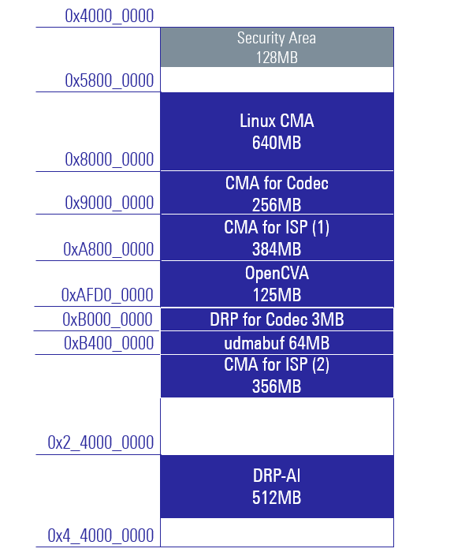
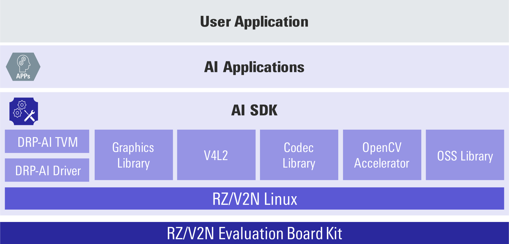
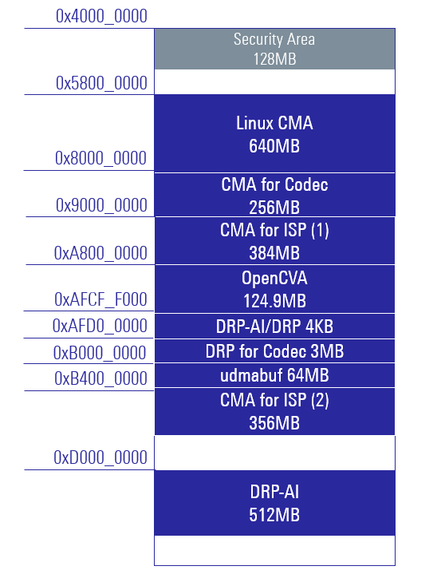

<!-- Title -->

    

        

            RZ/V AI SDK Overview
        

    

 
 

<!-- Contents -->

    

        

            <!-- AI SDK Introduction -->
            AI Software Development Kit (AI SDK) is an AI application development environment for Evaluation Board Kit of RZ/V series.
             
             
            Since it contains Yocto Linux with bootloader, Linux Kernel, Cross Compiler and a complete set of libraries for DRP-AI and graphics, users can develop AI Applications <b>easily</b> and <b>quickly</b> with AI SDK.
             
            In the AI Applications, USB/MIPI camera can be used with Video for Linux 2 (V4L2) API.
             
             
            <!-- Board Dependence -->
            AI SDK is specifically made for the supported Evaluation Board Kit with fixed Linux components.
            For those of you who would like to customize Linux environment, i.e., change memory map or develop your own board, you need to build the Yocto Linux source code.
             
            <!-- Reference to AI SDK Source Code -->
            Yocto Linux source code is provided as AI SDK Source Code.
             
             
            Please refer to How to Build AI SDK page shown below for more details.
             
            <a class="btn btn-secondary square-button-gray ms-3 mt-1" style="text-align:left;" href="{{ site.url }}{{ site.baseurl }}" role="button" target="_blank" rel="noopener noreferrer">
                How to Build RZ/V2L AI SDK
                
                    How can I build RZ/V2L AI SDK Source Code? 
                
            </a>
             
            <a class="btn btn-secondary square-button-gray ms-3 mt-1" style="text-align:left;" href="{{ site.url }}{{ site.baseurl }}" role="button" target="_blank" rel="noopener noreferrer">
                How to Build RZ/V2H AI SDK
                
                    How can I build RZ/V2H AI SDK Source Code? 
                
            </a>
             
            <a class="btn btn-secondary square-button-gray ms-3 mt-1" style="text-align:left;" href="{{ site.url }}{{ site.baseurl }}" role="button" target="_blank" rel="noopener noreferrer">
                How to Build RZ/V2N AI SDK
                
                    How can I build RZ/V2N AI SDK Source Code? 
                
            </a>
             
             
            <!-- Reference to GUI -->
            AI SDK has a CUI environment and a GUI environment.
             
            Each has the following functions.
             
            <table class="gstable mt-1">
                <tr>
                    <th>Functions</th>
                    <th>CUI env.</th>
                    <th>GUI env. (e2 studio)</th>
                </tr>
                <tr>
                    <td>Install AI SDK</td>
                    <td>&#10004;</td>
                    <td>&#10004;</td>
                </tr>
                <tr>
                    <td>Build AI Applications</td>
                    <td>&#10004;</td>
                    <td>&#10004;<a href="#footnote_gui">*1</a></td>
                </tr>
                <tr>
                    <td>Build AI SDK</td>
                    <td>&#10004;</td>
                    <td>-</td>
                </tr>
                <tr>
                    <td>Transfer Learning</td>
                    <td>-</td>
                    <td>&#10004;<a href="#footnote_gui">*1</a></td>
                </tr>
            </table>
            *1: There is a limit to the number of AI Applications supported.
             
             
             
            <!-- Reference to AI SDK download page -->
            For more information, see each AI SDK download page. 
            <a class="btn btn-secondary square-button ms-3 mt-1" style="text-align:left;" href="{{ site.url }}{{ site.baseurl }}" role="button">
                Board and Software
                
                    Get the board and software for RZ/V series. 
                
            </a>
             
             
             
        

        <!-- Software Block Diagram -->
        

            
             
        

    

    

        

            <h3 id="features">
                Key Features
            </h3>
            <h4 id="devices" class="u_line">
                Supported Devices
            </h4>
            <ul>
                <li>
                    <a href="https://www.renesas.com/products/microcontrollers-microprocessors/rz-mpus/rzv2l-evkit-smarc-som-evaluation-kit-rzv2l-mpu-ai-accelerator" target="_blank" rel="noopener noreferrer">
                        RZ/V2L Evaluation Board Kit
                    </a>
                </li>
                <li>
                    <a href="https://www.renesas.com/products/microcontrollers-microprocessors/rz-mpus/rzv2h-evk-rzv2h-quad-core-vision-ai-mpu-evaluation-kit" target="_blank" rel="noopener noreferrer">
                        RZ/V2H Evaluation Board Kit
                    </a>
                </li>
                <li>
                    <a href="https://www.renesas.com/rzv2n-evkit" target="_blank" rel="noopener noreferrer">
                        RZ/V2N Evaluation Board Kit
                    </a>
                </li>
            </ul>
             
            <h4 id="files" class="u_line">
                File Contents
            </h4>
            AI SDK provides following files.
             
             
            <h6>
                <!-- Memo: Need to update based on the AI SDK Release Note. -->
                <!-- 
                    rowspan= concate rows
                    colspan= concate columns
                -->
                <table class="gstable">
                    <tr>
                        <th>Package</th>
                        <th colspan="2">Items</th>
                        <th>Details</th>
                        <th>RZ/V2L AI SDK</th>
                        <th>RZ/V2H AI SDK</th>
                        <th>RZ/V2N AI SDK</th>
                    </tr>
                    <tr>
                        <td rowspan="9">    <!-- Package -->
                            AI SDK
                        </td>
                        <td colspan="2">    <!-- Item -->
                            Release Note
                        </td>
                        <td>                <!-- Details -->
                            PDF documentation that contains RZ/V AI SDK release information.
                        </td>
                        <td colspan="3">    <!-- RZ/V2L & RZ/V2H & RZ/V2N -->
                            Contains list of files provided in RZ/V AI SDK.
                        </td>
                    </tr>
                    <tr>
                        <td rowspan="3">    <!-- Item -->
                            <code>
                                board_setup
                            </code>
                        </td>
                        <td>                <!-- board_setup : Item -->
                            Bootloader
                        </td>
                        <td>                <!-- Details -->
                            Files to boot the board.
                        </td>
                        <td rowspan="3">    <!-- RZ/V2L -->
                            Provided as individual files.
                             
                            Supports eSD/QSPI Bootloader.
                        </td>
                        <td rowspan="3">    <!-- RZ/V2H -->
                            Included in WIC format image.
                             
                            Supports eSD Bootloader.
                        </td>
                        <td rowspan="3">    <!-- RZ/V2N -->
                            Provided as individual files.
                             
                            Supports eSD/xSPI Bootloader.
                        </td>
                    </tr>
                    <tr>
                        <td>                <!-- board_setup : Item -->
                            Linux Kernel Files
                        </td>
                        <td>                <!-- Details -->
                            Pre-build binary files for RZ/V Linux Kernel.
                        </td>
                    </tr>
                    <tr>
                        <td>                <!-- board_setup : Item -->
                            Root filesystem
                        </td>
                        <td>                <!-- Details -->
                            Filesystem for the RZ/V Linux.
                        </td>
                    </tr>
                    <tr>
                        <td rowspan="3">    <!-- Item -->
                            <code>
                                ai_sdk_setup
                            </code>
                        </td>
                        <td>                <!-- ai_sdk_setup: Item -->
                            AI SDK Installer
                        </td>
                        <td>                <!-- Details -->
                            Installer for AI application development environment on Docker.
                        </td>
                        <td colspan="3">    <!-- RZ/V2L & RZ/V2H & RZ/V2N -->
                            Provided as a Dockerfile that clones 
                            <a href="https://github.com/renesas-rz/rzv_drp-ai_tvm">
                                DRP-AI TVM
                            </a>.
                        </td>
                    </tr>
                    <tr>
                        <td>                <!-- ai_sdk_setup: Item -->
                            Cross Compiler
                        </td>
                        <td>                <!-- Details -->
                            Compiler for Linux application on RZ/V Linux, which is used by AI SDK Installer.
                        </td>
                        <td colspan="3">    <!-- RZ/V2L & RZ/V2H & RZ/V2N -->
                            Provided as cross compiler installer.
                        </td>
                    </tr>
                    <tr>
                        <td>                <!-- ai_sdk_setup: Item -->
                            DRP-AI Translator Installer
                        </td>
                        <td>                <!-- Details -->
                            Installer for DRP-AI Translator, which is used by AI SDK Installer.
                        </td>
                        <td>                <!-- RZ/V2L -->
                            Provided as an installer taken from 
                            <a href="https://www.renesas.com/products/microcontrollers-microprocessors/rz-arm-based-high-end-32-64-bit-mpus/drp-ai-translator">
                                DRP-AI Translator
                            </a>
                            .
                        </td>
                        <td colspan="2">    <!-- RZ/V2H & RZ/V2N -->
                            Provided as an installer taken from 
                            <a href="https://www.renesas.com/software-tool/drp-ai-translator-i8">
                                DRP-AI Translator i8
                            </a>
                            .
                        </td>
                    </tr>
                    <tr>
                        <td>                <!-- Item -->
                            <code>
                                documents
                            </code>
                        </td>
                        <td>                <!-- documents : Item -->
                            Related Documents
                        </td>
                        <td>                <!-- Details -->
                            PDF documentation that contains RZ/V AI SDK related information.
                        </td>
                        <td colspan="3">    <!-- RZ/V2L & RZ/V2H & RZ/V2N -->
                            Includes DRP-AI Translator User's Manual and list of Linux license information.
                        </td>
                    </tr>
                    <tr>
                        <td>                <!-- Item -->
                            <code>
                                references
                            </code>
                        </td>
                        <td>                <!-- references : Item -->
                            Reference information
                        </td>
                        <td>                <!-- Details -->
                            Files that is refered by Linux license information documentation.
                        </td>
                        <td colspan="3">    <!-- RZ/V2L & RZ/V2H & RZ/V2N -->
                            Includes linux manifest file, etc..
                        </td>
                    </tr>
                    <tr>
                        <td rowspan="3">    <!-- Package -->
                            AI SDK Source Code
                        </td>
                        <td colspan="2">    <!-- Item -->
                            README
                        </td>
                        <td>                <!-- Details -->
                            Release information of AI SDK Source Code
                        </td>
                        <td colspan="3">    <!-- RZ/V2L & RZ/V2H & RZ/V2N -->
                            Provided as a txt file.
                        </td>
                    </tr>
                    <tr>
                        <td colspan="2">    <!-- Item -->
                            Yocto Linux Recipe
                        </td>
                        <td>                <!-- Details -->
                            Linux source code of AI SDK.
                        </td>
                        <td colspan="3">    <!-- RZ/V2L & RZ/V2H & RZ/V2N -->
                            Provided as a tar file.
                        </td>
                    </tr>
                    <tr>
                        <td colspan="2">    <!-- Item -->
                            OSS Source Code
                        </td>
                        <td>                <!-- Details -->
                            Source code of Open Source Software packages used to build AI SDK.
                        </td>
                        <td colspan="3">    <!-- RZ/V2L & RZ/V2H & RZ/V2N -->
                            Provided as a 7z file.
                        </td>
                    </tr>
                </table>
            </h6>
            To check more details, please see each Release Note/README provided in the package.
             
        
 
    

     
     
    

        

            <h3 id="Specification">
                AI SDK Specification
            </h3>
            <ul>
                <li>
                    <a href="#v2l-spec">
                        RZ/V2L AI SDK Specification
                    </a>
                </li>
                <li>
                    <a href="#v2h-spec">
                        RZ/V2H AI SDK Specification
                    </a>
                </li>
                <li>
                    <a href="#v2n-spec">
                        RZ/V2N AI SDK Specification
                    </a>
                </li>
            </ul>
             
            <h3 id="v2l-spec">
                RZ/V2L AI SDK Specification
            </h3>
            <h5>
                <b>
                    Target Version: 5.00
                </b>
            </h5>
        

        

            <h4 class="u_line" id="v2l-overview">
                Overview
            </h4>
        

        

                RZ/V2L AI SDK configuration is as follows.
                 
                <ul>
                    <li>
                        DRP-AI TVM v2.3.0 
                        [
                            <a href="https://github.com/renesas-rz/rzv_drp-ai_tvm" target="_blank" rel="noopener noreferrer">
                                GitHub
                            </a>
                        ]
                    </li>
                    <li>
                        RZ/V2L Verified Linux Package v3.0.6 
                        [
                            <a href="https://www.renesas.com/software-tool/rzv-verified-linux-package" target="_blank" rel="noopener noreferrer">
                                Renesas Web
                            </a>
                        ]
                        <ul>
                            <li>
                                Video for Linux 2 (V4L2)
                            </li>
                            <li>
                                Other device drivers
                                 
                                (See RZ/V2L Verified Linux Package Release Note.)
                            </li>
                        </ul>
                    </li>
                    <li>
                        Graphics Library Unrestricted Version v1.2.2 
                        [
                            <a href="https://www.renesas.com/products/microcontrollers-microprocessors/rz-arm-based-high-end-32-64-bit-mpus/rz-mpu-graphics-library-evaluation-version-rzv2l" target="_blank" rel="noopener noreferrer">
                                Renesas Web
                            </a>
                        ]
                    </li>
                    <li>
                        Video Codec Library Unrestricted Version v1.2.2 
                        (H.264)
                        [
                            <a href="https://www.renesas.com/products/microcontrollers-microprocessors/rz-arm-based-high-end-32-64-bit-mpus/rz-mpu-video-codec-library-evaluation-version-rzv2l" target="_blank" rel="noopener noreferrer">
                                Renesas Web
                            </a>
                        ]
                    </li>
                    <li>
                        RZ/V2L DRP-AI Support Package v7.50 
                        [
                            <a href="https://www.renesas.com/products/microcontrollers-microprocessors/rz-arm-based-high-end-32-64-bit-mpus/rzv2l-drp-ai-support-package" target="_blank" rel="noopener noreferrer">
                                Renesas Web
                            </a>
                        ]
                        <ul>
                            <li>
                                DRP-AI Driver
                            </li>
                            <li>
                                OpenCV 4.1.0
                            </li>
                        </ul>
                    </li>
                    <li>
                        Other OSS packages
                        <ul>
                            <li>
                                Tesseract 3.05.01 (tesseract, tesseract-lang)
                            </li>
                        </ul>
                    </li>
                </ul>
             
            <!-- Reference to V2L configuration page -->
            For more information on RZ/V2L AI SDK, see the page below.
             
            <a class="btn btn-secondary square-button ms-3 mt-1" style="text-align:left;" href="{{ site.url }}{{ site.baseurl }}" role="button" target="_blank" rel="noopener noreferrer">
                RZ/V2L AI SDK Configuration
                
                    See Linux Components information. 
                    See Limitations. 
                
            </a>
             
             
            <!-- Reference to V2L How to Build page -->
            For more information on AI SDK Source Code, see How to Build AI SDK page. 
            <a class="btn btn-secondary square-button-gray ms-3 mt-1" style="text-align:left;" href="{{ site.url }}{{ site.baseurl }}" role="button" target="_blank" rel="noopener noreferrer">
                How to Build RZ/V2L AI SDK
                
                    How can I build RZ/V2L AI SDK Source Code? 
                
            </a>
             
             
        

        

            
             
        

        

            <h4 class="u_line" id="v2l-mem">
                Memory Map
            </h4>
            The memory map of RZ/V2L AI SDK is as follows.
              
            
             
             
        

    

    

        

            <h3 id="v2h-spec">
                RZ/V2H AI SDK Specification
            </h3>
            <h5>
                <b>
                    Target Version: 5.20
                </b>
            </h5>
        

        

            <h4 class="u_line" id="v2h-overview">
                Overview
            </h4>
        

        

            RZ/V2H AI SDK configuration is as follows.
            <ul>
                <li>
                    DRP-AI TVM v2.3.0 
                    [
                        <a href="https://github.com/renesas-rz/rzv_drp-ai_tvm" target="_blank" rel="noopener noreferrer">
                            GitHub
                        </a>
                    ]
                    <a href="#footnote_v2h_drp_ai">
                        
                            *2
                        
                    </a>
                </li>
                <li>
                    RZ/V2H Linux BSP v1.0.2
                    [
                        <a href="{{ site.url }}{{ site.baseurl }}" target="_blank" rel="noopener noreferrer">
                            Configuration
                        </a>
                    ]
                    <ul>
                        <li>
                            DRP-AI Driver v1.20 
                            [
                                <a href="https://github.com/renesas-rz/rzv2h_drp-ai_driver" target="_blank" rel="noopener noreferrer">
                                    GitHub
                                </a>
                            ]
                        </li>
                        <li>
                            e-CAM22_CURZH camera driver (MIPI) 
                            <a href="#footnote_v2h_ecam">
                                
                                    *1
                                
                            </a>
                        </li>
                        <li>
                            Video for Linux 2 (V4L2) including the support for USB camera
                        </li>
                        <li>
                            Other device drivers 
                            [
                                <a href="{{ site.url }}{{ site.baseurl }}#v2h-driver" target="_blank" rel="noopener noreferrer">
                                    List
                                </a>
                            ]
                            [
                                <a href="https://www.renesas.com/document/mas/rzv2h-and-rzv2n-bsp-manual-set-rtk0ef0045z94001azj-v103zip">
                                    Manual
                                </a>
                            ]
                        </li>
                    </ul>
                </li>
                <li>
                    Graphics Library Unrestricted Version v3.1.2.3
                </li>
                <li>
                    Video Codec Library v3.3.3.2
                    <a href="#footnote_v2h_drp_ai">
                        
                            *2
                        
                    </a>
                </li>
                <li>
                    OpenCV Accelerator v1.20 (supporting OpenCV 4.1.0) 
                    [
                        <a href="https://github.com/renesas-rz/rzv2h_opencv_accelerator" target="_blank" rel="noopener noreferrer">
                            GitHub
                        </a>
                    ]
                    <a href="#footnote_v2h_drp_ai">
                        
                            *2
                        
                    </a>
                </li>
                <li>
                    Other OSS packages
                    <ul>
                        <li>
                            Tesseract v3.05.01 (tesseract, tesseract-lang)
                        </li>
                        <li>
                            OpenMP v8.3.0
                        </li>
                    </ul>
                </li>
            </ul>
             
            <!-- Reference to V2H configuration page -->
            For more information on RZ/V2H AI SDK, see the page below.
             
            <a class="btn btn-secondary square-button ms-3 mt-1" style="text-align:left;" href="{{ site.url }}{{ site.baseurl }}" role="button" target="_blank" rel="noopener noreferrer">
                RZ/V2H AI SDK Configuration
                
                    See Linux Components information. 
                    See Drivers list. 
                    See Limitations. 
                
            </a>
             
             
            <!-- Reference to V2H How to Build page -->
            For more information on AI SDK Source Code, see How to Build AI SDK page. 
            <a class="btn btn-secondary square-button-gray ms-3 mt-1" style="text-align:left;" href="{{ site.url }}{{ site.baseurl }}" role="button" target="_blank" rel="noopener noreferrer">
                How to Build RZ/V2H AI SDK
                
                    How can I build RZ/V2H AI SDK Source Code? 
                
            </a>
             
             
        

        

            
             
        

        

            <h6>
                
                    *1: To use e-CAM22_CURZH camera, see <a href="https://www.e-consystems.com/renesas/sony-starvis-imx462-ultra-low-light-camera-for-renesas-rz-v2h.asp" target="_blank" rel="noopener noreferrer">e-con Systems</a>.
                     
                
                
                    *2: RZ/V2H is equipped with 2 IPs, DRP-AI and DRP. Please see <a href="https://www.renesas.com/products/microcontrollers-microprocessors/rz-mpus/rzv2h-quad-core-vision-ai-mpu-drp-ai3-accelerator-and-high-performance-real-time-processor" target="_blank" rel="noopener noreferrer">RZ/V2H block diagram</a>. 
                    DRP-AI is used by DRP-AI TVM. DRP use is shared by OpenCV Accelerator and Video Codec Library (decoding function). 
                    Therefore, OpenCV Accelerator and Video Codec Library (decoding function) cannot be used at the same time. 
                
            </h6>
        

        

            <h4 class="u_line" id="v2h-mem">
                Memory Map
            </h4>
            The memory map of RZ/V2H AI SDK is as follows.
             
             
            
             
             
        

    

    

        

            <h3 id="v2n-spec">
                RZ/V2N AI SDK Specification
            </h3>
            <h5>
                <b>
                    Target Version: 5.00
                </b>
            </h5>
        

        

            <h4 class="u_line" id="v2n-overview">
                Overview
            </h4>
        

        

            RZ/V2N AI SDK configuration is as follows.
            <ul>
                <li>
                    DRP-AI TVM v2.3.0 
                    [
                        <a href="https://github.com/renesas-rz/rzv_drp-ai_tvm" target="_blank" rel="noopener noreferrer">
                            GitHub
                        </a>
                    ]
                    <a href="#footnote_v2n_drp_ai">
                        
                            *4
                        
                    </a>
                </li>
                <li>
                    RZ/V2N Linux BSP v1.0.0
                    [
                        <a href="{{ site.url }}{{ site.baseurl }}" target="_blank" rel="noopener noreferrer">
                            Configuration
                        </a>
                    ]
                    <ul>
                        <li>
                            DRP-AI Driver v1.20 
                            [
                                <a href="https://github.com/renesas-rz/rzv2n_drp-ai_driver" target="_blank" rel="noopener noreferrer">
                                    GitHub
                                </a>
                            ]
                        </li>
                        <li>
                            e-CAM22_CURZH camera driver (MIPI) v1.00
                            <a href="#footnote_v2n_ecam">
                                
                                    *3
                                
                            </a>
                        </li>
                        <li>
                            Video for Linux 2 (V4L2) including the support for USB camera
                        </li>
                        <li>
                            Other device drivers 
                            [
                                <a href="{{ site.url }}{{ site.baseurl }}#v2n-driver" target="_blank" rel="noopener noreferrer">
                                    List
                                </a>
                            ]
                            [
                                <a href="https://www.renesas.com/document/mas/rzv2h-and-rzv2n-bsp-manual-set-rtk0ef0045z94001azj-v103zip">
                                    Manual
                                </a>
                            ]
                        </li>
                    </ul>
                </li>
                <li>
                    Graphics Library Unrestricted Version v3.1.2.3
                </li>
                <li>
                    Video Codec Library v3.3.3.1
                    <a href="#footnote_v2n_drp_ai">
                        
                            *4
                        
                    </a>
                </li>
                <li>
                    OpenCV Accelerator v1.10 (supporting OpenCV 4.1.0) 
                    [
                        <a href="https://github.com/renesas-rz/rzv2n_opencv_accelerator" target="_blank" rel="noopener noreferrer">
                            GitHub
                        </a>
                    ]
                    <a href="#footnote_v2n_drp_ai">
                        
                            *4
                        
                    </a>
                </li>
                <li>
                    Other OSS packages
                    <ul>
                        <li>
                            Tesseract v3.05.01 (tesseract, tesseract-lang)
                        </li>
                        <li>
                            OpenMP v8.3.0
                        </li>
                    </ul>
                </li>
            </ul>
             
            <!-- Reference to V2N configuration page -->
            For more information on RZ/V2N AI SDK, see the page below.
             
            <a class="btn btn-secondary square-button ms-3 mt-1" style="text-align:left;" href="{{ site.url }}{{ site.baseurl }}" role="button" target="_blank" rel="noopener noreferrer">
                RZ/V2N AI SDK Configuration
                
                    See Linux Components information. 
                    See Drivers list. 
                    See Limitations. 
                
            </a>
             
             
            <!-- Reference to V2N How to Build page -->
            For more information on AI SDK Source Code, see How to Build AI SDK page. 
            <a class="btn btn-secondary square-button-gray ms-3 mt-1" style="text-align:left;" href="{{ site.url }}{{ site.baseurl }}" role="button" target="_blank" rel="noopener noreferrer">
                How to Build RZ/V2N AI SDK
                
                    How can I build RZ/V2N AI SDK Source Code? 
                
            </a>
             
             
        

        

            
             
        

        

            <h6>
                
                    *3: To use e-CAM22_CURZH camera, see <a href="https://www.e-consystems.com/renesas/sony-starvis-imx462-ultra-low-light-camera-for-renesas-rz-v2h.asp" target="_blank" rel="noopener noreferrer">e-con Systems</a>.
                     
                
                
                    *4: RZ/V2N is equipped with single IP, DRP-AI. (DRP is not equipped.) Please see <a href="https://www.renesas.com/products/microcontrollers-microprocessors/rz-mpus/rzv2n-15tops-quad-core-vision-ai-mpu-2-camera-connection-and-excellent-power-efficiency" target="_blank" rel="noopener noreferrer">RZ/V2N block diagram</a>. 
                    DRP-AI use is shared by DRP-AI TVM, OpenCV Accelerator and Video Codec Library (decoding function). 
                    Therefore, these software cannot be used at the same time. 
                
            </h6>
        

        

            <h4 class="u_line" id="v2n-mem">
                Memory Map
            </h4>
            The memory map of RZ/V2N AI SDK is as follows.
             
             
            
             
             
        

    

    

        

            <a class="btn btn-secondary square-button" href="{{ site.url }}{{ site.baseurl }}" role="button">
                Back to Home >
            </a>
        

    

