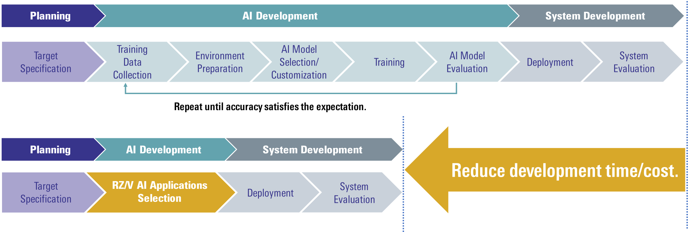
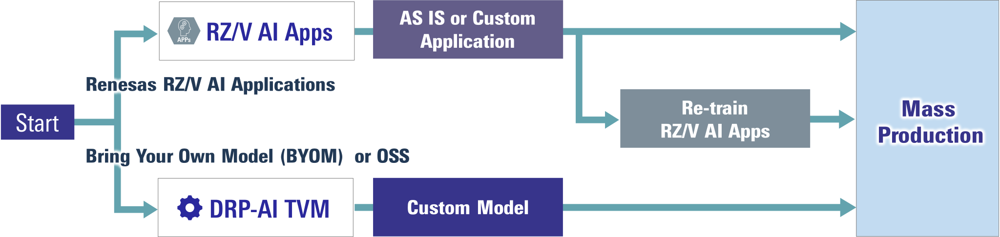
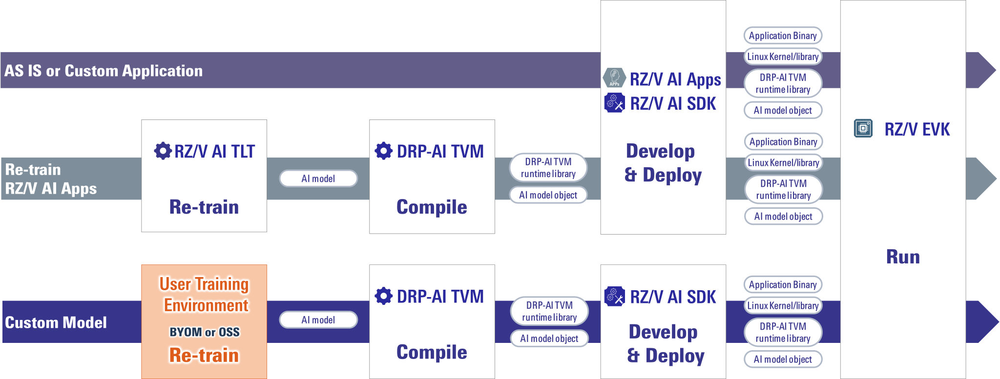
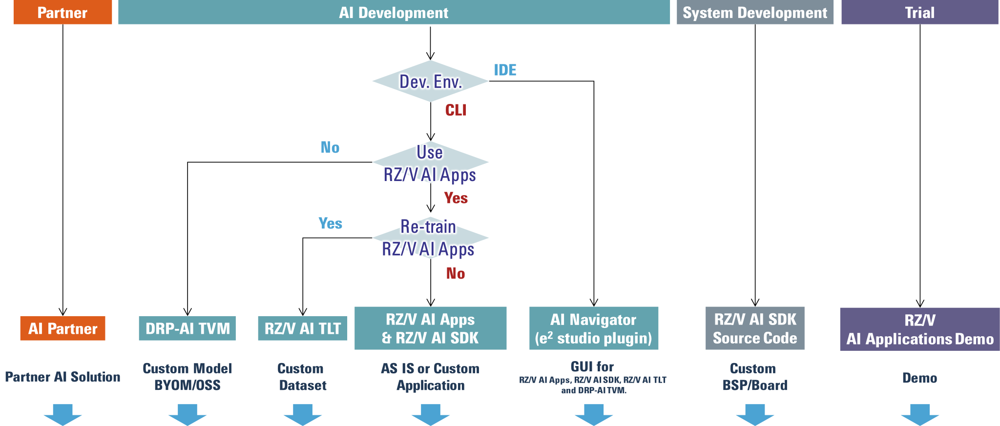
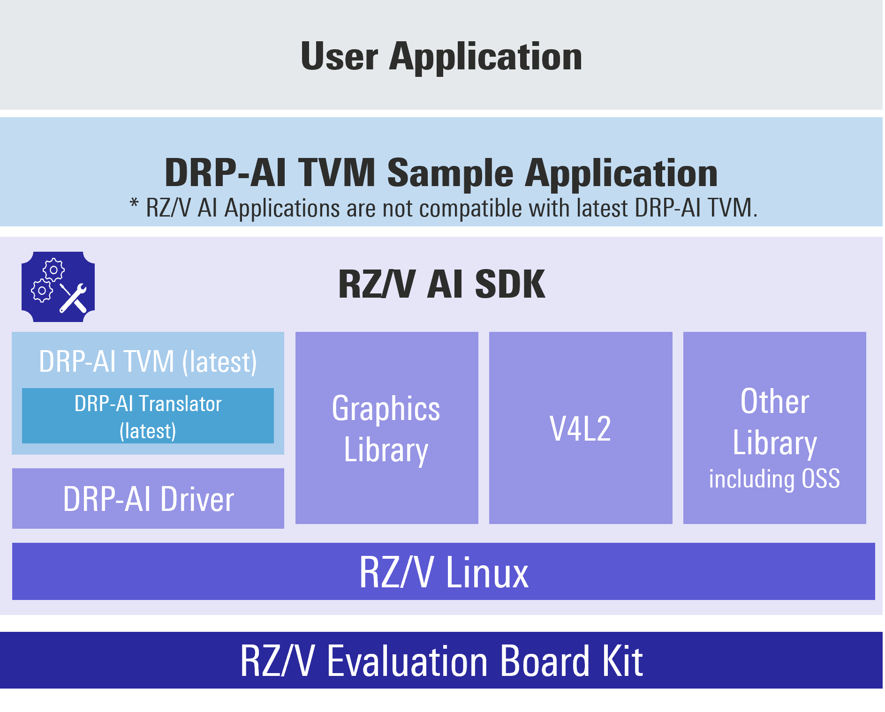

<!-- Title -->

    

        

            RZ/V AI Software Overview
        

    

 
 

<!-- Contents -->

    

        

            <h3 id="index">
                Index
            </h3>
            <ul>
                <li><a href="#intro">Introduction</a></li>
                <li><a href="#user-journey">User Journey</a></li>
                <li><a href="#wheretostart">Where to Start Your Development</a></li>
                <li>
                    <a href="#deliverables">Deliverables</a>
                    <ul>
                        <li><a href="#board">Board</a></li>
                        <li><a href="#software">Software/Tool</a></li>
                    </ul>
                </li>
                <li><a href="#reference">Reference</a></li>
            </ul>
        

        

            <h3 id="intro">
                Introduction
            </h3>
            Among other devices provided by Renesas Electronics, RZ/V series is specialized to AI by embedding the Renesas DRP-AI accelerator delivering high performance at low power consumption.
             
            AI application development requires a lot of work, starting with preparing an AI development environment.
             
            Furthermore, development tasks often have to be repeated many times to achieve the target accuracy.
             
            When AI model is ready to be used in actual user applications, the time and money spent here has been a major hurdle.
             
             
            Renesas provides <b>RZ/V AI Applications</b>, which can significantly shorten this AI development phase.
             
            In addition, since AI Applications are developed using open source, they can be used not only for evaluation purposes but also for your mass production development.
             
            

                 
                
                 
            

             
            To expand AI development, Renesas also provide other development environments/tools, i.e., RZ/V AI Transfer Learning Tool to re-train the AI models used in AI Applications, etc..
             
            This page explains about the summary of those AI software for RZ/V series.
             
             
        

    

    

        

            <h3 id="user-journey">
                User Journey
            </h3>
            <h4 id="user-journey-overview" class="u_line">
                Overview
            </h4>
            Following diagram shows the user journey overview for RZ/V AI Software user. 
        

        

             
            
             
        

        

            <h4 class="u_line">
                AI Software Development Flow
            </h4>
            For each phase in <a href="#user-journey-overview"><b>user journey overview diagram</b></a>, development flow and related software are shown below. 
            For more details on each software, please check its documentation listed in <a href="#software"><b>Software/Tool Deliverables List</b></a>. 
        

        

             
            
             
        

    

 
 

 
 

    

        

            <h3 id="wheretostart">
                Where to Start Your Development
            </h3>
            Following diagram guides you to which software to start the development. 
            Click the button of your selected software and follow the instructions. 
        

        

             
            
             
             
        

        

            

                  Click
            

        

        

            

                  Click
            

        

        

            

                  Click
            

        

        

            

                  Click
            

        

        

            

                  Click
            

        

        

            

                  Click
            

        

        

            

                  Click
            

        

         
         
    

    <!-- Guide Box: hidden as default -->
    

        

            AI Partner
        

        

            RZ/V AI Applications are free of charge and open source software, which can be used not only for evaluation purposes but also for your mass production development. 
            However, they only provide fixed AI models/dataset.
             
            You can change the AI models/dataset by using our other software, i.e., RZ/V AI Transfer Learning Tool and DRP-AI TVM.
             
             
            If you do not have your own AI model, or prefer to use exisiting AI models created by reliable developers, you are recommended to ask our partners. 
            Our partners include as follows.
            <ul>
                <li>AI application developers</li>
                <li>AI model experts (performance/accuracy optimization, etc.)</li>
                <li>System integrators</li>
            </ul>
            Community page shows our partner applications that you can actually run on the target board. 
            <a class="btn btn-secondary square-button ms-3 mt-1" style="text-align:left;" href="{{ site.url }}{{ site.baseurl }}" role="button">
                
                    Community page
                 
                
                    List of partner applications and other sample applications. 
                
            </a>
             
             
            We also have the list of our partners in <a href="https://www.renesas.com/products/microcontrollers-microprocessors/rz-mpus/rz-partner-solutions?partners-mcu-filter=rz-v">Renesas RZ Partner Ecosystem Solutions</a> page.
             
             
            To make an enquiry regarding AI partner, please use <b>"Support Tickets"</b> > <b>"Submit a Ticket"</b> from following page. 
            <a class="btn btn-primary download-button" href="https://www.renesas.com/support" role="button">
                Renesas Technical Support
            </a>
        

    

    

        

            DRP-AI TVM
        

        

            DRP-AI TVM is a Machine Learning Compiler plugin for Apache TVM with AI accelerator DRP-AI, which is a tool to compile your own AI models (including BYOM) to get the executable format on RZ/V series.
             
             
            RZ/V AI Applications (Apps) provide a set of pre-compiled AI models by validated DRP-AI TVM version and the application source code.
             
            In following cases, you need to compile them with DRP-AI TVM.
            <ul>
                <li>
                    To change the AI models of RZ/V AI Apps.
                </li>
                <li>
                    To use completely different models, such as BYOM or OSS, 
                </li>
            </ul>
            DRP-AI TVM is automatically installed in RZ/V AI SDK and users are able to use it on its own.
             
            To see how to use DRP-AI TVM, please refer to the <b>DRP-AI TVM Web</b>.
             
             
            <a class="btn btn-primary download-button" 
                href="https://renesas-rz.github.io/rzv_drp-ai_tvm/" 
                role="button">
                DRP-AI TVM Web
            </a>
             
             
        

        

            <h5 class="u_line mb-1">
                Note
            </h5>
        

        

            

                RZ/V AI Apps and RZ/V AI SDK usually use the validated version of DRP-AI TVM, which means that RZ/V AI Apps may not be compatible with the latest version of DRP-AI TVM. 
                The version installed in AI SDK can be checked in the following page.
                 
                <a class="btn btn-secondary square-button square-button-link-small 
                    mt-2 ms-2 mb-2" 
                    href="{{ site.url }}{{ site.baseurl }}">
                    RZ/V AI SDK Overview
                </a>
                 
                 
                To use the <b>latest DRP-AI TVM</b>, please refer to the Getting Started in <b>DRP-AI TVM Web</b> to construct the environment with RZ/V AI SDK and DRP-AI Translator.
            

        

        

            
        

    

    

        

            RZ/V AI Transfer Learning Tool (TLT)
        

        

            RZ/V AI Applications (Apps) provide a set of pre-compiled AI models, which are already trained with specific dataset selected for each use-case.
             
            In following cases, you need to re-train the AI model.
            <ul>
                <li>
                    To change the AI target classes.
                </li>
                <li>
                    To improve the accuracy of AI models. 
                </li>
            </ul>
            <b>RZ/V AI TLT</b> is a GUI Tool to re-train the AI models used in RZ/V AI Apps with different datasets.
             
            It requires a <b>Linux PC with GPU</b> that can <b>display the desktop screen</b>.
             
             
            To use RZ/V AI TLT, please refer to following guide.
             
            <a class="btn btn-secondary square-button ms-3 mt-1" style="text-align:left;" href="{{ site.url }}{{ site.baseurl }}" role="button">
                
                    
                        RZ/V AI Transfer Learning Tool
                     
                    How to Re-train AI model
                 
                
                    How to use RZ/V AI TLT? 
                
            </a>
             
             
            Please note that it may not support the latest RZ/V AI Apps. 
            For more details, please check the guide above.
        

    

    

        

            RZ/V AI Applications and RZ/V AI SDK
        

        

            <b>RZ/V AI Applications (Apps)</b> provides following set of files that can be used AS IS for each use-case.
             
            <ul class="mb-1">
                <li>
                    Pre-trained AI model objects
                </li>
                <li>
                    Pre-build application binary
                </li>
                <li>
                    Application source code
                </li>
            </ul>
            It is provided on GitHub with free of charge and open-source software licenses. 
            <a class="btn btn-secondary square-button ms-3 mt-1" style="text-align:left;" href="{{ site.url }}{{ site.baseurl }}" role="button">
                
                    RZ/V AI Applications
                 
                
                    Check the list of RZ/V AI Applications.
                
            </a>
             
             
            <b>RZ/V AI Software Development Kit (AI SDK)</b> is an AI application development environment for specific Evaluation Bord Kit of RZ/V series.
              
            It includes the pre-build binary of bootloader, Linux Kernel and cross compiler, which contain a complete set of libraries to run RZ/V AI Apps.
             
            <a class="btn btn-secondary square-button ms-3 mt-1" style="text-align:left;" href="{{ site.url }}{{ site.baseurl }}" role="button">
                
                    RZ/V AI SDK Overview
                 
                
                    Check the specification of RZ/V AI SDK.
                
            </a>
             
             
            With RZ/V AI Apps and RZ/V AI SDK, users can start their AI development <b>quickly</b> and <b>easily</b>.
             
            First, please follow the <b>Getting Started Guide</b> to run the RZ/V AI Apps on the board with RZ/V AI SDK.
             
            <a class="btn btn-secondary square-button ms-3 mt-1" style="text-align:left;" href="{{ site.url }}{{ site.baseurl }}" role="button">
                
                    Getting Started
                 
                
                    How to startup RZ/V board? 
                    How to run RZ/V AI Applications? 
                
            </a>
             
             
            After the Getting Started, please select and try <a href="{{ site.url }}{{ site.baseurl }}"><b>RZ/V AI Apps</b></a> to expand your AI development.
             
        

    

    

        

            AI Navigator (e2 studio plugin)
        

        

            

                

                    AI Navigator is a set of plugins for Renesas IDE e2 studio for RZ/V AI.
                     
                    It allows users to run following software on IDE.
                     
                    <ul class="mb-1">
                        <li>
                            RZ/V AI Applications (Apps)
                        </li>
                        <li>
                            RZ/V AI SDK
                        </li>
                        <li>
                            RZ/V AI Transfer Learning Tool (TLT)
                        </li>
                        <li>
                            DRP-AI TVM
                        </li>
                    </ul>
                

                

                    <a href="https://www.renesas.com/software-tool/ai-navigator-ide-ai-applications">
                        AI Navigator: IDE for AI Applications
                    </a>
                     
                    
                

            

        

        

            To use AI Navigator, users are required to install <b>Renesas e2 studio for Linux</b>.
             
            Details are explained in the following page.
             
            <a class="btn btn-secondary square-button ms-3 mt-1" style="text-align:left;" href="{{ site.url }}{{ site.baseurl }}" role="button">
                
                    AI Navigator Quick Start Guide
                 
                
                    How to develop and run RZ/V AI Applications on e2 studio? 
                
            </a>
             
             
            Please note that it may not support the latest RZ/V AI Apps. 
            For more details, please check the Quick Start Guide above.
        

    

    

        

            RZ/V AI SDK Source Code
        

        

            RZ/V AI SDK is an AI application development environment which is built for specific Evaluation Bord Kit of RZ/V series.
              
            If you would like to change RZ/V AI SDK, you need to customize and build the AI SDK, which is based on Yocto Project (Linux OS Distribution).
             
            Changing AI SDK includes following examples.
            <ul>
                <li>
                    To change the memory map of the board.
                </li>
                <li>
                    To develop your own board with RZ/V series. 
                </li>
                <li>
                    To add extra camera drivers, graphic libraries, other OSS libraries, etc..
                </li>
            </ul>
            The Linux source code is provided as <b>RZ/V AI SDK Source Code</b>.
             
             
            The instructions to build the RZ/V AI SDK Source Code are provided in each <b>How to Build AI SDK page</b>.
              
            Please refer to following guides based on your target device.
             
            <a class="btn btn-secondary square-button ms-3 mt-1" style="text-align:left;" href="{{ site.url }}{{ site.baseurl }}" role="button">
                
                    
                        RZ/V2L AI SDK Source Code
                     
                    How to Build RZ/V2L AI SDK
                
            </a>
              
            <a class="btn btn-secondary square-button ms-3 mt-1" style="text-align:left;" href="{{ site.url }}{{ site.baseurl }}" role="button">
                
                    
                        RZ/V2H AI SDK Source Code
                     
                    How to Build RZ/V2H AI SDK
                
            </a>
              
            <a class="btn btn-secondary square-button ms-3 mt-1" style="text-align:left;" href="{{ site.url }}{{ site.baseurl }}" role="button">
                
                    
                        RZ/V2N AI SDK Source Code
                     
                    How to Build RZ/V2N AI SDK
                
            </a>
        

    

    

        

            RZ/V AI Applications Demo
        

        

            

                

                    RZ/V AI Applications Demo is a microSD card image that contains the RZ/V AI Applications.
                     
                    Users can try the RZ/V AI Applications without having RZ/V AI SDK environment.
                

                

                    
                

                

                    To use RZ/V AI Applications Demo, please refer to following guides based on your target board.
                     
                    <a class="btn btn-secondary square-button ms-3 mt-1" 
                        style="text-align:left;" 
                        href="{{ site.url }}{{ site.baseurl }}" 
                        role="button">
                        
                            
                                RZ/V2L AI Applications Demo
                             
                            
                                How to Use Guide
                             
                        
                    </a>
                     
                    <a class="btn btn-secondary square-button ms-3 mt-1" style="text-align:left;" href="{{ site.url }}{{ site.baseurl }}" role="button">
                        
                            
                                RZ/V2H AI Applications Demo
                             
                            
                                How to Use Guide
                             
                        
                    </a>
                     
                    <a class="btn btn-secondary square-button ms-3 mt-1" style="text-align:left;" href="{{ site.url }}{{ site.baseurl }}" role="button">
                        
                            
                                RZ/V2N AI Applications Demo
                             
                            
                                How to Use Guide
                             
                        
                    </a>
                

            

        

    

 
 

    

        

            <h3 id="deliverables">
                Deliverables
            </h3>
            <h4 id="board" class="u_line">
                Board
            </h4>
            Following evaluation boards are supported.
             
             
            <table class="gstable">
                <tr>
                    <th>Board</th>
                    <th>Details</th>
                    <th>Kit</th>
                    <th>Link</th>
                </tr>
                <tr>
                    <td>
                        RZ/V2L Evaluation Board Kit (EVK)
                    </td>
                    <td>
                        Evaluation Board Kit for RZ/V2L.
                         
                        Includes following items.
                        <ul>
                            <li>
                                MIPI Camera Module(Google Coral Camera)
                                <h6 class="mb-1">
                                    <ul>
                                        <li>
                                            Note that the CMOS sensor (OV5645) in the camera is no longer available, and should not be used for mass production. 
                                            Any software support provided is for evaluation purposes only.
                                        </li>
                                    </ul>
                                </h6>
                            </li>
                            <li>
                                MicroUSB to Serial Cable for serial communication.
                            </li>
                        </ul>
                    </td>
                    <td>
                        
                    </td>
                    <td rowspan="3">
                        <a class="btn btn-secondary square-button" 
                            style="text-align:left;" 
                            href="{{ site.url }}{{ site.baseurl }}" 
                            role="button">
                            
                                Board and Software
                             
                            
                                Get the board and software for RZ/V series. 
                            
                        </a>
                    </td>
                </tr>
                <tr>
                    <td>
                        RZ/V2H Evaluation Board Kit (EVK)
                    </td>
                    <td>
                        Evaluation Board Kit for RZ/V2H.
                         
                        <h6 class="mb-1">
                        To use MIPI camera, please refer to e-CAM22_CURZH provided by <a href="https://www.e-consystems.com/renesas/sony-starvis-imx462-ultra-low-light-camera-for-renesas-rz-v2h.asp">e-con Systems</a>.
                        </h6>
                    </td>
                    <td>
                        
                    </td>
                </tr>
                <tr>
                    <td>
                        RZ/V2N Evaluation Board Kit (EVK)
                    </td>
                    <td>
                        Evaluation Board Kit for RZ/V2N.
                         
                        <h6 class="mb-1">
                        To use MIPI camera, please refer to e-CAM22_CURZH provided by <a href="https://www.e-consystems.com/renesas/sony-starvis-imx462-ultra-low-light-camera-for-renesas-rz-v2h.asp">e-con Systems</a>.
                        </h6>
                    </td>
                    <td>
                        
                    </td>
                </tr>
            </table>
            For more details on these devices, please refer to <a href="https://www.renesas.com/products/microcontrollers-microprocessors/rz-mpus/rzv-embedded-ai-mpus">RZ/V series</a>.
             
             
            <h4 id="software" class="u_line">
                Software/Tool
            </h4>
            Followings are list of AI software/tool provided Renesas. 
             
                <table class="gstable">
                    <tr>
                        <th>Items</th>
                        <th>Details</th>
                        <th>Link</th>
                    </tr>
                    <tr>
                        <td>
                            RZ/V AI Applications (AI Apps)
                        </td>
                        <td>
                            <h6 class="mb-1">
                                AI Apps are sets of following software that can be used as is for each use-case.
                                <ul class="mb-1">
                                    <li>
                                        Pre-trained AI model objects
                                    </li>
                                    <li>
                                        Pre-build application binary
                                    </li>
                                    <li>
                                        Application source code
                                    </li>
                                </ul>
                                Users can select the category of applications and access the applications provided on GitHub.
                            </h6>
                        </td>
                        <td>
                            <a class="btn btn-secondary square-button square-button-link-small mb-2" 
                                style="width:220px;" 
                                href="{{ site.url }}{{ site.baseurl }}">
                                About AI Applications
                            </a>
                             
                            <a class="btn btn-secondary square-button square-button-link-small mb-2" 
                                style="width:220px;" 
                                href="{{ site.url }}{{ site.baseurl }}">
                                AI Applications
                            </a>
                        </td>
                    </tr>
                    <tr>
                        <td>
                            RZ/V AI SDK
                        </td>
                        <td>
                            <h6 class="mb-1">
                                Binary development environment for AI Applications that is build for specific RZ/V EVK.
                            </h6>
                        </td>
                        <td>
                            <a class="btn btn-secondary square-button square-button-link-small mb-2" 
                                style="width:220px;" 
                                href="{{ site.url }}{{ site.baseurl }}">
                                AI SDK Overview
                            </a>
                             
                            <a class="btn btn-secondary square-button square-button-link-small mb-2" 
                                style="width:220px;" 
                                href="{{ site.url }}{{ site.baseurl }}">
                                Getting Started
                            </a>
                        </td>
                    </tr>
                    <tr>
                        <td>
                            RZ/V AI SDK Source Code
                        </td>
                        <td>
                            <h6 class="mb-1">
                                Source code of RZ/V AI SDK that user can customize Linux environment.
                            </h6>
                        </td>
                        <td>
                            <a class="btn btn-secondary square-button square-button-link-small mb-2" 
                                style="width:220px;" 
                                href="{{ site.url }}{{ site.baseurl }}">
                                How to Build RZ/V2L AI SDK
                            </a>
                             
                            <a class="btn btn-secondary square-button square-button-link-small mb-2" 
                                style="width:220px;" 
                                href="{{ site.url }}{{ site.baseurl }}">
                                How to Build RZ/V2H AI SDK
                            </a>
                             
                            <a class="btn btn-secondary square-button square-button-link-small mb-2" 
                                style="width:220px;" 
                                href="{{ site.url }}{{ site.baseurl }}">
                                How to Build RZ/V2N AI SDK
                            </a>
                        </td>
                    </tr>
                    <tr>
                        <td>
                            RZ/V AI Applications Demo
                        </td>
                        <td>
                            <h6 class="mb-1">
                                microSD card image that contains the RZ/V AI Applications. 
                                Users can try the AI Applications without having AI SDK environment.
                            </h6>
                        </td>
                        <td>
                            <a class="btn btn-secondary square-button square-button-link-small mb-2" 
                                style="width:220px;" 
                                href="{{ site.url }}{{ site.baseurl }}">
                                How to Use Guide for RZ/V2L
                            </a>
                             
                            <a class="btn btn-secondary square-button square-button-link-small mb-2" 
                                style="width:220px;" 
                                href="{{ site.url }}{{ site.baseurl }}">
                                How to Use Guide for RZ/V2H
                            </a>
                             
                            <a class="btn btn-secondary square-button square-button-link-small mb-2" 
                                style="width:220px;" 
                                href="{{ site.url }}{{ site.baseurl }}">
                                How to Use Guide for RZ/V2N
                            </a>
                        </td>
                    </tr>
                    <tr>
                        <td>
                            RZ/V AI Transfer Learning Tool (TLT)
                        </td>
                        <td>
                            <h6 class="mb-1">
                                GUI Tool to re-train the AI models used in RZ/V AI Applications with different datasets.
                            </h6>
                        </td>
                        <td>
                            <a class="btn btn-secondary square-button square-button-link-small mb-2" 
                                style="width:220px;" 
                                href="{{ site.url }}{{ site.baseurl }}">
                                How to Re-train AI model
                            </a>
                        </td>
                    </tr>
                    <tr>
                        <td>
                            DRP-AI TVM
                        </td>
                        <td>
                            <h6 class="mb-1">
                                Machine Learning Compiler plugin for Apache TVM with AI accelerator DRP-AI, which is a tool to compile your own AI models (including BYOM) to get the executable format on RZ/V series. 
                                
                                    Note: AI SDK also includes DRP-AI TVM. However it is not the <b>latest</b> version.
                                       
                                    If you would like to use the latest DRP-AI TVM, please follow the guide in DRP-AI TVM Web to construct the environment.  
                                
                            </h6>
                        </td>
                        <td>
                            <a class="btn btn-primary download-button" 
                                href="https://renesas-rz.github.io/rzv_drp-ai_tvm/" 
                                role="button">
                                DRP-AI TVM Web
                            </a>
                        </td>
                    </tr>
                    <tr>
                        <td>
                            AI Navigator (e2 studio)
                        </td>
                        <td>
                            <h6 class="mb-1">
                                A set of plugins for Renesas IDE, e2 studio, that allows users to use following software on GUI environment. 
                                <ul class="mb-1">
                                    <li>
                                        RZ/V AI Applications
                                    </li>
                                    <li>
                                        RZ/V AI SDK
                                    </li>
                                    <li>
                                        RZ/V AI TLT
                                    </li>
                                    <li>
                                        DRP-AI TVM
                                    </li>
                                </ul>
                            </h6>
                        </td>
                        <td>
                            <a class="btn btn-secondary square-button square-button-link-small mb-2" 
                                style="width:220px;" 
                                href="{{ site.url }}{{ site.baseurl }}">
                                AI Navigator Quick Start Guide
                            </a>
                        </td>
                    </tr>
                </table>
             
        
 
    

 
 

    

        

            <h3 id="reference">
                Reference
            </h3>
            Renesas also provides other software packages related to RZ/V AI SDK.
             
            Please refer to the Reference to <a href="{{ site.url }}{{ site.baseurl }}#reference">Related Software/Documentation</a>. 
        

    

 
 

    

        

            <a class="btn btn-secondary square-button" href="{{ site.url }}{{ site.baseurl }}" role="button">
                Back to Home >
            </a>
        

    

