

    

        

        AI Navigator Quick Start Guide 
        ~ How to develop and run RZ/V AI applications on e2 studio ~
        

    

 
 
<h5 id="ainavi_top">This page explains how to develop and run RZ/V AI applications using a GUI environment. 
For this GUI environment, Renesas provides <b>AI Navigator</b>, which is a set of plugins for the Renesas IDE e2 studio and supports your application development. 
 
Please read the <a href="https://www.renesas.com/en/software-tool/ai-navigator-ide-ai-applications" target="_blank">AI Navigator Release Note</a> first. This document describes the changes, restrictions, and some notes.
</h5>

<h3 id="ainavi_guide_update">Updates</h3>
<ul>
  <li>July 01, 2025
    <ul>
      <li><b>The supported AI application in AI Navigator has been updated.</b></li>
      AI Navigator now supports RZ/V AI Application v5.20.
    </ul>
  </li>
</ul>

<h3 id="ainavi_target_env">Target Environment</h3>
<table>
  <tr>
    <th>Target version  Updated!</th>
    <td>AI Navigator v2.0.0</td>
  </tr>
  <tr>
    <th>Supported environment</th>
    <td><b>Ubuntu 20.04 LTS</b>, Renesas e2 studio 2025-01 for Linux 
    Please download from <a href="https://www.renesas.com/document/uid/e-studio-2025-01-installer-linux" target="_blank">here</a>.</td>
  </tr>
  <tr>
    <th>Target Devices</th>
    <td>RZ/V2N, RZ/V2H, RZ/V2L</td>
  </tr>
  <tr>
    <th>Target Board</th>
    <td>
      <li>RZ/V2N Evaluation Board Kit</li>
      <li>RZ/V2H Evaluation Board Kit</li>
      <li>RZ/V2L Evaluation Board Kit</li>
    </td>
  </tr>
  <tr>
    <th>Available Functions of AI Applications  Updated!</th>
    <td>
        <li>RZ/V2N, RZ/V2H: Fully supported in RZ/V AI Applications v5.20</li>
        <li>RZ/V2L: Q01-Q11 in RZ/V AI Applications v5.20</li>
    </td>
  </tr>
  <tr>
    <th>Supported RZ/V AI SDK  Updated!</th>
    <td>
        <li>RZ/V2N AI SDK v5.00</li>
        <li>RZ/V2H AI SDK v5.20</li>
        <li>RZ/V2L AI SDK v5.00</li>
    </td>
  </tr>
  <tr>
    <th>Supported AI Tools</th>
    <td>
      <li>RZ/V AI Transfer Learning Tool v4.00</li>
      <li>AI Model Conversion Tool (supported up to DRP-AI TVM v2.3.0) </li>
    </td>
  </tr>
</table>
 

  Recommended
  Please also watch <b>"AI Navigator Tutorial"</b> videos. These videos will help you quickly learn how to use AI Navigator. 
  (Link)
  <ul>
    <li><a href="https://www.renesas.com/video/ai-navigator-tutorial-1-run-ai-application" target="_blank">AI Navigator Tutorial #1 (Run AI Application)</a></li>
    <li><a href="https://www.renesas.com/video/ai-navigator-tutorial-2-customize-ai-model-transfer-learning-tool" target="_blank">AI Navigator Tutorial #2 (Customize AI model by Transfer Learning Tool)</a></li>
  </ul>

 

  Note
  For the users who want to use your own customized environment (Linux, target board, and so on), see <a href="ainavi_appendix.html#ainavi_appendix_d">"How to install customized RZ/V Linux into AI Navigator"</a>. 

 

<h3 id="ainavi_intro">Introduction</h3>
AI Navigator is a set of plugins for e2 studio that makes it easy to run AI applications on Renesas devices.  
By using AI Navigator, you can try out Renesas AI application from importing to running on the board with just a few clicks. 
 
In addition, AI Navigator includes some plugins for transfer learning tool and AI model conversion tool. For RZ/V, each plugin set up and calls RZ/V AI Transfer Learning Tool and AI Conversion Tool (DRP-AI TVM), respectively. That’s why you can also develop your AI embedded systems with AI Navigator, such as training and converting AI models, and building application source code on e2 studio. 
 
The development steps for RZ/V AI applications are shown below. All steps can be controlled by AI Navigator.  
 
 
 
Please follow the steps below to start developing your AI applications with AI Navigator. Note that you can skip some steps depending on your use case. 

<h3 id="ainavi_preparation">Preparation</h3>
Before you start using AI Navigator, prepare the necessary equipment and software as described in <a href="{{ site.url }}{{ site.baseurl }}#step1" target="_blank">Step 1</a> and <a href="{{ site.url }}{{ site.baseurl }}#step2" target="_blank">Step 2</a> in <a href="{{ site.url }}{{ site.baseurl }}" target="_blank">Getting Started</a>. 

  Note
  The users who want to train AI models are recommended to use GPU environment. 
  Please refer to the <a href="howto_retrain.html#install" target="_blank">recommended environment</a> in How to Re-train AI model.

 

  Note
  You must first install Docker before using AI Navigator.  
  To install Docker, see "<b>1. Set up Docker's apt repository</b>" and "<b>2. Install the Docker packages</b>" on the following Docker web page. 
  <a href="https://docs.docker.com/engine/install/ubuntu/#install-using-the-repository" target="_blank">Install using the apt repository in Docker docs</a> 
   
  In  addition, some plugins in AI Navigator run Docker as a non-root user.
  See "<b>Manage Docker as a non-root user</b>" in the following Docker web page to run as a non-root user. 
  <a href="https://docs.docker.com/engine/install/linux-postinstall/#manage-docker-as-a-non-root-user" target="_blank">Manage Docker as a non-root user in Docker docs</a>

 

<h3 id="ainavi_step1" >Step 1: AI Navigator Installation</h3>

  Note
  For RZ/V family, AI Navigator v2.0.0 works on e2 studio <b>Linux Host</b> only. 

 

  Note
    

      

        The device family <b>"Linux on Renesas RZ"</b> must be available in your e2 studio environment. Otherwise, you may not be able to build your AI application. 
         
        Be sure to select <b>"Linux on Renesas RZ"</b> when installing e2 studio and updating it using the e2 studio installer. 
      

      

        
       
    

  

<ul>
  <li><h5><b>Non-users of e2 studio</b></h5></li>
  Download <b>e2 studio <u>Linux Host</u></b> from the Renesas website. *The version of e2 studio is <b>2025-01</b>.
    
  <a class="btn btn-primary download-button" href="https://www.renesas.com/document/uid/e-studio-2025-01-installer-linux" target="_blank" role="button">Get e2 studio</a>
    
  

    Note
    MyRenesas account is required to download e2 studio. 
  

  After downloading, install e2 studio. Read the <a href ="https://www.renesas.com/us/en/software-tool/e2studio-information-rz-family#documents" target="_blank">e2 studio Release Note</a> for the installation. 
  Select the following each item when installing. 
  <ul>
    <li><b>Device Families</b>: Linux on Renesas RZ</li>
    <li><b>Additional Software</b>: Renesas AI Navigator, AI Transfer Learning Tool Plugin, AI Model Conversion Tool Plugin</li>
  </ul>
   
  <li><h5><b>e2 studio users</b></h5></li>
  Run the e2 studio installer in the same way as described above, or add the necessary plugins by following the steps below. 
  <ol>
    <li>Launch e2 studio.</li>
    <li>Click <b>[Help] > [Install Renesas IDE Features...]</b>.</li>
    <li>Select <b>[Renesas AI Navigator]</b>, <b>[AI Transfer Learning Tool Plugin]</b>, <b>[AI Model Conversion Tool Plugin]</b> and click <b>[Finish]</b>.</li>
    <li>Confirm that these plugins are selected in the "install" dialog box and click <b>[Next]</b>.</li>
    <li>Confirm these plugins are selected as the installation target and click <b>[Next]</b>.</li>
    <li>Read the license agreements and select "I accept the terms of the license agreement" if you agree.
        Then, click <b>[Finish]</b> to start the plugins installation.</li>
    <li>If the dialog of the trust certificate dialog appears during the installation, check the certificate and click <b>[OK]</b>.</li>
    <li>After the installation is finished, e2 studio will prompt you to restart. Click <b>[Restart Now]</b>.</li>
  </ol>
   
    

    Note
    If  [Install Renesas IDE Features...] is not displayed in your environment, install AI Navigator as follows: 
    <ol>
      <li>Click <b>[Help] > [Install New Software...]</b>.</li>
      <li>Click <b>"Add..."</b> and enter the following URLs in Location. 
        <ul>
          <li>AI Navigator Plugin: https://Tool-support.renesas.com/e2studio/ai/ai-navi</li>
          <li>AI Transefr Learning Tool Plugin: https://Tool-support.renesas.com/e2studio/ai/rz_tlt</li>
          <li>AI Model Conversion Tool Plugin: https://Tool-support.renesas.com/e2studio/ai/rz_tvm</li>
        </ul>
      </li>
    </ol>
  

   
  <li><h5><b>AI Navigator users</b></h5></li>
  Click <b>[Help]</b> > <b>[Check for Updates]</b> and select the newer version for each plugin to update.
</ul>
 

  Note
  If you want to uninstall these plugins, see <a href="ainavi_appendix.html#ainavi_appendix_a" target="_blank">"AI Navigator Uninstallation"</a>. 

 

<h3 id="ainavi_step2" >Step 2: Start AI Navigator</h3>

  

    

      Click <b>[Renesas Views] > [Renesas AI] > [AI Navi]</b> and AI Navigator will open. 
       
      For each view and button on AI Navigator, see the help page for AI Navigator. You can access it by clicking the <b>[Learn more...]</b> on the start view (on the top page of AI Navigator).
       
      

        Note
        If you want to restart the project, select it from the pull-down menu on the start view and click <b>[Continue]</b>.
      

       
      

        Note for e2 studio 2025-01 users
        When Appearance Theme is set to <b>"Light(Preview)"</b>, some designs on AI Navigator are not displayed correctly. Please change Theme to <b>"Light"</b> or <b>"Dark"</b> from <b>[Window] -> [Preferences] -> [General] -> [Appearance]</b>.
      

    

    

      <a href="img/ainavi/ainavi_top_view.png" data-lightbox="ainavi_top">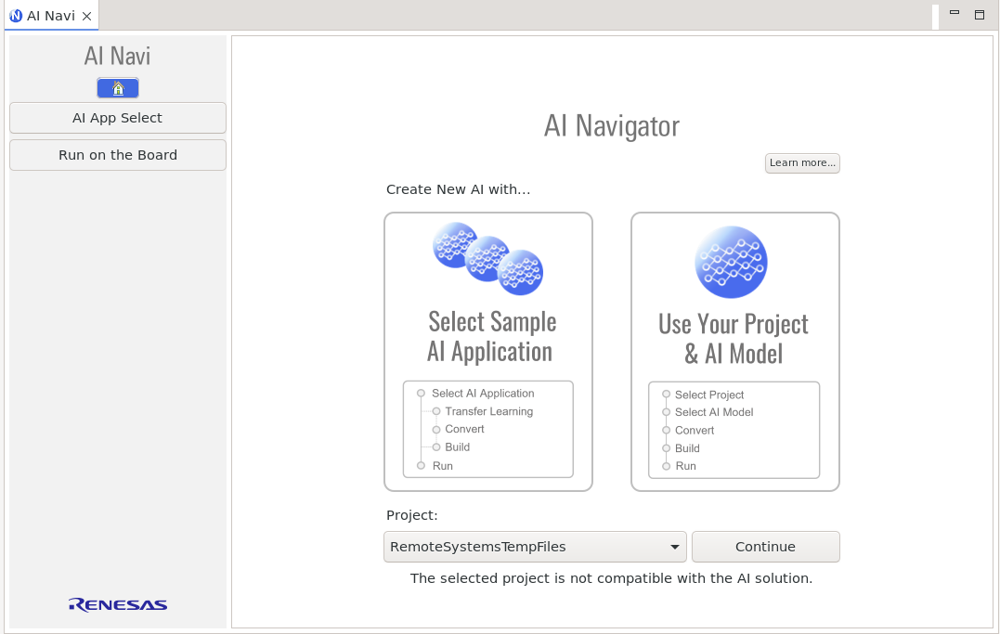</a>
    

  

 

<h3 id="ainavi_step3">Step 3: Import AI Applications Project</h3>
Import an AI application project from Renesas AI server by the following steps.

  

    

      
1. Click <b>[Select Sample AI Application]</b> in the start view.
 
       
      

        Note
        The "Use Your Project & AI Model" button is intended for MCU(RA).
      

    

    

      
    

  

   
  

    

      
2. Select a category of AI application based on your case. You can search the proper category if you enter keywords in Filter.
 
      

        Note
        "Bring Your Own Model" is an empty project for developing your AI applications with your AI model with AI Navigator. To understand its usage, see this importing step, and then see <a href="ainavi_appendix.html#ainavi_appendix_b" target="_blank"> B. How to use Bring Your Own Model Project</a>.
      

       
      

        Note
        Please update AI Navigator if you find the Notice project in the import view. 
         
        
      

    

    

      <a href="img/ainavi/ainavi_import_app_2.png" data-lightbox="ainavi_import_app_2">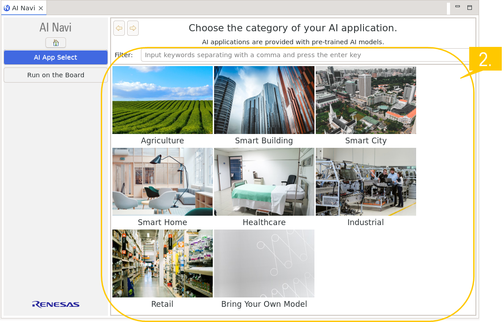</a>
    

  

   
  

    

      
3. Select an AI application.
 
    

    

      
    

  

   
  

    

      
4. Click <b>[Import]</b> and import an AI application.
 
      

        Note for RZ/V2N users
        When selecting an AI Application for RZ/V2N, the same e2 studio project used for RZ/V2H will be imported, since RZ/V2N is a sibling device. Please use it as is with the RZ/V2N AI SDK and EVK.
      

       
      

        Note
        Once you import an AI application, you cannot import an AI application which has the same function (same number like "Qxx") in the same work space.
      

    

    

      <a href="img/ainavi/ainavi_import_app_4.png" data-lightbox="ainavi_import_app_4">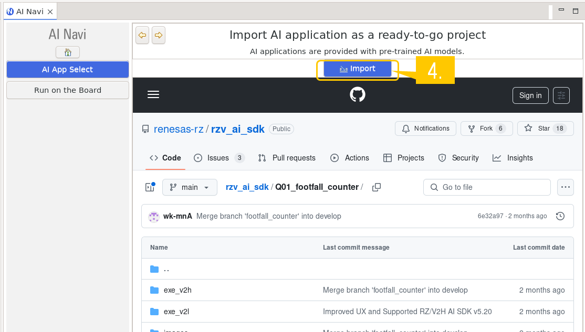</a>
    

  

     
  

    

      
5. The Project and AI information view will appear if the import is successful.  

      From this view, you should specify the location of the downloaded and extracted RZ/V AI SDK directory. 
      <u>If you haven't downloaded RZ/V AI SDK</u>, which is the environment for the imported AI application, click <b>[Download...]</b> to download and extract it. And then, specify the directory path. 
      <u>If you've already downloaded and extracted RZ/V AI SDK</u>, click <b>[Set the download folder...]</b> and specify the directory. 
    

    

      <a href="img/ainavi/ainavi_import_app_5.png" data-lightbox="ainavi_import_app_5">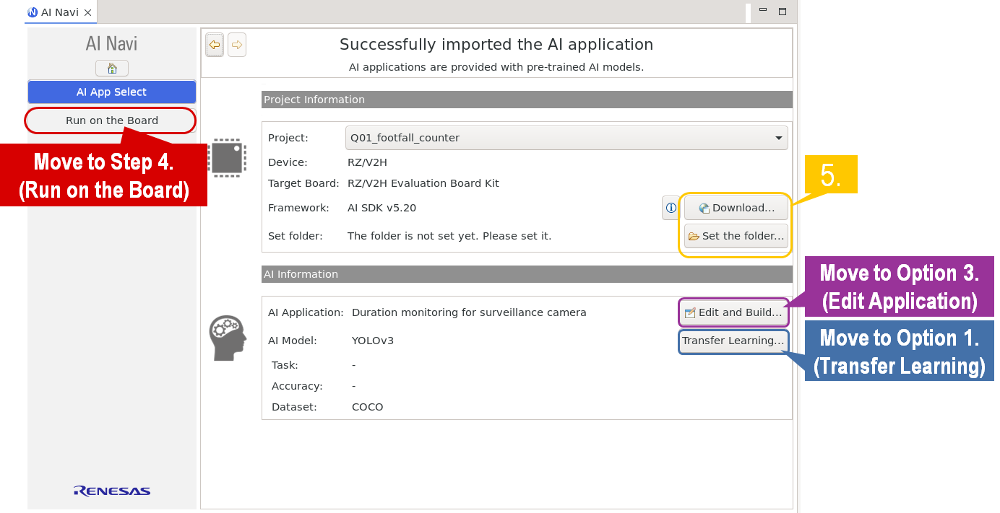</a>
    

  

 
 
That's it for the steps to import an AI application project. 
Please proceed to each step according to your requirements. 
<ul>
  <li><b>For the users who just want to run an AI application: go to <u>Step 4: Run on the Board</u></b></li>
  <li><b>For the users who want to customize AI models: go to <u>Option 1: Train AI model -> Option 2: Convert AI model -> Option3: Edit Application -> Step 4: Run on the Board</u></b></li>
  <li><b>For the users who want to use AI models without any changes, but want to edit AI application source code: go to  <u>Option3: Edit Application -> Step 4: Run on the Board</u></b></li>
</ul>

  Click the button
  As you click each button, the guides for that option appear and the color of the button changes to gray. Click them as needed. 
  When you click a button again, the option guides close and the button returns to its default color. 
   
  
Option1: Train AI Model

  
Option2: Convert AI Model

  
Option3: Edit Application

  <h3 id="ainavi_option1" >Option1: Train AI Model</h3>
  For RZ/V, you can train any AI models provided in any Renesas AI application using <b>RZ/V AI Transfer Learning Tool</b> (hereinafter referred to as RZ/V AI TLT).
  

    Note
    Refer to <a href="{{ site.url }}{{ site.baseurl }}" target="_blank">RZ/V AI Transfer Learning Tool How to Re-train AI model</a> to know the supported AI applications and how to use RZ/V AI TLT.   
    This section just explains launching RZ/V AI TLT from AI Navigator.
  

   
  <h5 id="ainavi_option1-1">1. Configure the environment for the transfer learning tool</h5>
  

    Note
    This is mandatory only for the first time. 
    If you have already completed this step, you can pass to the next <a href="#ainavi_option1-2">2. Launch the transfer learning tool</a>.
  

  

    

      

        (1) A confirmation window appears, indicating that the installation process may take some time to complete. Click <b>[OK]</b> to proceed if you accept. 
         
      

      

        <a href="img/ainavi/ainavi_tlt_step1-1.png" data-lightbox="ainavi_tlt_step1-1">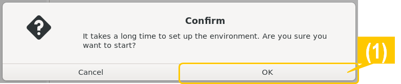</a>
      

    

  

   
  

    

      

        (2) A confirmation window will appear, indicating that setup may take some time. Click <b>[OK]</b> to continue. 
         
      

      

        <a href="img/ainavi/ainavi_tlt_step1-2.png" data-lightbox="ainavi_tlt_step1-2">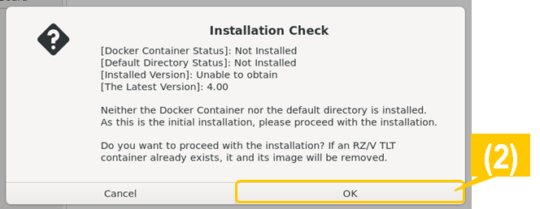</a>
      

    

  

   
  

    

      

        (3) The download page for RZ/V AI Transfer Learning Tool on the Renesas website will open automatically. 
        Read the "SOFTWARE LICENSE AGREEMENT" and click "Accept and download" if you agree.  
        After the download is completed, select the downloaded file. 
         
      

      

        <a href="img/ainavi/ainavi_tlt_step1-3.png" data-lightbox="ainavi_tlt_step2">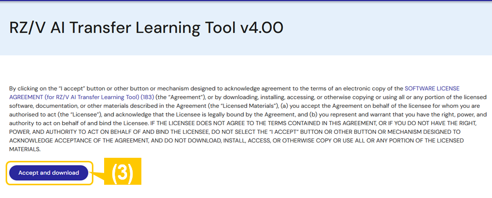</a>
      

    

  

   
  

    

      

        (4) RZ/V AI TLT setup process begins. During the setup, a window appears prompting you to enter the root password. Enter your root password and the process will continue. 
       
      

      

        
      

    

  

   
  

    

      

        (5) When the setup process is complete, the installation window will close automatically.  
        At this point, please confirm the console on e2 studio and logged as below. If it is the same, the setup process has completed successfully.  
         
      

      


Finished at exit code 0
Please confirm the console log.

      

    

  

  

    Note
    RZ/V AI TLT is installed as below: 
    (e.g.) If e2 studio is installed in ~/.local/share/renesas/<b>e2_studio</b>, RZ/V AI TLT is  installed in ~/.local/share/renesas/<b>rzv_ai_tlt/(version)</b>. 
     
    In addition, RZ/V AI TLT provides its user manual, which is stored in rzv_ai_tlt/(version)/docs. 
  

   
  <h5 id="ainavi_option1-2">2. Launch the transfer learning tool</h5>
  

    

      

        Click <b>[Transfer Learning...]</b> and open RZ/V AI TLT. 
      

      

        <a href="img/ainavi/ainavi_tlt_step2.png" data-lightbox="ainavi_tlt_step2">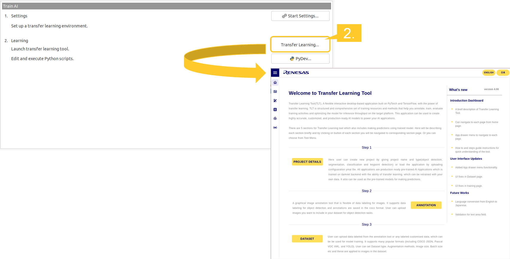</a>
      

    

  

   
  After finishing the transfer learning, you need to convert the trained AI model using DRP-AI TVM to run it on the target board.  
  Click the above button on this page <b>[Option2: Convert AI Model]</b> and see the procedures.  
   

  <h3 id="ainavi_option2" >Option2: Convert AI Model</h3>
  After training an AI model, convert an AI model to generate an executable runtime on the target device. For RZ/V, DRP-AI TVM is used, which is a machine learning compiler plugin for Apache TVM with AI accelerator DRP-AI. 
  <b>AI Model Conversion Tool Plugin</b> (hereafter referred to as "<b>Conversion Tool Plugin</b>") is a plugin for the conversion tool including DRP-AI TVM and enables it to run on e2 studio. 
   
  For DRP-AI TVM, please refer to the following website and GitHub page. 
  <ul>
    <li><a href="https://www.renesas.com/us/en/key-technologies/artificial-intelligence/ai-tool-drp-ai-tvm" target="_blank">AI Tool: DRP-AI TVM (Renesas website)</a></li>
    <li><a href="https://github.com/renesas-rz/rzv_drp-ai_tvm" target="_blank">DRP-AI TVM (GitHub)</a></li>
  </ul>
  

    Note
    See the AI Model Conversion Tool Plugin help page for details on how to use it. You can view it by selecting <b>[Help] > [Help Contents] > [AI Model Conversion Tool]</b>. 
    This section briefly describes the steps in the AI model conversion procedure using DRP-AI TVM on e2 studio.
  

   
  <h5 id="ainavi_option2-1">1. Configure the environment for DRP-AI TVM on e2 studio</h5>
  

    

      

        (1) Click <b>[Convert AI model]</b> on AI Navigator menu and open the "Convert AI Model" view. 
         
        (2) Click <b>[Start Settings...]</b> and open the DRP-AI TVM. 
      

      

        
      

    

      
  

   
  

    

      

        (3) When the conversion tool is launched, select the target device and tools. Then, click <b>[Setup environment].</b>
      

      

        
      

    

  

   
  

    

      

       (4) The directory path of Docker file is set automatically when you specified the directory path in <a href="#ainavi_step1-4">Step 3-4</a>.
       If the path is not set, click <b>[Browse]</b> and set the path manually.  
       Click <b>[Setup now]</b> to start setting up the environment. When the setup is completed, the Installation Success screen appears. Click <b>[OK]</b> to close the window. 
      

      

        
      

    

  

   
  <h5 id="ainavi_option2-2">2. Input File Setting</h5>
  

    

      

        You need to set up the target project for DRP-AI TVM first. Specify the following items. 
         
        <ul>
          <li><b>Project name</b></li>
          Your target AI application project.
          <li><b>Device</b></li>
          Your target device.
          <li><b>AI SDK Docker image name</b></li>
          RZ/V AI SDK that you have set up.
          <li><b>Select framework</b></li>
          AI framework that the input AI model file uses.
          <li><b>Input model file</b></li>
          The file path of your AI model is automatically set by RZ/V AI TLT. It is not necessary to specify this field.
          <li><b>Output directory</b></li>
          The output directory after conversion.
        </ul>
      

      

        
      

    

    After setting, click <b>[Next]</b>.
    

      Note
      <b>[Setup environment]</b> on this view has the same function as <a href="#ainavi_option2-1">1. Configure the environment for DRP-AI TVM on e2 studio</a>. 
      If you have already set up the DRP-AI TVM environment for your application, you do not need to click this button.
    

  

   
  <h5 id="ainavi_option2-3">3. Preprocess Setting</h5>
  

    

      

        The pre-processing parameters are already set by default and do not need to be changed. Click <b>[Next]</b> to proceed to the next step, <a href="#ainavi_option2-4">AI model conversion</a>.  
        However, if you want to use another input, such as using another camera, etc, configure the preprocessing parameters by following the steps below. 
         
        (1) Select the target input node. 
         
        (2) Confirm the <b>"Preprocessing output directory"</b> and change it if necessary. 
        By default, <b>"Use DRP-AI to speed up preprocessing"</b> is checked. If you want to skip preprocessing, clear the check box and click <b>[Next]</b> to go to the next step <a href="#ainavi_option2-4">AI model conversion</a>. 
         
        (3) Set the input data parameters for preprocessing. 
      

      

        <a href="img/ainavi/ainavi_tvm_preprocessing_1-3.png" data-lightbox="ainavi_tvm_preprocessing_1-3">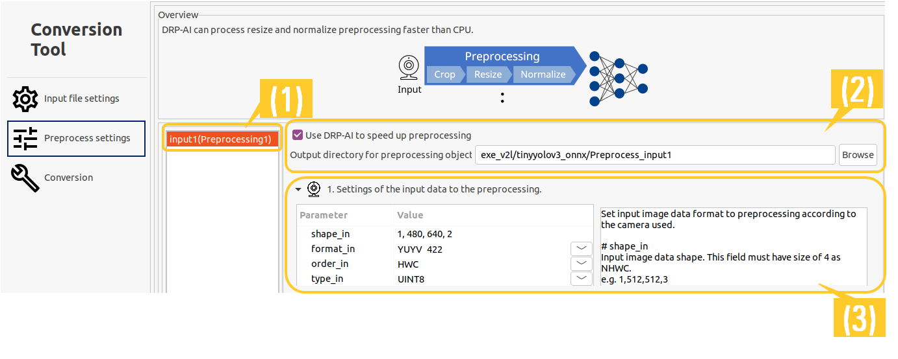</a>
      

    

      
    

      

        (4) Select the preprocessing operator parameters and enter each setting value. 
      

      

        
      

    

      
    

      

        (5) Specify the preprocessing output data format. These parameters are passed to the AI model. 
      

      

        <a href="img/ainavi/ainavi_tvm_preprocessing_5.png" data-lightbox="ainavi_tvm_preprocessing_5">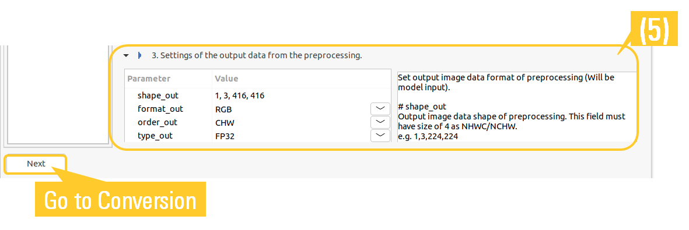</a>
      

    

  

   
  <h5 id="ainavi_option2-4">4. AI model conversion</h5>
  

    Click the button
    The AI model conversion procedure is different for each device. 
    Click the button below that corresponds to your target device and the appropriate conversion procedure will appear. 
     
    
RZ/V2L

    
RZ/V2H & RZ/V2N

     
  

  

    

      

        

          Start the AI model conversion to generate its runtime for <b>RZ/V2L</b> by following the steps below. 
           
          (1) Configure the option setting. 
          Select "Optimization level". 
          If you want to check edit a conversion script here uses this conversion, click <b>[Check conversion script]</b>. 
           
          (2)Click <b>[Start conversion]</b> and the conversion process will start. At this time, the console on e2 studio will appear and display logs. 
           
        

        

          <a href="img/ainavi/ainavi_tvm_conversion_1-2.png" data-lightbox="ainavi_tvm_conversion_1-2">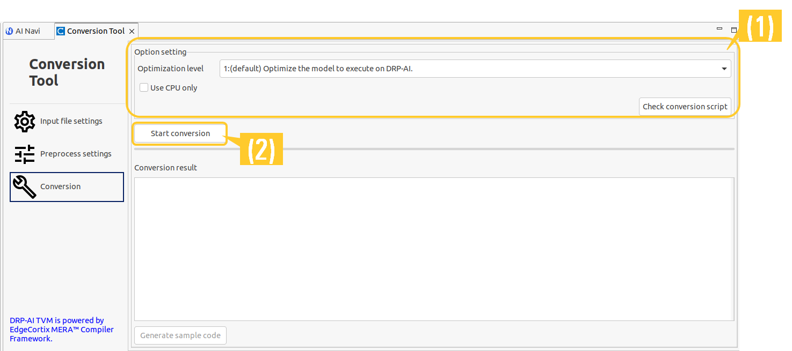</a>
        

      

        
      

        

          (3) When finishing the conversion, the result will be shown in the <b>"Conversion result"</b> area. 
        

        

          
        

      

    

     
     
    After the conversion is finished, you need to edit and build your AI application.  
    Click the above button on this page <b>[Option3: Edit Application]</b> and see the procedures.  
     
    

      Note
      Before moving to the next step, close the AI Model Conversion Tool.
    

   
  

  

    

      

        

          Start the AI model conversion to generate its runtime for <b>RZ/V2H or RZ/V2N</b> by following the steps below. 
           
          (1) Configure the option setting.Select "Optimization level". 
          If you want to check edit a conversion script here uses this conversion, click <b>[Check conversion script]</b>. 
           
        

        

          
        

      

      (2) Configure the quantization setting. 
      <ol type="a">
        <li>Select the target input node.</li>
        <li>Specify the calibration data directory containing data to be used during the quantization process.</li>
        

          Note
          For the calibration data directory, specify the directory where the data is stored.
          Conversion Tool Plugin supports the following extensions. 
          <i>.jpg .jpeg .png .bmp .gif .tif .tiff .npy</i>
        

        <li>The Mean and Standard deviation parameters are already set by default and do not need to be changed.</li>
        

          Note
          The Mean and Standard deviation parameters are the most important parameters for maintaining the model's accuracy. 
          If you want to change these parameters, make sure that the specified parameters match the normalization parameters used during training. 
           
          For more details on how to change the Mean and Standard deviation, please see the Conversion Tool Plugin Help.(Click [Help]-[Help Contents] - [AI Model Conversion Tool].)
        

      </ol>
      (3)Click <b>[Start conversion]</b> and the conversion process will start. At this time, the console on e2 studio will appear and display logs. 
       
      

        

          (4) When finishing the conversion, the result will be shown in the <b>"Conversion result"</b> area. 
        

        

          
        

      

    

     
     
    After the conversion is finished, you need to edit and build your AI application.  
    Click the above button on this page <b>[Option3: Edit Application]</b> and see the procedures.  
     
    

      Note
      Before moving to the next step, close the AI Model Conversion Tool.
    

   
  

   

  <h3 id="ainavi_option3" >Option3: Edit Application</h3>
  You can modify your AI application source code and build it on e2 studio. 
  Click <b>[Edit Application]</b> on the AI Navigator menu and follow the instructions below.  
   
  

    

      

      

      

         
      

      

      

    

  

   
  <h5 id=build_setup>1. Configure the build environment</h5>
  Click <b>[Start Settings...]</b>, and then start configuring the build environment for the AI application.  
  Once the setup process is complete, the appropriate toolchain for the target e2 studio project is automatically registered. 
   
  <h5 id=build_edit_source>2. Edit Source code</h5>
  Click <b>[Edit...]</b> and edit a source code. 
  

    Note
    When you click <b>[Edit...]</b>, a main source file of the target AI application appears. 
    If you want to edit another source file, select it in the src directory on the project explorer.
  

   
  <h5 id=build_source>3. Build</h5>
  Click <b>[Build]</b> and start building. The build result will be shown in the console on the e2 studio. 
   

 

<h3 id="ainavi_step4" >Step 4: Run on the Board</h3>
It's time to run your AI application on the target board. 
Click <b>[Run on the Board]</b> on the AI Navigator menu and follow the steps below.  
 

  Note for e2 studio 2024-10 & 2025-01 users
  Keep <b>"Debug"</b> view closed before <b>[Run on the Board]</b>. 
   
   

 

  

    

    

    

       
    

    

    

  

 
<h5 id=ainavi_format_sd>1. Format SD card</h5>
Insert your micro SD card into your Linux host PC. 
Click on <b>[Create a bootable disk...]</b> and you can automatically format your SD for booting the board. 

  Note
  For formatting procedure on Linux console, please refer to the following pages. *Click on <b>eSD Bootloader</b> for each page.
  <ul>
    <li><a href="{{ site.url }}{{ site.baseurl }}#A1" target="_blank">A1. Format SD card</a></li>
    <li><a href="{{ site.url }}{{ site.baseurl }}#step7-1" target="_blank">1. Setup RZ/V2H EVK</a></li>
    <li><a href="{{ site.url }}{{ site.baseurl }}#step7-1" target="_blank">1. Setup RZ/V2N EVK</a></li>
    <li><a href="{{ site.url }}{{ site.baseurl }}#step7-1" target="_blank">1. Setup RZ/V2L EVK</a></li>
  </ul>

  Note for RZ/V2H & RZ/V2N users
  <b>bmap-tools</b> is used to set up each EVK. If you do not have it installed, the following message will appear when creating a bootable disk. 
  <i>"bmaptool is required for this setup program. Do you want to install it now?"</i> 
  If you accept it, type "yes" and the creation process will continue.

 
<h5 id=ainavi_boot_board>2. Boot the board</h5>
Start booting the board with the formatted SD card. 
If you are not sure how to boot the target board, click on <b>[Boot instruction...]</b> and the instructions for <a href="https://Tool-support.renesas.com/Zoo/boot_boad_guide/RZV2L_board_setup_e2studio.html" target="_blank" rel="noopener noreferrer">Boot RZ/V2L Evaluation Board Kit</a>, <a href="https://Tool-support.renesas.com/Zoo/boot_boad_guide/RZV2H_board_setup_e2studio.html" target="_blank" rel="noopener noreferrer">Boot RZ/V2H Evaluation Board Kit</a>, or <a href="https://Tool-support.renesas.com/Zoo/boot_boad_guide/RZV2N_board_setup_e2studio.html" target="_blank" rel="noopener noreferrer">Boot RZ/V2N Evaluation Board Kit</a> will appear. 

  Note
  At this point, be sure to configure each IP address for the connection between your Linux host PC and the target board. 
  This may cause the later process (copying AI models and applications, and running the AI application) to fail if you have not configured it. 
   
  In addition, if you want to use IP addresses other than those set by default in AI Navigator, please see <a href="ainavi_appendix.html#ainavi_appendix_c" target="_blank">Settings required when using other IP addresses of target board</a>.

 
<h5 id=ai_navi_copy_ai>3. Copy AI model and Application to the board</h5>
Once the board is configured, you are ready to transfer your AI models and AI applications to the board. 
 
Click <b>[Copy AI]</b> to copy your AI models to the board. 
Then, click <b>[Copy App]</b> to copy your AI applications to the board. 
 
<h5 id=run_ai_app>4. Run AI application</h5>
Click <b>[Run the AI]</b> and start running your AI application on the board. 

  Note
  Please read the readme.md in each AI application project before using it. Each readme.md describes the specification, such as which input mode (such as MIPI or USB camera) is supported, how to run the application, and so on. 
   
  Also, read "RZV_AI_App_mode_switching_guide_en.pdf" in your imported AI application project. This document describes how to change some configurations when changing the input mode of AI application. 

 
<h5 id=run_ai_app>5. Terminate AI application</h5>
Enter the command to terminate each AI application in the console. The termination command is explained in the README.md. 
 
<h4>
  This is the end of AI Navigator Quick Start Guide.
</h4>
Please refer to <a href="ainavi_appendix.html" target="_blank">AI Navigator Quick Start Guide Appendix</a> for the additional information. 
  

