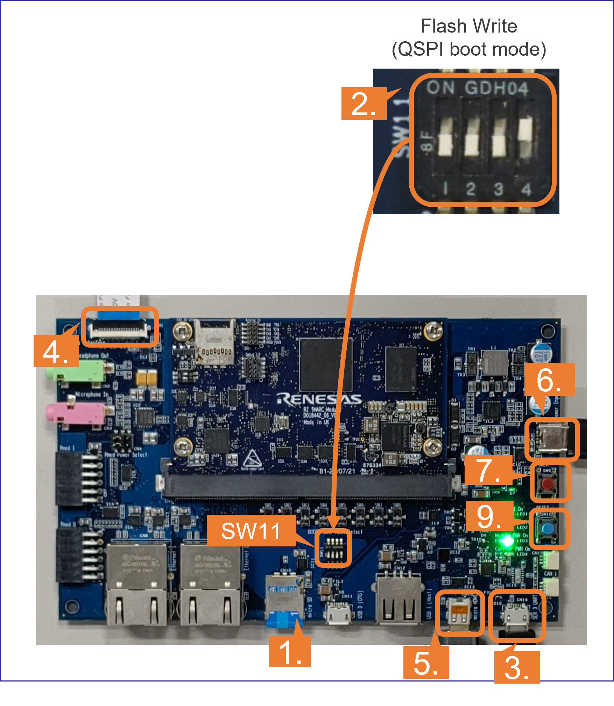

<div class="container">
    <div class="row">
        <div class="top col-12">
Getting Started Appendix
        </div>
    </div>
</div>
<br>
<br>
<h5>This page explains the additional information of Getting Started.</h5>

<h3 id="bootloader">A1. Write bootloaders</h3>
Before booting up the board, you must write the latest bootloaders to the board.<br>
Bootloaders are written to eMMC, which means that this procedures needs to be done only once as long as you use the same version of AI SDK.<br><br>

Follow the instruction below to write bootloaders to the board.<br>
1. Copy following files in `${WORK}/board_setup/bootloader` to your Windows PC.<br>
    <ul>
    <li><code>Flash_Writer_SCIF_RZV2L_SMARC<br clas="br-sp">_PMIC_DDR4_2GB_1PCS.mot</code></li>
    <li><code>bl2_bp-smarc-rzv2l_pmic.srec</code></li>
    <li><code>fip-smarc-rzv2l_pmic.srec</code></li>
    </ul>

2. Connect PC and Board via Serial to MicroUSB Cable.<br>

3. Change SW11 setting (see the figure below).<br><br>
    <br><br>

4. Press and hold the power button (SW9) for 1 second to turn on the power.<br>

5. On Windows PC, open the terminal emulator. <br>
Here, we use Tera Term as an example.<br>

6. Select "File" > "New Connection" and select "Serial" port as shown below.<br><br>
    <br><br>

7. Open the configuration window from the "Setup">"Terminal" and change the setting as follows.<br>

    <table>
      <tr>
      <th>Item</th>
      <th>Value</th>
      </tr>
      <tr>
      <td>New-line</td>
      <td>Receive: Auto</td>
      </tr>
      <tr>
      <td></td>
      <td>Transmit: CR</td>
      </tr>
    </table>
8. Open the configuration window from the "Setup">"Serial port" and change the setting as follows.<br>

    <table>
      <tr>
      <th>Item</th>
      <th>Value</th>
      </tr>
      <tr>
      <td>Baud rate</td>
      <td>115200</td>
      </tr>
      <tr>
      <td>Data</td>
      <td>8bit</td>
      </tr>
      <tr>
      <td>Parity</td>
      <td>none</td>
      </tr>
      <tr>
      <td>Stop</td>
      <td>1bit</td>
      </tr>
      <tr>
      <td>Flow control</td>
      <td>none</td>
      </tr>
      <tr>
      <td>Transmit delay</td>
      <td>0msec/char</td>
      </tr>
    </table>

9. Press the reset button (SW10) and following message will be displayed on the terminal.
```
  SCIF Download mode
 (C) Renesas Electronics Corp.
-- Load Program to System RAM ---------------
please send !
```
10. Open "File" > "Send file..." and send the Flash Writer file (`*.mot`) as a text.<br>
If following message is displayed, the file transfer suceeded.
```
Flash writer for RZ/V2 Series Vx.xx xxx.xx,20xx
 Product Code : RZ/V2L
>
```
11. Enter "`XLS2`" on the terminal to get following messages.
```
> XLS2
===== Qspi writing of RZ/G2 Board Command =============
Load Program to Spiflash
Writes to any of SPI address.
 Micron : MT25QU512
Program Top Address & Qspi Save Address
===== Please Input Program Top Address ============
  Please Input : H'
```
12. Enter "`11E00`". The log continues.
```
  Please Input : H'11E00
===== Please Input Qspi Save Address ===
  Please Input : H'
```
13. Enter "`00000`". The log continues.
```
  Please Input : H'00000
Work RAM(H'50000000-H'53FFFFFF) Clear....
please send ! ('.' & CR stop load)
```
14. After the "please send!" message, open "File" > "Send file..." and <b>send the `bl2_bp-smarc-rzv2l_pmic.srec` file</b> as a text from the terminal software.<br><br>

15. In case a message to prompt to clear data like below, please enter "`y`".
```
SPI Data Clear(H'FF) Check : H'00000000-0000FFFF,Clear OK?(y/n)
```
16. Following log will be displayed.
```
SAVE SPI-FLASH.......
======= Qspi Save Information =================
SpiFlashMemory Stat Address : H'00000000
SpiFlashMemory End Address : H'00009A80
===========================================================
```
17. Enter "`XLS2`" on the terminal to get following messages.
```
> XLS2
===== Qspi writing of RZ/G2 Board Command =============
Load Program to Spiflash
Writes to any of SPI address.
 Micron : MT25QU512
Program Top Address & Qspi Save Address
===== Please Input Program Top Address ============
  Please Input : H'
```
18. Enter "`00000`". The log continues.
```
  Please Input : H'00000
===== Please Input Qspi Save Address ===
  Please Input : H'
```
19. Enter "`1D200`". The log continues.
```
  Please Input : H'1D200
Work RAM(H'50000000-H'53FFFFFF) Clear....
please send ! ('.' & CR stop load)
```
20. After the "please send!" message, open "File" > "Send file..." and <b>send the `fip-smarc-rzv2l_pmic.srec` file</b> as a text from the terminal software.<br><br>

21. In case a message to prompt to clear data like below, please enter "`y`".
```
SPI Data Clear(H'FF) Check : H'00000000-0000FFFF,Clear OK?(y/n)
```
22. Following log will be displayed.
```
SAVE SPI-FLASH.......
======= Qspi Save Information =================
SpiFlashMemory Stat Address : H'0001D200
SpiFlashMemory End Address : H'000CC73F
===========================================================
```
23. Power-off the board by pressing the power button (SW9) for 2 seconds.
<br>

After this procedure, you can create the SD card and boot the board.<br>
Refer to the <a href="{{ site.url }}{{ site.baseurl }}#sd">Getting Started: Setup the SD card</a> to create the SD card for the board.<br>
Refer to the <a href="{{ site.url }}{{ site.baseurl }}#step9">Getting Started: Boot RZ/V2L Evaluation Board Kit</a> to boot the board.
<br><br>


<h3 id="partition">A2. Format SD card</h3>
When writing the necessary files for the board, microSD card needs to have appropriate format.<br>
Note that you need to run this procedure only once as long as you use the same microSD card.<br><br>
Follow the instruction below to format the microSD card partitions.<br>

1. Before inserting the microSD card to your Linux PC, open the terinal on Linux PC and run the following command to check the devices without microSD card.<br>
    ```
    lsblk
    ```
    - Following is the example output.<br>
    ```
    NAME MAJ:MIN RM SIZE RO TYPE MOUNTPOINT
    sda 8:0 0 30.9G 0 disk
    ├─sda1 8:1 0 512M 0 part /boot/efi
    ├─sda2 8:2 0 1K 0 part
    └─sda5 8:5 0 30.3G 0 part /
    sr0 11:0 1 1024M 0 rom
    ```

2. Insert the microSD card to your Linux PC and run the following command again.<br>
    ```
    lsblk
    ```

3. Check the output and confirm the name appeared.<br>
This would be your microSD card device name.<br>
> Note: Be careful not to use the other device since it may destruct your computer filesystem.<br>
    - Following is the example output.<br>
    ```
    NAME MAJ:MIN RM SIZE RO TYPE MOUNTPOINT
    sda 8:0 0 30.9G 0 disk
    ├─sda1 8:1 0 512M 0 part /boot/efi
    ├─sda2 8:2 0 1K 0 part
    └─sda5 8:5 0 30.3G 0 part /
    sdb 8:16 1 29.7G 0 disk
    └─sdb1 8:17 1 29.7G 0 part
    sr0 11:0 1 1024M 0 rom
    ```
    - In this case, followings are your microSD card configuration.<br>
        - <b>`/dev/sdb`</b>: The device name for the entire microSD card.<br>
        - <b>`/dev/sdb1`</b>: The paritition name in microSD card.  There may be multiple `sdb*` depending on the microSD card.<br><br>

4. Run the following command to check the automatically mounted microSD card partitions.<br>  
    ```
    df
    ```
5. Check the output and find the mount point, which is "`/media/user/A8D3-393D`" in the following example.<br>
    ```
    Filesystem 1K-blocks Used Available Use% Mounted on
    udev 745652 0 745652 0% /dev
    :
    snip
    :
    /dev/sdb1 511720 4904 506816 1% /media/user/A8D3-393B
    ```
6. Unmount the automatically mounted partitions.<br>
    ```
    sudo umount /media/user/A8D3-393B
    ```
    - If there are more than one partitions on microSD card, unmount all partitions.<br><br>

7. Run `fdisk` command as shown below to change the partition table according to the following table.<br>
    <table class="lg-table">
      <tr>
        <th>Type/Number</th>
        <th>Size</th>
        <th>Filesystem</th>
        <th>Contents</th>
      </tr>
      <tr>
        <th>Primary #1</th>
        <th>500MB (minimum 128MB)</th>
        <th>FAT32</th>
        <th>Linux kernel<br>Device tree</th>
      </tr>
      <tr>
        <th>Primary #2</th>
        <th>All remaining</th>
        <th>Ext4</th>
        <th>Root filesystem</th>
      </tr>
    </table>

    ```
    sudo fdisk /dev/sdb
    ```
    > Note: Use device name. Do NOT use partition name such as `/dev/sdb1`. <br>

    - Following log will be shown. <br>

    ```
    Welcome to fdisk (util-linux 2.34).
    Changes will remain in memory only, until you decide to write them.
    Be careful before using the write command.

    Command (m for help):
    ```
    - Type "`o`" to console. The log continues.<br>

    ```
    Created a new DOS disklabel with disk identifier 0x6b6aac6e.
    
    Command (m for help):
    ```
    - Type "`n`" to console. The log continues.<br>

    ```
    Partition type
    p primary (0 primary, 0 extended, 4 free)
    e extended (container for logical partitions)
    Select (default p): 
    ```
    - Type "`p`" to console. The log continues.<br>

    ```
    Partition number (1-4, default 1): 
    ```
    - Press ENTER key. The log continues.<br>

    ```
    First sector (2048-62333951, default 2048): 
    ```
    - Press ENTER key. The log continues.<br>

    ```
    Last sector, +/-sectors or +/-size{K,M,G,T,P} (2048-62333951, 
    default 62333951): 
    ```
    - Type "`+500M`" to console. The log continues.<br>

    ```
    Created a new partition 1 of type 'Linux' and of size 500 MiB.
    Partition #1 contains a vfat signature.
    
    Do you want to remove the signature? [Y]es/[N]o: 
    ```
    - Type "`Y`" to console. The log continues.<br>

    ```
    The signature will be removed by a write command.
    
    Command (m for help): 
    ```
    - Type "`n`" to console. The log continues.<br>

    ```
    Partition type
    p primary (1 primary, 0 extended, 3 free)
    e extended (container for logical partitions)
    Select (default p): 
    ```
    - Type "`p`" to console. The log continues.<br>

    ```
    Partition number (2-4, default 2): 
    ```
    - Press ENTER key. The log continues.<br>

    ```
    First sector (1026048-62333951, default 1026048): 
    ```
    - Press ENTER key. The log continues.<br>

    ```
    Last sector, +/-sectors or +/-size{K,M,G,T,P} (1026048-62333951, 
    default 62333951): 
    ```
    - Press ENTER key. The log continues.<br>

    ```    
    Created a new partition 2 of type 'Linux' and of size 29.2 GiB.

    Command (m for help): 
    ```
    - Type "`p`" to console. The log continues.<br>

    ```
    Disk /dev/sdb: 29.74 GiB, 31914983424 bytes, 62333952 sectors
    Disk model: Transcend
    Units: sectors of 1 * 512 = 512 bytes
    Sector size (logical/physical): 512 bytes / 512 bytes
    I/O size (minimum/optimal): 512 bytes / 512 bytes  
    Disklabel type: dos
    Disk identifier: 0x6b6aac6e
    
    Device Boot Start End Sectors Size Id Type
    /dev/sdb1 2048 1026047 1024000 500M 83 Linux
    /dev/sdb2 1026048 62333951 61307904 29.2G 83 Linux
    
    Filesystem/RAID signature on partition 1 will be wiped.
    
    Command (m for help): 
    ```
    - Type "`t`" to console. The log continues.<br>

    ```
    Partition number (1,2, default 2):
    ```
    - Type "`1`" to console. The log continues.<br>

    ```
    Hex code (type L to list all codes):
    ```
    - Type "`b`" to console. The log continues.<br>

    ``` 
    Changed type of partition 'Linux' to 'W95 FAT32'.
    
    Command (m for help): 
    ```
    - Type "`w`" to console. The `fdisk` interface will end.<br>

    ```
    The partition table has been altered.
    Syncing disks.
    ```
8. Check the partition table with the command below. <br>
    ```
    partprobe
    sudo fdisk -l /dev/sdb
    ```
    - Output would be as follows. Note that there are two partitions.<br>
    ```
    Disk /dev/sdb: 29.74 GiB, 31914983424 bytes, 62333952 sectors
    Disk model: Maker name etc.
    Units: sectors of 1 * 512 = 512 bytes
    Sector size (logical/physical): 512 bytes / 512 bytes
    I/O size (minimum/optimal): 512 bytes / 512 bytes
    Disklabel type: dos
    Disk identifier: 0x6b6aac6e
    Device Boot Start End Sectors Size Id Type
    /dev/sdb1 2048 1026047 1024000 500M b W95 FAT32
    /dev/sdb2 1026048 62333951 61307904 29.2G 83 Linux
    ```
9. Run the command below to format and mount the partitions 1.<br>
> Note: If the partitions were automatically mounted after the step 6, please unmount them again.<br>
    
    ```
    sudo mkfs.vfat -v -c -F 32 /dev/sdb1
    ```
    - Following log will be shown.<br>
    ```
    mkfs.fat 4.1 (2017-01-24)
    /dev/sdb1 has 64 heads and 32 sectors per track,
    hidden sectors 0x0800;
    logical sector size is 512,
    using 0xf8 media descriptor, with 1024000 sectors;
    drive number 0x80;
    filesystem has 2 32-bit FATs and 8 sectors per cluster.
    FAT size is 1000 sectors, and provides 127746 clusters.
    There are 32 reserved sectors.
    Volume ID is a299e6a6, no volume label.
    Searching for bad blocks 16848... 34256... 51152... 68304... 85072... 10209
    6... 119376... 136528... 153552... 170576... 187472... 204624... 221648... 238
    928... 256208... 273744... 290768... 308048... 325328... 342480... 359504... 3
    76656... 393680... 410576... 427216... 444624... 462032... 479184... 495952...
    ```
10. Run the command below to format and mount the partitions 2.<br>
    ```
    sudo mkfs.ext4 -L rootfs /dev/sdb2
    ```
    - Following log will be shown.<br>
    ```
    mke2fs 1.45.5 (07-Jan-2020)
    Creating filesystem with 7663488 4k blocks and 1916928 inodes
    Filesystem UUID: 63dddb3f-e268-4554-af51-1c6e1928d76c
    Superblock backups stored on blocks:
    32768, 98304, 163840, 229376, 294912, 819200, 884736, 1605632, 2654208,
    4096000
    Allocating group tables: done
    Writing inode tables: done
    Creating journal (32768 blocks): done
    Writing superblocks and filesystem accounting information: done
    ```
11. Eject the microSD card and insert it again to remount the partitions.<br>

After this procedure, you can write the necessary data for the board into microSD card.<br>
Refer to the <a href="{{ site.url }}{{ site.baseurl }}#sd">Getting Started: Setup the SD card</a> to write files to the microSD card.
<br><br>


<h3 id="boot">A3. Boot with PC</h3>
This step can set the booting configuration of the board.<br>
When you obtained the board, this procedure must be done at least once.<br>
You can use this option for running the application or <a href="{{ site.url }}{{ site.baseurl }}#boot-option2">Boot Option 2.</a><br>
However, please note that AI applications provided on GitHub assume that user runs the application with the Boot Option 2.<br><br>

Follow the instruction below to boot-up the board.<br>
<div class="container">
  <div class="row">
    <div class="col-12 col-md-6">
1. Insert the microSD card to the <b>Board</b>.<br><br>

2. Change the SW11 setting as shown in the right figure.<br><br>

3. Connect the <b>Board</b> and <b>PC</b> by the USB Serial to Micro USB cable.<br><br>

4. Connect the <b>Google Coral camera</b> to the <b>Board</b>.<br><br>

5. Connect the HDMI monitor to the <b>Board</b>.<br><br>

6. Connect the power cable to the <b>Board</b>.<br><br>

7. Press power button for 1 second to turn on the board.<br><br>

8. Open the terminal emulator, i.e., Tera Term, and connect with COMS port.<br>
<i>Note: When using Tera Term, change the configuration as explained in <a href="#bootloader">Write the bootloaders to the board</a>.</i><br><br>

9. On the terminal emulator, keep pressing ENTER key and press reset button.<br>
<i>Note: This procedure is required only when the bootloader is updated.</i><br>
<ol>
<li>U-boot console will be activated.</li>
<li>Run the following commands to set the booting configuration.</li>
</ol>

<pre class="hightlight">
<code>env default -a
setenv bootargs 'root=/dev/mmcblk1p2 rootwait'
setenv bootcmd 'mmc dev 1;fatload mmc 1:1 0x48080000 Image-smarc-rzv2l.bin; fatload mmc 1:1 0x48000000 Image-r9a07g054l2-smarc.dtb; booti 0x48080000 - 0x48000000'
saveenv
boot</code></pre>

<br><br>
10. After the boot-up, the login message will be shown on the console.<br>
<pre class="hightlight"><code>smarc-rzv2l login:</code></pre>

<br>
11. Log-in to the system using the information below.<br>
<ul>
<li>user: <code>root</code></li>
<li>password: none</li>
</ul>


    </div>
    <div class="col-12 col-md-6">
      <br>
    </div>
  </div>
</div>

After this procedure, you can run the AI application on the board.<br>
Refer to the <a href="{{ site.url }}{{ site.baseurl }}#step10">Getting Started: Run the Application</a> to run the AI applications.
<br><br>
