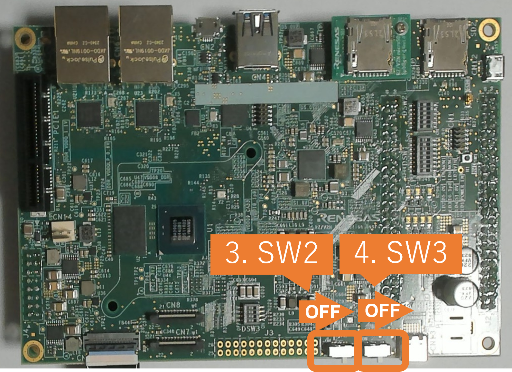

    

        

Getting Started Appendix
        

    

 
 
<h5>This page explains the additional information of Getting Started.</h5>

<h3 id="A2">A1. Format SD card</h3>
  When writing the necessary files for the board, microSD card needs to have appropriate format. 
  Note that you need to run this procedure only once as long as you use the same microSD card.
    
  Follow the instruction below to format the microSD card partitions. 
  <h5 id="A2prep">Preparation</h5>
  

    Click the button
    This section contains both eSD and QSPI Bootloader explanation. 
    Please click the button below to update the explanation according to your bootloader interface. 
    

      eSD Bootloader
      QSPI Bootloader
    

    

      For eSD
      eSD explanation will be shown in this style if you click "eSD Bootloader" button above.
    

    

      For QSPI
      QSPI explanation will be shown in this style if you click "QSPI Bootloader" button above.
    

  

   
  <h5 id="A2-1">Check the SD card connection</h5>
  <ol>
    <li>Before inserting the microSD card to your Linux PC, open the terminal on Linux PC and run the following command to check the devices without microSD card.

lsblk

  Following is the example output.

NAME MAJ:MIN RM SIZE RO TYPE MOUNTPOINT
sda 8:0 0 30.9G 0 disk
├─sda1 8:1 0 512M 0 part /boot/efi
├─sda2 8:2 0 1K 0 part
└─sda5 8:5 0 30.3G 0 part /
sr0 11:0 1 1024M 0 rom

    </li> 
    <li>Insert the microSD card to your Linux PC and run the following command again.

lsblk

    </li> 
    <li>Check the output and confirm the name appeared. 
      This would be your microSD card device name. 
      <ul>
        <li>Following is the example output.

NAME MAJ:MIN RM SIZE RO TYPE MOUNTPOINT
sda 8:0 0 30.9G 0 disk
├─sda1 8:1 0 512M 0 part /boot/efi
├─sda2 8:2 0 1K 0 part
└─sda5 8:5 0 30.3G 0 part /
sdb 8:16 1 29.7G 0 disk
└─sdb1 8:17 1 29.7G 0 part
sr0 11:0 1 1024M 0 rom

        </li>
        <li>In this case, followings are your microSD card configuration.
          <ul>
            <li><b><code>/dev/sdb</code></b>: The device name for the entire microSD card.
            </li>
            <li><b><code>/dev/sdb1</code></b>: The paritition name in microSD card.  There may be multiple <code>sdb*</code> depending on the microSD card.
            </li>
          </ul>
          

            Warning
            Be careful not to use the name of other device since it may destruct your computer filesystem.
          

        </li>
      </ul>
    </li> 
    <li>Run the following command to check the automatically mounted microSD card partitions.

df

    </li> 
    <li>Check the output and find the mount point, which is "<code>/media/user/A8D3-393D</code>" in the following example.

Filesystem 1K-blocks Used Available Use% Mounted on
udev 745652 0 745652 0% /dev
:
snip
:
/dev/sdb1 511720 4904 506816 1% /media/user/A8D3-393B

    </li> 
    <li>Unmount the automatically mounted partitions.

sudo umount /media/user/A8D3-393B

      <ul><li>
        If there are more than one partitions on microSD card, unmount all partitions.
      </li></ul>
    </li>
  </ol>
   
  <h5 id="A2-2">Create SD card partition</h5>
  <ol>
    <li>
      Run <code>fdisk</code> command as shown below to change the partition table according to the following table.
       
      

        For eSD
        <table class="gstable">
          <tr>
            <th>Type/Number</th>
            <th>Size</th>
            <th>Type of Filesystem</th>
            <th>Contents</th>
          </tr>
          <tr>
            <td>Primary #1</td>
            <td>500MB (minimum 128MB)</td>
            <td>Ext4</td>
            <td>Linux kernel Device tree</td>
          </tr>
          <tr>
            <td>Primary #2</td>
            <td>All remaining</td>
            <td>Ext4</td>
            <td>Root filesystem</td>
          </tr>
        </table>
        

          Note
          <i><b>"Type of Filesystem"</b></i> of <i><b>"Primary #1 Linux kernel and Device tree"</b></i> Contents is <b><i>Ext4</i></b>. 
        

      

      

        For QSPI
        <table class="gstable">
          <tr>
            <th>Type/Number</th>
            <th>Size</th>
            <th>Type of Filesystem</th>
            <th>Contents</th>
          </tr>
          <tr>
            <td>Primary #1</td>
            <td>500MB (minimum 128MB)</td>
            <td>FAT32</td>
            <td>Linux kernel Device tree</td>
          </tr>
          <tr>
            <td>Primary #2</td>
            <td>All remaining</td>
            <td>Ext4</td>
            <td>Root filesystem</td>
          </tr>
        </table>
        

          Note
          <i><b>"Type of Filesystem"</b></i> of <i><b>"Primary #1 Linux kernel and Device tree"</b></i> Contents is <b><i>FAT32</i></b>. 
        

      

       

sudo fdisk /dev/sdb

      

            Warning
          Use device name. Do NOT use partition name such as <code>/dev/sdb1</code>.
      

      <ul>
        <li>Following log will be shown.

Welcome to fdisk (util-linux 2.34).
Changes will remain in memory only, until you decide to write them.
Be careful before using the write command.

Command (m for help):

        </li> 
        <li>Type "<code>o</code>" to console. The log continues.

Created a new DOS disklabel with disk identifier 0x6b6aac6e.

Command (m for help):

        </li> 
        <li>Type "<code>n</code>" to console. The log continues.

Partition type
p primary (0 primary, 0 extended, 4 free)
e extended (container for logical partitions)
Select (default p):

        </li> 
        <li>Type "<code>p</code>" to console. The log continues.

Partition number (1-4, default 1):

        </li> 
        <li>Press ENTER key. The log continues.

First sector (2048-62333951, default 2048):

        </li> 
        <li>Press ENTER key. The log continues.

Last sector, +/-sectors or +/-size{K,M,G,T,P} (2048-62333951,
default 62333951):

        </li> 
        <li>Type "<code>+500M</code>" to console. The log continues.

Created a new partition 1 of type 'Linux' and of size 500 MiB.
Partition #1 contains a vfat signature.

Do you want to remove the signature? [Y]es/[N]o:

        </li> 
        <li>Type "<code>Y</code>" to console. The log continues.

The signature will be removed by a write command.

Command (m for help):

        </li> 
        <li>Type "<code>n</code>" to console. The log continues.

Partition type
p primary (1 primary, 0 extended, 3 free)
e extended (container for logical partitions)
Select (default p):

        </li> 
        <li>Type "<code>p</code>" to console. The log continues.

Partition number (2-4, default 2):

        </li> 
        <li>Press ENTER key. The log continues.

First sector (1026048-62333951, default 1026048):

        </li> 
        <li>Press ENTER key. The log continues.

Last sector, +/-sectors or +/-size{K,M,G,T,P} (1026048-62333951,
default 62333951):

        </li> 
        <li>Press ENTER key. The log continues.

Created a new partition 2 of type 'Linux' and of size 29.2 GiB.

Command (m for help):

        </li> 
        <li>Type "<code>p</code>" to console. The log continues.

Disk /dev/sdb: 29.74 GiB, 31914983424 bytes, 62333952 sectors
Disk model: Transcend
Units: sectors of 1 \* 512 = 512 bytes
Sector size (logical/physical): 512 bytes / 512 bytes
I/O size (minimum/optimal): 512 bytes / 512 bytes  
 Disklabel type: dos
Disk identifier: 0x6b6aac6e

Device Boot Start End Sectors Size Id Type
/dev/sdb1 2048 1026047 1024000 500M 83 Linux
/dev/sdb2 1026048 62333951 61307904 29.2G 83 Linux

Filesystem/RAID signature on partition 1 will be wiped.

Command (m for help):

        </li>
      

        For QSPI
        Additionally, run the following procedures to set the partition as FAT32.
        <ul>
          <li>Type "<code>t</code>" to console. The log continues.

Partition number (1,2, default 2):

          </li> 
          <li>Type "<code>1</code>" to console. The log continues.

Hex code (type L to list all codes):

          </li> 
          <li>Type "<code>b</code>" to console. The log continues.

Changed type of partition 'Linux' to 'W95 FAT32'.

Command (m for help):

          </li>
        </ul>
      

       
      <li>Type "<code>w</code>" to console. The <code>fdisk</code> interface will end.

The partition table has been altered.
Syncing disks.

      </li>
    </ul>
  </li> 
  <li>Check the partition table with the command below.

partprobe
sudo fdisk -l /dev/sdb

    <ul><li>Output would be as follows. Note that there are two partitions.
      

        For eSD

Disk /dev/sdb: 29.74 GiB, 31914983424 bytes, 62333952 sectors
Disk model: Maker name etc.
Units: sectors of 1 * 512 = 512 bytes
Sector size (logical/physical): 512 bytes / 512 bytes
I/O size (minimum/optimal): 512 bytes / 512 bytes
Disklabel type: dos
Disk identifier: 0x6b6aac6e
Device Boot Start End Sectors Size Id Type
/dev/sdb1 2048 1026047 1024000 500M 83 Linux 
/dev/sdb2 1026048 62333951 61307904 29.2G 83 Linux
    
      

      

        For QSPI

Disk /dev/sdb: 29.74 GiB, 31914983424 bytes, 62333952 sectors
Disk model: Maker name etc.
Units: sectors of 1 * 512 = 512 bytes
Sector size (logical/physical): 512 bytes / 512 bytes
I/O size (minimum/optimal): 512 bytes / 512 bytes
Disklabel type: dos
Disk identifier: 0x6b6aac6e
Device Boot Start End Sectors Size Id Type
/dev/sdb1 2048 1026047 1024000 500M b W95 FAT32
/dev/sdb2 1026048 62333951 61307904 29.2G 83 Linux

      

    </li></ul>
  </li> 
  <li>Run the command below to format and mount the partitions 1.
    

      Note
      If the partitions were automatically mounted after the procedure 6 of "Check the SD card connection", please unmount them again.
    

    

      For eSD

sudo mkfs.ext4 -L boot /dev/sdb1

      <ul><li>Following log will be shown.

mke2fs 1.45.5 (07-Jan-2020)
Creating filesystem with 128000 4k blocks and 128000 inodes
Filesystem UUID: 0d2b995c-dd96-4ff6-953c-66a4701fa034
Superblock backups stored on blocks:
  32768, 98304
Allocating group tables: done
Writing inode tables: done
Creating journal (4096 blocks): done
Writing superblocks and filesystem accounting information: done

      </li></ul>
    

    

      For QSPI

sudo mkfs.vfat -v -c -F 32 /dev/sdb1

      <ul><li>Following log will be shown.

mkfs.fat 4.1 (2017-01-24)
/dev/sdb1 has 64 heads and 32 sectors per track,
hidden sectors 0x0800;
logical sector size is 512,
using 0xf8 media descriptor, with 1024000 sectors;
drive number 0x80;
filesystem has 2 32-bit FATs and 8 sectors per cluster.
FAT size is 1000 sectors, and provides 127746 clusters.
There are 32 reserved sectors.
Volume ID is a299e6a6, no volume label.
Searching for bad blocks 16848... 34256... 51152... 68304... 85072... 10209
6... 119376... 136528... 153552... 170576... 187472... 204624... 221648... 238
928... 256208... 273744... 290768... 308048... 325328... 342480... 359504... 3
76656... 393680... 410576... 427216... 444624... 462032... 479184... 495952...

      </li></ul>
    

  </li> 
  <li>Run the command below to format and mount the partitions 2.

sudo mkfs.ext4 -L rootfs /dev/sdb2

    <ul><li>Following log will be shown.

mke2fs 1.45.5 (07-Jan-2020)
Creating filesystem with 7663488 4k blocks and 1916928 inodes
Filesystem UUID: 63dddb3f-e268-4554-af51-1c6e1928d76c
Superblock backups stored on blocks:
32768, 98304, 163840, 229376, 294912, 819200, 884736, 1605632, 2654208,
4096000
Allocating group tables: done
Writing inode tables: done
Creating journal (32768 blocks): done
Writing superblocks and filesystem accounting information: done

    </li></ul>
  </li> 
  <li>Eject the microSD card and insert it again to remount the partitions.
  </li>
</ol>
 
After this procedure, you can write the necessary data for the board into microSD card. 
Refer to the <a href="{{ site.url }}{{ site.baseurl }}#step7-1b">Write the Linux files to SD card in RZ/V2L EVK Getting Started</a>. 

  

<h3 id="A3">A2. Shutdown RZ/V2L EVK</h3>
To power-off the RZ/V2L EVK, follow the procedures below.
  
<a3reference>
  <ol>
    <li>Run the <code>shutdown</code> command on board console.
       

shutdown -h now

    </li>
    <li>On board console, check that shutdown procedure runs and ends with following log.
       

[xxxxx.xxxxxx] reboot: Power down

    </li>
    <li>Press and hold the power button for 2 seconds.
        
       
    </li>
  </ol>
</a3reference>
  
<h3 id="A4">A3. Shutdown RZ/V2H EVK</h3>
To power-off the RZ/V2H EVK, follow the procedures below.
  
<a4reference>
<ol>
  <li>Run the <code>shutdown</code> command on board console.
     

shutdown -h now

  </li>
  <li>
    On the screen, check that shutdown procedure runs and the HDMI display is blacked out.
      
  </li>
  <li>
    Turn SW2 to OFF.
      
  </li>
  <li>
    Turn SW3 to OFF.
      
     
  </li>
</ol>
</a4reference>
  
<h3 id="A5">A4. Shutdown RZ/V2N EVK</h3>
To power-off the RZ/V2N EVK, follow the procedures below.
  
<a5reference>
<ol>
  <li>Run the <code>shutdown</code> command on board console.
     

sudo -i shutdown -h now

  </li>
  <li>
    On the screen, check that shutdown procedure runs and the HDMI display is blacked out.
      
  </li>
  <li>
    Turn SW2 to OFF.
      
  </li>
  <li>
    Turn SW3 to OFF.
      
     
  </li>
</ol>
</a5reference>
  

