

    

        

AI Applications 
for RZ/V series
        

    

 
<h5 align="left">
AI Applications are provided with pre-trained AI models.   
Select each application to access the source code.
</h5>

 

<!-- Copy applications.html start -->

<h3 id="agriculture" align="left"><i>Agriculture</i></h3>

    

        

            <a id="agriculture1" class="applications" href="https://github.com/Ignitarium-Renesas/RZV2L_AiLibrary/tree/main/07_Animal_Detection">
                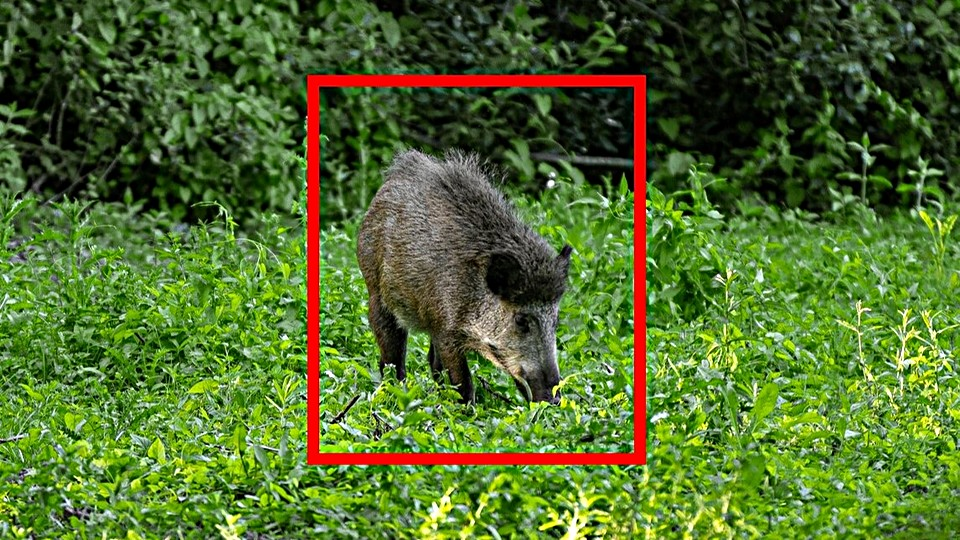
                <ul class="applabel">
                    <li>RZ/V2L</li>
                </ul>
                <ul class="appdetails">
                    <li>
                        
Defense wild animals for crop

                        
Detect the types of animals that enter your farm or barn for pest control.  

                        <b>Model</b>: YOLOv3 
                        <b>Dataset</b>: Animals Detection Images Dataset+Images.cv+Coco Dataset 
                        <b>Performance</b>: 3fps
                    </li>
                </ul>
            </a>
        

    

 
 
<h3 id="building" align="left"><i>Smart Building</i></h3>

    

        

            <a id="building1" class="applications" href="https://github.com/Ignitarium-Renesas/RZV2L_AiLibrary/tree/main/01_Head_count">
                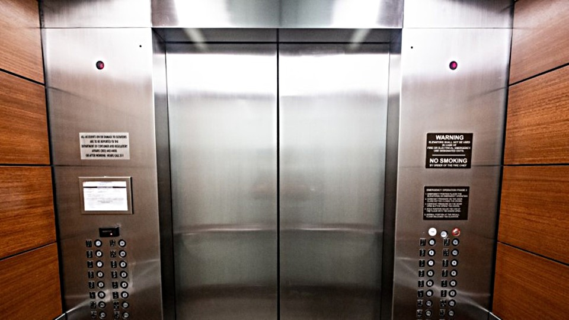
                <ul class="applabel">
                    <li>RZ/V2L</li>
                </ul>
                <ul class="appdetails">
                    <li>
                        
Elevator passengers Counting

                        Issues alerts if the elevator is overcrowded and exceeds its capacity.  
                        <b>Model</b>: YOLOv3 
                        <b>Dataset</b>: HollywoodHeads 
                        <b>Performance</b>: 3fps
                    </li>
                </ul>
            </a>
        

        

            <a id="building2" class="applications" href="https://github.com/Ignitarium-Renesas/RZV2L_AiLibrary/tree/main/01_Head_count">
                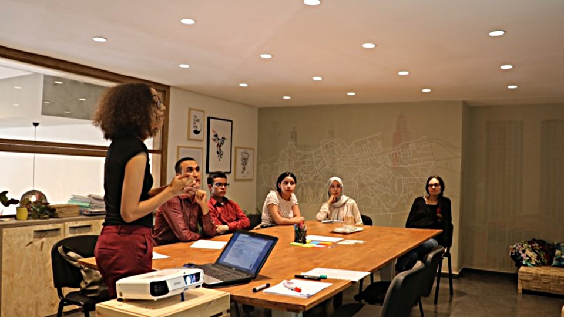
                <ul class="applabel">
                    <li>RZ/V2L</li>
                </ul>
                <ul class="appdetails">
                    <li>
                        
Conference Room Usage Monitor

                        Monitors if the meeting room is vacant by counting the number of people in the room.  
                        <b>Model</b>: YOLOv3 
                        <b>Dataset</b>: HollywoodHeads 
                        <b>Performance</b>: 3fps
                    </li>
                </ul>
            </a>
        

        

            <a id="building3" class="applications" href="https://github.com/Ignitarium-Renesas/RZV2L_AiLibrary/tree/main/01_Head_count">
                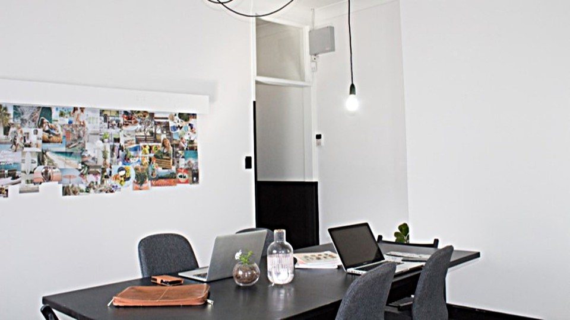
                <ul class="applabel">
                    <li>RZ/V2L</li>
                </ul>
                <ul class="appdetails">
                    <li>
                        
Lighting Control

                        Automatically controls the lighting according to the situation by counting the number of people in the room.  
                        <b>Model</b>: YOLOv3 
                        <b>Dataset</b>: HollywoodHeads 
                        <b>Performance</b>: 3fps
                    </li>
                </ul>
            </a>
        

        

        

        

            <a id="building4" class="applications" href="https://github.com/Ignitarium-Renesas/RZV2L_AiLibrary/tree/main/02_Line_crossing_object_counting">
                
                <ul class="applabel">
                    <li>RZ/V2L</li>
                </ul>
                <ul class="appdetails">
                    <li>
                        
Security Area Intrusion Detection

                        Detects illegal intrusions to security area in the office.  
                        <b>Model</b>: TinyYOLOv2 
                        <b>Dataset</b>: COCO 
                        <b>Performance</b>: 13fps
                    </li>
                </ul>
            </a>
        

        

            <a id="building5" class="applications" href="https://github.com/Ignitarium-Renesas/RZV2L_AiLibrary/tree/main/04_Safety_Helmet_Vest_Detection">
                
                <ul class="applabel">
                    <li>RZ/V2L</li>
                </ul>
                <ul class="appdetails">
                    <li>
                        
Wear management at construction sites

                        Analyzes the equipment of workers before entering the construction site by detecting the necessary equipment such as helmet or vest. It can be used to reduce the overload of  monitoring person and ensure workers to wear appropriate equipment.  
                        <b>Model</b>: YOLOv3 
                        <b>Dataset</b>: Safety Helmet Detection on kaggle 
                        <b>Performance</b>: 3fps
                    </li>
                </ul>
            </a>
        

        

            

                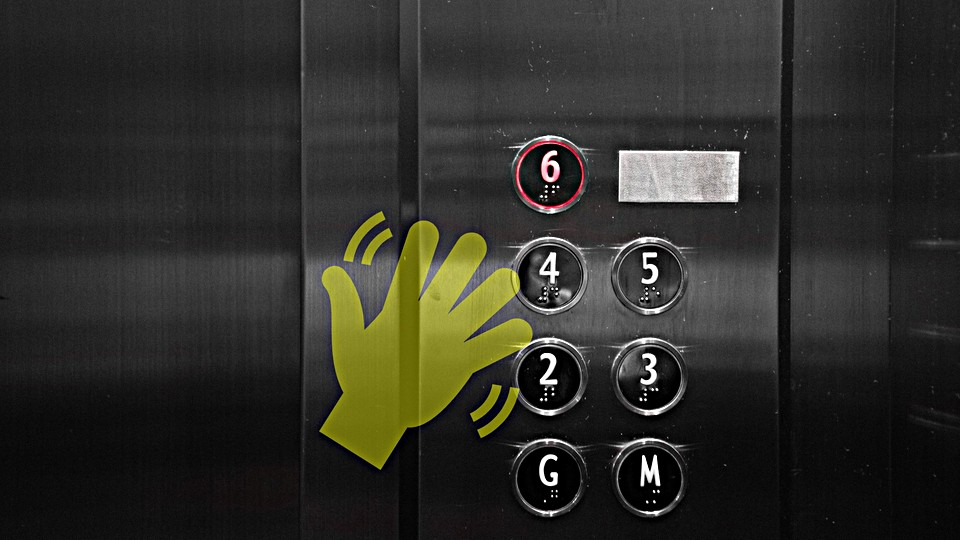
                <ul class="applabel">
                    <li>RZ/V2L</li>
                </ul>
                <ul class="appdetails">
                    <li>
                        
Touchless Controller for elevator

                        By using hand gestures, elevator operation can be done without touching the buttons.  
                        
<b>Coming soon...</b>

                    </li>
                </ul>
            

        

    

 
 
<h3 id="city" align="left"><i>Smart City</i></h3>

    

        

            <a id="city1" class="applications" href="https://github.com/Ignitarium-Renesas/RZV2L_AiLibrary/tree/main/01_Head_count">
                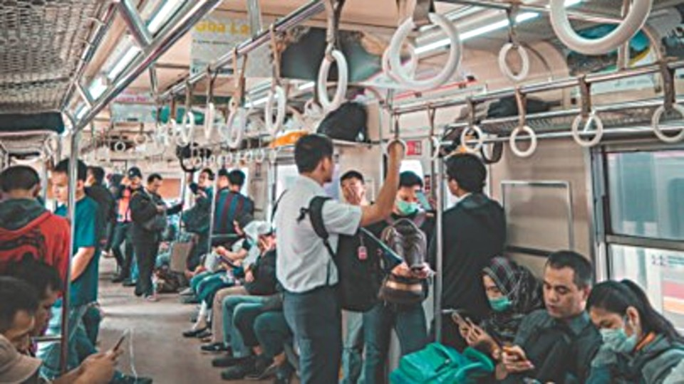
                <ul class="applabel">
                    <li>RZ/V2L</li>
                </ul>
                <ul class="appdetails">
                    <li>
                        
Congestion Detection in Railway Station

                        Monitors the congestion level on trains and buses by detecting the number of passengers.  
                        <b>Model</b>: YOLOv3 
                        <b>Dataset</b>: HollywoodHeads 
                        <b>Performance</b>: 3fps
                    </li>
                </ul>
            </a>
        

        

            <a id="city2" class="applications" href="https://github.com/Ignitarium-Renesas/RZV2L_AiLibrary/tree/main/02_Line_crossing_object_counting">
                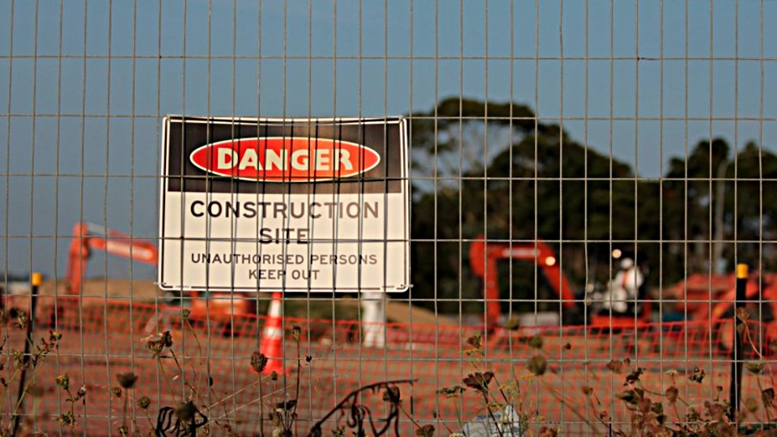
                <ul class="applabel">
                    <li>RZ/V2L</li>
                </ul>
                <ul class="appdetails">
                    <li>
                        
Prohibited Area Management

                        Prevents accidents and detects illegal intrusions in construction site by detecting the entry to prohibited areas.  
                        <b>Model</b>: TinyYOLOv2 
                        <b>Dataset</b>: COCO 
                        <b>Performance</b>: 13fps
                    </li>
                </ul>
            </a>
        

        

            <a id="city3" class="applications" href="https://github.com/Ignitarium-Renesas/RZV2L_AiLibrary/tree/main/09_Human_Gaze_Detection">
                
                <ul class="applabel">
                    <li>RZ/V2L</li>
                </ul>
                <ul class="appdetails">
                    <li>
                        
Distracted driving detection

                        Issues an alert when the driver is distracted by detecting the line of sight.  
                        <b>Model</b>: ResNet-18+Tiny YOLOv2 
                        <b>Dataset</b>: ETH-XGaze+WIDERFACE 
                        <b>Performance</b>: 3fps
                    </li>
                </ul>
            </a>
        

        

        

        

            <a id="city4" class="applications" href="https://github.com/renesas-rz/rzv_ai_sdk/tree/main/Q03_smart_parking">
                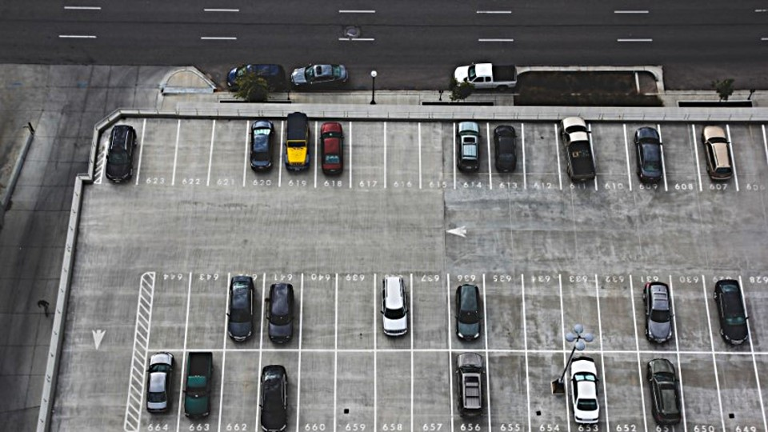
                <ul class="applabel">
                    <li>RZ/V2L</li>
                </ul>
                <ul class="appdetails">
                    <li>
                        
Parking Spot Reservation

                        Detects the occupancy of parking spot for reservation system.  
                        <b>Model</b>: Custom 
                        <b>Dataset</b>: Custom 
                        <b>Performance</b>: 4-7 msec per slot
                    </li>
                </ul>
            </a>
        

        

            <a id="city5" class="applications" href="https://github.com/renesas-rz/rzv_ai_sdk/tree/main/Q02_face_authentication">
                
                <ul class="applabel">
                    <li>RZ/V2L</li>
                </ul>
                <ul class="appdetails">
                    <li>
                        
Passport check support

                        Supports passport check in airport immigration by checking the match of users face and their passport.  
                        <b>Model</b>: FaceNet 
                        <b>Dataset</b>: FaceNet 
                        <b>Performance</b>: 2fps
                    </li>
                </ul>
            </a>
        

    

 
 
<h3 id="healthcare" align="left"><i>Healthcare</i></h3>

    

        

            <a id="healthcare1" class="applications" href="https://github.com/Ignitarium-Renesas/RZV2L_AiLibrary/tree/main/03_Elderly_fall_detection">
                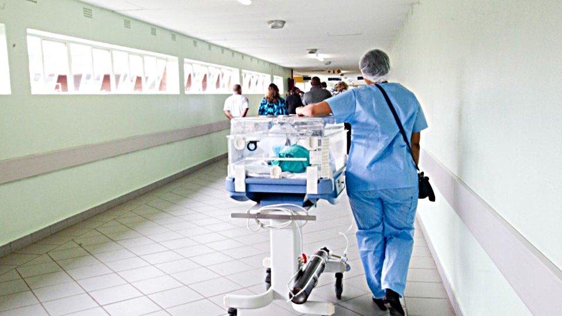
                <ul class="applabel">
                    <li>RZ/V2L</li>
                </ul>
                <ul class="appdetails">
                    <li>
                        
Physical Condition Monitor

                        Support the early rescue by detecting any changes in the body condition of patients/users in the hospitals and care facility when they are alone.  
                        <b>Model</b>: TinyYOLOv2+HRNet 
                        <b>Dataset</b>: PASCAL VOC+COCO 
                        <b>Performance</b>: 5fps
                    </li>
                </ul>
            </a>
        

    

 
 
<h3 id="home" align="left"><i>Smart Home</i></h3>

    

        

            <a id="home1" class="applications" href="https://github.com/Ignitarium-Renesas/RZV2L_AiLibrary/tree/main/01_Head_count">
                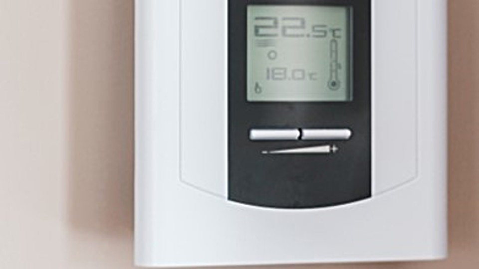
                <ul class="applabel">
                    <li>RZ/V2L</li>
                </ul>
                <ul class="appdetails">
                    <li>
                        
Air Conditioner Control

                        Automatically controls the air conditioning according to the situation by counting the number of people in the room.  
                        <b>Model</b>: YOLOv3 
                        <b>Dataset</b>: HollywoodHeads 
                        <b>Performance</b>: 3fps
                    </li>
                </ul>
            </a>
        

        

            <a id="home2" class="applications" href="https://github.com/Ignitarium-Renesas/RZV2L_AiLibrary/tree/main/07_Animal_Detection">
                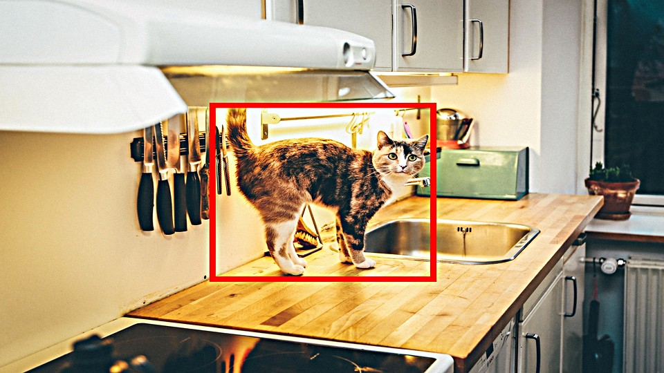
                <ul class="applabel">
                    <li>RZ/V2L</li>
                </ul>
                <ul class="appdetails">
                    <li>
                        
Pet Detection in Kitchen and Child's Room

                        Issues an alert when your pets have entered dangerous areas such as kitchen or children room.  
                        <b>Model</b>: YOLOv3 
                        <b>Dataset</b>: Animals Detection Images Dataset+Images.cv+Coco Dataset 
                        <b>Performance</b>: 3fps
                    </li>
                </ul>
            </a>
        

        

            

                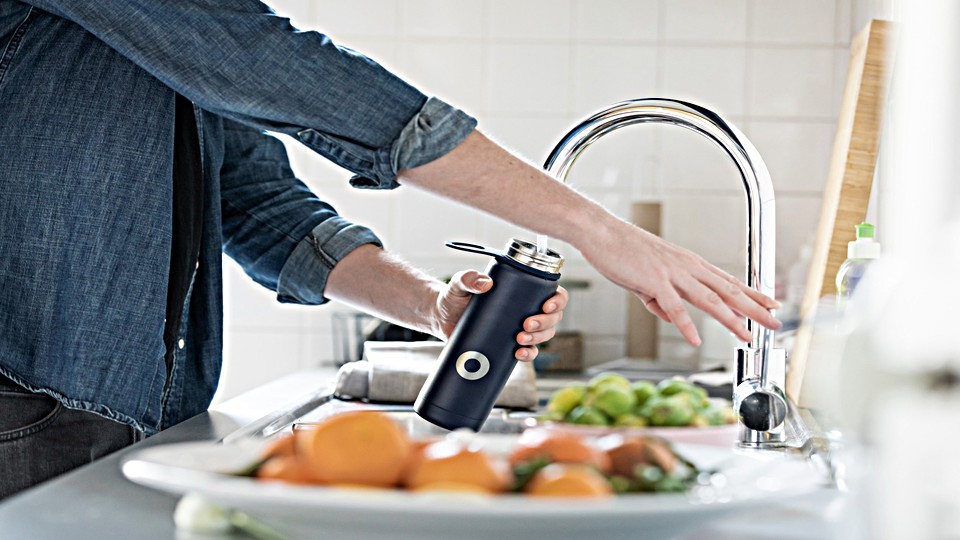
                <ul class="applabel">
                    <li>RZ/V2L</li>
                </ul>
                <ul class="appdetails">
                    <li>
                        
Touchless Controller for Kitchen Appliance

                        Allows you to control electrical appliances by the hand gestures without touching them.  
                        
<b>Coming soon...</b>

                    </li>
                </ul>
            

        

    

 
 
<h3 id="industrial" align="left"><i>Industrial</i></h3>

    

        

            <a id="industrial1" class="applications" href="https://github.com/Ignitarium-Renesas/RZV2L_AiLibrary/tree/main/01_Head_count">
                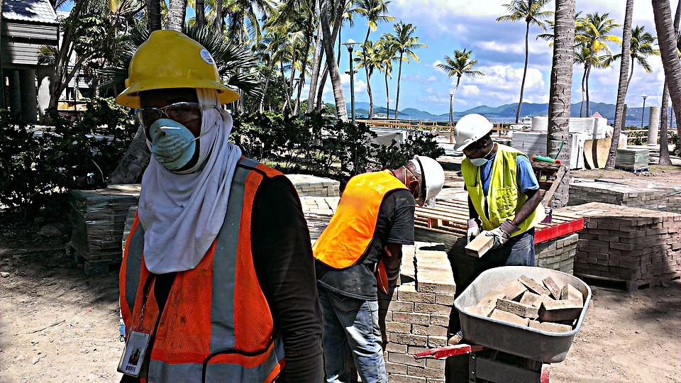
                <ul class="applabel">
                    <li>RZ/V2L</li>
                </ul>
                <ul class="appdetails">
                    <li>
                        
Work Area Personnel Management

                        Monitors attendance of workers by counting their number entered in the work area.  
                        <b>Model</b>: YOLOv3 
                        <b>Dataset</b>: HollywoodHeads 
                        <b>Performance</b>: 3fps
                    </li>
                </ul>
            </a>
        

        

            <a id="industrial2" class="applications" href="https://github.com/Ignitarium-Renesas/RZV2L_AiLibrary/tree/main/04_Safety_Helmet_Vest_Detection">
                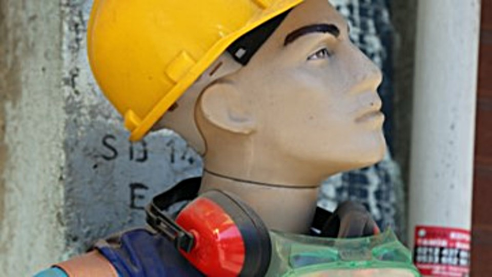
                <ul class="applabel">
                    <li>RZ/V2L</li>
                </ul>
                <ul class="appdetails">
                    <li>
                        
Helmet and safety vest wearing monitor

                        Increase the safety level in the factory by monitoring the helmet use.  
                        <b>Model</b>: YOLOv3 
                        <b>Dataset</b>: Safety Helmet Detection on kaggle 
                        <b>Performance</b>: 3fps
                    </li>
                </ul>
            </a>
        

        

            

                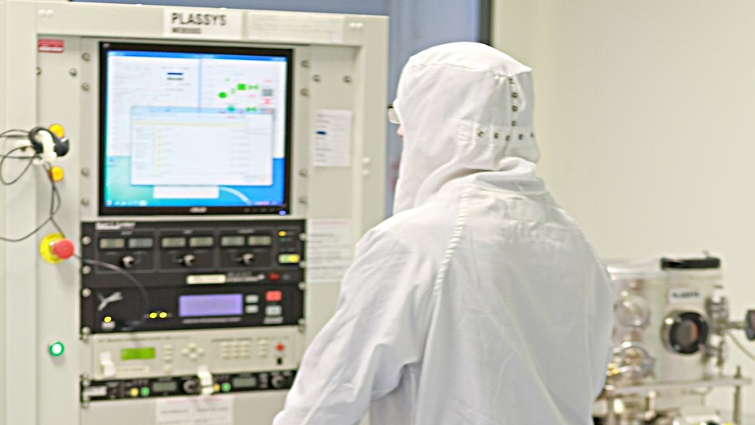
                <ul class="applabel">
                    <li>RZ/V2L</li>
                </ul>
                <ul class="appdetails">
                    <li>
                        
Touchless Controller for Industrial machine

                        Machine button operation can be done without contact using gestures in factory.  
                        
<b>Coming soon...</b>

                    </li>
                </ul>
            

        

    

 
 
<h3 id="retail" align="left"><i>Retail</i></h3>

    

        

            <a id="retail1" class="applications" href="https://github.com/Ignitarium-Renesas/RZV2L_AiLibrary/tree/main/01_Head_count">
                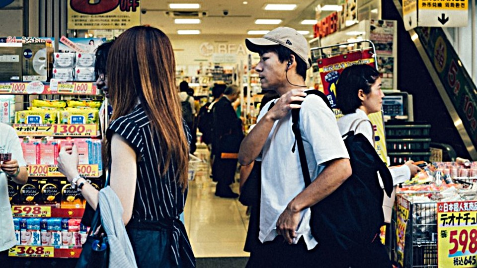
                <ul class="applabel">
                    <li>RZ/V2L</li>
                </ul>
                <ul class="appdetails">
                    <li>
                        
Congestion Detection

                        Issues an alert when the store is overcrowded with more customers.  
                        <b>Model</b>: YOLOv3 
                        <b>Dataset</b>: HollywoodHeads 
                        <b>Performance</b>: 3fps
                    </li>
                </ul>
            </a>
        

        

            <a id="retail2" class="applications" href="https://github.com/renesas-rz/rzv_ai_sdk/tree/main/Q01_footfall_counter">
                
                <ul class="applabel">
                    <li>RZ/V2L</li>
                </ul>
                <ul class="appdetails">
                    <li>
                        
Staying and flow line monitoring

                        Collects marketing data by monitoring the number of people and duration of their stay in a certain place.  
                        <b>Model</b>: TinyYOLOv3 
                        <b>Dataset</b>: COCO 
                        <b>Performance</b>: 9fps
                    </li>
                </ul>
            </a>
        

    

 
 