

    

        

            AI Applications 
            for RZ/V series
        

    

 
<h5 align="left">
    AI Applications are provided with pre-trained AI models.   
    Select each application to access the source code.   
    To run the AI Applications without constructing the AI SDK environment, refer to <a href="{{ site.url }}{{ site.baseurl }}#demo">Demo</a>.
</h5>

 

<!-- Copy applications.html start -->

<h3 id="agriculture" align="left"><i>Agriculture</i></h3>

    

        

            <li class="griditem" style="list-style: none;">
                
                <dt style="color: #2a289d;">Defense wild animals for crop</dt>
                <h6 class="appstatus" align="right"><b> </b></h6>
                

                    Detect the types of animals that enter your farm or barn for pest control.  
                

                

                    <b>Supported AI SDK:</b> v2.10 
                    <b>Function:</b> 07_Animal_detection 
                    <b>Model:</b> YOLOv3 
                    <b>Dataset:</b> Animals Detection Images Dataset+Images.cv+Coco Dataset 
                     
                

                <dl>
                    <dd style="display: flex">
                        

                            <a class="devicelinkbutton" href="https://github.com/Ignitarium-Renesas/RZV2L_AiLibrary/tree/main/07_Animal_detection" style="color:white">RZ/V2L ></a>
                            <!-- 
3fps
-->
                        

                    </dd>
                </dl>
            </li>
        

        

            <li class="griditem" style="list-style: none;">
                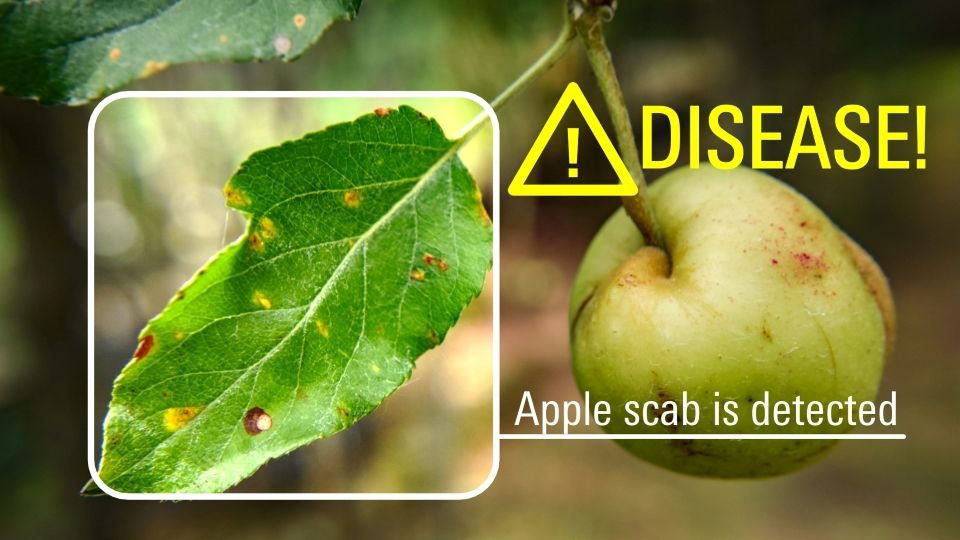
                <dt style="color: #2a289d;">Fruit and Vegetable Plant Disease Check</dt>
                <h6 class="appstatus" align="right"><b> </b></h6>
                

                    Supports farmer by classifying whether the plant has a disease or not.  
                

                

                    <b>Supported AI SDK:</b> v2.10 
                    <b>Function:</b> Q07_plant_disease_classification 
                    <b>Model:</b> Custom 
                    <b>Dataset:</b> New Plant Diseases Dataset 
                     
                

                <dl>
                    <dd style="display: flex">
                        

                            <a class="devicelinkbutton" href="https://github.com/renesas-rz/rzv_ai_sdk/tree/main/Q07_plant_disease_classification" style="color:white">RZ/V2L ></a>
                            <!-- 
9fps
-->
                        

                    </dd>
                </dl>
            </li>
        

        

            <li class="griditem" style="list-style: none;">
                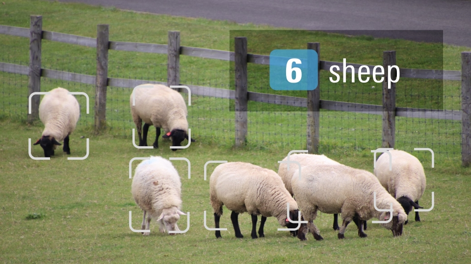
                <dt style="color: #2a289d;">Ranch Livestock Management</dt>
                <h6 class="appstatus" align="right"><b>New!</b></h6>
                

                    Counts the number of livestock to help monitor the number of animals bred in a ranch.  
                

                

                    <b>Supported AI SDK:</b> v2.10 
                    <b>Function:</b> Q08_object_counter (Animal Counting) 
                    <b>Model:</b> TinyYOLOv3 
                    <b>Dataset:</b> Custom 
                     
                

                <dl>
                    <dd style="display: flex">
                        

                            <a class="devicelinkbutton" href="https://github.com/renesas-rz/rzv_ai_sdk/tree/main/Q08_object_counter" style="color:white">RZ/V2L ></a>
                            <!-- 
6fps
-->
                        

                    </dd>
                </dl>
            </li>
        

    

 
 
<h3 id="building" align="left"><i>Smart Building</i></h3>

    

        

            <li class="griditem" style="list-style: none;">
                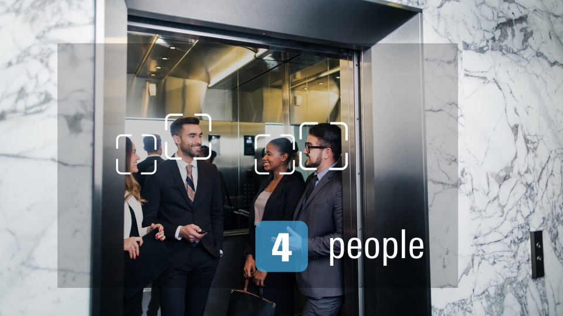
                <dt style="color: #2a289d;">Elevator passengers Counting</dt>
                <h6 class="appstatus" align="right"><b> </b></h6>
                

                    Issues alerts if the elevator is overcrowded and exceeds its capacity.  
                

                

                    <b>Supported AI SDK:</b> v2.10 
                    <b>Function:</b> 01_Head_count 
                    <b>Model:</b> YOLOv3 
                    <b>Dataset:</b> HollywoodHeads 
                     
                

                <dl>
                    <dd style="display: flex">
                        

                            <a class="devicelinkbutton" href="https://github.com/Ignitarium-Renesas/RZV2L_AiLibrary/tree/main/01_Head_count" style="color:white">RZ/V2L ></a>
                            <!-- 
3fps
-->
                        

                    </dd>
                </dl>
            </li>
        

        

            <li class="griditem" style="list-style: none;">
                
                <dt style="color: #2a289d;">Conference Room Usage Monitor</dt>
                <h6 class="appstatus" align="right"><b> </b></h6>
                

                    Monitors if the meeting room is vacant by counting the number of people in the room.  
                

                

                    <b>Supported AI SDK:</b> v2.10 
                    <b>Function:</b> 11_Head_count_topview 
                    <b>Model:</b> YOLOv3 
                    <b>Dataset:</b> Various dataset 
                     
                

                <dl>
                    <dd style="display: flex">
                        

                            <a class="devicelinkbutton" href="https://github.com/Ignitarium-Renesas/RZV2L_AiLibrary/tree/main/11_Head_count_topview" style="color:white">RZ/V2L ></a>
                            <!-- 
3fps
-->
                        

                    </dd>
                </dl>
            </li>
        

        

            <li class="griditem" style="list-style: none;">
                
                <dt style="color: #2a289d;">Lighting Control</dt>
                <h6 class="appstatus" align="right"><b> </b></h6>
                

                    Automatically controls the lighting according to the situation by counting the number of people in the room.  
                

                

                    <b>Supported AI SDK:</b> v2.10 
                    <b>Function:</b> 11_Head_count_topview 
                    <b>Model:</b> YOLOv3 
                    <b>Dataset:</b> Various dataset 
                     
                

                <dl>
                    <dd style="display: flex">
                        

                            <a class="devicelinkbutton" href="https://github.com/Ignitarium-Renesas/RZV2L_AiLibrary/tree/main/11_Head_count_topview" style="color:white">RZ/V2L ></a>
                            <!-- 
3fps
-->
                        

                    </dd>
                </dl>
            </li>
        

        

            <li class="griditem" style="list-style: none;">
                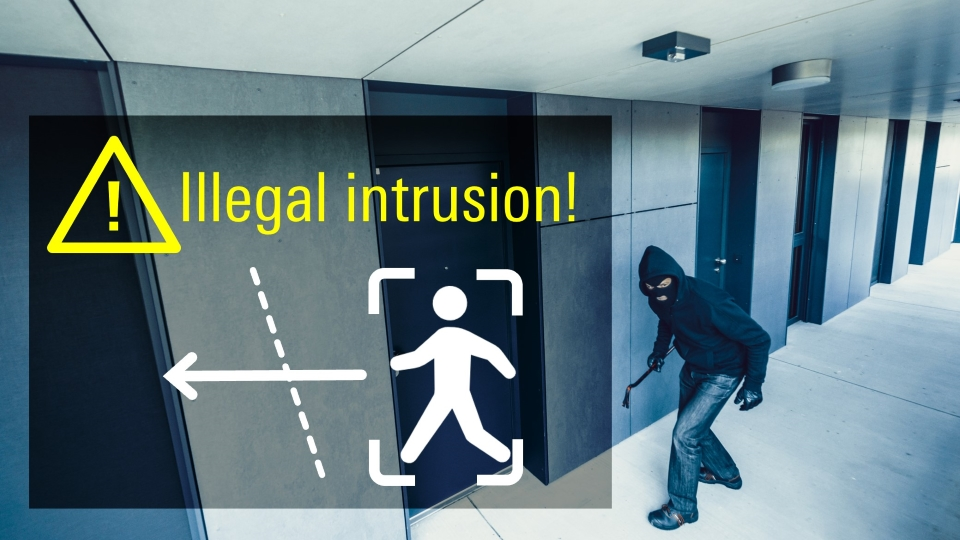
                <dt style="color: #2a289d;">Security Area Intrusion Detection</dt>
                <h6 class="appstatus" align="right"><b> </b></h6>
                

                    Detects illegal intrusions to security area in the office.  
                

                

                    <b>Supported AI SDK:</b> v2.10 
                    <b>Function:</b> 02_Line_crossing_object_counting 
                    <b>Model:</b> TinyYOLOv2 
                    <b>Dataset:</b> COCO 
                     
                

                <dl>
                    <dd style="display: flex">
                        

                            <a class="devicelinkbutton" href="https://github.com/Ignitarium-Renesas/RZV2L_AiLibrary/tree/main/02_Line_crossing_object_counting" style="color:white">RZ/V2L ></a>
                            <!-- 
13fps
-->
                        

                    </dd>
                </dl>
            </li>
        

        

            <li class="griditem" style="list-style: none;">
                
                <dt style="color: #2a289d;">Wear management at construction sites</dt>
                <h6 class="appstatus" align="right"><b> </b></h6>
                

                    Analyzes the equipment of workers before entering the construction site by detecting the necessary equipment such as helmet or vest. It can be used to reduce the overload of monitoring person and ensure workers to wear appropriate equipment.  
                

                

                    <b>Supported AI SDK:</b> v2.10 
                    <b>Function:</b> 04_Safety_helmet_vest_detection 
                    <b>Model:</b> YOLOv3 
                    <b>Dataset:</b> Safety Helmet Detection on kaggle 
                     
                

                <dl>
                    <dd style="display: flex">
                        

                            <a class="devicelinkbutton" href="https://github.com/Ignitarium-Renesas/RZV2L_AiLibrary/tree/main/04_Safety_helmet_vest_detection" style="color:white">RZ/V2L ></a>
                            <!-- 
3fps
-->
                        

                    </dd>
                </dl>
            </li>
        

        

            <li class="griditem" style="list-style: none;">
                
                <dt style="color: #2a289d;">Touchless Controller for elevator</dt>
                <h6 class="appstatus" align="right"><b> </b></h6>
                

                    By using hand gestures, elevator operation can be done without touching the buttons.  
                

                

                    <b>Supported AI SDK:</b> v2.10 
                    <b>Function:</b> 12_Hand_gesture_recognition_v2 
                    <b>Model:</b> TinyYOLOv2+ResNet18 
                    <b>Dataset:</b> YOLO-Hand-Detection for hand detection and HAgrid for classifier 
                     
                

                <dl>
                    <dd style="display: flex">
                        

                            <a class="devicelinkbutton" href="https://github.com/Ignitarium-Renesas/RZV2L_AiLibrary/tree/main/12_Hand_gesture_recognition_v2" style="color:white">RZ/V2L ></a>
                            <!-- 
11~20fps for single hand
-->
                        

                    </dd>
                </dl>
            </li>
        

        

            <li class="griditem" style="list-style: none;">
                
                <dt style="color: #2a289d;">Employee ID check for Restricted Area</dt>
                <h6 class="appstatus" align="right"><b> </b></h6>
                

                    Checks the employee ID and the person matches before entering to restricted area.  
                

                

                    <b>Supported AI SDK:</b> v2.10 
                    <b>Function:</b> Q02_face_authentication 
                    <b>Model:</b> FaceNet 
                    <b>Dataset:</b> FaceNet 
                     
                

                <dl>
                    <dd style="display: flex">
                        

                            <a class="devicelinkbutton" href="https://github.com/renesas-rz/rzv_ai_sdk/tree/main/Q02_face_authentication" style="color:white">RZ/V2L ></a>
                            <!-- 
2fps
-->
                        

                    </dd>
                </dl>
            </li>
        

    

 
 
<h3 id="city" align="left"><i>Smart City</i></h3>

    

        

            <li class="griditem" style="list-style: none;">
                
                <dt style="color: #2a289d;">Congestion Detection in Railway Station</dt>
                <h6 class="appstatus" align="right"><b> </b></h6>
                

                    Monitors the congestion level on trains and buses by detecting the number of passengers.  
                

                

                    <b>Supported AI SDK:</b> v2.10 
                    <b>Function:</b> 11_Head_count_topview 
                    <b>Model:</b> YOLOv3 
                    <b>Dataset:</b> Various dataset 
                     
                

                <dl>
                    <dd style="display: flex">
                        

                            <a class="devicelinkbutton" href="https://github.com/Ignitarium-Renesas/RZV2L_AiLibrary/tree/main/11_Head_count_topview" style="color:white">RZ/V2L ></a>
                            <!-- 
3fps
-->
                        

                    </dd>
                </dl>
            </li>
        

        

            <li class="griditem" style="list-style: none;">
                
                <dt style="color: #2a289d;">Prohibited Area Management</dt>
                <h6 class="appstatus" align="right"><b> </b></h6>
                

                    Prevents accidents and detects illegal intrusions in construction site by detecting the entry to prohibited areas.  
                

                

                    <b>Supported AI SDK:</b> v2.10 
                    <b>Function:</b> 02_Line_crossing_object_counting 
                    <b>Model:</b> TinyYOLOv2 
                    <b>Dataset:</b> COCO 
                     
                

                <dl>
                    <dd style="display: flex">
                        

                            <a class="devicelinkbutton" href="https://github.com/Ignitarium-Renesas/RZV2L_AiLibrary/tree/main/02_Line_crossing_object_counting" style="color:white">RZ/V2L ></a>
                            <!-- 
13fps
-->
                        

                    </dd>
                </dl>
            </li>
        

        

            <li class="griditem" style="list-style: none;">
                
                <dt style="color: #2a289d;">Distracted driving detection</dt>
                <h6 class="appstatus" align="right"><b> </b></h6>
                

                    Issues an alert when the driver is distracted by detecting the line of sight.  
                

                

                    <b>Supported AI SDK:</b> v2.10 
                    <b>Function:</b> 09_Human_gaze_detection 
                    <b>Model:</b> ResNet-18+Tiny YOLOv2 
                    <b>Dataset:</b> ETH-XGaze+WIDERFACE 
                     
                

                <dl>
                    <dd style="display: flex">
                        

                            <a class="devicelinkbutton" href="https://github.com/Ignitarium-Renesas/RZV2L_AiLibrary/tree/main/09_Human_gaze_detection" style="color:white">RZ/V2L ></a>
                            <!-- 
3fps
-->
                        

                    </dd>
                </dl>
            </li>
        

        

            <li class="griditem" style="list-style: none;">
                
                <dt style="color: #2a289d;">Duration monitoring for surveillance camera</dt>
                <h6 class="appstatus" align="right"><b> </b></h6>
                

                    Prevents the theft by monitoring whether there is a suspicious person wandering around the specified area.  Can be used in car dealer, housing, etc.  
                

                

                    <b>Supported AI SDK:</b> v2.10 
                    <b>Function:</b> Q01_footfall_counter 
                    <b>Model:</b> TinyYOLOv3 
                    <b>Dataset:</b> COCO 
                     
                

                <dl>
                    <dd style="display: flex">
                        

                            <a class="devicelinkbutton" href="https://github.com/renesas-rz/rzv_ai_sdk/tree/main/Q01_footfall_counter" style="color:white">RZ/V2L ></a>
                            <!-- 
9fps
-->
                        

                    </dd>
                </dl>
            </li>
        

        

            <li class="griditem" style="list-style: none;">
                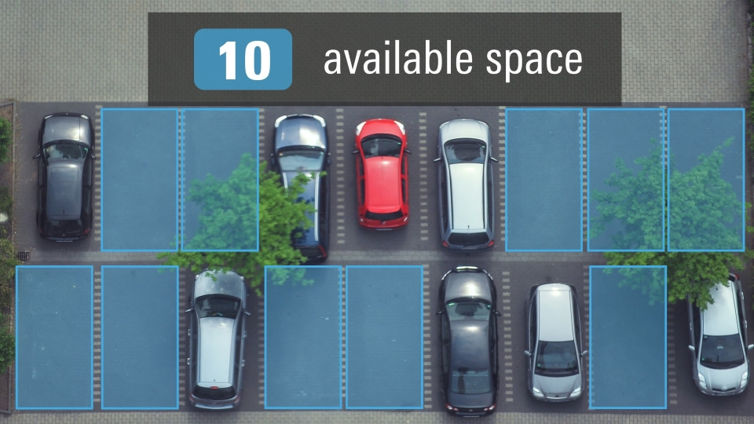
                <dt style="color: #2a289d;">Parking Spot Reservation</dt>
                <h6 class="appstatus" align="right"><b> </b></h6>
                

                    Detects the occupancy of parking spot for reservation system.  
                

                

                    <b>Supported AI SDK:</b> v2.10 
                    <b>Function:</b> Q03_smart_parking 
                    <b>Model:</b> Custom 
                    <b>Dataset:</b> Custom 
                     
                

                <dl>
                    <dd style="display: flex">
                        

                            <a class="devicelinkbutton" href="https://github.com/renesas-rz/rzv_ai_sdk/tree/main/Q03_smart_parking" style="color:white">RZ/V2L ></a>
                            <!-- 
4-7 msec per slot
-->
                        

                    </dd>
                </dl>
            </li>
        

        

            <li class="griditem" style="list-style: none;">
                
                <dt style="color: #2a289d;">Illegal Parking Check</dt>
                <h6 class="appstatus" align="right"><b> </b></h6>
                

                    Detects the parking violation by monitoring the car presence in a restricted area.  
                

                

                    <b>Supported AI SDK:</b> v2.10 
                    <b>Function:</b> Q03_smart_parking 
                    <b>Model:</b> Custom 
                    <b>Dataset:</b> Custom 
                     
                

                <dl>
                    <dd style="display: flex">
                        

                            <a class="devicelinkbutton" href="https://github.com/renesas-rz/rzv_ai_sdk/tree/main/Q03_smart_parking" style="color:white">RZ/V2L ></a>
                            <!-- 
4-7 msec per slot
-->
                        

                    </dd>
                </dl>
            </li>
        

        

            <li class="griditem" style="list-style: none;">
                
                <dt style="color: #2a289d;">Passport check support</dt>
                <h6 class="appstatus" align="right"><b> </b></h6>
                

                    Supports passport check in airport immigration by checking the match of users face and their passport.  
                

                

                    <b>Supported AI SDK:</b> v2.10 
                    <b>Function:</b> Q02_face_authentication 
                    <b>Model:</b> FaceNet 
                    <b>Dataset:</b> FaceNet 
                     
                

                <dl>
                    <dd style="display: flex">
                        

                            <a class="devicelinkbutton" href="https://github.com/renesas-rz/rzv_ai_sdk/tree/main/Q02_face_authentication" style="color:white">RZ/V2L ></a>
                            <!-- 
2fps
-->
                        

                    </dd>
                </dl>
            </li>
        

        

            <li class="griditem" style="list-style: none;">
                
                <dt style="color: #2a289d;">Bus passenger counting</dt>
                <h6 class="appstatus" align="right"><b> </b></h6>
                

                    Counts the number of passengers on public transportation. It is also effective in preventing children from being left behind on school buses.  
                

                

                    <b>Supported AI SDK:</b> v2.10 
                    <b>Function:</b> 11_Head_count_topview 
                    <b>Model:</b> YOLOv3 
                    <b>Dataset:</b> Various dataset 
                     
                

                <dl>
                    <dd style="display: flex">
                        

                            <a class="devicelinkbutton" href="https://github.com/Ignitarium-Renesas/RZV2L_AiLibrary/tree/main/11_Head_count_topview" style="color:white">RZ/V2L ></a>
                            <!-- 
3fps
-->
                        

                    </dd>
                </dl>
            </li>
        

        

            <li class="griditem" style="list-style: none;">
                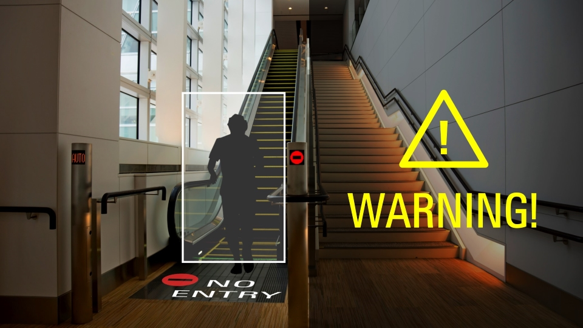
                <dt style="color: #2a289d;">Backtravel Detection</dt>
                <h6 class="appstatus" align="right"><b> </b></h6>
                

                    Detects people going backwards on one-way stairs, aisles, or escalators. Helps preventing congestion and accidents.  
                

                

                    <b>Supported AI SDK:</b> v2.10 
                    <b>Function:</b> 02_Line_crossing_object_counting 
                    <b>Model:</b> TinyYOLOv2 
                    <b>Dataset:</b> COCO 
                     
                

                <dl>
                    <dd style="display: flex">
                        

                            <a class="devicelinkbutton" href="https://github.com/Ignitarium-Renesas/RZV2L_AiLibrary/tree/main/02_Line_crossing_object_counting" style="color:white">RZ/V2L ></a>
                            <!-- 
13fps
-->
                        

                    </dd>
                </dl>
            </li>
        

        

            <li class="griditem" style="list-style: none;">
                
                <dt style="color: #2a289d;">Violence Activity Check in Surveillance Camera</dt>
                <h6 class="appstatus" align="right"><b> </b></h6>
                

                    Supports the surveillance system by monitoring the suspicious/violent activity.  
                

                

                    <b>Supported AI SDK:</b> v2.10 
                    <b>Function:</b> Q05_suspicious_activity 
                    <b>Model:</b> EfficientNet+MLP 
                    <b>Dataset:</b> Real Life Violence Situations Dataset 
                     
                

                <dl>
                    <dd style="display: flex">
                        

                            <a class="devicelinkbutton" href="https://github.com/renesas-rz/rzv_ai_sdk/tree/main/Q05_suspicious_activity" style="color:white">RZ/V2L ></a>
                            <!-- 
2fps
-->
                        

                    </dd>
                </dl>
            </li>
        

        

            <li class="griditem" style="list-style: none;">
                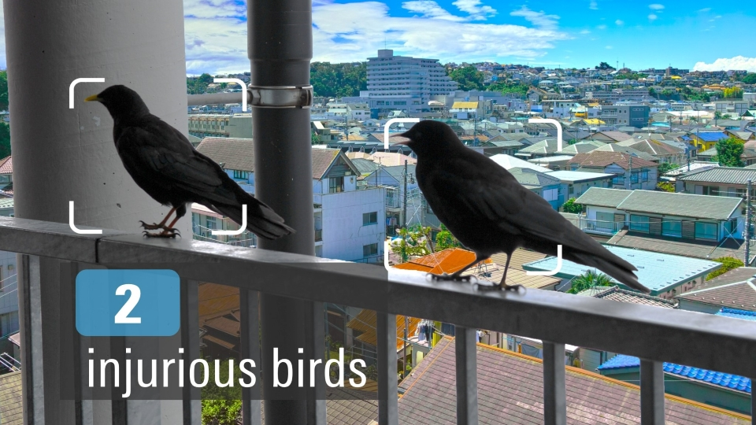
                <dt style="color: #2a289d;">Bird Damage Prevention</dt>
                <h6 class="appstatus" align="right"><b>New!</b></h6>
                

                    Counts birds captured by the camera and alerts the user. It can be used to prevent bird damage in parks, residential areas, or fields.  
                

                

                    <b>Supported AI SDK:</b> v2.10 
                    <b>Function:</b> Q08_object_counter (Animal Counting) 
                    <b>Model:</b> TinyYOLOv3 
                    <b>Dataset:</b> Custom 
                     
                

                <dl>
                    <dd style="display: flex">
                        

                            <a class="devicelinkbutton" href="https://github.com/renesas-rz/rzv_ai_sdk/tree/main/Q08_object_counter" style="color:white">RZ/V2L ></a>
                            <!-- 
6fps
-->
                        

                    </dd>
                </dl>
            </li>
        

        

            <li class="griditem" style="list-style: none;">
                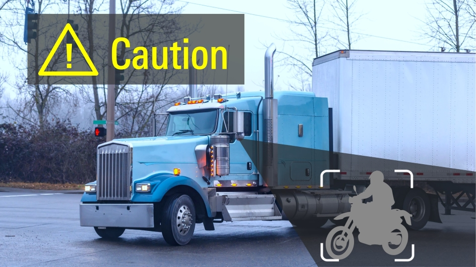
                <dt style="color: #2a289d;">Blind Spot Monitor</dt>
                <h6 class="appstatus" align="right"><b>New!</b></h6>
                

                    Detects vehicles that enter the driver's blind spot. It can detect motorcycles and bicycles to help prevent accidents when turning a corner.  
                

                

                    <b>Supported AI SDK:</b> v2.10 
                    <b>Function:</b> Q08_object_counter (Vehicle Counting) 
                    <b>Model:</b> TinyYOLOv3 
                    <b>Dataset:</b> Custom 
                     
                

                <dl>
                    <dd style="display: flex">
                        

                            <a class="devicelinkbutton" href="https://github.com/renesas-rz/rzv_ai_sdk/tree/main/Q08_object_counter" style="color:white">RZ/V2L ></a>
                            <!-- 
6fps
-->
                        

                    </dd>
                </dl>
            </li>
        

        

            <li class="griditem" style="list-style: none;">
                
                <dt style="color: #2a289d;">Preceding Vehicle Movement Alert</dt>
                <h6 class="appstatus" align="right"><b>New!</b></h6>
                

                    Detects the departure of the preceding vehicle. It prevents the driver from a delayed start when waiting at a traffic light or in a traffic jam.  
                

                

                    <b>Supported AI SDK:</b> v2.10 
                    <b>Function:</b> 13_Car_ahead_departure_detection (Vehicle Counting) 
                    <b>Model:</b> TinyYOLOv3 
                    <b>Dataset:</b> Custom 
                     
                

                <dl>
                    <dd style="display: flex">
                        

                            <a class="devicelinkbutton" href="https://github.com/Ignitarium-Renesas/RZV2L_AiLibrary/tree/main/13_Car_ahead_departure_detection" style="color:white">RZ/V2L ></a>
                            <!-- 
20fps
-->
                        

                    </dd>
                </dl>
            </li>
        

        

            <li class="griditem" style="list-style: none;">
                
                <dt style="color: #2a289d;">Emergency Vehicles Detector</dt>
                <h6 class="appstatus" align="right"><b>New!</b></h6>
                

                    Detects an emergency vehicle approaching from behind and alerts the driver. The driver can notice the emergency vehicle at an early stage.  
                

                

                    <b>Supported AI SDK:</b> v2.10 
                    <b>Function:</b> Q08_object_counter (Vehicle Counting) 
                    <b>Model:</b> TinyYOLOv3 
                    <b>Dataset:</b> Custom 
                     
                

                <dl>
                    <dd style="display: flex">
                        

                            <a class="devicelinkbutton" href="https://github.com/renesas-rz/rzv_ai_sdk/tree/main/Q08_object_counter" style="color:white">RZ/V2L ></a>
                            <!-- 
6fps
-->
                        

                    </dd>
                </dl>
            </li>
        

        

            <li class="griditem" style="list-style: none;">
                
                <dt style="color: #2a289d;">Illegal Bicycle Approach Detection</dt>
                <h6 class="appstatus" align="right"><b>New!</b></h6>
                

                    Detects whether motorcycles are in pedestrian-only areas. It can prevent illegal parking or accidents.  
                

                

                    <b>Supported AI SDK:</b> v2.10 
                    <b>Function:</b> Q08_object_counter (Vehicle Counting) 
                    <b>Model:</b> TinyYOLOv3 
                    <b>Dataset:</b> Custom 
                     
                

                <dl>
                    <dd style="display: flex">
                        

                            <a class="devicelinkbutton" href="https://github.com/renesas-rz/rzv_ai_sdk/tree/main/Q08_object_counter" style="color:white">RZ/V2L ></a>
                            <!-- 
6fps
-->
                        

                    </dd>
                </dl>
            </li>
        

        

            <li class="griditem" style="list-style: none;">
                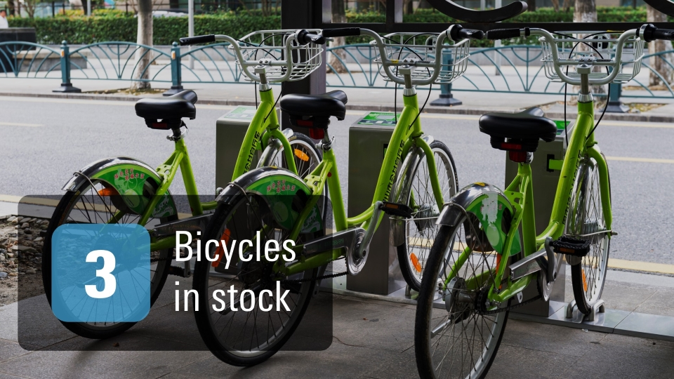
                <dt style="color: #2a289d;">Bicycle Rental Stock Management</dt>
                <h6 class="appstatus" align="right"><b>New!</b></h6>
                

                    Counts the number of bicycles that are not being used in bicycle rental shops to support bicycle inventory management.  
                

                

                    <b>Supported AI SDK:</b> v2.10 
                    <b>Function:</b> Q08_object_counter (Vehicle Counting) 
                    <b>Model:</b> TinyYOLOv3 
                    <b>Dataset:</b> Custom 
                     
                

                <dl>
                    <dd style="display: flex">
                        

                            <a class="devicelinkbutton" href="https://github.com/renesas-rz/rzv_ai_sdk/tree/main/Q08_object_counter" style="color:white">RZ/V2L ></a>
                            <!-- 
6fps
-->
                        

                    </dd>
                </dl>
            </li>
        

        

            <li class="griditem" style="list-style: none;">
                
                <dt style="color: #2a289d;">Illegal Bicycle Parking Monitor Support</dt>
                <h6 class="appstatus" align="right"><b>New!</b></h6>
                

                    Detects illegally abandoned bicycles in front of train stations or other locations to reduce burdens on patrols.  
                

                

                    <b>Supported AI SDK:</b> v2.10 
                    <b>Function:</b> Q08_object_counter (Vehicle Counting) 
                    <b>Model:</b> TinyYOLOv3 
                    <b>Dataset:</b> Custom 
                     
                

                <dl>
                    <dd style="display: flex">
                        

                            <a class="devicelinkbutton" href="https://github.com/renesas-rz/rzv_ai_sdk/tree/main/Q08_object_counter" style="color:white">RZ/V2L ></a>
                            <!-- 
6fps
-->
                        

                    </dd>
                </dl>
            </li>
        

        

            <li class="griditem" style="list-style: none;">
                
                <dt style="color: #2a289d;">Infrastructure Defect Prevention</dt>
                <h6 class="appstatus" align="right"><b>New!</b></h6>
                

                    Detect cracks in tunnels or road surfaces. It helps to find deterioration and damage to infrastructure.  
                

                

                    <b>Supported AI SDK:</b> v2.10 
                    <b>Function:</b> Q09_crack_segmentation 
                    <b>Model:</b> Unet 
                    <b>Dataset:</b> Crack Segmentation Dataset 
                     
                

                <dl>
                    <dd style="display: flex">
                        

                            <a class="devicelinkbutton" href="https://github.com/renesas-rz/rzv_ai_sdk/tree/main/Q09_crack_segmentation" style="color:white">RZ/V2L ></a>
                            <!-- 
8fps
-->
                        

                    </dd>
                </dl>
            </li>
        

        

            <li class="griditem" style="list-style: none;">
                
                <dt style="color: #2a289d;">Crime Prevention Support for School</dt>
                <h6 class="appstatus" align="right"><b>New!</b></h6>
                

                    Detects suspiciously dressed persons at schools or cram schools to help prevent crimes in which dangerous individuals attempt to harm students.  
                

                

                    <b>Supported AI SDK:</b> v2.10 
                    <b>Function:</b> Q10_suspicious_person_detection 
                    <b>Model:</b> TinyYOLOv3 
                    <b>Dataset:</b> Custom 
                     
                

                <dl>
                    <dd style="display: flex">
                        

                            <a class="devicelinkbutton" href="https://github.com/renesas-rz/rzv_ai_sdk/tree/main/Q10_suspicious_person_detection" style="color:white">RZ/V2L ></a>
                            <!-- 
6fps
-->
                        

                    </dd>
                </dl>
            </li>
        

    

 
 
<h3 id="healthcare" align="left"><i>Healthcare</i></h3>

    

        

            <li class="griditem" style="list-style: none;">
                
                <dt style="color: #2a289d;">Physical Condition Monitor</dt>
                <h6 class="appstatus" align="right"><b>Updated!</b></h6>
                

                    Support the early rescue by detecting any changes in the body condition of patients/users in the hospitals and care facility when they are alone.  
                

                

                    <b>Supported AI SDK:</b> v2.10 
                    <b>Function:</b> 03_Elderly_fall_detection 
                    <b>Model:</b> TinyYOLOv2+HRNet 
                    <b>Dataset:</b> PASCAL VOC+COCO 
                     
                

                <dl>
                    <dd style="display: flex">
                        

                            <a class="devicelinkbutton" href="https://github.com/Ignitarium-Renesas/RZV2L_AiLibrary/tree/main/03_Elderly_fall_detection" style="color:white">RZ/V2L ></a>
                            <!-- 
5fps
-->
                        

                    </dd>
                </dl>
            </li>
        

    

 
 
<h3 id="home" align="left"><i>Smart Home</i></h3>

    

        

            <li class="griditem" style="list-style: none;">
                
                <dt style="color: #2a289d;">Air Conditioner Control</dt>
                <h6 class="appstatus" align="right"><b> </b></h6>
                

                    Automatically controls the air conditioning according to the situation by counting the number of people in the room.  
                

                

                    <b>Supported AI SDK:</b> v2.10 
                    <b>Function:</b> 11_Head_count_topview 
                    <b>Model:</b> YOLOv3 
                    <b>Dataset:</b> Various dataset 
                     
                

                <dl>
                    <dd style="display: flex">
                        

                            <a class="devicelinkbutton" href="https://github.com/Ignitarium-Renesas/RZV2L_AiLibrary/tree/main/11_Head_count_topview" style="color:white">RZ/V2L ></a>
                            <!-- 
3fps
-->
                        

                    </dd>
                </dl>
            </li>
        

        

            <li class="griditem" style="list-style: none;">
                
                <dt style="color: #2a289d;">Smart TV</dt>
                <h6 class="appstatus" align="right"><b> </b></h6>
                

                    Provides smart TV system, which switches to favorite TV channel by collecting the data of family members and TV contents that they watched.  
                

                

                    <b>Supported AI SDK:</b> v2.10 
                    <b>Function:</b> 06_Face_recognition_spoof_detection 
                    <b>Model:</b> ResNet-50 
                    <b>Dataset:</b> VGGFace2 
                     
                

                <dl>
                    <dd style="display: flex">
                        

                            <a class="devicelinkbutton" href="https://github.com/Ignitarium-Renesas/RZV2L_AiLibrary/tree/main/06_Face_recognition_spoof_detection" style="color:white">RZ/V2L ></a>
                            <!-- 
11fps
-->
                        

                    </dd>
                </dl>
            </li>
        

        

            <li class="griditem" style="list-style: none;">
                
                <dt style="color: #2a289d;">Pet Detection in Kitchen and Child's Room</dt>
                <h6 class="appstatus" align="right"><b> </b></h6>
                

                    Issues an alert when your pets have entered dangerous areas such as kitchen or children room.  
                

                

                    <b>Supported AI SDK:</b> v2.10 
                    <b>Function:</b> 07_Animal_detection 
                    <b>Model:</b> YOLOv3 
                    <b>Dataset:</b> Animals Detection Images Dataset+Images.cv+Coco Dataset 
                     
                

                <dl>
                    <dd style="display: flex">
                        

                            <a class="devicelinkbutton" href="https://github.com/Ignitarium-Renesas/RZV2L_AiLibrary/tree/main/07_Animal_detection" style="color:white">RZ/V2L ></a>
                            <!-- 
3fps
-->
                        

                    </dd>
                </dl>
            </li>
        

        

            <li class="griditem" style="list-style: none;">
                
                <dt style="color: #2a289d;">Touchless Controller for Kitchen Appliance</dt>
                <h6 class="appstatus" align="right"><b> </b></h6>
                

                    Allows you to control electrical appliances by the hand gestures without touching them.  
                

                

                    <b>Supported AI SDK:</b> v2.10 
                    <b>Function:</b> 12_Hand_gesture_recognition_v2 
                    <b>Model:</b> TinyYOLOv2+ResNet18 
                    <b>Dataset:</b> YOLO-Hand-Detection for hand detection and HAgrid for classifier 
                     
                

                <dl>
                    <dd style="display: flex">
                        

                            <a class="devicelinkbutton" href="https://github.com/Ignitarium-Renesas/RZV2L_AiLibrary/tree/main/12_Hand_gesture_recognition_v2" style="color:white">RZ/V2L ></a>
                            <!-- 
11~20fps for single hand
-->
                        

                    </dd>
                </dl>
            </li>
        

        

            <li class="griditem" style="list-style: none;">
                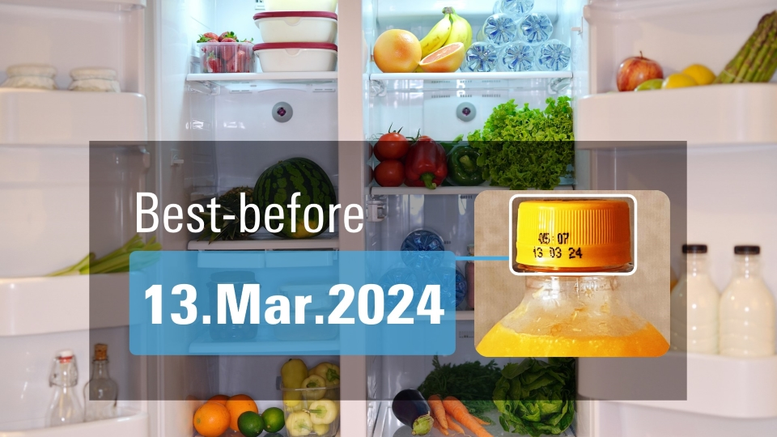
                <dt style="color: #2a289d;">Food Package Expiry Date Check</dt>
                <h6 class="appstatus" align="right"><b> </b></h6>
                

                    Monitors the expiry date of food placed in the refrigerator.  
                

                

                    <b>Supported AI SDK:</b> v2.10 
                    <b>Function:</b> Q06_expiry_date_detection 
                    <b>Model:</b> TinyYOLOv3+Tesseract 
                    <b>Dataset:</b> ExpDate 
                     
                

                <dl>
                    <dd style="display: flex">
                        

                            <a class="devicelinkbutton" href="https://github.com/renesas-rz/rzv_ai_sdk/tree/main/Q06_expiry_date_detection" style="color:white">RZ/V2L ></a>
                            <!-- 
9fps for TinyYOLOv3
-->
                        

                    </dd>
                </dl>
            </li>
        

    

 
 
<h3 id="industrial" align="left"><i>Industrial</i></h3>

    

        

            <li class="griditem" style="list-style: none;">
                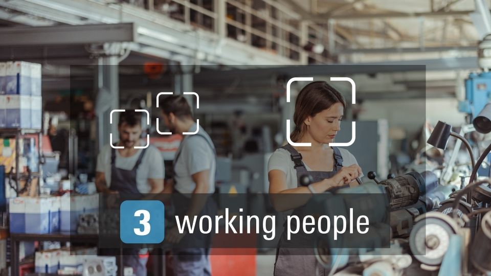
                <dt style="color: #2a289d;">Work Area Personnel Management</dt>
                <h6 class="appstatus" align="right"><b> </b></h6>
                

                    Monitors attendance of workers by counting their number entered in the work area.  
                

                

                    <b>Supported AI SDK:</b> v2.10 
                    <b>Function:</b> 01_Head_count 
                    <b>Model:</b> YOLOv3 
                    <b>Dataset:</b> HollywoodHeads 
                     
                

                <dl>
                    <dd style="display: flex">
                        

                            <a class="devicelinkbutton" href="https://github.com/Ignitarium-Renesas/RZV2L_AiLibrary/tree/main/01_Head_count" style="color:white">RZ/V2L ></a>
                            <!-- 
3fps
-->
                        

                    </dd>
                </dl>
            </li>
        

        

            <li class="griditem" style="list-style: none;">
                
                <dt style="color: #2a289d;">Access Control</dt>
                <h6 class="appstatus" align="right"><b> </b></h6>
                

                    Monitors the total number of visitors by counting the number of people who have passed through the entrance/exit.  
                

                

                    <b>Supported AI SDK:</b> v2.10 
                    <b>Function:</b> 02_Line_crossing_object_counting 
                    <b>Model:</b> TinyYOLOv2 
                    <b>Dataset:</b> COCO 
                     
                

                <dl>
                    <dd style="display: flex">
                        

                            <a class="devicelinkbutton" href="https://github.com/Ignitarium-Renesas/RZV2L_AiLibrary/tree/main/02_Line_crossing_object_counting" style="color:white">RZ/V2L ></a>
                            <!-- 
13fps
-->
                        

                    </dd>
                </dl>
            </li>
        

        

            <li class="griditem" style="list-style: none;">
                
                <dt style="color: #2a289d;">Helmet and safety vest wearing monitor</dt>
                <h6 class="appstatus" align="right"><b> </b></h6>
                

                    Increase the safety level in the factory by monitoring the helmet use.  
                

                

                    <b>Supported AI SDK:</b> v2.10 
                    <b>Function:</b> 04_Safety_helmet_vest_detection 
                    <b>Model:</b> YOLOv3 
                    <b>Dataset:</b> Safety Helmet Detection on kaggle 
                     
                

                <dl>
                    <dd style="display: flex">
                        

                            <a class="devicelinkbutton" href="https://github.com/Ignitarium-Renesas/RZV2L_AiLibrary/tree/main/04_Safety_helmet_vest_detection" style="color:white">RZ/V2L ></a>
                            <!-- 
3fps
-->
                        

                    </dd>
                </dl>
            </li>
        

        

            <li class="griditem" style="list-style: none;">
                
                <dt style="color: #2a289d;">Touchless Controller for Industrial machine</dt>
                <h6 class="appstatus" align="right"><b> </b></h6>
                

                    Machine button operation can be done without contact using gestures in factory.  
                

                

                    <b>Supported AI SDK:</b> v2.10 
                    <b>Function:</b> 12_Hand_gesture_recognition_v2 
                    <b>Model:</b> TinyYOLOv2+ResNet18 
                    <b>Dataset:</b> YOLO-Hand-Detection for hand detection and HAgrid for classifier 
                     
                

                <dl>
                    <dd style="display: flex">
                        

                            <a class="devicelinkbutton" href="https://github.com/Ignitarium-Renesas/RZV2L_AiLibrary/tree/main/12_Hand_gesture_recognition_v2" style="color:white">RZ/V2L ></a>
                            <!-- 
11~20fps for single hand
-->
                        

                    </dd>
                </dl>
            </li>
        

        

            <li class="griditem" style="list-style: none;">
                
                <dt style="color: #2a289d;">Driver Monitoring System</dt>
                <h6 class="appstatus" align="right"><b> </b></h6>
                

                    Detects whether the driver is looking aside, yawning or closing his eyes. Prevents car accidents by detecting when the driver is getting sleepy while driving.  
                

                

                    <b>Supported AI SDK:</b> v2.10 
                    <b>Function:</b> 10_Driver_monitoring_system 
                    <b>Model:</b> TinyYOLOv2+DeepPose 
                    <b>Dataset:</b> WIDERFACE/WFLW 
                     
                

                <dl>
                    <dd style="display: flex">
                        

                            <a class="devicelinkbutton" href="https://github.com/Ignitarium-Renesas/RZV2L_AiLibrary/tree/main/10_Driver_monitoring_system" style="color:white">RZ/V2L ></a>
                            <!-- 
6fps
-->
                        

                    </dd>
                </dl>
            </li>
        

        

            <li class="griditem" style="list-style: none;">
                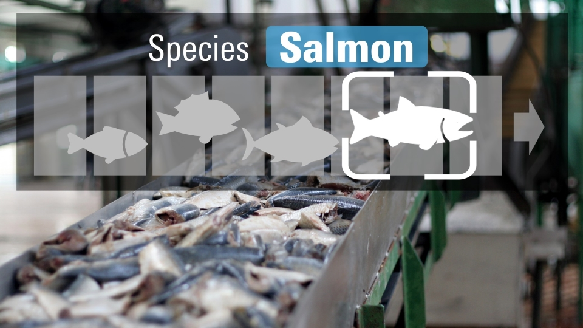
                <dt style="color: #2a289d;">Species check support in Fish Factory</dt>
                <h6 class="appstatus" align="right"><b> </b></h6>
                

                    Classifies the fish species shown in the camera to support the fish processing industry.  
                

                

                    <b>Supported AI SDK:</b> v2.10 
                    <b>Function:</b> Q04_fish_classification 
                    <b>Model:</b> EfficientNet based 
                    <b>Dataset:</b> Fish Dataset 
                     
                

                <dl>
                    <dd style="display: flex">
                        

                            <a class="devicelinkbutton" href="https://github.com/renesas-rz/rzv_ai_sdk/tree/main/Q04_fish_classification" style="color:white">RZ/V2L ></a>
                            <!-- 
15fps
-->
                        

                    </dd>
                </dl>
            </li>
        

        

            <li class="griditem" style="list-style: none;">
                
                <dt style="color: #2a289d;">Defect Inspection Support</dt>
                <h6 class="appstatus" align="right"><b>New!</b></h6>
                

                    Monitors the factory production line to detect cracks in the manufactured products. It supports the product inspection process.  
                

                

                    <b>Supported AI SDK:</b> v2.10 
                    <b>Function:</b> Q09_crack_segmentation 
                    <b>Model:</b> Unet 
                    <b>Dataset:</b> Crack Segmentation Dataset 
                     
                

                <dl>
                    <dd style="display: flex">
                        

                            <a class="devicelinkbutton" href="https://github.com/renesas-rz/rzv_ai_sdk/tree/main/Q09_crack_segmentation" style="color:white">RZ/V2L ></a>
                            <!-- 
8fps
-->
                        

                    </dd>
                </dl>
            </li>
        

        

            <li class="griditem" style="list-style: none;">
                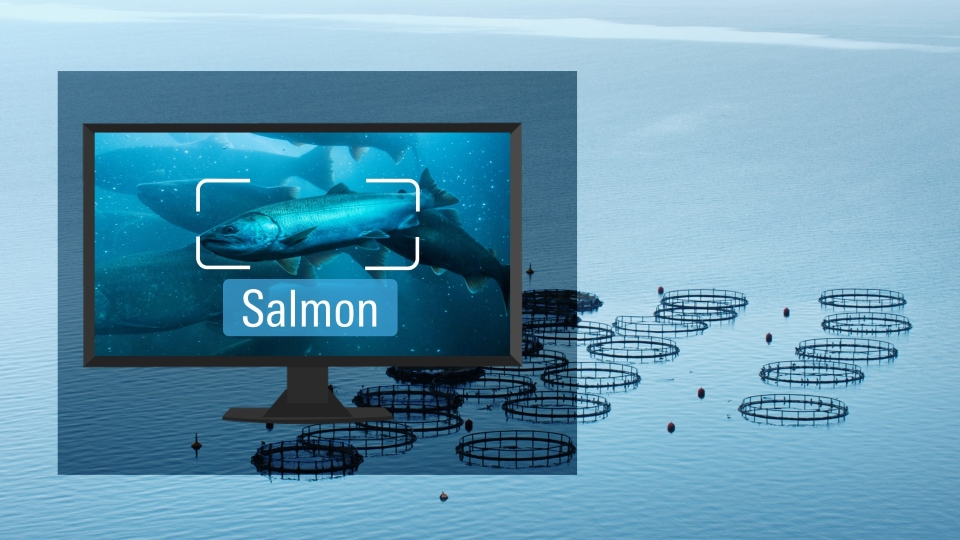
                <dt style="color: #2a289d;">Aquaculture Industrial Support</dt>
                <h6 class="appstatus" align="right"><b>New!</b></h6>
                

                    Monitors fish to help aquaculture operators to manage their resources.  
                

                

                    <b>Supported AI SDK:</b> v2.10 
                    <b>Function:</b> Q11_fish_detection 
                    <b>Model:</b> TinyYOLOv3 
                    <b>Dataset:</b> Custom 
                     
                

                <dl>
                    <dd style="display: flex">
                        

                            <a class="devicelinkbutton" href="https://github.com/renesas-rz/rzv_ai_sdk/tree/main/Q11_fish_detection" style="color:white">RZ/V2L ></a>
                            <!-- 
7fps
-->
                        

                    </dd>
                </dl>
            </li>
        

    

 
 
<h3 id="retail" align="left"><i>Retail</i></h3>

    

        

            <li class="griditem" style="list-style: none;">
                
                <dt style="color: #2a289d;">Congestion Detection</dt>
                <h6 class="appstatus" align="right"><b> </b></h6>
                

                    Issues an alert when the store is overcrowded with more customers.  
                

                

                    <b>Supported AI SDK:</b> v2.10 
                    <b>Function:</b> 11_Head_count_topview 
                    <b>Model:</b> YOLOv3 
                    <b>Dataset:</b> Various dataset 
                     
                

                <dl>
                    <dd style="display: flex">
                        

                            <a class="devicelinkbutton" href="https://github.com/Ignitarium-Renesas/RZV2L_AiLibrary/tree/main/11_Head_count_topview" style="color:white">RZ/V2L ></a>
                            <!-- 
3fps
-->
                        

                    </dd>
                </dl>
            </li>
        

        

            <li class="griditem" style="list-style: none;">
                
                <dt style="color: #2a289d;">Smart POS</dt>
                <h6 class="appstatus" align="right"><b> </b></h6>
                

                    Supports checking ages of customers by checking their age in front of the casher and linking the information with their purchase.  
                

                

                    <b>Supported AI SDK:</b> v2.10 
                    <b>Function:</b> 05_Age_gender_detection 
                    <b>Model:</b> ResNet-18/ResNet-50 
                    <b>Dataset:</b> Unknown 
                     
                

                <dl>
                    <dd style="display: flex">
                        

                            <a class="devicelinkbutton" href="https://github.com/Ignitarium-Renesas/RZV2L_AiLibrary/tree/main/05_Age_gender_detection" style="color:white">RZ/V2L ></a>
                            <!-- 
27fps/11fps
-->
                        

                    </dd>
                </dl>
            </li>
        

        

            <li class="griditem" style="list-style: none;">
                
                <dt style="color: #2a289d;">Marketing Interest Analysis</dt>
                <h6 class="appstatus" align="right"><b> </b></h6>
                

                    "Monitors the gaze direction of customer in the retail store,  which can be used to collect marketing information."  
                

                

                    <b>Supported AI SDK:</b> v2.10 
                    <b>Function:</b> 09_Human_gaze_detection 
                    <b>Model:</b> ResNet-18+Tiny YOLOv2 
                    <b>Dataset:</b> ETH-XGaze+WIDERFACE 
                     
                

                <dl>
                    <dd style="display: flex">
                        

                            <a class="devicelinkbutton" href="https://github.com/Ignitarium-Renesas/RZV2L_AiLibrary/tree/main/09_Human_gaze_detection" style="color:white">RZ/V2L ></a>
                            <!-- 
3fps
-->
                        

                    </dd>
                </dl>
            </li>
        

        

            <li class="griditem" style="list-style: none;">
                
                <dt style="color: #2a289d;">Staying and flow line monitoring</dt>
                <h6 class="appstatus" align="right"><b> </b></h6>
                

                    Collects marketing data by monitoring the number of people and duration of their stay in a certain place.  
                

                

                    <b>Supported AI SDK:</b> v2.10 
                    <b>Function:</b> Q01_footfall_counter 
                    <b>Model:</b> TinyYOLOv3 
                    <b>Dataset:</b> COCO 
                     
                

                <dl>
                    <dd style="display: flex">
                        

                            <a class="devicelinkbutton" href="https://github.com/renesas-rz/rzv_ai_sdk/tree/main/Q01_footfall_counter" style="color:white">RZ/V2L ></a>
                            <!-- 
9fps
-->
                        

                    </dd>
                </dl>
            </li>
        

        

            <li class="griditem" style="list-style: none;">
                
                <dt style="color: #2a289d;">Exhibition Participants Monitoring</dt>
                <h6 class="appstatus" align="right"><b> </b></h6>
                

                    Monitor the number of visitors to an exhibition or other open space. Changes in the number of participants can also be detected since it counts the number of participants in real time.  
                

                

                    <b>Supported AI SDK:</b> v2.10 
                    <b>Function:</b> 11_Head_count_topview 
                    <b>Model:</b> YOLOv3 
                    <b>Dataset:</b> Various dataset 
                     
                

                <dl>
                    <dd style="display: flex">
                        

                            <a class="devicelinkbutton" href="https://github.com/Ignitarium-Renesas/RZV2L_AiLibrary/tree/main/11_Head_count_topview" style="color:white">RZ/V2L ></a>
                            <!-- 
3fps
-->
                        

                    </dd>
                </dl>
            </li>
        

        

            <li class="griditem" style="list-style: none;">
                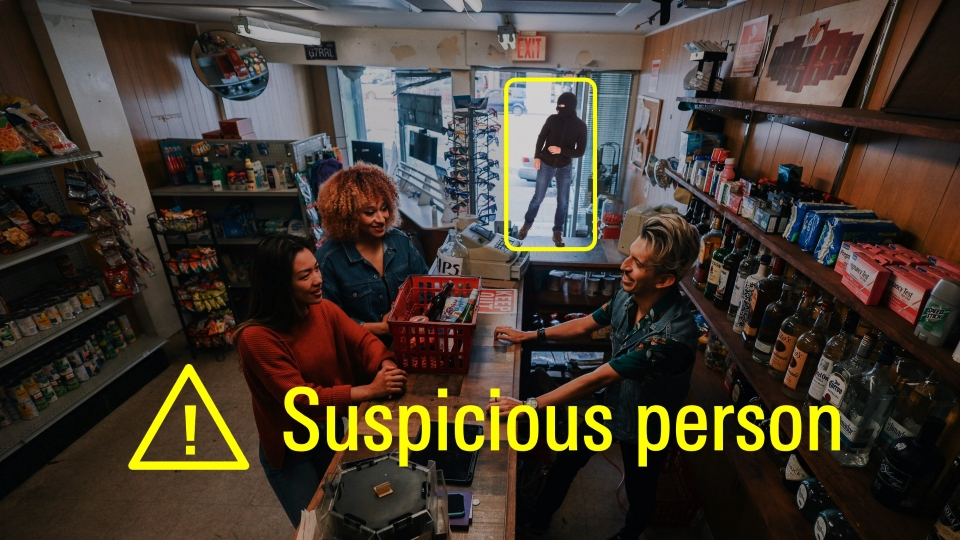
                <dt style="color: #2a289d;">Store Crime Prevention</dt>
                <h6 class="appstatus" align="right"><b>New!</b></h6>
                

                    Detects suspiciously dressed persons in convenience stores or unmanned stores to prevent theft.  
                

                

                    <b>Supported AI SDK:</b> v2.10 
                    <b>Function:</b> Q10_suspicious_person_detection 
                    <b>Model:</b> TinyYOLOv3 
                    <b>Dataset:</b> Custom 
                     
                

                <dl>
                    <dd style="display: flex">
                        

                            <a class="devicelinkbutton" href="https://github.com/renesas-rz/rzv_ai_sdk/tree/main/Q10_suspicious_person_detection" style="color:white">RZ/V2L ></a>
                            <!-- 
6fps
-->
                        

                    </dd>
                </dl>
            </li>
        

    

 
 

    

        

            <a class="btn btn-secondary square-button" href="{{ site.url }}{{ site.baseurl }}#page-top" role="button">
Back to Top >
            </a>
        

    

 
 
    