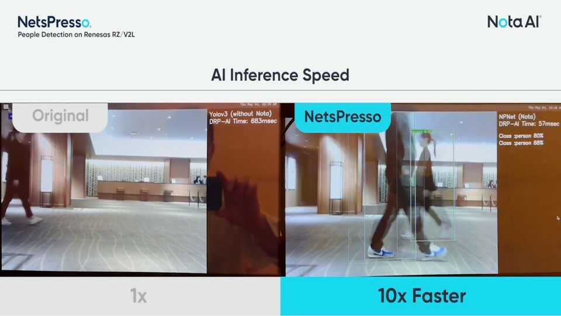
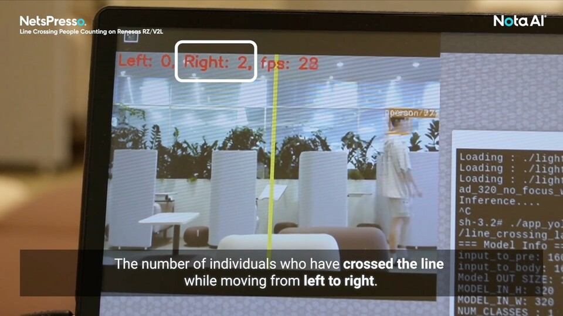
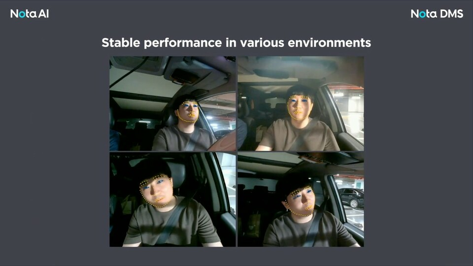
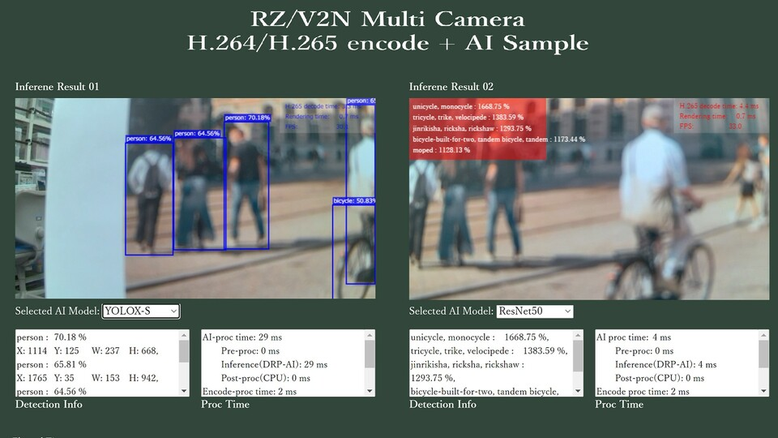

    

        

            Community
        

    

 
 
This page shows the Community Applications, which include applications developed by our partner company and applications other than AI Applications. 
For any enquiries, please contact each company. 

    

        

            <h3>Nota AI&reg;</h3>
        

        

            Nota AI&reg; is a leader in on-device AI model optimization and intelligent AI solutions, enabling devices to achieve high-performance AI capabilities without reliance on the cloud. Our proprietary NetsPresso&reg; platform optimizes AI models specifically for resource-constrained devices, delivering exceptional performance, efficiency, and scalability across various industries. From enhancing IoT devices to supporting advanced automotive applications, Nota AI empowers partners to bring smarter, faster AI solutions to the edge. 
        

        

            
        

    

     
    

        

            <li class="griditem" style="list-style: none;">
                
                <dt class="mt-1" style="color: #2a289d;">People Detection on RZ/V2L</dt>
                <h6 class="appstatus" align="right"><b> </b></h6>
                

                    The People Detection application utilizes advanced AI algorithms optimized for Renesas RZ/V microprocessors. This model enables real-time human figure detection, even in complex or crowded environments, enhancing security and operational efficiency.  
                

                <dl>
                    <dd style="display: flex">
                        

                            <a class="partnerlinkbutton" 
                                href="https://github.com/Nota-NetsPresso/Optimized-AI-Applications-for-Renesas-HWs/tree/main/1.%20People%20Detection%20on%20RZV2L" 
                                style="color:white">
                                Click >
                            </a>
                        

                    </dd>
                </dl>
            </li>
        

        

            <li class="griditem" style="list-style: none;">
                
                <dt class="mt-1" style="color: #2a289d;">Line Crossing People Counting on RZ/V2L</dt>
                <h6 class="appstatus" align="right"><b> </b></h6>
                

                    The Line Crossing People Counting application enables precise tracking of individuals crossing a designated line in real-time. Optimized for the Renesas RZ/V2L hardware, this model can detect and count people moving in specific directions, enhancing security and analytics capabilities.  
                

                <dl>
                    <dd style="display: flex">
                        

                            <a class="partnerlinkbutton" 
                                href="https://github.com/Nota-NetsPresso/Optimized-AI-Applications-for-Renesas-HWs/tree/main/2.%20Line%20Crossing%20People%20Counting%20on%20RZV2L" 
                                style="color:white">
                                Click >
                            </a>
                        

                    </dd>
                </dl>
            </li>
        

        

            <li class="griditem" style="list-style: none;">
                
                <dt class="mt-1" style="color: #2a289d;">Nota DMS</dt>
                <h6 class="appstatus" align="right"><b> </b></h6>
                

                    Commercial Fleets & Trucks: Monitors truck drivers to prevent fatigue-related accidents.
                     
                    Insurance & Telematics: Provides driver behavior data for usage-based insurance (UBI) models.
                      
                

                <dl>
                    <dd style="display: flex">
                        

                            <a class="partnerlinkbutton" 
                                href="https://github.com/Nota-NetsPresso/Optimized-AI-Applications-for-Renesas-HWs/tree/main/3.%20Driver%20Monitoring%20System%20on%20RZV2L" 
                                style="color:white">
                                Click >
                            </a>
                        

                    </dd>
                </dl>
            </li>
        

    

     
     
    

        

            <h3>Renesas Electronics</h3>
        

        

            In addition to <a href="{{ site.url }}{{ site.baseurl }}">RZ/V AI Applications</a>, Renesas Electronics provides sample applications, including non-AI applications, i.e., ISP. 
            To make an enquiry about these sample applications, please use "Support Tickets" > "Submit a Ticket" from <a href="https://www.renesas.com/support">Renesas Technical Support</a>.
        

        

            
        

    

     
    

        

            <li class="griditem" style="list-style: none;">
                
                <dt class="mt-1" style="color: #2a289d;">Application for considering system control</dt>
                <h6 class="appstatus" align="right"><b> </b></h6>
                

                    The Image data from the camera sensor is captured via the MIPI-I/F. 
                    The input image is processed by the ISP built into the LSI. 
                    The processed data is then encoded and subjected to AI processing. 
                    The resulting processed data is then output via Ethernet. 
                    The sample application is included in the RZ/V ISP Support Package, which requires users to submit secure access request.  
                

                <dl>
                    <dd style="display: flex">
                        

                            <a class="partnerlinkbutton" 
                                href="https://www.renesas.com/software-tool/rzv2n-isp-support-package" 
                                style="color:white">
                                RZ/V2N >
                            </a>
                        

                    </dd>
                </dl>
            </li>
        

    

<!-- Template -->
    <!-- 

        

            <h3>Company Name</h3>
        

        

            Company overview, features, etc. 
        

        

            
        

    

     
    

        

            <li class="griditem" style="list-style: none;">
                
                <dt class="mt-1" style="color: #2a289d;">Application Name</dt>
                <h6 class="appstatus" align="right"><b> </b></h6>
                

                    The application image size must be size of 960x540. The maximum number of characters for application name above and application explanation (this statement) is note stated, but note that longer sentense may not look fancy.  
                

                <dl>
                    <dd style="display: flex">
                        

                            <a class="partnerlinkbutton" href="" style="color:white">Click ></a>
                        

                    </dd>
                </dl>
            </li>
        

        

            <li class="griditem" style="list-style: none;">
                
                <dt class="mt-1" style="color: #2a289d;">Application Name</dt>
                <h6 class="appstatus" align="right"><b> </b></h6>
                

                    Explanation Explanation  Explanation  Explanation  Explanation  Explanation  Explanation  Explanation  Explanation  Explanation  Explanation  Explanation.  
                

                <dl>
                    <dd style="display: flex">
                        

                            <a class="partnerlinkbutton" href="" style="color:white">Click ></a>
                        

                    </dd>
                </dl>
            </li>
        

    
 -->
<!-- Template End -->
     
     
     
    

        

            <a class="btn btn-secondary square-button" href="{{ site.url }}{{ site.baseurl }}" role="button">
                Back to Home >
            </a>
        

    

