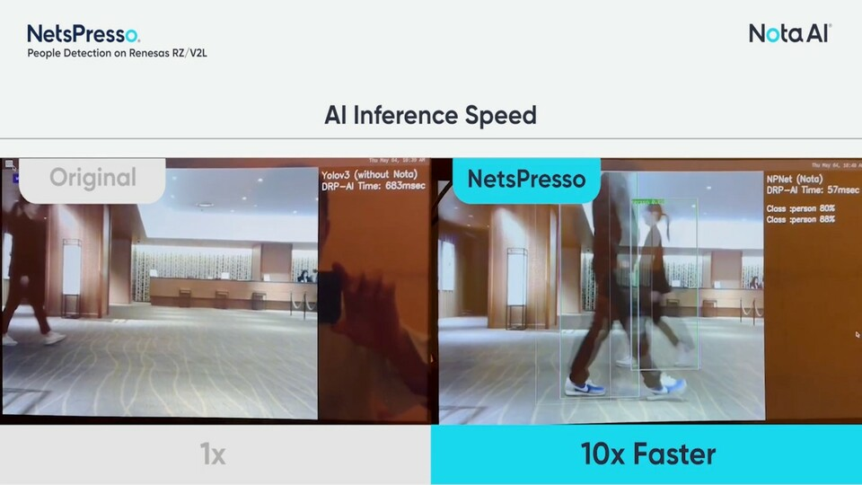
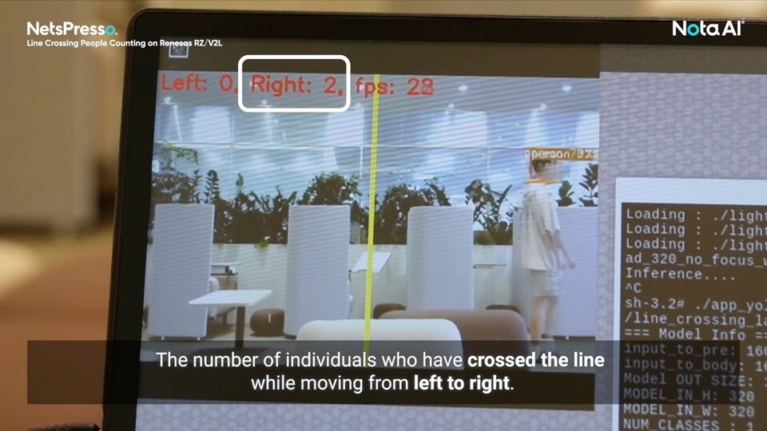
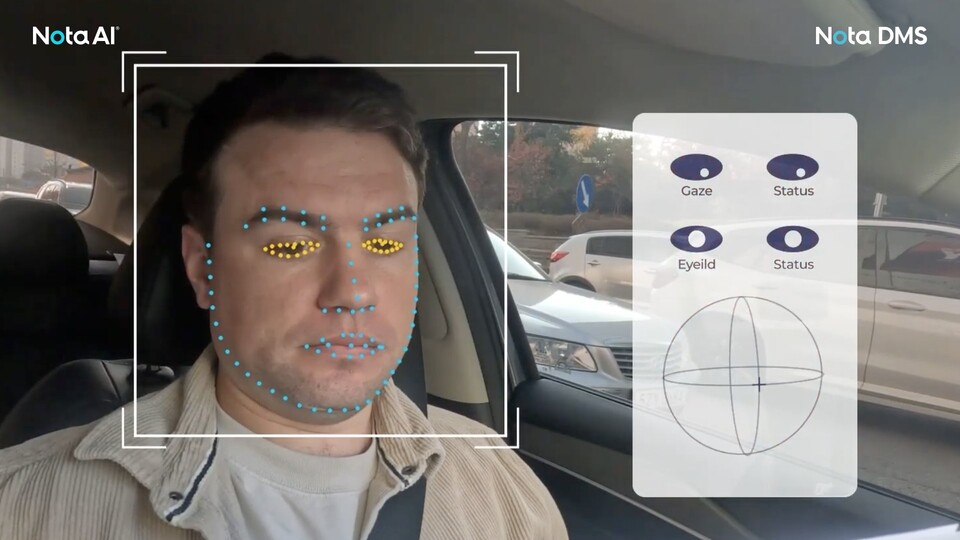
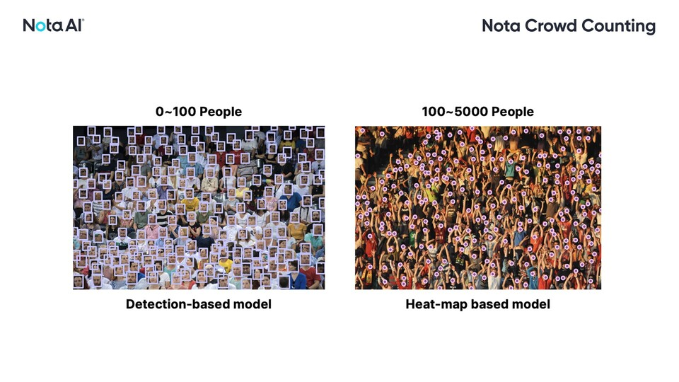
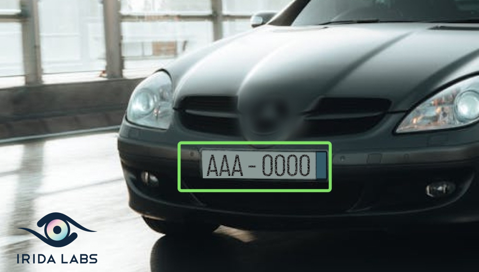
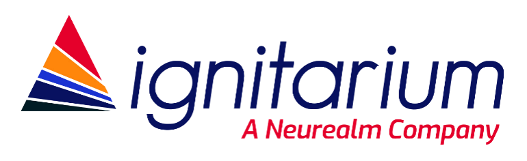
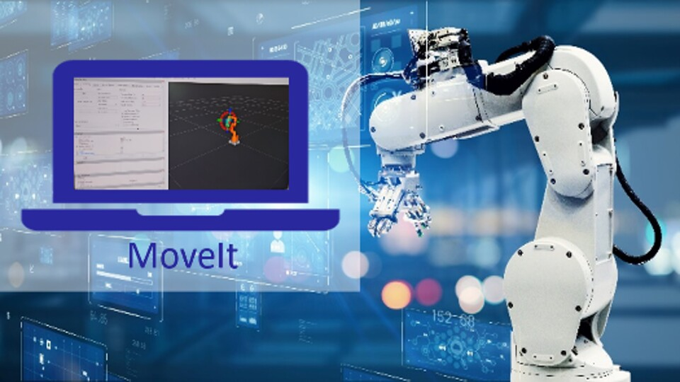

    

        

            Community
        

    

 
 
This page shows the Partner Applications, which include applications developed by our partner company 
For any enquiries, please contact each company. 
Or if you have general questions, please use Renesas Technical Support. 
<a class="btn btn-secondary square-button ms-3 mt-1" 
    style="text-align:left;" 
    href="https://www.renesas.com/support" 
    role="button"
    target="_blank" 
    rel="noopener noreferrer">
    
        Technical Support >
         
        
            Forum, FAQ and Support Tickets. 
        
    
</a>
 
 

    

        

            <h3>Nota AI&reg;</h3>
        

        

            Nota AI&reg; is a leader in on-device AI model optimization and intelligent AI solutions, enabling devices to achieve high-performance AI capabilities without reliance on the cloud. Our proprietary NetsPresso&reg; platform optimizes AI models specifically for resource-constrained devices, delivering exceptional performance, efficiency, and scalability across various industries. From enhancing IoT devices to supporting advanced automotive applications, Nota AI empowers partners to bring smarter, faster AI solutions to the edge. 
        

        

            
        

    

     
    

        

            <li class="griditem" style="list-style: none;">
                
                <dt class="mt-1" style="color: #2a289d;">People Detection on RZ/V2L</dt>
                <h6 class="appstatus" align="right">
                    
                        Vision AI
                    
                     
                </h6>
                

                    The People Detection application utilizes advanced AI algorithms optimized for Renesas RZ/V microprocessors. This model enables real-time human figure detection, even in complex or crowded environments, enhancing security and operational efficiency.  
                

                <dl>
                    <dd style="display: flex">
                        

                            <a class="partnerlinkbutton" 
                                href="https://github.com/Nota-NetsPresso/Optimized-AI-Applications-for-Renesas-HWs/tree/main/1.%20People%20Detection%20on%20RZV2L" 
                                style="color:white"
                                target="_blank" 
                                rel="noopener noreferrer">
                                Click >
                            </a>
                        

                    </dd>
                </dl>
            </li>
        

        

            <li class="griditem" style="list-style: none;">
                
                <dt class="mt-1" style="color: #2a289d;">Line Crossing People Counting on RZ/V2L</dt>
                <h6 class="appstatus" align="right">
                    
                        Vision AI
                    
                     
                </h6>
                

                    The Line Crossing People Counting application enables precise tracking of individuals crossing a designated line in real-time. Optimized for the Renesas RZ/V2L hardware, this model can detect and count people moving in specific directions, enhancing security and analytics capabilities.  
                

                <dl>
                    <dd style="display: flex">
                        

                            <a class="partnerlinkbutton" 
                                href="https://github.com/Nota-NetsPresso/Optimized-AI-Applications-for-Renesas-HWs/tree/main/2.%20Line%20Crossing%20People%20Counting%20on%20RZV2L" 
                                style="color:white"
                                target="_blank" 
                                rel="noopener noreferrer">
                                Click >
                            </a>
                        

                    </dd>
                </dl>
            </li>
        

        

            <li class="griditem" style="list-style: none;">
                
                <dt class="mt-1" style="color: #2a289d;">Nota DMS</dt>
                <h6 class="appstatus" align="right">
                    
                        Vision AI
                    
                     
                </h6>
                

                    Commercial Fleets & Trucks: Monitors truck drivers to prevent fatigue-related accidents. Insurance & Telematics: Provides driver behavior data for usage-based insurance (UBI) models.  
                

                <dl>
                    <dd style="display: flex">
                        

                            <a class="partnerlinkbutton" 
                                href="https://github.com/Nota-NetsPresso/Optimized-AI-Applications-for-Renesas-HWs/tree/main/3.%20Driver%20Monitoring%20System%20on%20RZV2L" 
                                style="color:white"
                                target="_blank" 
                                rel="noopener noreferrer">
                                Click >
                            </a>
                        

                    </dd>
                </dl>
            </li>
        

        

            <li class="griditem" style="list-style: none;">
                
                <dt class="mt-1" style="color: #2a289d;">Nota Crowd Counting</dt>
                <h6 class="appstatus" align="right">
                    
                        Vision AI
                    
                     
                </h6>
                

                    Crowd Counting ensures the safety and efficiency of large gatherings in venues and prevents overcrowding by recognizing objects in various situations. Optimized for and supported by Renesas RZ/V2H MPUs with DRP-AI3 Accelerator, this solution performs real-time accuracy with low power consumption.  
                

                <dl>
                    <dd style="display: flex">
                        

                            <a class="partnerlinkbutton" 
                                href="https://github.com/Nota-NetsPresso/Optimized-AI-Applications-for-Renesas-HWs/tree/main/4.%20Crowd%20Counting%20on%20RZV2H" 
                                style="color:white"
                                target="_blank" 
                                rel="noopener noreferrer">
                                Click >
                            </a>
                        

                    </dd>
                </dl>
            </li>
        

    

    

        

            <h3>Irida Labs</h3>
        

        

            Irida Labs is a global leader in edge computer vision software, transforming cameras into intelligent AIoT sensors. Through our game-changer platform, PerCV.ai, we turn visual data into actionable metadata, helping businesses streamline operations, enhance automation, and improve safety at scale.              Our mission is to make Vision AI accessible and impactful, delivering end-to-end, deployment-ready systems that ensure rapid time-to-market and future-proof scalability for real-world challenges.  
        

        

            
        

    

     
    

        

            <li class="griditem" style="list-style: none;">
                
                <dt class="mt-1" style="color: #2a289d;">Number-Plate Recognition (ANPR) on RZ/V2H</dt>
                <h6 class="appstatus" align="right">
                    
                        Vision AI
                    
                     
                </h6>
                

                    Experience high-performance, edge-based license plate recognition using the Renesas RZ/V2H AI MPU evaluation kit. This Vision AI-powered ANPR solution automatically detects and recognizes car registration plates from preloaded video input - no external camera required. Ideal for traffic analytics, parking systems, toll booths, and smart city applications.  
                

                <dl>
                    <dd style="display: flex">
                        

                            <a class="partnerlinkbutton" 
                                href="https://iridalabs.com/percv-ai-automatic-number-plate-recognition-anpr-solution-renesas-rz-v2h/" 
                                style="color:white"
                                target="_blank" 
                                rel="noopener noreferrer">
                                Click >
                            </a>
                        

                    </dd>
                </dl>
            </li>
        

    

    

        

            <h3>Ignitarium</h3>
        

        

            Ignitarium, a Neurealm company, is a specialized engineering services provider with expertise across semiconductors, AI and wireless-enabled embedded systems. With a worldwide presence spanning India, the US, Canada, Germany and Japan, its work powers real-world innovation across Automotive, Industry 4.0, Consumer Electronics, Robotics and Healthcare.  Ignitarium's Semiconductor business line offers capabilities in SoC-level architecture and design, SV-UVM verification, FPGA prototyping, embedded processor development, UVM-based AMS verification, and full-chip DFT. Its Software Engineering business line delivers embedded, AI and cloud software, involving high-performance Linux drivers, video and audio algorithms, Android frameworks, Automotive AI software, perception AI app development, sensor fusion (LiDAR, RADAR and cameras) and AI SDK and infra development for AI SoC and ASICs 
        

        

            
        

    

     
    

        

            <li class="griditem" style="list-style: none;">
                
                <dt class="mt-1" style="color: #2a289d;">MoveIt demonstration on RZ/V2H</dt>
                <h6 class="appstatus" align="right">
                    
                        Robotics
                    
                     
                </h6>
                

                    This demonstration showcases robotic arm control via MoveIt to initiate Proof of Concept development on the RZ/V2H EVK. Users can easily visualize and control the robotic arm to test motion control capabilities on the RZ/V2H platform.  
                

                <dl>
                    <dd style="display: flex">
                        

                            <a class="partnerlinkbutton" 
                                href="https://github.com/Ignitarium-Renesas/rzv_robotics_sol/tree/main/robotarm_moveit_demo" 
                                style="color:white"
                                target="_blank" 
                                rel="noopener noreferrer">
                                Click >
                            </a>
                        

                    </dd>
                </dl>
            </li>
        

    

 
 
<!-- Template -->
<!-- 

    

        

            <h3>Company Name</h3>
        

        

            Company overview, features, etc. 
        

        

            
        

    

     
    

        

            <li class="griditem" style="list-style: none;">
                
                <dt class="mt-1" style="color: #2a289d;">Application Name</dt>
                <h6 class="appstatus" align="right"><b> </b></h6>
                

                    The application image size must be size of 960x540. The maximum number of characters for application name above and application explanation (this statement) is note stated, but note that longer sentense may not look fancy.  
                

                <dl>
                    <dd style="display: flex">
                        

                            <a class="partnerlinkbutton" 
                                href="" 
                                style="color:white"
                                target="_blank"
                                rel="noopener noreferrer">
                                Click >
                            </a>
                        

                    </dd>
                </dl>
            </li>
        

        

            <li class="griditem" style="list-style: none;">
                
                <dt class="mt-1" style="color: #2a289d;">Application Name</dt>
                <h6 class="appstatus" align="right"><b> </b></h6>
                

                    Explanation Explanation  Explanation  Explanation  Explanation  Explanation  Explanation  Explanation  Explanation  Explanation  Explanation  Explanation.  
                

                <dl>
                    <dd style="display: flex">
                        

                            <a class="partnerlinkbutton" 
                                href="" 
                                style="color:white"
                                target="_blank"
                                rel="noopener noreferrer">
                                Click >
                            </a>
                        

                    </dd>
                </dl>
            </li>
        

    
 

 -->
<!-- Template End -->
 
 
 

    

        

            <a class="btn btn-secondary square-button" href="{{ site.url }}{{ site.baseurl }}" role="button">
                Back to Home >
            </a>
        

    

     
     

    

        

            <h1 id="filter-titlecolor">Filter</h1>
            <button id="application-filter-erase-button" class="btn erase" aria-label="Erase" style="">
                <svg xmlns="http://www.w3.org/2000/svg"  font-size="30" fill="currentColor" class="bi bi-eraser">
                    <b>Clear all</b>
                </svg>
            </button>
        

        

            

                <h3 id="category-filter-titlecolor">Partner</h3>
                

                    <input type="checkbox" id="Nota AI&reg;" class="filter_content" value="Nota AI&reg;">
                    <label for="Nota AI&reg;">Nota AI&reg;</label>
                

                

                    <input type="checkbox" id="Irida Labs" class="filter_content" value="Irida Labs">
                    <label for="Irida Labs">Irida Labs</label>
                

                

                    <input type="checkbox" id="Ignitarium" class="filter_content" value="Ignitarium">
                    <label for="Ignitarium">Ignitarium</label>
                

            

            

                <h3 id="category-filter-titlecolor">Category</h3>
                

                    <input type="checkbox" id="Vision AI" class="filter_content" value="Vision AI">
                    <label for="Vision AI">Vision AI</label>
                

                

                    <input type="checkbox" id="Robotics" class="filter_content" value="Robotics">
                    <label for="Robotics">Robotics</label>
                

            

             
             
        

    

    <button id="application-filter-visible-button" class="btn btn-muted ">
        <svg width="16" height="16" font-size="30" fill="currentColor" class="bi bi-3x" viewBox="0 0 16 16" style="">
            <use xlink:href="assets/img/bootstrap-icons.svg#funnel"></use>
        </svg>
    </button>
    

        <button id="application-filter-hide-button" class="btn close" aria-label="Close">
            <svg xmlns="http://www.w3.org/2000/svg" width="16" height="16" font-size="30" fill="currentColor" class="bi bi-x-lg" viewBox="0 0 16 16">
                <path d="M2.146 2.854a.5.5 0 1 1 .708-.708L8 7.293l5.146-5.147a.5.5 0 0 1 .708.708L8.707 8l5.147 5.146a.5.5 0 0 1-.708.708L8 8.707l-5.146 5.147a.5.5 0 0 1-.708-.708L7.293 8 2.146 2.854Z"></path>
            </svg>
        </button>
    

<!----------------------------------------->
