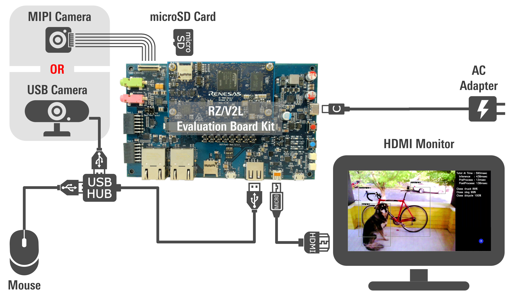
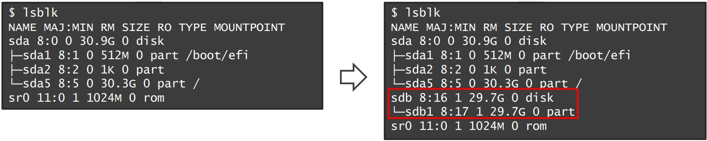

    

        

AI Applications Demo 
How to Use Guide
        

    

 
 

This guide supports <b>RZ/V2L AI SDK v2.00</b>

 

<h2 id="overview">Overview</h2>

This page explains how to setup the RZ/V2L Evaluation Board Kit (EVK) using the demo binary file. 
Unlike the procedure described in <a href="{{ site.url }}{{ site.baseurl }}" ><b>Getting Started</b></a>, this page does not build the AI Software Development Kit (AI SDK) environment, so you can easily try running the AI Applications.
 

In this guide, you will be able to learn followings.

<ul>
  <li>Prepare microSD card to set up operating environment</li>
  <li>Run AI Applications on the board</li>
</ul>

 
The goal of this guide is to run the application and display the captured data with AI inference results on an HDMI monitor as shown below.

To see a list of applications included in this demo, see <a href="{{ site.url }}{{ site.baseurl }}#apptable"><b>List of AI Applications Demo</b></a>.

For more information about the RZ/V series, click <a href="https://www.renesas.com/products/microcontrollers-microprocessors/rz-mpus/rzv-embedded-ai-mpus"><b>here</b></a>.

 

<h2 id="preparation">Preparation</h2>

This chapter describes the procedures up to the first startup of the RZ/V2L Evaluation Board Kit.

<h3 id="step1">Step 1: Hardware Preparation</h3>

Refer to the guide in the link below and prepare what you need.

<ol>
  <li>
  RZ/V2L Evaluation Board Kit 
  

    
Details are shown below

    <quotedoc id="reference1"></quotedoc>
  

  </li> 
  <li>
  Other necessary equipments 
  

    
Details are shown below

    <quotedoc id="reference2"></quotedoc>
  

   
  

    Note
    Unlike Demo v1.00, Windows PC is no longer required.
  

  </li>
</ol>
 

<h3 id="step2">Step 2: Demo file extraction to microSD card</h3>

<ol>
  <li>If you have not yet obtained the demo file, click on the link below to download it.
      
    <a class="btn btn-primary download-button" href="https://www.renesas.com/document/sws/rzv2l-ai-applications-demo-sd-image-version-200" role="button">Download Link</a>
      
    

      Note
      In this section, we use a Linux PC to prepare the microSD card. If you want to use a Windows PC, we have experience with the following Windows applications to write a disk image.
      <ul>
        <li><a href="https://sourceforge.net/projects/win32diskimager/"><b>Win32 Disk Imager download | SourceForge.net</b></a></li>
        <li><a href="https://www.raspberrypi.com/software/"><b>Raspberry Pi OS - Raspberry Pi</b></a></li>
      </ul>
    

  </li> 
  <li>Put the downloaded Zip file into a Linux PC and unzip it using the following command in a terminal.
    

unzip RTK0EF0166F02000SJ.zip

    Make sure the following folders and files are generated after unzipping the file.
    <table id="demodirs" class="mytable">
      <caption>Demo File Structure</caption>
      <tr>
        <th>Folder Name</th>
        <th>Folder Content</th>
        <th>Description</th>
      </tr>
      <tr>
        <td rowspan="3">licenses/</td>
        <td>linux_licenses.zip</td>
        <td>Linux license information.</td>
      </tr>
      <tr>
        <td>r11an0752ej0200-rzv2l-ai-sdk(Linux License List).pdf</td>
        <td>List of Linux license information included in Demo microSD image. Copyright information is not included. Please refer to Open Source Software packages(oss_pkg_rzv_v2.00.7z) to see copyright information.</td>
      </tr>
      <tr>
        <td>oss_pkg_rzv_v2.00.7z</td>
        <td>Source code of Open Source Software packages used when building the files in Demo microSD image.</td>
      </tr>
      <tr>
        <td>sd_image/</td>
        <td>ai_applications_demo_v2.00.dd.zip</td>
        <td>Zip file containing the Demo microSD image.</td>
      </tr>
      <tr>
        <td colspan="2">r11an0762ej0200-rzv2l.pdf</td>
        <td>ReadMe document describing the contents of the Demo zip file.</td>
    </tr>
    </table>
  </li> 
  <li>Run the following command to extract <code>ai_applications_demo_v2.00.dd.zip</code> in the <code>sd_image</code> folder.
      

cd sd_image
unzip ai_applications_demo_v2.00.dd.zip

  </li> 
  <li>Run the following command to check the device connected to the Linux PC <strong>before</strong> inserting the microSD card.
      

lsblk

    Then, insert the microSD card into the Linux PC and run the same command (<code>lsblk</code>) again. 
    Confirm that the microSD device name (<code>/dev/sdb</code>) has been added to the terminal after inserting the card, as shown in the console window below.
      
    
     
    

      Note
      The microSD card device name may vary depending on the PC environment. In this manual, we use <code>/dev/sdb</code> as the microSD card device name.
    

  </li> 
  <li>Using the device name found above (<code>/dev/sdb</code>), write the disk image file into the microSD card.
      

sudo dd if=ai_applications_demo_v2.00.dd of=/dev/sdb bs=1M status=progress

    

      Warning
      Change <code>/dev/sdb</code> to your microSD card device name. 
    

    

      Note
      Writing the microSD card image with the dd command takes time. 
      (Depending on your environment, it takes about 30 minutes.)
    

  </li> 
  <li>Execute the following command to eject the microSD card.

sudo eject /dev/sdb

    

      Warning
      Change <code>/dev/sdb</code> to your microSD card device name. 
    

  </li>
</ol>
 

This completes the board setup. Let's move on to the next chapter and run the applications.

 

<h2 id="runapp">Running Applications</h2>

This chapter describes how to run the AI Applications in the demo file.

<h3 id="linuxboot">Step 1: Boot process</h3>

<ol>
  <li>
    Once the <a href="{{ site.url }}{{ site.baseurl }}#preparation"><b>Preparation</b></a> chapter is complete, you can boot the board in the following way.
    

      
Boot procedures

      <quotedoc id="reference3"></quotedoc>
    

  </li>
</ol>
 

<h3 id="executedemo">Step 2: Demo execution</h3>

<ol>
  <li>The list of AI applications is shown below.
    Select the application you want to run from the list.
    <table id="apptable" class="mytable">
      <caption>List of AI Applications Demo</caption>
      <tr>
        <th>Category</th>
        <th>Application Name</th>
        <th>Execution Script</th>
        <th>Details</th>
        <th>Supported Camera Devices</th>
        <th>User Interface</th>
      </tr>
      <tr>
        <td rowspan="2">Agriculture</td>
        <td>Defense wild animals for crop</td>
        <td><code style="font-size:80%">Defense-wild-animals-for-crop.sh</code></td>
        <td><a href="https://github.com/Ignitarium-Renesas/RZV2L_AiLibrary/tree/main/07_Animal_detection"><b>GitHub Link</b></a></td>
        <td>MIPI / USB</td>
        <td>CUI</td>
      </tr>
      <tr>
        <td>Fruit and Vegetable Plant Disease Check</td>
        <td><code>Fruit-and-Vegetable-Plant-Disease-Check.sh</code></td>
        <td><a href="https://github.com/renesas-rz/rzv_ai_sdk/tree/main/Q07_plant_disease_classification"><b>GitHub Link</b></a></td>
        <td>MIPI</td>
        <td><a href="https://github.com/renesas-rz/rzv_ai_sdk/tree/main/Q07_plant_disease_classification#application-run-stage"><b>GUI</b></a></td>
      </tr>
      <tr>
        <td rowspan="7">Smart Building</td>
        <td>Elevator passengers Counting</td>
        <td><code>Elevator-passengers-Counting.sh</code></td>
        <td><a href="https://github.com/Ignitarium-Renesas/RZV2L_AiLibrary/tree/main/01_Head_count"><b>GitHub Link</b></a></td>
        <td>MIPI / USB</td>
        <td>CUI</td>
      </tr>
      <tr>
        <td>Conference Room Usage Monitor</td>
        <td><code>Conference-Room-Usage-Monitor.sh</code></td>
        <td><a href="https://github.com/Ignitarium-Renesas/RZV2L_AiLibrary/tree/main/11_Head_count_topview"><b>GitHub Link</b></a></td>
        <td>MIPI / USB</td>
        <td>CUI</td>
      </tr>
      <tr>
        <td>Lighting Control</td>
        <td><code>Lighting-Control.sh</code></td>
        <td><a href="https://github.com/Ignitarium-Renesas/RZV2L_AiLibrary/tree/main/11_Head_count_topview"><b>GitHub Link</b></a></td>
        <td>MIPI / USB</td>
        <td>CUI</td>
      </tr>
      <tr>
        <td>Security Area Intrusion Detection</td>
        <td><code>Security-Area-Intrusion-Detection.sh</code></td>
        <td><a href="https://github.com/Ignitarium-Renesas/RZV2L_AiLibrary/tree/main/02_Line_crossing_object_counting"><b>GitHub Link</b></a></td>
        <td>MIPI / USB</td>
        <td>CUI</td>
      </tr>
      <tr>
        <td>Wear management at construction sites</td>
        <td><code>Wear-management-at-construction-sites.sh</code></td>
        <td><a href="https://github.com/Ignitarium-Renesas/RZV2L_AiLibrary/tree/main/04_Safety_helmet_vest_detection"><b>GitHub Link</b></a></td>
        <td>MIPI / USB</td>
        <td>CUI</td>
      </tr>
      <tr>
        <td>Touchless Controller for elevator</td>
        <td><code>Touchless-Controller-for-elevator.sh</code></td>
        <td><a href="https://github.com/Ignitarium-Renesas/RZV2L_AiLibrary/tree/main/12_Hand_gesture_recognition_v2"><b>GitHub Link</b></a></td>
        <td>MIPI / USB</td>
        <td>CUI</td>
      </tr>
      <tr>
        <td>Employee ID check for Restricted Area</td>
        <td><code>Employee-ID-check-for-Restricted-Area.sh</code></td>
        <td><a href="https://github.com/renesas-rz/rzv_ai_sdk/tree/main/Q02_face_authentication"><b>GitHub Link</b></a></td>
        <td>USB</td>
        <td><a href="https://github.com/renesas-rz/rzv_ai_sdk/tree/main/Q02_face_authentication#gui-for-running-the-application"><b>GUI</b></a></td>
      </tr>
      <tr>
        <td rowspan="10">Smart City</td>
        <td>Congestion Detection in Railway Station</td>
        <td><code>Congestion-Detection-in-Railway-Station.sh</code></td>
        <td><a href="https://github.com/Ignitarium-Renesas/RZV2L_AiLibrary/tree/main/11_Head_count_topview"><b>GitHub Link</b></a></td>
        <td>MIPI / USB</td>
        <td>CUI</td>
      </tr>
      <tr>
        <td>Prohibited Area Management</td>
        <td><code>Prohibited-Area-Management.sh</code></td>
        <td><a href="https://github.com/Ignitarium-Renesas/RZV2L_AiLibrary/tree/main/02_Line_crossing_object_counting"><b>GitHub Link</b></a></td>
        <td>MIPI / USB</td>
        <td>CUI</td>
      </tr>
      <tr>
        <td>Distracted driving detection</td>
        <td><code>Distracted-driving-detection.sh</code></td>
        <td><a href="https://github.com/Ignitarium-Renesas/RZV2L_AiLibrary/tree/main/09_Human_gaze_detection"><b>GitHub Link</b></a></td>
        <td>MIPI / USB</td>
        <td>CUI</td>
      </tr>
      <tr>
        <td>Parking Spot Reservation</td>
        <td><code>Parking-Spot-Reservation.sh</code></td>
        <td><a href="https://github.com/renesas-rz/rzv_ai_sdk/tree/main/Q03_smart_parking"><b>GitHub Link</b></a></td>
        <td>USB</td>
        <td><a href="https://github.com/renesas-rz/rzv_ai_sdk/tree/main/Q03_smart_parking#gui-for-running-the-application"><b>GUI</b></a></td>
      </tr>
      <tr>
        <td>Passport check support</td>
        <td><code>Passport-check-support.sh</code></td>
        <td><a href="https://github.com/renesas-rz/rzv_ai_sdk/tree/main/Q02_face_authentication"><b>GitHub Link</b></a></td>
        <td>USB</td>
        <td><a href="https://github.com/renesas-rz/rzv_ai_sdk/tree/main/Q02_face_authentication#gui-for-running-the-application"><b>GUI</b></a></td>
      </tr>
      <tr>
        <td>Duration monitoring for surveillance camera</td>
        <td><code>Duration-monitoring-for-surveillance-camera.sh</code></td>
        <td><a href="https://github.com/renesas-rz/rzv_ai_sdk/tree/main/Q01_footfall_counter"><b>GitHub Link</b></a></td>
        <td>USB</td>
        <td>CUI</td>
      </tr>
      <tr>
        <td>Illegal Parking Check</td>
        <td><code>Illegal-Parking-Check.sh</code></td>
        <td><a href="https://github.com/renesas-rz/rzv_ai_sdk/tree/main/Q03_smart_parking"><b>GitHub Link</b></a></td>
        <td>USB</td>
        <td><a href="https://github.com/renesas-rz/rzv_ai_sdk/tree/main/Q03_smart_parking#gui-for-running-the-application"><b>GUI</b></a></td>
      </tr>
      <tr>
        <td>Bus passenger counting</td>
        <td><code>Bus-passenger-counting.sh</code></td>
        <td><a href="https://github.com/Ignitarium-Renesas/RZV2L_AiLibrary/tree/main/11_Head_count_topview"><b>GitHub Link</b></a></td>
        <td>MIPI / USB</td>
        <td>CUI</td>
      </tr>
      <tr>
        <td>Backtravel Detection</td>
        <td><code>Backtravel-Detection.sh</code></td>
        <td><a href="https://github.com/Ignitarium-Renesas/RZV2L_AiLibrary/tree/main/02_Line_crossing_object_counting"><b>GitHub Link</b></a></td>
        <td>MIPI / USB</td>
        <td>CUI</td>
      </tr>
      <tr>
        <td>Violence Activity Check in Surveillance Camera</td>
        <td><code>/Violence-Activity-Check-in-Surveillance-Camera.sh</code></td>
        <td><a href="https://github.com/renesas-rz/rzv_ai_sdk/tree/main/Q05_suspicious_activity"><b>GitHub Link</b></a></td>
        <td>MIPI</td>
        <td>CUI</td>
      </tr>
      <tr>
        <td>Healthcare</td>
        <td>Physical Condition Monitor</td>
        <td><code>Physical-Condition-Monitor.sh</code></td>
        <td><a href="https://github.com/Ignitarium-Renesas/RZV2L_AiLibrary/tree/main/03_Elderly_fall_detection"><b>GitHub Link</b></a></td>
        <td>MIPI / USB</td>
        <td>CUI</td>
      </tr>
      <tr>
        <td rowspan="5">Smart Home</td>
        <td>Air Conditioner Control</td>
        <td><code>Air-Conditioner-Control.sh</code></td>
        <td><a href="https://github.com/Ignitarium-Renesas/RZV2L_AiLibrary/tree/main/11_Head_count_topview"><b>GitHub Link</b></a></td>
        <td>MIPI / USB</td>
        <td>CUI</td>
      </tr>
      <tr>
        <td>Pet Detection in Kitchen and Child's Room</td>
        <td><code>Pet-Detection-in-Kitchen-and-Childs-Room.sh</code></td>
        <td><a href="https://github.com/Ignitarium-Renesas/RZV2L_AiLibrary/tree/main/07_Animal_detection"><b>GitHub Link</b></a></td>
        <td>MIPI / USB</td>
        <td>CUI</td>
      </tr>
      <tr>
        <td>Touchless Controller for Kitchen Appliance</td>
        <td><code>Touchless-Controller-for-Kitchen-Appliance.sh</code></td>
        <td><a href="https://github.com/Ignitarium-Renesas/RZV2L_AiLibrary/tree/main/12_Hand_gesture_recognition_v2"><b>GitHub Link</b></a></td>
        <td>MIPI / USB</td>
        <td>CUI</td>
      </tr>
      <tr>
        <td><del>Smart TV</del></td>
        <td><code>-</code></td>
        <td>Not included in Demo v2.00</td>
        <td>-</td>
        <td>-</td>
      </tr>
      <tr>
        <td>Food Package Expiry Date Check</td>
        <td><code>Food-Package-Expiry-Date-Check.sh</code></td>
        <td><a href="https://github.com/renesas-rz/rzv_ai_sdk/tree/main/Q06_expiry_date_detection"><b>GitHub Link</b></a></td>
        <td>MIPI / USB</td>
        <td>CUI</td>
      </tr>
      <tr>
        <td rowspan="6">Industrial</td>
        <td>Work Area Personnel Management</td>
        <td><code>Work-Area-Personnel-Management.sh</code></td>
        <td><a href="https://github.com/Ignitarium-Renesas/RZV2L_AiLibrary/tree/main/01_Head_count"><b>GitHub Link</b></a></td>
        <td>MIPI / USB</td>
        <td>CUI</td>
      </tr>
      <tr>
        <td>Helmet and safety vest wearing monitor</td>
        <td><code>Helmet-and-safety-vest-wearing-monitor.sh</code></td>
        <td><a href="https://github.com/Ignitarium-Renesas/RZV2L_AiLibrary/tree/main/04_Safety_helmet_vest_detection"><b>GitHub Link</b></a></td>
        <td>MIPI / USB</td>
        <td>CUI</td>
      </tr>
      <tr>
        <td>Touchless Controller for Industrial machine</td>
        <td><code>Touchless-controller-for-Industrial-machine.sh</code></td>
        <td><a href="https://github.com/Ignitarium-Renesas/RZV2L_AiLibrary/tree/main/12_Hand_gesture_recognition_v2"><b>GitHub Link</b></a></td>
        <td>MIPI / USB</td>
        <td>CUI</td>
      </tr>
      <tr>
        <td>Access Control</td>
        <td><code>Access-Control.sh</code></td>
        <td><a href="https://github.com/Ignitarium-Renesas/RZV2L_AiLibrary/tree/main/02_Line_crossing_object_counting"><b>GitHub Link</b></a></td>
        <td>MIPI / USB</td>
        <td>CUI</td>
      </tr>
      <tr>
        <td>Driver Monitoring System</td>
        <td><code>Driver-Monitoring-System.sh</code></td>
        <td><a href="https://github.com/Ignitarium-Renesas/RZV2L_AiLibrary/tree/main/10_Driver_monitoring_system"><b>GitHub Link</b></a></td>
        <td>MIPI / USB</td>
        <td>CUI</td>
      </tr>
      <tr>
        <td>Species check support in Fish Factory</td>
        <td><code>Species-check-support-in-Fish-Factory.sh</code></td>
        <td><a href="https://github.com/renesas-rz/rzv_ai_sdk/tree/main/Q04_fish_classification"><b>GitHub Link</b></a></td>
        <td>MIPI</td>
        <td>CUI</td>
      </tr>
      <tr>
        <td rowspan="5">Retail</td>
        <td>Congestion Detection</td>
        <td><code>Congestion-Detection.sh</code></td>
        <td><a href="https://github.com/Ignitarium-Renesas/RZV2L_AiLibrary/tree/main/11_Head_count_topview"><b>GitHub Link</b></a></td>
        <td>MIPI / USB</td>
        <td>CUI</td>
      </tr>
      <tr>
        <td>Staying and flow line monitoring</td>
        <td><code>Staying-and-flow-line-monitoring.sh</code></td>
        <td><a href="https://github.com/renesas-rz/rzv_ai_sdk/tree/main/Q01_footfall_counter"><b>GitHub Link</b></a></td>
        <td>USB</td>
        <td>CUI</td>
      </tr>
      <tr>
        <td>Smart POS</td>
        <td><code>Smart-POS.sh</code></td>
        <td><a href="https://github.com/Ignitarium-Renesas/RZV2L_AiLibrary/tree/main/05_Age_gender_detection"><b>GitHub Link</b></a></td>
        <td>MIPI / USB</td>
        <td>CUI</td>
      </tr>
      <tr>
        <td>Marketing Interest Analysis</td>
        <td><code>Marketing-Interest-Analysis.sh</code></td>
        <td><a href="https://github.com/Ignitarium-Renesas/RZV2L_AiLibrary/tree/main/09_Human_gaze_detection"><b>GitHub Link</b></a></td>
        <td>MIPI / USB</td>
        <td>CUI</td>
      </tr>
      <tr>
        <td>Exhibition Participants Monitoring</td>
        <td><code>Exhibition-Participants-Monitoring.sh</code></td>
        <td><a href="https://github.com/Ignitarium-Renesas/RZV2L_AiLibrary/tree/main/11_Head_count_topview"><b>GitHub Link</b></a></td>
        <td>MIPI / USB</td>
        <td>CUI</td>
      </tr>
    </table>
  </li> 
  <li>After following the boot procedure in the <a href="{{ site.url }}{{ site.baseurl }}#linuxboot"><b>previous section</b></a>, you should be able to enter commands into the terminal screen on the HDMI monitor. 
    Execute the following commands. Replace <code>&lt;category&gt;</code> and <code>&lt;application-name&gt;</code> with the selected application.

cd /home/root
./<category>/<application-name>.sh

    

      <u><b>Example:</b></u> 
      To run <b>"Elevator passengers Counting"</b> application, write following command.

./SmartBuilding/Elevator-passengers-Counting.sh

    

    

      Note
      Some applications support both MIPI/USB camera input. (Refer to <a href="{{ site.url }}{{ site.baseurl }}#apptable"><b>List of AI Applications Demo</b></a>). To use USB camera for those applications, run following command.

./<category>/<application-name>.sh USB

    

  </li> 
  <li>On monitor, the application will automatically start.
    

      Note
      Some applications require GUI control. See the link in the user interface column of <a href="{{ site.url }}{{ site.baseurl }}#apptable"><b>List of AI Applications Demo</b></a>.
    

  </li> 
  <li>To terminate the application, press <code>Super (Windows key)</code> + <code>Tab</code> keys to switch back to terminal window and press <code>Enter</code> key. 
    If the application does not terminate, press <code>Ctrl</code> +  <code>C</code> keys on the terminal window.
  </li>
</ol>
 

<h3 id="shutdown">Step 3: Shutdown process</h3>
<ol>
  <li>Follow these steps to power down the board.
    

      
Shutdown Procedures

      <quotedoc id="reference4"></quotedoc>
    

  </li>
</ol>
 

<h3 id="tips">Tips</h3>

Linux terminal has the auto-completion functionality.

<ul>
  <li>Users can type "<code>A</code>"&rArr;<code>[Tab]</code> to get the full file/directory name that starts with "<code>A</code>".

$ ./A

    &rArr; Press <code>[Tab]</code> and remaining characters are completed automatically if there is only one directory/file starts from "<code>A</code>".

$ ./Agriculture

  </li> 
  <li>Users can press <code>[Tab]</code> for 2 times to get the path suggestion.

$ cd /home/root
$ ./SmartBuilding/

    &rArr; Press <code>[Tab]</code> for 2 times and following suggestions will be shown.

$ ./SmartBuilding/
Conference-Room-Usage-Monitor.sh
Elevator-passengers-Counting.sh
Employee-ID-check-for-Restricted-Area.sh
...

  </li>
</ul>