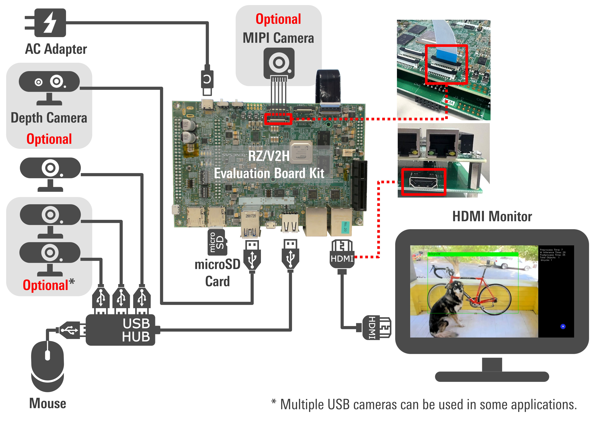
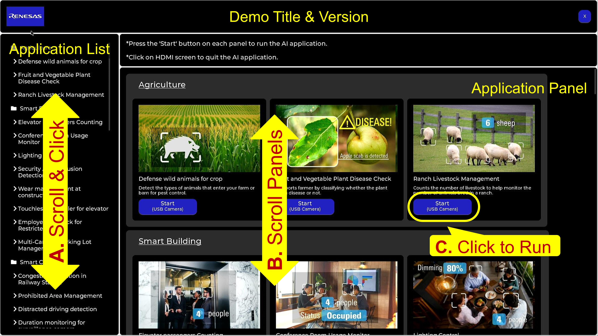
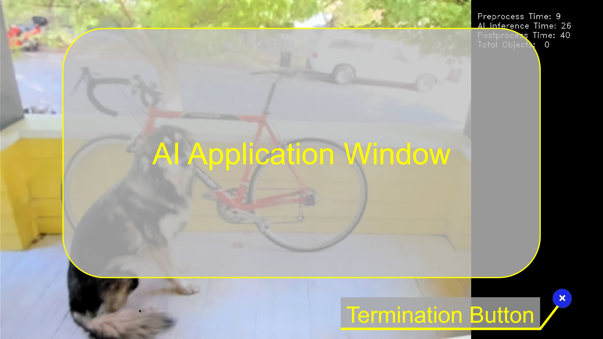

    

        

RZ/V2H AI Applications Demo 
How to Use Guide
        

    

 
 

<h5>This page explains how to use RZ/V2H AI Applications Demo on the <b>RZ/V2H Evaluation Board Kit.</b></h5>

<h5>Supported version: <b>RZ/V2H AI SDK v4.00</b></h5>

 

<h2 id="overview">Overview</h2>

This page explains how to setup the RZ/V2H Evaluation Board Kit (EVK) using the demo binary file. 
Unlike the procedure described in <a href="{{ site.url }}{{ site.baseurl }}" ><b>Getting Started</b></a>, this page does not build the AI Software Development Kit (AI SDK) environment, so you can easily try running the AI Applications.
 

In this guide, you will be able to learn followings.

<ul>
  <li>Prepare microSD card to set up operating environment</li>
  <li>Run AI Applications on the board</li>
</ul>

 
The goal of this guide is to run the application and display the captured data with AI inference results on an HDMI monitor as shown below.

To see a list of applications included in this demo, see <a href="{{ site.url }}{{ site.baseurl }}#apptable"><b>List of RZ/V2H AI Applications Demo</b></a>.

For more information about the RZ/V series, click <a href="https://www.renesas.com/products/microcontrollers-microprocessors/rz-mpus/rzv-embedded-ai-mpus"><b>here</b></a>.

 

<h2 id="preparation">Preparation</h2>

This chapter describes the procedures up to the first startup of the RZ/V2H Evaluation Board Kit.

<h3 id="step1">Step 1: Hardware Preparation</h3>

  

    

      To start using RZ/V2H AI Applications Demo, we need to get the board. 
      Renesas provides ideal board kit for RZ/V evaluation. 
       
      Click the button below to get the RZ/V2H board. 
       
      <a class="btn btn-secondary square-button ms-3 mt-1" style="text-align:left;" href="{{ site.url }}{{ site.baseurl }}" role="button">
        Board and Software 
        Get the board and software for RZ/V series.
      </a>
    

    

      
    

  

   

  Please prepare the following equipments for your EVK.
  <table>
    <tr>
      <th>Equipment</th>
      <th>Details</th>
    </tr>
    <tr>
      <td>
        RZ/V2H EVK
      </td>
      <td>
        Evaluation Board Kit for RZ/V2H.
      </td>
    </tr>
    <tr>
      <td>
        AC Adapter
      </td>
      <td>
        USB Power Delivery adapter for the board power supply. 
        100W is required.
      </td>
    </tr>
    <tr>
      <td>
        HDMI Cable
      </td>
      <td>
        Used to connect the HDMI Monitor and the board. 
        RZ/V2H EVK has HDMI port.
      </td>
    </tr>
    <tr>
      <td>
        USB Camera
      </td>
      <td>
        Since RZ/V2H EVK does not include camera module, this will be the standard camera input source. 
        Supported resolution: 640x480 
        Supported format: 'YUYV' (YUYV 4:2:2) 
      </td>
    </tr>
    <tr>
      <td>
        USB Cable Type-C
      </td>
      <td>
        Connect AC adapter and the board.
      </td>
    </tr>
    <tr>
      <td>
        HDMI Monitor
      </td>
      <td>
        Used to display the graphics of the board.
      </td>
    </tr>
    <tr>
      <td>
        microSD card
      </td>
      <td>
        Must have over 16GB capacity of blank space. 
        Operating Environment: Transcend UHS-I microSD 300S 16GB
      </td>
    </tr>
    <tr>
      <td>
        Linux PC
      </td>
      <td>
        Used for Setup microSD card. 
        Operating Environment: Ubuntu 20.04
      </td>
    </tr>
    <tr>
      <td>
        SD card reader
      </td>
      <td>
        Used for setting up microSD card.
      </td>
    </tr>
    <tr>
      <td>
        USB Hub
      </td>
      <td>
        Used to connect USB Camera and USB Mouse to the board.
      </td>
    </tr>
    <tr>
      <td>
        USB Mouse
      </td>
      <td>
        Used to operate the mouse on the screen of board.
      </td>
    </tr>
  </table>

 

<h3 id="step2">Step 2: Demo file extraction to microSD card</h3>

<ol>
  <li>If you have not yet obtained the demo file, click on the link below to download it.
      
    <a class="btn btn-primary download-button" href="https://www.renesas.com/document/sws/rzv2h-ai-applications-demo-sd-image-version-400" role="button">Download Link</a>
      
    

      Note
      In this section, we use a Linux PC to prepare the microSD card. If you want to use a Windows PC, we have experience in writing disk images by following steps.
      <ol>
        <li>
          Extract the <code>*.wic.gz</code> compressed file using software such as <a href="https://www.7-zip.org/"><b>7-Zip</b></a>.
        </li>
        <li>
          Write the extracted disk image file to the microSD card using the applications such as:
          <ul>
            <li><a href="https://sourceforge.net/projects/win32diskimager/"><b>Win32 Disk Imager download | SourceForge.net</b></a></li>
            <li><a href="https://www.raspberrypi.com/software/"><b>Raspberry Pi OS - Raspberry Pi</b></a></li>
          </ul>
        </li>
      </ol>
    

  </li> 
  <li>Put the downloaded Zip file into a Linux PC and unzip it using the following command in a terminal.
    

unzip RTK0EF0197F04000SJ.zip

    Make sure the following folders and files are generated after unzipping the file.
    <table id="demodirs" class="mytable">
      <caption>Demo File Structure</caption>
      <tr>
        <th>Folder Name</th>
        <th>Folder Content</th>
        <th>Description</th>
      </tr>
      <tr>
        <td rowspan="2">licenses/</td>
        <td>linux_licenses.zip</td>
        <td>Linux license information.</td>
      </tr>
      <tr>
        <td>r11an0841ej0400-rzv2h-ai-sdk(Linux License List).pdf</td>
        <td>List of Linux license information included in Demo microSD image. Copyright information is not included.</td>
      </tr>
      <tr>
        <td rowspan="2">sd_image/</td>
        <td>ai_applications_demo_v4.00.wic.gz</td>
        <td>Gzip file containing the Demo microSD image.</td>
      </tr>
      <tr>
        <td>ai_applications_demo_v4.00.wic.bmap</td>
        <td>Bmap file for copying the Demo microSD images.</td>
      </tr>
      <tr>
        <td colspan="2">r11an0884ej0400-rzv2h.pdf</td>
        <td>ReadMe document describing the contents of the Demo zip file.</td>
    </tr>
    </table>
  </li> 
  <li>To write the microSD card image, install <code>bmap-tools</code> on the Linux PC with the following command.
      

sudo apt install bmap-tools

  </li> 
  <li>Run the following command to check the device connected to the Linux PC <strong>before</strong> inserting the microSD card.
      

lsblk

    Then, insert the microSD card into the Linux PC and run the same command (<code>lsblk</code>) again. 
    Confirm that the microSD device name (<code>/dev/sdb</code>) has been added to the terminal after inserting the card, as shown in the console window below.
      
    
     
    

      Note
      The microSD card device name may vary depending on the PC environment. In this manual, we use <code>/dev/sdb</code> as the microSD card device name.
    

  </li> 
  <li>To use <code>bmap-tools</code>, microSD card partitions must be unmounted. Follow the steps below to unmount.
    <ol type="A">
      <li>Run the following command to check the automatically mounted microSD card partitions.
          

df -h

      </li> 
      <li>Check the output and find the mount point from the device name found above (<code>/dev/sdb</code>). 
       Here "<code>/media/user/9016-4EF8</code>" is the mount point.
          

Filesystem      Size  Used Avail Use% Mounted on
:
snip
:
/dev/sdb1        15G   32K   15G   1% /media/user/9016-4EF8

        

          Warning
            Here, we use <code>/dev/sdb</code> as microSD card device name. 
        

      </li>
      <li>Unmount the SD card partition if it is mounted.
          

sudo umount /media/user/9016-4EF8

        

          Note
          If there are more than one partitions on microSD card, unmount all partitions.
        

      </li>
    </ol>
  </li> 
  <li>Using the device name (<code>/dev/sdb</code>), write the disk image file into the microSD card.
      

cd sd_image
sudo bmaptool copy --bmap ai_applications_demo_v4.00.wic.bmap ai_applications_demo_v4.00.wic.gz /dev/sdb

    

      Warning
      Change <code>/dev/sdb</code> to your microSD card device name. 
    

    

      Note
      Writing the microSD card image takes several minutes. 
    

  </li> 
  <li>Execute the following command to eject the microSD card.
      

sudo eject /dev/sdb

    

      Warning
      Change <code>/dev/sdb</code> to your microSD card device name. 
    

  </li>
</ol>
 

This completes the board setup. Let's move on to the next chapter and run the applications.

 

<h2 id="runapp">Running Applications</h2>

This chapter describes how to run the AI Applications in the demo file.

<h3 id="linuxboot">Step 1: Boot process</h3>

Once the <a href="{{ site.url }}{{ site.baseurl }}#preparation"><b>Preparation</b></a> chapter is complete, you can boot the board in the following way.
  

  

    <ol>
      <li>
        Insert the microSD card to the <b>Board</b>.
        

          Note
          Use the microSD card slot <b>SD1</b> on the <b>Board</b> as shown in the figure.
        

      </li> 
      <li>Change DSW1 and DSW2 setting as shown in the figure.</li> 
      <li>Connect the USB mouse and USB camera via USB hub. 
        

          Note
          There are USB 2.0 port and USB 3.0 port on RZ/V2H EVK. 
          Please connect your USB camera to appropriate port according to its requirement. 
          Here, USB camera is connected to USB 2.0 via USB hub. 
        

      </li> 
      <li>Connect the HDMI monitor to the <b>Board</b>.</li> 
      <li>Connect the power cable to the <b>Board</b>.</li> 
      <li>Turn the SW3 to ON.</li> 
      <li>Turn the SW2 to ON to power on the <b>Board</b></li>
    </ol>
  

  

    
  

<ol>
  <li id="gui_home" value="8">
    The GUI home screen shown below appears on the monitor.
    

      

        The home screen consists of the following sections.
        <ul>
          <li>
            <b>Top</b>: 
            Title and Version of this Demo system.
          </li>
          <li>
            <b>Left</b>: 
            List of names and categories of AI Applications included in the Demo.
          </li>
          <li>
            <b>Right</b>: 
            Panels with application descriptions and run buttons.
          </li>
        </ul>
      

      

         
        <big><b>GUI Home Screen</b></big> 
        
      

    

  </li>
</ol>
 

<h3 id="executedemo">Step 2: Demo execution</h3>

<ol>
  <li>The list of AI applications included in the Demo is shown below.
    Select the application you want to run from the list.
    <table id="apptable" class="mytable">
      <caption>List of RZ/V2H AI Applications Demo</caption>
      <tr>
        <th>Category</th>
        <th>Application Name</th>
        <th>Details</th>
        <th>Supported Camera Devices</th>
      </tr>
      <tr>
        <td rowspan="2">Agriculture</td>
        <td>Defense wild animals for crop</td>
        <td><a href="https://github.com/Ignitarium-Renesas/rzv_ai_apps/tree/main/07_Animal_detection"><b>GitHub Link</b></a></td>
        <td>USB</td>
      </tr>
      <tr>
        <td>Ranch Livestock Management</td>
        <td><a href="https://github.com/renesas-rz/rzv_ai_sdk/tree/main/Q08_object_counter"><b>GitHub Link</b></a></td>
        <td>USB</td>
      </tr>
      <tr>
        <td rowspan="5">Smart Building</td>
        <td>Elevator passengers Counting</td>
        <td><a href="https://github.com/Ignitarium-Renesas/rzv_ai_apps/tree/main/01_Head_count"><b>GitHub Link</b></a></td>
        <td>USB</td>
      </tr>
      <tr>
        <td>Conference Room Usage Monitor</td>
        <td><a href="https://github.com/Ignitarium-Renesas/rzv_ai_apps/tree/main/11_Head_count_topview"><b>GitHub Link</b></a></td>
        <td>USB</td>
      </tr>
      <tr>
        <td>Lighting Control</td>
        <td><a href="https://github.com/Ignitarium-Renesas/rzv_ai_apps/tree/main/11_Head_count_topview"><b>GitHub Link</b></a></td>
        <td>USB</td>
      </tr>
      <tr>
        <td>Security Area Intrusion Detection</td>
        <td><a href="https://github.com/Ignitarium-Renesas/rzv_ai_apps/tree/main/02_Line_crossing_object_counting"><b>GitHub Link</b></a></td>
        <td>USB</td>
      </tr>
      <tr>
        <td>Touchless Controller for elevator</td>
        <td><a href="https://github.com/Ignitarium-Renesas/rzv_ai_apps/tree/main/12_Hand_gesture_recognition_v2"><b>GitHub Link</b></a></td>
        <td>USB</td>
      </tr>
      <tr>
        <td rowspan="14">Smart City</td>
        <td>Congestion Detection in Railway Station</td>
        <td><a href="https://github.com/Ignitarium-Renesas/rzv_ai_apps/tree/main/11_Head_count_topview"><b>GitHub Link</b></a></td>
        <td>USB</td>
      </tr>
      <tr>
        <td>Prohibited Area Management</td>
        <td><a href="https://github.com/Ignitarium-Renesas/rzv_ai_apps/tree/main/02_Line_crossing_object_counting"><b>GitHub Link</b></a></td>
        <td>USB</td>
      </tr>
      <tr>
        <td>Distracted driving detection</td>
        <td><a href="https://github.com/Ignitarium-Renesas/rzv_ai_apps/tree/main/09_Human_gaze_detection"><b>GitHub Link</b></a></td>
        <td>USB</td>
      </tr>
      <tr>
        <td>Duration monitoring for surveillance camera</td>
        <td><a href="https://github.com/renesas-rz/rzv_ai_sdk/tree/main/Q01_footfall_counter"><b>GitHub Link</b></a></td>
        <td>USB</td>
      </tr>
      <tr>
        <td>Bus passenger counting</td>
        <td><a href="https://github.com/Ignitarium-Renesas/rzv_ai_apps/tree/main/11_Head_count_topview"><b>GitHub Link</b></a></td>
        <td>USB</td>
      </tr>
      <tr>
        <td>Backtravel Detection</td>
        <td><a href="https://github.com/Ignitarium-Renesas/rzv_ai_apps/tree/main/02_Line_crossing_object_counting"><b>GitHub Link</b></a></td>
        <td>USB</td>
      </tr>
      <tr>
        <td>Bird Damage Prevention</td>
        <td><a href="https://github.com/renesas-rz/rzv_ai_sdk/tree/main/Q08_object_counter"><b>GitHub Link</b></a></td>
        <td>USB</td>
      </tr>
      <tr>
        <td>Blind Spot Monitor</td>
        <td><a href="https://github.com/renesas-rz/rzv_ai_sdk/tree/main/Q08_object_counter"><b>GitHub Link</b></a></td>
        <td>USB</td>
      </tr>
      <tr>
        <td>Emergency Vehicles Detector</td>
        <td><a href="https://github.com/renesas-rz/rzv_ai_sdk/tree/main/Q08_object_counter"><b>GitHub Link</b></a></td>
        <td>USB</td>
      </tr>
      <tr>
        <td>Illegal Bicycle Approach Detection</td>
        <td><a href="https://github.com/renesas-rz/rzv_ai_sdk/tree/main/Q08_object_counter"><b>GitHub Link</b></a></td>
        <td>USB</td>
      </tr>
      <tr>
        <td>Bicycle Rental Stock Management</td>
        <td><a href="https://github.com/renesas-rz/rzv_ai_sdk/tree/main/Q08_object_counter"><b>GitHub Link</b></a></td>
        <td>USB</td>
      </tr>
      <tr>
        <td>Illegal Bicycle Parking Monitor Support</td>
        <td><a href="https://github.com/renesas-rz/rzv_ai_sdk/tree/main/Q08_object_counter"><b>GitHub Link</b></a></td>
        <td>USB</td>
      </tr>
      <tr>
        <td>Infrastructure Defect Prevention</td>
        <td><a href="https://github.com/renesas-rz/rzv_ai_sdk/tree/main/Q09_crack_segmentation"><b>GitHub Link</b></a></td>
        <td>USB</td>
      </tr>
      <tr>
        <td>Crime Prevention Support for School</td>
        <td><a href="https://github.com/renesas-rz/rzv_ai_sdk/tree/main/Q10_suspicious_person_detection"><b>GitHub Link</b></a></td>
        <td>USB</td>
      </tr>
      <tr>
        <td rowspan="4">Smart Home</td>
        <td>Air Conditioner Control</td>
        <td><a href="https://github.com/Ignitarium-Renesas/rzv_ai_apps/tree/main/11_Head_count_topview"><b>GitHub Link</b></a></td>
        <td>USB</td>
      </tr>
      <tr>
        <td>Pet Detection in Kitchen and Child's Room</td>
        <td><a href="https://github.com/Ignitarium-Renesas/rzv_ai_apps/tree/main/07_Animal_detection"><b>GitHub Link</b></a></td>
        <td>USB</td>
      </tr>
      <tr>
        <td>Touchless Controller for Kitchen Appliance</td>
        <td><a href="https://github.com/Ignitarium-Renesas/rzv_ai_apps/tree/main/12_Hand_gesture_recognition_v2"><b>GitHub Link</b></a></td>
        <td>USB</td>
      </tr>
      <tr>
        <td>Food Package Expiry Date Check</td>
        <td><a href="https://github.com/renesas-rz/rzv_ai_sdk/tree/main/Q06_expiry_date_detection"><b>GitHub Link</b></a></td>
        <td>USB</td>
      </tr>
      <tr>
        <td rowspan="6">Industrial</td>
        <td>Work Area Personnel Management</td>
        <td><a href="https://github.com/Ignitarium-Renesas/rzv_ai_apps/tree/main/01_Head_count"><b>GitHub Link</b></a></td>
        <td>USB</td>
      </tr>
      <tr>
        <td>Touchless Controller for Industrial machine</td>
        <td><a href="https://github.com/Ignitarium-Renesas/rzv_ai_apps/tree/main/12_Hand_gesture_recognition_v2"><b>GitHub Link</b></a></td>
        <td>USB</td>
      </tr>
      <tr>
        <td>Access Control</td>
        <td><a href="https://github.com/Ignitarium-Renesas/rzv_ai_apps/tree/main/02_Line_crossing_object_counting"><b>GitHub Link</b></a></td>
        <td>USB</td>
      </tr>
      <tr>
        <td>Driver Monitoring System</td>
        <td><a href="https://github.com/Ignitarium-Renesas/rzv_ai_apps/tree/main/10_Driver_monitoring_system"><b>GitHub Link</b></a></td>
        <td>USB</td>
      </tr>
      <tr>
        <td>Defect Inspection Support</td>
        <td><a href="https://github.com/renesas-rz/rzv_ai_sdk/tree/main/Q09_crack_segmentation"><b>GitHub Link</b></a></td>
        <td>USB</td>
      </tr>
      <tr>
        <td>Aquaculture Industrial Support</td>
        <td><a href="https://github.com/renesas-rz/rzv_ai_sdk/tree/main/Q11_fish_detection"><b>GitHub Link</b></a></td>
        <td>USB</td>
      </tr>
      <tr>
        <td rowspan="5">Retail</td>
        <td>Congestion Detection</td>
        <td><a href="https://github.com/Ignitarium-Renesas/rzv_ai_apps/tree/main/11_Head_count_topview"><b>GitHub Link</b></a></td>
        <td>USB</td>
      </tr>
      <tr>
        <td>Staying and flow line monitoring</td>
        <td><a href="https://github.com/renesas-rz/rzv_ai_sdk/tree/main/Q01_footfall_counter"><b>GitHub Link</b></a></td>
        <td>USB</td>
      </tr>
      <tr>
        <td>Marketing Interest Analysis</td>
        <td><a href="https://github.com/Ignitarium-Renesas/rzv_ai_apps/tree/main/09_Human_gaze_detection"><b>GitHub Link</b></a></td>
        <td>USB</td>
      </tr>
      <tr>
        <td>Exhibition Participants Monitoring</td>
        <td><a href="https://github.com/Ignitarium-Renesas/rzv_ai_apps/tree/main/11_Head_count_topview"><b>GitHub Link</b></a></td>
        <td>USB</td>
      </tr>
      <tr>
        <td>Store Crime Prevention</td>
        <td><a href="https://github.com/renesas-rz/rzv_ai_sdk/tree/main/Q10_suspicious_person_detection"><b>GitHub Link</b></a></td>
        <td>USB</td>
      </tr>
    </table>
  </li>
  <li>
    After following the boot procedure in the <a href="{{ site.url }}{{ site.baseurl }}#linuxboot"><b>previous section</b></a>, you can start the application using the GUI. 
    

      

        <ol type="A">
          <li>
            Scroll the application list on the left of the screen and click the application name.
          </li> 
          <li>
            The application panel page on the right automatically shows the application that you clicked. 
            You can also scroll the panel page manually.
            

              Note
              If you are using a USB mouse, please drag to scroll the pages as the mouse wheel is not available.
            

          </li> 
          <li>
            Press the "Start" button in the panel to run the application.
          </li>
        </ol>
      

      

        
      

    

  </li> 
  <li>
    On monitor, the application will automatically start.
    

      

        The application window is displayed on the screen and the termination button appears in the bottom right-hand corner.
        

          Note1
          When an application window is displayed on the screen, the termination button may temporarily disappear. However, it will soon appear again, so please wait a few seconds until the screen display gets stable.
        

        

          Note2
          If the running application encounters any errors (e.g. if the camera is not connected), the application will automatically exit and return to the <a href="{{ site.url }}{{ site.baseurl }}#gui_home"><b>home screen</b></a>.
        

      

      

        
      

    

  </li> 
  <li>
    To terminate the application, press the blue Termination Button in the bottom right-hand corner.
  </li>
</ol>
 

<h3 id="shutdown">Step 3: Shutdown process</h3>

To power-off the RZ/V2H EVK, follow the procedures below. 
<ol>
  <li>
    On the <a href="{{ site.url }}{{ site.baseurl }}#gui_home"><b>home screen</b></a>, click the X button at the top right-hand corner.  
    
      
  </li>
  <li>On board console, check that shutdown procedure runs and ends with following log.  

[xxxxx.xxxxxx] reboot: Power down

  </li>
  <li>
    Turn SW2 to OFF.
      
  </li>
  <li>
    Turn SW3 to OFF.
      
     
  </li>
</ol>
 
