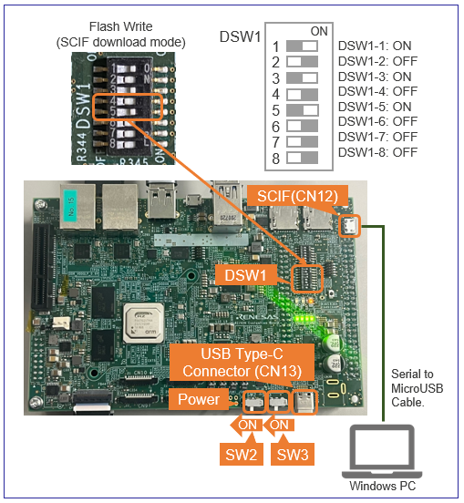

<!-- Title -->

    

        

Developer's Guide
        

    

 
 
<!-- Brief Explanation -->
<h5>This page explains the additional information of <a href="{{ site.url }}{{ site.baseurl }}">How to Build RZ/V2H AI SDK</a> for Linux developers.</h5>

  
Terminology

  <quotedoc id="reference_terminology"></quotedoc>

 

<!-- Contents -->

    

        

            <h3 id="dev-contents">
                Contents
            </h3>
            <table>
              <tr>
                <th>ID</th>
                <th>Title</th>
                <th>Device</th>
                <th>Target</th>
              </tr>
              <tr>
                <td>D1</td>
                <td><a href="#D1">Change the Graphics Library to the Unrestricted Version</a></td>
                <td>RZ/V2H</td>
                <td>AI SDK Source Code v5.00</td>
              </tr>
              <tr>
                <td>D2</td>
                <td><a href="#D2">Change the size of the microSD card image in WIC format</a></td>
                <td>RZ/V2H</td>
                <td>AI SDK Source Code v5.00</td>
              </tr>
              <tr>
                <td>D3</td>
                <td><a href="#D3">How to boot from xSPI</a></td>
                <td>RZ/V2H</td>
                <td>AI SDK Source Code v5.00</td>
              </tr>
            </table>
        

         
<!-- D1. Change the Graphics Library to the Unrestricted Version -->
        

          <h3 id="D1">D1. For RZ/V2H: Change the Graphics Library to the Unrestricted Version</h3>
        This section explains how to prepare Graphics Library for unrestricted version, instead of evaluation version. 
          

            Note
            Following instruction assumes that you have completed <a href="{{ site.url }}{{ site.baseurl }}#step3-6">Step 3-6 in How to build RZ/V2H AI SDK Source Code</a>.
          

          <ol>
            <li>Download zip files from the link below.
               
              

                Note
                It may take much time to obtain Graphics Library for unrestricted version due to necessary examinations on your business purpose. 
              

               
              <a class="btn btn-primary download-button" href="https://www.renesas.com/secure/rzv2-graphics-library-secure-content" role="button">Download Link</a>
            </li>
             
            <li>After you downloaded the zip files, please move the zip files to "<b><code>${WORK}/src_setup</code></b>" on your Linux PC.
             
            </li>
             
            <li>Check that zip files are moved to appropriate location.

cd ${WORK}/src_setup
ls -1 

              <ul>
                <li>If the above command prints followings, the package is extracted correctly.

README.txt
RTK0EF0*ZJ-v*_rzv_*.zip
rzv2h_ai-sdk_yocto_recipe_v*.tar.gz
yocto

                </li>
              </ul>
            </li>
            <li>Run the below command to delete evaluation version. 

rm -rf ${YOCTO_WORK}/meta-rz-features/meta-rz-graphics

            </li>
            <li>Run the below command to extract the unristricted version. 

unzip RTK0EF0045Z14001ZJ*.zip
tar zxvf RTK0EF0045Z14001ZJ*/meta-rz-features_graphics_*.tar.gz -C ${YOCTO_WORK}

            </li>
          </ol>
        After this procedure, please proceed to <a href="{{ site.url }}{{ site.baseurl }}#step3-7"> Step 3-7 in How to build RZ/V2H AI SDK Source Code</a> to start building Linux kernel files.
         
         
        

<!-- D2. Change the size of the microSD card image in WIC format -->
        

          <h3 id="D2">D2. For RZ/V2H: Change the size of the microSD card image in WIC format</h3>
          This section explains how to change the microSD card image size by changing the build settings of the WIC file. 
          

            Note
            Following instruction assumes that you have completed <a href="{{ site.url }}{{ site.baseurl }}#step3-10">Step 3-10 in How to build RZ/V2H AI SDK Source Code</a>.
          

          <ol>
            <li>Open <b><code>${YOCTO_WORK}/build/conf/local.conf</code></b> file in a text editor.
            </li>
            <li>Find the following text in the file and edit the highlighted value to define the disk space of the image in Kbytes.
<pre><code>...
# Support WIC images with default wks from WKS_DEFAULT_FILE
# Reupdate WKS_DEFAULT_FILE if want to support another wks file.
WKS_SUPPORT ?= "1"
WKS_DEFAULT_FILE_rzv2h-dev = "rz-image-bootpart-mmc.wks"
WKS_DEFAULT_FILE_rzv2h-evk-alpha = "rz-image-bootpart-esd_rzv2h.wks"
WKS_DEFAULT_FILE_rzv2h-evk-ver1 = "rz-image-bootpart-esd_rzv2h.wks"
# Defines additional free disk space created in the image in Kbytes.
IMAGE_ROOTFS_EXTRA_SPACE = "<mark style="background: #ffff00">8388608</mark>"
...
</code></pre>
              The table below shows examples of setting values written in <b><code>local.conf</code></b> file. 
              

                Note
                If you have customized Linux, the disk image size may differ from the table.
              

              <table class="mytable">
                <tr>
                  <th>SD card image size (Gbytes)</th>
                  <th>Setting values in the "local.conf" file (Kbytes)</th>
                </tr>
                <tr>
                  <td>4</td>
                  <td>1048576</td>
                </tr>
                <tr>
                  <td>8</td>
                  <td>4194304</td>
                </tr>
                <tr>
                  <td>16</td>
                  <td>8388608 (default)</td>
                </tr>
              </table>
            </li>
          </ol>
        After this procedure, please proceed to <a href="{{ site.url }}{{ site.baseurl }}#step3-11"> Step 3-11 in How to build RZ/V2H AI SDK Source Code</a> to build the Linux kernel files.
         
         
        

<!-- D3. How to boot from xSPI -->
        

          <h3 id="D3">D3. For RZ/V2H: How to boot from xSPI</h3>
          This section explains how to boot from xSPI on RZ/V2H EVK.
           
          

            Note
            Following instruction assumes that you have completed <a href="{{ site.url }}{{ site.baseurl }}#step3">Step 3 in How to build RZ/V2H AI SDK Source Code</a> and <a href="{{ site.url }}{{ site.baseurl }}#step7">Step 7-1:Setup RZ/V2H EVK in RZ/V2H EVK Getting Started</a>. 
          

          

            Note
            To perform this procedure, please prepare the following equipment in addition to the <a href="{{ site.url }}{{ site.baseurl }}#step2">1.Necessary Equipments</a>.
            <ul class="mb-1">
              <li>Windows PC</li>
              <li>MicroUSB to Serial Cable for serial communication (Included in RZ/V2H EVK)</li>
            </ul>
          

           
          Follow the instruction below to setup the board. 
           
          <ul style="list-style:none;">
<!-- D3-1. Install Terminal Emulator -->
            <li>
              <h5 id="D3-1">1. Install Terminal Emulator</h5>
              

                Note
                If you have already installed terminal emulator, skip this step and proceed to <a href="{{ site.url }}{{ site.baseurl }}#D3-2">next procedure</a>.
              

              <ol>
                <li>
                  Install following software <b>on Windows PC</b> to be used as serial communication console.
                  <ul>
                    <li>
                      Terminal emulator
                      <ul>
                        <li>
                          Operating Environment: Tera Term
                        </li>
                      </ul>
                    </li>
                  </ul>
                </li>
              </ol>
               
            </li>
<!-- D3-2. Install the serial port driver -->
          <li>
            <h5 id="D3-2">2. Install the serial port driver</h5>
            

              Note
              If you have already installed the serial port driver, skip this step and proceed to <a href="{{ site.url }}{{ site.baseurl }}#D3-3">next procedure</a>.
            

            The serial communication between Windows PC and RZ/V2H EVK requires following driver. 
            <a href="https://ftdichip.com/drivers/vcp-drivers/">https://ftdichip.com/drivers/vcp-drivers/</a>
              
            <ol>
              <li>
                Download the software "Virtual COM port (VCP) driver" from the windows version "setup executable" on the download page and extract it.
              </li> 
              <li>
                Run the <code>*.exe</code> file extracted to install the serial port driver.
              </li> 
            </ol>
             
          </li>
<!-- D3-3. Write bootloaders on the board -->
          <li>
            <h5 id="D3-3">3. Write bootloaders on the board</h5>
            <ol>
              <li>Copy following files in <code>${WORK}/build/tmp/deploy/images/rzv2h-evk-ver1</code> to your Windows PC.
                <ul>
                  <li><code>Flash_Writer_SCIF_RZV2H_DEV_INTERNAL_MEMORY.mot</code></li>
                  <li><code>bl2_bp_spi-rzv2h-evk-ver1.srec</code></li>
                  <li><code>fip-rzv2h-evk-ver1.srec</code></li>
                </ul>
              </li> 
              <li>Connect Windows PC and Board via Serial to MicroUSB Cable.
              </li> 
              <li id="D3-SCIF">Change DSW1 setting to Boot mode 3 (SCIF download). See the figure below.
                  
                
              </li> 
              <li>Connect the power cable to CN13 on the Board.
              </li> 
              <li> Turn the SW3 to ON.
              </li> 
              <li>On Windows PC, open the terminal emulator.
                Here, we use Tera Term as an example.
              </li> 
              <li>Select "File" > "New Connection" and select "Serial" port as shown below.
                  
                
              </li> 
              <li>Open the configuration window from the "Setup">"Terminal" and change the setting as follows.
                  
                <table>
                  <tr>
                    <th>Item</th>
                    <th>Value</th>
                  </tr>
                  <tr>
                    <td>New-line</td>
                    <td>Receive: Auto</td>
                  </tr>
                  <tr>
                    <td></td>
                    <td>Transmit: CR</td>
                  </tr>
                </table>
              </li> 
              <li>Open the configuration window from the "Setup">"Serial port" and change the setting as follows.
                  
                <table>
                  <tr>
                    <th>Item</th>
                    <th>Value</th>
                  </tr>
                  <tr>
                    <td>Baud rate</td>
                    <td>115200</td>
                  </tr>
                  <tr>
                    <td>Data</td>
                    <td>8bit</td>
                  </tr>
                  <tr>
                    <td>Parity</td>
                    <td>none</td>
                  </tr>
                  <tr>
                    <td>Stop</td>
                    <td>1bit</td>
                  </tr>
                  <tr>
                    <td>Flow control</td>
                    <td>none</td>
                  </tr>
                  <tr>
                    <td>Transmit delay</td>
                    <td>0msec/char</td>
                  </tr>
                </table>
              </li> 
              <li>Turn the SW2 to ON to power on the Board and following message will be displayed on the terminal.

SCI Download mode (Normal SCI boot)
-- Load Program to SRAM ---------------

              </li> 
              <li>
                Open "File" > "Send file..." and send the Flash Writer file (<code>*.mot</code>) as a text. 
                If following message is displayed, the file transfer succeeded.

Flash writer for RZ/V2x Series Vx.xx xxx.xx,20xx
 Product Code : RZ/V2x
>

              </li> 
              <li>Enter "<code>XLS2</code>" on the terminal to get following messages.

> XLS2
===== Qspi writing of RZ/V2x Board Command =============
Load Program to Spiflash
Writes to any of SPI address.
Program size & Qspi Save Address
===== Please Input Program Top Address ============
  Please Input : H'

              </li> 
              <li>Enter "<code>8101e00</code>". The log continues.

  Please Input : H'8101e00
===== Please Input Qspi Save Address ===
  Please Input : H'

              </li> 
              <li>Enter "<code>00000</code>". The log continues.

  Please Input : H'00000
please send ! ('.' & CR stop load)

              </li> 
              <li>After the "please send!" message, open "File" > "Send file..." and <b>send the <code>bl2_bp_spi-rzv2h-evk-ver1.srec</code> file</b> as a text from the terminal software.
              </li> 
              <li>In case a message to prompt to clear data like below, please enter "<code>y</code>".

SPI Data Clear(H'FF) Check : H'00000000-0000FFFF,Clear OK?(y/n)

              </li> 
              <li>Following log will be displayed.

Write to SPI Flash memory.
======= Qspi Save Information =================
SpiFlashMemory Stat Address : H'00000000
SpiFlashMemory End Address  : H'00036D17
===========================================================

              </li> 
              <li>Enter "<code>XLS2</code>" on the terminal to get following messages.

> XLS2
===== Qspi writing of RZ/V2x Board Command =============
Load Program to Spiflash
Writes to any of SPI address.
Program size & Qspi Save Address
===== Please Input Program Top Address ============
  Please Input : H'

              </li> 
              <li>Enter "<code>00000</code>". The log continues.

  Please Input : H'00000
===== Please Input Qspi Save Address ===
  Please Input : H'

              </li> 
              <li>Enter "<code>60000</code>". The log continues.

  Please Input : H'60000
please send ! ('.' & CR stop load)

              </li> 
              <li>After the "please send!" message, open "File" > "Send file..." and <b>send the <code>fip-rzv2h-evk-ver1.srec</code> file</b> as a text from the terminal software.
              </li> 
              <li>In case a message to prompt to clear data like below, please enter "<code>y</code>".

SPI Data Clear(H'FF) Check : H'00000000-0000FFFF,Clear OK?(y/n)

              </li> 
              <li>Following log will be displayed.

Write to SPI Flash memory.
======= Qspi Save Information =================
SpiFlashMemory Stat Address : H'00060000
SpiFlashMemory End Address  : H'0011C2EE
===========================================================

              </li> 
              <li>Power-off the board to change DSW1 for booting the board.
               
              </li>
            </ol>
              
          </li>
<!-- D3-4. Setup U-boot setting -->
          <li>
            <h5 id="D3-4">4. Setup U-boot setting</h5>
            Follow the procedure below to set the booting configuration of the board.  
            

              

                

                  <ol>
                    <li>Insert the microSD card to the <b>Board</b>.
                      

                        Note
                        Use the microSD card slot <b>SD1</b> as shown in the figure.
                      

                    </li> 
                    <li id="D3-xSPI">Change DSW1 setting to Boot mode 2 (xSPI boot) as shown in the right figure.
                    </li> 
                    <li>Connect the <b>Board</b> and <b>Windows PC</b> by the USB Serial to Micro USB cable.
                    </li> 
                    <li>Connect the power cable to the <b>Board</b>.
                    </li> 
                    <li>Turn the SW3 to ON.
                    </li> 
                    <li>Open the terminal emulator, i.e., Tera Term, and connect with COMS port.
                      

                        Note
                        When using Tera Term, change the configuration as explained in <a href="#D3-3">Write bootloaders on the board</a>.
                      

                    </li> 
                    <li>Turn the SW2 to ON to power on the Board.
                    </li> 
                    <li>On the terminal emulator, keep pressing ENTER key.
                    </li> 
                  </ol>
                

                

                  
                   
                

              

              

                

                  <ol start="9">
                    <li>U-boot console will be activated.
                    </li> 
                    <li>Run the following commands to set the booting configuration.

env default -a
saveenv
boot

                    </li> 
                    <li>After the boot-up, the login message will be shown on the console.

rzv2h-evk1 login:

                    </li> 
                    <li>Log-in to the system using the information below.
                      <ul>
                        <li>user: <code>root</code>
                        </li>
                        <li>password: none
                        </li>
                      </ul>
                    </li> 
                    <li>Shutdown the board to finish the U-boot setting.
                      

                        
Shutdown Procedures

                        <quotedoc id="a4reference"></quotedoc>
                      

                    </li> 
                  </ol>
                

              

            

          </li>
        </ul>
         
        This is the end of How to boot from xSPI on RZ/V2H EVK. 
    

        

<!-- Footer -->
    

        

            <a class="btn btn-secondary square-button" href="{{ site.url }}{{ site.baseurl }}" role="button">
                Back to Home >
            </a>
        

    

