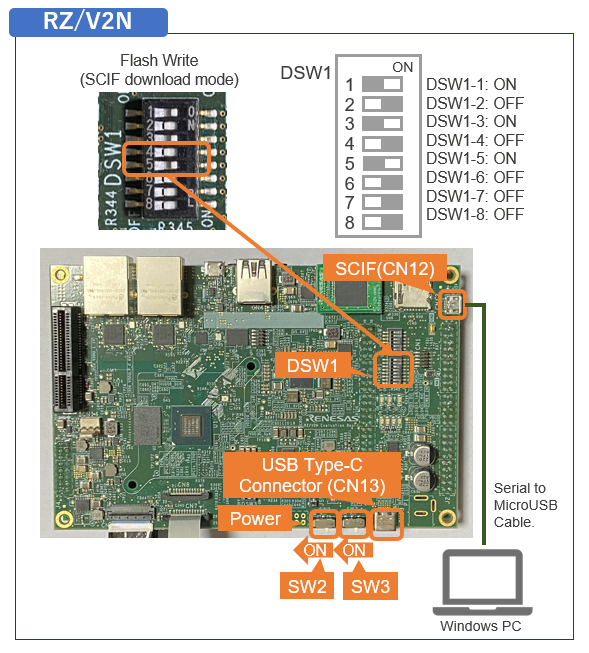

<!-- 
 -->
<!-- Title -->

    

        

Developer's Guide
        

    

 
 
<!-- Brief Explanation -->
<h5>This page explains the additional information of How to Build RZ/V AI SDK for Linux developers.</h5>

  
Terminology

  <quotedoc id="reference_terminology"></quotedoc>

 

<!-- Contents -->

    

        

            <h3 id="dev-contents">
                Contents
            </h3>
            <table>
              <tr>
                <th>ID</th>
                <th>Title</th>
                <th>Device</th>
                <th>Target</th>
              </tr>
              <tr>
                <td>D1</td>
                <td><a href="#D1">Change the size of the microSD card image in WIC format</a></td>
                <td>
                  RZ/V2H 
                  RZ/V2N
                </td>
                <td>
                  <!-- V2H -->AI SDK Source Code v5.20 
                  <!-- V2N -->AI SDK Source Code v6.00
                </td>
              </tr>
              <tr>
                <td>D2</td>
                <td><a href="#D2">How to boot from QSPI</a></td>
                <td>RZ/V2L</td>
                <td>AI SDK Source Code v5.00</td>
              </tr>
              <tr>
                <td>D3</td>
                <td><a href="#D3">How to boot from xSPI</a></td>
                <td>
                  RZ/V2H 
                  RZ/V2N
                </td>
                <td>
                  <!-- V2H -->AI SDK Source Code v5.20 
                  <!-- V2N -->AI SDK Source Code v6.00
                </td>
              </tr>
              <tr>
                <td>D4</td>
                <td><a href="#D4">How to boot from eMMC</a></td>
                <td>RZ/V2N</td>
                <td>AI SDK Source Code v6.00</td>
              </tr>
<!--              <tr>
                <td>D5</td>
                <td><a href="#D5">How to modify the memory map</a></td>
                <td>
                  RZ/V2H 
                  RZ/V2N
                </td>
                <td>
                  <!-- V2H AI SDK Source Code v5.20 
                  <!-- V2N AI SDK Source Code v6.00
                </td>
              </tr>
              <tr>
                <td>D6</td>
                <td><a href="#D6">How to change the DDR size</a></td>
                <td>
                  RZ/V2H 
                  RZ/V2N
                </td>
                <td>
                  <!-- V2H AI SDK Source Code v5.20 
                  <!-- V2N AI SDK Source Code v6.00
                </td>
              </tr> -->
            </table>
        

         
<!-- D1. Change the size of the microSD card image in WIC format -->
        

          <!-- Don’t change ID "D1" to prevent reference errors -->
          <h3 id="D1">D1. For RZ/V2H, RZ/V2N: Change the size of the microSD card image in WIC format</h3>
          This section explains how to change the microSD card image size by changing the build settings of the WIC file. 
          

            Note
            This instruction assumes that you have completed the steps in <b>How to build RZ/V AI SDK Source Code</b> below. 
            <li><b>RZ/V2H</b>: <a href="{{ site.url }}{{ site.baseurl }}#step3-10" target="_blank" rel="noopener noreferrer">Step 3-10</a></li>
            <li><b>RZ/V2N</b>: <a href="{{ site.url }}{{ site.baseurl }}#step3-9" target="_blank" rel="noopener noreferrer">Step 3-9</a></li>
          

          <ol>
            <li>Open <b><code>${YOCTO_WORK}/build/conf/local.conf</code></b> file in a text editor.
            </li>
            <li>Find the following text in the file and edit the highlighted value to define the disk space of the image in Kbytes.
<pre><code>...
# Support WIC images with default wks from WKS_DEFAULT_FILE
# Reupdate WKS_DEFAULT_FILE if want to support another wks file.
WKS_SUPPORT ?= "1"
WKS_DEFAULT_FILE_rzv2h-dev = "rz-image-bootpart-mmc.wks"
WKS_DEFAULT_FILE_rzv2h-evk-alpha = "rz-image-bootpart-esd_rzv2h.wks"
WKS_DEFAULT_FILE_rzv2h-evk-ver1 = "rz-image-bootpart-esd_rzv2h.wks"
# Defines additional free disk space created in the image in Kbytes.
IMAGE_ROOTFS_EXTRA_SPACE = "<mark style="background: #ffff00">8388608</mark>"
...
</code></pre>
              The table below shows examples of setting values written in <b><code>local.conf</code></b> file. 
              

                Note
                If you have customized Linux, the disk image size may differ from the table.
              

              <table class="mytable">
                <tr>
                  <th>Device</th>
                  <th>SD card image size (Gbytes)</th>
                  <th>Setting values in the "local.conf" file (Kbytes)</th>
                </tr>
                <!-- for RZ/V2H -->
                <tr>
                  <td rowspan="3">RZ/V2H</td>
                  <td>4</td>
                  <td>1048576</td>
                </tr>
                <tr>
                  <td>8</td>
                  <td>4194304</td>
                </tr>
                <tr>
                  <td>16</td>
                  <td>8388608 (default)</td>
                </tr>
                <!-- for RZ/V2N -->
                <tr>
                  <td rowspan="3">RZ/V2N</td>
                  <td>8</td>
                  <td>1048576</td>
                </tr>
                <tr>
                  <td>16</td>
                  <td>6291456 (default)</td>
                </tr>
                <tr>
                  <td>32</td>
                  <td>16777216</td>
                </tr>
              </table>
            </li>
          </ol>
        After this procedure, please proceed to <b>the step in How to build RZ/V AI SDK Source Code</b> below to build the Linux kernel files.
         
        <li><b>RZ/V2H</b>: <a href="{{ site.url }}{{ site.baseurl }}#step3-11">Step 3-11</a></li>
        <li><b>RZ/V2N</b>: <a href="{{ site.url }}{{ site.baseurl }}#step3-10">Step 3-10</a></li>
         
        

<!-- D2. For RZ/V2L: How to boot from QSPI -->
        

          <h3 id="D2">D2. For RZ/V2L: How to boot from QSPI</h3>
          This section explains how to setup the board for QSPI Bootloader.
           
          

            Note
            This step is required only when starting the AI SDK or when using the new version of AI SDK. 
            If you have already setup the microSD card and the bootloader written in QSPI on the board, skip this step and proceed to <a href="{{ site.url }}{{ site.baseurl }}#step7-2">the next step (Step7:2. Deploy Application to the Board in Getting Started)</a>.
          

          Follow the instruction below to setup the board.
          

            Note
            Explanation in this step is for QSPI Bootloader, which requires Windows PC as serial communication console. 
          

<!-- D2-1. Install Terminal Emulator -->
          <ul style="list-style:none;">
            <li>
              <h5 id="D2-1">1. Install Terminal Emulator</h5>
              

                Note
                If you have already installed terminal emulator, skip this step and proceed to <a href="{{ site.url }}{{ site.baseurl }}#D2-2">next procedure</a>.
              

              <d2-1reference>
              <ol>
                <li>
                  Install following software <b>on Windows PC</b> to be used as serial communication console.
                  <ul>
                    <li>
                      Terminal emulator
                      <ul>
                        <li>
                          Operating Environment: Tera Term
                        </li>
                      </ul>
                    </li>
                  </ul>
                </li>
              </ol>
              </d2-1reference>
               
            </li>
<!-- D2-2. Install the serial port driver -->
            <li>
              <h5 id="D2-2">2. Install the serial port driver</h5>
              

                Note
                If you have already installed the serial port driver, skip this step and proceed to <a href="{{ site.url }}{{ site.baseurl }}#D2-3">next procedure</a>.
              

              <d2-2reference>
              The serial communication between Windows PC and RZ/V2L EVK requires following driver. 
              <a href="https://ftdichip.com/drivers/vcp-drivers/">https://ftdichip.com/drivers/vcp-drivers/</a>
                
              <ol>
                <li>
                  Download the software "Virtual COM port (VCP) driver" from the windows version "setup executable" on the download page and extract it.
                </li> 
                <li>
                  Run the <code>*.exe</code> file extracted to install the serial port driver.
                </li> 
              </ol>
              </d2-2reference>
               
            </li>
<!-- D2-3. Write bootloaders to QSPI on the board -->
            <li>
              <h5 id="D2-3">3. Write bootloaders to QSPI on the board</h5>
              <ol>
                <li>Copy following files to your Windows PC.
                    
                  <table class="mytable">
                    <tr>
                      <th>Path</th>
                      <th>File name</th>
                      <th>Description</th>
                    </tr>
                    <tr>
                      <td>${WORK}/board_setup/QSPI/bootloader</td>
                      <td rowspan="2">
                        Flash_Writer_SCIF_RZV2L_SMARC_PMIC_DDR4_2GB_1PCS.mot 
                        bl2_bp-smarc-rzv2l_pmic.srec 
                        fip-smarc-rzv2l_pmic.srec
                      </td>
                      <td>
                        Directory path and files when using files included with RZ/V2L AI SDK
                      </td>
                    </tr>
                    <tr>
                      <td>${YOCTO_WORK}/build/tmp/deploy/images/smarc-rzv2l</td>
                      <td>
                        Directory path and files when using files generated with How to build RZ/V2L AI SDK Source Code
                      </td>
                    </tr>
                  </table>
                </li> 
                <li>Connect Windows PC and Board via Serial to MicroUSB Cable.
                </li> 
                <li>Change SW1 and SW11 setting (see the figure below).
                    
                  
                </li> 
                <li>Connect the power cable to CN6 on the Board.
                </li> 
                <li> Press and hold the power button (SW9) for 1 second to turn on the power.
                </li> 
                <li>On Windows PC, open the terminal emulator.
                  Here, we use Tera Term as an example.
                </li> 
                <li>Select "File" > "New Connection" and select "Serial" port as shown below.
                    
                  
                </li> 
                <li>Open the configuration window from the "Setup">"Terminal" and change the setting as follows.
                    
                  <table>
                    <tr>
                      <th>Item</th>
                      <th>Value</th>
                    </tr>
                    <tr>
                      <td>New-line</td>
                      <td>Receive: Auto</td>
                    </tr>
                    <tr>
                      <td></td>
                      <td>Transmit: CR</td>
                    </tr>
                  </table>
                </li> 
                <li>Open the configuration window from the "Setup">"Serial port" and change the setting as follows.
                    
                  <table>
                    <tr>
                      <th>Item</th>
                      <th>Value</th>
                    </tr>
                    <tr>
                      <td>Baud rate</td>
                      <td>115200</td>
                    </tr>
                    <tr>
                      <td>Data</td>
                      <td>8bit</td>
                    </tr>
                    <tr>
                      <td>Parity</td>
                      <td>none</td>
                    </tr>
                    <tr>
                      <td>Stop</td>
                      <td>1bit</td>
                    </tr>
                    <tr>
                      <td>Flow control</td>
                      <td>none</td>
                    </tr>
                    <tr>
                      <td>Transmit delay</td>
                      <td>0msec/char</td>
                    </tr>
                  </table>
                </li> 
                <li>Press the reset button (SW10) and following message will be displayed on the terminal.

  SCIF Download mode
(C) Renesas Electronics Corp.
-- Load Program to System RAM ---------------
please send !

                </li> 
                <li>
                  Open "File" > "Send file..." and send the Flash Writer file (<code>*.mot</code>) as a text. 
                  If following message is displayed, the file transfer suceeded.

Flash writer for RZ/V2 Series Vx.xx xxx.xx,20xx
Product Code : RZ/V2L
>

                </li> 
                <li>Enter "<code>XLS2</code>" on the terminal to get following messages.

> XLS2
===== Qspi writing of RZ/G2 Board Command =============
Load Program to Spiflash
Writes to any of SPI address.
Micron : MT25QU512
Program Top Address & Qspi Save Address
===== Please Input Program Top Address ============
  Please Input : H'

                </li> 
                <li>Enter "<code>11E00</code>". The log continues.

  Please Input : H'11E00
===== Please Input Qspi Save Address ===
  Please Input : H'

                </li> 
                <li>Enter "<code>00000</code>". The log continues.

  Please Input : H'00000
Work RAM(H'50000000-H'53FFFFFF) Clear....
please send ! ('.' & CR stop load)

                </li> 
                <li>After the "please send!" message, open "File" > "Send file..." and <b>send the <code>bl2_bp-smarc-rzv2l_pmic.srec</code> file</b> as a text from the terminal software.
                </li> 
                <li>In case a message to prompt to clear data like below, please enter "<code>y</code>".

SPI Data Clear(H'FF) Check : H'00000000-0000FFFF,Clear OK?(y/n)

                </li> 
                <li>Following log will be displayed. The end address is depending on the version of AI SDK.

SAVE SPI-FLASH.......
======= Qspi Save Information =================
SpiFlashMemory Stat Address : H'00000000
SpiFlashMemory End Address : H'00009A80
===========================================================

                </li> 
                <li>Enter "<code>XLS2</code>" on the terminal to get following messages.

> XLS2
===== Qspi writing of RZ/G2 Board Command =============
Load Program to Spiflash
Writes to any of SPI address.
Micron : MT25QU512
Program Top Address & Qspi Save Address
===== Please Input Program Top Address ============
  Please Input : H'

                </li> 
                <li>Enter "<code>00000</code>". The log continues.

  Please Input : H'00000
===== Please Input Qspi Save Address ===
  Please Input : H'

                </li> 
                <li>Enter "<code>1D200</code>". The log continues.

  Please Input : H'1D200
Work RAM(H'50000000-H'53FFFFFF) Clear....
please send ! ('.' & CR stop load)

                </li> 
                <li>After the "please send!" message, open "File" > "Send file..." and <b>send the <code>fip-smarc-rzv2l_pmic.srec</code> file</b> as a text from the terminal software.
                </li> 
                <li>In case a message to prompt to clear data like below, please enter "<code>y</code>".

SPI Data Clear(H'FF) Check : H'00000000-0000FFFF,Clear OK?(y/n)

                </li> 
                <li>Following log will be displayed. The end address is depending on the version of AI SDK.

SAVE SPI-FLASH.......
======= Qspi Save Information =================
SpiFlashMemory Stat Address : H'0001D200
SpiFlashMemory End Address : H'000CC73F
===========================================================

                </li> 
                <li>Power-off the board by pressing the power button (SW9) for 2 seconds to change SW11 for booting the board.
                 
                </li>
              </ol>
                
            </li>
<!-- D2-4. Setup U-boot setting -->
            <li>
              <h5 id="D2-4">4. Setup U-boot setting</h5>
              Follow the procedure below to set the booting configuration of the board.  
              

                

                  

                    <ol>
                      <li>Insert the microSD card to the <b>Board</b>.
                        

                          Note
                          Use the microSD card slot <b>CN10</b> as shown in the figure.
                        

                      </li> 
                      <li>Change SW1 and SW11 setting as shown in the right figure.
                      </li> 
                      <li>Connect the <b>Board</b> and <b>Windows PC</b> by the USB Serial to Micro USB cable.
                      </li> 
                      <li>Connect the power cable to the <b>Board</b>.
                      </li> 
                      <li>Press power button for 1 second to turn on the board.
                      </li> 
                      <li>Open the terminal emulator, i.e., Tera Term, and connect with COMS port.
                        

                          Note
                          When using Tera Term, change the configuration as explained in <a href="#D2-3" target="_blank" rel="noopener noreferrer">Write bootloaders to QSPI on the board</a>.
                        

                      </li> 
                      <li>On the terminal emulator, keep pressing ENTER key and on the board, press reset button.
                      </li> 
                    </ol>
                  

                  

                    
                     
                  

                

                

                  

                    <ol start="8">
                      <li>U-boot console will be activated.
                      </li> 
                      <li>Run the following commands to set the booting configuration.

env default -a
saveenv
boot

                      </li> 
                      <li>After the boot-up, the login message will be shown on the console.

smarc-rzv2l login:

                      </li> 
                      <li>Log-in to the system using the information below.
                        <ul>
                          <li>user: <code>root</code>
                          </li>
                          <li>password: none
                          </li>
                        </ul>
                      </li> 
                      <li>Shutdown the board to finish the U-boot setting.
                        

                          
Shutdown Procedures

                          <quotedoc id="a3reference"></quotedoc>
                        

                      </li> 
                    </ol>
                  

                

              

            </li>
          </ul>
           
          After this procedure, you can copy the AI Application and boot the board. 
          Refer to the <a href="{{ site.url }}{{ site.baseurl }}#step7-2">Step 7: 2. Deploy Application to the Board in RZ/V2L EVK Getting Started</a>.
            
        

<!-- D3. How to boot from xSPI -->
        

          <!-- Don’t change ID "D3" to prevent reference errors -->
          <h3 id="D3">D3. For RZ/V2H, RZ/V2N: How to boot from xSPI</h3>
          This section explains how to boot from xSPI on RZ/V EVK.
           
          

            Note
            This instruction assumes that you have completed the steps in <b>How to build RZ/V AI SDK Source Code</b> and <b>RZ/V EVK Getting Started</b>. 
            However, if you would like to use the files for xSPI boot included in RZ/V AI SDK,  
            skip Step 3 of How to build RZ/V AI SDK Source code and use the files in <b><code>${WORK}/board_setup/xSPI</code></b> directory. 
            <table class="gstable ms-4">
              <tr>
                <th>Device</th>
                <th>How to build RZ/V AI SDK Source Code</th>
                <th>RZ/V EVK Getting Started</th>
              </tr>
              <tr>
                <td>RZ/V2H</td>
                <td><a href="{{ site.url }}{{ site.baseurl }}#step3" target="_blank" rel="noopener noreferrer">Step 3</a></td>
                <td><a href="{{ site.url }}{{ site.baseurl }}#step7" target="_blank" rel="noopener noreferrer">Step 7-1</a></td>
              </tr>
              <tr>
                <td>RZ/V2N</td>
                <td><a href="{{ site.url }}{{ site.baseurl }}#step3" target="_blank" rel="noopener noreferrer">Step 3</a></td>
                <td><a href="{{ site.url }}{{ site.baseurl }}#step7" target="_blank" rel="noopener noreferrer">Step 7-1</a></td>
              </tr>
            </table>
          

          

            Note
            To perform this procedure, please prepare the following equipment in addition to the <a href="{{ site.url }}{{ site.baseurl }}#step2" target="_blank" rel="noopener noreferrer">1.Necessary Equipments</a>.
            <ul class="mb-1">
              <li>Windows PC</li>
              <li>MicroUSB to Serial Cable for serial communication (Included in RZ/V EVK)</li>
            </ul>
          

           
          Follow the instruction below to setup the board. 
           
          <ul style="list-style:none;">
<!-- D3-1. Install Terminal Emulator -->
            <li>
              <!-- Don’t change ID "D3-1" to prevent reference errors -->
              <h5 id="D3-1">1. Install Terminal Emulator</h5>
              

                Note
                If you have already installed terminal emulator, skip this step and proceed to <a href="{{ site.url }}{{ site.baseurl }}#D3-2">next procedure</a>.
              

              <ol>
                <li>
                  Install following software <b>on Windows PC</b> to be used as serial communication console.
                  <ul>
                    <li>
                      Terminal emulator
                      <ul>
                        <li>
                          Operating Environment: Tera Term
                        </li>
                      </ul>
                    </li>
                  </ul>
                </li>
              </ol>
              <!-- 

                
Install Procedures

                <quotedoc id="d2-1reference"></quotedoc>
              
 -->
               
            </li>
<!-- D3-2. Install the serial port driver -->
          <li>
            <!-- Don’t change ID "D3-2" to prevent reference errors -->
            <h5 id="D3-2">2. Install the serial port driver</h5>
            

              Note
              If you have already installed the serial port driver, skip this step and proceed to <a href="{{ site.url }}{{ site.baseurl }}#D3-3">next procedure</a>.
            

              The serial communication between Windows PC and RZ/V EVK requires following driver. 
            <a href="https://ftdichip.com/drivers/vcp-drivers/" target="_blank" rel="noopener noreferrer">https://ftdichip.com/drivers/vcp-drivers/</a>
              
            <ol>
              <li>
                Download the software "Virtual COM port (VCP) driver" from the windows version "setup executable" on the download page and extract it.
              </li> 
              <li>
                Run the <code>*.exe</code> file extracted to install the serial port driver.
              </li> 
            </ol>
              <!-- 

                
Install Procedures

                <quotedoc id="d2-2reference"></quotedoc>
              
 -->
             
          </li>
<!-- D3-3. Write bootloaders on the board -->
          <li>
            <!-- Don’t change ID "D3-3" to prevent reference errors -->
            <h5 id="D3-3">3. Write bootloaders on the board</h5>
            <ol>
              <li>Copy following files to your Windows PC.
                  
                <table class="mytable">
                  <tr>
                    <th>Device</th>
                    <th>Path</th>
                    <th>File name</th>
                    <th>Description</th>
                  </tr>
                  <tr>
                    <td rowspan="2">RZ/V2H</td>
                    <td>${YOCTO_WORK}/build/tmp/deploy/images/rzv2h-evk-ver1</td>
                    <td rowspan="2">
                      Flash_Writer_SCIF_RZV2H_DEV_INTERNAL_MEMORY.mot 
                      bl2_bp_spi-rzv2h-evk-ver1.srec 
                      fip-rzv2h-evk-ver1.srec
                    </td>
                    <td>
                      Directory path and files when using files generated with How to build RZ/V AI SDK Source Code
                    </td>
                  </tr>
                  <tr>
                    <td>${WORK}/board_setup/xSPI/bootloader</td>
                    <td>
                      Directory path and files when using files included with RZ/V AI SDK
                    </td>
                  </tr>
                  <tr>
                    <td rowspan="2">RZ/V2N</td>
                    <td>${YOCTO_WORK}/build/tmp/deploy/images/rzv2n-evk</td>
                    <td rowspan="2">
                      Flash_Writer_SCIF_RZV2N_DEV_LPDDR4X.mot 
                      bl2_bp_spi-rzv2n-evk.srec 
                      fip-rzv2n-evk.srec
                    </td>
                    <td>
                      Directory path and files when using files generated with How to build RZ/V AI SDK Source Code
                    </td>
                  </tr>
                  <tr>
                    <td>${WORK}/board_setup/xSPI/bootloader</td>
                    <td>
                      Directory path and files when using files included with RZ/V AI SDK
                    </td>
                  </tr>
                </table>
              </li> 
              <li>Connect Windows PC and Board via Serial to MicroUSB Cable.
              </li> 
              <li id="D3-SCIF">Change DSW1 setting to Boot mode 3 (SCIF download). See the figure below.
                  
                  
              </li> 
              <li>Connect the power cable to CN13 on the Board.
              </li> 
              <li> Turn the SW3 to ON.
              </li> 
              <li>On Windows PC, open the terminal emulator.
                Here, we use Tera Term as an example.
              </li> 
              <li>Select "File" > "New Connection" and select "Serial" port as shown below.
                  
                
              </li> 
              <li>Open the configuration window from the "Setup">"Terminal" and change the setting as follows.
                  
                <table>
                  <tr>
                    <th>Item</th>
                    <th>Value</th>
                  </tr>
                  <tr>
                    <td>New-line</td>
                    <td>Receive: Auto</td>
                  </tr>
                  <tr>
                    <td></td>
                    <td>Transmit: CR</td>
                  </tr>
                </table>
              </li> 
              <li>Open the configuration window from the "Setup">"Serial port" and change the setting as follows.
                  
                <table>
                  <tr>
                    <th>Item</th>
                    <th>Value</th>
                  </tr>
                  <tr>
                    <td>Baud rate</td>
                    <td>115200</td>
                  </tr>
                  <tr>
                    <td>Data</td>
                    <td>8bit</td>
                  </tr>
                  <tr>
                    <td>Parity</td>
                    <td>none</td>
                  </tr>
                  <tr>
                    <td>Stop</td>
                    <td>1bit</td>
                  </tr>
                  <tr>
                    <td>Flow control</td>
                    <td>none</td>
                  </tr>
                  <tr>
                    <td>Transmit delay</td>
                    <td>0msec/char</td>
                  </tr>
                </table>
              </li> 
              <li>Turn the SW2 to ON to power on the Board and following message will be displayed on the terminal.

SCI Download mode (Normal SCI boot)
-- Load Program to SRAM ---------------

              </li> 
              <li>
                Open "File" > "Send file..." and send the Flash Writer file (<code>*.mot</code>) as a text. 
                If following message is displayed, the file transfer succeeded.

Flash writer for RZ/V2x Series Vx.xx xxx.xx,20xx
 Product Code : RZ/V2x
>

              </li> 
              <li>Enter "<code>XLS2</code>" on the terminal to get following messages.

> XLS2
===== Qspi writing of RZ/V2x Board Command =============
Load Program to Spiflash
Writes to any of SPI address.
Program size & Qspi Save Address
===== Please Input Program Top Address ============
  Please Input : H'

              </li> 
              <li>Enter "<code>8101e00</code>". The log continues.

  Please Input : H'8101e00
===== Please Input Qspi Save Address ===
  Please Input : H'

              </li> 
              <li>Enter "<code>00000</code>". The log continues.

  Please Input : H'00000
please send ! ('.' & CR stop load)

              </li> 
                <li>After the "please send!" message, open "File" > "Send file..." and <b>send the <code>bl2_bp_spi-rzv2*.srec</code> file</b> as a text from the terminal software.
              </li> 
              <li>In case a message to prompt to clear data like below, please enter "<code>y</code>".

SPI Data Clear(H'FF) Check : H'00000000-0000FFFF,Clear OK?(y/n)

              </li> 
              <li>Following log will be displayed. The end address is depending on the version of AI SDK.

Write to SPI Flash memory.
======= Qspi Save Information =================
SpiFlashMemory Stat Address : H'00000000
SpiFlashMemory End Address  : H'00036D17
===========================================================

              </li> 
              <li>Enter "<code>XLS2</code>" on the terminal to get following messages.

> XLS2
===== Qspi writing of RZ/V2x Board Command =============
Load Program to Spiflash
Writes to any of SPI address.
Program size & Qspi Save Address
===== Please Input Program Top Address ============
  Please Input : H'

              </li> 
              <li>Enter "<code>00000</code>". The log continues.

  Please Input : H'00000
===== Please Input Qspi Save Address ===
  Please Input : H'

              </li> 
              <li>Enter "<code>60000</code>". The log continues.

  Please Input : H'60000
please send ! ('.' & CR stop load)

              </li> 
                <li>After the "please send!" message, open "File" > "Send file..." and <b>send the <code>fip-rzv2*.srec</code> file</b> as a text from the terminal software.
              </li> 
              <li>In case a message to prompt to clear data like below, please enter "<code>y</code>".

SPI Data Clear(H'FF) Check : H'00000000-0000FFFF,Clear OK?(y/n)

              </li> 
              <li>Following log will be displayed. The end address is depending on the version of AI SDK.

Write to SPI Flash memory.
======= Qspi Save Information =================
SpiFlashMemory Stat Address : H'00060000
SpiFlashMemory End Address  : H'0011C2EE
===========================================================

              </li> 
              <li>Power-off the board to change DSW1 for booting the board.
              </li>
            </ol>
              
          </li>
<!-- D3-4. Setup U-boot setting -->
          <li>
            <!-- Don’t change ID "D3-4" to prevent reference errors -->
            <h5 id="D3-4">4. Setup U-boot setting</h5>
            Follow the procedure below to set the booting configuration of the board.  
            

              

                

                  <ol>
                    <li>Insert the microSD card to the <b>Board</b>.
                      

                        Note
                          Use the microSD card slot <b>SD2</b> as shown in the figure.
                      

                    </li> 
                    <li id="D3-xSPI">Change DSW1 setting to Boot mode 2 (xSPI boot) as shown in the right figure.
                    </li> 
                    <li>Connect the <b>Board</b> and <b>Windows PC</b> by the USB Serial to Micro USB cable.
                    </li> 
                    <li>Connect the power cable to the <b>Board</b>.
                    </li> 
                    <li>Turn the SW3 to ON.
                    </li> 
                    <li>Open the terminal emulator, i.e., Tera Term, and connect with COMS port.
                      

                        Note
                        When using Tera Term, change the configuration as explained in <a href="#D3-3" target="_blank" rel="noopener noreferrer">Write bootloaders on the board</a>.
                      

                    </li> 
                    <li>Turn the SW2 to ON to power on the Board.
                    </li> 
                    <li>On the terminal emulator, keep pressing ENTER key.
                    </li> 
                  </ol>
                

                

                    
                     
                    
                   
                

              

              

                

                  <ol start="9">
                    <li>U-boot console will be activated.
                    </li> 
                    <li>Run the following commands to set the booting configuration.

env default -a
saveenv
boot

                    </li> 
                    <li>After the boot-up, the login message will be shown on the console.

rzv2h-evk1 login:

                    </li> 
                    <li>Log-in to the system using the information below.
                      <ul>
                        <li>user: <code>root</code>
                        </li>
                        <li>password: none
                        </li>
                      </ul>
                    </li> 
                    <li>Shutdown the board to finish the U-boot setting.
                      

                        Note
                        To shutdown the board safely, please refer to following steps.
                        <ul class="mb-1">
                          <li>RZ/V2H: <a href="{{ site.url }}{{ site.baseurl }}#A4" target="_blank" rel="noopener noreferrer">A3. Shutdown RZ/V2H EVK</a></li>
                          <li>RZ/V2N: <a href="{{ site.url }}{{ site.baseurl }}#A5" target="_blank" rel="noopener noreferrer">A4. Shutdown RZ/V2N EVK</a></li>
                        </ul>
                      

<!--                      

                        
Shutdown Procedures

                        <quotedoc id="a4reference"></quotedoc>
                      
 -->
                    </li> 
                  </ol>
                

              

            

          </li>
        </ul>
         
          This is the end of How to boot from xSPI on RZ/V2H EVK and RZ/V2N EVK. 
    

<!-- D4. How to boot from eMMC -->
        

          <!-- Don’t change ID "D4" to prevent reference errors -->
          <h3 id="D4">D4. For RZ/V2N: How to boot from eMMC</h3>
          This section explains how to boot from eMMC on RZ/V2N EVK.
           
          

            Note
            This instruction assumes that you have completed the steps in <b>How to build RZ/V AI SDK Source Code</b> and <b>RZ/V EVK Getting Started</b> below. 
            <table class="gstable ms-4">
              <tr>
                <th>Device</th>
                <th>How to build RZ/V AI SDK Source Code</th>
                <th>RZ/V EVK Getting Started</th>
              </tr>
              <!-- <tr>
                <td>RZ/V2H</td>
                <td><a href="{{ site.url }}{{ site.baseurl }}#step3" target="_blank" rel="noopener noreferrer">Step 3</a></td>
                <td><a href="{{ site.url }}{{ site.baseurl }}#step7" target="_blank" rel="noopener noreferrer">Step 7-1</a></td>
              </tr> -->
              <tr>
                <td>RZ/V2N</td>
                <td><a href="{{ site.url }}{{ site.baseurl }}#step3" target="_blank" rel="noopener noreferrer">Step 3</a></td>
                <td><a href="{{ site.url }}{{ site.baseurl }}#step7" target="_blank" rel="noopener noreferrer">Step 7-1</a></td>
              </tr>
            </table>
        

          

            Note
            To perform this procedure, please prepare the following equipment in addition to the <a href="{{ site.url }}{{ site.baseurl }}#step2" target="_blank" rel="noopener noreferrer">1.Necessary Equipments</a>.
            <ul class="mb-1">
              <li>Windows PC</li>
              <li>MicroUSB to Serial Cable for serial communication (Included in RZ/V2N EVK)</li>
              <li>RZ/V2N EVK with eMMC sub board 
              For more information on connecting the sub board, see <a href="https://www.renesas.com/rzv2n-evkit" target="_blank" rel="noopener noreferrer">RZ/V2N Evaluation Board Kit Hardware Manual</a>.
              </li>
            </ul>
          

           
          Follow the instruction below to setup the board. 
           
          <ul style="list-style:none;">
<!-- D4-1. Install Terminal Emulator -->
            <li>
              <!-- Don’t change ID "D4-1" to prevent reference errors -->
              <h5 id="D4-1">1. Install Terminal Emulator</h5>
              

                Note
                If you have already installed terminal emulator, skip this step and proceed to <a href="{{ site.url }}{{ site.baseurl }}#D4-2">next procedure</a>.
              

              <ol>
                <li>
                  Install following software <b>on Windows PC</b> to be used as serial communication console.
                  <ul>
                    <li>
                      Terminal emulator
                      <ul>
                        <li>
                          Operating Environment: Tera Term
                        </li>
                      </ul>
                    </li>
                  </ul>
                </li>
              </ol>
              <!-- 

                
Install Procedures

                <quotedoc id="d2-1reference"></quotedoc>
              
 -->
               
            </li>
<!-- D4-2. Install the serial port driver -->
            <li>
              <!-- Don’t change ID "D4-2" to prevent reference errors -->
              <h5 id="D4-2">2. Install the serial port driver</h5>
              

                Note
                If you have already installed the serial port driver, skip this step and proceed to <a href="{{ site.url }}{{ site.baseurl }}#D4-3">next procedure</a>.
              

              The serial communication between Windows PC and RZ/V EVK requires following driver. 
              <a href="https://ftdichip.com/drivers/vcp-drivers/" target="_blank" rel="noopener noreferrer">https://ftdichip.com/drivers/vcp-drivers/</a>
                
              <ol>
                <li>
                  Download the software "Virtual COM port (VCP) driver" from the windows version "setup executable" on the download page and extract it.
                </li> 
                <li>
                  Run the <code>*.exe</code> file extracted to install the serial port driver.
                </li> 
              </ol>
              <!-- 

                
Install Procedures

                <quotedoc id="d2-2reference"></quotedoc>
              
 -->
               
            </li>
<!-- D4-3. Write bootloaders on the board -->
            <li>
              <!-- Don’t change ID "D4-3" to prevent reference errors -->
              <h5 id="D4-3">3. Write bootloaders on the board</h5>
<!-- D4-3 A. Writing the eMMC bootloader -->
              <ol type="A" start="1">
                <li class="mb-3">Writing the eMMC bootloader</li>
                <ol>
                  <li>Copy following files to your Windows PC.
                      
                    <table class="mytable">
                      <tr>
                        <th>Device</th>
                        <th>Path</th>
                        <th>File name</th>
                      </tr>
                      <tr>
                        <td>RZ/V2N</td>
                        <td>${YOCTO_WORK}/build/tmp/deploy/images/rzv2n-evk</td>
                        <td>
                          Flash_Writer_SCIF_RZV2N_DEV_LPDDR4X.mot 
                          bl2_bp_mmc-rzv2n-evk.srec 
                          bl2_bp_spi-rzv2n-evk.srec 
                          fip-rzv2n-evk.srec 
                        </td>
                      </tr>
                    </table>
                  </li> 
                  <li>Connect the eMMC sub board to the EVK and connect Windows PC and EVK CN12 connector via microB USB cable.
                  </li> 
                  <li id="D4-SCIF">Change DSW1 setting to Boot mode 3 (SCIF download). See the figure below.
                      
                    
                  </li> 
                  <li>Connect the power cable to CN13 on the Board.
                  </li> 
                  <li> Turn the SW3 to ON.
                  </li> 
                  <li>On Windows PC, open the terminal emulator.
                    Here, we use Tera Term as an example.
                  </li> 
                  <li>Select "File" > "New Connection" and select "Serial" port as shown below.
                      
                    
                  </li> 
                  <li>Open the configuration window from the "Setup">"Terminal" and change the setting as follows.
                      
                    <table>
                      <tr>
                        <th>Item</th>
                        <th>Value</th>
                      </tr>
                      <tr>
                        <td>New-line</td>
                        <td>Receive: Auto</td>
                      </tr>
                      <tr>
                        <td></td>
                        <td>Transmit: CR</td>
                      </tr>
                    </table>
                  </li> 
                  <li>Open the configuration window from the "Setup">"Serial port" and change the setting as follows.
                      
                    <table>
                      <tr>
                        <th>Item</th>
                        <th>Value</th>
                      </tr>
                      <tr>
                        <td>Baud rate</td>
                        <td>115200</td>
                      </tr>
                      <tr>
                        <td>Data</td>
                        <td>8bit</td>
                      </tr>
                      <tr>
                        <td>Parity</td>
                        <td>none</td>
                      </tr>
                      <tr>
                        <td>Stop</td>
                        <td>1bit</td>
                      </tr>
                      <tr>
                        <td>Flow control</td>
                        <td>none</td>
                      </tr>
                      <tr>
                        <td>Transmit delay</td>
                        <td>0msec/char</td>
                      </tr>
                    </table>
                  </li> 
                  <li>Turn the SW2 to ON to power on the Board and following message will be displayed on the terminal.
<pre><code>SCI Download mode (Normal SCI boot)
-- Load Program to SRAM ---------------
</code></pre>
                  </li> 
                  <li>
                    Open "File" > "Send file..." and send the Flash Writer file (<code>*.mot</code>) as a text. 
                    If following message is displayed, the file transfer succeeded.
<pre><code>Flash writer for RZ/V2x Series Vx.xx xxx.xx,20xx
 Product Code : RZ/V2x
>
</code></pre>
                  </li> 
                  <li>Enter "<code>EM_W</code>" command and the following parameters in red.
<pre><code>> EM_W
EM_W Start -----------------------------------------------------------------------
Please select,eMMC Partition Area.
0:User Partition Area : 62160896 KBytes
eMMC Sector Cnt : H'0 -H'0768FFFF
1:Boot Partition 1 : 32256 KBytes
eMMC Sector Cnt : H'0 -H'0000FBFF
2:Boot Partition 2 : 32256 KBytes
eMMC Sector Cnt : H'0 -H'0000FBFF
---------------------------------------------------------
Select area(0-2)> 1
--Boot Partition 1 Program -----------------------------
Please Input Start Address in sector :1
Please Input Program Start Address : 8101E00
Work RAM (H'50000000-H'53FFFFFF) Clear....
please send ! ('.' & CR stop load)
</code></pre>
                  </li> 
                  <li>After the "please send!" message, open "File" > "Send file..." and <b>send the <code>bl2_bp_mmc-rzv2*.srec</code> file</b> as a text from the terminal software. Following log will be displayed.
<pre><code>please send ! ('.' & CR stop load)
SAVE -FLASH.......
EM_W Complete!
</code></pre>
                  </li> 
                  <li>Enter "<code>EM_W</code>" command and the following parameters in red.
<pre><code>> EM_W
EM_W Start -----------------------------------------------------------------------
Please select,eMMC Partition Area.
0:User Partition Area : 62160896 KBytes
eMMC Sector Cnt : H'0 -H'0768FFFF
1:Boot Partition 1 : 32256 KBytes
eMMC Sector Cnt : H'0 -H'0000FBFF
2:Boot Partition 2 : 32256 KBytes
eMMC Sector Cnt : H'0 -H'0000FBFF
---------------------------------------------------------
Select area(0-2)> 1
--Boot Partition 1 Program -----------------------------
Please Input Start Address in sector :300
Please Input Program Start Address : 0
Work RAM (H'50000000-H'53FFFFFF) Clear....
please send ! ('.' & CR stop load)
</code></pre>
                  </li> 
                  <li>After the "please send!" message, open "File" > "Send file..." and <b>send the <code>fip-rzv2*.srec</code> file</b> as a text from the terminal software. Following log will be displayed.
<pre><code>please send ! ('.' & CR stop load)
SAVE -FLASH.......
EM_W Complete!
</code></pre>
                  </li> 
                  <li>Enter "<code>em_secsd</code>" command and the following parameters in red.
<pre><code>> em_secsd
Please Input EXT_CSD Index(H'00 -H'1FF) :b1
EXT_CSD[B1] = 0x02
Please Input Value(H'00 -H'FF) :2
EXT_CSD[B1] = 0x02
> em_secsd
Please Input EXT_CSD Index(H'00 -H'1FF) :b3
EXT_CSD[B3] = 0x09
Please Input Value(H'00 -H'FF) :8
EXT_CSD[B3] = 0x08
</code></pre>
                  </li> 
                </ol>
<!-- D4-3 B. Writing the xSPI bootloader -->
                <li class="mb-3">Writing the xSPI bootloader</li>
                <ol>
                  <li>Enter "<code>XLS2</code>" command and the following parameters in red.
<pre><code>> XLS2
===== Qspi writing of RZ/G3S Board Command =============
Load Program to Spiflash
Writes to any of SPI address.
Micron : MT25QU512
Program Top Address & Qspi Save Address
===== Please Input Program Top Address ============
Please Input : H'8101E00
===== Please Input Qspi Save Address ===
Please Input : H'0
please send ! ('.' & CR stop load)
</code></pre>
                  </li> 
                  <li>After the "please send!" message, open "File" > "Send file..." and <b>send the <code>bl2_bp_spi-rzv2*.srec</code> file</b> as a text from the terminal software.
                  </li> 
                  <li>Following log will be displayed. The end address is depending on the version of AI SDK.
<pre><code>please send ! ('.' & CR stop load)
Erase SPI Flash memory...
Erase Completed
Write to SPI Flash memory.
======= Qspi Save Information =================
SpiFlashMemory Stat Address : H'00000000
SpiFlashMemory End Address  : H'0001E81F
===========================================================
</code></pre>
                  </li> 
                  <li>Enter "<code>XLS2</code>" command and the following parameters in red.
<pre><code>> XLS2
===== Qspi writing of RZ/G3S Board Command =============
Load Program to Spiflash
Writes to any of SPI address.
Micron : MT25QU512
Program Top Address & Qspi Save Address
===== Please Input Program Top Address ============
Please Input : H'0
===== Please Input Qspi Save Address ===
Please Input : H'60000
please send ! ('.' & CR stop load)
</code></pre>
                  </li> 
                  <li>After the "please send!" message, open "File" > "Send file..." and <b>send the <code>fip-rzv2*.srec</code> file</b> as a text from the terminal software. 
                  Following log will be displayed. The end address is depending on the version of AI SDK.
<pre><code>please send ! ('.' & CR stop load)
Erase SPI Flash memory...
Erase Completed
Write to SPI Flash memory.
======= Qspi Save Information =================
SpiFlashMemory Stat Address : H'00060000
SpiFlashMemory End Address  : H'0011AD3E
===========================================================
</code></pre>
                  </li> 
                  <li>Shutdown the board.
                  </li>
                </ol>
                  
              </ol>
            </li>
<!-- D4-4. Formatting eMMC and writing file system to eMMC -->
            <li>
              <!-- Don’t change ID "D4-4" to prevent reference errors -->
              <h5 id="D4-4">4. Formatting eMMC and writing file system to eMMC</h5>
              Follow the procedure below to create a microSD card.  
              <ol>
                <li>Use the SD card created in <a href="{{ site.url }}{{ site.baseurl }}#step7" target="_blank" rel="noopener noreferrer">Step 7-1:Setup RZ/V2N EVK in RZ/V2N EVK Getting Started</a>. 
                </li> 
                <li>Insert the microSD card to your Linux PC and copy "core-image-weston-rzv2n-evk.rootfs.tar.bz2" file on partition 2. 

sudo mkdir /mnt/sd -p
sudo mount /dev/sdb2 /mnt/sd
sudo cp ${YOCTO_WORK}/build/tmp/deploy/images/rzv2n-evk/core-image-weston-rzv2n-evk.rootfs.tar.bz2 /mnt/sd/root/
sync
sudo umount /mnt/sd

                  

                    Warning
                    Change <code>/dev/sdb</code> to your microSD card device name. 
                  

                </li> 
              </ol>
            </li>
<!-- D4-5. Setup U-boot setting and writing rootfs to eMMC -->
            <li>
              <!-- Don’t change ID "D3-4" to prevent reference errors -->
              <h5 id="D4-5">5. Setup U-boot setting and writing rootfs to eMMC</h5>
              Follow the procedure below to set the booting configuration of the board.  
              

                

                  

                    <ol>
                      <li>Insert the microSD card to the <b>Board</b>.
                        

                          Note
                          Use the microSD card slot <b>SD2</b> as shown in the figure.
                        

                      </li> 
                      <li>Change DSW1 setting to Boot mode 2 (xSPI boot) as shown in the right figure.
                      </li> 
                      <li>Connect the <b>Board</b> and <b>Windows PC</b> by the USB Serial to Micro USB cable.
                      </li> 
                      <li>Connect the power cable to the <b>Board</b>.
                      </li> 
                      <li>Turn the SW3 to ON.
                      </li> 
                      <li>Open the terminal emulator, i.e., Tera Term, and connect with COMS port.
                        

                          Note
                          When using Tera Term, change the configuration as explained in <a href="#D4-3" target="_blank" rel="noopener noreferrer">Write bootloaders on the board</a>.
                        

                      </li> 
                      <li>Turn the SW2 to ON to power on the Board.
                      </li> 
                    </ol>
                  

                  

                    
                     
                  

                

                

                  

                    <ol start="8">
                      <li>Log in as root and create partition the eMMC using the "<code>fdisk</code>" command as shown below.
<pre><code>root@rzv2n-evk:~# fdisk /dev/mmcblk0

Welcome to fdisk (util-linux 2.39.3).
Changes will remain in memory only, until you decide to write them.
Be careful before using the write command.
Device does not contain a recognized partition table.
Created a new DOS disklabel with disk identifier 0x7795745a.

Command (m for help): o
Created a new DOS disklabel with disk identifier 0x5ff48dd9.
Command (m for help): n
Partition type
p primary (0 primary, 0 extended, 4 free)
e extended (container for logical partitions)
Select (default p):[Enter]
Using default response p.
Partition number (1-4, default 1):[Enter]
First sector (2048-124321791, default 2048):[Enter]
Last sector, +/-sectors or +/-size{K,M,G,T,P} (2048-124321791, default 124321791): +500M

Created a new partition 1 of type 'Linux' and of size 500 MiB.

Command (m for help): n
Partition type
p primary (1 primary, 0 extended, 3 free)
e extended (container for logical partitions)
Select (default p):[Enter]

Using default response p.
Partition number (2-4, default 2):[Enter]
First sector (1026048-124321791, default 1026048):[Enter]
Last sector, +/-sectors or +/-size{K,M,G,T,P} (1026048-124321791, default 124321791):[Enter]

Created a new partition 2 of type 'Linux' and of size 58.8 GiB.

Command (m for help): p
Disk /dev/mmcblk0: 59.29 GiB, 63652757504 bytes, 124321792 sectors
Units: sectors of 1 * 512 = 512 bytes
Sector size (logical/physical): 512 bytes / 512 bytes
I/O size (minimum/optimal): 512 bytes / 512 bytes
Disklabel type: dos
Disk identifier: 0x1363dee0

Device Boot Start End Sectors Size Id Type
/dev/mmcblk0p1 2048 1026047 1024000 500M 83 Linux
/dev/mmcblk0p2 1026048 124321791 123295744 58.8G 83 Linux

Command (m for help): w
The partition table has been altered.
Calling ioctl() to re-read partition table.[ 189.289424] mmcblk0: p1 p2
Syncing disks.
</code></pre>
                      </li> 
                      <li>Format the eMMC with "<code>mkfs.ext4</code>" command as shown below.
<pre><code>root@rzv2n-evk:~# mkfs.ext4 /dev/mmcblk0p1
mke2fs 1.47.0 (5-Feb-2023)
Discarding device blocks: done
Creating filesystem with 512000 1k blocks and 128016 inodes
Filesystem UUID: b27e380a-d095-4482-ad91-b1ffe4493c59
Superblock backups stored on blocks:
8193, 24577, 40961, 57345, 73729, 204801, 221185, 401409

Allocating group tables: done
Writing inode tables: done
Creating journal (8192 blocks): done
Writing superblocks and filesystem accounting information: done

root@rzv2n-evk:~# mkfs.ext4 /dev/mmcblk0p2
mke2fs 1.47.0 (5-Feb-2023)
Discarding device blocks: done
Creating filesystem with 15411968 4k blocks and 3858432 inodes
Filesystem UUID: c790440c-9550-4f09-9d7e-4ab3b05077e5
Superblock backups stored on blocks:
32768, 98304, 163840, 229376, 294912, 819200, 884736, 1605632, 2654208,
4096000, 7962624, 11239424

Allocating group tables: done
Writing inode tables: done
Creating journal (65536 blocks): done
Writing superblocks and filesystem accounting information: done
</code></pre>
                      </li> 
                      <li>Write the Root filesystem as shown blow. 
                        

                          Note
                          It will take a few minutes to write the Root filesystem.
                        
                        
<pre><code>root@rzv2n-evk:~# mount /dev/mmcblk0p2 /mnt/
[ 357.263306] EXT4-fs (mmcblk0p2): mounted filesystem with ordered data mode. Opts: (null)
root@rzv2n-evk:~# tar xf /root/core-image-weston-rzv2n-evk.rootfs.tar.bz2 -C /mnt/
root@rzv2n-evk:~# sync
root@rzv2n-evk:~# umount /dev/mmcblk0p2
</code></pre>
                      </li> 
                      <li>Shutdown the board and remove the microSD card.
                        

                          Note
                          To shutdown the board safely, please refer to <a href="{{ site.url }}{{ site.baseurl }}#A5" target="_blank" rel="noopener noreferrer">A4. Shutdown RZ/V2N EVK</a>.
                        

                      </li> 
                    </ol>
                  

                

              

            </li>
<!-- D4-6. Booting from eMMC -->
            <li>
              <!-- Don’t change ID "D4-6" to prevent reference errors -->
              <h5 id="D4-6">6. Booting from eMMC</h5>
              Follow the procedure below to set the booting configuration of the board.  
              

                

                  

                    <ol>
                      <li id="D4-eMMC">Change DSW1 setting to Boot mode 1 (eMMC boot) as shown in the right figure.
                      </li> 
                      <li>Connect the <b>Board</b> and <b>Windows PC</b> by the USB Serial to Micro USB cable.
                      </li> 
                      <li>Connect the power cable to the <b>Board</b>.
                      </li> 
                      <li>Turn the SW3 to ON.
                      </li> 
                      <li>Open the terminal emulator, i.e., Tera Term, and connect with COMS port.
                        

                          Note
                          When using Tera Term, change the configuration as explained in <a href="#D3-3" target="_blank" rel="noopener noreferrer">Write bootloaders on the board</a>.
                        

                      </li> 
                      <li>Turn the SW2 to ON to power on the Board.
                      </li> 
                      <li>On the terminal emulator, keep pressing ENTER key.
                      </li> 
                    </ol>
                  

                  

                    
                     
                  

                

                

                  

                    <ol start="9">
                      <li>U-boot console will be activated.
                      </li> 
                      <li>Run the following commands to set the booting configuration.

env default -a
saveenv
boot

                      </li> 
                      <li>After the boot-up, the login message will be shown on the console.

rzv2n-evk login:

                      </li> 
                      <li>Log-in to the system using the information below.
                        <ul>
                          <li>user: <code>root</code>
                          </li>
                          <li>password: none
                          </li>
                        </ul>
                      </li> 
                      <li>Shutdown the board to finish the U-boot setting.
                        

                          Note
                          To shutdown the board safely, please refer to <a href="{{ site.url }}{{ site.baseurl }}#A5" target="_blank" rel="noopener noreferrer">A4. Shutdown RZ/V2N EVK</a>.
                        

                        <!-- 

                          
Shutdown Procedures

                          <quotedoc id="a4reference"></quotedoc>
                        
 -->
                      </li> 
                    </ol>
                  

                

              

            </li>
          </ul>
           
          This is the end of How to boot from eMMC on RZ/V2N EVK. 
        

<!-- D5. How to modify the memory map -->
<!--        

          <h3 id="D5">D5. For RZ/V2H, RZ/V2N: How to modify the memory map</h3>
            This section explains how to modify the device tree file to change the memory map. 
            If you also want to change the DDR size,  
            performe <a href="{{ site.url }}{{ site.baseurl }}#D6">D6.How to change the DDR size</a> after performing the steps in this section.
            

              Note
              Modifications to the memory map are to be performed at the your own risk and should be thoroughly validated.
            

            

              Note
              This instruction assumes that you have completed the steps in <b>How to build RZ/V AI SDK Source Code</b>. 
              <b>However, do not apply the patch file for BUS settings in Step 3-5-1</b>.
              <li><a href="{{ site.url }}{{ site.baseurl }}" target="_blank" rel="noopener noreferrer">How to build RZ/V2H AI SDK Source Code</a></li>
              <li><a href="{{ site.url }}{{ site.baseurl }}" target="_blank" rel="noopener noreferrer">How to build RZ/V2N AI SDK Source Code</a></li>
            

             
            <ol>
              <li>Check the device tree file. 
                If you build AI ​​SDK Source Code following the instructions in How to build, device tree file will be generated as shown below.
                <!-- Device tree file table start -->
<!--                <table class="mytable">
                  <tr>
                    <th>Device</th>
                    <th>Path</th>
                    <th>Device tree file</th>
                  </tr>
                  <tr>
                    <td>RZ/V2H</td>
                    <td>${YOCTO_WORK}/build/tmp/work-shared/rzv2h-evk-ver1/kernel-source/arch/arm64/boot/dts/renesas</td>
                    <td>r9a09g057h4-evk-ver1.dts</td>
                  </tr>
                  <tr>
                    <td>RZ/V2N</td>
                    <td>${YOCTO_WORK}/build/tmp/work-shared/rzv2n-evk/kernel-source/arch/arm64/boot/dts/renesas</td>
                    <td>r9a09g056n44-evk.dts</td>
                  </tr>
                </table>
                <!-- Device tree file table end -->
<!--                 
                AI ​​SDK memory map is set as follows by default: 
                 
                 
              </li>
              <li>Modify the device tree file. 
                You can define new memory regions in the reserved-memory area of the device tree,
                and the default memory regions can be moved or reduced. 
                We recommend you do not change the area up to address 0x80000000, which includes Linux CMA(global_cma) memory region, 
                and each memory regions don't span DDR channels. (ch0: 0x40000000-0x23FFFFFFF, ch1: 0x240000000-0x43FFFFFFF) 
                If you wish to reduce the default memory regions, follow the table below. 
                

                  Note
                  When modifying the device tree, please note the following:
                  <ul>
                    <li>Be careful not to overlap the memory regions.</li>
                    <li>Be careful to stay within the DDR size. 
                      AI ​​SDK assumes the following DDR configuration by default. 
                      (The area 0x40000000-0x48000000 is Security Area and cannot be used.)
                      <table class="mytable">
                        <tr>
                          <th>Device</th>
                          <th>DDR Configuration</th>
                        </tr>
                        <tr>
                          <td>RZ/V2H</td>
                          <td>
                            ch0: 0x40000000-0x23FFFFFFF 
                            ch1: 0x240000000-0x43FFFFFFF
                          </td>
                        </tr>
                        <tr>
                          <td>RZ/V2N</td>
                          <td>
                            ch0: 0x40000000-0x23FFFFFFF
                          </td>
                        </tr>
                      </table>
                    </li>
                  </ul>
                

                 
                <!-- Memory map table start -->
<!--                <table class="mytable">
                  <tr>
                    <th>Memory region name on memory map</th>
                    <th>Memory region name on device tree</th>
                    <th>Description</th>
                  </tr>
                  <tr>
                    <td>Linux CMA</td>
                    <td>global_cma</td>
                    <td>We recommend that you do not change it. If you make it smaller, be sure to test it thoroughly.</td>
                  </tr>
                  <tr>
                    <td>CMA for Codec</td>
                    <td>mmp_reserved</td>
                    <td>
                      It depends on the resolution and number of channels used by the Codec. 
                      On the condition that mmp_reserved is not used for anything other than Codec Library and that responsibility is taken by the party making the changes, mmp_reserved can be reduced to 256MB.
                    </td>
                  </tr>
                  <tr>
                    <td>CMA for ISP(1)</td>
                    <td>isp_reserved</td>
                    <td>
                      It depends on the resolution and number of channels used by the ISP.  
                      isp_reserved assumes 4K, 30fps, and 2 channels. Reducing isp_reserved will allow for proportional reduction. 
                      For example, if you only use 4K, 30fps, and 1 channel, you can reduce half.
                    </td>
                  </tr>
                  <tr>                  
                    <td>CMA for ISP(2)</td>
                    <td>cru_func</td>
                    <td>Cannot be changed when using ISP.</td>
                  </tr>
                  <tr>
                    <td>OpenCVA</td>
                    <td>opencva_reserved</td>
                    <td>Cannot be changed when using OpenCVA.</td>
                  </tr>
                  <tr>
                    <td>DRP-AI/DRP</td>
                    <td>shared_drp_reserved</td>
                    <td>Cannot be changed when using OpenCVA, Codec and DRP-AI.</td>
                  </tr>
                  <tr>
                    <td>DRP for Codec</td>
                    <td>drp_codec</td>
                    <td>drp_codec cannot be changed when using Codec.</td>
                  </tr>
                  <tr>
                    <td>udmabuf</td>
                    <td>image_buf0</td>
                    <td>image_buf0 is for backwards compatibility, you can remove it.</td>
                  </tr>
                  <tr>
                    <td>DRP-AI</td>
                    <td>drp_reserved</td>
                    <td>A quantity that can be loaded into the AI ​​model is required.</td>
                  </tr>
                </table>
                <!-- Memory map table end -->
<!--                 
                <!-- Example of changes start -->
<!--                

                  <u><b>Example:</b></u> 
                  <ul>
                    <li>Move the DRP-AI (drp_reserved) memory region from 0x240000000 to 0xD0000000 and reduce the size from 512MB to 256MB on RZ/V2H.</li>
<pre><code>drp_reserved: DRP-AI@D0000000 {
  reusable;
  reg = <0x0 0xD0000000 0x0 0x10000000>;
};
</code></pre>
                    <li>The patch file and bbappend file to make the above changes is below. 
                        Obtain the patch file and bbappend file from the link below, Copy the them to the specified folder listed in the Path column. 
                        These files are for RZ/V2H AI SDK v5.20 only. Patch files need to be modified to suit your environment.</li>
                      <table class="mytable">
                        <tr>
                          <th>File</th>
                          <th>Path</th>
                          <th>Description</th>
                        </tr>
                        <tr>
                          <td>
                            <a href="https://github.com/renesas-rz/rzv_ai_sdk/releases/download/v6.00/d005-device-tree-for-RZV2H-AI_SDK-v5.20.patch">d005-device-tree-for-RZV2H-AI_SDK-v5.20.patch</a>
                          </td>
                          <td>
                            <code>${YOCTO_WORK}/meta-renesas/meta-rzv2h/recipes-kernel/linux/linux-renesas/</code>
                          </td>
                          <td>
                            Patch file for modifying device tree
                          </td>
                        </tr>
                        <tr>
                          <td>
                            <a href="https://github.com/renesas-rz/rzv_ai_sdk/releases/download/v6.00/d005-linux-renesas_5.10.bbappend">d005-linux-renesas_5.10.bbappend</a>
                          </td>
                          <td>
                            <code>${YOCTO_WORK}/meta-renesas/meta-rzv2h/recipes-kernel/linux/</code>
                          </td>
                          <td>
                            bbappend file for modifying device tree
                          </td>
                        </tr>
                      </table>
                    <li>Copy the patch file and bb file.</li>

cd ${YOCTO_WORK}/meta-renesas/meta-rzv2h/recipes-kernel/linux/linux-renesas/
sudo cp <Path to the file>/d005-device-tree-for-RZV2H-AI_SDK-v5.20.patch ./
cd ${YOCTO_WORK}/meta-renesas/meta-rzv2h/recipes-kernel/linux/
sudo mv linux-renesas_5.10.bbappend linux-renesas_5.10.bbappend_backup
sudo cp <Path to the file>/d005-linux-renesas_5.10.bbappend ./

                  </ul>  
                

                <!-- Example of changes end -->
<!--                 
              </li>
              <li>Build the Linux kernel files. 
                After you create a patch to modify the device tree, run the following command to build the Linux kernel files. 
                 
                <ul>
                  <li>For RZ/V2H 

cd ${YOCTO_WORK}/build
MACHINE=rzv2h-evk-ver1 bitbake core-image-weston -c cleanall
MACHINE=rzv2h-evk-ver1 bitbake linux-renesas -c compile -f
MACHINE=rzv2h-evk-ver1 bitbake linux-renesas -c deploy
MACHINE=rzv2h-evk-ver1 bitbake core-image-weston
  
                  </li>
                  <li>For RZ/V2N 

cd ${YOCTO_WORK}/build
MACHINE=rzv2n-evk bitbake core-image-weston -c cleanall
MACHINE=rzv2n-evk bitbake linux-renesas -c compile -f
MACHINE=rzv2n-evk bitbake linux-renesas -c deploy
MACHINE=rzv2n-evk bitbake core-image-weston

                  </li>
                </ul>
              </li>
            </ol>
             
          This is the end of How to modify the memory map. 
           
           
        

<!-- D6. How to change the DDR size -->
<!--        

          <h3 id="D6">D6. For RZ/V2H, RZ/V2N: How to change the DDR size</h3>
            This section explains how to change the DDR size. 
            If you also want to change the memory map to match the changed DDR size,  
            perform <a href="{{ site.url }}{{ site.baseurl }}#D5" target="_blank" rel="noopener noreferrer">D5.How to modify the memory map</a> first, and then perform this section.
            

              Note
              Any changes to the DDR size must be made at the customer's own risk and should be thoroughly validated.
            

            

              Note
              This instruction assumes that you have completed the steps in <b>How to build RZ/V AI SDK Source Code</b>. 
              <b>However, do not apply the patch file for BUS settings in Step 3-5-1</b>.
              <li><a href="{{ site.url }}{{ site.baseurl }}" target="_blank" rel="noopener noreferrer">How to build RZ/V2H AI SDK Source Code</a></li>
              <li><a href="{{ site.url }}{{ site.baseurl }}" target="_blank" rel="noopener noreferrer">How to build RZ/V2N AI SDK Source Code</a></li>
            

            <ol>
              <li>Change the DDR settings. 
                For DDR settings, please refer to DDRTOP Application Note to determine the setting values and modify Trusted Firmware-A settings. 
                Apply the values ​​generated by the <b><code>DDR parameter generation tool</code></b> included in the Application Note to the file listed in the table below. 
                <!-- DDRTOP Parametar table start -->
<!--                <table class="mytable">
                  <tr>
                    <th>Device</th>
                    <th>Path</th>
                    <th>file</th>
                    <th>Application Note</th>
                  </tr>
                  <tr>
                    <td>RZ/V2H</td>
                    <td>${YOCTO_WORK}/build/tmp/work/rzv2h_evk_ver1-poky-linux/trusted-firmware-a/ v2.7+git-r0/git/plat/renesas/rz/soc/v2h/drivers/ddr</td>
                    <td>ddr_param_def_lpddr4.c</td>
                    <td><a href="https://www.renesas.com/us/en/document/apn/nda-required-rzv2h-group-ddrtop-application-note" target="_blank" rel="noopener noreferrer">RZ/V2H DDRTOP Application Note</a></td>
                  </tr>
                  <tr>
                    <td>RZ/V2N</td>
                    <td>${YOCTO_WORK}/build/tmp/work/rzv2n_evk-poky-linux/trusted-firmware-a/ 2.10+git/git/plat/renesas/rz/soc/v2n/drivers/ddr</td>
                    <td>ddr_param_def_lpddr4.c</td>
                    <td><a href="https://www.renesas.com/us/en/document/apn/nda-required-rzv2n-group-ddrtop-application-note" target="_blank" rel="noopener noreferrer">RZ/V2N DDRTOP Application Note</a></td>
                  </tr>
                </table>
                <!-- DDRTOP Parametar table end -->
<!--                 
              </li>
              <li>Change the DDR size 
                If you want to change the DDR size, you need to change the definitions in the following file:
                <!-- DDR Size table start -->
<!--                <table class="mytable">
                  <tr>
                    <th>Device</th>
                    <th>Path</th>
                    <th>file</th>
                  </tr>
                  <tr>
                    <td rowspan="2">RZ/V2H</td>
                    <td>${YOCTO_WORK}/build/tmp/work/rzv2h_evk_ver1-poky-linux/u-boot/1_v2021.10+gitAUTOINC+31d53b8f6f-r0/git/include/configs</td>
                    <td>rzv2h-dev.h</td>
                  </tr>
                  <tr>
                    <td>${YOCTO_WORK}/build/tmp/work/rzv2h_evk_ver1-poky-linux/trusted-firmware-a/v2.7+git-r0/git/plat/renesas/rz/soc/v2h/include</td>
                    <td>rz_soc_def.h</td>
                  </tr>
                  <tr>
                    <td rowspan="2">RZ/V2N</td>
                    <td>${YOCTO_WORK}/build/tmp/work/rzv2n_evk-poky-linux/u-boot/v2021.10+git/git/include/configs</td>
                    <td>rzv2n-evk.h</td>
                  </tr>
                  <tr>
                    <td>${YOCTO_WORK}/build/tmp/work/rzv2n_evk-poky-linux/trusted-firmware-a/2.10+git/git/plat/renesas/rz/soc/v2n/include</td>
                    <td>rz_soc_def.h</td>
                  </tr>
                </table>
                <!-- DDR Size table end -->
<!--                 
              </li>
              <li>Modify the device tree file. 
                If you change the DDR size, you must change the definition of the device tree.
                <!-- Device tree file table start -->
<!--                <table class="mytable">
                  <tr>
                    <th>Device</th>
                    <th>Path</th>
                    <th>Device tree file</th>
                  </tr>
                  <tr>
                    <td>RZ/V2H</td>
                    <td>${YOCTO_WORK}/build/tmp/work-shared/rzv2h-evk-ver1/kernel-source/arch/arm64/boot/dts/renesas</td>
                    <td>r9a09g057h4-evk-ver1.dts</td>
                  </tr>
                  <tr>
                    <td>RZ/V2N</td>
                    <td>${YOCTO_WORK}/build/tmp/work-shared/rzv2n-evk/kernel-source/arch/arm64/boot/dts/renesas</td>
                    <td>r9a09g056n44-evk.dts</td>
                  </tr>
                </table>
                <!-- Device tree file table end -->
<!--                 
                <!-- Example of changes start -->
<!--                

                  <u><b>Example:</b></u> 
                  <ul>
                    <li>If you use 4GB x 2 pieces totaling 8GB of DDR on RZ/V2H, change it as follows.</li> 
                    <b>rzv2h-dev.h</b> 
<pre><code>#define CONFIG_SYS_SDRAM_SIZE  (0x100000000u - DRAM_RSV_SIZE) //total 4GB
</code></pre>
                    <b>rz_soc_def.h</b> 
<pre><code>#define RZV2H_DDR0_SIZE   ULL(0x100000000)
#define RZV2H_DDR1_SIZE   ULL(0x100000000)
</code></pre>
                    <b>r9a09g057h4-evk-ver1.dts</b> 
<pre><code>memory@48000000 {
  device_type = "memory";
  /* first 128MB is reserved for secure area. */
  reg = <0x0 0x48000000 0x0 0xF8000000>;
};
memory@240000000 {
  device_type = "memory";
  reg = <0x2 0x40000000 0x1 0x00000000>;
};
</code></pre>
                     
                    <li>The patch file and bb file to make the above changes is below. 
                        Obtain the patch file and bbappend file from the link below, Copy the them to the specified folder listed in the Path column. 
                        These files are for RZ/V2H AI SDK v5.20 only. Patch files need to be modified to suit your environment.</li>
                      <table class="mytable">
                        <tr>
                          <th>File</th>
                          <th>Path</th>
                          <th>Description</th>
                        </tr>
                        <tr>
                          <td>
                            <a href="https://github.com/renesas-rz/rzv_ai_sdk/releases/download/v6.00/d006-u-boot-for-RZV2H-AI_SDK-v5.20.patch">d006-u-boot-for-RZV2H-AI_SDK-v5.20.patch</a>
                          </td>
                          <td>
                            <code>${YOCTO_WORK}/meta-renesas/meta-rzv2h/recipes-bsp/u-boot/files/</code>
                          </td>
                          <td>
                            Patch file for modifying u-boot
                          </td>
                        </tr>
                        <tr>
                          <td>
                            <a href="https://github.com/renesas-rz/rzv_ai_sdk/releases/download/v6.00/d006-u-boot_2021.10.bbappend">d006-u-boot_2021.10.bbappend</a>
                          </td>
                          <td>
                            <code>${YOCTO_WORK}/meta-renesas/meta-rzv2h/recipes-bsp/u-boot/</code>
                          </td>
                          <td>
                            bbappend file for modifying u-boot
                          </td>
                        </tr>
                        <tr>
                          <td>
                            <a href="https://github.com/renesas-rz/rzv_ai_sdk/releases/download/v6.00/d006-tfa-for-RZV2H-AI_SDK-v5.20.patch">d006-tfa-for-RZV2H-AI_SDK-v5.20.patch</a>
                          </td>
                          <td>
                            <code>${YOCTO_WORK}/meta-renesas/meta-rzv2h/recipes-bsp/trusted-firmware-a/files/</code>
                          </td>
                          <td>
                            Patch file file for modifying TF-A
                          </td>
                        </tr>
                        <tr>
                          <td>
                            <a href="https://github.com/renesas-rz/rzv_ai_sdk/releases/download/v6.00/d006-trusted-firmware-a.inc">d006-trusted-firmware-a.inc</a>
                          </td>
                          <td>
                            <code>${YOCTO_WORK}/meta-renesas/meta-rzv2h/recipes-bsp/trusted-firmware-a/</code>
                          </td>
                          <td>
                            inc file for modifying TF-A
                          </td>
                        </tr>
                        <tr>
                          <td>
                            <a href="https://github.com/renesas-rz/rzv_ai_sdk/releases/download/v6.00/d006-device-tree-for-RZV2H-AI_SDK-v5.20.patch">d006-device-tree-for-RZV2H-AI_SDK-v5.20.patch</a>
                          </td>
                          <td>
                            <code>${YOCTO_WORK}/meta-renesas/meta-rzv2h/recipes-kernel/linux/linux-renesas/</code>
                          </td>
                          <td>
                            Patch file for modifying device tree
                          </td>
                        </tr>
                        <tr>
                          <td>
                            <a href="https://github.com/renesas-rz/rzv_ai_sdk/releases/download/v6.00/d006-linux-renesas_5.10.bbappend">d006-linux-renesas_5.10.bbappend</a>
                          </td>
                          <td>
                            <code>${YOCTO_WORK}/meta-renesas/meta-rzv2h/recipes-kernel/linux/</code>
                          </td>
                          <td>
                            bbappend file for modifying device tree
                          </td>
                        </tr>
                      </table>
                       
                    <li>Copy the patch file and bbappend file.</li>

# Copy patch file and bbappend file for u-boot
cd ${YOCTO_WORK}/meta-renesas/meta-rzv2h/recipes-bsp/u-boot/
sudo mkdir ./files
sudo cp <Path to the file>/d006-u-boot-for-RZV2H-AI_SDK-v5.20.patch ./files/
sudo mv u-boot_2021.10.bbappend u-boot_2021.10.bbappend_backup
sudo cp <Path to the file>/d006-u-boot_2021.10.bbappend ./u-boot_2021.10.bbappend
# Copy patch file and inc file for TF-A
cd ${YOCTO_WORK}/meta-renesas/meta-rzv2h/recipes-bsp/trusted-firmware-a/
sudo mkdir ./files
sudo cp <Path to the file>/d006-tfa-for-RZV2H-AI_SDK-v5.20.patch ./files/
sudo mv trusted-firmware-a.inc trusted-firmware-a.inc_backup
sudo cp <Path to the file>/d006-trusted-firmware-a.inc ./trusted-firmware-a.inc
# Copy patch file and bbappend file for device tree
cd ${YOCTO_WORK}/meta-renesas/meta-rzv2h/recipes-kernel/linux/
sudo cp <Path to the file>/d006-device-tree-for-RZV2H-AI_SDK-v5.20.patch ./linux-renesas/
sudo mv linux-renesas_5.10.bbappend linux-renesas_5.10.bbappend_backup
sudo cp <Path to the file>/d006-linux-renesas_5.10.bbappend ./linux-renesas_5.10.bbappend

                  </ul>
                

                <!-- Example of changes end -->
<!--                 
              </li>
              <li>Build the trusted-firmware-a and u-boot. 
                After change the number and size of DDR, run the following command to build the trusted-firmware-a and u-boot. 
                 
                <ul>
                  <li>For RZ/V2H 

cd ${YOCTO_WORK}/build
MACHINE=rzv2h-evk-ver1 bitbake core-image-weston -c cleanall
MACHINE=rzv2h-evk-ver1 bitbake trusted-firmware-a -c compile -f
MACHINE=rzv2h-evk-ver1 bitbake u-boot -c compile -f
MACHINE=rzv2h-evk-ver1 bitbake linux-renesas -c compile -f
MACHINE=rzv2h-evk-ver1 bitbake linux-renesas -c deploy
MACHINE=rzv2h-evk-ver1 bitbake core-image-weston
  
                  </li>
                  <li>For RZ/V2N 

cd ${YOCTO_WORK}/build
MACHINE=rzv2n-evk bitbake core-image-weston -c cleanall
MACHINE=rzv2n-evk bitbake trusted-firmware-a -c compile -f
MACHINE=rzv2n-evk bitbake u-boot -c compile -f
MACHINE=rzv2n-evk bitbake linux-renesas -c compile -f
MACHINE=rzv2n-evk bitbake linux-renesas -c deploy
MACHINE=rzv2n-evk bitbake core-image-weston

                  </li>
                </ul>
              </li>
            </ol>
             
          This is the end of How to change the DDR size. 
        
 -->
    

<!-- Footer -->

        

            <a class="btn btn-secondary square-button" href="{{ site.url }}{{ site.baseurl }}" role="button">
                Back to Home >
            </a>
        

