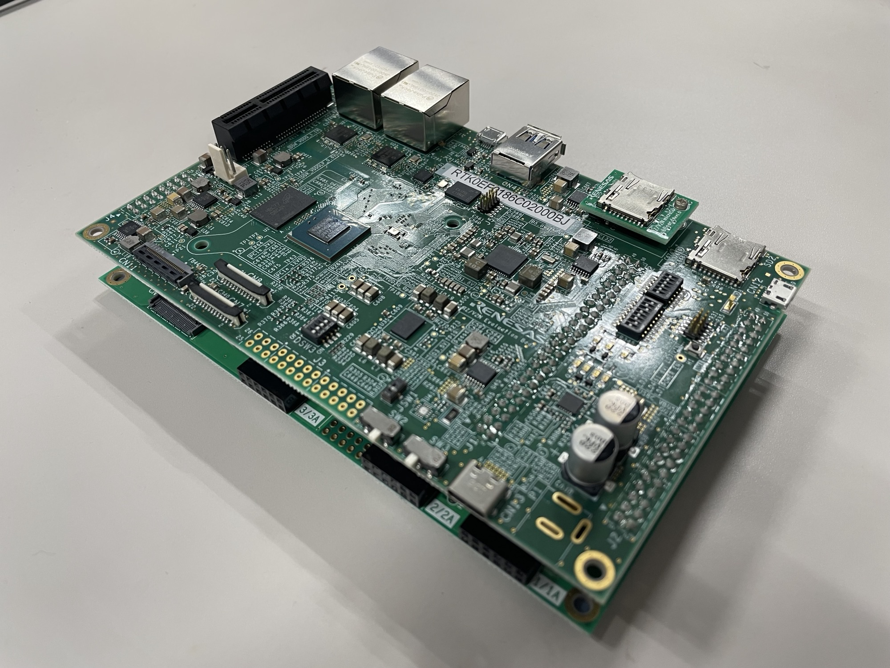

    

        

            Board and Software
        

    

 

    

        

            <h3 id="index">
                Index
            </h3>
            <ul>
                <li><a href="#v2l-evk">RZ/V2L Evaluation Board Kit</a></li>
                <li><a href="#v2h-evk">RZ/V2H Evaluation Board Kit</a></li>
                <li><a href="#v2n-evk">RZ/V2N Evaluation Board Kit</a></li>
            </ul>
        

        

            <h3>RZ/V2L Evaluation Board Kit (EVK)</h3>
        

        

            
        

        

             
            <a class="btn btn-warning btn-lg rounded-pill download-button-yellow" href="https://www.renesas.com/products/microcontrollers-microprocessors/rz-mpus/rzv2l-evkit-rzv2l-evaluation-board-kit" role="button">
            
            Get RZ/V2L EVK</a>
             
             
            <a class="btn btn-outline-primary btn-lg rounded-pill download-button" href="https://www.renesas.com/software-tool/rzv2l-ai-software-development-kit" role="button">
            
            Get RZ/V2L AI SDK</a>
             
             
            If you would like to use the GUI environment (e2 studio for RZ/V2L), see <a href="{{ site.url }}{{ site.baseurl }}">AI Navigator Quick Start Guide</a> instead of "Get RZ/V2L AI SDK" Button above.
        

    

     
     
    

        

            <h3>RZ/V2H Evaluation Board Kit (EVK)</h3>
        

        

            
        

        

             
            <a class="btn btn-warning btn-lg rounded-pill download-button-yellow" href="https://www.renesas.com/products/microcontrollers-microprocessors/rz-mpus/rzv2h-evk-rzv2h-quad-core-vision-ai-mpu-evaluation-kit" role="button">
            
            Get RZ/V2H EVK</a>
             
             
            <a class="btn btn-outline-primary btn-lg rounded-pill download-button" href="https://www.renesas.com/software-tool/rzv2h-ai-software-development-kit" role="button">
            
            Get RZ/V2H AI SDK</a>
             
             
            If you would like to use the GUI environment (e2 studio for RZ/V2H), see <a href="{{ site.url }}{{ site.baseurl }}">AI Navigator Quick Start Guide</a> instead of "Get RZ/V2H AI SDK" Button above.
        

    

     
     
    

        

            <h3>RZ/V2N Evaluation Board Kit (EVK)</h3>
        

        

            
        

        

             
            <a class="btn btn-warning btn-lg rounded-pill download-button-yellow" href="https://www.renesas.com/rzv2n-evkit" role="button">
            
            Get RZ/V2N EVK</a>
             
             
            <a class="btn btn-outline-primary btn-lg rounded-pill download-button" href="https://www.renesas.com/software-tool/rzv2n-ai-software-development-kit" role="button">
            
            Get RZ/V2N AI SDK</a>
        

    

     
     
    

        

            <a class="btn btn-secondary square-button" href="{{ site.url }}{{ site.baseurl }}" role="button">
                Back to Home >
            </a>
        

    

