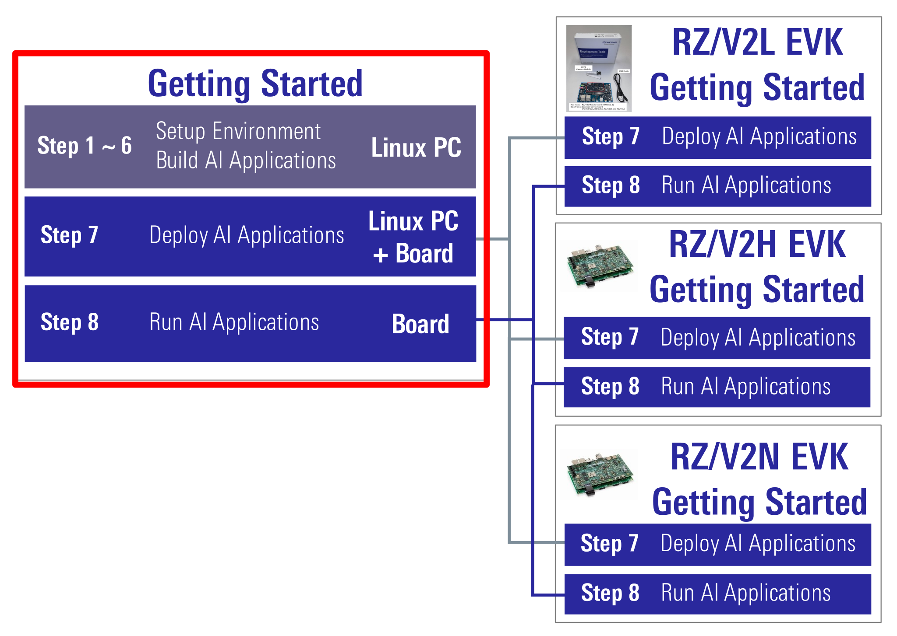

    

        

Getting Started
        

    

 
 
<h5>This page explains how to start-up the AI SDK. </h5>
AI SDK is build for specific board. 
Its version varies depending on the supported board.
<table class="gstable ms-4 mb-1">
  <tr>
    <th>Supported Board</th>
    <th>Supported AI SDK</th>
  </tr>
  <tr>
    <td>RZ/V2L Evaluation Board Kit</td>
    <td>RZ/V2L AI SDK <b>v5.00</b></td>
  </tr>
  <tr>
    <td>RZ/V2H Evaluation Board Kit</td>
    <td>RZ/V2H AI SDK <b>v5.20</b></td>
  </tr>
  <tr>
    <td>RZ/V2N Evaluation Board Kit</td>
    <td>RZ/V2N AI SDK <b>v5.00</b></td>
  </tr>
</table>
<a class="ms-4" href="https://www.renesas.com/products/microcontrollers-microprocessors/rz-mpus/rzv-embedded-ai-mpus" target="_blank" rel="noopener noreferrer">Learn more about the RZ/V series.</a>

<reference_terminology>

  Note
  Hereafter, we use following terminology. 
  <ul class="mb-1">
    <li><b>RZ/V AI SDK</b>: Refers RZ/V2L AI SDK, RZ/V2H AI SDK and RZ/V2N AI SDK.</li>
    <li><b>EVK</b>: Refers "Evaluation Board Kit".</li>
  </ul>

</reference_terminology>

  Tutorial video
  Tutorial video is available <a href="{{ site.url }}{{ site.baseurl }}#video" target="_blank" rel="noopener noreferrer">here.</a> 
  <ul class="mb-1">
    <li>For RZ/V2L EVK: RZ/V2L AI SDK v2.10</li>
    <li>For RZ/V2H EVK: RZ/V2H AI SDK v3.00</li>
  </ul>

  GUI environment
  AI SDK has a CUI environment and a GUI environment. 
  For the GUI environment, see <a href="{{ site.url }}{{ site.baseurl }}" target="_blank" rel="noopener noreferrer">AI Navigator Quick Start Guide</a>. 

<h3>Introduction</h3>

  

    

      <h4 class="u_line">Getting Started Flow</h4>
      Getting Started explains the instruction to run AI Applications. 
      Common instructions are explained in this document. 
      Board dependent instructions are explained in each EVK Getting Started page. 
        
    

  

  

    

      <h4 class="u_line">Software</h4>
      Renesas provides following software.
        
      <table class="gstable ms-4">
        <tr>
          <th>Software</th>
          <th>Provided on</th>
          <th>Details</th>
        </tr>
        <tr>
          <td>AI Applications</td>
          <td>GitHub</td>
          <td>
            This software is a set of following files that runs on the evaluation board kit. 
            <ul class="mb-1">
              <li>
              Application Source code (C++)
              </li>
              <li>
              Pre-build application binary
              </li>
              <li>
              Other necessary files to run the application
              </li>
              <li>
              Documentation (<code>README.md</code>)
              </li>
            </ul>
            "Getting Started" page (this page) explains how to run the AI Applications.
          </td>
        </tr>
        <tr>
          <td>RZ/V AI SDK</td>
          <td>Renesas Website</td>
          <td>
            This software is a development environment for AI Applications. 
            Provided as a zip file. 
            "Getting Started" page (this page) explains how to use RZ/V AI SDK to run the AI Applications.
          </td>
        </tr>
        <tr>
          <td>RZ/V AI SDK  Source Code</td>
          <td>Renesas Website</td>
          <td>
            This software is the source code of RZ/V AI SDK. 
            Provided as a zip file. 
            It includes Yocto Linux recipe. 
            Details and instructions are explained in the following pages. 
            <a class="btn btn-secondary square-button-gray ms-3 mt-1" style="text-align:left;" href="{{ site.url }}{{ site.baseurl }}" role="button">
              How to Build RZ/V2L AI SDK
              
              How can I build RZ/V2L AI SDK Source Code? 
              
            </a>
             
            <a class="btn btn-secondary square-button-gray ms-3 mt-1" style="text-align:left;" href="{{ site.url }}{{ site.baseurl }}" role="button">
              How to Build RZ/V2H AI SDK
              
              How can I build RZ/V2H AI SDK Source Code? 
              
            </a>
             
            <a class="btn btn-secondary square-button-gray ms-3 mt-1" style="text-align:left;" href="{{ site.url }}{{ site.baseurl }}" role="button">
              How to Build RZ/V2N AI SDK
              
              How can I build RZ/V2N AI SDK Source Code? 
              
            </a>
          </td>
        </tr>
      </table>
    

  

<h3 id="step1" >Step 1: Obtain an evaluation board</h3>

  

    

      To start using RZ/V AI SDK, we need to get the board. 
      Renesas provides ideal board kit for evaluation. 
       
      Click the button below to get the board. 
      <a class="btn btn-secondary square-button ms-3 mt-1" style="text-align:left;" href="{{ site.url }}{{ site.baseurl }}" role="button">
        Board and Software 
        Get the board and software for RZ/V series.
      </a>
       
       
      To see the details of the board, please see EVK Getting Started. 
      <a class="btn btn-secondary square-button ms-3 mt-1" style="text-align:left;" href="{{ site.url }}{{ site.baseurl }}" role="button" target="_blank" rel="noopener noreferrer">
        RZ/V2L EVK Getting Started 
        
        What is included in EVK?
        
      </a>
       
      <a class="btn btn-secondary square-button ms-3 mt-1" style="text-align:left;" href="{{ site.url }}{{ site.baseurl }}" role="button" target="_blank" rel="noopener noreferrer">
        RZ/V2H EVK Getting Started
        
        What is included in EVK?
        
      </a>
       
      <a class="btn btn-secondary square-button ms-3 mt-1" style="text-align:left;" href="{{ site.url }}{{ site.baseurl }}" role="button" target="_blank" rel="noopener noreferrer">
        RZ/V2N EVK Getting Started
        
        What is included in EVK?
        
      </a>
    

  

 

<h3 id="step2" >Step 2: Obtain necessary environment</h3>
<h4 class="mt-5 u_line">1. Necessary Equipments</h4>
  Please prepare the following equipments for your EVK. 
  <table class="gstable">
    <tr>
      <th>For</th>
      <th>Equipment</th>
      <th>Details</th>
    </tr>
    <tr>
      <td rowspan="5">
        RZ/V2L
      </td>
      <td>
        RZ/V2L EVK
      </td>
      <td>
        Evaluation Board Kit for RZ/V2L. Includes followings.
        <ul class="mb-1">
          <li>
            MIPI Camera Module(Google Coral Camera)
             
            <h6 class="mb-1">
              Note that the CMOS sensor (OV5645) in the camera is no longer available, and should not be used for mass production. 
              Any software support provided is for evaluation purposes only.
            </h6>
          </li>
          <li>MicroUSB to Serial Cable for serial communication.</li>
        </ul>
      </td>
    </tr>
    <tr>
      <td>
        AC Adapter
      </td>
      <td>
        USB Power Delivery adapter for the board power supply.
      </td>
    </tr>
    <tr>
      <td>
        MicroHDMI Cable
      </td>
      <td>
        Used to connect the HDMI Monitor and the board. 
        RZ/V2L EVK has microHDMI port.
      </td>
    </tr>
    <tr>
      <td>
        USB Camera
      </td>
      <td>
        <b>Optional.</b> AI Applications support USB camera input. 
        Supported resolution: 640x480 
        Supported format: 'YUYV' (YUYV 4:2:2)
      </td>
    </tr>
    <tr>
      <td>
        Windows PC
      </td>
      <td>
        <b>Optional.</b> Used as the serial communication console for QSPI Bootloader. 
        Operating Environment : Windows 10
      </td>
    </tr>
    <tr>
      <td rowspan="4">
        RZ/V2H
      </td>
      <td>
        RZ/V2H EVK
      </td>
      <td>
        Evaluation Board Kit for RZ/V2H.
      </td>
    </tr>
    <tr>
      <td>
        AC Adapter
      </td>
      <td>
        USB Power Delivery adapter for the board power supply. 
        100W is required.
      </td>
    </tr>
    <tr>
      <td>
        HDMI Cable
      </td>
      <td>
        Used to connect the HDMI Monitor and the board. 
        RZ/V2H EVK has HDMI port.
      </td>
    </tr>
    <tr>
      <td>
        USB Camera
      </td>
      <td>
        Since RZ/V2H EVK does not include camera module, this will be the standard camera input source. 
        Supported resolution: 640x480 
        Supported format: 'YUYV' (YUYV 4:2:2) 
        <h6 class="mt-3 mb-1">
          To use MIPI camera, please refer to e-CAM22_CURZH provided by <a href="https://www.e-consystems.com/renesas/sony-starvis-imx462-ultra-low-light-camera-for-renesas-rz-v2h.asp" target="_blank" rel="noopener noreferrer">e-con Systems</a>. 
          e-CAM22_CURZH camera supports FHD(1920x1080) resolution.
        </h6>
      </td>
    </tr>
    <tr>
      <td rowspan="4">
        RZ/V2N
      </td>
      <td>
        RZ/V2N EVK
      </td>
      <td>
        Evaluation Board Kit for RZ/V2N.
      </td>
    </tr>
    <tr>
      <td>
        AC Adapter
      </td>
      <td>
        USB Power Delivery adapter for the board power supply. 
        100W is required.
      </td>
    </tr>
    <tr>
      <td>
        HDMI Cable
      </td>
      <td>
        Used to connect the HDMI Monitor and the board. 
        RZ/V2N EVK has HDMI port.
      </td>
    </tr>
    <tr>
      <td>
        USB Camera
      </td>
      <td>
        Since RZ/V2N EVK does not include camera module, this will be the standard camera input source. 
        Supported resolution: 640x480 
        Supported format: 'YUYV' (YUYV 4:2:2) 
        <h6 class="mt-3 mb-1">
          To use MIPI camera, please refer to e-CAM22_CURZH provided by <a href="https://www.e-consystems.com/renesas/sony-starvis-imx462-ultra-low-light-camera-for-renesas-rz-v2h.asp" target="_blank" rel="noopener noreferrer">e-con Systems</a>. 
          e-CAM22_CURZH camera supports FHD(1920x1080) resolution.
        </h6>
      </td>
    </tr>
    <tr>
      <td rowspan="8">
        Common
      </td>
      <td>
        USB Cable Type-C
      </td>
      <td>
        Connect AC adapter and the board.
      </td>
    </tr>
    <tr>
      <td>
        HDMI Monitor
      </td>
      <td>
        Used to display the graphics of the board.
      </td>
    </tr>
    <tr>
      <td>
        microSD card
      </td>
      <td>
        Must have over 16GB capacity of blank space. 
        Operating Environment: Transcend UHS-I microSD 300S 16GB
      </td>
    </tr>
    <tr>
      <td>
        Linux PC
      </td>
      <td>
        Used for Setup microSD card and RZ/V AI SDK Setup. 
        Operating Environment: Ubuntu 20.04
      </td>
    </tr>
    <tr>
      <td>
        SD card reader
      </td>
      <td>
        Used for setting up microSD card.
      </td>
    </tr>
    <tr>
      <td>
        USB Hub
      </td>
      <td>
        Used to connect USB Keyboard and USB Mouse to the board.
      </td>
    </tr>
    <tr>
      <td>
        USB Keyboard
      </td>
      <td>
        Used to type strings on the terminal of board.
      </td>
    </tr>
    <tr>
      <td>
        USB Mouse
      </td>
      <td>
        Used to operate the mouse on the screen of board.
      </td>
    </tr>
  </table>

  Note
  USB camera has different supported resolution and format. 
  To check the specification of your USB camera, use <a href="https://www.mankier.com/1/v4l2-ctl" target="_blank" rel="noopener noreferrer"><code>v4l2-ctl</code></a> command.

 
<h4 class="u_line">2. Necessary Software</h4>

Please install following software <b>on Linux PC</b>.

<ul class="mt-1 mb-1">
  <li><a href="https://docs.docker.com/" target="_blank" rel="noopener noreferrer">Docker</a></li>  <!-- Open in new tab -->
  <li>git</li>
  <li>bmap-tools (For RZ/V2H and RZ/V2N)</li>
</ul>
 

<h3 id="step3" >Step 3: Obtain RZ/V AI SDK</h3>
RZ/V AI SDK provides following packages for each supported board.
<table class="gstable">
  <tr>
    <th>Name</th>
    <th>Package</th>
    <th>Details</th>
  </tr>
  <tr>
    <td><b>RZ/V AI SDK</b></td>
    <td><b>RTK0EF0*SJ.zip</b></td>
    <td><b>Package used for AI development.</b> 
      For this Getting Started, please download <b>"RZ/V AI SDK"</b> for your preferred device from the link below. 
      <a class="btn btn-secondary square-button ms-3 mt-1" style="text-align:left;" href="https://www.renesas.com/document/sws/rzv2l-ai-sdk-v500" role="button" target="_blank" rel="noopener noreferrer">
          RZ/V2L AI SDK
          Get the RZ/V2L AI Software Development Kit
      </a>
       
      <a class="btn btn-secondary square-button ms-3 mt-1" style="text-align:left;" href="https://www.renesas.com/document/sws/rzv2h-ai-sdk-v520" role="button" target="_blank" rel="noopener noreferrer">
          RZ/V2H AI SDK
          Get the RZ/V2H AI Software Development Kit
      </a>
       
      <a class="btn btn-secondary square-button ms-3 mt-1" style="text-align:left;" href="https://www.renesas.com/document/sws/rzv2n-ai-sdk-v500" role="button" target="_blank" rel="noopener noreferrer">
          RZ/V2N AI SDK
          Get the RZ/V2N AI Software Development Kit
      </a>    
        
      Once downloaded, please check the Release Note included in the package.
            
    </td>
  </tr>
  <tr>
    <td>RZ/V AI SDK Source Code</td>
    <td>RTK0EF0*SJ_linux-src.zip</td>
    <td>Package used for Linux development. 
      Please refer to following pages for more details on this package. 
      <a class="btn btn-secondary square-button-gray ms-3 mt-1" style="text-align:left;" href="{{ site.url }}{{ site.baseurl }}" role="button">
        How to Build RZ/V2L AI SDK
        
        How can I build RZ/V2L AI SDK Source Code? 
        
      </a>
       
      <a class="btn btn-secondary square-button-gray ms-3 mt-1" style="text-align:left;" href="{{ site.url }}{{ site.baseurl }}" role="button">
        How to Build RZ/V2H AI SDK
        
        How can I build RZ/V2H AI SDK Source Code? 
        
      </a>
       
      <a class="btn btn-secondary square-button-gray ms-3 mt-1" style="text-align:left;" href="{{ site.url }}{{ site.baseurl }}" role="button">
        How to Build RZ/V2N AI SDK
        
        How can I build RZ/V2N AI SDK Source Code? 
        
      </a>
    </td>
  </tr>
</table>
<h3 id="step4" >Step 4: Extract RZ/V AI SDK package</h3>
This step explains how to extract the RZ/V AI SDK zip file.
<ol>
  <li>On your Linux PC, make the working directory.

mkdir -p ai_sdk_work

  </li>
  <li>Register the working directory path to an environment variable. 

export WORK=<path to the working directory>/ai_sdk_work

  </li>
  <li>Move to the working directory.

cd ${WORK}

  </li>
  <li>Extract RZ/V AI SDK zip file under the working directory. 

unzip <Path to the file>/RTK0EF0*.zip -d ${WORK}

  </li>
  <li>Check the working directory to confirm the package contents.

ls ${WORK}/

    <ul>
      <li>If the above command prints followings, the package is extracted correctly.

ai_sdk_setup  board_setup  documents  references r11an0*.pdf

      </li>
    </ul>
  </li>
</ol>
 

<h3 id="step5" >Step 5: Setup RZ/V AI SDK</h3>
This step explains how to setup the RZ/V AI SDK environment.

  Note
  Make sure that you have <a href="https://docs.docker.com/" target="_blank" rel="noopener noreferrer">installed Docker</a> on your Linux PC.

<ol>
  <li>On your Linux PC, move to the working directory.

cd ${WORK}/ai_sdk_setup

  </li>
  <li>Build docker image. 
    <ul>
      <li>For RZ/V2L

sudo docker build -t rzv2l_ai_sdk_image --build-arg SDK="/opt/poky/3.1.31" --build-arg PRODUCT="V2L" .

      </li>
      <li>For RZ/V2H, RZ/V2N 
          Since RZ/V2N is a brother chip of RZ/V2H, the same commands can be used.

sudo docker build -t rzv2h_ai_sdk_image --build-arg SDK="/opt/poky/3.1.31" --build-arg PRODUCT="V2H" .

      </li>
    </ul>
  </li>
  <li>Create new directory to be mounted on Docker container.

mkdir ${WORK}/ai_sdk_setup/data

  </li>
  <li>Create docker container.  Here, <code><rzv2l/rzv2h>_ai_sdk_container</code> is a name of docker container, which can be changed by user.
    <ul>
      <li>For RZ/V2L

sudo docker run -it --name rzv2l_ai_sdk_container -v $(pwd)/data:/drp-ai_tvm/data rzv2l_ai_sdk_image

      </li>
      <li>For RZ/V2H, RZ/V2N 
          Since RZ/V2N is a brother chip of RZ/V2H, the same commands can be used.

sudo docker run -it --name rzv2h_ai_sdk_container -v $(pwd)/data:/drp-ai_tvm/data rzv2h_ai_sdk_image

      </li>
    </ul>
    The local <code>$(pwd)/data</code> is mounted to <code>/drp-ai_tvm/data</code> on the Docker container by the above command option. 
    For example, you can use this directory to copy files created on the Docker container to your local environment.  
    
  </li> 
  <li>In docker container, run the following command to copy <code>libtvm_runtime.so</code>, which is the necessary file for the board, to host machine. 

cp /drp-ai_tvm/obj/build_runtime/${PRODUCT}/libtvm_runtime.so /drp-ai_tvm/data

  </li>
  <li>To exit docker, run following commands. 

exit

  </li>
  <li>To start the docker container again, run the following command. 

docker start -i <container_name, i.e., rzv2l_ai_sdk_container>

  </li>
</ol>
 
You have finished the RZ/V AI SDK environment setup. 
You are ready to build the AI applications!
  

<h3 id="step6" >Step 6: Build RZ/V AI Application</h3>
This step explains how to build AI application.
 
To see the overview about AI Applications, please refer to <a href="{{ site.url }}{{ site.baseurl }}" target="_blank" rel="noopener noreferrer">About AI Applications</a> page. 
<a class="btn btn-secondary square-button ms-3 mt-1" style="text-align:left;" href="{{ site.url }}{{ site.baseurl }}" role="button" target="_blank" rel="noopener noreferrer">
    About AI Applications 
    
    What is AI Applications? 
    How is directory/file structured? 
    How can I download the previous version? 
</a>
 
 

  Note
  Following procedures are for users who would like to build the application from the source code. 
  If you would like to run the application <b>as quickly as possible</b>, you can skip this step and proceed to the <b><a href="#step7">next step (Step 7: Deploy AI Application)</a></b> since pre-build application binary is provided.

 
<h4 id="build-instruction" class="u_line">Building instructions.</h4>
In <a href="{{ site.url }}{{ site.baseurl }}" target="_blank" rel="noopener noreferrer">AI Applications</a>, there are two types of applications.
  <table class="gstable ms-3">
    <tr>
        <th>Application</th>
        <th>GitHub Repository</th>
        <th>Details</th>
        <th>Example</th>
    </tr>
    <tr>
        <td><Application 1></td>
        <td>
          <h6 class="mb-0 table-small-text">
            <ul class="mb-1 ps-3">
              <li>
                <a href="https://github.com/renesas-rz/rzv_ai_sdk" target="_blank" rel="noopener noreferrer">https://github.com/renesas-rz/rzv_ai_sdk</a> 
              </li>
              <li>
                <a href="https://github.com/Ignitarium-Renesas/rzv_ai_apps" target="_blank" rel="noopener noreferrer">https://github.com/Ignitarium-Renesas/rzv_ai_apps</a>
              </li>
            </ul>
          </h6>
        </td>
        <td>
          <h6 class="mb-0 table-small-text">
            These repositories provide the complete instruction in each application documentation.
          </h6>
        </td>
        <td>
          <h6 class="mb-0">
            <a href="https://github.com/renesas-rz/rzv_ai_sdk/tree/v5.20pre/R01_object_detection" target="_blank" rel="noopener noreferrer">R01_object_detection</a>
          </h6>
        </td>
    </tr>
    <tr>
        <td><Application 2></td>
        <td>
          <h6 class="mb-0 table-small-text">
            <ul class="mb-1 ps-3">
              <li>
                <a href="https://github.com/Ignitarium-Renesas/RZV2L_AiLibrary" target="_blank" rel="noopener noreferrer">https://github.com/Ignitarium-Renesas/RZV2L_AiLibrary</a>
              </li>
            </ul>
          </h6>
        </td>
        <td>
          <h6 class="mb-0 table-small-text">
            This repository only contains AI Applications for RZ/V2L EVK. 
            It does not provide instructions for RZ/V AI SDK. 
            Please refer to the instruction provided in this page.
          </h6>
        </td>
        <td>
          <h6 class="mb-0">
            <a href="https://github.com/Ignitarium-Renesas/RZV2L_AiLibrary/tree/main/01_Head_count" target="_blank" rel="noopener noreferrer">01_Head_count</a>
          </h6>
        </td>
    </tr>
  </table>
<ul style="list-style:none;">
  <li>
    <h5 id="build-option1" class="mb-3">Option 1: For <b>&lt;Application 1&gt;</b></h5>
    <ol>
      <li>
        Check the <code>README.md</code> document provided in application directory and follow the instruction in the chapter called <b>"Application: Build Stage"</b> (or similar) to build the application.  
        

          <u><b>Example:</b></u> 
          In <a href="https://github.com/renesas-rz/rzv_ai_sdk/tree/v5.20pre/R01_object_detection" target="_blank" rel="noopener noreferrer">R01_object_detection</a> application, follow the instruction <a href="https://github.com/renesas-rz/rzv_ai_sdk/tree/v5.20pre/R01_object_detection#application-build-stage" target="_blank" rel="noopener noreferrer">here</a> to generate the following application binary.
          <ul>
            <li>object_detection</li>
          </ul>
        

          <!-- From here: Delete when making latest version -->
          <!--
        

          Note
          The <code>git clone</code> command shown in the <code>README.md</code> will download the <b style="color: red;">latest</b> source code and related files.   
          To download the files of AI Applications v{{ site.version }}, please specify the version tag by adding <code>-b v{{ site.version }}</code>  when you running the <code>git clone</code> command as shown below.

git clone -b v{{ site.version }} https://github.com/renesas-rz/rzv_ai_sdk.git

        

          -->
          <!-- Until here: Delete when making latest version -->
      </li>
    </ol>
     
    After you generated the application binary, please proceed to <a href="#step7">Step 7</a>
  </li>
    
  <li>
    <h5 id="build-option2" class="mb-3">Option 2: For <b>&lt;Application 2&gt;</b></h5>
    <ol>
      <li>Run (or start) docker container.  
        

          <u><b>Example:</b></u> 
          Run the following command to start the docker container created in <a href="#step5">Step 5</a>.

docker start -i rzv2l_ai_sdk_container

        

      </li> 
      <li>Change the environment variable to use the cross compiler.

source /opt/poky/3.1.31/environment-setup-aarch64-poky-linux

        

          Note
          This command needs to be called everytime user opened the new terminal.
        

      </li> 
      <li>Move to the mounted point in docker container.
         

cd /drp-ai_tvm/data

      </li> 
      <li>Download the application source code. 
        Here, we use <a href="https://github.com/Ignitarium-Renesas/RZV2L_AiLibrary/tree/main/01_Head_count" target="_blank" rel="noopener noreferrer">RZV2L_AiLibrary repository 01_Head_count application</a> as an example.
         

git clone https://github.com/Ignitarium-Renesas/RZV2L_AiLibrary

        <!-- From here: Delete when making latest version -->
        <!-- 

          Note
          The command above will download the <b style="color: red;">latest</b> source code and related files.   
          To download the files of AI Applications v{{ site.version }}, please specify the version tag by adding <code>-b v{{ site.version }}</code> when you running the <code>git clone</code> command as shown below.

git clone -b v{{ site.version }} https://github.com/Ignitarium-Renesas/RZV2L_AiLibrary

        
 -->
        <!-- Until here: Delete when making latest version -->
      </li> 
      <li>Move to the application directory.

cd RZV2L_AiLibrary/01_Head_count/Head_count_cam

        

          Note
          The file configuration depends on each application. Please check the file configuration in the repository carefully.
        

      </li> 
      <li>Build the application with <code>make</code> command.
         

make

      </li> 
      <li>Check that following application is generated in the <code>RZV2L_AiLibrary/01_Head_count/ Head_count_cam/exe</code>.
        <ul>
          <li>head_count_cam_app</li>
        </ul>
      </li> 
      <li>If you would like to build the other applications of <a href="#build-option1"><Application 1> (Option 1)</a>, please exit and restart the docker container.
      </li>
    </ol>
     
    After you generated the application binary, please proceed to <a href="#step7">Step 7</a>
  </li>
</ul>
  

<h3 id="step7" >Step 7: Deploy AI Application</h3>
Please see each EVK Getting Started Step 7 for detailed instructions. 
<a class="btn btn-secondary square-button ms-3 mt-1" style="text-align:left;" href="{{ site.url }}{{ site.baseurl }}#step7" role="button" target="_blank" rel="noopener noreferrer">
  RZ/V2L EVK Getting Started Step 7
  
  How can I setup microSD card for eSD/QSPI Bootloader? 
  How can I deploy applications to the board? 
  How can I write QSPI Bootloader to the board? 
  How can I boot the board? 
  
</a>
 
<a class="btn btn-secondary square-button ms-3 mt-1" style="text-align:left;" href="{{ site.url }}{{ site.baseurl }}#step7" role="button" target="_blank" rel="noopener noreferrer">
  RZ/V2H EVK Getting Started Step 7
  
  How can I setup microSD card for eSD Bootloader? 
  How can I deploy applications to the board? 
  How can I boot the board? 
  
</a>
 
<a class="btn btn-secondary square-button ms-3 mt-1" style="text-align:left;" href="{{ site.url }}{{ site.baseurl }}#step7" role="button" target="_blank" rel="noopener noreferrer">
  RZ/V2N EVK Getting Started Step 7
  
  How can I setup microSD card for eSD/xSPI Bootloader? 
  How can I deploy applications to the board? 
  How can I write xSPI Bootloader to the board? 
  How can I boot the board? 
  
</a>
 
 

After Step 7, users should have completed followings.
<ul>
  <li>Setup miroSD card.</li>
  <li>Deploy the application on miroSD card.</li>
  <li>Boot the board.</li>
</ul>

 

<h3 id="step8" >Step 8: Run AI Application</h3>

Please see each EVK Getting Started Step 8 for detailed instructions. 
<a class="btn btn-secondary square-button ms-3 mt-1" style="text-align:left;" href="{{ site.url }}{{ site.baseurl }}#step8" role="button" target="_blank" rel="noopener noreferrer">
  RZ/V2L EVK Getting Started Step 8
  
  How can I run applications? 
  How does application look on HDMI screen? 
  
</a>
 
<a class="btn btn-secondary square-button ms-3 mt-1" style="text-align:left;" href="{{ site.url }}{{ site.baseurl }}#step8" role="button" target="_blank" rel="noopener noreferrer">
  RZ/V2H EVK Getting Started Step 8
  
  How can I run applications? 
  How does application look on HDMI screen? 
  
</a>
 
<a class="btn btn-secondary square-button ms-3 mt-1" style="text-align:left;" href="{{ site.url }}{{ site.baseurl }}#step8" role="button" target="_blank" rel="noopener noreferrer">
  RZ/V2N EVK Getting Started Step 8
  
  How can I run applications? 
  How does application look on HDMI screen? 
  
</a>
 
 

After Step 8, users should have completed followings.
<ul>
  <li>Run the application.</li>
</ul>

  Note
  To shutdown the board safely, please refer to followings. 
  <ul>
    <li>
      <a href="{{ site.url }}{{ site.baseurl }}#A3" target="_blank" rel="noopener noreferrer">A2. Shutdown RZ/V2L EVK</a>
    </li>
    <li>
      <a href="{{ site.url }}{{ site.baseurl }}#A4" target="_blank" rel="noopener noreferrer">A3. Shutdown RZ/V2H EVK and RZ/V2N EVK</a>
    </li>
  </ul>

  

<h4 id="ending" class="u_line">
  This is the end of Getting Started.
</h4>
You have experienced the AI Application development procedures. 
Next step is to change the application to create your own AI Application. 
You can use the applications listed in <a href="{{ site.url }}{{ site.baseurl }}" target="_blank" rel="noopener noreferrer">AI Applications</a> to expand your ideas!
  

If you would like to customize Yocto Linux or develop your own board, please change and build the AI SDK Source Code based on your environment.
 
Please refer to How to Build AI SDK page shown below for more details. 
<a class="btn btn-secondary square-button-gray ms-3 mt-1" style="text-align:left;" href="{{ site.url }}{{ site.baseurl }}" role="button" target="_blank" rel="noopener noreferrer">
  How to Build RZ/V2L AI SDK
  
  How can I build RZ/V2L AI SDK Source Code? 
  
</a>
 
<a class="btn btn-secondary square-button-gray ms-3 mt-1" style="text-align:left;" href="{{ site.url }}{{ site.baseurl }}" role="button" target="_blank" rel="noopener noreferrer">
  How to Build RZ/V2H AI SDK
  
  How can I build RZ/V2H AI SDK Source Code? 
  
</a>
 
<a class="btn btn-secondary square-button-gray ms-3 mt-1" style="text-align:left;" href="{{ site.url }}{{ site.baseurl }}" role="button" target="_blank" rel="noopener noreferrer">
  How to Build RZ/V2N AI SDK
  
  How can I build RZ/V2N AI SDK Source Code? 
  
</a>
 

  

    

      <a class="btn btn-secondary square-button" href="{{ site.url }}{{ site.baseurl }}#page-top" role="button">
Back to Top >
      </a>
    

  

