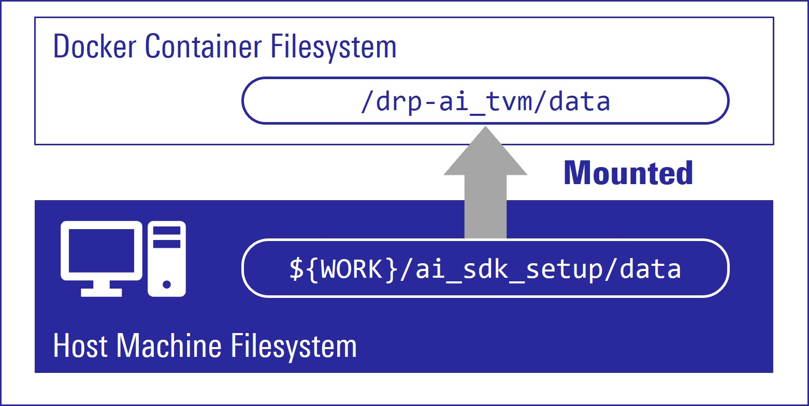
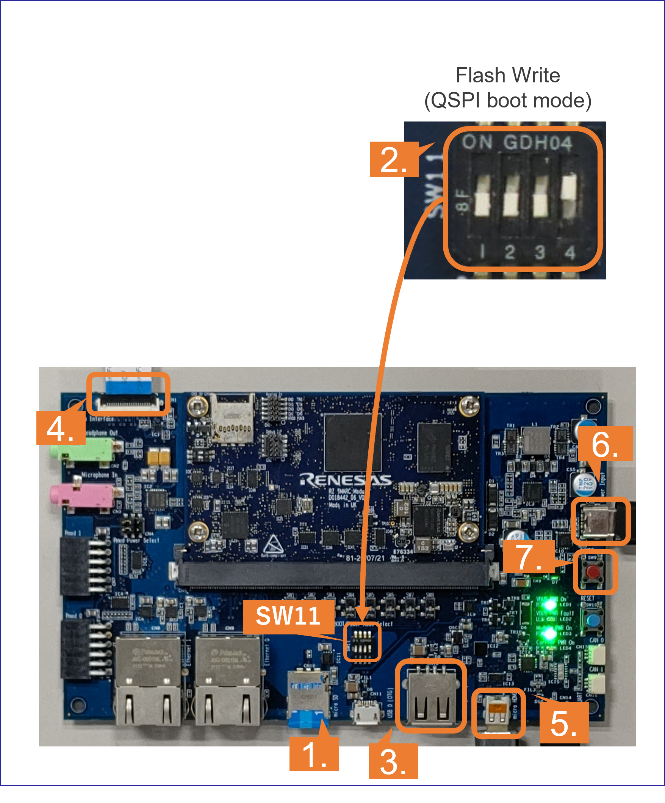
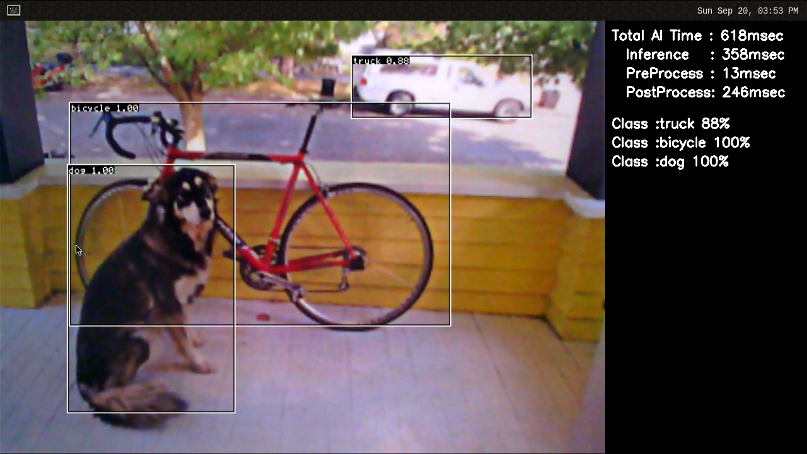

<div class="container">
    <div class="row">
        <div class="top col-12">
Getting Started
        </div>
    </div>
</div>
<br>
<br>
<h5>This page explains how to start-up the AI SDK on the <b>RZ/V2L Evaluation Board Kit</b>.</h5>

Tutorial video is available <a href="{{ site.url }}{{ site.baseurl }}#video">here.</a>
This tutorial is based on RZ/V2L AI SDK version 1.00.<br>

<a href="https://www.renesas.com/products/microcontrollers-microprocessors/rz-mpus/rzv-embedded-ai-mpus">Learn more about the RZ/V series.</a>


<h5>Supported version: <b>RZ/V2L AI SDK v1.00</b></h5>

<h3 id="step1" >Step 1: Obtain an evaluation board</h3>
<div class="container">
    <div class="row">
        <div class="col-6">
The RZ/V2L Evaluation Board Kit (EVK) is the ideal board kit for RZ/V2L evaluation. 
<br><br>
Since MIPI camera module is included, you can start evaluating RZ/V2L immediately by building an environment.  
<br><br>
<a class="btn btn-primary download-button" href="https://www.renesas.com/products/microcontrollers-microprocessors/rz-mpus/rzv2l-evkit-rzv2l-evaluation-board-kit" role="button">Get RZ/V2L EVK</a>
        </div>
        <div class="col-6">
            <br>
        </div>
    </div>
    <div class="row">
        <div class="col-12">
          Following items are included in the RZ/V2L Evaluation Board Kit.
          <table>
              <tr>
                <th>Equipment</th>
                <th>Details</th>
              </tr>
              <tr>
                <td>RZ/V2L Evaluation Board</td>
                <td>Evaluation board itself.</td>
              </tr>
              <tr>
                <td>MIPI Camera Module</td>
                <td>Google Coral Camera.<br><h6>Note that the CMOS sensor (OV5645) in the camera is <b>no longer available</b>, and should not be 
          used for mass production. <br>Any software support provided is for evaluation purposes only. </h6></td>
              </tr>
              <tr>
                <td>MicroUSB to Serial Cable</td>
                <td>For serial communication between PC and the board.</td>
              </tr>
            </table>
        </div>
    </div>
</div>
<br>

<h3 id="step2" >Step 2: Obtain necessary environment</h3>
<br>
<h4>1. Necessary Equipments</h4>
In addition to the RZ/V2L Evaluation Board Kit, please prepare the following equipments.<br>
Note that Serial to MicroUSB Cable and MIPI Camera Module (Google Coral camera) is included in RZ/V2L Evaluation Board Kit.
 <table>
    <tr>
      <th>Equipment</th>
      <th>Details</th>
    </tr>
    <tr>
      <td>HDMI Monitor</td>
      <td>Used to display the graphics</td>
    </tr>
    <tr>
      <td>AC adapter</td>
      <td>Power supply to the board</td>
    </tr>
    <tr>
      <td>USB Cable Type-C</td>
      <td>Connect AC adapter and the board</td>
    </tr>
    <tr>
      <td>microSD card</td>
      <td>Must have over 4GB capacity of blank space.<br>Operating Environment: Transcend USH-I microSD 300S 16GB</td>
    </tr>
    <tr>
      <td>Linux PC</td>
      <td>Used for Setup microSD card and RZ/V2L AI SDK Setup.<br>
      Operating Environment: Ubuntu 20.04</td>
    </tr>
    <tr>
      <td>SD card reader</td>
      <td>Used for setting up microSD card<br></td>
    </tr>
    <tr>
      <td>PC</td>
      <td>Used for the serial communication console<br>
      Operating Environment : Windows 10</td>
    </tr>
    <tr>
      <td>USB Hub</td>
      <td><b>Optional.</b> Used only when booting on HDMI monitor.</td>
    </tr>
    <tr>
      <td>USB Keyboard</td>
      <td><b>Optional.</b> Used only when booting on HDMI monitor.</td>
    </tr>
    <tr>
      <td>USB Mouse</td>
      <td><b>Optional.</b> Used only when booting on HDMI monitor.</td>
    </tr>
  </table>

<h4>2. Necessary Software</h4>
Please prepare following software.<br>
1. Install following software <b>on Ubuntu PC</b>
    - <a href="https://docs.docker.com/">Docker</a>  
    - git  
2. Install following software <b>on PC</b> to be used as serial communication console.
    - Terminal emulator  
        - Operating Environment: Tera Term  
<br><br>
<h3 id="step3" >Step 3: Obtain RZ/V2L AI SDK</h3>
Download the RZ/V2L AI SDK from the link below.<br><br>
<a class="btn btn-primary download-button" href="https://www.renesas.com/software-tool/rzv2l-ai-software-development-kit" role="button">Download Link</a>
<br>

Check the Release Note included in the package.<br><br>


<h3 id="step4" >Step 4: Extract RZ/V2L AI SDK package</h3>
This step explains how to extract the RZ/V2L AI SDK zip file.<br>

1. On your Linux PC, make the working directory.
```sh
mkdir -p ai_sdk_work
```

2. Register the working directory path to an environment variable. 
```sh
export WORK=<path to the working directory>/ai_sdk_work
```

3. Move to the working directory.
```sh
cd ${WORK}
```

4. Extract RZ/V2L AI SDK zip file under the working directory. 
```sh
unzip <Path to the file>/r11an0752ej*.zip -d ${WORK}
```

5. Check the working directory to confirm the package contents.
```sh
ls ${WORK}/
```
- If the above command prints followings, the package is extracted correctly.
```sh
ai_sdk_setup  board_setup  documents  references r11an0752ej*.pdf
```

<h3 id="step5" >Step 5: Setup RZ/V2L AI SDK</h3>
This step explains how to setup the RZ/V2L AI SDK environment.<br>

>Note: Make sure that you have <a href="https://docs.docker.com/">installed Docker</a> on your Linux PC.<br>

1. On your Linux PC, move to the working directory.
```sh
cd ${WORK}/ai_sdk_setup
```

2. Build docker image.
```sh
docker build -t rzv2l_ai_sdk_image --build-arg SDK="/opt/poky/3.1.17" --build-arg PRODUCT="V2L" .
```

3. Create new directory to be mounted on Docker container.
```sh
mkdir ${WORK}/ai_sdk_setup/data
```

4. Create docker container. <br>Here, `rzv2l_ai_sdk_container` is a name of docker container, which can be changed by user.
```sh
docker run -it --name rzv2l_ai_sdk_container -v $(pwd)/data:/drp-ai_tvm/data rzv2l_ai_sdk_image
```
The local `$(pwd)/data` is mounted to `/drp-ai_tvm/data` on the Docker container by the above command option.<br>
For example, you can use this directory to copy files created on the Docker container to your local environment.<br><br>
  <br>

5. In docker container, run the following command to copy `libtvm_runtime.so`, which is the necessary file for the board, to host machine.<br>
```sh
cp /drp-ai_tvm/obj/build_runtime/V2L/libtvm_runtime.so /drp-ai_tvm/data
```

6. To exit docker, run following commands.<br>
```sh
exit
```

7. To start the docker container `rzv2l_ai_sdk_container` again, run the following command.<br>
```sh
docker start -i rzv2l_ai_sdk_container
```

<br>
You have finished the RZ/V2L AI SDK environment setup.<br>
You are ready to build the AI applications!
<br>


<h3 id="step6" >Step 6: Build RZ/V2L AI Application</h3>
This step explains how to build AI application.<br>

AI Applications are provided in the GitHub repository.<br>
To access the application, please see <a href="{{ site.url }}{{ site.baseurl }}#ai-applications">AI Applications</a>.<br>

Application directory has the following structure.
  <table>
    <tr>
      <th>Directory</th>
      <th>Details</th>
    </tr>
    <tr>
      <td><code>exe</code></td>
      <td>Execution environment required when running application on the board.</td>
    </tr>
    <tr>
      <td><code>src</code></td>
      <td>Application Source Code.</td>
    </tr>
    <tr>
      <td>Other directory</td>
      <td>Optional: Extra files that may be required other than above.</td>
    </tr>
    <tr>
      <td><code>Makefile</code></td>
      <td>Optional: Configuration to build the application.<br>It may be included in the src directory.</td>
    </tr>
    <tr>
      <td><code>README.md</code></td>
      <td>Optional: Documentation of the application.</td>
    </tr>
  </table>
<br>
<h5 class="skip">Note: Following procedures are for users who would like to build the application from the source code.<br>
If you would like to run the application <b>as quickly as possible</b>, you can <b><a href="#step7">skip to the next step</a></b> since pre-build application binary is provided.</h5>

<h4 id="build-instruction">Building instructions.</h4>
In <a href="{{ site.url }}{{ site.baseurl }}">AI Applications</a>, there are two types of applications.<br>
- **<Application 1>**: Provided in <a href="https://github.com/renesas-rz/rzv_ai_sdk/">RZ/V AI SDK GitHub repository</a>.  
    - This repository provides the complete instruction in each application documentation.  
    - In this page, we use the <a href="https://github.com/renesas-rz/rzv_ai_sdk/tree/main/ R01_object_detection">Object Detection</a> application from this repository for an example.  
- **<Application 2>**: Provided in <a href="https://github.com/Ignitarium-Renesas/RZV2L_AiLibrary">RZV2L_AiLibrary repository</a>.  
    - This repository does not provide instructions for RZ/V2L AI SDK.  

<h5 id="build-option1">Option 1. For <b><Application 1></b></h5>

Check the `README.md` document provided in application directory and follow the instruction in the chapter called <b>"Application: Build Stage"</b> (or similar) to build the application.<br>

For example, in <a href="https://github.com/renesas-rz/rzv_ai_sdk/tree/main/R01_object_detection">Object Detection</a> application, follow the instruction in <a href="https://github.com/renesas-rz/rzv_ai_sdk/tree/main/R01_object_detection#application-build-stage">here</a> to generate the following application binary.<br>
- object_detection

<br>
After you generated the application binary, please proceed to <a href="#step7">Step 7</a>
<br>

<h5 id="build-option2">Option 2. For <b><Application 2></b></h5>
Follow the instruction bellow to build the application.<br>

1. Run (or start) docker container.<br>
    For example, run the following command to start the docker container created in <a href="#step5">Step 5</a>.<br>
```sh
docker start -i rzv2l_ai_sdk_container
```

2. Change the environment variable to use the cross compiler.
> Note: This command needs to be called everytime user opened the new terminal.<br>

    ```sh
    source /opt/poky/3.1.17/environment-setup-aarch64-poky-linux
    ```

3. Move to the mounted point in docker container.
```sh
cd /drp-ai_tvm/data
```

4. Download the application source code.<br>
Here, we use <a href="https://github.com/Ignitarium-Renesas/RZV2L_AiLibrary/01_Head_count">RZV2L_AiLibrary repository Head Counter application</a> as an example.<br>
```sh
git clone https://github.com/Ignitarium-Renesas/RZV2L_AiLibrary
```
5. Move to the application directory.
> Note: The file configuration depends on each application. Please check the file configuration in the repository carefully.<br>

    ```sh
    cd RZV2L_AiLibrary/01_Head_count/Head_count_cam
    ```
6. Build the application with `make` command.
```sh
make
```
7. Check that following application is generated in the <code>RZV2L_AiLibrary/01_Head_count/<br class="br-sp">Head_count_cam/exe</code>.
    - head_count_cam_app<br>
<br>
8. If you would like to build the other applications in <a href="#build-option1">Option 1</a>, please exit and restart the docker container.

<br>
After you generated the application binary, please proceed to <a href="#step7">Step 7</a>
<br>

<h3 id="step7" >Step 7: Setup RZ/V2L Evaluation Board Kit</h3>
This section explains how to setup the RZ/V2L Evaluation Board.<br>

<h5 id="serial">1. Install the serial port driver.</h5>
This step is <b>only required for the first time.</b><br>
<h5 class="skip">Skip to <a href="#bootloader">the next step</a> if you have already installed the serial port driver.<br></h5>
<details>
<summary><b>Click here to see the instructions.</b></summary>
  The serial communication between Windows PC and RZ/V2L Evaluation Board Kit requires following driver.<br>
  <a href="https://ftdichip.com/drivers/vcp-drivers/">https://ftdichip.com/drivers/vcp-drivers/</a><br><br>
  1.1. Download the software "Virtual COM port (VCP) driver" from the windows version "setup executable" on the download page and extract it.<br><br>
  1.2. Run the <code>*.exe</code> file extracted to install the serial port driver.<br><br>
  1.3. Install the terminal emulator, i.e., Tera Term.<br><br>
</details>

<br>

<h5 id="bootloader">2. Write the bootloaders to the board.</h5>
<h5 class="skip">Skip to <a href="#sd">the next step</a> if you have already written the latest bootloaders to the board.<br></h5>

  1. Use the following files to write the bootloaders to the RZ/V2L Evaluation Board Kit according to <a href="{{ site.url }}{{ site.baseurl }}#bootloader">Appendix: Write bootloaders</a>.<br>

  <ul>
    <li><code>Flash_Writer_SCIF_RZV2L_SMARC_<br class="br-sp">PMIC_DDR4_2GB_1PCS.mot</code></li>
    <li><code>bl2_bp-smarc-rzv2l_pmic.srec</code></li>
    <li><code>fip-smarc-rzv2l_pmic.srec</code></li>
  </ul>

<br>

<h5 id="sd">3. Setup the SD card.</h5>
<h5 class="skip">Skip to <a href="#step8">the next step</a> if you have already setup the SD card with the latest Linux kernel, Linux device tree file and root filesystem.
</h5>

microSD card contains the Linux kernel and root filesystem to boot-up the board.<br>
You can use Linux PC to format the microSD card and expand the kernel and the root filesystem using SD card reader.<br>
<br>
Following three files are necessary, which are placed on each partitions on microSD card.<br>
They are in the `${WORK}/board_setup` directory.<br>

<table>
  <tr>
    <th>File</th>
    <th>Description</th>
    <th>microSD card partition</th>
  </tr>
  <tr>
    <th>Image-smarc-rzv2l.bin</th>
    <th>Linux kernel image<br>(The boot program) </th>
    <th>Partition 1</th>
  </tr>
  <tr>
    <th>Image-r9a07g054l2-smarc.dtb </th>
    <th>Linux device tree file<br>(The configuration file for booting) </th>
    <th>Partition 1</th>
  </tr>
  <tr>
    <th>core-image-weston-smarc-rzv2l.tar.bz2</th>
    <th>Linux Root filesystem</th>
    <th>Partition 2</th>
  </tr>
</table>

Follow the instruction below to prepare the microSD card.
<p class="skip"> Note: Here, we use "<b><code>/dev/sdb</code></b>" as microSD card device name.</p>

1. Create the following partitions on microSD card according to <a href="{{ site.url }}{{ site.baseurl }}#partition">Appendix: Format SD card</a>.<br><br>
    <table>
      <tr>
        <th>Partition Number</th>
        <th>Size</th>
        <th>Format</th>
      </tr>
      <tr>
        <th>1</th>
        <th>500MB (minimum 128MB)</th>
        <th>FAT32</th>
      </tr>
      <tr>
        <th>2</th>
        <th>All remaining</th>
        <th>Ext4</th>
      </tr>
    </table>
2. Insert the microSD card to Linux PC.<br><br>
3. Check if the two partitions are created successfully by running `df` command.<br>
> Note: Device name of microSD card, `/dev/sdb`, may differ depending on your environment. <br>

    ```sh
    df -h
    Filesystem 	Size		Used	Avail	Use %	Mounted on	
    …		…		…	…	…	…
    /dev/sdb1		…		…	…	…	…	
    /dev/sdb2		…		…	…	…	…	
    ```
4. Run the following commands to setup the partition 1.<br>
> Note: Change `/dev/sdb`, to your microSD card device name. 

    ```sh
    sudo mkdir -p /mnt/sd
    sudo mount /dev/sdb1 /mnt/sd
    sudo cp $WORK/board_setup/Image-smarc-rzv2l.bin /mnt/sd
    sudo cp $WORK/board_setup/Image-r9a07g054l2-smarc.dtb /mnt/sd
    sync
    sudo umount /mnt/sd
    ```
5. Run the following commands to setup the partition 2, which is the root filesystem of the board.<br>
> Note: Change `/dev/sdb`, to your microSD card device name. 

    ```sh
    sudo mount /dev/sdb2 /mnt/sd
    sudo tar xfj $WORK/board_setup/core-image-weston-smarc-rzv2l.tar.bz2 -C /mnt/sd
    sudo cp $WORK/ai_sdk_setup/data/libtvm_runtime.so /mnt/sd/usr/lib64
    sync
    sudo umount /mnt/sd
    ```

6. Eject the microSD card by running the following command and remove the microSD card from Linux PC.<br>
    ```sh
    sudo eject /dev/sdb
    ```

<br>
<h3 id="step8" >Step 8: Deploy the application to the Board</h3>
This section explains how to copy the <a href="#step6">application binary created in Step 6</a> to the board.<br>
Users are expected to have finished the instructions in <a href="#sd">Setup the SD card in Step 7</a>.<br>

1. Insert the microSD card to Linux PC.<br>

2. Run the following command to mount the partition 2, which contains the root filesystem.<br>
> Note: Change `/dev/sdb`, to your microSD card device name. 

    ```sh
    sudo mount /dev/sdb2 /mnt/sd
    ```
3. Create the application directory on root filesystem.
> Note: Directory name `tvm` can be determined by user.

    ```sh
    sudo mkdir /mnt/sd/home/root/tvm
    ```
4. Copy the necessary files in execution environment.<br>

    Select the appropriate option below based on the application type explained in <a href="#build-instruction">Building instructions in Step 6</a>.

    <p id="deploy-option1"><b>Option 1. <Application 1></b></p>
    Check the `README.md` document provided in application directory and follow the instruction in the chapter called <b>"Application: Deploy Stage"</b> (or similar) to deploy the application.<br>

    For example, in <a href="https://github.com/renesas-rz/rzv_ai_sdk/tree/main/R01_object_detection">Object Detection</a> application, follow the instruction in <a href="https://github.com/renesas-rz/rzv_ai_sdk/tree/main/R01_object_detection#application-deploy-stage">here</a> to find files to be copied.<br>

    Use the following command to copy the files to root filesystem.
    ```sh
    sudo cp $WORK/ai_sdk_setup/data/<Path to target file>/<filename> /mnt/sd/home/root/tvm 
    ```
    <br>
    <p id="deploy-option2"><b>Option 2. <Application 2></b></p>
    Run the following command to copy the whole repository to the root filesystem.<br>
    ```sh
    sudo cp $WORK/ai_sdk_setup/data/<Path to repository>/RZV2L_AiLibrary /mnt/sd/home/root/tvm -r
    ```

5. Run the following command to sync the data with memory.<br>
    ```
    sync 
    ```
6. Run the following command to unmount the partition 2.<br>
    ```
    sudo umount /mnt/sd
    ```

7. Eject the microSD card by running the following command and remove the microSD card from Linux PC.<br>
> Note: Change `/dev/sdb`, to your microSD card device name. 

    ```
    sudo eject /dev/sdb
    ```

<h3 id="step9" >Step 9: Boot RZ/V2L Evaluation Board Kit</h3>
This section explains how to boot the RZ/V2L Evaluation Board Kit.<br>
There are two types of booting options.

<h5 id="boot-option1">Option 1. Boot with Windows PC</h5>
<p class="skip">You must use this option when booting the board for the <b>first time</b>.</p>

This option uses Windows PC as a serial console.<br>
Please see <a href="{{ site.url }}{{ site.baseurl }}#boot">Appendix: Boot with PC</a> to boot and set the booting configuration.<br><br>


<h5 id="boot-option2">Option 2. Boot on HDMI monitor</h5>
Users can use this option after they set the booting configuration in <a href="#boot-option1">Option 1</a>.<br>
This option does not require PC to control the serial console.<br>
The instruction in the application documentation assumes this booting option.<br> 
<div class="container">
  <div class="row">
    <div class="col-12 col-md-6">
1. Insert the microSD card to the <b>Board</b>.<br><br>

2. Change the SW11 setting as shown in the figure.<br><br>

3. Connect the USB mouse and USB keyboard via USB hub.<br><br>

4. Connect the <b>Google Coral camera</b> to the <b>Board</b>.<br><br>

5. Connect the HDMI monitor to the <b>Board</b>.<br><br>

6. Connect the power cable to the <b>Board</b>.<br><br>

7. Press power button for 1 second to turn on the board.<br><br>

    </div>
    <div class="col-12 col-md-6">
          <br>
    </div>
  </div>
  
  <div class="row">
    <div class="col-12 col-md-6">
8. After the boot-up, following screen will be displayed on HDMI monitor.<br>
    </div>
    <div class="col-12 col-md-6">
      <br>
    </div>
  </div>
  <div class="row">
    <div class=" col-12 col-md-6">
9. Click the icon at the top-left corner to open the terminal.<br>
    </div>
    <div class=" col-12 col-md-6">
    <br>
    </div>
  </div>
</div>

<br><br>


<h3 id="step10" >Step 10: Run the Application</h3>
Document of applications on GitHub has the instructions to run the application.<br>
For example, in <a href="https://github.com/renesas-rz/rzv_ai_sdk/tree/main/R01_object_detection">Object Detection</a> application, follow the instruction in <a href="https://github.com/renesas-rz/rzv_ai_sdk/tree/main/R01_object_detection#application-run-stage">here</a> to run the application.<br>
<br>

If you have successfully run the application, you will see following window on HDMI screen.<br>

<br>

<br><br>

<h3 id="step11" >Step 11: Shutdown the RZ/V2L Evaluation Board Kit</h3>
To power-off the RZ/V2L Evaluation Board Kit, follow the procedures below.  
1. Run the `shutdown` command on board console.  

    ```sh
    shutdown -h now
    ```

2. On board console, check that shutdown procedure runs and ends with following log.  
    ```sh
    [xxxxx.xxxxxx] reboot: Power down
    ```

3. Press and hold the power button for 2 seconds.

    <br>

<br><br>
<h4>
This is the end of Getting Started.
</h4>
You have experienced the AI Application development procedures.<br>
Next step is to change the application to create your own AI Application.<br>
You can use the applications listed in <a href="{{ site.url }}{{ site.baseurl }}#boot">AI Applications</a> to expand your ideas!
<br><br>
