

    

        

Getting Started
        

    

 
 
<h5>This page explains how to start-up the AI SDK. </h5>
AI SDK is build for specific board. 
Its version varies depending on the supported board.
<table class="gstable ms-4 mb-1">
  <tr>
    <th>Supported Board</th>
    <th>Supported AI SDK ver.</th>
    <th>RUHMI (DRP-AI TVM) ver.</th>
    <th>DRP-AI Translator ver.</th>
  </tr>
  <tr>
    <td>RZ/V2L Evaluation Board Kit</td>
    <td>RZ/V2L AI SDK <b>v7.00</b></td>
    <td>v2.6.1</td> <!--RUHMI-->
    <td>v1.90</td>  <!--Translator-->
  </tr>
  <tr>
    <td>RZ/V2H Evaluation Board Kit</td>
    <td>RZ/V2H AI SDK <b>v6.00</b></td>
    <td>v2.5.1</td> <!--RUHMI-->
    <td>i8 v1.04</td> <!--Translator-->
  </tr>
  <tr>
    <td>
      RZ/V2N Evaluation Board Kit 
      RZ/V2N Fast Prototyping Board
    </td>
    <td>RZ/V2N AI SDK <b>v6.30</b></td>
    <td>v2.5.1</td> <!--RUHMI-->
    <td>i8 v1.04</td> <!--Translator-->
  </tr>
</table>
<a class="ms-4" href="https://www.renesas.com/products/microcontrollers-microprocessors/rz-mpus/rzv-embedded-ai-mpus" target="_blank" rel="noopener noreferrer">Learn more about the RZ/V series.</a>

<reference_terminology>

  Note
  Hereafter, we use following terminology. 
  <ul class="mb-1">
    <li><b>RZ/V AI SDK</b>: Refers RZ/V2L AI SDK, RZ/V2H AI SDK and RZ/V2N AI SDK.</li>
    <li><b>EVK</b>: Refers "Evaluation Board Kit".</li>
    <li><b>FPB or FPB-RZV2N</b>: Refers "RZ/V2N Fast Prototyping Board".</li>
  </ul>

</reference_terminology>

  Tutorial video
  Tutorial video is available in  <a href="{{ site.url }}{{ site.baseurl }}#video" target="_blank" rel="noopener noreferrer">Video section.</a> 
  <ul class="mb-1">
    <li>For RZ/V2L EVK: RZ/V2L AI SDK v2.10</li>
    <li>For RZ/V2H EVK: RZ/V2H AI SDK v3.00</li>
    <li>For RZ/V2N EVK: RZ/V2N AI SDK v5.00</li>
  </ul>

  GUI environment
  AI SDK has a CUI environment and a GUI environment. 
  For the GUI environment, see <a href="{{ site.url }}{{ site.baseurl }}" target="_blank" rel="noopener noreferrer">AI Navigator Quick Start Guide</a>. 

<h3>Introduction</h3>

  

    

      Getting Started explains the instruction to run AI Applications. 
    

  

  

    

      <h4 class="u_line">Software</h4>
      Renesas provides following software.
        
      

        <a class="btn_prod 
            btn_V2L
            btn_prod-Active" 
            data-id="V2L">
            RZ/V2L
        </a>
        <a class="
            btn_prod 
            btn_V2H" 
            data-id="V2H">
            RZ/V2H
        </a>
        <a class="
            btn_prod 
            btn_V2N" 
            data-id="V2N">
            RZ/V2N
        </a>
      

      <table class="gstable ms-4">
        <tr>
          <th>Software</th>
          <th>Provided on</th>
          <th>Details</th>
        </tr>
        <tr>
          <td>AI Applications</td>
          <td>GitHub</td>
          <td>
            This software is a set of following files that runs on the evaluation board kit. 
            <ul class="mb-1">
              <li>
              Application Source code (C++)
              </li>
              <li>
              Pre-build application binary
              </li>
              <li>
              Other necessary files to run the application
              </li>
              <li>
              Documentation (<code>README.md</code>)
              </li>
            </ul>
            <b>"Getting Started" page (this page)</b> explains how to run the AI Applications.
          </td>
        </tr>
        <tr>
          <td>RZ/V AI SDK</td>
          <td>Renesas Website</td>
          <td>
            This software is a development environment for AI Applications. 
            Provided as a zip file. 
            <b>"Getting Started" page (this page)</b> explains how to use RZ/V AI SDK to run the AI Applications.
          </td>
        </tr>
        <tr>
          <td>RZ/V AI SDK  Source Code</td>
          <td>Renesas Website</td>
          <td>
            This software is the source code of RZ/V AI SDK that includes Yocto Linux recipe. 
            Provided as a zip file. 
            Details and instructions are explained in the following pages. 
            

              <a class="btn btn-secondary square-button-gray ms-3 mt-1" style="text-align:left;" href="{{ site.url }}{{ site.baseurl }}" role="button">
                How to Build RZ/V2L AI SDK
                
                How can I build RZ/V2L AI SDK Source Code? 
                
              </a>
            

            

              <a class="btn btn-secondary square-button-gray ms-3 mt-1" style="text-align:left;" href="{{ site.url }}{{ site.baseurl }}" role="button">
                How to Build RZ/V2H AI SDK
                
                How can I build RZ/V2H AI SDK Source Code? 
                
              </a>
            

            

              <a class="btn btn-secondary square-button-gray ms-3 mt-1" style="text-align:left;" href="{{ site.url }}{{ site.baseurl }}" role="button">
                How to Build RZ/V2N AI SDK
                
                How can I build RZ/V2N AI SDK Source Code? 
                
              </a>
            

          </td>
        </tr>
      </table>
    

  

<h3 id="step1" >Step 1: Obtain an evaluation board</h3>

  

    

      To start using RZ/V AI SDK, we need to get the board. 
      Renesas provides ideal board kit for evaluation. 
       
      Click the button below to get the board. 
      <a class="btn btn-secondary square-button ms-3 mt-1" style="text-align:left;" href="{{ site.url }}{{ site.baseurl }}" role="button">
        Board and Software 
        Get the board and software for RZ/V series.
      </a>
       
       
      

        <a class="btn_prod 
            btn_V2L
            btn_prod-Active" 
            data-id="V2L">
            RZ/V2L
        </a>
        <a class="btn_prod 
            btn_V2H" 
            data-id="V2H">
            RZ/V2H
        </a>
        <a class="btn_prod 
            btn_V2N" 
            data-id="V2N">
            RZ/V2N
        </a>
      

      

        <h4 class="u_line" >RZ/V2L EVK</h4>
        

          

            

              The RZ/V2L EVK is the ideal board kit for RZ/V2L evaluation. 
                
              Since MIPI camera module is included, you can start evaluating RZ/V2L immediately by building an environment.  
                
            

            

              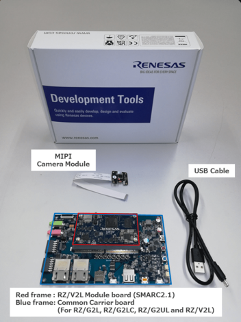
            

          

          

            

              Following items are included in the RZ/V2L EVK.
               
               
              <table class="gstable">
                <tr>
                  <th>Equipment</th>
                  <th>Details</th>
                </tr>
                <tr>
                  <td>RZ/V2L Evaluation Board</td>
                  <td>Evaluation board itself.</td>
                </tr>
                <tr>
                  <td>MIPI Camera Module</td>
                  <td>Google Coral Camera. 
                  <h6 class="mb-1">Note that the CMOS sensor (OV5645) in the camera is <b>no longer available</b>, and should not be used for mass production.  Any software support provided is for evaluation purposes only.</h6></td>
                </tr>
                <tr>
                  <td>MicroUSB to Serial Cable</td>
                  <td>For serial communication between PC and the board.</td>
                </tr>
              </table>
            

          

        

      

      

        <h4 class="u_line" >RZ/V2H EVK</h4>
        

          

            

              The RZ/V2H EVK is the ideal board kit for RZ/V2H evaluation. 
                
              MIPI camera module is not included in EVK.
               
              As an input device, AI Applications support USB camera with VGA (640x480) resolution.
               
              To use MIPI camera, please refer to e-CAM22_CURZH camera provided by <a href="https://www.e-consystems.com/renesas/sony-starvis-imx462-ultra-low-light-camera-for-renesas-rz-v2h.asp" target="_blank" rel="noopener noreferrer">e-con Systems</a>. 
               
              e-CAM22_CURZH camera supports FHD (1920x1080) resolution.
                
            

            

              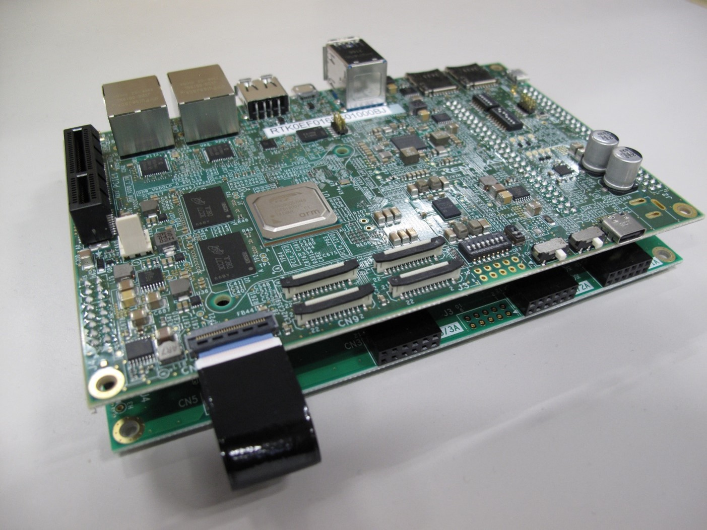
            

          

          

            

              Following items are included in the RZ/V2H EVK.
               
               
              <table class="gstable">
                <tr>
                  <th>Equipment</th>
                  <th>Details</th>
                </tr>
                <tr>
                  <td>RZ/V2H Evaluation Board</td>
                  <td>Evaluation board itself.</td>
                </tr>
              </table>
            

          

        

      

      

        

          <h6 class="mb-2" style="color: #2a289d;"><b>Click the board name.</b></h6>
          <a class="btn_board 
              btn_V2N_EVK
              btn_board-Active" 
              data-id="V2N_EVK">
              RZ/V2N EVK
          </a>
          <a class="btn_board 
              btn_V2N_FPB" 
              data-id="V2N_FPB">
              FPB-RZV2N
          </a>
        

        

          <h4 class="u_line" >RZ/V2N EVK</h4>
          

            

              

                The RZ/V2N EVK is the ideal board kit for RZ/V2N evaluation. 
                  
                MIPI camera module is not included in EVK.
                 
                As an input device, AI Applications support USB camera with VGA (640x480) resolution.
                 
                To use MIPI camera, please refer to e-CAM22_CURZH camera provided by <a href="https://www.e-consystems.com/renesas/sony-starvis-imx462-ultra-low-light-camera-for-renesas-rz-v2h.asp" target="_blank" rel="noopener noreferrer">e-con Systems</a>. 
                 
                e-CAM22_CURZH camera supports FHD (1920x1080) resolution.
                  
                Following items are included in the RZ/V2N EVK.
                 
                 
                <table class="gstable">
                  <tr>
                    <th>Equipment</th>
                    <th>RZ/V2N Evaluation Board (CPU board) Model Number</th>
                    <th>Details</th>
                  </tr>
                  <tr>
                    <td>RZ/V2N Evaluation Board V1.0</td>
                    <td>RTK0EF0186C02000BJ</td>
                    <td>Evaluation board itself.</td>
                  </tr>
                  <tr>
                    <td>RZ/V2N Evaluation Board V2.0</td> 
                    <td>RTK0EF0186C02001BJ</td>
                    <td>Evaluation board itself.</td>
                  </tr>
                </table>
                To check the version of the RZ/V2N EVK, check the model number of the RZ/V2N Evaluation Board (CPU board). 
                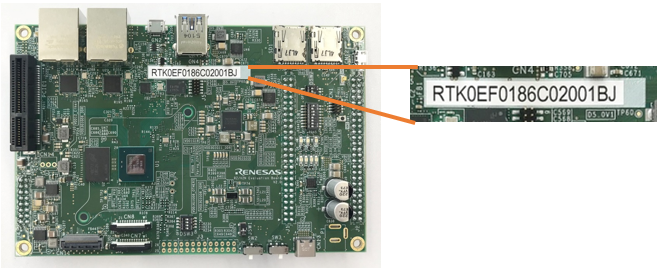
              

              

                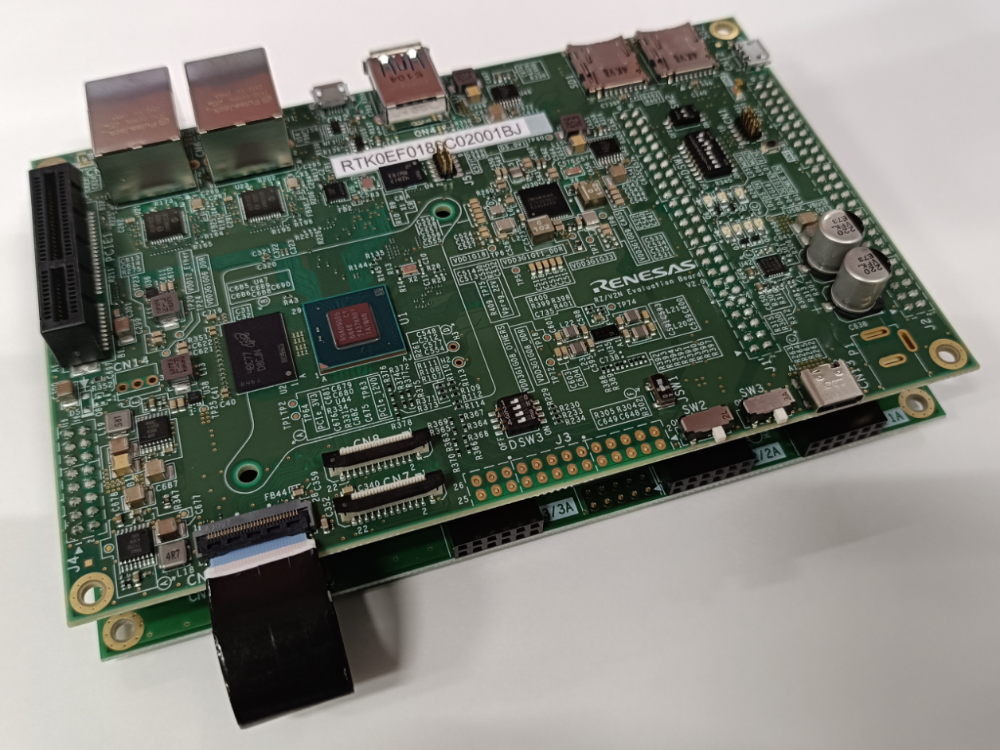
              

            

          

        

        

          <h4 class="u_line" >FPB-RZV2N</h4>
          

            

              

                The FPB-RZV2N is the ideal board kit for fast prototyping. 
                 
                This board is simple evaluation board that significantly reduces the man-hours required for AI development, allowing easy evaluation.
                  
                It can be used in the same way as the RZ/V2N EVK, except for cases that depend on hardware differences. 
                E.g., Only 1 MIPI camera connector is available on FPB-RZV2N.
                  
                As well as EVK, MIPI camera module is not included in FPB.
                 
                As an input device, AI Applications support USB camera with VGA (640x480) resolution.
                 
                To use MIPI camera, please refer to e-CAM22_CURZH camera provided by <a href="https://www.e-consystems.com/renesas/sony-starvis-imx462-ultra-low-light-camera-for-renesas-rz-v2h.asp" target="_blank" rel="noopener noreferrer">e-con Systems</a>. 
                 
                e-CAM22_CURZH camera supports FHD (1920x1080) resolution.
                  
                Following items are included in the FPB-RZV2N.
                 
                 
                <table class="gstable">
                  <tr>
                    <th>Equipment</th>
                    <th>Details</th>
                  </tr>
                  <tr>
                    <td>RZ/V2N Fast Prototyping Board</td>
                    <td>Evaluation board itself.</td>
                  </tr>
                </table>
              

              

                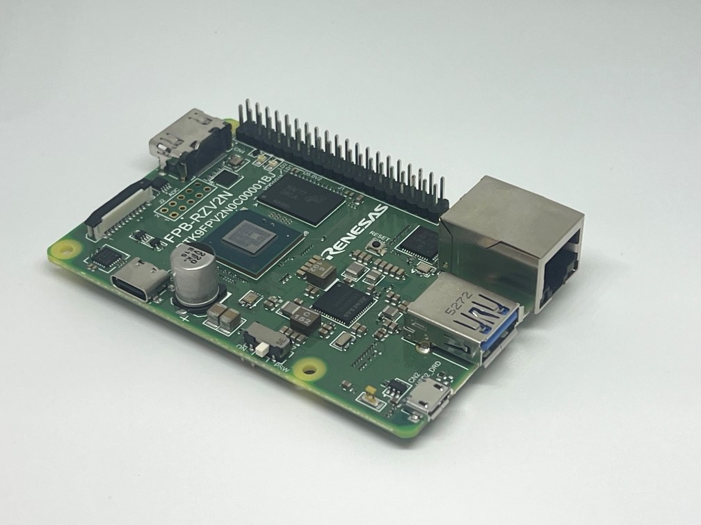
              

            

          

        

      

    

  

 

<h3 id="step2" >Step 2: Obtain necessary environment</h3>
<h4 class="mt-5 u_line">1. Necessary Equipments</h4>
  Please prepare the following equipments for your board. 
  

    <a class="btn_prod 
        btn_V2L
        btn_prod-Active" 
        data-id="V2L">
        RZ/V2L
    </a>
    <a class="btn_prod 
        btn_V2H" 
        data-id="V2H">
        RZ/V2H
    </a>
    <a class="btn_prod 
        btn_V2N" 
        data-id="V2N">
        RZ/V2N
    </a>
  

  <table class="gstable">
    <tr>
      <th>For</th>
      <th>Equipment</th>
      <th>Details</th>
    </tr>
    <tr class="row_V2L">
      <td rowspan="5">
        RZ/V2L
      </td>
      <td>
        RZ/V2L EVK
      </td>
      <td>
        Evaluation Board Kit for RZ/V2L. Includes followings.
        <ul class="mb-1">
          <li>
            MIPI Camera Module(Google Coral Camera)
             
            <h6 class="mb-1">
              Note that the CMOS sensor (OV5645) in the camera is no longer available, and should not be used for mass production. 
              Any software support provided is for evaluation purposes only.
            </h6>
          </li>
          <li>MicroUSB to Serial Cable for serial communication.</li>
        </ul>
      </td>
    </tr>
    <tr class="row_V2L">
      <td>
        AC Adapter
      </td>
      <td>
        USB Power Delivery adapter for the board power supply.
      </td>
    </tr>
    <tr class="row_V2L">
      <td>
        MicroHDMI Cable
      </td>
      <td>
        Used to connect the HDMI Monitor and the board. 
        RZ/V2L EVK has microHDMI port.
      </td>
    </tr>
    <tr class="row_V2L">
      <td>
        USB Camera
      </td>
      <td>
        <b>Optional.</b> AI Applications support USB camera input. 
        Supported resolution: 640x480 
        Supported format: 'YUYV' (YUYV 4:2:2)
      </td>
    </tr>
    <tr class="row_V2L">
      <td>
        Windows PC
      </td>
      <td>
        <b>Optional.</b> Used as the serial communication console for QSPI Bootloader. 
        Operating Environment : Windows 11
      </td>
    </tr>
    <tr class="row_V2H">
      <td rowspan="4">
        RZ/V2H
      </td>
      <td>
        RZ/V2H EVK
      </td>
      <td>
        Evaluation Board Kit for RZ/V2H.
      </td>
    </tr>
    <tr class="row_V2H">
      <td>
        AC Adapter
      </td>
      <td>
        USB Power Delivery adapter for the board power supply. 
        100W is required.
      </td>
    </tr>
    <tr class="row_V2H">
      <td>
        HDMI Cable
      </td>
      <td>
        Used to connect the HDMI Monitor and the board. 
        RZ/V2H EVK has HDMI port.
      </td>
    </tr>
    <tr class="row_V2H">
      <td>
        USB Camera
      </td>
      <td>
        Since RZ/V2H EVK does not include camera module, this will be the standard camera input source. 
        Supported resolution: 640x480 
        Supported format: 'YUYV' (YUYV 4:2:2) 
        <h6 class="mt-3 mb-1">
          To use MIPI camera, please refer to e-CAM22_CURZH provided by <a href="https://www.e-consystems.com/renesas/sony-starvis-imx462-ultra-low-light-camera-for-renesas-rz-v2h.asp" target="_blank" rel="noopener noreferrer">e-con Systems</a>. 
          e-CAM22_CURZH camera supports FHD(1920x1080) resolution.
        </h6>
      </td>
    </tr>
    <tr class="row_V2N">
      <td rowspan="4">
        RZ/V2N
      </td>
      <td>
        RZ/V2N EVK 
        or FPB-RZV2N
      </td>
      <td>
        Evaluation Board Kit for RZ/V2N.
      </td>
    </tr>
    <tr class="row_V2N">
      <td>
        AC Adapter
      </td>
      <td>
        USB Power Delivery adapter for the board power supply. 
        60W is required for EVK. 
        45W is required for FPB.
      </td>
    </tr>
    <tr class="row_V2N">
      <td>
        HDMI Cable
      </td>
      <td>
        Used to connect the HDMI Monitor and the board. 
        RZ/V2N EVK/FPB has HDMI port.
      </td>
    </tr>
    <tr class="row_V2N">
      <td>
        USB Camera
      </td>
      <td>
        Since RZ/V2N EVK/FPB does not include camera module, this will be the standard camera input source. 
        Supported resolution: 640x480 
        Supported format: 'YUYV' (YUYV 4:2:2) 
        <h6 class="mt-3 mb-1">
          To use MIPI camera, please refer to e-CAM22_CURZH provided by <a href="https://www.e-consystems.com/renesas/sony-starvis-imx462-ultra-low-light-camera-for-renesas-rz-v2h.asp" target="_blank" rel="noopener noreferrer">e-con Systems</a>. 
          e-CAM22_CURZH camera supports FHD(1920x1080) resolution.
        </h6>
      </td>
    </tr>
    <tr>
      <td rowspan="8">
        Common
      </td>
      <td>
        USB Cable Type-C
      </td>
      <td>
        Connect AC adapter and the board.
      </td>
    </tr>
    <tr>
      <td>
        HDMI Monitor
      </td>
      <td>
        Used to display the graphics of the board.
      </td>
    </tr>
    <tr>
      <td>
        microSD card
      </td>
      <td>
        Must have over 16GB capacity of blank space. 
        Operating Environment: Transcend UHS-I microSD 300S 16GB
      </td>
    </tr>
    <tr>
      <td>
        Linux PC
      </td>
      <td>
        Used for Setup microSD card and RZ/V AI SDK Setup. 
        Operating Environment: Ubuntu 22.04
      </td>
    </tr>
    <tr>
      <td>
        SD card reader
      </td>
      <td>
        Used for setting up microSD card.
      </td>
    </tr>
    <tr>
      <td>
        USB Hub
      </td>
      <td>
        Used to connect USB Keyboard and USB Mouse to the board.
      </td>
    </tr>
    <tr>
      <td>
        USB Keyboard
      </td>
      <td>
        Used to type strings on the terminal of board.
      </td>
    </tr>
    <tr>
      <td>
        USB Mouse
      </td>
      <td>
        Used to operate the mouse on the screen of board.
      </td>
    </tr>
  </table>

  Note
  USB camera has different supported resolution and format. 
  To check the specification of your USB camera, use <a href="https://www.mankier.com/1/v4l2-ctl" target="_blank" rel="noopener noreferrer"><code>v4l2-ctl</code></a> command.

 
<h4 class="u_line">2. Necessary Software</h4>

Please install following software <b>on Linux PC</b>.

<ul class="mt-1 mb-1">
  <li><a href="https://docs.docker.com/" target="_blank" rel="noopener noreferrer">Docker</a></li>  <!-- Open in new tab -->
  <li>git</li>
  <li>bmap-tools</li>
</ul>
 

<h3 id="step3" >Step 3: Obtain RZ/V AI SDK</h3>
RZ/V AI SDK provides following packages for each supported board.

  <a class="btn_prod 
      btn_V2L
      btn_prod-Active" 
      data-id="V2L">
      RZ/V2L
  </a>
  <a class="
      btn_prod 
      btn_V2H" 
      data-id="V2H">
      RZ/V2H
  </a>
  <a class="
      btn_prod 
      btn_V2N" 
      data-id="V2N">
      RZ/V2N
  </a>

<table class="gstable">
  <tr>
    <th>Name</th>
    <th>Package</th>
    <th>Details</th>
  </tr>
  <tr>
    <td><b>
      <!-- RZ/V AI SDK -->
      
        RZ/V2L AI SDK
      
      
        RZ/V2H AI SDK
      
      
        RZ/V2N AI SDK
      
    </b></td>
    <td><b>RTK0EF0*SJ.zip</b></td>
    <td><b>Package used for AI development.</b> 
      For this Getting Started, please download 
      <b>
        
          RZ/V2L AI SDK
        
        
          RZ/V2H AI SDK
        
        
          RZ/V2N AI SDK
        
      </b> 
      <!-- for your preferred device  -->
      from the link below. 
      

        <a class="btn btn-secondary square-button ms-3 mt-1" style="text-align:left;" href="https://www.renesas.com/document/sws/rzv2l-ai-sdk-v700" role="button" target="_blank" rel="noopener noreferrer">
            RZ/V2L AI SDK
            Get the RZ/V2L AI Software Development Kit
        </a>
      

      <!--   -->
      

      <a class="btn btn-secondary square-button ms-3 mt-1" style="text-align:left;" href="https://www.renesas.com/document/sws/rzv2h-ai-sdk-v600" role="button" target="_blank" rel="noopener noreferrer">
          RZ/V2H AI SDK
          Get the RZ/V2H AI Software Development Kit
      </a>
      

      <!--   -->
      

      <a class="btn btn-secondary square-button ms-3 mt-1" style="text-align:left;" href="https://www.renesas.com/document/sws/rzv2n-ai-sdk-v630" role="button" target="_blank" rel="noopener noreferrer">
          RZ/V2N AI SDK
          Get the RZ/V2N AI Software Development Kit
      </a>    
      

       
      Once downloaded, please check the Release Note included in the package.
           
    </td>
  </tr>
  <tr>
    <td>
      <!-- RZ/V AI SDK -->
      
        RZ/V2L AI SDK
      
      
        RZ/V2H AI SDK
      
      
        RZ/V2N AI SDK
      
       Source Code
    </td>
    <td>RTK0EF0*SJ_linux-src.zip</td>
    <td>Package used for Linux development. 
      Please refer to following pages for more details on this package. 
      

        <a class="btn btn-secondary square-button-gray ms-3 mt-1" style="text-align:left;" href="{{ site.url }}{{ site.baseurl }}" role="button">
          How to Build RZ/V2L AI SDK
          
          How can I build RZ/V2L AI SDK Source Code? 
          
        </a>
      

      

        <a class="btn btn-secondary square-button-gray ms-3 mt-1" style="text-align:left;" href="{{ site.url }}{{ site.baseurl }}" role="button">
          How to Build RZ/V2H AI SDK
          
          How can I build RZ/V2H AI SDK Source Code? 
          
        </a>
      

      

        <a class="btn btn-secondary square-button-gray ms-3 mt-1" style="text-align:left;" href="{{ site.url }}{{ site.baseurl }}" role="button">
          How to Build RZ/V2N AI SDK
          
          How can I build RZ/V2N AI SDK Source Code? 
          
        </a>
      

    </td>
  </tr>
</table>
<h3 id="step4" >Step 4: Extract RZ/V AI SDK package</h3>
This step explains how to extract the RZ/V AI SDK zip file.
<ol>
  <li>On your Linux PC, make the working directory.

mkdir -p ai_sdk_work

  </li>
  <li>Register the working directory path to an environment variable. 

export WORK=<path to the working directory>/ai_sdk_work

  </li>
  <li>Move to the working directory.

cd ${WORK}

  </li>
  <li>Extract RZ/V AI SDK zip file under the working directory. 

unzip <Path to the file>/RTK0EF0*.zip -d ${WORK}

  </li>
  <li>Check the working directory to confirm the package contents.

ls ${WORK}/

    <ul>
      <li>If the above command prints followings, the package is extracted correctly.

ai_sdk_setup  board_setup  documents  references r11an0*.pdf

      </li>
    </ul>
  </li>
</ol>
 

<h3 id="step5" >Step 5: Setup RZ/V AI SDK</h3>
This step explains how to setup the RZ/V AI SDK environment.

  Note
  Make sure that you have <a href="https://docs.docker.com/" target="_blank" rel="noopener noreferrer">installed Docker</a> on your Linux PC.

  <a class="btn_prod 
      btn_V2L
      btn_prod-Active" 
      data-id="V2L">
      RZ/V2L
  </a>
  <a class="
      btn_prod 
      btn_V2H" 
      data-id="V2H">
      RZ/V2H
  </a>
  <a class="
      btn_prod 
      btn_V2N" 
      data-id="V2N">
      RZ/V2N
  </a>

<ol>
  <li>On your Linux PC, move to the working directory.

cd ${WORK}/ai_sdk_setup

  </li>
  <li>Build docker image. 
    


sudo docker build -t rzv2l_ai_sdk_image --build-arg PRODUCT="V2L" .

    

    


sudo docker build -t rzv2h_ai_sdk_image --build-arg PRODUCT="V2H" .

    

    


sudo docker build -t rzv2n_ai_sdk_image --build-arg PRODUCT="V2N" .

      <!-- 

        Note
        Since RZ/V2N is a brother chip of RZ/V2H, the same commands can be used.
      
 -->
    

  </li>
  <li>Create new directory to be mounted on Docker container.

mkdir ${WORK}/ai_sdk_setup/data

  </li>
  <li>Create docker container.  Here, <code>rzv2*_ai_sdk_container</code> is a name of docker container, which can be changed by user.
    


sudo docker run -it --name rzv2l_ai_sdk_container -v $(pwd)/data:/drp-ai_tvm/data rzv2l_ai_sdk_image

    

    


sudo docker run -it --name rzv2h_ai_sdk_container -v $(pwd)/data:/drp-ai_tvm/data rzv2h_ai_sdk_image

    

    


sudo docker run -it --name rzv2n_ai_sdk_container -v $(pwd)/data:/drp-ai_tvm/data rzv2n_ai_sdk_image

      <!-- 

        Note
        Since RZ/V2N is a brother chip of RZ/V2H, the same commands can be used.
      
 -->
    

    The local <code>$(pwd)/data</code> is mounted to <code>/drp-ai_tvm/data</code> on the Docker container by the above command option. 
    For example, you can use this directory to copy files created on the Docker container to your local environment.  
    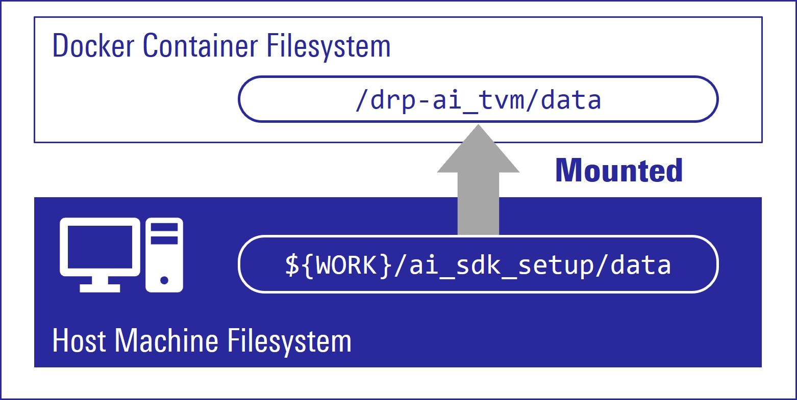
  </li> 
<!--
  <li>In docker container, run the following command to copy <code>libtvm_runtime.so</code>, which is the necessary file for the board, to host machine. 

cp /drp-ai_tvm/obj/build_runtime/${PRODUCT}/libtvm_runtime.so /drp-ai_tvm/data

  </li>
-->
  <li>To exit docker, run following commands. 

exit

  </li>
  <li>To start the docker container again, run the following command. 
    


sudo docker start -i rzv2l_ai_sdk_container

    

    


sudo docker start -i rzv2h_ai_sdk_container

    

    


sudo docker start -i rzv2n_ai_sdk_container

    

  </li>
</ol>
 
You have finished the RZ/V AI SDK environment setup. 
You are ready to build the AI applications!
  

<h3 id="step6" >Step 6: Build RZ/V AI Application</h3>
This step explains how to build AI application.
 
To see the overview about AI Applications, please refer to <a href="{{ site.url }}{{ site.baseurl }}" target="_blank" rel="noopener noreferrer">About AI Applications</a> page. 
<a class="btn btn-secondary square-button ms-3 mt-1" style="text-align:left;" href="{{ site.url }}{{ site.baseurl }}" role="button" target="_blank" rel="noopener noreferrer">
    About AI Applications 
    
    What is AI Applications? 
    How is directory/file structured? 
    How can I download the previous version? 
</a>
 
 

  Note
  Following procedures are for users who would like to build the application from the source code. 
  If you would like to run the application <b>as quickly as possible</b>, you can skip this step and use pre-build application binary. 
  Please clone the application respository of your selection and proceed to the <b><a href="#step7">next step (Step 7: Deploy AI Application)</a></b>. 
  E.g., <b>
    <a 
      href="https://github.com/renesas-rz/rzv_ai_sdk/tree/v7.10/R01_object_detection" 
      target="_blank" 
      rel="noopener noreferrer">R01_object_detection</a>
  </b>, 

git clone https://github.com/renesas-rz/rzv_ai_sdk.git


 
<h4 id="build-instruction" class="u_line">Building instructions.</h4>
In <a href="{{ site.url }}{{ site.baseurl }}" target="_blank" rel="noopener noreferrer">AI Applications</a>, there are two types of applications.
  <table class="gstable ms-3">
    <tr>
        <th>Application</th>
        <th>GitHub Repository</th>
        <th>Details</th>
        <th>Example</th>
    </tr>
    <tr>
        <td><Application 1></td>
        <td>
          <h6 class="mb-0 table-small-text">
            <ul class="mb-1 ps-3">
              <li>
                <a href="https://github.com/renesas-rz/rzv_ai_sdk" target="_blank" rel="noopener noreferrer">https://github.com/renesas-rz/rzv_ai_sdk</a> 
              </li>
              <li>
                <a href="https://github.com/Ignitarium-Renesas/rzv_ai_apps" target="_blank" rel="noopener noreferrer">https://github.com/Ignitarium-Renesas/rzv_ai_apps</a>
              </li>
            </ul>
          </h6>
        </td>
        <td>
          <h6 class="mb-0 table-small-text">
            These repositories provide the complete instruction in each application documentation.
          </h6>
        </td>
        <td>
          <h6 class="mb-0">
            <a href="https://github.com/renesas-rz/rzv_ai_sdk/tree/v7.10/R01_object_detection" target="_blank" rel="noopener noreferrer">R01_object_detection</a>
          </h6>
        </td>
    </tr>
    <tr>
        <td><Application 2></td>
        <td>
          <h6 class="mb-0 table-small-text">
            <ul class="mb-1 ps-3">
              <li>
                <a href="https://github.com/Ignitarium-Renesas/RZV2L_AiLibrary" target="_blank" rel="noopener noreferrer">https://github.com/Ignitarium-Renesas/RZV2L_AiLibrary</a>
              </li>
            </ul>
          </h6>
        </td>
        <td>
          <h6 class="mb-0 table-small-text">
            This repository only contains AI Applications for RZ/V2L EVK. 
            It does not provide instructions for RZ/V AI SDK. 
            Please refer to the instruction provided in this page.
          </h6>
        </td>
        <td>
          <h6 class="mb-0">
            <a href="https://github.com/Ignitarium-Renesas/RZV2L_AiLibrary/tree/main/01_Head_count" target="_blank" rel="noopener noreferrer">01_Head_count</a>
          </h6>
        </td>
    </tr>
  </table>
<ul style="list-style:none;">
  <li>
    <h5 id="build-option1" class="mb-3">Option 1: For <b>&lt;Application 1&gt;</b></h5>
    <ol>
      <li>
        Check the <code>README.md</code> document provided in application directory and follow the instruction in the chapter called <b>"Application: Build Stage"</b> (or similar) to build the application.  
        

          <u><b>Example:</b></u> 
          For R01_object_detection application, follow the instruction in <a href="https://github.com/renesas-rz/rzv_ai_sdk/tree/v7.10/R01_object_detection#application-build-stage" target="_blank" rel="noopener noreferrer">README > Application: Build Stage</a> to generate the following application binary.
          <ul>
            <li>object_detection</li>
          </ul>
        

          <!-- From here: Delete when making latest version -->
          <!--
        

          Note
          The <code>git clone</code> command shown in the <code>README.md</code> will download the <b style="color: red;">latest</b> source code and related files.   
          To download the files of AI Applications v{{ site.version }}, please specify the version tag by adding <code>-b v{{ site.version }}</code>  when you running the <code>git clone</code> command as shown below.

git clone -b v{{ site.version }} https://github.com/renesas-rz/rzv_ai_sdk.git

        

          -->
          <!-- Until here: Delete when making latest version -->
      </li>
    </ol>
     
    After you generated the application binary, please proceed to <a href="#step7">Step 7</a>
  </li>
    
  <li>
  

    
<h5 id="build-option2" style="display: inline;" class="mb-3">Option 2: For <b>&lt;Application 2&gt;</b></h5> &nbsp;&nbsp;
    <b><i>Click to Open</i></b>
    

    <ol class="border pt-2 pb-2">
      <li>Run (or start) docker container.  
        

          <u><b>Example:</b></u> 
          Run the following command to start the docker container created in <a href="#step5">Step 5</a>.

sudo docker start -i rzv2l_ai_sdk_container

        

      </li> 
      <li>Change the environment variable to use the cross compiler.

source /opt/rz-vlp/5.0.11/environment-setup-cortexa55-poky-linux

        

          Note
          This command needs to be called everytime user opened the new terminal.
        

      </li> 
      <li>Move to the mounted point in docker container.
         

cd /drp-ai_tvm/data

      </li> 
      <li>Download the application source code. 
        Here, we use <a href="https://github.com/Ignitarium-Renesas/RZV2L_AiLibrary/tree/main/01_Head_count" target="_blank" rel="noopener noreferrer">RZV2L_AiLibrary repository 01_Head_count application</a> as an example.
         

git clone https://github.com/Ignitarium-Renesas/RZV2L_AiLibrary

        <!-- From here: Delete when making latest version -->
        <!-- 

          Note
          The command above will download the <b style="color: red;">latest</b> source code and related files.   
          To download the files of AI Applications v{{ site.version }}, please specify the version tag by adding <code>-b v{{ site.version }}</code> when you running the <code>git clone</code> command as shown below.

git clone -b v{{ site.version }} https://github.com/Ignitarium-Renesas/RZV2L_AiLibrary

        
 -->
        <!-- Until here: Delete when making latest version -->
      </li> 
      <li>Move to the application directory.

cd RZV2L_AiLibrary/01_Head_count/Head_count_cam

        

          Note
          The file configuration depends on each application. Please check the file configuration in the repository carefully.
        

      </li> 
      <li>Build the application with <code>make</code> command.
         

make

      </li> 
      <li>Check that following application is generated in the <code>RZV2L_AiLibrary/01_Head_count/ Head_count_cam/exe</code>.
        <ul>
          <li>head_count_cam_app</li>
        </ul>
      </li> 
      <li>If you would like to build the other applications of <a href="#build-option1"><Application 1> (Option 1)</a>, please exit and restart the docker container.
      </li>
    </ol>
     
    After you generated the application binary, please proceed to <a href="#step7">Step 7</a>
  

  </li>
</ul>
  

<h3 id="step7" >Step 7: Deploy AI Application</h3>

  

    

      This section explains how to deploy the AI Application to the target board.
       
       
      

        <a class="btn_prod 
            btn_V2L
            btn_prod-Active" 
            data-id="V2L">
            RZ/V2L
        </a>
        <a class="
            btn_prod 
            btn_V2H" 
            data-id="V2H">
            RZ/V2H
        </a>
        <a class="
            btn_prod 
            btn_V2N" 
            data-id="V2N">
            RZ/V2N
        </a>
      

      To boot the board, bootloader and other Linux necessary files are required. 
      Following bootloader types and their corresponding filesystem are available on 
      
        RZ/V2L AI SDK
      
      
        RZ/V2H AI SDK
      
      
        RZ/V2N AI SDK
      .
      

        <table class="gstable">
          <tr>
            <th>Type</th>
            <th>Description</th>
            <th>RZ/V2L EVK</th>
          </tr>
          <tr>
            <td>eSD Bootloader</td>
            <td>The board boots up using the bootloader written on microSD card. 
            Linux kernel and filesystem are also on microSD card.</td>
            <td>&#10004;</td>
          </tr>
          <tr>
            <td>QSPI Bootloader</td>
            <td>The board boots up using the bootloader written in Flash ROM on the board. 
            Linux kernel and filesystem are on microSD card.</td>
            <td>&#10004;</td>
          </tr>
        </table>
      

      

        <table class="gstable">
          <tr>
            <th>Type</th>
            <th>Description</th>
            <th>RZ/V2H EVK</th>
          </tr>
          <tr>
            <td>eSD Bootloader</td>
            <td>The board boots up using the bootloader written on microSD card. 
            Linux kernel and filesystem are also on microSD card.</td>
            <td>&#10004;</td>
          </tr>
          <tr>
            <td>xSPI Bootloader</td>
            <td>The board boots up using the bootloader written in Flash ROM on the board. 
            Linux kernel and filesystem are on microSD card.</td>
            <td>&#10004;</td>
          </tr>
        </table>
      

      

        <table class="gstable">
          <tr>
            <th>Type</th>
            <th>Description</th>
            <th>RZ/V2N EVK-ver1</th>
            <th>RZ/V2N EVK-ver2</th>
            <th>FPB-RZV2N</th>
          </tr>
          <tr>
            <td>eSD Bootloader</td>
            <td>The board boots up using the bootloader written on microSD card. 
            Linux kernel and filesystem are also on microSD card.</td>
            <td>&#10004;</td>
            <td>&#10004;</td>
            <td>&#10004;</td>
          </tr>
          <tr>
            <td>xSPI Bootloader</td>
            <td>The board boots up using the bootloader written in Flash ROM on the board. 
            Linux kernel and filesystem are on microSD card.</td>
            <td>&#10004;</td>
            <td>&#10004;</td>
            <td>-</td>
          </tr>
          <tr>
            <td>eMMC Bootloader</td>
            <td>The board boots up using the bootloader written in eMMC on the board. 
            Linux kernel and filesystem are on microSD card.</td>
            <td>
              &#10004;
              (
              <a href="{{ site.url }}{{ site.baseurl }}#D4" target="_blank" rel="noopener noreferrer">
                Link
              </a>
              )
              </td>
            <td>
              &#10004;
              (
              <a href="{{ site.url }}{{ site.baseurl }}#D4" target="_blank" rel="noopener noreferrer">
                Link
              </a>
              )
              </td>
            <td>-</td>
          </tr>
        </table>
      

      <!-- Other necessary files, i.e. Linux kernel and root filesystem, are stored on microSD card. 
      You can use Linux PC to format the microSD card and expand the kernel and the root filesystem using SD card reader.  -->
       
      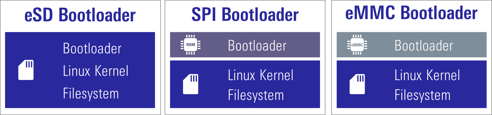
       
      

        Note
        Regarding the eSD (Embedded SD) booting, please note the following:
        <ul class="mb-1">
          <li>The eSD boot procedure using microSD card described in this guide is for evaluation purposes only.</li>
          <li>If you use the eSD boot, please implement the eSD on your board according to the standard "SD Specification Part 1 eSD Addendum (version 2.10)".</li>
          

          <li>The reboot command cannot be used when using the eSD boot procedure using microSD card described in this guide.</li>
          

          

          <li>The reboot command cannot be used when using the eSD boot procedure using microSD card described in this guide.</li>
          

        </ul>
      

       
      <h4 id="step7prep" class="u_line" >Preparation</h4>
      

        Click the button
        This step contains both eSD and 
        
        QSPI Bootloader 
         
        
        xSPI Bootloader 
         
        
        xSPI Bootloader 
         
        explanation. 
        Please click the button below to update the explanation according to your bootloader interface. 
        

          eSD Bootloader
          
            
            QSPI Bootloader 
             
            
            xSPI Bootloader 
             
            
            xSPI Bootloader 
             
          
        

        

          For eSD
          eSD explanation will be shown in this style if you click "eSD Bootloader" button above.
        

        

          For 
            
            QSPI 
             
            
            xSPI 
             
            
            xSPI 
             
          
          
            QSPI 
           
          
            xSPI 
           
          
            xSPI 
           
          explanation will be shown in this style if you click 
          
            "QSPI 
           
          
            "xSPI 
           
          
            "xSPI 
           
           Bootloader" button above.
        

      

       
      <h4 id="step7-1" class="u_line">1. Setup the Board</h4>
      

        <a class="btn_prod 
            btn_V2L
            btn_prod-Active" 
            data-id="V2L">
            RZ/V2L
        </a>
        <a class="
            btn_prod 
            btn_V2H" 
            data-id="V2H">
            RZ/V2H
        </a>
        <a class="
            btn_prod 
            btn_V2N" 
            data-id="V2N">
            RZ/V2N
        </a>
      

      

        

          For eSD
          microSD card needs to contain bootloaders, the Linux kernel and root filesystem to boot-up the board. 
          
            RZ/V2L AI SDK
          
          
            RZ/V2H AI SDK
          
          
            RZ/V2N AI SDK
          
          supports the WIC format for SD card image. 
          You can use Linux PC to write the SD card image into microSD card with SD card reader. 
        

        

          Note
          This step is required only when starting the AI SDK or when using the new version of AI SDK. 
          If you have already setup the microSD card with the latest bootloader, Linux kernel, Linux device tree file and root filesystem, skip this step and proceed to <a href="#step7-2" target="_blank" rel="noopener noreferrer">the next procedure (2. Deploy Application to the Board)</a>.
        

      

      

        

          For xSPI
          microSD card needs to contain the Linux kernel and root filesystem to boot-up the board. 
          
            RZ/V2L AI SDK
          
          
            RZ/V2H AI SDK
          
          
            RZ/V2N AI SDK
          
          supports the WIC format for SD card image. 
          You can use Linux PC to write the SD card image into microSD card with SD card reader. 
          Bootloaders must be written in Flash ROM on the board.
          You can use Windows PC to write the bootloaders on Flash ROM.
        

        

          Note
          This step is required only when starting the AI SDK or when using the new version of AI SDK. 
          If you have already setup the microSD card and the bootloader written in Flash ROM on the board, skip this step and proceed to <a href="#step7-2" target="_blank" rel="noopener noreferrer">the next procedure (2. Deploy Application to the Board)</a>. 
        

      

      

        Note
        The size of WIC format SD card image is 16GB. 
        If you would like to expand the SD card image size, 
        
          please build the RZ/V2L AI SDK Source Code according to <a href="{{ site.url }}{{ site.baseurl }}" target="_blank" rel="noopener noreferrer">How to Build RZ/V2L AI SDK</a>.
        
        
          please build the RZ/V2H AI SDK Source Code according to <a href="{{ site.url }}{{ site.baseurl }}" target="_blank" rel="noopener noreferrer">How to Build RZ/V2H AI SDK</a>.
        
        
          please build the RZ/V2N AI SDK Source Code according to <a href="{{ site.url }}{{ site.baseurl }}" target="_blank" rel="noopener noreferrer">How to Build RZ/V2N AI SDK</a>.
        
      

      <ol>
        <h5 id="step7-1a">
          <li type="A">Install Necessary Software </li>
        </h5>
        As explained in <a href="{{ site.url }}{{ site.baseurl }}#step2" target="_blank" rel="noopener noreferrer">Necessary Software of Getting Started Step 2</a>, make sure that <code>bmap-tools</code> is installed on Linux PC. 
        If you have not installed the <code>bmap-tools</code>, install it using following command on Host PC (Not in the docker container). 

sudo apt install bmap-tools

         
        <h5 id="step7-1b">
          <li type="A">Write the Linux files to SD card</li>
        </h5>
        

          For eSD
          Run the below command to decompress <code>${WORK}/board_setup/eSD.zip</code>. 

cd ${WORK}/board_setup
unzip eSD.zip

        Following files are necessary. 
        They are in the <code>${WORK}/board_setup/eSD</code> directory.
        

        

          

            For QSPI
            Run the below command to decompress <code>${WORK}/board_setup/QSPI.zip</code>. 

cd ${WORK}/board_setup
unzip QSPI.zip

             
            Following files are necessary. 
            They are in the <code>${WORK}/board_setup/QSPI</code> directory.
          

          <table class="gstable mb-0">
            <tr>
              <th>File</th>
              <th>Description</th>
            </tr>
            <tr>
              <td>core-image-weston-smarc-rzv2l.rootfs.wic.bmap</td>
              <td rowspan="2">SD card image</td>
            </tr>
            <tr>
              <td>core-image-weston-smarc-rzv2l.rootfs.wic.gz</td>
            </tr>
          </table>
        

        

          

            For xSPI
            Run the below command to decompress <code>${WORK}/board_setup/xSPI.zip</code>. 

cd ${WORK}/board_setup
unzip xSPI.zip

             
            Following files are necessary. 
            They are in the <code>${WORK}/board_setup/xSPI</code> directory.
          

          <table class="gstable mb-0">
            <tr>
              <th>File</th>
              <th>Description</th>
            </tr>
            <tr>
              <td>core-image-weston-rzv2h-evk.rootfs.wic.bmap</td>
              <td rowspan="2">SD card image</td>
            </tr>
            <tr>
              <td>core-image-weston-rzv2h-evk.rootfs.wic.gz</td>
            </tr>
          </table>
        

        

          

            For xSPI
            Run the below command to decompress <code>${WORK}/board_setup/xSPI.zip</code>. 

cd ${WORK}/board_setup
unzip xSPI.zip

           
          Following files are necessary. 
          They are in the <code>${WORK}/board_setup/xSPI</code> directory.
          

          <table class="gstable mb-0">
            <tr>
              <th>File</th>
              <th>Description</th>
            </tr>
            <tr>
              <td>core-image-weston-rzv2n-evk.rootfs.wic.bmap</td>
              <td rowspan="2">SD card image</td>
            </tr>
            <tr>
              <td>core-image-weston-rzv2n-evk.rootfs.wic.gz</td>
            </tr>
          </table>
        

        <!-- 

          <table class="gstable mb-0">
            <tr>
              <th>File</th>
              <th>Description</th>
            </tr>
            <tr>
              <td>core-image-weston-smarc-rzv2l.rootfs.wic.bmap</td>
              <td rowspan="2">SD card image</td>
            </tr>
            <tr>
              <td>core-image-weston-smarc-rzv2l.rootfs.wic.gz</td>
            </tr>
          </table>
        

        

          <table class="gstable mb-0">
            <tr>
              <th>File</th>
              <th>Description</th>
            </tr>
            <tr>
              <td>core-image-weston-rzv2h-evk.rootfs.wic.bmap</td>
              <td rowspan="2">SD card image</td>
            </tr>
            <tr>
              <td>core-image-weston-rzv2h-evk.rootfs.wic.gz</td>
            </tr>
          </table>
        

        

          <table class="gstable mb-0">
            <tr>
              <th>File</th>
              <th>Description</th>
            </tr>
            <tr>
              <td>core-image-weston-rzv2n-evk.rootfs.wic.bmap</td>
              <td rowspan="2">SD card image</td>
            </tr>
            <tr>
              <td>core-image-weston-rzv2n-evk.rootfs.wic.gz</td>
            </tr>
          </table>
        
 -->
        Follow the instruction below to prepare the microSD card. 
        <ol>
          <li>Before inserting the microSD card to your Linux PC, open the terminal on Linux PC and run the following command to check the devices without microSD card. 

lsblk

            Following is the example output. 

NAME MAJ:MIN RM SIZE RO TYPE MOUNTPOINT
sda 8:0 0 30.9G 0 disk
├─sda1 8:1 0 512M 0 part /boot/efi
├─sda2 8:2 0 1K 0 part
└─sda5 8:5 0 30.3G 0 part /
sr0 11:0 1 1024M 0 rom

          </li> 
          <li>Insert the microSD card to your Linux PC and run the following command again. 

lsblk

          </li> 
          <li>Check the output and confirm the name appeared. This would be your microSD card device name. 
            <ul>
              <li>Following is the example output. 

NAME MAJ:MIN RM SIZE RO TYPE MOUNTPOINT
sda 8:0 0 30.9G 0 disk
├─sda1 8:1 0 512M 0 part /boot/efi
├─sda2 8:2 0 1K 0 part
└─sda5 8:5 0 30.3G 0 part /
sdb 8:16 1 29.7G 0 disk
└─sdb1 8:17 1 29.7G 0 part
sr0 11:0 1 1024M 0 rom

              </li> 
              <li>In this case, followings are your microSD card configuration.
                <ul>
                  <li><b><code>/dev/sdb</code></b>: The device name for the entire microSD card.
                  </li>
                  <li><b><code>/dev/sdb1</code></b>: The partition name in microSD card.  There may be multiple <code>sdb*</code> depending on the microSD card.
                  </li>
                </ul>
                

                  Warning
                  Be careful not to use the name of other device since it may destruct your computer filesystem.
                

              </li>
            </ul>
          </li> 
          <li>To use bmaptools, microSD card partitions must be unmounted. 
            Run the following command to check the automatically mounted microSD card partitions. 

df -h

          </li>
          <li>
            Check the output and find the mount point, which is "<code>/media/user/9016-4EF8</code>" in the following example.

Filesystem      Size  Used Avail Use% Mounted on
:
snip
:
/dev/sdb1        15G   32K   15G   1% /media/user/9016-4EF8

            

              Warning
              Here, we use "<b><code>/dev/sdb</code></b>" as microSD card device name.
            

          </li>
          <li>
            Unmount the automatically mounted partitions.

sudo umount /media/user/9016-4EF8

            

              Note
              If there are more than one partitions on microSD card, unmount all partitions.
            

          </li>
          <li>Run the following command to write SD card image. 
            

              

                For eSD

cd ${WORK}/board_setup/eSD
sudo bmaptool copy --bmap core-image-weston-smarc-rzv2l.rootfs.wic.bmap core-image-weston-smarc-rzv2l.rootfs.wic.gz /dev/sdb

              

              

                For xSPI

cd ${WORK}/board_setup/QSPI
sudo bmaptool copy --bmap core-image-weston-smarc-rzv2l.rootfs.wic.bmap core-image-weston-smarc-rzv2l.rootfs.wic.gz /dev/sdb

              

            

            

              

                For eSD

cd ${WORK}/board_setup/eSD
sudo bmaptool copy --bmap core-image-weston-rzv2h-evk.rootfs.wic.bmap core-image-weston-rzv2h-evk.rootfs.wic.gz /dev/sdb

              

              

                For xSPI

cd ${WORK}/board_setup/xSPI
sudo bmaptool copy --bmap core-image-weston-rzv2h-evk.rootfs.wic.bmap core-image-weston-rzv2h-evk.rootfs.wic.gz /dev/sdb

              

            

            

              

                For eSD

cd ${WORK}/board_setup/eSD
sudo bmaptool copy --bmap core-image-weston-rzv2n-evk.rootfs.wic.bmap core-image-weston-rzv2n-evk.rootfs.wic.gz /dev/sdb

              

              

                For xSPI

cd ${WORK}/board_setup/xSPI
sudo bmaptool copy --bmap core-image-weston-rzv2n-evk.rootfs.wic.bmap core-image-weston-rzv2n-evk.rootfs.wic.gz /dev/sdb

              

            

            

              Warning
              Change <code>/dev/sdb</code> to your microSD card device name. 
            

          </li>
          <li>
            Eject microSD card and insert it again to mount the partitions.  
          </li>
          <li>
            Run the following command to check two partitions are created on microSD card. 

df -h

            <ul>
              <li>
                If the command shows following log, two partitions are created on microSD card successfully. 
                


Filesystem      Size  Used Avail Use% Mounted on
:
snip
:
/dev/sdb1        24M  8.2M   16M  35% /media/user/bootloader
/dev/sdb2        12G  2.1G  8.4G  20% /media/user/root

                

                


Filesystem      Size  Used Avail Use% Mounted on
:
snip
:
/dev/sdb1        20M  5.5M   15M  28% /media/user/bootloader
/dev/sdb2        11G  2.0G  8.4G  20% /media/user/root

                

                


Filesystem      Size  Used Avail Use% Mounted on
:
snip
:
/dev/sdb1        18M  3.9M   15M   22% /media/user/bootloader
/dev/sdb2        12G  2.4G   8.9G  22% /media/user/root

                

                

                  Warning
                  Here, we use "<b><code>/dev/sdb</code></b>" as microSD card device name.
                

              </li>
            </ul>
          </li>
          

            Note
            If you would like to eject the microSD card, please run following command and remove the microSD card from Linux PC.
             

sudo eject /dev/sdb

            

              Warning
              Change <code>/dev/sdb</code> to your microSD card device name. 
            

          

        </ol>
        <h5 id="step7-1c">
          
          <li type="A">
            Write the bootloaders to Flash ROM
          </li>
          
        </h5>
        

          

            

            For QSPI
            Please write the bootloaders to Flash ROM on the board according to <a href="{{ site.url }}{{ site.baseurl }}#D2" target="_blank" rel="noopener noreferrer">D2.How to boot from QSPI</a>.
          

        

        

        

          

            

              For xSPI
              Please write the bootloaders to Flash ROM on the board according to <a href="{{ site.url }}{{ site.baseurl }}#D3" target="_blank" rel="noopener noreferrer">D3.How to boot from xSPI</a>.
            

          

        

        

          

            

              For xSPI
              Please write the bootloaders to Flash ROM on the board according to <a href="{{ site.url }}{{ site.baseurl }}#D3" target="_blank" rel="noopener noreferrer">D3.How to boot from xSPI</a>.
            

          

        

      </ol>
       
      <h4 id="step7-2" class="u_line">2. Deploy Application to the Board</h4>
      This section explains how to copy the <a href="{{ site.url }}{{ site.baseurl }}#step6" target="_blank" rel="noopener noreferrer">application binary created in Getting Started Step 6</a> to the board. 
      Users are expected to have finished the instructions in <a href="#step7" target="_blank" rel="noopener noreferrer"> Setup the Board in Step 7-1</a>.
       
       
      

        <a class="btn_prod 
            btn_V2L
            btn_prod-Active" 
            data-id="V2L">
            RZ/V2L
        </a>
        <a class="
            btn_prod 
            btn_V2H" 
            data-id="V2H">
            RZ/V2H
        </a>
        <a class="
            btn_prod 
            btn_V2N" 
            data-id="V2N">
            RZ/V2N
        </a>
      

      <ol>
        <li>
          Insert the microSD card to Linux PC.
        </li> 
        <li>
          Run the following command to mount the partition 2, which contains the root filesystem. 

sudo mkdir /mnt/sd -p
sudo mount /dev/sdb2 /mnt/sd

          

            Warning
            Change <code>/dev/sdb</code> to your microSD card device name. 
          

        </li>
        <li>
          Create the application directory on root filesystem.

sudo mkdir /mnt/sd/home/weston/tvm

          

            Note
            Directory name <code>tvm</code> can be determined by user. 
          

        </li>
        <li>
          Copy the necessary files in execution environment. 
          

            Select the appropriate option below based on the application type explained in <a href="{{ site.url }}{{ site.baseurl }}#build-instruction" target="_blank" rel="noopener noreferrer"> Getting Started Step 6</a>.
              
            
<b>Option 1: &lt;Application 1&gt;</b>

          

          Check the <code>README.md</code> document provided in application directory and follow the instruction in the chapter called <b>"Application: Deploy Stage"</b> (or similar) to deploy the application.
            
          <!--
          

           

            Note
            Since RZ/V2N is a brother chip of RZ/V2H, users can use the AI Application for RZ/V2H on the RZ/V2N EVK. 
            Please use source code and object files for RZ/V2H, and follow the steps <a href="https://github.com/renesas-rz/rzv_ai_sdk/tree/v7.10/R01_object_detection#application-build-stage" target="_blank" rel="noopener noreferrer">Application: Build Stage</a> to build the application in the RZ/V2N AI SDK environment.
          

          
 -->
          

            <u><b>Example:</b></u> 
            For R01_object_detection application, follow the instruction in <a href="https://github.com/renesas-rz/rzv_ai_sdk/tree/v7.10/R01_object_detection#application-deploy-stage" target="_blank" rel="noopener noreferrer">README > Application: Deploy Stage</a> to find files to be copied.
          

           
          Use the following command to copy the files to root filesystem.
           

sudo cp $WORK/ai_sdk_setup/data/<Path to target file>/<filename> /mnt/sd/home/weston/tvm 

           
          

            
<b>Option 2: &lt;Application 2&gt;</b>

            Run the following command to copy the whole repository to the root filesystem.
             

sudo cp $WORK/ai_sdk_setup/data/<Path to repository>/RZV2L_AiLibrary /mnt/sd/home/weston/tvm -r

          

        </li>
        <li>
          Run the following command to sync the data with memory.
           

sync 

        </li>
        <li>
          Run the following command to unmount the partition 2.
           

sudo umount /mnt/sd

        </li>
        <li>
          Eject the microSD card by running the following command and remove the microSD card from Linux PC. 

sudo eject /dev/sdb

          

            Warning
            Change <code>/dev/sdb</code> to your microSD card device name. 
          

        </li>
      </ol>
       
      <h4 id="step7-3" class="u_line">3. Boot the Board</h4>
      This section explains how to boot the target board. 
      

        <a class="btn_prod 
            btn_V2L
            btn_prod-Active" 
            data-id="V2L">
            RZ/V2L
        </a>
        <a class="
            btn_prod 
            btn_V2H" 
            data-id="V2H">
            RZ/V2H
        </a>
        <a class="
            btn_prod 
            btn_V2N" 
            data-id="V2N">
            RZ/V2N
        </a>
      

      

        

          Requirement
          The included SD card sub board must be attached on the RZ/V2N EVK. 
          For the RZ/V2N EVK, see <a href="https://www.renesas.com/products/microcontrollers-microprocessors/rz-mpus/rzv2n-evk-rzv2n-quad-core-vision-ai-mpu-evaluation-kit" target="_blank" rel="noopener noreferrer">RZ/V2N Evaluation Board Kit Hardware Manual</a>.
        

      

       
      

        <a class="btn_bl ButtoneSD">eSD Bootloader</a>
        <a class="btn_bl ButtonSPI">
          
            QSPI 
           
          
            xSPI 
           
          
            xSPI 
           
           Bootloader</a>
      

       
      Follow the instruction below to boot the board.
       
      

        

          For eSD
          <reference3>
            

              

                

                  <ol>
                    <li>
                      Insert the microSD card to the <b>Board</b>.
                      

                        Note
                        Use the microSD card slot <b>CN3</b> as shown in the figure.
                      

                    </li> 
                    <li>Change SW1 and SW11 setting as shown in the figure.</li> 
                    <li>Connect the USB mouse and USB keyboard via USB hub.</li> 
                    <li>Connect the <b>Google Coral camera</b> to the <b>Board</b>.</li> 
                    <li>Connect the HDMI monitor to the <b>Board</b>.</li> 
                    <li>Connect the power cable to the <b>Board</b>.</li> 
                    <li>Press power button for 1 second to turn on the board.</li>
                  </ol>
                

                

                  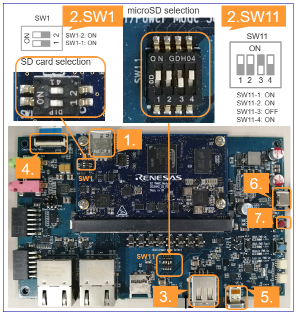
                

              
  
              

                

                  <ol>
                    <li value = "8">After the boot-up, following screen will be displayed on HDMI monitor.</li>
                  </ol>
                

                

                  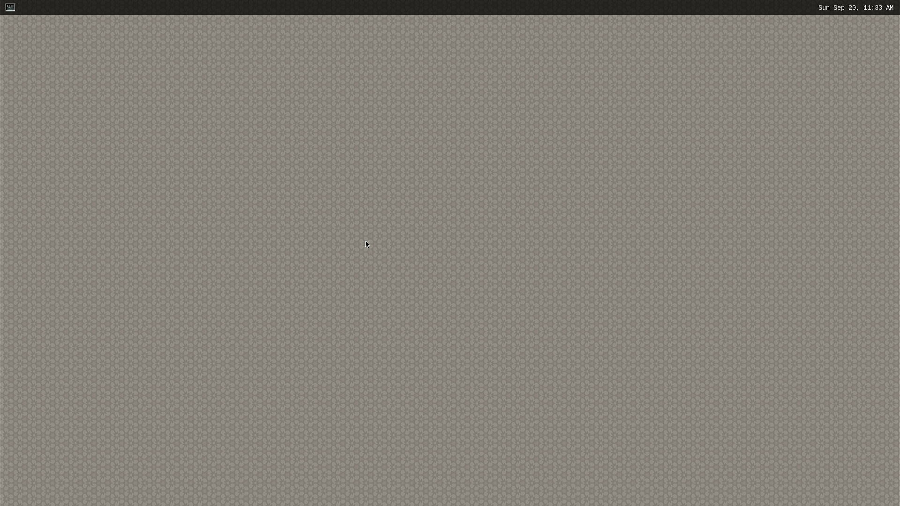
                

              

              

                

                  <ol>
                    <li value = "9">Click the icon at the top-left corner to open the terminal.</li>
                  </ol>
                

                

                  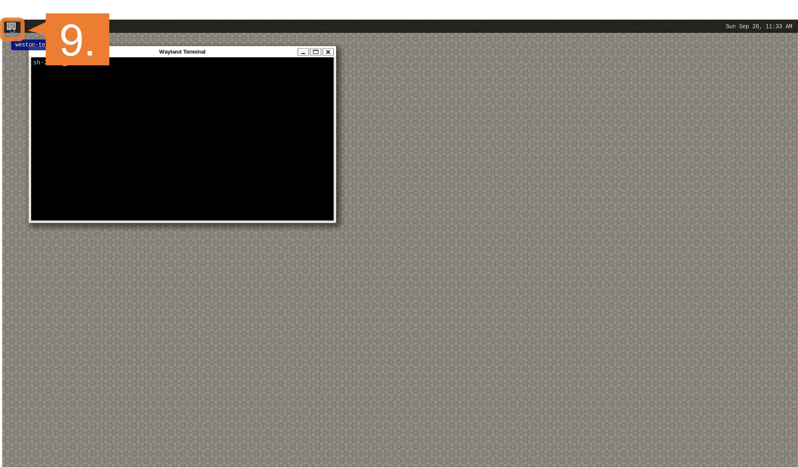
                

              

            

          </reference3>
        

        

          For QSPI
          

            Note
            After bootloader is written and U-boot setting is changed, terminal emulator is no longer needed. 
            Users can detach the serial port connection. 
          

          

            

              

                <ol>
                  <li>
                    Insert the microSD card to the <b>Board</b>.
                    

                      Note
                      Use the microSD card slot <b>CN10</b> as shown in the figure.
                    

                  </li> 
                  <li>Change SW1 and SW11 setting as shown in the figure.</li> 
                  <li>Connect the USB mouse and USB keyboard via USB hub.</li> 
                  <li>Connect the <b>Google Coral camera</b> to the <b>Board</b>.</li> 
                  <li>Connect the HDMI monitor to the <b>Board</b>.</li> 
                  <li>Connect the power cable to the <b>Board</b>.</li> 
                  <li>Press power button for 1 second to turn on the board.</li>
                </ol>
              

              

                
              

            
  
            

              

                <ol>
                  <li value = "8">After the boot-up, following screen will be displayed on HDMI monitor.</li>
                </ol>
              

              

                
              

            

            

              

                <ol>
                  <li value = "9">Click the icon at the top-left corner to open the terminal.</li>
                </ol>
              

              

                
              

            

          

        

      

      

        

          For eSD
          

            

              

                <ol>
                  <li>
                    Insert the microSD card to the <b>Board</b>.
                    

                      Note
                      Use the microSD card slot <b>SD1</b> on the <b>Board</b> as shown in the figure.
                    

                  </li> 
                  <li>Change DSW1 and DSW2 setting as shown in the figure.</li> 
                  <li>Connect the USB mouse and USB keyboard and USB camera via USB hub. 
                    

                      Note
                      There are USB 2.0 port and USB 3.0 port on RZ/V2H EVK. 
                      Please connect your USB camera to appropriate port according to its requirement. 
                      Here, USB camera is connected to USB 2.0 via USB hub. 
                    

                  </li> 
                  <li>Connect the HDMI monitor to the <b>Board</b>.</li> 
                  <li>Connect the power cable to the <b>Board</b>.</li> 
                  <li>Turn the SW3 to ON.</li> 
                  <li>Turn the SW2 to ON to power on the <b>Board</b></li>
                </ol>
              

              

                
              

            
  
            

              

                <ol>
                  <li value = "8">After the boot-up, following screen will be displayed on HDMI monitor.</li>
                </ol>
              

              

                
              

            

            

              

                <ol>
                  <li value = "9">Click the icon at the top-left corner to open the terminal.</li>
                </ol>
              

              

                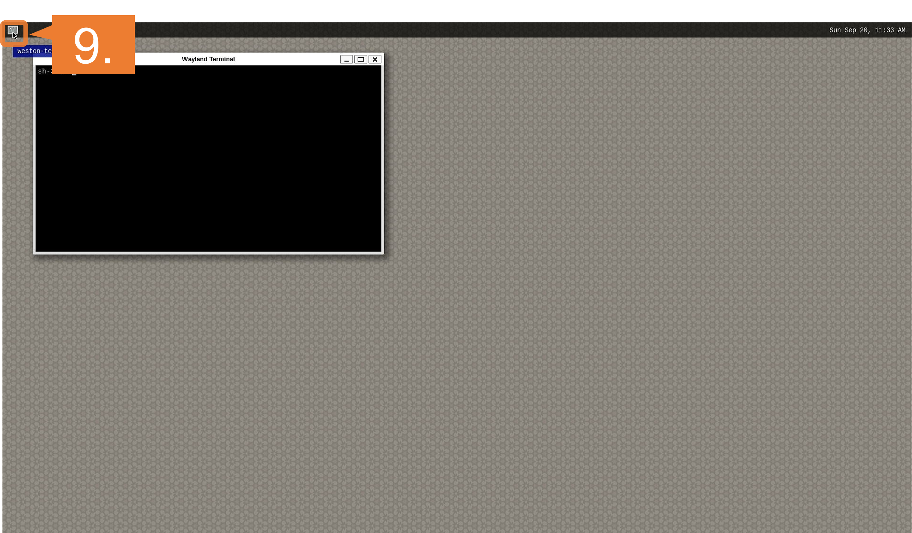
              

            

          

        

        

          For xSPI
          

            Note
            After bootloader is written and U-boot setting is changed, terminal emulator is no longer needed. 
            Users can detach the serial port connection. 
          

          

            

              

                <ol>
                  <li>
                    Insert the microSD card to the <b>Board</b>.
                    

                      Note
                      Use the microSD card slot <b>SD2</b> on the <b>Board</b> as shown in the figure.
                    

                  </li> 
                  <li>Change DSW1 and DSW2 setting as shown in the figure.</li> 
                  <li>Connect the USB mouse and USB keyboard and USB camera via USB hub. 
                    

                      Note
                      There are USB 2.0 port and USB 3.0 port on RZ/V2H EVK. 
                      Please connect your USB camera to appropriate port according to its requirement. 
                      Here, USB camera is connected to USB 2.0 via USB hub. 
                    

                  </li> 
                  <li>Connect the HDMI monitor to the <b>Board</b>.</li> 
                  <li>Connect the power cable to the <b>Board</b>.</li> 
                  <li>Turn the SW3 to ON.</li> 
                  <li>Turn the SW2 to ON to power on the <b>Board</b></li>
                </ol>
              

              

                <a href="img/v2h_evk_boot_spi.png" data-lightbox="group">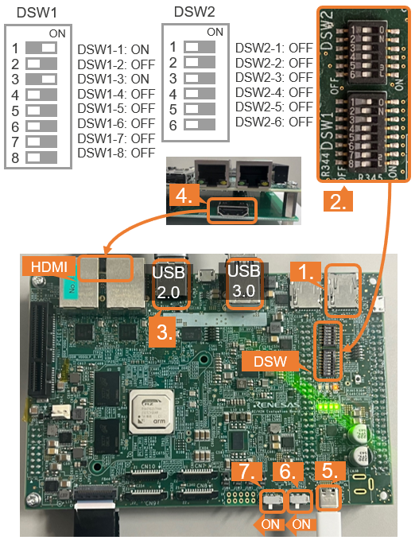</a>
              

            
  
            

              

                <ol>
                  <li value = "8">After the boot-up, following screen will be displayed on HDMI monitor.</li>
                </ol>
              

              

                
              

            

            

              

                <ol>
                  <li value = "9">Click the icon at the top-left corner to open the terminal.</li>
                </ol>
              

              

                
              

            

          

        

      

      

        

          For eSD
          

            

              

                <h6 class="mb-2" style="color: #2a289d;"><b>Click the board name.</b></h6>
                <a class="btn_board 
                    btn_V2N_EVK
                    btn_board-Active" 
                    data-id="V2N_EVK">
                    RZ/V2N EVK
                </a>
                <a class="btn_board 
                    btn_V2N_FPB" 
                    data-id="V2N_FPB">
                    FPB-RZV2N
                </a>
              

              

                <ol>
                  <li>
                    Insert the microSD card to the <b>Board</b>.
                    

                      Note
                      
                        Use the microSD card slot <b>SD1</b> on the <b>Board</b> as shown in the figure.
                      
                      
                        Use the microSD card slot on the <b>back</b> of the <b>Board</b> as shown in the figure.
                      
                    

                  </li> 
                  <li><b>[EVK only]</b>Change DSW1 and DSW2 setting as shown in the figure.</li> 
                  <li>Connect the USB mouse and USB keyboard and USB camera via USB hub. 
                    

                      

                        Note
                        There are USB 2.0 port and USB 3.0 port on RZ/V2N EVK. 
                        Please connect your USB camera to appropriate port according to its requirement. 
                        Here, USB camera is connected to USB 3.0 via USB hub. 
                      

                    

                  </li> 
                  <li>Connect the HDMI monitor to the <b>Board</b>.</li> 
                  <li>Connect the power cable to the <b>Board</b>.</li> 
                  <li><b>[EVK only]</b>Turn the SW3 to ON.</li> 
                  <li>Turn the SW2 to ON to power on the <b>Board</b></li>
                </ol>
              

              

                

                  <a href="img/v2n_evk_boot_esd.png" data-lightbox="group">
                    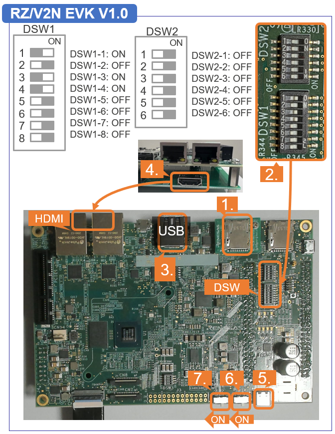
                  </a>
                  <a href="img/v2n_evkv2_boot_esd.png" data-lightbox="group">
                    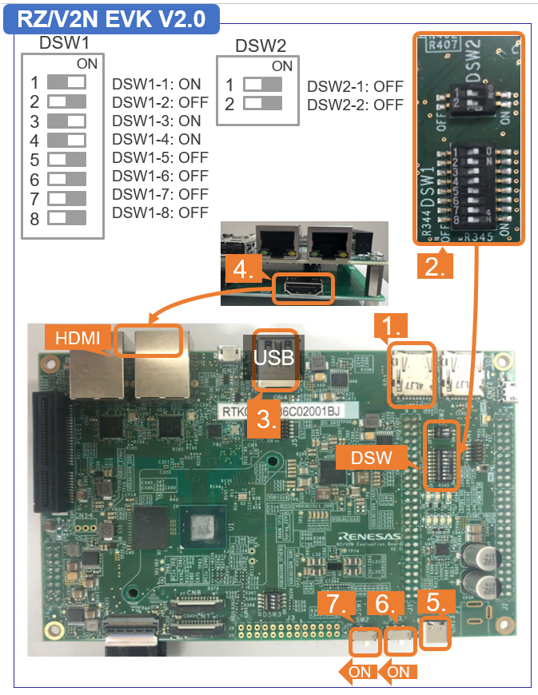
                  </a>
                

                

                  <a href="img/v2n_fpb_boot.jpg" data-lightbox="group">
                    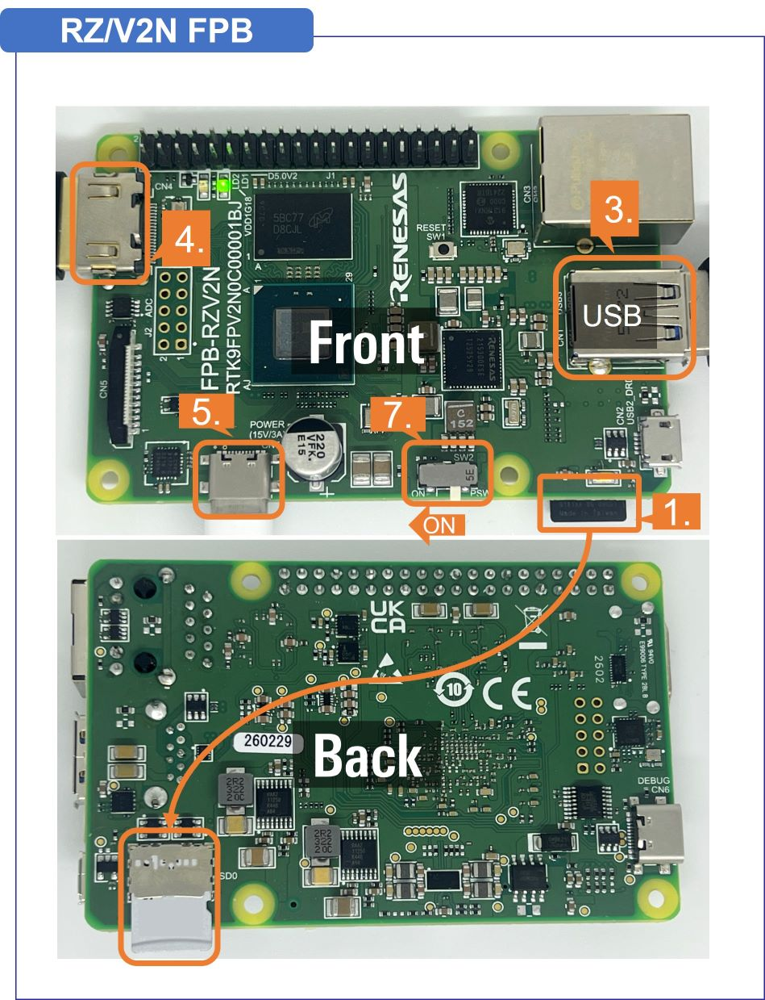
                  </a>
                

              

            
  
            

              

                <ol>
                  <li value = "8">After the boot-up, following screen will be displayed on HDMI monitor.</li>
                </ol>
              

              

                
              

            

            

              

                <ol>
                  <li value = "9">Click the icon at the top-left corner to open the terminal.</li>
                </ol>
              

              

                
              

            

          

        

        

          For xSPI
          

            Note
            After bootloader is written and U-boot setting is changed, terminal emulator is no longer needed. 
            Users can detach the serial port connection. 
          

          

            

              

                <ol>
                  <li>
                    Insert the microSD card to the <b>Board</b>.
                    

                      Note
                      Use the microSD card slot <b>SD2</b> on the <b>Board</b> as shown in the figure.
                    

                  </li> 
                  <li> Change DSW1 and DSW2 setting as shown in the figure.</li> 
                  <li>Connect the USB mouse and USB keyboard and USB camera via USB hub. 
                    

                      Note
                      There are USB 2.0 port and USB 3.0 port on RZ/V2N EVK. 
                      Please connect your USB camera to appropriate port according to its requirement. 
                      Here, USB camera is connected to USB 3.0 via USB hub. 
                    

                  </li> 
                  <li>Connect the HDMI monitor to the <b>Board</b>.</li> 
                  <li>Connect the power cable to the <b>Board</b>.</li> 
                  <li>Turn the SW3 to ON.</li> 
                  <li>Turn the SW2 to ON to power on the <b>Board</b></li>
                </ol>
              

                

                  

                    

                      <a href="img/v2n_evk_boot_spi.png" data-lightbox="group">
                        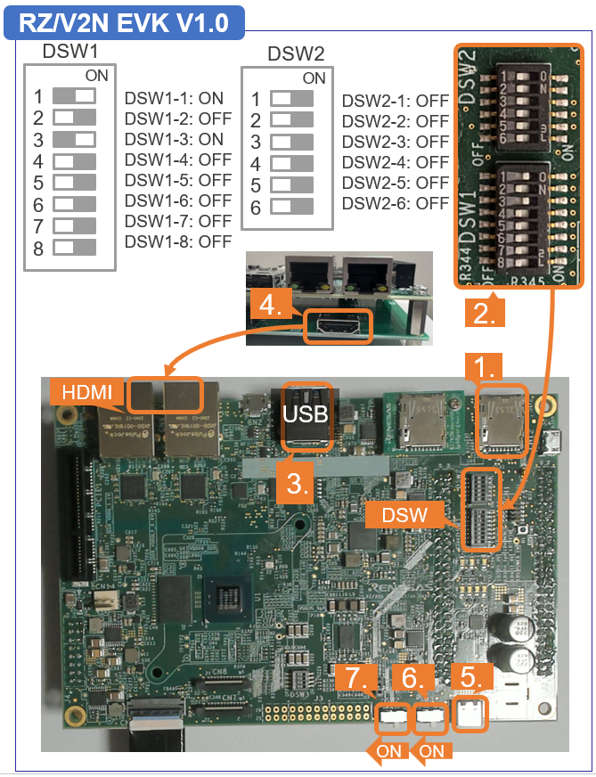
                      </a>
                    

                    

                      <a href="img/v2n_evkv2_boot_spi.png" data-lightbox="group">
                        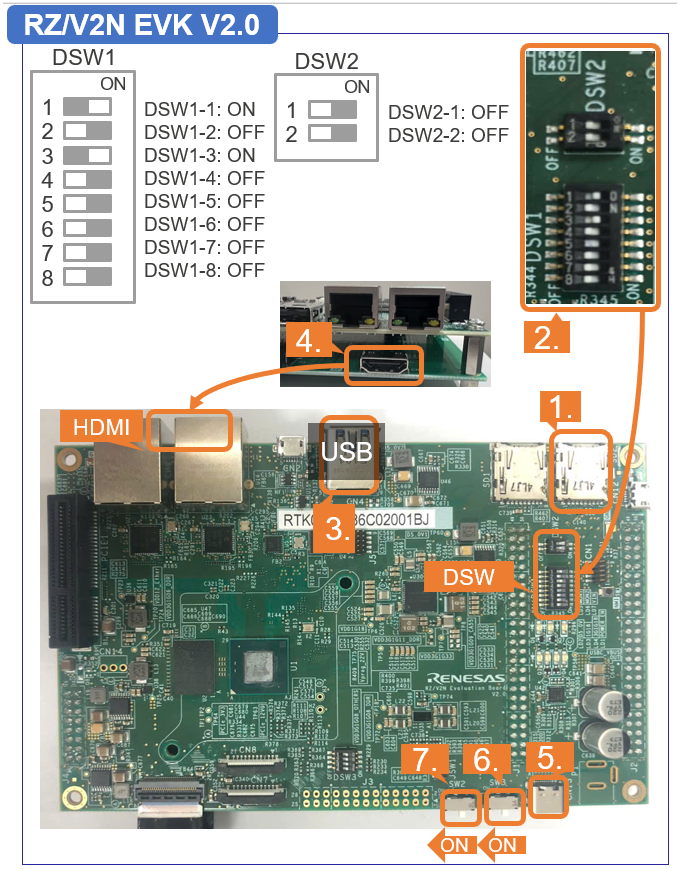
                      </a>
                    

                  

                

            
  
            

              

                <ol>
                  <li value = "8">After the boot-up, following screen will be displayed on HDMI monitor.</li>
                </ol>
              

              

                
              

            

            

              

                <ol>
                  <li value = "9">Click the icon at the top-left corner to open the terminal.</li>
                </ol>
              

              

                
              

            

          

        

      

      
After Step 7, users should have completed followings.
      <ul>
        <li>Setup miroSD card.</li>
        <li>Deploy the application on miroSD card.</li>
        <li>Boot the board.</li>
      </ul>
      

    

  

 
 

  

    

      <h3 id="step8" >Step 8: Run AI Application</h3>
      This section explains how to run the AI Application.
       
       
      

        <a class="btn_prod 
            btn_V2L
            btn_prod-Active" 
            data-id="V2L">
            RZ/V2L
        </a>
        <a class="
            btn_prod 
            btn_V2H" 
            data-id="V2H">
            RZ/V2H
        </a>
        <a class="
            btn_prod 
            btn_V2N" 
            data-id="V2N">
            RZ/V2N
        </a>
      

      <ol>
        <li>
          Follow the instructions explained in the document (<code>README.md</code>) of applications on GitHub.
            
          

            <u><b>Example:</b></u> 
            For R01_object_detection application, follow the instruction in <a href="https://github.com/renesas-rz/rzv_ai_sdk/tree/v7.10/R01_object_detection#application-run-stage" target="_blank" rel="noopener noreferrer">README > Application: Run Stage</a> to run the application.
             
            <!-- 
              Users can use the AI Application for RZ/V2H on the RZ/V2N Board. 
              Please use source code and object files for RZ/V2H, and follow the steps <a href="https://github.com/renesas-rz/rzv_ai_sdk/tree/v7.10/R01_object_detection#application-build-stage" target="_blank" rel="noopener noreferrer">Application: Build Stage</a> to build the application in the RZ/V2N AI SDK environment.
               
             -->
            If you have successfully run the application, you will see following window on HDMI screen.
              
            

              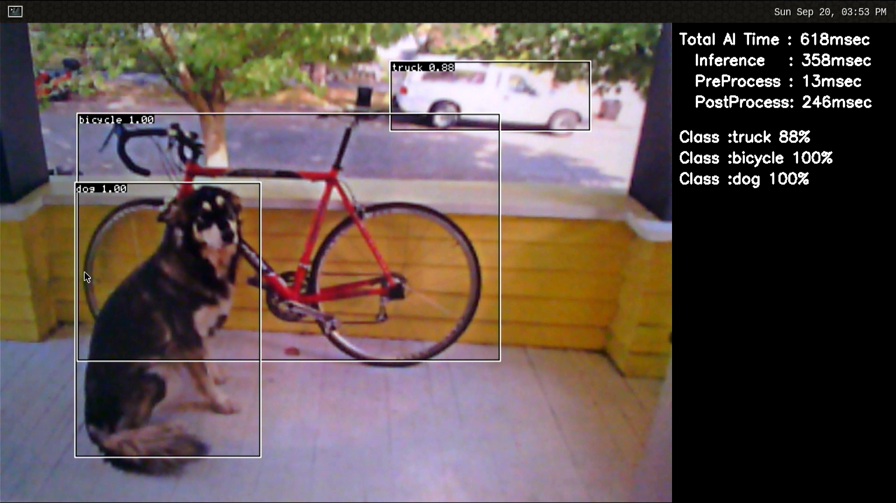
            

            

              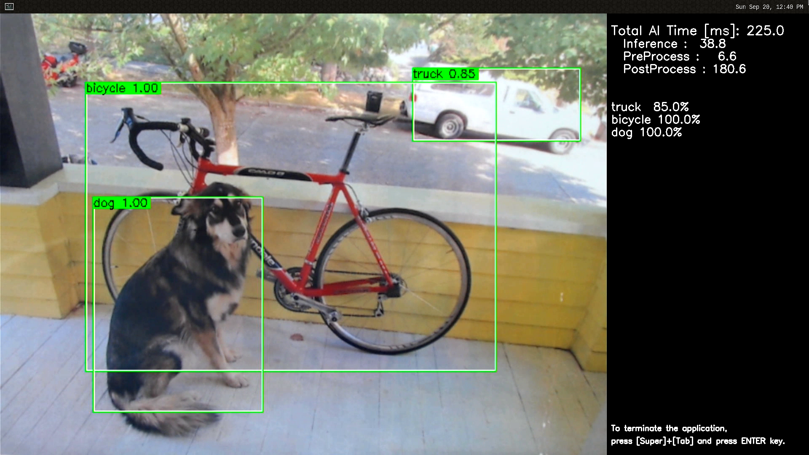
            

            

              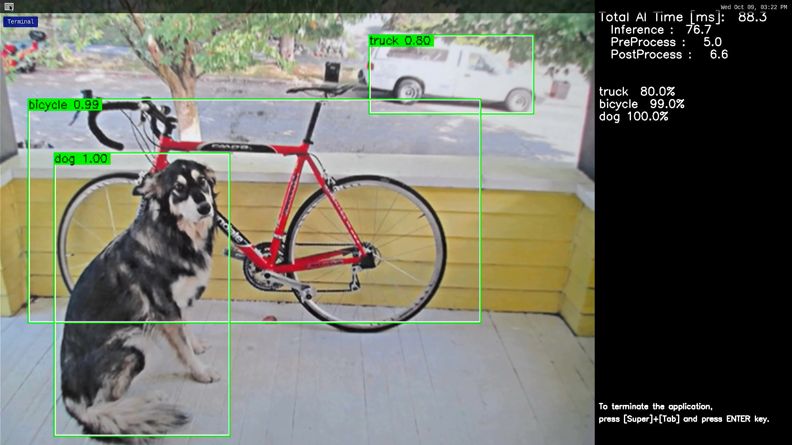
            

          

           
        </li>
      </ol>
      

        <!-- Note2 -->
        Note1
        When running an AI Application, the following warning may be shown. It does not affect the operation. 
        <h6 class="mb-1">

[ WARN:0@xx.xxx] global cap_gstreamer.cpp:1777 open OpenCV | GStreamer warning: Cannot query video position: status=0, value=-1, duration=-1

        </h6>
      

    

 
 
 

  

    

      <h3 id="step9" >Step 9: Shutdown the Board</h3>
      This section explains how to shutdown the target board.
       
       
      

        <a class="btn_prod 
            btn_V2L
            btn_prod-Active" 
            data-id="V2L">
            RZ/V2L
        </a>
        <a class="
            btn_prod 
            btn_V2H" 
            data-id="V2H">
            RZ/V2H
        </a>
        <a class="
            btn_prod 
            btn_V2N" 
            data-id="V2N">
            RZ/V2N
        </a>
      

      

        To power-off the RZ/V2L EVK, follow the procedures below.
          
        <a3reference>
          <ol>
            <li>Run the <code>shutdown</code> command on board console.
               

sudo -i shutdown -h now

             
            </li>
            <li>On the screen, check that shutdown procedure runs and the HDMI display is blacked out.
                
            </li>
            <li>Press and hold the power button for 2 seconds.
                
              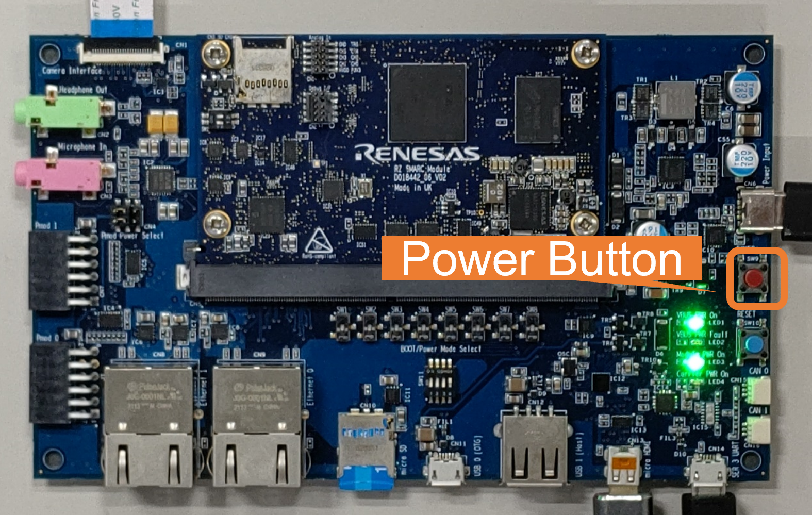 
            </li>
          </ol>
        </a3reference>
      

      

        To power-off the RZ/V2H EVK, follow the procedures below.
          
        <a4reference>
        <ol>
          <li>Run the <code>shutdown</code> command on board console.
             

sudo -i shutdown -h now

             
          </li>
          <li>
            On the screen, check that shutdown procedure runs and the HDMI display is blacked out.
              
          </li>
          <li>
            Turn SW2 to OFF.
              
          </li>
          <li>
            Turn SW3 to OFF.
              
             
          </li>
        </ol>
        </a4reference>
      

      

        To power-off the RZ/V2N Board, follow the procedures below.
         
        

          <h6 class="mb-2" style="color: #2a289d;"><b>Click the board name.</b></h6>
          <a class="btn_board 
              btn_V2N_EVK
              btn_board-Active" 
              data-id="V2N_EVK">
              RZ/V2N EVK
          </a>
          <a class="btn_board 
              btn_V2N_FPB" 
              data-id="V2N_FPB">
              FPB-RZV2N
          </a>
        

         
        <ol>
          <li>Run the <code>shutdown</code> command on board console.
             

sudo -i shutdown -h now

             
          </li>
          <li>
            On the screen, check that shutdown procedure runs and the HDMI display is blacked out.
              
          </li>
          <li>
            Turn SW2 to OFF.
              
          </li>
          

          <li>
            <b>[EVK only]</b> Turn SW3 to OFF.
              
          </li>
          

        </ol>
        

          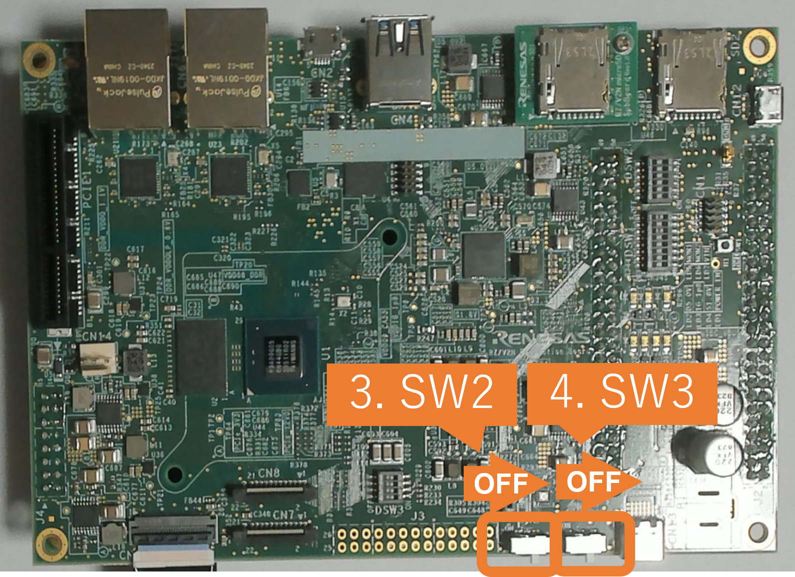
        

        

          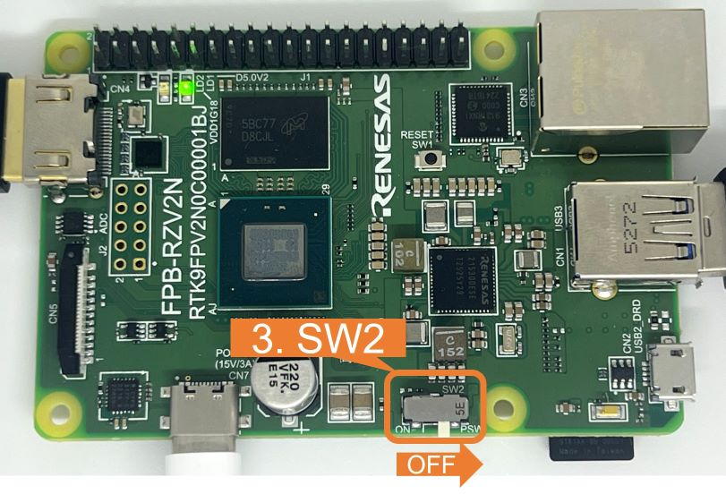
        

      

        
    

  

  

    

      <h4 id="ending" class="u_line">
        This is the end of Getting Started.
      </h4>
      You have experienced the AI Application development procedures. 
      Next step is to change the application to create your own AI Application. 
      You can use the applications listed in <a href="{{ site.url }}{{ site.baseurl }}" target="_blank" rel="noopener noreferrer">AI Applications</a> to expand your ideas!
        
      If you would like to customize Yocto Linux or develop your own board, please change and build the AI SDK Source Code based on your environment.
       
      Please refer to How to Build AI SDK page shown below for more details. 
      

        <a class="btn btn-secondary square-button-gray ms-3 mt-1" style="text-align:left;" href="{{ site.url }}{{ site.baseurl }}" role="button" target="_blank" rel="noopener noreferrer">
          How to Build RZ/V2L AI SDK
          
          How can I build RZ/V2L AI SDK Source Code? 
          
        </a>
      

      

        <a class="btn btn-secondary square-button-gray ms-3 mt-1" style="text-align:left;" href="{{ site.url }}{{ site.baseurl }}" role="button" target="_blank" rel="noopener noreferrer">
          How to Build RZ/V2H AI SDK
          
          How can I build RZ/V2H AI SDK Source Code? 
          
        </a>
      

      

        <a class="btn btn-secondary square-button-gray ms-3 mt-1" style="text-align:left;" href="{{ site.url }}{{ site.baseurl }}" role="button" target="_blank" rel="noopener noreferrer">
          How to Build RZ/V2N AI SDK
          
          How can I build RZ/V2N AI SDK Source Code? 
          
        </a>
      

    

  

  

    

      <a class="btn btn-secondary square-button" href="{{ site.url }}{{ site.baseurl }}#page-top" role="button">
Back to Top >
      </a>
    

  

