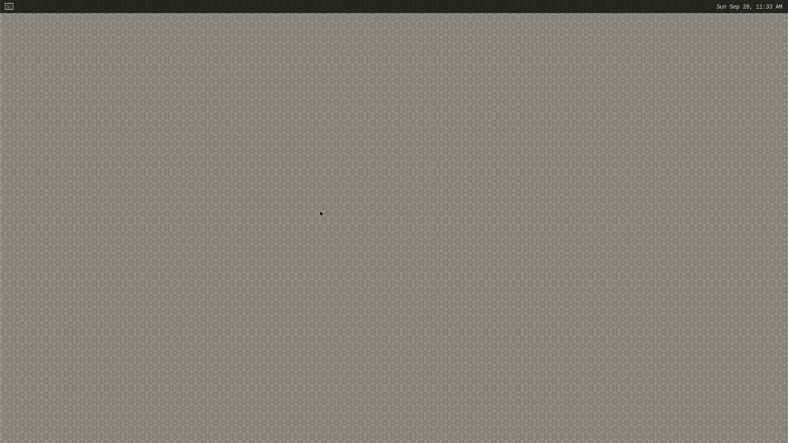

    

        

Getting Started
        

    

 
 
<h5>This page explains how to start-up the AI SDK on the <b>RZ/V2L Evaluation Board Kit</b>.</h5>

<a href="https://www.renesas.com/products/microcontrollers-microprocessors/rz-mpus/rzv-embedded-ai-mpus">Learn more about the RZ/V series.</a>

<h5>Supported version: <b>RZ/V2L AI SDK v2.10</b></h5>

  Tutorial video
  Tutorial video is available <a href="{{ site.url }}{{ site.baseurl }}#video">here.</a>
  Latest tutorial video is based on RZ/V2L AI SDK version 2.10. 

  GUI environment
  AI SDK has a CUI environment and a GUI environment. 
  For the GUI environment, see <a href="{{ site.url }}{{ site.baseurl }}">AI SDK page</a>. 

<h3 id="step1" >Step 1: Obtain an evaluation board</h3>
<reference1>

  

    

      The RZ/V2L Evaluation Board Kit (EVK) is the ideal board kit for RZ/V2L evaluation. 
        
      Since MIPI camera module is included, you can start evaluating RZ/V2L immediately by building an environment.  
        
      <a class="btn btn-primary download-button" href="https://www.renesas.com/products/microcontrollers-microprocessors/rz-mpus/rzv2l-evkit-rzv2l-evaluation-board-kit" role="button">Get RZ/V2L EVK</a>
    

    

      
    

  

  

    

      Following items are included in the RZ/V2L Evaluation Board Kit.
        
      <table>
        <tr>
          <th>Equipment</th>
          <th>Details</th>
        </tr>
        <tr>
          <td>RZ/V2L Evaluation Board</td>
          <td>Evaluation board itself.</td>
        </tr>
        <tr>
          <td>MIPI Camera Module</td>
          <td>Google Coral Camera. 
          <h6>Note that the CMOS sensor (OV5645) in the camera is <b>no longer available</b>, and should not be used for mass production.  Any software support provided is for evaluation purposes only.</h6></td>
        </tr>
        <tr>
          <td>MicroUSB to Serial Cable</td>
          <td>For serial communication between PC and the board.</td>
        </tr>
      </table>
    

  

</reference1>
 

<h3 id="step2" >Step 2: Obtain necessary environment</h3>
 
<h4>1. Necessary Equipments</h4>
<reference2>
  In addition to the RZ/V2L Evaluation Board Kit, please prepare the following equipments. 
  

    Note
    <b>Serial to MicroUSB Cable</b> and <b>MIPI Camera Module (Google Coral camera)</b> is included in RZ/V2L Evaluation Board Kit.
  

  <table>
    <tr>
      <th>Equipment</th>
      <th>Details</th>
    </tr>
    <tr>
      <td>HDMI Monitor</td>
      <td>Used to display the graphics.</td>
    </tr>
    <tr>
      <td>Micro HDMI Cable</td>
      <td>Used to connect the HDMI Monitor and the board.</td>
    </tr>
    <tr>
      <td>AC adapter</td>
      <td>Power supply to the board.</td>
    </tr>
    <tr>
      <td>USB Cable Type-C</td>
      <td>Connect AC adapter and the board.</td>
    </tr>
    <tr>
      <td>microSD card</td>
      <td>Must have over 4GB capacity of blank space. Operating Environment: Transcend USH-I microSD 300S 16GB</td>
    </tr>
    <tr>
      <td>Linux PC</td>
      <td>Used for Setup microSD card and RZ/V2L AI SDK Setup. 
      Operating Environment: Ubuntu 20.04</td>
    </tr>
    <tr>
      <td>SD card reader</td>
      <td>Used for setting up microSD card. </td>
    </tr>
    <tr id="EQ_WindowsPC">
      <td>Windows PC</td>
      <td><b>Optional.</b> Used as the serial communication console for eMMC Bootloader. 
      Operating Environment : Windows 10</td>
    </tr>
    <tr>
      <td>USB Hub</td>
      <td>Used to connect USB Keyboard and USB Mouse.</td>
    </tr>
    <tr>
      <td>USB Keyboard</td>
      <td>Used to type strings on the terminal of board.</td>
    </tr>
    <tr>
      <td>USB Mouse</td>
      <td>Used to operate the mouse on the screen of board.</td>
    </tr>
  </table>
</reference2>
 
<h4>2. Necessary Software</h4>
Please install following software <b>on Ubuntu PC</b>.
<ul>
  <li><a href="https://docs.docker.com/">Docker</a></li>
  <li>git</li>
</ul>
 

<h3 id="step3" >Step 3: Obtain RZ/V2L AI SDK</h3>
AI SDK provides following packages.
<table>
  <tr>
    <th>Name</th>
    <th>Package</th>
    <th>Details</th>
  </tr>
  <tr>
    <td><b>RZ/V2L AI SDK</b></td>
    <td><b>RTK0EF0160F*SJ.zip</b></td>
    <td><b>Package used for AI development.</b></td>
  </tr>
  <tr>
    <td>RZ/V2L AI SDK Source Code</td>
    <td>RTK0EF0160F*SJ_linux-src.zip</td>
    <td>Package used for Linux development. Please refer to <a href="{{ site.url }}{{ site.baseurl }}">How to Build AI SDK</a> for more details on this package.</td>
  </tr>
</table>
For this Getting Started, please download <b>"RZ/V2L AI SDK"</b> from the link below.  
<a class="btn btn-primary download-button" href="https://www.renesas.com/software-tool/rzv2l-ai-software-development-kit" role="button">Download Link</a>
  
Once downloaded, please check the Release Note included in the package.
  

<h3 id="step4" >Step 4: Extract RZ/V2L AI SDK package</h3>
This step explains how to extract the RZ/V2L AI SDK zip file.
<ol>
  <li>On your Linux PC, make the working directory.

mkdir -p ai_sdk_work

  </li>
  <li>Register the working directory path to an environment variable. 

export WORK=<path to the working directory>/ai_sdk_work

  </li>
  <li>Move to the working directory.

cd ${WORK}

  </li>
  <li>Extract RZ/V2L AI SDK zip file under the working directory. 

unzip <Path to the file>/RTK0EF0160F*.zip -d ${WORK}

  </li>
  <li>Check the working directory to confirm the package contents.

ls ${WORK}/

    <ul>
      <li>If the above command prints followings, the package is extracted correctly.

ai_sdk_setup  board_setup  documents  references r11an0752ej*.pdf

      </li>
    </ul>
  </li>
</ol>
 

<h3 id="step5" >Step 5: Setup RZ/V2L AI SDK</h3>
This step explains how to setup the RZ/V2L AI SDK environment.

  Note
  Make sure that you have <a href="https://docs.docker.com/">installed Docker</a> on your Linux PC.

<ol>
  <li>On your Linux PC, move to the working directory.

cd ${WORK}/ai_sdk_setup

  </li>
  <li>Build docker image.

docker build -t rzv2l_ai_sdk_image --build-arg SDK="/opt/poky/3.1.21" --build-arg PRODUCT="V2L" .

  </li>
  <li>Create new directory to be mounted on Docker container.

mkdir ${WORK}/ai_sdk_setup/data

  </li>
  <li>Create docker container.  Here, <code>rzv2l_ai_sdk_container</code> is a name of docker container, which can be changed by user.

docker run -it --name rzv2l_ai_sdk_container -v $(pwd)/data:/drp-ai_tvm/data rzv2l_ai_sdk_image

    The local <code>$(pwd)/data</code> is mounted to <code>/drp-ai_tvm/data</code> on the Docker container by the above command option. 
    For example, you can use this directory to copy files created on the Docker container to your local environment.  
    
  </li> 
  <li>In docker container, run the following command to copy <code>libtvm_runtime.so</code>, which is the necessary file for the board, to host machine. 

cp /drp-ai_tvm/obj/build_runtime/V2L/libtvm_runtime.so /drp-ai_tvm/data

  </li>
  <li>To exit docker, run following commands. 

exit

  </li>
  <li>To start the docker container <code>rzv2l_ai_sdk_container</code> again, run the following command. 

docker start -i rzv2l_ai_sdk_container

  </li>
</ol>
 
You have finished the RZ/V2L AI SDK environment setup. 
You are ready to build the AI applications!
  

<h3 id="step6" >Step 6: Build RZ/V2L AI Application</h3>
This step explains how to build AI application.
 

AI Applications are provided in the GitHub repository.
 
To access the application, please see <a href="{{ site.url }}{{ site.baseurl }}">AI Applications</a>.

  Note
  The link in <a href="{{ site.url }}{{ site.baseurl }}">AI Applications</a> page guides you to the latest GitHub repository. 
  Please be aware that latest AI Application requires latest AI SDK. 

 
Application directory has the following structure.
 
<table>
  <tr>
    <th>Directory</th>
    <th>Details</th>
  </tr>
  <tr>
    <td><code>exe</code></td>
    <td>Execution environment required when running application on the board.</td>
  </tr>
  <tr>
    <td><code>src</code></td>
    <td>Application Source Code.</td>
  </tr>
  <tr>
    <td>Other directory</td>
    <td>Optional: Extra files that may be required other than above.</td>
  </tr>
  <tr>
    <td><code>Makefile</code></td>
    <td>Optional: Configuration to build the application. It may be included in the src directory.</td>
  </tr>
  <tr>
    <td><code>README.md</code></td>
    <td>Optional: Documentation of the application.</td>
  </tr>
</table>
 

  Note
  Following procedures are for users who would like to build the application from the source code. 
  If you would like to run the application <b>as quickly as possible</b>, you can skip this step and proceed to the <b><a href="#step7">next step (Step 7: Deploy RZ/V2L AI Application)</a></b> since pre-build application binary is provided.

<h4 id="build-instruction">Building instructions.</h4>
In <a href="{{ site.url }}{{ site.baseurl }}">AI Applications</a>, there are two types of applications.
<ul>
  <li><b>&lt;Application 1&gt;</b>: Provided in <a href="https://github.com/renesas-rz/rzv_ai_sdk/">RZ/V AI SDK GitHub repository</a>.
    <ul>
      <li>This repository provides the complete instruction in each application documentation.</li>
      <li>In this page, we use the <a href="https://github.com/renesas-rz/rzv_ai_sdk/tree/v{{ site.version }}/R01_object_detection">Object Detection</a> application from this repository for an example.</li>
    </ul>
  </li>
  <li><b>&lt;Application 2&gt;</b>: Provided in <a href="https://github.com/Ignitarium-Renesas/RZV2L_AiLibrary">RZV2L_AiLibrary repository</a>.
    <ul>
      <li>This repository does not provide instructions for RZ/V2L AI SDK.</li>
    </ul>
  </li>
</ul>
<ul style="list-style:none;">
  <li>
    <h5 id="build-option1">Option 1. For <b>&lt;Application 1&gt;</b></h5>
    Check the <code>README.md</code> document provided in application directory and follow the instruction in the chapter called <b>"Application: Build Stage"</b> (or similar) to build the application.  
    <ul style="list-style: none;">
      <li>
        

          <u><b>Example:</b></u> 
          In <a href="https://github.com/renesas-rz/rzv_ai_sdk/tree/v{{ site.version }}/R01_object_detection">Object Detection</a> application, follow the instruction <a href="https://github.com/renesas-rz/rzv_ai_sdk/tree/v{{ site.version }}/R01_object_detection#application-build-stage">here</a> to generate the following application binary.
          <ul>
            <li>object_detection</li>
          </ul>
        

      </li>
      <!-- From here: Delete when making latest version -->
      <li>
        

          Note
          The <code>git clone</code> command shown in the <code>README.md</code> will download the <b style="color: red;">latest</b> source code and related files.   
          To download the files of AI Applications v{{ site.version }}, please specify the version tag by adding <code>-b v{{ site.version }}</code>  when you running the <code>git clone</code> command as shown below.

git clone -b v{{ site.version }} https://github.com/renesas-rz/rzv_ai_sdk.git

        

      </li>
      <!-- Until here: Delete when making latest version -->
    </ul>
     
    After you generated the application binary, please proceed to <a href="#step7">Step 7</a>
  </li>  
  <li>
    <h5 id="build-option2">Option 2. For <b>&lt;Application 2&gt;</b></h5>
    Follow the instruction bellow to build the application.
    <ol>
      <li>Run (or start) docker container.  
        

          <u><b>Example:</b></u> 
          Run the following command to start the docker container created in <a href="#step5">Step 5</a>.

docker start -i rzv2l_ai_sdk_container

        

      </li> 
      <li>Change the environment variable to use the cross compiler.

source /opt/poky/3.1.21/environment-setup-aarch64-poky-linux

        

          Note
          This command needs to be called everytime user opened the new terminal.
        

      </li> 
      <li>Move to the mounted point in docker container.
         

cd /drp-ai_tvm/data

      </li> 
      <li>Download the application source code. 
        Here, we use <a href="https://github.com/Ignitarium-Renesas/RZV2L_AiLibrary/tree/v{{ site.version }}/01_Head_count">RZV2L_AiLibrary repository Head Counter application</a> as an example.
         

git clone https://github.com/Ignitarium-Renesas/RZV2L_AiLibrary

        <!-- From here: Delete when making latest version -->
        

          Note
          The command above will download the <b style="color: red;">latest</b> source code and related files.   
          To download the files of AI Applications v{{ site.version }}, please specify the version tag by adding <code>-b v{{ site.version }}</code> when you running the <code>git clone</code> command as shown below.

git clone -b v{{ site.version }} https://github.com/Ignitarium-Renesas/RZV2L_AiLibrary

        

        <!-- Until here: Delete when making latest version -->
      </li> 
      <li>Move to the application directory.

cd RZV2L_AiLibrary/01_Head_count/Head_count_cam

        

          Note
          The file configuration depends on each application. Please check the file configuration in the repository carefully.
        

      </li> 
      <li>Build the application with <code>make</code> command.
         

make

      </li> 
      <li>Check that following application is generated in the <code>RZV2L_AiLibrary/01_Head_count/ Head_count_cam/exe</code>.
        <ul>
          <li>head_count_cam_app</li>
        </ul>
      </li> 
      <li>If you would like to build the other applications in <a href="#build-option1">Option 1</a>, please exit and restart the docker container.
      </li>
    </ol>
     
    After you generated the application binary, please proceed to <a href="#step7">Step 7</a>
  </li>
</ul>
  

<h3 id="step7" >Step 7: Deploy RZ/V2L AI Application</h3>
This section explains how to deploy the AI Application to the RZ/V2L Evaluation Board Kit.
 
To boot the board, bootloader and other Linux necessary files are required. 
There are two types of bootloader available on RZ/V2L AI SDK. 
<ul>
  <li>
      <b>eSD Bootloader</b>: The board boots up using the bootloader written on microSD card.
  </li>
  <li>
      <b>eMMC Bootloader</b>: The board boots up using the bootloader written in eMMC on the board.
  </li>
</ul>
Other necessary files, i.e. Linux kernel and root filesystem, are stored on microSD card. 
You can use Linux PC to format the microSD card and expand the kernel and the root filesystem using SD card reader. 

 

<h4 id="step7prep" >Preparation</h4>

  Click the button
  This step contains both eSD and eMMC Bootloader explanation. 
  Please click the button below to update the explanation according to your bootloader interface. 
  

    eSD Bootloader
    eMMC Bootloader
  

  

    For eSD
    eSD explanation will be shown in this style if you click "eSD Bootloader" button above.
  

  

    For eMMC
    eMMC explanation will be shown in this style if you click "eMMC Bootloader" button above.
  

<h4 id="step7-1" >1. Setup RZ/V2L Evaluation Board Kit </h4>

  

    For eSD
    microSD card contains bootloaders, the Linux kernel and root filesystem to boot-up the board. 
    You can use Linux PC to format the microSD card and expand the kernel and the root filesystem using SD card reader. 
  

  

    Note
    This step is required only when starting the AI SDK or when using the new version of AI SDK. 
    If you have already setup the microSD card with the latest bootloader, Linux kernel, Linux device tree file and root filesystem, skip this step and proceed to <a href="#step7-2">the next procedure (2. Deploy Application to the Board)</a>.
  

  

    For eMMC
    microSD card contains the Linux kernel and root filesystem to boot-up the board. 
    You can use Linux PC to format the microSD card and expand the kernel and the root filesystem using SD card reader. 
    Bootloaders must be written in eMMC on the board.
    You can use Windows PC to write the bootloaders on eMMC.
  

  

    Note
    This step is required only when starting the AI SDK or when using the new version of AI SDK. 
    If you have already setup the microSD card and the bootloader written in eMMC on the board, skip this step and proceed to <a href="#step7-2">the next procedure (2. Deploy Application to the Board)</a>. 
  

<ol>
  <h5 id="step7-1a">
    <li type="A">Format SD card </li>
  </h5>
  Create the following partitions on microSD card according to <a href="{{ site.url }}{{ site.baseurl }}#A2">Appendix: A2. Format SD card</a>. 
  

    For eSD
    <table class="gstable">
      <tr>
        <th>Type/Number</th>
        <th>Size</th>
        <th>Type of Filesystem</th>
        <th>Contents</th>
      </tr>
      <tr>
        <td>Primary #1</td>
        <td>500MB (minimum 128MB)</td>
        <td>Ext4</td>
        <td>Linux kernel Device tree</td>
      </tr>
      <tr>
        <td>Primary #2</td>
        <td>All remaining</td>
        <td>Ext4</td>
        <td>Root filesystem</td>
      </tr>
    </table>
  

  

    For eMMC
    <table class="gstable">
      <tr>
        <th>Type/Number</th>
        <th>Size</th>
        <th>Type of Filesystem</th>
        <th>Contents</th>
      </tr>
      <tr>
        <td>Primary #1</td>
        <td>500MB (minimum 128MB)</td>
        <td>FAT32</td>
        <td>Linux kernel Device tree</td>
      </tr>
      <tr>
        <td>Primary #2</td>
        <td>All remaining</td>
        <td>Ext4</td>
        <td>Root filesystem</td>
      </tr>
    </table>
  

   
  <h5 id="step7-1b">
    <li type="A">Write the Linux files to SD card</li>
  </h5>
  

    For eSD
    At first, run the below command to decompress <code>${WORK}/board_setup/eSD.zip</code>. 


cd ${WORK}/board_setup
unzip eSD.zip

    Following three files are necessary, which must be placed on each partitions on microSD card. 
    They are in the <code>${WORK}/board_setup/eSD</code> directory.
      
    <table class="gstable">
      <tr>
        <th>File</th>
        <th>Description</th>
        <th>microSD card partition</th>
      </tr>
      <tr>
        <td>Image-smarc-rzv2l.bin</td>
        <td>Linux kernel image (The boot program) </td>
        <td>Partition 1</td>
      </tr>
      <tr>
        <td>Image-r9a07g054l2-smarc.dtb </td>
        <td>Linux device tree file (The configuration file for booting) </td>
        <td>Partition 1</td>
      </tr>
      <tr>
        <td>core-image-weston-smarc-rzv2l.tar.bz2</td>
        <td>Linux Root filesystem</td>
        <td>Partition 2</td>
      </tr>
    </table>
    Follow the instruction below to prepare the microSD card. 
    

      Warning
        Here, we use "<b><code>/dev/sdb</code></b>" as microSD card device name.
    

    <ol>
      <li>Check if the two partitions are created successfully by running <code>df</code> command. 

df -h
Filesystem 	Size		Used	Avail	Use %	Mounted on	
…		…		…	…	…	…
/dev/sdb1		…		…	…	…	…	
/dev/sdb2		…		…	…	…	…	

        

            Warning
            Device name of microSD card, <code>/dev/sdb</code> may differ depending on your environment. 
        

      </li>
       
      <li>Run the following commands to setup the partition 1. 

sudo mkdir -p /mnt/sd
sudo mount /dev/sdb1 /mnt/sd
sudo cp $WORK/board_setup/eSD/Image-smarc-rzv2l.bin /mnt/sd
sudo cp $WORK/board_setup/eSD/Image-r9a07g054l2-smarc.dtb /mnt/sd
sync
sudo umount /mnt/sd

        

          Warning
          Change <code>/dev/sdb</code> to your microSD card device name. 
        

      </li>
      <li>Run the following commands to setup the partition 2, which is the root filesystem of the board. 

sudo mount /dev/sdb2 /mnt/sd
sudo tar xfj $WORK/board_setup/eSD/core-image-weston-smarc-rzv2l.tar.bz2 -C /mnt/sd
sudo cp $WORK/ai_sdk_setup/data/libtvm_runtime.so /mnt/sd/usr/lib64
sync
sudo umount /mnt/sd

        

          Warning
          Change <code>/dev/sdb</code> to your microSD card device name. 
        

      </li>
    </ol>
  

  

    For eMMC
    Following three files are necessary, which must be placed on each partitions on microSD card. 
    They are in the <code>${WORK}/board_setup/eMMC</code> directory.
      
    <table class="gstable">
      <tr>
        <th>File</th>
        <th>Description</th>
        <th>microSD card partition</th>
      </tr>
      <tr>
        <td>Image-smarc-rzv2l.bin</td>
        <td>Linux kernel image (The boot program) </td>
        <td>Partition 1</td>
      </tr>
      <tr>
        <td>Image-r9a07g054l2-smarc.dtb </td>
        <td>Linux device tree file (The configuration file for booting) </td>
        <td>Partition 1</td>
      </tr>
      <tr>
        <td>core-image-weston-smarc-rzv2l.tar.bz2</td>
        <td>Linux Root filesystem</td>
        <td>Partition 2</td>
      </tr>
    </table>
    <ol>
      <li>Run the below command to decompress <code>${WORK}/board_setup/eMMC.zip</code>. 


cd ${WORK}/board_setup
unzip eMMC.zip

      </li>
      <li>Insert the microSD card to Linux PC.
      </li> 
      <li>
        Check if the two partitions are created successfully by running <code>df</code> command. 

df -h
Filesystem 	Size		Used	Avail	Use %	Mounted on	
…		…		…	…	…	…
/dev/sdb1		…		…	…	…	…	
/dev/sdb2		…		…	…	…	…	

        

          Warning
          Device name of microSD card, <code>/dev/sdb</code>, may differ depending on your environment.
        

      </li> 
      <li>
        Run the following commands to setup the partition 1. 

sudo mkdir -p /mnt/sd
sudo mount /dev/sdb1 /mnt/sd
sudo cp $WORK/board_setup/eMMC/Image-smarc-rzv2l.bin /mnt/sd
sudo cp $WORK/board_setup/eMMC/Image-r9a07g054l2-smarc.dtb /mnt/sd
sync
sudo umount /mnt/sd

        

          Warning
          Change <code>/dev/sdb</code>, to your microSD card device name.
        

      </li> 
      <li>Run the following commands to setup the partition 2, which is the root filesystem of the board.

sudo mount /dev/sdb2 /mnt/sd
sudo tar xfj $WORK/board_setup/eMMC/core-image-weston-smarc-rzv2l.tar.bz2 -C /mnt/sd
sudo cp $WORK/ai_sdk_setup/data/libtvm_runtime.so /mnt/sd/usr/lib64
sync
sudo umount /mnt/sd

        

          Warning
          Change <code>/dev/sdb</code>, to your microSD card device name.
        

         
        

          Note
          If you would like to eject the microSD card, please run following command and remove the microSD card from Linux PC.
           

sudo eject /dev/sdb

          

            Warning
            Change <code>/dev/sdb</code> to your microSD card device name. 
          

        

      </li>
    </ol>
  

<h5 id="step7-1c">
  <li type="A">
    
    Write the bootloaders to SD card
    
    
    Write the bootloaders to eMMC
    
  </li>
</h5>

  

    For eSD
      Before booting up the board, you must write the latest bootloaders to microSD card. 
      This procedures needs to be done only once as long as you use the same version of AI SDK. 
       
      There are three files in <code>${WORK}/board_setup/eSD/bootloader</code> to boot up the board. 
      <ul>
        <li><code>bl2_bp_esd-smarc-rzv2l_pmic.bin</code></li>
        <li><code>bl2_bp-smarc-rzv2l_pmic.srec</code></li>
        <li><code>fip-smarc-rzv2l_pmic.srec</code></li>
      </ul>
       
      Run the following commands to write these files to the microSD card to boot for eSD. 

cd ${WORK}/board_setup/eSD/bootloader
sudo dd if=bl2_bp_esd-smarc-rzv2l_pmic.bin of=/dev/sdb seek=1 count=1
sudo dd if=bl2-smarc-rzv2l_pmic.bin of=/dev/sdb seek=8
sudo dd if=fip-smarc-rzv2l_pmic.bin of=/dev/sdb seek=128
sync

      

        Warning
        Change <code>/dev/sdb</code>, to your microSD card device name. 
      

       
      

        Note
        If you would like to eject the microSD card, please run following command and remove the microSD card from Linux PC.
         

sudo eject /dev/sdb

        

          Warning
          Change <code>/dev/sdb</code> to your microSD card device name. 
        

      

    

  

  

    

      For eMMC
      Please write the bootloaders to eMMC on the board according to <a href="{{ site.url }}{{ site.baseurl }}#A1">Appendix: A1.Setup for eMMC Bootloader</a>.
    

  

</ol>
 

<h4 id="step7-2" >2. Deploy Application to the Board</h4>
  This section explains how to copy the <a href="#step6">application binary created in Step 6</a> to the board. 
  Users are expected to have finished the instructions in <a href="#step7"> Setup RZ/V2L Evaluation Board Kit in Step 7-1</a>.
   
   
  <ol>
    <li>Insert the microSD card to Linux PC.
    </li> 
    <li>Run the following command to mount the partition 2, which contains the root filesystem. 

sudo mount /dev/sdb2 /mnt/sd

      

        Warning
        Change <code>/dev/sdb</code> to your microSD card device name. 
      

    </li>
    <li>Create the application directory on root filesystem.

sudo mkdir /mnt/sd/home/root/tvm

      

        Note
        Directory name <code>tvm</code> can be determined by user. 
      

    </li>
    <li>Copy the necessary files in execution environment. 
      Select the appropriate option below based on the application type explained in <a href="#build-instruction">Building instructions in Step 6</a>.
        
      
<b>Option 1. &lt;Application 1&gt;</b>

      Check the <code>README.md</code> document provided in application directory and follow the instruction in the chapter called <b>"Application: Deploy Stage"</b> (or similar) to deploy the application.
        
      

        <u><b>Example:</b></u> 
        In <a href="https://github.com/renesas-rz/rzv_ai_sdk/tree/v{{ site.version }}/R01_object_detection">Object Detection</a> application, follow the instruction in <a href="https://github.com/renesas-rz/rzv_ai_sdk/tree/v{{ site.version }}/R01_object_detection#application-deploy-stage">here</a> to find files to be copied.
      

       
      Use the following command to copy the files to root filesystem.
        

sudo cp $WORK/ai_sdk_setup/data/<Path to target file>/<filename> /mnt/sd/home/root/tvm 

       
      
<b>Option 2. &lt;Application 2&gt;</b>

      Run the following command to copy the whole repository to the root filesystem.
        

sudo cp $WORK/ai_sdk_setup/data/<Path to repository>/RZV2L_AiLibrary /mnt/sd/home/root/tvm -r

    </li>
    <li>Run the following command to sync the data with memory.
       

sync 

    </li>
    <li>Run the following command to unmount the partition 2.
       

sudo umount /mnt/sd

    </li>
    <li>Eject the microSD card by running the following command and remove the microSD card from Linux PC. 

sudo eject /dev/sdb

      

        Warning
        Change <code>/dev/sdb</code> to your microSD card device name. 
      

    </li>
  </ol>
 

<h4 id="step7-3" >3. Boot RZ/V2L Evaluation Board Kit</h4>
This section explains how to boot the RZ/V2L Evaluation Board Kit. 

  eSD Bootloader
  eMMC Bootloader

 
Follow the instruction below to boot the board.
 

  For eSD
  <reference3>
    

      

        

          <ol>
            <li>
              Insert the microSD card to the <b>Board</b>.
              

                Note
                Use the microSD card slot <b>CN3</b> as shown in the figure.
              

            </li> 
            <li>Change SW1 and SW11 setting as shown in the figure.</li> 
            <li>Connect the USB mouse and USB keyboard via USB hub.</li> 
            <li>Connect the <b>Google Coral camera</b> to the <b>Board</b>.</li> 
            <li>Connect the HDMI monitor to the <b>Board</b>.</li> 
            <li>Connect the power cable to the <b>Board</b>.</li> 
            <li>Press power button for 1 second to turn on the board.</li>
          </ol>
        

        

          
        

      
  
      

        

          <ol>
            <li value = "8">After the boot-up, following screen will be displayed on HDMI monitor.</li>
          </ol>
        

        

          
        

      

      

        

          <ol>
            <li value = "9">Click the icon at the top-left corner to open the terminal.</li>
          </ol>
        

        

          
        

      

    

  </reference3>

  For eMMC
  

    Note
    After bootloader is written and U-boot setting is changed, terminal emulator is no longer needed. 
    Users can detach the serial port connection. 
  

  

    

      

        <ol>
          <li>
            Insert the microSD card to the <b>Board</b>.
            

              Note
              Use the microSD card slot <b>CN10</b> as shown in the figure.
            

          </li> 
          <li>Change SW1 and SW11 setting as shown in the figure.</li> 
          <li>Connect the USB mouse and USB keyboard via USB hub.</li> 
          <li>Connect the <b>Google Coral camera</b> to the <b>Board</b>.</li> 
          <li>Connect the HDMI monitor to the <b>Board</b>.</li> 
          <li>Connect the power cable to the <b>Board</b>.</li> 
          <li>Press power button for 1 second to turn on the board.</li>
        </ol>
      

      

        
      

    
  
    

      

        <ol>
          <li value = "8">After the boot-up, following screen will be displayed on HDMI monitor.</li>
        </ol>
      

      

        
      

    

    

      

        <ol>
          <li value = "9">Click the icon at the top-left corner to open the terminal.</li>
        </ol>
      

      

        
      

    

  

  

<h3 id="step8" >Step 8: Run RZ/V2L AI Application</h3>
Document of applications on GitHub has the instructions to run the application. 

  <u><b>Example:</b></u> 
  For <a href="https://github.com/renesas-rz/rzv_ai_sdk/tree/v{{ site.version }}/R01_object_detection">Object Detection</a> application, follow the instruction <a href="https://github.com/renesas-rz/rzv_ai_sdk/tree/v{{ site.version }}/R01_object_detection#application-run-stage">here</a> to run the application.
   
  If you have successfully run the application, you will see following window on HDMI screen.
    
  

 

  Note
  To shutdown the board safely, please refer to <a href="{{ site.url }}{{ site.baseurl }}#A3">A3. Shutdown RZ/V2L Evaluation Board Kit</a>

  

<h4>
  This is the end of Getting Started.
</h4>
You have experienced the AI Application development procedures. 
Next step is to change the application to create your own AI Application. 
You can use the applications listed in <a href="{{ site.url }}{{ site.baseurl }}">AI Applications</a> to expand your ideas!
  

If you would like to customize Yocto Linux or develop your own board, please change and build the AI SDK Source Code based on your environment.
 
For how to build the AI SDK Source Code, please refer to <a href="{{ site.url }}{{ site.baseurl }}">How to Build AI SDK</a>.

