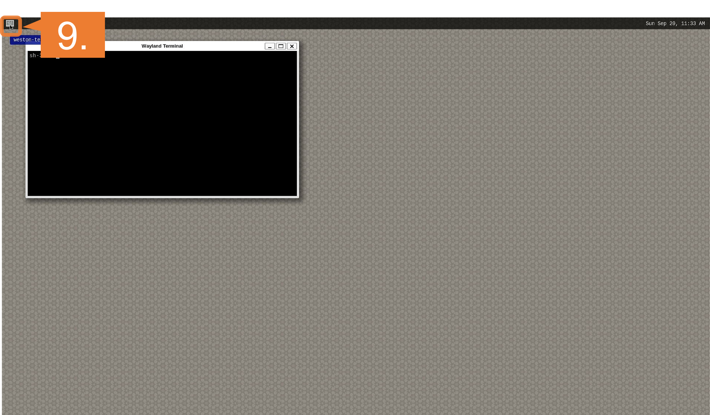
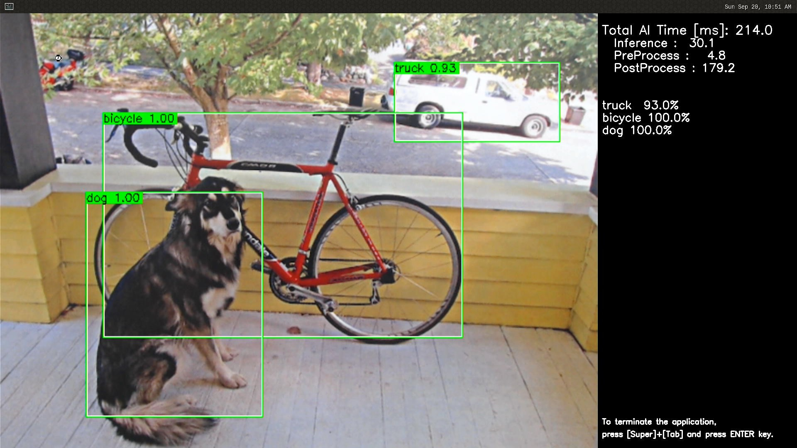

    

        

RZ/V2H EVK Getting Started
        

    

  WARNING
  
  <b>
  This page is published for Renesas internal purpose only. 
  Do NOT distribute/share this page to external parties. 
  Since this page is still under the review process, the content may change in the official release. 
     
  Due to the necessary software unavailability (i.e., DRP-AI TVM, AI Applications),  
  you can only run following steps with this internal release. 
  <ul>
    <li>
      Step 2: Obtain necessary environment
    </li>
    <li>
      Step 4: Extract RZ/V AI SDK package
    </li>
    <li>
      Step 7: Deploy AI Application.
        <ul>
          <li>
            1. Setup RZ/V2H EVK
          </li>
          <li>
            3. Boot RZ/V2H EVK
          </li>
        </ul>
    </li>
    <li>
      A4. Shutdown RZ/V2H EVK
    </li>
  </ul>
  </b>
  

 
 

<h5>This page explains how to start-up the AI SDK on the <b>RZ/V2H Evaluation Board Kit</b>.</h5>

<h5>Supported version: <b>RZ/V2H AI SDK v3.00</b></h5>

  
Terminology

  <quotedoc id="reference_terminology"></quotedoc>

 

<h3>Getting Started Flow</h3>

  

    

      This page explains RZ/V2H EVK dependent instructions. 
      Common instructions are explained in <a href="{{ site.url }}{{ site.baseurl }}"> Getting Started</a> page. 
      
       
    

  

<h3 id="intro" >Introduction</h3>

  

    

      <h4 class="u_line" >Prerequisites</h4>
      

        

          

            Before reading this document, users are required to read <a href="{{ site.url }}{{ site.baseurl }}">Getting Started</a>. 
            <a class="btn btn-secondary square-button ms-3 mt-1" style="text-align:left;" href="{{ site.url }}{{ site.baseurl }}" role="button">
              Getting Started 
              
              What kind of equipment is necessary? 
              How can I get RZ/V AI SDK? 
              How can I setup RZ/V AI SDK? 
              How can I build AI Applications source code? 
              
            </a>
          

        

      

    

    

      <h4 class="u_line" >RZ/V2H EVK</h4>
      

        

          

            The RZ/V2H EVK is the ideal board kit for RZ/V2H evaluation. 
              
            MIPI camera module is not included in EVK.
             
            As an input device, AI Applications support USB camera with VGA (640x480) resolution.
             
            To use MIPI camera, please refer to e-CAM22_CURZH camera provided by <a href="https://www.e-consystems.com/renesas/sony-starvis-imx462-ultra-low-light-camera-for-renesas-rz-v2h.asp">e-con Systems</a>. 
             
            e-CAM22_CURZH camera supports FHD (1920x1080) resolution.
              
          

          

            
          

        

        

          

            Following items are included in the RZ/V2H EVK.
             
             
            <table class="gstable">
              <tr>
                <th>Equipment</th>
                <th>Details</th>
              </tr>
              <tr>
                <td>RZ/V2H Evaluation Board</td>
                <td>Evaluation board itself.</td>
              </tr>
            </table>
          

        

      

    

  

 
 

  

    

      <h3 id="step7" >Step 7: Deploy AI Application</h3>
      This section explains how to deploy the AI Application to the RZ/V2H EVK.
       
       
      

        Before reading this step
        Users are required to read Step 1~6 of <a href="{{ site.url }}{{ site.baseurl }}">Getting Started</a>. 
        <a class="btn btn-secondary square-button ms-3 mt-1" style="text-align:left;" href="{{ site.url }}{{ site.baseurl }}" role="button">
          Getting Started Step 1~6 
          
            What kind of equipment is necessary? 
            Where to get RZ/V AI SDK? 
            How can I setup RZ/V AI SDK? 
            How can I build AI Applications source code? 
          
        </a>
      

       
      To boot the board, bootloader and other Linux necessary files are required. 
      Following bootloader is available on RZ/V2H AI SDK. 
      <ul>
        <li>
          <b>eSD Bootloader</b>: The board boots up using the bootloader written on microSD card.
        </li>
      </ul>
      Other necessary files, i.e. Linux kernel and root filesystem, are stored on microSD card. 
      You can use Linux PC to format the microSD card and expand the kernel and the root filesystem using SD card reader. 
      
       
       
      <h4 id="step7-1" class="u_line">1. Setup RZ/V2H EVK </h4>
      microSD card needs to contain bootloaders, the Linux kernel and root filesystem to boot-up the board. 
      RZ/V2H AI SDK supports the WIC format for SD card image. 
      You can use Linux PC to write the SD card image into microSD card with SD card reader. 
      

        Note
        This step is required only when starting the AI SDK or when using the new version of AI SDK. 
        If you have already setup the microSD card with the latest bootloader, Linux kernel, Linux device tree file and root filesystem, skip this step and proceed to <a href="#step7-2">the next procedure (2. Deploy Application to the Board)</a>.
      

      

        Note
        The size of WIC format SD card image is 4GB. 
        If you would like to expand the SD card image size, please build the RZ/V2H AI SDK Source Code according to <a href="">Appendix 2 in How to Build RZ/V2H AI SDK (Link not available)</a>.
      

      <ol>
        <h5 id="step7-1a">
          <li type="A">Install Necessary Software </li>
        </h5>
        As explained in <a href="{{ site.url }}{{ site.baseurl }}#step2">Necessary Software of Getting Started Step 2</a>, make sure that <code>bmap-tools</code> is installed on Linux PC. 
        If you have not installed the <code>bmap-tools</code>, install it using following command on Host PC (Not in the docker container). 

sudo apt install bmap-tools

         
        <h5 id="step7-1b">
          <li type="A">Write the Linux files to SD card</li>
        </h5>
        Run the below command to decompress <code>${WORK}/board_setup/eSD.zip</code>. 

cd ${WORK}/board_setup
unzip eSD.zip

        Following files are necessary. 
        They are in the <code>${WORK}/board_setup/eSD</code> directory.
          
        <table class="gstable">
          <tr>
            <th>File</th>
            <th>Description</th>
          </tr>
          <tr>
            <td>core-image-weston-rzv2h-evk-ver1.wic.bmap</td>
            <td rowspan="2">SD card image</td>
          </tr>
          <tr>
            <td>core-image-weston-rzv2h-evk-ver1.wic.gz</td>
          </tr>
        </table>
        Follow the instruction below to prepare the microSD card. 
        

          Warning
            Here, we use "<b><code>/dev/sdb</code></b>" as microSD card device name.
        

        <ol>
          <li>To use bmaptools, microSD card partitions must be unmounted. 
            Run the following command to check the automatically mounted microSD card partitions. 

df -h

          </li>
          <li>
            Check the output and find the mount point, which is "<code>/media/user/9016-4EF8</code>" in the following example.

Filesystem      Size  Used Avail Use% Mounted on
:
snip
:
/dev/sdb1        15G   32K   15G   1% /media/user/9016-4EF8

            

              Warning
              Here, we use "<b><code>/dev/sdb</code></b>" as microSD card device name.
            

          </li>
          <li>
            Unmount the automatically mounted partitions.

sudo umount /media/user/9016-4EF8

            

              Note
              If there are more than one partitions on microSD card, unmount all partitions.
            

          </li>
          <li>Run the following command to write SD card image. 

cd ${WORK}/board_setup/eSD
sudo bmaptool copy --bmap core-image-weston-rzv2h-evk-ver1.wic.bmap core-image-weston-rzv2h-evk-ver1.wic.gz /dev/sdb

            

              Warning
              Change <code>/dev/sdb</code> to your microSD card device name. 
            

          </li>
          <li>
            Eject microSD card and insert it again to mount the partitions.  
          </li>
          <li>
            Run the following command to check two partitions are created on microSD card. 

df -h

            <ul>
              <li>
                If the command shows following log, two partitions are created on microSD card successfully. 

Filesystem      Size  Used Avail Use% Mounted on
:
snip
:
/dev/sdb1        17M  3.0M   14M  18% /media/user/bootloaderf
/dev/sdb2       3.8G  1.6G  2.0G  45% /media/user/root

                

                  Warning
                  Here, we use "<b><code>/dev/sdb</code></b>" as microSD card device name.
                

              </li>
            </ul>
          </li>
          <li>Run the following commands to setup the partition 2, which is the root filesystem of the board. 

sudo mkdir /mnt/sd -p
sudo mount /dev/sdb2 /mnt/sd
sudo cp $WORK/ai_sdk_setup/data/libtvm_runtime.so /mnt/sd/usr/lib64
sync
sudo umount /mnt/sd

            

              Warning
              Change <code>/dev/sdb</code> to your microSD card device name. 
            

            

            Note
            If you would like to eject the microSD card, please run following command and remove the microSD card from Linux PC.
             

sudo eject /dev/sdb

            

              Warning
              Change <code>/dev/sdb</code> to your microSD card device name. 
            

          

          </li>
        </ol>
      </ol>
       
      <h4 id="step7-2" class="u_line">2. Deploy Application to the Board</h4>
      This section explains how to copy the <a href="#step6">application binary created in Step 6</a> to the board. 
      Users are expected to have finished the instructions in <a href="#step7"> Setup RZ/V2H EVK in Step 7-1</a>.
       
       
      <ol>
        <li>
          Insert the microSD card to Linux PC.
        </li> 
        <li>
          Run the following command to mount the partition 2, which contains the root filesystem. 

sudo mount /dev/sdb2 /mnt/sd

          

            Warning
            Change <code>/dev/sdb</code> to your microSD card device name. 
          

        </li>
        <li>
          Create the application directory on root filesystem.

sudo mkdir /mnt/sd/home/root/tvm

          

            Note
            Directory name <code>tvm</code> can be determined by user. 
          

        </li>
        <li>
          Copy the necessary files in execution environment. 
          Check the <code>README.md</code> document provided in application directory and follow the instruction in the chapter called <b>"Application: Deploy Stage"</b> (or similar) to deploy the application.
            
          

            <u><b>Example:</b></u> 
            In <a href="https://github.com/renesas-rz/rzv_ai_sdk/tree/v{{ site.version }}/R01_object_detection">R01_object_detection</a> application, follow the instruction in <a href="https://github.com/renesas-rz/rzv_ai_sdk/tree/v{{ site.version }}/R01_object_detection#application-deploy-stage">here</a> to find files to be copied.
          

           
          Use the following command to copy the files to root filesystem.
            

sudo cp $WORK/ai_sdk_setup/data/<Path to target file>/<filename> /mnt/sd/home/root/tvm 

           
        </li>
        <li>
          Run the following command to sync the data with memory.
           

sync 

        </li>
        <li>
          Run the following command to unmount the partition 2.
           

sudo umount /mnt/sd

        </li>
        <li>
          Eject the microSD card by running the following command and remove the microSD card from Linux PC. 

sudo eject /dev/sdb

          

            Warning
            Change <code>/dev/sdb</code> to your microSD card device name. 
          

        </li>
      </ol>
       
      <h4 id="step7-3" class="u_line">3. Boot RZ/V2H EVK</h4>
      This section explains how to boot the RZ/V2H EVK. 
       
      Follow the instruction below to boot the board.
       
      

        

          

            <ol>
              <li>
                Insert the microSD card to the <b>Board</b>.
                

                  Note
                  Use the microSD card slot <b>SD1</b> on the <b>Board</b> as shown in the figure.
                

              </li> 
              <li>Change DSW1 and DSW2 setting as shown in the figure.</li> 
              <li>Connect the USB mouse and USB keyboard and USB camera via USB hub. 
                

                  Note
                  There are USB 2.0 port and USB 3.0 port on RZ/V2H EVK. 
                  Please connect your USB camera to appropriate port according to its requirement. 
                  Here, USB camera is connected to USB 2.0 via USB hub. 
                

              </li> 
              <li>Connect the HDMI monitor to the <b>Board</b>.</li> 
              <li>Connect the power cable to the <b>Board</b>.</li> 
              <li>Turn the SW3 to ON.</li> 
              <li>Turn the SW2 to ON to power on the <b>Board</b></li>
            </ol>
          

          

            
          

        
  
         
        

          

            <ol>
              <li value = "8">After the boot-up, following screen will be displayed on HDMI monitor.</li>
            </ol>
          

          

            
          

        

        

          

            <ol>
              <li value = "9">Click the icon at the top-left corner to open the terminal.</li>
            </ol>
          

          

            
          

        

         
        After the boot up, please go back to <a href="{{ site.url }}{{ site.baseurl }}#step8">Getting Started Step 8</a> or proceed directly to <a href="#step8">RZ/V2H EVK Getting Started Step 8</a>.
          
      

    

  

  

    

      <h3 id="step8" >Step 8: Run AI Application</h3>
      

        Before reading this step
        Users are required to read Step 7 of <a href="#step7">RZ/V2H EVK Getting Started</a>. 
        <a class="btn btn-secondary square-button ms-3 mt-1" style="text-align:left;" href="#step7" role="button">
          RZ/V2H EVK Getting Started Step 7 
          
          How can I setup microSD card for eSD Bootloader? 
          How can I deploy applications to the board? 
          How can I boot the board? 
          
        </a>
      

      <ol>
        <li>
          Follow the instructions explained in the document (<code>README.md</code>) of applications on GitHub.
            
          

            <u><b>Example:</b></u> 
            For <a href="https://github.com/renesas-rz/rzv_ai_sdk/tree/v{{ site.version }}/R01_object_detection">R01_object_detection</a> application, follow the instruction <a href="https://github.com/renesas-rz/rzv_ai_sdk/tree/v{{ site.version }}/R01_object_detection#application-run-stage">here</a> to run the application.
             
            If you have successfully run the application, you will see following window on HDMI screen.
              
            
          

           
        </li>
      </ol>
      

        Note
        To shutdown the board safely, please refer to <a href="{{ site.url }}{{ site.baseurl }}#A4">A4. Shutdown RZ/V2H EVK</a>
      

    

  

  

  

    

      <h4 class="u_line">This is the end of RZ/V2H EVK Getting Started.</h4>
      To see what comes next, please refer to the Getting Started Ending. 
      <a class="btn btn-secondary square-button ms-3 mt-1" style="text-align:left;" href="{{ site.url }}{{ site.baseurl }}#ending" role="button">
        Getting Started Ending 
        
        What is the next step of Getting Started? 
        
      </a>
    

  

 

  

    

      <a class="btn btn-secondary square-button" href="{{ site.url }}{{ site.baseurl }}#page-top" role="button">
Back to Top >
      </a>
    

  

