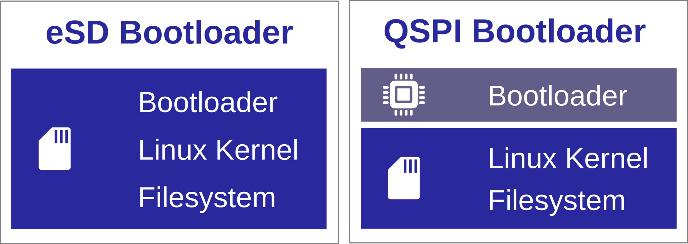
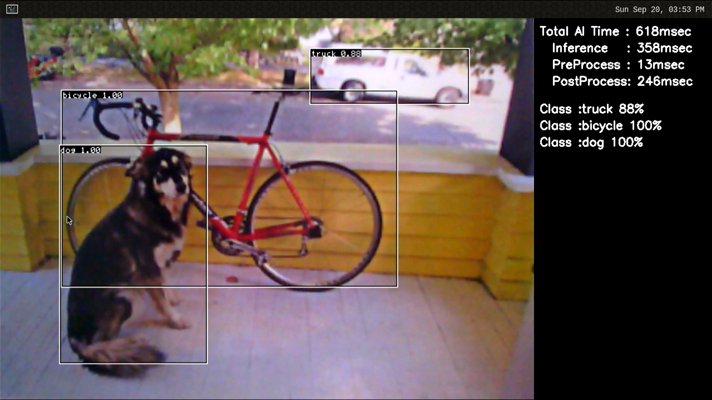

    

        

RZ/V2L EVK Getting Started
        

    

 
 
<h5>This page explains how to start-up the AI SDK on the <b>RZ/V2L Evaluation Board Kit</b>.</h5>

<h5>Supported version: <b>RZ/V2L AI SDK v2.10</b></h5>

  
Terminology

<quotedoc id="reference_terminology"></quotedoc>

 

<h3>Getting Started Flow</h3>

  

    

        This page explains RZ/V2L EVK dependent instructions. 
        Common instructions are explained in <a href="{{ site.url }}{{ site.baseurl }}"> Getting Started</a> page. 
        
         
    

  

<h3 id="intro" >Introduction</h3>

  

    

      <h4 class="u_line" >Prerequisites</h4>
      

        

          

            Before reading this document, users are required to read <a href="{{ site.url }}{{ site.baseurl }}">Getting Started</a>. 
            <a class="btn btn-secondary square-button ms-3 mt-1" style="text-align:left;" href="{{ site.url }}{{ site.baseurl }}" role="button">
              Getting Started 
              
              What kind of equipment is necessary? 
              How can I get RZ/V AI SDK? 
              How can I setup RZ/V AI SDK? 
              How can I build AI Applications source code? 
              
            </a>
          

        

      

    

    

      <h4 class="u_line" >RZ/V2L EVK</h4>
      

        

          

            The RZ/V2L EVK is the ideal board kit for RZ/V2L evaluation. 
              
            Since MIPI camera module is included, you can start evaluating RZ/V2L immediately by building an environment.  
              
          

          

            
          

        

        

          

            Following items are included in the RZ/V2L EVK.
             
             
            <table class="gstable">
              <tr>
                <th>Equipment</th>
                <th>Details</th>
              </tr>
              <tr>
                <td>RZ/V2L Evaluation Board</td>
                <td>Evaluation board itself.</td>
              </tr>
              <tr>
                <td>MIPI Camera Module</td>
                <td>Google Coral Camera. 
                <h6 class="mb-1">Note that the CMOS sensor (OV5645) in the camera is <b>no longer available</b>, and should not be used for mass production.  Any software support provided is for evaluation purposes only.</h6></td>
              </tr>
              <tr>
                <td>MicroUSB to Serial Cable</td>
                <td>For serial communication between PC and the board.</td>
              </tr>
            </table>
          

        

      

    

  

 
 

  

    

      <h3 id="step7" >Step 7: Deploy AI Application</h3>
      This section explains how to deploy the AI Application to the RZ/V2L EVK.
       
       
      

        Before reading this step
        Users are required to read Step 1~6 of <a href="{{ site.url }}{{ site.baseurl }}">Getting Started</a>. 
        <a class="btn btn-secondary square-button ms-3 mt-1" style="text-align:left;" href="{{ site.url }}{{ site.baseurl }}" role="button">
          Getting Started Step 1~6 
          
          What kind of equipment is necessary? 
          Where to get RZ/V AI SDK? 
          How can I setup RZ/V AI SDK? 
          How can I build AI Applications source code? 
          
        </a>
      

       
      To boot the board, bootloader and other Linux necessary files are required. 
      There are two types of bootloader available on RZ/V2L AI SDK. 
      <ul>
        <li>
          <b>eSD Bootloader</b>: The board boots up using the bootloader written on microSD card.
        </li>
        <li>
          <b>eMMC Bootloader</b>: The board boots up using the bootloader written in eMMC on the board.
        </li>
      </ul>
      Other necessary files, i.e. Linux kernel and root filesystem, are stored on microSD card. 
      You can use Linux PC to format the microSD card and expand the kernel and the root filesystem using SD card reader. 
      
       
       
      <h4 id="step7prep" class="u_line" >Preparation</h4>
      

        Click the button
        This step contains both eSD and eMMC Bootloader explanation. 
        Please click the button below to update the explanation according to your bootloader interface. 
        

          eSD Bootloader
          eMMC Bootloader
        

        

          For eSD
          eSD explanation will be shown in this style if you click "eSD Bootloader" button above.
        

        

          For eMMC
          eMMC explanation will be shown in this style if you click "eMMC Bootloader" button above.
        

      

       
      <h4 id="step7-1" class="u_line">1. Setup RZ/V2L EVK </h4>
      

        

          For eSD
          microSD card needs to contain bootloaders, the Linux kernel and root filesystem to boot-up the board. 
          You can use Linux PC to format the microSD card and expand the kernel and the root filesystem using SD card reader. 
        

        

          Note
          This step is required only when starting the AI SDK or when using the new version of AI SDK. 
          If you have already setup the microSD card with the latest bootloader, Linux kernel, Linux device tree file and root filesystem, skip this step and proceed to <a href="#step7-2">the next procedure (2. Deploy Application to the Board)</a>.
        

      

      

        

          For eMMC
          microSD card needs to contain the Linux kernel and root filesystem to boot-up the board. 
          You can use Linux PC to format the microSD card and expand the kernel and the root filesystem using SD card reader. 
          Bootloaders must be written in eMMC on the board.
          You can use Windows PC to write the bootloaders on eMMC.
        

        

          Note
          This step is required only when starting the AI SDK or when using the new version of AI SDK. 
          If you have already setup the microSD card and the bootloader written in eMMC on the board, skip this step and proceed to <a href="#step7-2">the next procedure (2. Deploy Application to the Board)</a>. 
        

      

      <ol>
        <h5 id="step7-1a">
          <li type="A">Format SD card </li>
        </h5>
        Create the following partitions on microSD card according to <a href="{{ site.url }}{{ site.baseurl }}#A2">Appendix: A2. Format SD card</a>. 
        

          For eSD
          <table class="gstable">
            <tr>
              <th>Type/Number</th>
              <th>Size</th>
              <th>Type of Filesystem</th>
              <th>Contents</th>
            </tr>
            <tr>
              <td>Primary #1</td>
              <td>500MB (minimum 128MB)</td>
              <td>Ext4</td>
              <td>Linux kernel Device tree</td>
            </tr>
            <tr>
              <td>Primary #2</td>
              <td>All remaining</td>
              <td>Ext4</td>
              <td>Root filesystem</td>
            </tr>
          </table>
        

        

          For eMMC
          <table class="gstable">
            <tr>
              <th>Type/Number</th>
              <th>Size</th>
              <th>Type of Filesystem</th>
              <th>Contents</th>
            </tr>
            <tr>
              <td>Primary #1</td>
              <td>500MB (minimum 128MB)</td>
              <td>FAT32</td>
              <td>Linux kernel Device tree</td>
            </tr>
            <tr>
              <td>Primary #2</td>
              <td>All remaining</td>
              <td>Ext4</td>
              <td>Root filesystem</td>
            </tr>
          </table>
        

         
        <h5 id="step7-1b">
          <li type="A">Write the Linux files to SD card</li>
        </h5>
        

          For eSD
          At first, run the below command to decompress <code>${WORK}/board_setup/eSD.zip</code>. 


cd ${WORK}/board_setup
unzip eSD.zip

          Following three files are necessary, which must be placed on each partitions on microSD card. 
          They are in the <code>${WORK}/board_setup/eSD</code> directory.
            
          <table class="gstable">
            <tr>
              <th>File</th>
              <th>Description</th>
              <th>microSD card partition</th>
            </tr>
            <tr>
              <td>Image-smarc-rzv2l.bin</td>
              <td>Linux kernel image (The boot program) </td>
              <td>Partition 1</td>
            </tr>
            <tr>
              <td>Image-r9a07g054l2-smarc.dtb </td>
              <td>Linux device tree file (The configuration file for booting) </td>
              <td>Partition 1</td>
            </tr>
            <tr>
              <td>core-image-weston-smarc-rzv2l.tar.bz2</td>
              <td>Linux Root filesystem</td>
              <td>Partition 2</td>
            </tr>
          </table>
          Follow the instruction below to prepare the microSD card. 
          

            Warning
              Here, we use "<b><code>/dev/sdb</code></b>" as microSD card device name.
          

          <ol>
            <li>Check if the two partitions are created successfully by running <code>df</code> command. 

df -h
Filesystem 	Size		Used	Avail	Use %	Mounted on	
…		…		…	…	…	…
/dev/sdb1		…		…	…	…	…	
/dev/sdb2		…		…	…	…	…	

              

                  Warning
                  Device name of microSD card, <code>/dev/sdb</code> may differ depending on your environment. 
              

            </li>
             
            <li>Run the following commands to setup the partition 1. 

sudo mkdir -p /mnt/sd
sudo mount /dev/sdb1 /mnt/sd
sudo cp $WORK/board_setup/eSD/Image-smarc-rzv2l.bin /mnt/sd
sudo cp $WORK/board_setup/eSD/Image-r9a07g054l2-smarc.dtb /mnt/sd
sync
sudo umount /mnt/sd

              

                Warning
                Change <code>/dev/sdb</code> to your microSD card device name. 
              

            </li>
            <li>Run the following commands to setup the partition 2, which is the root filesystem of the board. 

sudo mount /dev/sdb2 /mnt/sd
sudo tar xfj $WORK/board_setup/eSD/core-image-weston-smarc-rzv2l.tar.bz2 -C /mnt/sd
sudo cp $WORK/ai_sdk_setup/data/libtvm_runtime.so /mnt/sd/usr/lib64
sync
sudo umount /mnt/sd

              

                Warning
                Change <code>/dev/sdb</code> to your microSD card device name. 
              

            </li>
          </ol>
        

        

          For eMMC
          Following three files are necessary, which must be placed on each partitions on microSD card. 
          They are in the <code>${WORK}/board_setup/eMMC</code> directory.
            
          <table class="gstable">
            <tr>
              <th>File</th>
              <th>Description</th>
              <th>microSD card partition</th>
            </tr>
            <tr>
              <td>Image-smarc-rzv2l.bin</td>
              <td>Linux kernel image (The boot program) </td>
              <td>Partition 1</td>
            </tr>
            <tr>
              <td>Image-r9a07g054l2-smarc.dtb </td>
              <td>Linux device tree file (The configuration file for booting) </td>
              <td>Partition 1</td>
            </tr>
            <tr>
              <td>core-image-weston-smarc-rzv2l.tar.bz2</td>
              <td>Linux Root filesystem</td>
              <td>Partition 2</td>
            </tr>
          </table>
          <ol>
            <li>Run the below command to decompress <code>${WORK}/board_setup/eMMC.zip</code>. 


cd ${WORK}/board_setup
unzip eMMC.zip

            </li>
            <li>Insert the microSD card to Linux PC.
            </li> 
            <li>
              Check if the two partitions are created successfully by running <code>df</code> command. 

df -h
Filesystem 	Size		Used	Avail	Use %	Mounted on	
…		…		…	…	…	…
/dev/sdb1		…		…	…	…	…	
/dev/sdb2		…		…	…	…	…	

              

                Warning
                Device name of microSD card, <code>/dev/sdb</code>, may differ depending on your environment.
              

            </li> 
            <li>
              Run the following commands to setup the partition 1. 

sudo mkdir -p /mnt/sd
sudo mount /dev/sdb1 /mnt/sd
sudo cp $WORK/board_setup/eMMC/Image-smarc-rzv2l.bin /mnt/sd
sudo cp $WORK/board_setup/eMMC/Image-r9a07g054l2-smarc.dtb /mnt/sd
sync
sudo umount /mnt/sd

              

                Warning
                Change <code>/dev/sdb</code>, to your microSD card device name.
              

            </li> 
            <li>Run the following commands to setup the partition 2, which is the root filesystem of the board.

sudo mount /dev/sdb2 /mnt/sd
sudo tar xfj $WORK/board_setup/eMMC/core-image-weston-smarc-rzv2l.tar.bz2 -C /mnt/sd
sudo cp $WORK/ai_sdk_setup/data/libtvm_runtime.so /mnt/sd/usr/lib64
sync
sudo umount /mnt/sd

              

                Warning
                Change <code>/dev/sdb</code>, to your microSD card device name.
              

               
              

                Note
                If you would like to eject the microSD card, please run following command and remove the microSD card from Linux PC.
                 

sudo eject /dev/sdb

                

                  Warning
                  Change <code>/dev/sdb</code> to your microSD card device name. 
                

              

            </li>
          </ol>
        

      <h5 id="step7-1c">
        <li type="A">
          
          Write the bootloaders to SD card
          
          
          Write the bootloaders to eMMC
          
        </li>
      </h5>
      

        

          For eSD
            Before booting up the board, you must write the latest bootloaders to microSD card. 
            This procedures needs to be done only once as long as you use the same version of AI SDK. 
             
            There are three files in <code>${WORK}/board_setup/eSD/bootloader</code> to boot up the board. 
            <ul>
              <li><code>bl2_bp_esd-smarc-rzv2l_pmic.bin</code></li>
              <li><code>bl2_bp-smarc-rzv2l_pmic.srec</code></li>
              <li><code>fip-smarc-rzv2l_pmic.srec</code></li>
            </ul>
             
            Run the following commands to write these files to the microSD card to boot for eSD. 

cd ${WORK}/board_setup/eSD/bootloader
sudo dd if=bl2_bp_esd-smarc-rzv2l_pmic.bin of=/dev/sdb seek=1 count=1
sudo dd if=bl2-smarc-rzv2l_pmic.bin of=/dev/sdb seek=8
sudo dd if=fip-smarc-rzv2l_pmic.bin of=/dev/sdb seek=128
sync

            

              Warning
              Change <code>/dev/sdb</code>, to your microSD card device name. 
            

             
            

              Note
              If you would like to eject the microSD card, please run following command and remove the microSD card from Linux PC.
               

sudo eject /dev/sdb

              

                Warning
                Change <code>/dev/sdb</code> to your microSD card device name. 
              

            

          

        

        

          

            For eMMC
            Please write the bootloaders to eMMC on the board according to <a href="{{ site.url }}{{ site.baseurl }}#A1">Appendix: A1.Setup for eMMC Bootloader</a>.
          

        

      </ol>
       
      <h4 id="step7-2" class="u_line">2. Deploy Application to the Board</h4>
        This section explains how to copy the <a href="{{ site.url }}{{ site.baseurl }}#step6">application binary created in Getting Started Step 6</a> to the board. 
        Users are expected to have finished the instructions in <a href="#step7"> Setup RZ/V2L EVK in Step 7-1</a>.
         
         
        <ol>
          <li>Insert the microSD card to Linux PC.
          </li> 
          <li>Run the following command to mount the partition 2, which contains the root filesystem. 

sudo mount /dev/sdb2 /mnt/sd

            

              Warning
              Change <code>/dev/sdb</code> to your microSD card device name. 
            

          </li>
          <li>Create the application directory on root filesystem.

sudo mkdir /mnt/sd/home/root/tvm

            

              Note
              Directory name <code>tvm</code> can be determined by user. 
            

          </li>
          <li>Copy the necessary files in execution environment. 
            Select the appropriate option below based on the application type explained in <a href="#build-instruction">Building instructions in Step 6</a>.
              
            
<b>Option 1: &lt;Application 1&gt;</b>

            Check the <code>README.md</code> document provided in application directory and follow the instruction in the chapter called <b>"Application: Deploy Stage"</b> (or similar) to deploy the application.
              
            

              <u><b>Example:</b></u> 
              In <a href="https://github.com/renesas-rz/rzv_ai_sdk/tree/v5.00pre/R01_object_detection">R01_object_detection</a> application, follow the instruction in <a href="https://github.com/renesas-rz/rzv_ai_sdk/tree/v5.00pre/R01_object_detection#application-deploy-stage">here</a> to find files to be copied.
            

             
            Use the following command to copy the files to root filesystem.
              

sudo cp $WORK/ai_sdk_setup/data/<Path to target file>/<filename> /mnt/sd/home/root/tvm 

             
            
<b>Option 2: &lt;Application 2&gt;</b>

            Run the following command to copy the whole repository to the root filesystem.
              

sudo cp $WORK/ai_sdk_setup/data/<Path to repository>/RZV2L_AiLibrary /mnt/sd/home/root/tvm -r

          </li>
          <li>Run the following command to sync the data with memory.
             

sync 

          </li>
          <li>Run the following command to unmount the partition 2.
             

sudo umount /mnt/sd

          </li>
          <li>Eject the microSD card by running the following command and remove the microSD card from Linux PC. 

sudo eject /dev/sdb

            

              Warning
              Change <code>/dev/sdb</code> to your microSD card device name. 
            

          </li>
        </ol>
         
      <h4 id="step7-3" class="u_line">3. Boot RZ/V2L EVK</h4>
      This section explains how to boot the RZ/V2L EVK. 
      

        eSD Bootloader
        eMMC Bootloader
      

       
      Follow the instruction below to boot the board.
       
      

        For eSD
        <reference3>
          

            

              

                <ol>
                  <li>
                    Insert the microSD card to the <b>Board</b>.
                    

                      Note
                      Use the microSD card slot <b>CN3</b> as shown in the figure.
                    

                  </li> 
                  <li>Change SW1 and SW11 setting as shown in the figure.</li> 
                  <li>Connect the USB mouse and USB keyboard via USB hub.</li> 
                  <li>Connect the <b>Google Coral camera</b> to the <b>Board</b>.</li> 
                  <li>Connect the HDMI monitor to the <b>Board</b>.</li> 
                  <li>Connect the power cable to the <b>Board</b>.</li> 
                  <li>Press power button for 1 second to turn on the board.</li>
                </ol>
              

              

                
              

            
  
            

              

                <ol>
                  <li value = "8">After the boot-up, following screen will be displayed on HDMI monitor.</li>
                </ol>
              

              

                
              

            

            

              

                <ol>
                  <li value = "9">Click the icon at the top-left corner to open the terminal.</li>
                </ol>
              

              

                
              

            

          

        </reference3>
      

      

        For eMMC
        

          Note
          After bootloader is written and U-boot setting is changed, terminal emulator is no longer needed. 
          Users can detach the serial port connection. 
        

        

          

            

              <ol>
                <li>
                  Insert the microSD card to the <b>Board</b>.
                  

                    Note
                    Use the microSD card slot <b>CN10</b> as shown in the figure.
                  

                </li> 
                <li>Change SW1 and SW11 setting as shown in the figure.</li> 
                <li>Connect the USB mouse and USB keyboard via USB hub.</li> 
                <li>Connect the <b>Google Coral camera</b> to the <b>Board</b>.</li> 
                <li>Connect the HDMI monitor to the <b>Board</b>.</li> 
                <li>Connect the power cable to the <b>Board</b>.</li> 
                <li>Press power button for 1 second to turn on the board.</li>
              </ol>
            

            

              
            

          
  
          

            

              <ol>
                <li value = "8">After the boot-up, following screen will be displayed on HDMI monitor.</li>
              </ol>
            

            

              
            

          

          

            

              <ol>
                <li value = "9">Click the icon at the top-left corner to open the terminal.</li>
              </ol>
            

            

              
            

          

        

      

      After the boot up, please go back to <a href="{{ site.url }}{{ site.baseurl }}#step8">Getting Started Step 8</a> or proceed directly to <a href="#step8">RZ/V2L EVK Getting Started Step 8</a>.
        
      

    

  

  

    

      <h3 id="step8" >Step 8: Run AI Application</h3>
      

        Before reading this step
        Users are required to read Step 7 of <a href="#step7">RZ/V2L EVK Getting Started</a>. 
        <a class="btn btn-secondary square-button ms-3 mt-1" style="text-align:left;" href="#step7" role="button">
          RZ/V2L EVK Getting Started Step 7 
          
          How can I setup microSD card for eSD/eMMC Bootloader? 
          How can I deploy applications to the board? 
          How can I write eMMC Bootloader to the board? 
          How can I boot the board? 
          
        </a>
      

      <ol>
        <li>
          Follow the instructions explained in the document (<code>README.md</code>) of applications on GitHub.
            
          

            <u><b>Example:</b></u> 
            For <a href="https://github.com/renesas-rz/rzv_ai_sdk/tree/v5.00pre/R01_object_detection">R01_object_detection</a> application, follow the instruction <a href="https://github.com/renesas-rz/rzv_ai_sdk/tree/v5.00pre/R01_object_detection#application-run-stage">here</a> to run the application.
             
            If you have successfully run the application, you will see following window on HDMI screen.
              
            
          

           
        </li>
      </ol>
      

        Note
        To shutdown the board safely, please refer to <a href="{{ site.url }}{{ site.baseurl }}#A3">A3. Shutdown RZ/V2L EVK</a>
      

    

  

  

  

    

      <h4 class="u_line">This is the end of RZ/V2L EVK Getting Started.</h4>
      To see what comes next, please refer to the Getting Started Ending. 
      <a class="btn btn-secondary square-button ms-3 mt-1" style="text-align:left;" href="{{ site.url }}{{ site.baseurl }}#ending" role="button">
        Getting Started Ending 
        
        What is the next step of Getting Started? 
        
      </a>
    

  

 

  

    

      <a class="btn btn-secondary square-button" href="{{ site.url }}{{ site.baseurl }}#page-top" role="button">
Back to Top >
      </a>
    

  

