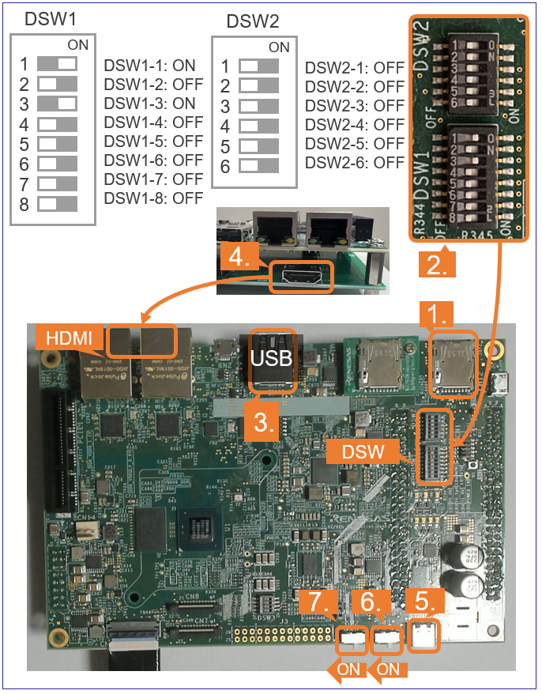

    

        

RZ/V2N EVK Getting Started
        

    

 
 
<h5>This page explains how to start-up the AI SDK on the <b>RZ/V2N Evaluation Board Kit</b>.</h5>

<h5>Supported version: <b>RZ/V2N AI SDK v6.00</b></h5>

  
Terminology

  <quotedoc id="reference_terminology"></quotedoc>

 

<h3>Getting Started Flow</h3>

  

    

      This page explains RZ/V2N EVK dependent instructions. 
      Common instructions are explained in <a href="{{ site.url }}{{ site.baseurl }}" target="_blank" rel="noopener noreferrer"> Getting Started</a> page. 
      
       
    

  

<h3 id="intro" >Introduction</h3>

  

    

      <h4 class="u_line" >Prerequisites</h4>
      

        

          

           Before reading this document, users are required to read <a href="{{ site.url }}{{ site.baseurl }}" target="_blank" rel="noopener noreferrer">Getting Started</a>. 
            <a class="btn btn-secondary square-button ms-3 mt-1" style="text-align:left;" href="{{ site.url }}{{ site.baseurl }}" role="button" target="_blank" rel="noopener noreferrer">
              Getting Started 
              
              What kind of equipment is necessary? 
              How can I get RZ/V AI SDK? 
              How can I setup RZ/V AI SDK? 
              How can I build AI Applications source code? 
              
            </a>
          

        

      

    

    

      <h4 class="u_line" >RZ/V2N EVK</h4>
      

        

          

            The RZ/V2N EVK is the ideal board kit for RZ/V2N evaluation. 
              
            MIPI camera module is not included in EVK.
             
            As an input device, AI Applications support USB camera with VGA (640x480) resolution.
             
            To use MIPI camera, please refer to e-CAM22_CURZH camera provided by <a href="https://www.e-consystems.com/renesas/sony-starvis-imx462-ultra-low-light-camera-for-renesas-rz-v2h.asp" target="_blank" rel="noopener noreferrer">e-con Systems</a>. 
             
            e-CAM22_CURZH camera supports FHD (1920x1080) resolution.
              
          

          

            
          

        

        

          

            Following items are included in the RZ/V2N EVK.
             
             
            <table class="gstable">
              <tr>
                <th>Equipment</th>
                <th>Details</th>
              </tr>
              <tr>
                <td>RZ/V2N Evaluation Board</td>
                <td>Evaluation board itself.</td>
              </tr>
            </table>
          

        

      

    

  

 
 

  

    

      <h3 id="step7" >Step 7: Deploy AI Application</h3>
      This section explains how to deploy the AI Application to the RZ/V2N EVK.
       
       
      

        Before reading this step
        Users are required to read Step 1~6 of <a href="{{ site.url }}{{ site.baseurl }}" target="_blank" rel="noopener noreferrer">Getting Started</a>. 
        <a class="btn btn-secondary square-button ms-3 mt-1" style="text-align:left;" href="{{ site.url }}{{ site.baseurl }}" role="button" target="_blank" rel="noopener noreferrer">
          Getting Started Step 1~6 
          
            What kind of equipment is necessary? 
            Where to get RZ/V AI SDK? 
            How can I setup RZ/V AI SDK? 
            How can I build AI Applications source code? 
          
        </a>
      

       
      To boot the board, bootloader and other Linux necessary files are required. 
      There are two types of bootloader available on RZ/V2N AI SDK. 
      <ul>
        <li>
          <b>eSD Bootloader</b>: The board boots up using the bootloader written on microSD card.
        </li>
        <li>
          <b>xSPI Bootloader</b>: The board boots up using the bootloader written in Flash ROM on the board.
        </li>
      </ul>
      Other necessary files, i.e. Linux kernel and root filesystem, are stored on microSD card. 
      You can use Linux PC to format the microSD card and expand the kernel and the root filesystem using SD card reader. 
       
      
       
      

        Note
        Regarding the eSD (Embedded SD) booting, please note the following:
        <ul class="mb-1">
          <li>The eSD boot procedure using microSD card described in this guide is for evaluation purposes only.</li>
          <li>If you use the eSD boot, please implement the eSD on your board according to the standard "SD Specification Part 1 eSD Addendum (version 2.10)".</li>
          <li>The reboot command cannot be used when using the eSD boot procedure using microSD card described in this guide.</li>
        </ul>
      

       
      <h4 id="step7prep" class="u_line" >Preparation</h4>
      

        Click the button
        This step contains both eSD and xSPI Bootloader explanation. 
        Please click the button below to update the explanation according to your bootloader interface. 
        

          eSD Bootloader
          xSPI Bootloader
        

        

          For eSD
          eSD explanation will be shown in this style if you click "eSD Bootloader" button above.
        

        

          For xSPI
          xSPI explanation will be shown in this style if you click "SPI Bootloader" button above.
        

      

       
      <h4 id="step7-1" class="u_line">1. Setup RZ/V2N EVK </h4>
      

        

          For eSD
          microSD card needs to contain bootloaders, the Linux kernel and root filesystem to boot-up the board. 
          RZ/V2N AI SDK supports the WIC format for SD card image. 
          You can use Linux PC to write the SD card image into microSD card with SD card reader. 
        

        

          Note
          This step is required only when starting the AI SDK or when using the new version of AI SDK. 
          If you have already setup the microSD card with the latest bootloader, Linux kernel, Linux device tree file and root filesystem, skip this step and proceed to <a href="#step7-2" target="_blank" rel="noopener noreferrer">the next procedure (2. Deploy Application to the Board)</a>.
        

      

      

        

          For xSPI
          microSD card needs to contain the Linux kernel and root filesystem to boot-up the board. 
          RZ/V2N AI SDK supports the WIC format for SD card image. 
          You can use Linux PC to write the SD card image into microSD card with SD card reader. 
          Bootloaders must be written in Flash ROM on the board.
          You can use Windows PC to write the bootloaders on Flash ROM.
        

        

          Note
          This step is required only when starting the AI SDK or when using the new version of AI SDK. 
          If you have already setup the microSD card and the bootloader written in Flash ROM on the board, skip this step and proceed to <a href="#step7-2" target="_blank" rel="noopener noreferrer">the next procedure (2. Deploy Application to the Board)</a>. 
        

      

      

        Note
        The size of WIC format SD card image is 16GB. 
        If you would like to expand the SD card image size, please build the RZ/V2N AI SDK Source Code according to <a href="{{ site.url }}{{ site.baseurl }}" target="_blank" rel="noopener noreferrer">How to Build RZ/V2N AI SDK</a>.
      

      <ol>
        <h5 id="step7-1a">
          <li type="A">Install Necessary Software </li>
        </h5>
        As explained in <a href="{{ site.url }}{{ site.baseurl }}#step2" target="_blank" rel="noopener noreferrer">Necessary Software of Getting Started Step 2</a>, make sure that <code>bmap-tools</code> is installed on Linux PC. 
        If you have not installed the <code>bmap-tools</code>, install it using following command on Host PC (Not in the docker container). 

sudo apt install bmap-tools

         
        <h5 id="step7-1b">
          <li type="A">Write the Linux files to SD card</li>
        </h5>
        

          For eSD
          Run the below command to decompress <code>${WORK}/board_setup/eSD.zip</code>. 

cd ${WORK}/board_setup
unzip eSD.zip

        Following files are necessary. 
        They are in the <code>${WORK}/board_setup/eSD</code> directory.
          
        

        

          For xSPI
          Run the below command to decompress <code>${WORK}/board_setup/xSPI.zip</code>. 

cd ${WORK}/board_setup
unzip xSPI.zip

        Following files are necessary. 
        They are in the <code>${WORK}/board_setup/xSPI</code> directory.
          
        

        <table class="gstable">
          <tr>
            <th>File</th>
            <th>Description</th>
          </tr>
          <tr>
            <td>core-image-weston-rzv2n-evk.rootfs.wic.bmap</td>
            <td rowspan="2">SD card image</td>
          </tr>
          <tr>
            <td>core-image-weston-rzv2n-evk.rootfs.wic.gz</td>
          </tr>
        </table>
        Follow the instruction below to prepare the microSD card. 
        <ol>
          <li>Before inserting the microSD card to your Linux PC, open the terminal on Linux PC and run the following command to check the devices without microSD card. 

lsblk

            Following is the example output. 

NAME MAJ:MIN RM SIZE RO TYPE MOUNTPOINT
sda 8:0 0 30.9G 0 disk
├─sda1 8:1 0 512M 0 part /boot/efi
├─sda2 8:2 0 1K 0 part
└─sda5 8:5 0 30.3G 0 part /
sr0 11:0 1 1024M 0 rom

          </li> 
          <li>Insert the microSD card to your Linux PC and run the following command again. 

lsblk

          </li> 
          <li>Check the output and confirm the name appeared. This would be your microSD card device name. 
            <ul>
              <li>Following is the example output. 

NAME MAJ:MIN RM SIZE RO TYPE MOUNTPOINT
sda 8:0 0 30.9G 0 disk
├─sda1 8:1 0 512M 0 part /boot/efi
├─sda2 8:2 0 1K 0 part
└─sda5 8:5 0 30.3G 0 part /
sdb 8:16 1 29.7G 0 disk
└─sdb1 8:17 1 29.7G 0 part
sr0 11:0 1 1024M 0 rom

              </li> 
              <li>In this case, followings are your microSD card configuration.
                <ul>
                  <li><b><code>/dev/sdb</code></b>: The device name for the entire microSD card.
                  </li>
                  <li><b><code>/dev/sdb1</code></b>: The paritition name in microSD card.  There may be multiple <code>sdb*</code> depending on the microSD card.
                  </li>
                </ul>
                

                  Warning
                  Be careful not to use the name of other device since it may destruct your computer filesystem.
                

              </li>
            </ul>
          </li> 
          <li>To use bmaptools, microSD card partitions must be unmounted. 
            Run the following command to check the automatically mounted microSD card partitions. 

df -h

          </li>
          <li>
            Check the output and find the mount point, which is "<code>/media/user/9016-4EF8</code>" in the following example.

Filesystem      Size  Used Avail Use% Mounted on
:
snip
:
/dev/sdb1        15G   32K   15G   1% /media/user/9016-4EF8

            

              Warning
              Here, we use "<b><code>/dev/sdb</code></b>" as microSD card device name.
            

          </li>
          <li>
            Unmount the automatically mounted partitions.

sudo umount /media/user/9016-4EF8

            

              Note
              If there are more than one partitions on microSD card, unmount all partitions.
            

          </li>
          <li>Run the following command to write SD card image. 
            

              For eSD

cd ${WORK}/board_setup/eSD
sudo bmaptool copy --bmap core-image-weston-rzv2n-evk.rootfs.wic.bmap core-image-weston-rzv2n-evk.rootfs.wic.gz /dev/sdb

            

            

              For xSPI

cd ${WORK}/board_setup/xSPI
sudo bmaptool copy --bmap core-image-weston-rzv2n-evk.rootfs.wic.bmap core-image-weston-rzv2n-evk.rootfs.wic.gz /dev/sdb

            

            

              Warning
              Change <code>/dev/sdb</code> to your microSD card device name. 
            

          </li>
          <li>
            Eject microSD card and insert it again to mount the partitions.  
          </li>
          <li>
            Run the following command to check two partitions are created on microSD card. 

df -h

            <ul>
              <li>
                If the command shows following log, two partitions are created on microSD card successfully. 

Filesystem      Size  Used Avail Use% Mounted on
:
snip
:
/dev/sdb1        18M  3.9M   15M   22% /media/user/bootloader
/dev/sdb2        12G  2.4G   8.9G  22% /media/user/root

                

                  Warning
                  Here, we use "<b><code>/dev/sdb</code></b>" as microSD card device name.
                

              </li>
            </ul>
            

              Note
              If you would like to eject the microSD card, please run following command and remove the microSD card from Linux PC.
               

sudo eject /dev/sdb

              

                Warning
                Change <code>/dev/sdb</code> to your microSD card device name. 
              

            

          </li>
<!--          <li>Run the following commands to setup the partition 2, which is the root filesystem of the board. 

sudo mkdir /mnt/sd -p
sudo mount /dev/sdb2 /mnt/sd
sudo cp $WORK/ai_sdk_setup/data/libtvm_runtime.so /mnt/sd/usr/lib64
sync
sudo umount /mnt/sd

            

              Warning
              Change <code>/dev/sdb</code> to your microSD card device name. 
            

            

            Note
            If you would like to eject the microSD card, please run following command and remove the microSD card from Linux PC.
             

sudo eject /dev/sdb

            

              Warning
              Change <code>/dev/sdb</code> to your microSD card device name. 
            

          

          </li> -->
        </ol>
        <h5 id="step7-1c">
          
          <li type="A">
            Write the bootloaders to Flash ROM
          </li>
          
        </h5>
        

          

            For xSPI
            Please write the bootloaders to Flash ROM on the board according to <a href="{{ site.url }}{{ site.baseurl }}#D3" target="_blank" rel="noopener noreferrer">D3.How to boot from xSPI</a>.
          

        

      </ol>
       
      <h4 id="step7-2" class="u_line">2. Deploy Application to the Board</h4>
      This section explains how to copy the <a href="{{ site.url }}{{ site.baseurl }}#step6" target="_blank" rel="noopener noreferrer">application binary created in Step 6</a> to the board. 
      Users are expected to have finished the instructions in <a href="#step7" target="_blank" rel="noopener noreferrer"> Setup RZ/V2N EVK in Step 7-1</a>.
       
       
      <ol>
        <li>
          Insert the microSD card to Linux PC.
        </li> 
        <li>
          Run the following commands to mount the partition 2, which contains the root filesystem. 

sudo mkdir /mnt/sd -p
sudo mount /dev/sdb2 /mnt/sd

          

            Warning
            Change <code>/dev/sdb</code> to your microSD card device name. 
          

        </li>
        <li>
          Create the application directory on root filesystem.

sudo mkdir /mnt/sd/home/weston/tvm

          

            Note
            Directory name <code>tvm</code> can be determined by user. 
          

        </li>
        <li>
          Copy the necessary files in execution environment. 
          Check the <code>README.md</code> document provided in application directory and follow the instruction in the chapter called <b>"Application: Deploy Stage"</b> (or similar) to deploy the application. 
           
<!--          

            Note
            Since RZ/V2N is a brother chip of RZ/V2H, users can use the AI Application for RZ/V2H on the RZ/V2N EVK. 
            Please use source code and object files for RZ/V2H, and follow the steps <a href="https://github.com/renesas-rz/rzv_ai_sdk/tree/v6.00/R01_object_detection#application-build-stage" target="_blank" rel="noopener noreferrer">Application: Build Stage</a> to build the application in the RZ/V2N AI SDK environment.
          
 -->
          

            <u><b>Example:</b></u> 
            In <a href="https://github.com/renesas-rz/rzv_ai_sdk/tree/v6.00/R01_object_detection" target="_blank" rel="noopener noreferrer">R01_object_detection</a> application, follow the instruction in <a href="https://github.com/renesas-rz/rzv_ai_sdk/tree/v6.00/R01_object_detection#application-deploy-stage" target="_blank" rel="noopener noreferrer">here</a> to find files to be copied.
          

          Use the following command to copy the files to root filesystem.
            

sudo cp $WORK/ai_sdk_setup/data/<Path to target file>/<filename> /mnt/sd/home/weston/tvm 

           
        </li>
        <li>
          Run the following command to sync the data with memory.
           

sync 

        </li>
        <li>
          Run the following command to unmount the partition 2.
           

sudo umount /mnt/sd

        </li>
        <li>
          Eject the microSD card by running the following command and remove the microSD card from Linux PC. 

sudo eject /dev/sdb

          

            Warning
            Change <code>/dev/sdb</code> to your microSD card device name. 
          

        </li>
      </ol>
       
      <h4 id="step7-3" class="u_line">3. Boot RZ/V2N EVK</h4>
      This section explains how to boot the RZ/V2N EVK. 
       
      

        Requirement
        The included SD card sub board must be attached on the RZ/V2N EVK. 
        For the RZ/V2N EVK, see <a href="https://www.renesas.com/products/microcontrollers-microprocessors/rz-mpus/rzv2n-evk-rzv2n-quad-core-vision-ai-mpu-evaluation-kit" target="_blank" rel="noopener noreferrer">RZ/V2N Evaluation Board Kit Hardware Manual</a>.
      

       
      

        eSD Bootloader
        xSPI Bootloader
      

       
      Follow the instruction below to boot the board.
       
      

        For eSD
        <reference3>
          

            

              

                <ol>
                  <li>
                    Insert the microSD card to the <b>Board</b>.
                    

                      Note
                      Use the microSD card slot <b>SD1</b> on the <b>Board</b> as shown in the figure.
                    

                  </li> 
                  <li>Change DSW1 and DSW2 setting as shown in the figure.</li> 
                  <li>Connect the USB mouse and USB keyboard and USB camera via USB hub. 
                    

                      Note
                      There are USB 2.0 port and USB 3.0 port on RZ/V2N EVK. 
                      Please connect your USB camera to appropriate port according to its requirement. 
                      Here, USB camera is connected to USB 3.0 via USB hub. 
                    

                  </li> 
                  <li>Connect the HDMI monitor to the <b>Board</b>.</li> 
                  <li>Connect the power cable to the <b>Board</b>.</li> 
                  <li>Turn the SW3 to ON.</li> 
                  <li>Turn the SW2 to ON to power on the <b>Board</b></li>
                </ol>
              

              

                
              

            
  
            

              

                <ol>
                  <li value = "8">After the boot-up, following screen will be displayed on HDMI monitor.</li>
                </ol>
              

              

                
              

            

            

              

                <ol>
                  <li value = "9">Click the icon at the top-left corner to open the terminal.</li>
                </ol>
              

              

                
              

            

              
          

        </reference3>
      

      

        For xSPI
        

          Note
          After bootloader is written and U-boot setting is changed, terminal emulator is no longer needed. 
          Users can detach the serial port connection. 
        

        

          

            

              <ol>
                <li>
                  Insert the microSD card to the <b>Board</b>.
                  

                    Note
                    Use the microSD card slot <b>SD2</b> on the <b>Board</b> as shown in the figure.
                  

                </li> 
                <li>Change DSW1 and DSW2 setting as shown in the figure.</li> 
                <li>Connect the USB mouse and USB keyboard and USB camera via USB hub. 
                  

                    Note
                    There are USB 2.0 port and USB 3.0 port on RZ/V2N EVK. 
                    Please connect your USB camera to appropriate port according to its requirement. 
                    Here, USB camera is connected to USB 3.0 via USB hub. 
                  

                </li> 
                <li>Connect the HDMI monitor to the <b>Board</b>.</li> 
                <li>Connect the power cable to the <b>Board</b>.</li> 
                <li>Turn the SW3 to ON.</li> 
                <li>Turn the SW2 to ON to power on the <b>Board</b></li>
              </ol>
            

            

              
            

          
  
           
          

            

              <ol>
                <li value = "8">After the boot-up, following screen will be displayed on HDMI monitor.</li>
              </ol>
            

            

              
            

          

          

            

              <ol>
                <li value = "9">Click the icon at the top-left corner to open the terminal.</li>
              </ol>
            

            

              
            

          

            
        

      

       
      After the boot up, please go back to <a href="{{ site.url }}{{ site.baseurl }}#step8" target="_blank" rel="noopener noreferrer">Getting Started Step 8</a> or proceed directly to <a href="#step8" target="_blank" rel="noopener noreferrer">RZ/V2N EVK Getting Started Step 8</a>.
        
    

  

  

    

      <h3 id="step8" >Step 8: Run AI Application</h3>
      

        Before reading this step
        Users are required to read Step 7 of <a href="#step7" target="_blank" rel="noopener noreferrer">RZ/V2N EVK Getting Started</a>. 
        <a class="btn btn-secondary square-button ms-3 mt-1" style="text-align:left;" href="#step7" role="button" target="_blank" rel="noopener noreferrer">
          RZ/V2N EVK Getting Started Step 7 
          
          How can I setup microSD card for eSD Bootloader? 
          How can I deploy applications to the board? 
          How can I boot the board? 
          
        </a>
      

      <ol>
        <li>
          Follow the instructions explained in the document (<code>README.md</code>) of applications on GitHub.
            
          

            <u><b>Example:</b></u> 
            For <a href="https://github.com/renesas-rz/rzv_ai_sdk/tree/v6.00/R01_object_detection" target="_blank" rel="noopener noreferrer">R01_object_detection</a> application, follow the instruction <a href="https://github.com/renesas-rz/rzv_ai_sdk/tree/v6.00/R01_object_detection#application-run-stage" target="_blank" rel="noopener noreferrer">here</a> to run the application. 
            <!-- Users can use the AI Application for RZ/V2H on the RZ/V2N EVK. 
            Please use source code and object files for RZ/V2H, and follow the steps <a href="https://github.com/renesas-rz/rzv_ai_sdk/tree/v6.00/R01_object_detection#application-build-stage" target="_blank" rel="noopener noreferrer">Application: Build Stage</a> to build the application in the RZ/V2N AI SDK environment.
              -->
            If you have successfully run the application, you will see following window on HDMI screen.
              
            
          

           
        </li>
      </ol>
      

        Note1
        To shutdown the board safely, please refer to <a href="{{ site.url }}{{ site.baseurl }}#A5" target="_blank" rel="noopener noreferrer">A4. Shutdown RZ/V2N EVK</a>.
      

      

        Note2
        When running an AI Application, the following warning may be shown. It does not affect the operation. 
        <h6 class="mb-1">

[ WARN:0@xx.xxx] global cap_gstreamer.cpp:1777 open OpenCV | GStreamer warning: Cannot query video position: status=0, value=-1, duration=-1

        </h6>
      

    

  

  

  

    

      <h4 class="u_line">This is the end of RZ/V2N EVK Getting Started.</h4>
      To see what comes next, please refer to the Getting Started Ending. 
      <a class="btn btn-secondary square-button ms-3 mt-1" style="text-align:left;" href="{{ site.url }}{{ site.baseurl }}#ending" role="button" target="_blank" rel="noopener noreferrer">
        Getting Started Ending 
        
        What is the next step of Getting Started? 
        
      </a>
    

  

 

  

    

      <a class="btn btn-secondary square-button" href="{{ site.url }}{{ site.baseurl }}#page-top" role="button">
Back to Top >
      </a>
    

  

