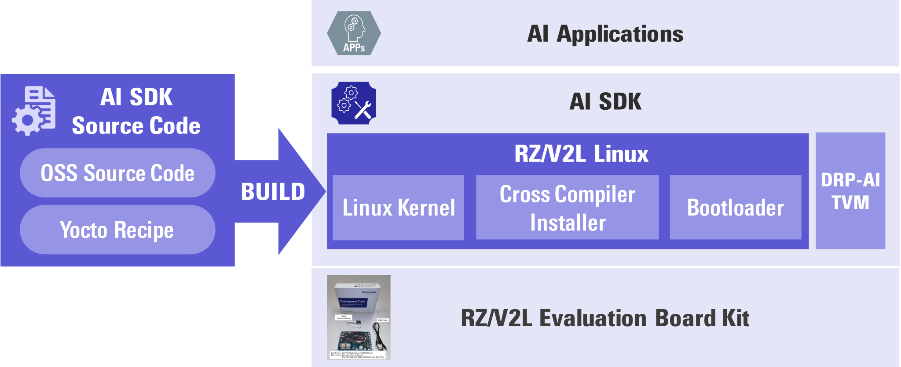

    

        

          How to build RZ/V2L AI SDK Source Code
        

    

 
 
<h5>This page explains how to build Linux with <b>RZ/V2L AI SDK Source Code.</b></h5>

<h5>Supported version: <b>RZ/V2L AI SDK v7.00</b></h5>

<h3 id="intro" >Introduction</h3>

  

    

      AI SDK is a quick and easy AI Application development environment. 
      It is specifically made for RZ/V2L Evaluation Board Kit with fixed Linux components. 
      (For more information, please refer to <a href="{{ site.url }}{{ site.baseurl }}" target="_blank" rel="noopener noreferrer">Getting Started</a> and <a href="{{ site.url }}{{ site.baseurl }}" target="_blank" rel="noopener noreferrer">AI SDK</a>.) 
       
      To modify Linux component, you need to build AI SDK from source code. 
      AI SDK Source Code can generate the same Linux environment as AI SDK. 
       
    

  

   

  

    

       
      This page explains how to build AI SDK Source Code. 
      After you have completed this page, you would be able to change the source code and customize Linux environment (i.e., memory map, additional OSS etc...). 
       
      

        Requirement
        <ol>
          <li>Users have launched RZ/V2L Evaluation Board Kit according to <a href="{{ site.url }}{{ site.baseurl }}" target="_blank" rel="noopener noreferrer">Getting Started</a>, which means they can run <a href="{{ site.url }}{{ site.baseurl }}" target="_blank" rel="noopener noreferrer">AI Application</a> on the board. 
          </li>
          <li>To build Yocto Linux, the below equipment should be prepared. 
            <table class="gstable">
              <tr>
                <th>Equipment</th>
                <th colspan="2">Details</th>
              </tr>
              <tr>
                <td rowspan="2">Linux PC</td>
                <td colspan="2">Approximately <b>120GB free space</b> is necessary.</td>
              </tr>
              <tr>
                <td>OS</td>
                <td><b>Ubuntu 22.04 LTS</b> 
                    64bit OS must be used.</td>      
              </tr>
            </table>
          </li>
        </ol>
      

       
      Now you are ready to build your Linux development environment. 
      <h5><b><i>Let's get started!!</i></b></h5> 
    

  

 

<h3 id="step1" >Step 1: Obtain RZ/V2L AI SDK Source Code</h3>

  

    

      Download the RZ/V2L AI SDK Source Code from the link below.  
      <a class="btn btn-primary download-button" href="https://www.renesas.com/document/sws/rzv2l-ai-sdk-v700-source-code" role="button" target="_blank" rel="noopener noreferrer">Download Link</a>
        
 	    AI SDK Source Code (<b><code>RTK0EF0160F*_linux-src.zip</code></b>) contains following files: 
      <table class="mytable">
        <tr>
          <th>File name</th>
          <th>Description</th>
        </tr>
        <tr>
          <td>README.txt</td>
          <td>README file.</td>
        </tr>
        <tr>
          <td>rzv2l_ai-sdk_yocto_recipe_v*.tar.gz</td>
          <td>Yocto recipe. 
          Yocto recipes are text files that contains necessary information to build Yocto Linux.</td>
        </tr>
        <tr>
          <td>oss_pkg_rzv_v*.7z</td>
          <td>OSS package. 
            OSS package is a set of Open Source Software source code used when building the Yocto Linux. 
            AI SDK Source Code provides this file to reproduce the same Linux environment provided in RZ/V2L AI SDK.
          </td>
        </tr>
      </table>
    

  

 

<h3 id="step2" >Step 2: Extract RZ/V2L AI SDK Source Code</h3>
 
This step explains how to extract RZ/V2L AI SDK Source Code zip file.
 
<ol>
  <li>On your Linux PC, check you have already registered the environment variable <b><code>WORK</code></b> with the below command.

printenv WORK

    <ul>
      <li>
      If the above command prints followings, proceed next step.  

<path to the working directory>/ai_sdk_work

      If not, please register the working directory path to an environment variable according to <a href="{{ site.url }}{{ site.baseurl }}#step4" target="_blank" rel="noopener noreferrer">Step4: Extract RZ/V AI SDK package in Getting Started</a>.
      </li>
    </ul>
  </li>
   
  <li>Make the working directory on your Linux PC.

mkdir -p ${WORK}/src_setup

  </li>
  <li>Move to the working directory.

cd ${WORK}/src_setup

  </li>
  <li>Extract RZ/V2L AI SDK Sorce Code zip file.

unzip <Path to the file>/RTK0EF0160F*_linux-src.zip -d ${WORK}/src_setup

  </li>
  <li>Check the working directory to confirm the package contents.

ls -1 ${WORK}/src_setup

    <ul>
      <li>
If the above command prints followings, the package is extracted correctly.

README.txt
oss_pkg_rzv_v*.7z 
rzv2l_ai-sdk_yocto_recipe_v*.tar.gz

      </li>
    </ul>
  </li>
</ol>
 

<h3 id="step3" >Step 3: Build RZ/V2L AI SDK Source Code</h3>
This step explains how to build Linux environment with RZ/V2L AI SDK Source Code
<ol>
  <li id="step3-1"> To install necessary sofware, run the following commands on your Linux PC.

sudo apt-get update
sudo apt install build-essential chrpath cpio debianutils diffstat file gawk \
gcc git iputils-ping libacl1 liblz4-tool locales python3 python3-git \
python3-jinja2 python3-pexpect python3-pip python3-subunit socat texinfo unzip \
wget xz-utils zstd

  </li>
  <li id="step3-2">Run the following commands and set the user name and email address before starting the build procedure. 
    It is needed to avoid errors when using git command to apply patches.

git config --global user.email "you@example.com"
git config --global user.name "Your Name"

  </li>
  <li id="step3-3">Register the working directory path to an environment variable.

export YOCTO_WORK=${WORK}/src_setup/yocto
mkdir -p ${YOCTO_WORK}

  </li>
  <li id="step3-4">Extract Yocto recipe package.

cd ${YOCTO_WORK}
tar zxvf ${WORK}/src_setup/rzv2l_ai-sdk_yocto_recipe_v*.tar.gz

  </li>
  <li id="step3-5">Check the working directory to confirm Yocto recipes content.

ls -1 ${YOCTO_WORK}

    <ul>
      <li>If the above command prints followings, Yocto recipes are extracted correctly.

extra
meta-arm
meta-openembedded
meta-renesas
meta-rz-features
meta-virtualization
patch
poky

      </li>
    </ul>
  </li>
  <li id="step3-6">Initialize a build using the <b><code>oe-init-build-env</code></b> script in Poky and set   environment variable <b><code>TEMPLATECONF</code></b> to the below path.

cd ${YOCTO_WORK}
TEMPLATECONF=$PWD/meta-renesas/meta-rz-distro/conf/templates/rz-conf/ source poky/oe-init-build-env build

  </li>
  <li id="step3-7">Run the following commands to add necessary layers for AI application to <b><code>${YOCTO_WORK}/build/conf/bblayers.conf</code></b> (configration file for layers).

bitbake-layers add-layer ../meta-rz-features/meta-rz-graphics
bitbake-layers add-layer ../meta-rz-features/meta-rz-codecs
bitbake-layers add-layer ../meta-rz-features/meta-rz-drpai

  </li>
  <li id="step3-8">Run the following commands to extract the OSS package. 

cp ${WORK}/src_setup/oss_pkg_rzv_*.7z ${YOCTO_WORK}
7z x ${YOCTO_WORK}/oss_pkg_rzv_*.7z -o${YOCTO_WORK}/build

  </li>
  <li id="step3-9">Check the working directory to confirm the package contents.

ls -1 ${YOCTO_WORK}/build
 
    <ul>
      <li>If the above command prints followings, the package is extracted correctly.

conf
downloads

      </li>
    </ul>
  </li>
  <li id="step3-10">Run the following procedures to apply the patch files. 
    <ol>
      <!-- Settings for AI SDK (offline build settings, 16GB SD card, settings for eSD boot, Cross Compiler settings, startup screen settings) -->
      <li>Apply a patch file for AI SDK settings. 
        This patch file applies offline build setting, SD card image size setting, eSD boot setting, Cross Compiler setting, and startup screen setting.

patch -p1 < ../patch/0000-AI_SDK-settings.patch

        

          Note
          The default size of the microSD card image created in this guide is approximately 16 GB. 
          If you would like to change the microSD card image size, please refer to <a href="{{ site.url }}{{ site.baseurl }}#D1" target="_blank" rel="noopener noreferrer">D1: Change the size of the microSD card image in WIC format</a>. 
        

      </li>
      <!-- Add Tesseract -->
      <li>Apply a patch file to add Tesseract Open Source OCR Engine for AI applications.

patch -p1 < ../patch/0001-tesseract.patch

      </li>
      <!-- Add OpenMP -->
      <li>Apply a patch file to add OpenMP for AI applications.

patch -p1 < ../patch/0002-openmp.patch

      </li>
    </ol>
  </li>
  <li id="step3-11">Run the following command to build the <b>Linux kernel files.</b> 
    (It takes a few hours to finish building depending on the user’s host PC performance)

MACHINE=smarc-rzv2l bitbake core-image-weston

    All necessary files listed below will be generated by the build command and 
	  they will be located in <b><code>${YOCTO_WORK}/build/tmp/deploy/images/smarc-rzv2l</code></b> directory. 
    <table class="mytable">
      <tr>
        <th>Boot mode</th>
        <th>File name</th>
        <th>Description</th>
      </tr>
      <tr>
        <td>eSD</td>
        <td>
          core-image-weston-smarc-rzv2l.rootfs.wic.bmap 
          core-image-weston-smarc-rzv2l.rootfs.wic.gz
        </td>
        <td>WIC format SD card image</td>
      </tr>
      <tr>
        <td>QSPI</td>
        <td>
          core-image-weston-smarc-rzv2l.rootfs.wic.bmap 
          core-image-weston-smarc-rzv2l.rootfs.wic.gz 
          Flash_Writer_SCIF_RZV2L_SMARC_PMIC_DDR4_2GB_1PCS.mot 
          bl2_bp_spi-smarc-rzv2l_pmic.srec 
          fip-smarc-rzv2l_pmic.srec
        </td>
        <td>Boot loader and WIC format SD card image</td>
      </tr>
    </table>
  </li>
  <li id="step3-12">Run the following command to build <b>cross compiler installer</b>. 

MACHINE=smarc-rzv2l bitbake core-image-weston -c populate_sdk

    A necessary file listed below will be generated by the build command and the cross compiler installer will be located in <b><code>build/tmp/deploy/sdk/rz-vlp-glibc-x86_64-core-image-weston-cortexa55-smarc-rzv2l-toolchain-*.sh</code></b>. 
    <table class="mytable">
      <tr>
        <th>File name</th>
        <th>Description</th>
      </tr>
      <tr>
        <td>rz-vlp-glibc-x86_64-core-image-weston-cortexa55-smarc-rzv2l-toolchain-*.sh</td>
        <td>Cross compiler installer</td>
      </tr>
    </table>
    

      Note
      If some errors occurred during the build, 
      please clean the directory and rebuild it after a period of time according to the below commands.

cd ${YOCTO_WORK}/build
MACHINE=smarc-rzv2l bitbake core-image-weston -c cleanall

      And run the build command again.
      <ul>
        <li>For Linux kernel files

MACHINE=smarc-rzv2l bitbake core-image-weston
  
        </li>
        <li>For cross compiler installer

MACHINE=smarc-rzv2l bitbake core-image-weston -c populate_sdk

        </li>
      </ul>
    

  </li>
</ol>
 
 
<h4>
This is the end of how to build AI SDK Source Code.
</h4>
You have prepared following files, which is same as the one provided in <a href="{{ site.url }}{{ site.baseurl }}#step3" target="_blank" rel="noopener noreferrer">Step 3: Obtain RZ/V2L AI SDK in Getting Started</a>, and you can run <a href="{{ site.url }}{{ site.baseurl }}" target="_blank" rel="noopener noreferrer">AI Applications</a> according to <a href="{{ site.url }}{{ site.baseurl }}" target="_blank" rel="noopener noreferrer">Getting Started</a>. 
For more information on how to use each files, see the link in the How to use column.
 
<table class="mytable">
  <tr>
    <th>Path</th>
    <th>File name</th>
    <th>Description</th>
    <th>How to use</th>
  </tr>
  <tr>
    <td rowspan="2">${YOCTO_WORK}/build/tmp/deploy/images/smarc-rzv2l</td>
    <td>
      core-image-weston-smarc-rzv2l.rootfs.wic.bmap 
      core-image-weston-smarc-rzv2l.rootfs.wic.gz
    </td>
    <td>WIC format SD card image</td>
    <td>
      <a href="{{ site.url }}{{ site.baseurl }}#step7-1" target="_blank" rel="noopener noreferrer">Step 7-1: Setup RZ/V2L EVK in RZ/V2L EVK Getting Started</a>
    </td>
  </tr>
  <tr>
    <td>
      Flash_Writer_SCIF_RZV2L_SMARC_PMIC_DDR4_2GB_1PCS.mot 
      bl2_bp_spi-smarc-rzv2l_pmic.srec 
      fip-smarc-rzv2l_pmic.srec
    </td>
    <td>Boot loader used when booting from QSPI</td>
    <td>
      <a href="{{ site.url }}{{ site.baseurl }}#D2" target="_blank" rel="noopener noreferrer">D2.How to boot from QSPI in Developer's Guide</a>
    </td>
  </tr>
  <tr>
    <td>${YOCTO_WORK}/build/tmp/deploy/sdk</td>
    <td>rz-vlp-glibc-x86_64-core-image-weston-cortexa55-smarc-rzv2l-toolchain-*.sh</td>
    <td>Cross compiler installer</td>
    <td>
      After replacing the file in <b><code>${WORK}/ai_sdk_setup</code></b> directory with this file, follow the steps below to setup RZ/V AI SDK. 
      <a href="{{ site.url }}{{ site.baseurl }}#step5" target="_blank" rel="noopener noreferrer">Step 5: Setup RZ/V AI SDK in Getting Started</a>
    </td>
  </tr>
</table>

  Note 1
  For more Yocto Project information, please refer the link below: 
  <a href="https://docs.yoctoproject.org/5.0.11/brief-yoctoprojectqs/index.html" target="_blank" rel="noopener noreferrer">https://docs.yoctoproject.org/5.0.11/brief-yoctoprojectqs/index.html</a>

  Note 2
  When customizing Linux development environment, following link may help. 
	<a href="https://docs.yoctoproject.org/" target="_blank" rel="noopener noreferrer">https://docs.yoctoproject.org/</a>

  Note 3
    Regarding the eSD (Embedded SD) booting, please note the following:
    <ul class="mb-1">
      <li>The eSD boot procedure using microSD card described in this guide is for evaluation purposes only.</li>
      <li>If you use the eSD boot, please implement the eSD on your board according to the standard "SD Specification Part 1 eSD Addendum (version 2.10)".</li>
    </ul>

 
	If you have any questions about AI SDK Source Code, 
  please add new issues to AI SDK GitHub issues. 
   
  <a class="btn btn-primary download-button" href="https://github.com/renesas-rz/rzv_ai_sdk/issues" role="button" target="_blank" rel="noopener noreferrer">Go to GitHub issues</a>

  

    <a class="btn btn-secondary square-button" href="{{ site.url }}{{ site.baseurl }}" role="button">
      Back to Home >
    </a>
  

