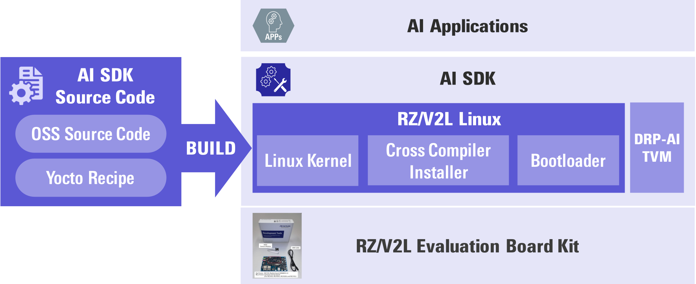

    

        

          How to build RZ/V2L AI SDK Source Code
        

    

 
 
<h5>This page explains how to build Linux with <b>RZ/V2L AI SDK Source Code.</b></h5>

<h5>Supported version: <b>RZ/V2L AI SDK v2.10</b></h5>

<h3 id="intro" >Introduction</h3>

  

    

      AI SDK is a quick and easy AI Application development environment. 
      It is specifically made for RZ/V2L Evaluation Board Kit with fixed Linux components. 
      (For more information, please refer to <a href="{{ site.url }}{{ site.baseurl }}">Getting Started</a> and <a href="{{ site.url }}{{ site.baseurl }}">AI SDK</a>.) 
       
      To modify Linux component, you need to build AI SDK from source code. 
      AI SDK Source Code can generate the same Linux environment as AI SDK. 
       
    

  

   

  

    

       
      This page explains how to build AI SDK Source Code. 
      After you have completed this page, you would be able to change the source code and customize Linux environment (i.e., memory map, additional OSS etc...). 
       
      

        Requirement
        <ol>
          <li>Users have launched RZ/V2L Evaluation Board Kit according to <a href="{{ site.url }}{{ site.baseurl }}">Getting Started</a>, which means they can run <a href="{{ site.url }}{{ site.baseurl }}">AI Application</a> on the board. 
          </li>
          <li>To build Yocto Linux, the below equipment should be prepared. 
            <table class="gstable">
              <tr>
                <th>Equipment</th>
                <th colspan="2">Details</th>
              </tr>
              <tr>
                <td rowspan="2">Linux PC</td>
                <td colspan="2">Approximately <b>110GB free space</b> is necessary.</td>
              </tr>
              <tr>
                <td>OS</td>
                <td><b>Ubuntu 20.04 LTS</b> 
                    64bit OS must be used.</td>      
              </tr>
            </table>
          </li>
        </ol>
      

       
      Now you are ready to build your Linux development environment. 
      <h5><b><i>Let's get started!!</i></b></h5> 
    

  

 

<h3 id="step1" >Step 1: Obtain RZ/V2L AI SDK Source Code</h3>

  

    

      Download the RZ/V2L AI SDK Source Code from the link below.  
      <a class="btn btn-primary download-button" href="https://www.renesas.com/software-tool/rzv2l-ai-software-development-kit" role="button">Download Link</a>
        
 	    AI SDK Source Code (<b><code>RTK0EF0160F*_linux-src.zip</code></b>) contains following files: 
      <table class="mytable">
        <tr>
          <th>File name</th>
          <th>Description</th>
        </tr>
        <tr>
          <td>README.txt</td>
          <td>README file.</td>
        </tr>
        <tr>
          <td>rzv2l_ai-sdk_yocto_recipe_v*.tar.gz</td>
          <td>Yocto recipe. 
          Yocto recipes are text files that contains necessary information to build Yocto Linux.</td>
        </tr>
        <tr>
          <td>oss_pkg_rzv_v*.7z</td>
          <td>OSS package. 
            OSS package is a set of Open Source Software source code used when building the Yocto Linux. 
            AI SDK Source Code provides this file to reproduce the same Linux environment provided in RZ/V2L AI SDK.
          </td>
        </tr>
      </table>
    

  

 

<h3 id="step2" >Step 2: Extract RZ/V2L AI SDK Source Code</h3>
 
This step explains how to extract RZ/V2L AI SDK Source Code zip file.
 
<ol>
  <li>On your Linux PC, check you have already registered the environment variable <b><code>WORK</code></b> with the below command.

printenv WORK

    <ul>
      <li>
      If the above command prints followings, proceed next step.  

<path to the working directory>/ai_sdk_work

      If not, please register the working directory path to an environment variable according to <a href="{{ site.url }}{{ site.baseurl }}#step4">Step4: Extract RZ/V AI SDK package in Getting Started</a>.
      </li>
    </ul>
  </li>
   
  <li>Make the working directory on your Linux PC.

mkdir -p ${WORK}/src_setup

  </li>
  <li>Move to the working directory.

cd ${WORK}/src_setup

  </li>
  <li>Extract RZ/V2L AI SDK Sorce Code zip file.

unzip <Path to the file>/RTK0EF0160F*_linux-src.zip -d ${WORK}/src_setup

  </li>
  <li>Check the working directory to confirm the package contents.

ls -1 ${WORK}/src_setup

    <ul>
      <li>
If the above command prints followings, the package is extracted correctly.

README.txt
oss_pkg_rzv_v2.10.7z 
rzv2l_ai-sdk_yocto_recipe_v2.10.tar.gz

      </li>
    </ul>
  </li>
</ol>
 

<h3 id="step3" >Step 3: Build RZ/V2L AI SDK Source Code</h3>
This step explains how to build Linux environment with RZ/V2L AI SDK Source Code
<ol>
  <li> To install necessary sofware, run the following commands on your Linux PC.

sudo apt-get update
sudo apt-get install gawk wget git-core diffstat unzip texinfo gcc-multilib \
build-essential chrpath socat cpio python python3 python3-pip python3-pexpect \
xz-utils debianutils iputils-ping libsdl1.2-dev xterm p7zip-full libyaml-dev \
libssl-dev

  </li>
  <li>Run the following commands and set the user name and email address before starting the build procedure. 
    It is needed to avoid errors when using git command to apply patches.

git config --global user.email "you@example.com"
git config --global user.name "Your Name"

  </li>
  <li>Register the working directory path to an environment variable.

export YOCTO_WORK=${WORK}/src_setup/yocto
mkdir -p ${YOCTO_WORK}

  </li>
  <li>Extract Yocto recipe package.

cd ${YOCTO_WORK}
tar zxvf ${WORK}/src_setup/rzv2l_ai-sdk_yocto_recipe_v*.tar.gz

  </li>
  <li id="step3-5">Check the working directory to confirm Yocto recipes content.

ls -1 ${YOCTO_WORK}

    <ul>
      <li>If the above command prints followings, Yocto recipes are extracted correctly.

extra
meta-gplv2
meta-openembedded
meta-qt5
meta-renesas
meta-rz-features
meta-virtualization
patch
poky

      </li>
    </ul>
    

      Note 1
      These Yocto recipes are provided for eSD Bootloader as default. 
      When using eMMC Bootloader, run the command to apply a patch file in addition. 
      About the difference of these two types, please refer to <a href="{{ site.url }}{{ site.baseurl }}#step7">Step7: Deploy AI Application in RZ/V2L EVK Getting Started</a>.

cd ${YOCTO_WORK}/meta-renesas
patch -R -p1 -i ./patch/0001-VLP-v3.0.4-based-smart-rzv2l-eSD-Boot-support.patch

    

    

      Note 2
      Evaluation version of Graphics Library and Video Codec Library have restriction on their running time. 
      If you would like to use unrestricted version of Graphics Library or Video Codec Library,
	    please refer to <a href="{{ site.url }}{{ site.baseurl }}#A1">Appendix: Build Graphics and Video Codec Library for Unrestricted Version</a>. 
    

  </li>
  <li id="step3-6">Initialize a build using the <b><code>oe-init-build-env</code></b> script in Poky and set   environment variable <b><code>TEMPLATECONF</code></b> to the below path.

cd ${YOCTO_WORK}
TEMPLATECONF=$PWD/meta-renesas/meta-rzv2l/docs/template/conf/ source poky/oe-init-build-env build

  </li>
  <li>Run the following commands to add necessary layers for AI application to <b><code>${YOCTO_WORK}/build/conf/bblayers.conf</code></b> (configration file for layers).

bitbake-layers add-layer ../meta-rz-features/meta-rz-graphics
bitbake-layers add-layer ../meta-rz-features/meta-rz-codecs
bitbake-layers add-layer ../meta-rz-features/meta-rz-drpai

  </li>
  <li>Run the following commands to extract the OSS package. 

cp ${WORK}/src_setup/oss_pkg_rzv_*.7z ${YOCTO_WORK}
7z x ${YOCTO_WORK}/oss_pkg_rzv_*.7z -o${YOCTO_WORK}/build

  </li>
   <li>Check the working directory to confirm the package contents.

ls -1 ${YOCTO_WORK}/build
 
    <ul>
      <li>If the above command prints followings, the package is extracted correctly.

conf
downloads

      </li>
    </ul>
  </li>
  <li>Apply a patch file: 
    <ul>
      <li>To add Tesseract Open Source OCR Engine for AI applications.
      </li>
      <li>Not to use network connection during the build. (Necessary OSS source codes are already provided in AI SDK Source Code.)
      </li>     
    </ul>

patch -p1 -i ../patch/0002-no-network-tesseract.patch

  </li>
  <li>Run the following command to build the <b>Linux kernel files.</b> 
    (It takes a few hours to finish building depending on the user’s host PC performance)

MACHINE=smarc-rzv2l bitbake core-image-weston

    All necessary files listed below will be generated by the build command and 
	  they will be located in <b><code>${YOCTO_WORK}/build/tmp/deploy/images/smarc-rzv2l</code></b> directory. 
        <table class="mytable">
          <tr>
            <th>File name</th>
           <th>Description</th>
          </tr>
          <tr>
            <td>Image-smarc-rzv2l.bin</td>
            <td>Linux kernel</td>
          </tr>
          <tr>
            <td>Image-r9a07g054l2-smarc.dtb</td>
            <td>Device tree file</td>
          </tr>
          <tr>
           <td>bl2_bp_esd-smarc-rzv2l_pmic.bin 
              bl2-smarc-rzv2l_pmic.bin 
              fip-smarc-rzv2l_pmic.bin</td>
            <td>*1 Bootloader generated when using eSD Bootloader</td>
          </tr>
          <tr>
            <td>
              bl2_bp-smarc-rzv2l_pmic.srec 
              fip-smarc-rzv2l_pmic.srec 
              Flash_Writer_SCIF_RZV2L_SMARC_PMIC_DDR4_2GB_1PCS.mot</td>
            <td>*1 Bootloader generated when using eMMC Bootloader</td>
          </tr>
         <tr>
           <td>core-image-weston-smarc-rzv2l.tar.bz2</td>
            <td>Root filesystem</td>
         </tr>
        </table>
  

    Note
    Either one of bootloaders(*1) will be generated based on your bootloader choice.
  

  </li>
  <li>Run the following command to build <b>cross compiler installer</b>. 

MACHINE=smarc-rzv2l bitbake core-image-weston -c populate_sdk

    A necessary file listed below will be generated by the build command and the cross compiler installer will be located in <b><code>build/tmp/deploy/sdk/poky-glibc-x86_64-core-image-weston-aarch64-smarc-rzv2l-toolchain-*.sh</code></b>. 
    <table class="mytable">
      <tr>
        <th>File name</th>
        <th>Description</th>
      </tr>
      <tr>
        <td>poky-glibc-x86_64-core-image-weston-aarch64-smarc-rzv2l-toolchain-*.sh</td>
        <td>Cross compiler installer</td>
      </tr>
    </table>
    

      Note
      If some errors occurred during the build, 
      please clean the directory and rebuild it after a period of time according to the below commands.

cd ${YOCTO_WORK}/build
MACHINE=smarc-rzv2l bitbake core-image-weston -c cleanall

      And run the build command again.
      <ul>
        <li>For Linux kernel files

MACHINE=smarc-rzv2l bitbake core-image-weston
  
        </li>
        <li>For cross compiler installer

MACHINE=smarc-rzv2l bitbake core-image-weston -c populate_sdk

        </li>
      </ul>
    

  </li>
  <li>Add setting HD(1280x720) to Weston in root filesystem. 
    <ol>
      <li>Run the following commands to extract root filesystem.

sudo mkdir /nfs/tmp -p
sudo tar xfj ./tmp/deploy/images/smarc-rzv2l/core-image-weston-smarc-rzv2l.tar.bz2 -C /nfs/tmp
        
      </li>
      <li>Edit <b><code>/nfs/tmp/etc/xdg/weston/weston.ini</code></b> file with a text editor.
        <ol>
          <li>Before the editing, open it and check that followings are written in the file. 

[core]
idle-time=0
require-input=false
repaint-window=17
  
          </li>
          <li>Add the following setting to the end of the file.

[output]
name=HDMI-A-1
mode=1280x720

          </li>   
          <li>After adding the above, the result will be as shown below.

[core]
idle-time=0
require-input=false
repaint-window=17
[output]
name=HDMI-A-1
mode=1280x720
   
          </li>     
          <li>Save and close the file.
          </li> 
           
        </ol>
      </li>
      <li>Run the following commands to recompress the root filesystem.

cd /nfs/tmp
sudo tar cvfj ${WORK}/src_setup/core-image-weston-smarc-rzv2l.tar.bz2 *

      </li>
    </ol>
  </li>
</ol>
 
 
<h4>
This is the end of how to build AI SDK Source Code.
</h4>
You have prepared following files, which is same as the one provided in <a href="{{ site.url }}{{ site.baseurl }}#step3">Step 3: Obtain RZ/V2L AI SDK in Getting Started</a>, and you can run <a href="{{ site.url }}{{ site.baseurl }}">AI Applications</a> according to <a href="{{ site.url }}{{ site.baseurl }}">Getting Started</a>.
 
<table class="mytable">
  <tr>
    <th>Path</th>
    <th>File name</th>
    <th>Description</th>
  </tr>
  <tr>
    <td rowspan="4">${YOCTO_WORK}/build/tmp/deploy/images/smarc-rzv2l</td>
    <td>Image-smarc-rzv2l.bin</td>
    <td>Linux kernel</td>
  </tr>
  <tr>
    <td>Image-r9a07g054l2-smarc.dtb</td>
    <td>Device tree file</td>
  </tr>
  <tr>
    <td>bl2_bp_esd-smarc-rzv2l_pmic.bin 
        bl2-smarc-rzv2l_pmic.bin 
        fip-smarc-rzv2l_pmic.bin</td>
    <td>*1 Bootloader generated when using eSD Bootloader</td>
  </tr>
  <tr>
    <td>bl2_bp-smarc-rzv2l_pmic.srec 
        fip-smarc-rzv2l_pmic.srec 
        Flash_Writer_SCIF_RZV2L_SMARC_PMIC_DDR4_2GB_1PCS.mot</td>
    <td>*1 Bootloader generated when using eMMC Bootloader</td>
  </tr>
  <tr>
    <td>${WORK}/src_setup</td>
    <td>core-image-weston-smarc-rzv2l.tar.bz2</td>
    <td>Root filesystem</td>
  </tr>
  <tr>
    <td>${YOCTO_WORK}/build/tmp/deploy/sdk</td>
    <td>poky-glibc-x86_64-core-image-weston-aarch64-smarc-rzv2l-toolchain-*.sh</td>
    <td>Cross compiler installer</td>
  </tr>
</table>

  Note 1
  Either one of bootloaders(*1) will be generated based on your bootloader choice.

  Note 2
  For more Yocto Project information, please refer the link below: 
  <a href="https://docs.yoctoproject.org/3.1.21/brief-yoctoprojectqs/brief-yoctoprojectqs.html">https://docs.yoctoproject.org/3.1.21/brief-yoctoprojectqs/brief-yoctoprojectqs.html</a>

  Note 3
  When customizing Linux development environment, following link may help. 
	<a href="https://docs.yoctoproject.org/">https://docs.yoctoproject.org/</a>

 
	If you have any questions about AI SDK Source Code, 
  please add new issues to AI SDK GitHub issues. 
   
  <a class="btn btn-primary download-button" href="https://github.com/renesas-rz/rzv_ai_sdk/issues" role="button">Go to GitHub issues</a>

  

    <a class="btn btn-secondary square-button" href="{{ site.url }}{{ site.baseurl }}" role="button">
      Back to Home >
    </a>
  

  
<h3 id="A1">Appendix: Prepare Graphics and Video Codec Library for Unrestricted Version</h3>
This section explains how to prepare Graphics and Video Codec Library for unrestricted version, intead of evaluation version. 

  Note
  Following instruction assumes that you have completed <a href="{{ site.url }}{{ site.baseurl }}#step3-5">Step 3-5 in How to build AI SDK Source Code</a>.

  <ol>
    <li>Download zip files from the link below.
       
      

        Note
        It may take much time to obtain Graphics or Video Codec Library for unrestricted version due to necessary examinations on your business purpose. 
      

      <ul>
        <li>Graphics Library Unrestricted Version 
           
          <a class="btn btn-primary download-button" href="https://www.renesas.com/products/microcontrollers-microprocessors/rz-arm-based-high-end-32-64-bit-mpus/rz-mpu-graphics-library-evaluation-version-rzv2l#Download" role="button">Download Link</a>
        </li>
         
        <li>Video Codec Library Unrestricted Version 
           
          <a class="btn btn-primary download-button" href="https://www.renesas.com/products/microcontrollers-microprocessors/rz-arm-based-high-end-32-64-bit-mpus/rz-mpu-video-codec-library-evaluation-version-rzv2l#Download" role="button">Download Link</a>
        </li>
      </ul>
    </li>
     
    <li>After you downloaded the zip files, please move the zip files to "<b><code>${WORK}/src_setup</code></b>" on your Linux PC.
     
    </li>
     
    <li>Check that zip files are moved to appropriate location.

cd ${WORK}/src_setup
ls -1 

      <ul>
        <li>If the above command prints followings, the package is extracted correctly.

README.txt
RTK0EF0045Z14001ZJ-v*_rzv_*.zip
RTK0EF0045Z16001ZJ-v*_rzv_*.zip
oss_pkg_rzv_v2.10.7z
rzv2l_ai-sdk_yocto_recipe_v2.10.tar.gz
yocto

        </li>
      </ul>
    </li>
    <li>Run the below command to delete evaluation version. 
      <ul>
        <li>Graphics Library

rm -rf ${YOCTO_WORK}/meta-rz-features/meta-rz-graphics

        </li>
        <li>Video Codec Library

rm -rf ${YOCTO_WORK}/meta-rz-features/meta-rz-codecs

        </li>
      </ul>
    </li>
    <li>Run the below command to extract the unristricted version. 
      <ul>
        <li>Graphics Library

unzip RTK0EF0045Z14001ZJ*.zip
tar zxvf RTK0EF0045Z14001ZJ*/meta-rz-features_graphics_*.tar.gz -C ${YOCTO_WORK}

        </li>
        <li>Video Codec Library

unzip RTK0EF0045Z16001ZJ*.zip
tar zxvf RTK0EF0045Z16001ZJ*/meta-rz-features_codec_*.tar.gz -C ${YOCTO_WORK}

        </li>
      </ul>
    </li>
  </ol>
After this procedure, please proceed to <a href="{{ site.url }}{{ site.baseurl }}#step3-6"> Step 3-6 in How to build AI SDK Source Code</a> to start building Linux kernel files.
 

  

    <a class="btn btn-secondary square-button" href="{{ site.url }}{{ site.baseurl }}" role="button">
      Back to Home >
    </a>
  

