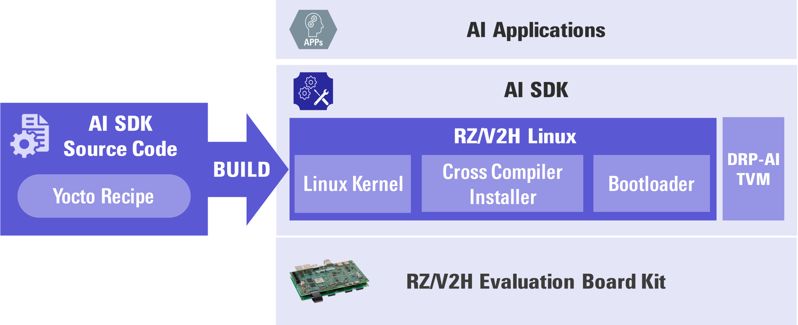

    

        

          How to build RZ/V2H AI SDK Source Code
        

    

 
 
<h5>This page explains how to build Linux with <b>RZ/V2H AI SDK Source Code.</b></h5>

<h5>Supported version: <b>RZ/V2H AI SDK v5.20</b></h5>

<h3 id="intro" >Introduction</h3>

  

    

      AI SDK is a quick and easy AI Application development environment. 
      It is specifically made for RZ/V2H Evaluation Board Kit with fixed Linux components. 
      (For more information, please refer to <a href="{{ site.url }}{{ site.baseurl }}" target="_blank" rel="noopener noreferrer">Getting Started</a> and <a href="{{ site.url }}{{ site.baseurl }}" target="_blank" rel="noopener noreferrer">AI SDK</a>.) 
       
      To modify Linux component, you need to build AI SDK from source code. 
      AI SDK Source Code can generate the same Linux environment as AI SDK. 
       
    

  

   

  

    

       
      This page explains how to build AI SDK Source Code. 
      After you have completed this page, you would be able to change the source code and customize Linux environment (i.e., memory map, additional OSS etc...). 
      To customize the Linux environment, please refer to <a href="https://www.renesas.com/document/mas/rzv2h-and-rzv2n-bsp-manual-set-rtk0ef0045z94001azj-v103zip">RZ/V2H BSP Manual Set</a>. 
       
      

        Requirement
        <ol>
          <li>Users have launched RZ/V2H Evaluation Board Kit according to <a href="{{ site.url }}{{ site.baseurl }}" target="_blank" rel="noopener noreferrer">Getting Started</a>, which means they can run <a href="{{ site.url }}{{ site.baseurl }}" target="_blank" rel="noopener noreferrer">AI Application</a> on the board. 
          </li>
          <li>To build Yocto Linux, the below equipment should be prepared. 
            <table class="gstable">
              <tr>
                <th>Equipment</th>
                <th colspan="2">Details</th>
              </tr>
              <tr>
                <td rowspan="2">Linux PC</td>
                <td colspan="2">Approximately <b>120GB free space</b> is necessary.</td>
              </tr>
              <tr>
                <td>OS</td>
                <td><b>Ubuntu 20.04 LTS</b> 
                    64bit OS must be used.</td>      
              </tr>
            </table>
          </li>
        </ol>
      

       
      Now you are ready to build your Linux development environment. 
      <h5><b><i>Let's get started!!</i></b></h5> 
    

  

 

<h3 id="step1" >Step 1: Obtain RZ/V2H AI SDK Source Code</h3>

  

    

      Download the RZ/V2H AI SDK Source Code from the link below.  
      <a class="btn btn-primary download-button" href="https://www.renesas.com/document/sws/rzv2h-ai-sdk-v520-source-code" role="button" target="_blank" rel="noopener noreferrer">Download Link</a>
        
 	    AI SDK Source Code (<b><code>RTK0EF0180F*_linux-src.zip</code></b>) contains following files: 
      <table class="mytable">
        <tr>
          <th>File name</th>
          <th>Description</th>
        </tr>
        <tr>
          <td>README.txt</td>
          <td>README file.</td>
        </tr>
        <tr>
          <td>rzv2h_ai-sdk_yocto_recipe_v*.tar.gz</td>
          <td>Yocto recipe. 
          Yocto recipes are text files that contains necessary information to build Yocto Linux.</td>
        </tr>
        <tr>
          <td>oss_pkg_rzv_v*.7z</td>
          <td>OSS package. 
            OSS package is a set of Open Source Software source code used when building the Yocto Linux. 
            AI SDK Source Code provides this file to reproduce the same Linux environment provided in RZ/V2H AI SDK.
          </td>
        </tr>
      </table>
    

  

 

<h3 id="step2" >Step 2: Extract RZ/V2H AI SDK Source Code</h3>
 
This step explains how to extract RZ/V2H AI SDK Source Code zip file.
 
<ol>
  <li>On your Linux PC, check you have already registered the environment variable <b><code>WORK</code></b> with the below command.

printenv WORK

    <ul>
      <li>
      If the above command prints followings, proceed next step.  

<path to the working directory>/ai_sdk_work

      If not, please register the working directory path to an environment variable according to <a href="{{ site.url }}{{ site.baseurl }}#step4" target="_blank" rel="noopener noreferrer">Step4: Extract RZ/V AI SDK package in Getting Started</a>.
      </li>
    </ul>
  </li>
   
  <li>Make the working directory on your Linux PC.

mkdir -p ${WORK}/src_setup

  </li>
  <li>Move to the working directory.

cd ${WORK}/src_setup

  </li>
  <li>Extract RZ/V2H AI SDK Sorce Code zip file.

unzip <Path to the file>/RTK0EF0180F*_linux-src.zip -d ${WORK}/src_setup

  </li>
  <li>Check the working directory to confirm the package contents.

ls -1 ${WORK}/src_setup

    <ul>
      <li>If the above command prints followings, the package is extracted correctly.

README.txt
oss_pkg_rzv_v*.7z 
rzv2h_ai-sdk_yocto_recipe_v*.tar.gz

      </li>
    </ul>
  </li>
</ol>
 

<h3 id="step3" >Step 3: Build RZ/V2H AI SDK Source Code</h3>
This step explains how to build Linux environment with RZ/V2H AI SDK Source Code
<ol>
  <li> To install necessary sofware, run the following commands on your Linux PC.

sudo apt-get update
sudo apt-get install gawk wget git-core diffstat unzip texinfo gcc-multilib \
build-essential chrpath socat cpio python python3 python3-pip python3-pexpect \
xz-utils debianutils iputils-ping libsdl1.2-dev xterm p7zip-full libyaml-dev \
libssl-dev 

  </li>
  <li>Run the following commands and set the user name and email address before starting the build procedure. 
    It is needed to avoid errors when using git command to apply patches.

git config --global user.email "you@example.com"
git config --global user.name "Your Name"

  </li>
  <li>Register the working directory path to an environment variable.

export YOCTO_WORK=${WORK}/src_setup/yocto
mkdir -p ${YOCTO_WORK}

  </li>
  <li>Extract Yocto recipe package.

cd ${YOCTO_WORK}
tar zxvf ${WORK}/src_setup/rzv2h_ai-sdk_yocto_recipe_v*.tar.gz

  </li>
  <li>Run the following procedures to apply the patch file. 
    <ol>
  <!-- MEMO:: Uncomment when patch file is necessary. -->
  <!-- 
      <li>Apply patch files to fix link error. 
        <ol type="A">
          <li>
            Obtain the patch file from the link below.
            <table class="mytable">
              <tr>
                <th>Patch file link</th>
                <th>Description</th>
              </tr>
              <tr>
                <td>
                  <a href="https://github.com/renesas-rz/rzv_ai_sdk/releases/download/v4.00/PATCH_FILENAME.patch">
                    PATCH_FILENAME.patch
                  </a>
                </td>
                <td>
                  Write description of patch file. 
                  e.g., patch file for fixing glibc link error
                </td>
              </tr>
            </table>
          </li>
          <li>
            Copy and apply the patch file.

cp <Path to the file>/PATCH_FILENAME.patch ${YOCTO_WORK}
cd ${YOCTO_WORK}/meta-renesas
patch -p1 < ${YOCTO_WORK}/PATCH_FILENAME.patch

          </li>
        </ol>
      </li>
  -->
  <!-- MEMO:: Bus setting patch file is non -support. -->
      <li id="bus_patch">Apply patch file for bus setting. 
      If the system does not work properly, such as the stream stopping, when using DRP-AI TVM in combination with a camera connected via MIPI, USB or Ethernet, please apply the bus setting patch. 
      This patch sets the number of bytes per access to minimize the impact on operations between units when each RZ/V2H unit accesses the DDR. 
      Please apply this patch with caution after thorough verification.  
        <ol type="A">
          <li>
            Obtain the patch file from the link below.
            <table class="mytable">
              <tr>
                <th>Patch file link</th>
                <th>Description</th>
              </tr>
              <tr>
                <td>
                  <a href="https://github.com/renesas-rz/rzv_ai_sdk/releases/download/v5.20pre/0001-pre-system-setting-for-RZV2H-AI_SDK-v5.20.patch">
                    0001-pre-system-setting-for-RZV2H-AI_SDK-v5.20.patch
                  </a>
                </td>
                <td>
                  patch file for changing bus setting
                </td>
              </tr>
            </table>
          </li>
          <li>
            Copy and apply the patch file.

cp <Path to the file>/0001-pre-system-setting-for-RZV2H-AI_SDK-v5.20.patch ${YOCTO_WORK}
cd ${YOCTO_WORK}
patch -p1 < 0001-pre-system-setting-for-RZV2H-AI_SDK-v5.20.patch

          </li>
        </ol>
      </li>
      <li>Get e-CAM22_CURZH camera driver (MIPI) from <i>e-con Systems</i>. 
        The e-CAM22_CURZH camera driver (MIPI) used in AI SDK is not included in the RZ/V2H AI SDK Source Code. The required driver needs to be obtained through the following procedure. 
        <ol type="A">
          <li>To build the e-CAM22_CURZH camera driver (MIPI) for RZ/V2H Evaluation Board Kit, contact <i>e-con Systems</i> at <a href="https://www.e-consystems.com/renesas/sony-starvis-imx462-ultra-low-light-camera-for-renesas-rz-v2h.asp" target="_blank" rel="noopener noreferrer">this link</a> to obtain the patch file below.
            <table class="mytable">
              <tr>
                <th>File name</th>
                <th>Description</th>
              </tr>
              <tr>
                <td>e-CAM22_CURZ*.patch</td>
                <td>e-CAM22_CURZH camera driver (MIPI) Yocto patch file for RZ/V2H</td>
              </tr>
            </table>
          </li>
          <li>Copy and apply the patch file.

cp <Path to the file>/e-CAM22_CURZ*.patch ${YOCTO_WORK}
cd ${YOCTO_WORK}
patch -p1 -i e-CAM22_CURZ*.patch

          </li>
        </ol>
      </li>
    </ol>
  </li>
  <li id="step3-6">Check the working directory to confirm Yocto recipes content.

ls -1 ${YOCTO_WORK}

    <ul>
      <li>If the above command prints followings, Yocto recipes are extracted correctly.
<!-- MEMO:: Add the patch file if necessary. -->

0001-pre-system-setting-for-RZV2H-AI_SDK-v5.20.patch
0001-tesseract.patch
0002-sd-image-size-16gb.patch
0003-openmp.patch
e-CAM22_CURZ*.patch
meta-econsys
meta-gplv2
meta-openembedded
meta-renesas
meta-rz-features
meta-virtualization
poky

      </li>
    </ul>
  </li>
  <li id="step3-7">Initialize a build using the <b><code>oe-init-build-env</code></b> script in Poky and set   environment variable <b><code>TEMPLATECONF</code></b> to the below path.

cd ${YOCTO_WORK}
TEMPLATECONF=${PWD}/meta-renesas/meta-rzv2h/docs/template/conf/ source poky/oe-init-build-env

  </li>
  <li id="step3-8">Run the following commands to add necessary layers for AI application to <b><code>${YOCTO_WORK}/build/conf/bblayers.conf</code></b> (configration file for layers).

bitbake-layers add-layer ../meta-rz-features/meta-rz-graphics
bitbake-layers add-layer ../meta-rz-features/meta-rz-drpai
bitbake-layers add-layer ../meta-rz-features/meta-rz-opencva
bitbake-layers add-layer ../meta-rz-features/meta-rz-codecs
bitbake-layers add-layer ../meta-econsys

  </li>
  <li>Apply a patch file to add Tesseract Open Source OCR Engine for AI applications.

patch -p1 < ../0001-tesseract.patch

  </li>
  <li id="step3-10">Apply a patch file to change SD card image size.

patch -p1 < ../0002-sd-image-size-16gb.patch

    

      Note
      The default size of the microSD card image created in this guide is approximately 16 GB. 
      If you would like to change the microSD card image size, please refer to <a href="{{ site.url }}{{ site.baseurl }}#D1" target="_blank" rel="noopener noreferrer">D1. Change the size of the microSD card image in WIC format</a>. 
    

  </li>
  <li id="step3-11">Apply a patch file to add OpenMP for AI applications.

patch -p1 < ../0003-openmp.patch

  </li>
  <li id="step3-12">Run the following procedures to extract the OSS package.
    <ol>
      <li>Run the following commands to extract the OSS package to the <b><code>${YOCTO_WORK}/build</code></b> directory. 

cp ${WORK}/src_setup/oss_pkg_rzv_*.7z ${YOCTO_WORK}
7z x ${YOCTO_WORK}/oss_pkg_rzv_*.7z -o${YOCTO_WORK}/build

      </li>
      <li>Check the working directory to confirm the package contents.

ls -1 ${YOCTO_WORK}/build
 
        <ul>
          <li>If the above command prints followings, the package is extracted correctly.

conf
downloads

          </li>
        </ul>
      </li>
      <li>Open <b><code>${YOCTO_WORK}/build/conf/local.conf</code></b> file in a text editor.
      </li> 
      <li>Add the following text in red to the end of <b><code>local.conf</code></b> file.
<pre><code>...
CORE_IMAGE_EXTRA_INSTALL += "libgomp libgomp-dev libgomp-staticdev"

BB_NO_NETWORK = "1"
</code></pre>
      </li>
    </ol>
  </li>
  <li id="step3-13">Run the following command to build the <b>Linux kernel files.</b> 
    (It takes a few hours to finish building depending on the user's host PC performance)

MACHINE=rzv2h-evk-ver1 bitbake core-image-weston

    All necessary files listed below will be generated by the build command and 
	  they will be located in <b><code>${YOCTO_WORK}/build/tmp/deploy/images/rzv2h-evk-ver1</code></b> directory. 
    <table class="mytable">
      <tr>
        <th>Boot mode</th>
        <th>File name</th>
        <th>Description</th>
      </tr>
      <tr>
        <td>eSD</td>
        <td>
          core-image-weston-rzv2h-evk-ver1.wic.bmap 
          core-image-weston-rzv2h-evk-ver1.wic.gz
        </td>
        <td>WIC format SD card image</td>
      </tr>
      <tr>
        <td>xSPI</td>
        <td>
          core-image-weston-rzv2h-evk-ver1.wic.bmap 
          core-image-weston-rzv2h-evk-ver1.wic.gz 
          Flash_Writer_SCIF_RZV2H_DEV_INTERNAL_MEMORY.mot 
          bl2_bp_spi-rzv2h-evk-ver1.srec 
          fip-rzv2h-evk-ver1.srec
        </td>
        <td>Boot loader and WIC format SD card image</td>
      </tr>
    </table>
  </li>
  <li>Run the following command to build <b>cross compiler installer</b>. 

MACHINE=rzv2h-evk-ver1 bitbake core-image-weston -c populate_sdk

    A necessary file listed below will be generated by the build command and the cross compiler installer will be located in <b><code>${YOCTO_WORK}/build/tmp/deploy/sdk/poky-glibc-x86_64-core-image-weston-aarch64-rzv2h-evk-ver1-toolchain-*.sh</code></b>. 
    <table class="mytable">
      <tr>
        <th>File name</th>
        <th>Description</th>
      </tr>
      <tr>
        <td>poky-glibc-x86_64-core-image-weston-aarch64-rzv2h-evk-ver1-toolchain-*.sh</td>
        <td>Cross compiler installer</td>
      </tr>
    </table>
    

      Note
      If some errors occurred during the build, 
      please clean the directory and rebuild it after a period of time according to the below commands.

cd ${YOCTO_WORK}/build
MACHINE=rzv2h-evk-ver1 bitbake core-image-weston -c cleanall

      And run the build command again.
      <ul>
        <li>For Linux kernel files

MACHINE=rzv2h-evk-ver1 bitbake core-image-weston
  
        </li>
        <li>For cross compiler installer

MACHINE=rzv2h-evk-ver1 bitbake core-image-weston -c populate_sdk

        </li>
      </ul>
    

  </li>
</ol>
 
 
<h4>
This is the end of how to build AI SDK Source Code.
</h4>
You have prepared following files, which is same as the one provided in <a href="{{ site.url }}{{ site.baseurl }}#step3" target="_blank" rel="noopener noreferrer">Step 3: Obtain RZ/V2H AI SDK in Getting Started</a>, and you can run <a href="{{ site.url }}{{ site.baseurl }}" target="_blank" rel="noopener noreferrer">AI Applications</a> according to <a href="{{ site.url }}{{ site.baseurl }}" target="_blank" rel="noopener noreferrer">Getting Started</a>. 
For more information on how to use each files, see the link in the How to use column.
 
<table class="mytable">
  <tr>
    <th>Path</th>
    <th>File name</th>
    <th>Description</th>
    <th>How to use</th>
  </tr>
  <tr>
    <td rowspan="2">${YOCTO_WORK}/build/tmp/deploy/images/rzv2h-evk-ver1</td>
    <td>
      core-image-weston-rzv2h-evk-ver1.wic.bmap 
      core-image-weston-rzv2h-evk-ver1.wic.gz
    </td>
    <td>WIC format SD card image</td>
    <td>
      <a href="{{ site.url }}{{ site.baseurl }}#step7-1" target="_blank" rel="noopener noreferrer">Step 7-1: Setup RZ/V2H EVK in RZ/V2H EVK Getting Started</a>
    </td>
  </tr>
  <tr>
    <td>
      Flash_Writer_SCIF_RZV2H_DEV_INTERNAL_MEMORY.mot 
      bl2_bp_spi-rzv2h-evk-ver1.srec 
      fip-rzv2h-evk-ver1.srec
    </td>
    <td>Boot loader used when booting from xSPI</td>
    <td>
      <a href="{{ site.url }}{{ site.baseurl }}#D3" target="_blank" rel="noopener noreferrer">D3.How to boot from xSPI in Developer's Guide</a>
    </td>
  </tr>
  <tr>
    <td>${YOCTO_WORK}/build/tmp/deploy/sdk</td>
    <td>poky-glibc-x86_64-core-image-weston-aarch64-rzv2h-evk-ver1-toolchain-*.sh</td>
    <td>Cross compiler installer</td>
    <td>
      After replacing the file in <b><code>${WORK}/ai_sdk_setup</code></b> directory with this file, follow the steps below to setup RZ/V AI SDK. 
      <a href="{{ site.url }}{{ site.baseurl }}#step5" target="_blank" rel="noopener noreferrer">Step 5: Setup RZ/V AI SDK in Getting Started</a>
    </td>
  </tr>
</table>

  Note 1
  For more Yocto Project information, please refer the link below: 
  <a href="https://docs.yoctoproject.org/3.1.31/brief-yoctoprojectqs/brief-yoctoprojectqs.html" target="_blank" rel="noopener noreferrer">https://docs.yoctoproject.org/3.1.31/brief-yoctoprojectqs/brief-yoctoprojectqs.html</a>

  Note 2
  When customizing Linux development environment, following information may help. 
  <ul>
    <li>
      <a href="https://docs.yoctoproject.org/" target="_blank" rel="noopener noreferrer">https://docs.yoctoproject.org/</a>
    </li>
    <li>
      <a href="https://www.renesas.com/document/mas/rzv2h-and-rzv2n-bsp-manual-set-rtk0ef0045z94001azj-v103zip">RZ/V2H BSP Manual Set</a>
    </li>
  </ul>

  Note 3
  To add more functionality to AI SDK, please refer to following URL.
  <ul>
    <li>
      <a href="https://www.renesas.com/us/en/software-tool/rzv2h-ros2-package" target="_blank" rel="noopener noreferrer">RZ/V2H ROS2 Package</a>
    </li>
    <li>
      <a href="https://www.renesas.com/software-tool/rzv-group-multi-os-package" target="_blank" rel="noopener noreferrer">RZ/V Multi-OS Package</a>
    </li>
    <li>
      <a href="https://www.renesas.com/software-tool/rz-mpu-security-package" target="_blank" rel="noopener noreferrer">RZ MPU Security Package</a>
    </li>
    <li>
      <a href="https://www.renesas.com/en/software-tool/rzv2h-isp-support-package" target="_blank" rel="noopener noreferrer">RZ/V2H ISP Support Package</a>
    </li>
  </ul>

  Note 4
    Regarding the eSD (Embedded SD) booting, please note the following:
    <ul class="mb-1">
      <li>The eSD boot procedure using microSD card described in this guide is for evaluation purposes only.</li>
      <li>If you use the eSD boot, please implement the eSD on your board according to the standard "SD Specification Part 1 eSD Addendum (version 2.10)".</li>
      <li>The reboot command cannot be used when using the eSD boot procedure using microSD card described in this guide.</li>
    </ul>

 
If you have any questions about AI SDK Source Code, 
please add new issues to AI SDK GitHub issues. 
 
<a class="btn btn-primary download-button" href="https://github.com/renesas-rz/rzv_ai_sdk/issues" role="button" target="_blank" rel="noopener noreferrer">Go to GitHub issues</a>

  

    <a class="btn btn-secondary square-button" href="{{ site.url }}{{ site.baseurl }}" role="button">
      Back to Home >
    </a>
  

  