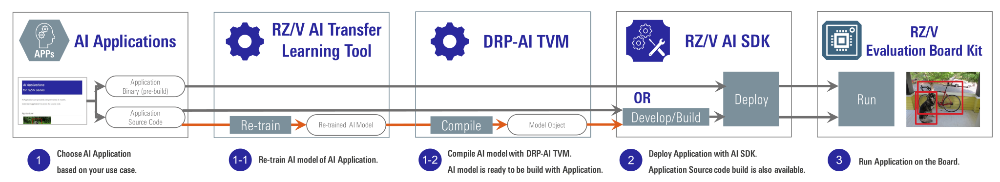
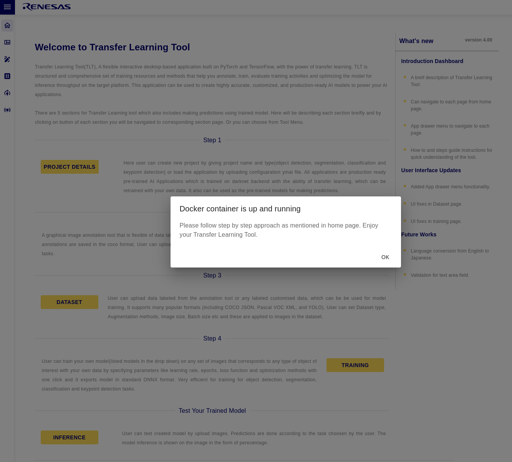
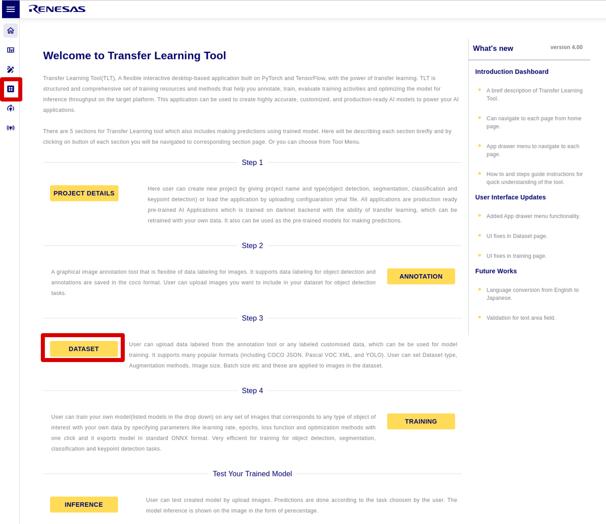
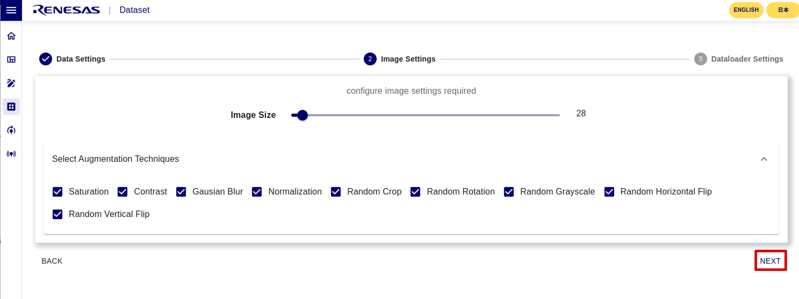
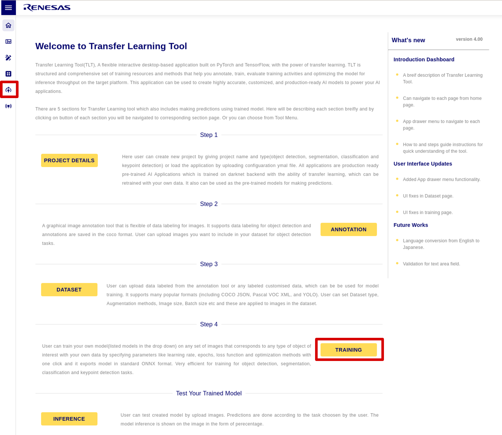
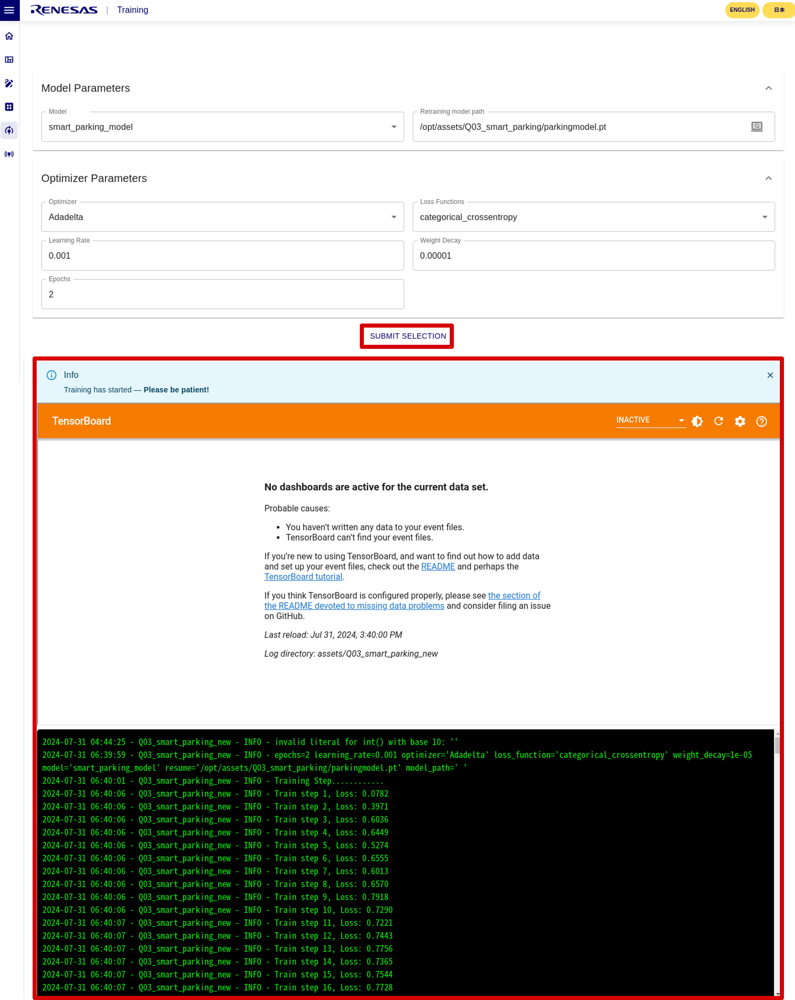
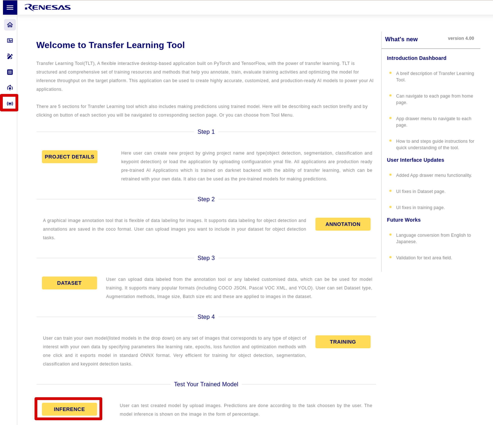

    

        

How to Re-train AI model
        

    

 
 
<h5>
  This page explains how to re-train the AI model of AI Applications using <b>RZ/V AI Transfer Learning Tool</b>.
    
  Supported version: <b>RZ/V AI Applications v4.00</b> 
</h5>

 

<h2 id="intro">Introduction</h2>

  

    

      RZ/V AI Transfer Learning Tool (TLT) can re-train AI model used in  <a href="{{ site.url }}{{ site.baseurl }}" ><b>RZ/V AI Applications</b></a> with different datasets.
       
       
    

    

      
       
       
       
    

    

      RZ/V AI Transfer Learning Tool has 5 Sections. 
      <ul>
        <li>PROJECT DETAILS: Create new project or load an existing project.</li>
        <li>ANNOTASTION: Create your own training data by labeling images.</li>
        <li>DATASET: Load the dataset to be used for training.</li>
        <li>TRAINING: Train the model on the selected dataset.</li>
        <li>INFERENCE: Test the trained model.</li>
      </ul>
    

    

      
    

     
  

 
 
 

<h3 id="functions">Supported Functions of AI Applications</h3>

  

    

      <table class="gstable" style="font-size: 0.8em">
        <tr>
          <th rowspan="2">
            Function Name of AI Application
          </th>
          <th rowspan="2">
            TLT Project Name
          </th>
          <th rowspan="2">
            AI Model
          </th>
          <th rowspan="2">
            Task Type
          </th>
          <th rowspan="2">
            Download Dataset Name
            <a href="#footnote_dataset" class="text-white">
              *1
            </a>
          </th>
          <th colspan="2">
            Target product  
            in AI Application
          </th>
        </tr>
        <tr>
          <th>RZ/V2L</th>
          <th>RZ/V2H</th>
        </tr>
        <tr>
          <td>01_Head_count</td>
          <td>01_Head_count_yolov3</td>
          <td>YOLOv3</td>
          <td>Object detection</td>
          <td>Head Count(140MB)</td>
          <td>&#10004;</td>
          <td>&#10004;</td>
        </tr>
        <tr>
          <td rowspan="2">02_Line_crossing_object_counting</td>
          <td>02_Line_crossing_object_counting_tinyyolov3</td>
          <td>TinyYOLOv3</td>
          <td>Object detection</td>
          <td>Line Cross Object Counting(141MB)</td>
          <td>&#10004;</td>
          <td>-</td>
        </tr>
        <tr>
          <td>02_Line_crossing_object_counting_yolov3</td>
          <td>YOLOv3</td>
          <td>Object detection</td>
          <td>Line Cross Object Counting(141MB)</td>
          <td>-</td>
          <td>&#10004;</td>
        </tr>
        <tr>
          <td>04_Safety_helmet_vest_detection</td>
          <td>04_Safety_helmet_vest_detection_yolov3</td>
          <td>YOLOv3</td>
          <td>Object detection</td>
          <td>Safety Helmet Vest Detection(3.4GB)</td>
          <td>&#10004;</td>
          <td>-</td>
        </tr>
        <tr>
          <td>07_Animal_detection</td>
          <td>07_Animal_detection_yolov3</td>
          <td>YOLOv3</td>
          <td>Object detection</td>
          <td>Animal Detection(1.83GB)</td>
          <td>&#10004;</td>
          <td>&#10004;</td>
        </tr>
        <tr>
          <td rowspan="2">09_Human_gaze_detection</td>
          <td>09_Human_gaze_detection_resnet18</td>
          <td>ResNet18</td>
          <td>Classification</td>
          <td>Human gaze detection resnet18(17GB)<a href="#footnote_09data">*2</a></td>
          <td>&#10004;</td>
          <td>&#10004;</td>
        </tr>
        <tr>
          <td>09_Human_gaze_detection_tinyyolov2</td>
          <td>TinyYOLOv2</td>
          <td>Object detection</td>
          <td>Human gaze detection(4.43GB)<a href="#footnote_09data">*2</a></td>
          <td>&#10004;</td>
          <td>&#10004;</td>
        </tr>
        <tr>
          <td>11_Head_count_topview</td>
          <td>11_Head_count_topview_yolov3</td>
          <td>YOLOV3</td>
          <td>Object detection</td>
          <td>Head Count Topview(1.8GB)</td>
          <td>&#10004;</td>
          <td>&#10004;</td>
        </tr>
        <tr>
          <td rowspan="3">12_Hand_gesture_recognition_v2</td>
          <td>12_Hand_gesture_recognition_v2_resnet_18</td>
          <td>ResNet18</td>
          <td>Classification</td>
          <td>Hand Gesture Recognition Resnet(21.9GB)</td>
          <td>&#10004;</td>
          <td>-</td>
        </tr>
        <tr>
          <td>12_Hand_gesture_recognition_v2_tinyyolov3</td>
          <td>TinyYOLOv3</td>
          <td>Object detection</td>
          <td>Hand Gesture Recognition Tiny Yolo(21.9GB)</td>
          <td>&#10004;</td>
          <td>-</td>
        </tr>
        <tr>
          <td>12_Hand_gesture_recognition_yolov3</td>
          <td>YOLOv3</td>
          <td>Object detection</td>
          <td>Hand gesture recognitionyolov3(160MB)</td>
          <td>-</td>
          <td>&#10004;</td>
        </tr>
        <tr>
          <td>13_Car_ahead_departure_detection</td>
          <td>13_Car_ahead_departure_detection_tinyyolov3</td>
          <td>TinyYOLOv3</td>
          <td>Object detection</td>
          <td>Coco</td>
          <td>&#10004;</td>
          <td>-</td>
        </tr>
        <tr>
          <td rowspan="2">Q01_footfall_counter</td>
          <td>Q01_footfall_counter_tinyyolov3</td>
          <td>TinyYOLOv3</td>
          <td>Object detection</td>
          <td>Coco</td>
          <td>&#10004;</td>
          <td>-</td>
        </tr>
        <tr>
          <td>Q01_footfall_counter_yolov3</td>
          <td>YOLOV3</td>
          <td>Object detection</td>
          <td>Coco</td>
          <td>-</td>
          <td>&#10004;</td>
        </tr>
        <tr>
          <td>Q03_smart_parking</td>
          <td>Q03_smart_parking</td>
          <td>Custom model</td>
          <td>Classification</td>
          <td>Smart Parking(414MB)</td>
          <td>&#10004;</td>
          <td>-</td>
        </tr>
        <tr>
          <td>Q04_fish_classification</td>
          <td>Q04_fish_classification_resnet34</td>
          <td>ResNet34</td>
          <td>Classification</td>
          <td>Fish Classification(1.57GB)</td>
          <td>&#10004;</td>
          <td>-</td>
        </tr>
        <tr>
          <td rowspan="2">Q06_expiry_date_detection</td>
          <td>Q06_expiry_date_detection_tinyyolov3</td>
          <td>TinyYOLOv3</td>
          <td>Object detection</td>
          <td>Expiry Date Detection(1.32GB)</td>
          <td>&#10004;</td>
          <td>-</td>
        </tr>
        <tr>
          <td>Q06_expiry_date_detection_yolov3</td>
          <td>YOLOv3</td>
          <td>Object detection</td>
          <td>Expiry Date Detection(1.32GB)</td>
          <td>-</td>
          <td>&#10004;</td>
        </tr>
        <tr>
          <td>Q07_plant_disease_classification</td>
          <td>Q07_plant_disease_classification_resnet34</td>
          <td>ResNet34</td>
          <td>Classification</td>
          <td>Plant Disease(1.34GB)</td>
          <td>&#10004;</td>
          <td>-</td>
        </tr>
        <tr>
          <td rowspan="6">Q08_object_counter</td>
          <td>Q08_object_counter_animal_tinyyolov3</td>
          <td>TinyYOLOv3</td>
          <td>Object detection</td>
          <td>Object Counter Animal(6.97GB)</td>
          <td>&#10004;</td>
          <td>-</td>
        </tr>
        <tr>
          <td>Q08_object_counter_animal_yolov3</td>
          <td>YOLOv3</td>
          <td>Object detection</td>
          <td>Object Counter Animal(6.97GB)</td>
          <td>-</td>
          <td>&#10004;</td>
        </tr>
        <tr>
          <td>Q08_object_counter_coco_tinyyolov3</td>
          <td>TinyYOLOv3</td>
          <td>Object detection</td>
          <td>Coco</td>
          <td>&#10004;</td>
          <td>-</td>
        </tr>
        <tr>
          <td>Q08_object_counter_coco_yolov3</td>
          <td>YOLOv3</td>
          <td>Object detection</td>
          <td>Coco</td>
          <td>-</td>
          <td>&#10004;</td>
        </tr>
        <tr>
          <td>Q08_object_counter_vehicle_tinyyolov3</td>
          <td>TinyYOLOv3</td>
          <td>Object detection</td>
          <td>Object Counter Vehicle(1.5GB)</td>
          <td>&#10004;</td>
          <td>-</td>
        </tr>
        <tr>
          <td>Q08_object_counter_vehicle_yolov3</td>
          <td>YOLOv3</td>
          <td>Object detection</td>
          <td>Object Counter Vehicle(1.5GB)</td>
          <td>-</td>
          <td>&#10004;</td>
        </tr>
        <tr>
          <td>Q09_crack_segmentation</td>
          <td>Q09_crack_segmentation_unet</td>
          <td>UNet</td>
          <td>Segmentation</td>
          <td>Crack Segmentation(0.99GB)</td>
          <td>&#10004;</td>
          <td>&#10004;</td>
        </tr>
        <tr>
          <td rowspan="2">Q10_suspicious_person_detection</td>
          <td>Q10_suspicious_person_detection_tinyyolov3</td>
          <td>TinyYOLOv3</td>
          <td>Object detection</td>
          <td>Suspicious Person Detection(1.57GB)</td>
          <td>&#10004;</td>
          <td>-</td>
        </tr>
        <tr>
          <td>Q10_suspicious_person_detection_yolov3</td>
          <td>YOLOv3</td>
          <td>Object detection</td>
          <td>Suspicious Person Detection(1.57GB)</td>
          <td>-</td>
          <td>&#10004;</td>
        </tr>
        <tr>
          <td rowspan="2">Q11_fish_detection</td>
          <td>Q11_fish_detection_tinyyolov3</td>
          <td>TinyYOLOv3</td>
          <td>Object detection</td>
          <td>Fish Detection(700MB)</td>
          <td>&#10004;</td>
          <td>-</td>
        </tr>
        <tr>
          <td>Q11_fish_detection_yolov3</td>
          <td>YOLOv3</td>
          <td>Object detection</td>
          <td>Fish Detection(700MB)</td>
          <td>-</td>
          <td>&#10004;</td>
        </tr>
      </table>
      <h6>
        
          *1: Datasets will be downloaded automatically as needed.
           
        
        
          *2: This file is temporarily unavailable for automatic download. To obtain the file, please contact <a href="https://www.renesas.com/support">Renesas Technical Support</a>.
           
        
      </h6>
    

    

      <h4 id="unsupport">Unsupported Functions of AI Applications</h4>
      The following Functions of AI Applications are NOT supported. 
      <ul>
        <li>03_Elderly_fall_detection</li>
        <li>05_Age_gender_detection</li>
        <li>06_Face_recognition_spoof_detection</li>
        <li>08_Hand_gesture_recognition</li>
        <li>10_Driver_monitoring_system</li>
        <li>Q02_face_authentication</li>
        <li>Q05_suspicious_activity</li>
      </ul>
    

  

 

<h2 id="install">Installation</h2>
To start using RZ/V AI Transfer Learning Tool, PC that can display the desktop with the following environment is recommended. 

<h3 id="hw">Hardware</h3>

  

    

      <table>
        <tr>
          <th>Description</th>
          <th>Specification</th>
        </tr>
        <tr>
          <td>Linux OS</td>
          <td>Ubuntu 20.04 and above.</td>
        </tr>
        <tr>
          <td>Processor</td>
          <td>Intel(R) Xeon(R) and above.</td>
        </tr>
        <tr>
          <td>GPU</td>
          <td>Any GPU with CUDA.</td>
        </tr>
        <tr>
          <td>Storage</td>
          <td>At least 100GB of free space is necessary.</td>
        </tr>
      </table>
    

  

<h3 id="sw">Software</h3>

  

    

      <table>
        <tr>
          <th>Description</th>
          <th>Specification</th>
        </tr>
        <tr>
          <td>Python</td>
          <td>3.10.5</td>
        </tr>
        <tr>
          <td>Docker</td>
          <td>27.0.3</td>
        </tr>
      </table>
      Other software not listed above will be installed automatically when you install the tool.
    

  

 

<h3 id="installpro">Installation procedures</h3>
This chapter describes the installation procedure when using <b>RZ/V AI Transfer Learning Tool alone</b>. 
  

    Note
    If you use <b>AI Navigator of e2 studio</b>, the installation procedure is different, so please refer to <a href="{{ site.url }}{{ site.baseurl }}">AI Navigator Quick Start Guide</a>.
  

  

    

      <ol>
        <li>
          If you have not yet obtained <b>RZ/V AI Transfer Learning Tool v4.00</b>, click on the link below to download it.
            
          <a class="btn btn-primary download-button" href="https://www.renesas.com/document/sws/rzv-ai-transfer-learning-tool-v400" role="button">Download Link</a>
            
        </li>
        <li>
          Put the downloaded tar file into a Linux PC and extract it using the following command in a terminal. 

tar -xzvf RTK0EF0178Z04000SJ_rzv-ai-tlt.tar.gz

           
          Make sure the following folders and files are generated after extracting the tar file.
          <table id="demodirs" class="mytable">
            <caption>Tool File Structure</caption>
            <tr>
              <th>Folder or File Name</th>
              <th>Description</th>
            </tr>
            <tr>
              <td rowspan="1">rzv_ai_tlt_v4.00/</td>
              <td>Working directory.</td>
            </tr>
            <tr>
              <td rowspan="1">docs/</td>
              <td>User's Manual.</td>
            </tr>
          </table>
        </li>
        <li>
          Change to <code>tlt_backend</code> directory and install the tool. 

cd RTK0EF0178Z04000SJ_rzv-ai-tlt/rzv_ai_tlt_v4.00/tlt_backend
./install_docker.sh

           
        </li>
        <li>
          Build the docker image and start the docker container. 

./launch_tlt_service.sh

           
        </li>
        <li>
          Change to <code>rzv_ai_tlt_v4.00</code> directory and launch the tool. 

cd ../
./start_rzv_ai_tlt_gui.sh

           
          
           
           
          If the popup is "Docker container is up and running", click "OK" to start. 
          

            Note
            If the docker container is not running, close the GUI and start the docker container with the following command. 

sudo docker restart tltdoc

            Once the container is started, please start again from step 4.
          

        </li>
      </ol>
    

  

 

<h2 id="retrain">Re-train the AI model</h2>
Once the <a href="{{ site.url }}{{ site.baseurl }}#install"><b>installation</b></a> is complete, you can retrain the model. 

<h3 id="project">Step 1: Create the TLT project</h3>

  

    

      <ol>
        <li>Select <b>PROJECT DETAILS</b>. 
           
          
           
           
        </li>
        <li>After selecting <b>UPLOAD</b>, upload the YAML file in <b>UPLAOD YAML</b>. 
          The YAML files for existing projects are located at <code>rzv_ai_tlt_v4.00/tlt_backend/assets/(any YAML file of TLT project)/config.yaml</code>. 
          This time, we uploaded <code>rzv_ai_tlt_v4.00/tlt_backend/assets/Q03_smart_parking/config.yaml</code>. 
           
          
           
           
        </li>
        <li><b>Set the project name</b> and click <b>SUBMIT SELECTION</b>. 
          (The project name must be different from any existing project.) 
          If successful, <b>Successfully created the task!!</b> will be displayed.
           
           
          
           
           
        </li>
      </ol>
    

  

 

<h3 id="annotation">Step 2: Create the custom dataset</h3>

  

    

      In ANNOTATION, you can create custom datasets <b>only for object detection</b>. 
       
      
       
       
      This time, since <code>Q03_smart_parking</code> is a classification model, we will skip ANNOTATION. 
      Please refer to the user's manual for how to use ANNOTATION. 
    

  

 

<h3 id="dataset">Step 3: Load the dataset</h3>

  

    

      <ol>
        <li>Select <b>DATASET</b>. 
           
          
           
           
        </li>
        <li>Click <b>Download Dataset</b> and Select a dataset from the list. 
          This time, we use <code>Smart Parking</code>. 
           
          
           
           
        </li>
        <li>Click <b>the Download button</b> to download the dataset. 
          (After it reaches 100%, it will take some time to unpack the downloaded file, depending on the size of the dataset.) 
           
          
           
           
        </li>
        <li>Click <b>SELECT DIRECTORY</b> to select the dataset directory, and click <b>NEXT</b>. 
          The downloaded dataset is located at <code>rzv_ai_tlt_v4.00/tlt_backend/datasets/</code>. 
          This time, we use <code>rzv_ai_tlt_v4.00/tlt_backend/datasets/Q03_smart_parking/</code>. 
           
          
           
           
        </li>
        <li>Set the image size to input to the model and select Augmentation. 
          This time, leave the defaults and click <b>NEXT</b>. 
           
          
           
           
        </li>
        <li>Set the dataloader parameters according to your PC environment. 
          This time, leave the defaults and click <b>FINISH</b>. 
           
          
           
           
        </li>
        <li>After confirming the settings, click <b>SUBMIT SELECTION</b>. 
          If the load is successful, the dataset configuration will be displayed. 
           
          
           
           
        </li>
      </ol>
    

  

 

<h3 id="training">Step 4: Re-train the model</h3>

  

    

      <ol>
        <li>Select <b>TRAINING</b>. 
           
          
           
           
        </li>
        <li>Check the model and set the optimizer parameters. 
          Click <b>SUBMIT SELECTION</b> and the learning log will be displayed. 
          This time, leave everything as default. 
           
          
           
           
        </li>
        <li>When <b>Training Completed!!!</b> pop-up appears, click <b>OK</b> to complete the training. 
           
          
           
           
          The trained model is stored in the following directory. 
          <code>rzv_ai_tlt_v4.00/tlt_backend/assets/(Your TLT prject name)</code>. 
        </li>
      </ol>
    

  

 

<h3 id="inference">Step 5: Test the trained model</h3>

  

    

      <ol>
        <li>Select <b>INFERENCE</b> 
           
          
           
           
        </li>
        <li>Click <b>UPLOAD IMAGE</b> to select a test image. 
          This time, we use <code>rzv_ai_tlt_v4.00/tlt_backend/datasets/Q03_smart_parking/valid/occupied/0.jpg</code>. 
           
          
           
           
        </li>
        <li>Click <b>PREDICT</b> to test. 
          Since <code>Q03_smart_parking</code> is a classification that predicts whether it is "occupied" or "empty", the result is displayed as a string. 
           
          
           
           
        </li>
      </ol>
    

  

 

<h2 id="tips">Tips</h2>
<h3 id="next">Next steps</h3>

  

    

      Once the model has been trained, the next step is to convert it for DRP-AI using DRP-AI TVM. 
      For instructions on how to use DRP-AI TVM, please see <a href="https://github.com/renesas-rz/rzv_drp-ai_tvm">DRP-AI TVM GitHub</a>. 
      If you use DRP-AI TVM with AI Navigator, sample code for DRP-AI TVM conversion scripts for each model is provided. 
    

  

 

<h3 id="uninstall">Uninstallation</h3>

  

    

      For instructions on how to uninstall TLT, please refer to the user's manual. 
    

  

 
 

  

      

          <a class="btn btn-secondary square-button" href="{{ site.url }}{{ site.baseurl }}" role="button">
              Back to Home >
          </a>
      

  

