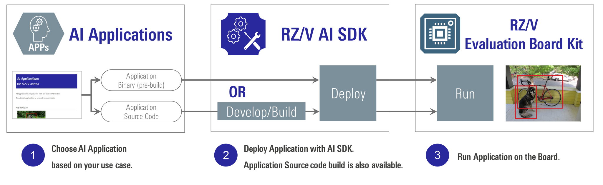
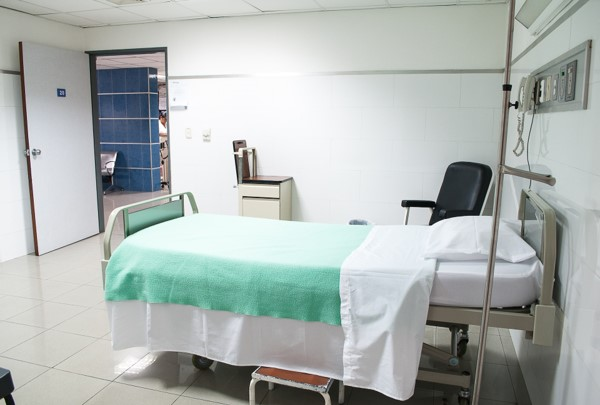
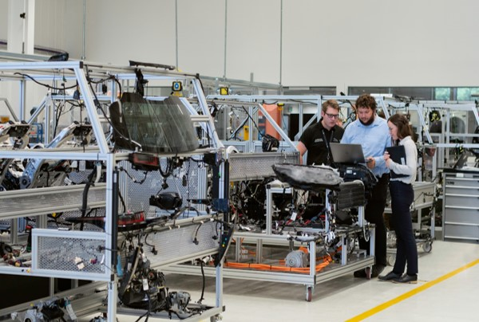

    

        

            

                

                    
                        RZ/V AI Web
                    
                

                

                    

                        <a class="btn btn-secondary chkout-btn mt-1" 
                            style=" text-align:left;" 
                            href="{{ site.url }}{{ site.baseurl }}" 
                            role="button">
                            
                                
                                    First, check out 
                                 
                                
                                    RZ/V AI Software
                                
                             
                        </a>
                    
    
                

            

        

        <!-- 

            <i>
                The best solution for starting your AI applications.
                 
                
                    AI Applications and AI SDK are quick and easy solutions for starting AI.  
                     
                    It provides various AI applications for free.
                
            </i>
        
 -->
    

    

        

        <!-- 
 -->
            <!--   -->
             
            <i>
                <h4 class="mb-2">
                    The best solution for starting your AI applications.
                </h4>
                <h5>
                    AI Applications and AI SDK are quick and easy solutions for starting AI.   
                    It provides various AI applications for free.
                </h5>
            </i>
        

        <!--   -->
        

             
             
        

         
         
         
    

 
<h3 id="new" >
    What's new
</h3>

    

        

            <h6 align="right" >
                2025.3.11
            </h6>
            <ul>
                <li>
                    <b>AI Applications v5.10</b> is released.
                    <ul>
                        <li> 
                            Added RZ/V2N Evaluation Board Kit support for 51 applications.
                        </li>
                        <li> 
                            Updated the AI model used in 3 applications.
                            <ul>
                                <li> 
                                    Multi-Camera Parking Lot Management
                                </li>
                                <li> 
                                    Multi-Camera Vehicle Detector
                                </li>
                                <li> 
                                    Car Accident Prevention Alert
                                </li>
                            </ul>
                        </li>
                        <li> 
                            Supported RZ/V2N AI SDK v5.00.
                        </li>
                    </ul>
                </li>
            </ul>
            For more details, see <a href="{{ site.url }}{{ site.baseurl }}"><b>AI Applications</b></a>.
             
             
            <ul>
                <li>
                    <b>RZ/V2N AI SDK v5.00</b> is released.
                    <ul>
                        <li> 
                            Supported DRP-AI TVM v2.3.0. 
                        </li>
                        <li> 
                            Supported RZ/V2N Linux BSP v1.0.0. 
                        </li>
                        <li>
                            Supported Graphics Library Unrestricted Version v3.1.2.3. 
                        </li>
                        <li>
                            Supported Video Codec Library v3.3.3.1. 
                        </li>
                        <li>
                            Supported OpenCV Accelerator v1.10. 
                        </li>
                    </ul>
                </li>
            </ul>
            For more details, see <a href="{{ site.url }}{{ site.baseurl }}#v2n-spec"><b>RZ/V2N AI SDK Specification</b></a>.
             
             
        

        

            <a class="btn btn-secondary square-button" href="{{ site.url }}{{ site.baseurl }}" role="button">
                View Version History >
            </a>
        

    

 
 
 
<h3 id="getting-started" >Getting Started</h3>

    

        

            Renesas RZ/V AI Software Development Kit (AI SDK) is the most comprehensive solution for building end-to-end accelerated AI applications.  
             
             
            Getting Started is a complete guide to learn how to run RZ/V AI Applications with RZ/V AI SDK.
             
            <!-- <h5>Get your target board now and <a href="{{ site.url }}{{ site.baseurl }}">GET STARTED.</a></h5> -->
            <a class="btn btn-secondary square-button ms-3 mt-1" style="text-align:left; width: 70%;" href="{{ site.url }}{{ site.baseurl }}" role="button">
                
                    
                        Get the target board now and
                     
                    Get Started!
                 
                
                    How to startup RZ/V board? How to run AI Applications?
                
            </a>
             
             
            <a href="#video">Tutorial video</a> will help you understand better.  
        

        

            <!--  -->
            
        

    

 
 
 
 

<h3 id="ai-applications">AI Applications</h3>
<!-- 

    AI Applications provides the source code, pre-build application binary and pre-trained AI model objects, 
    which allow you to select the application from various use cases, and run it on the board immediately. 
    To see the overview about AI Applications, please refer to <a href="{{ site.url }}{{ site.baseurl }}">About AI Applications</a> page. 

Choose the category of applications.
 -->

    

        

            AI Applications provides the source code, pre-build application binary and pre-trained AI model objects, which allow you to select the application from various use cases, and run it on the board immediately. 
        

    

    

        

            <h4 class="u_line">
                Find your AI Application
            </h4>
        

        

            <a class="btn btn-secondary square-button ms-3 mt-1" 
                style="text-align:left; width: 100%;" 
                href="{{ site.url }}{{ site.baseurl }}" 
                role="button">
                
                    RZ/V AI Applications >
                 
                
                    List of AI Applications 
                    Can be used AS IS.
                
            </a>
        

        

            <a class="btn btn-secondary square-button-gray ms-3 mt-1" 
                style="text-align:left; width: 100%; " 
                href="{{ site.url }}{{ site.baseurl }}" 
                role="button">
                
                    About AI Applications >
                 
                
                    What is AI Applications? 
                    How is directory/file structured?
                
            </a>
        

    

    

        

            <h4 class="u_line">
                Category
            </h4>
            You can search the AI Application by its category.
             
        

        

            

                    <a href="{{ site.url }}{{ site.baseurl }}#agriculture">
                        
                        
Agriculture

                    </a> 
            

        

        

            

                    <a href="{{ site.url }}{{ site.baseurl }}#healthcare">
                        
                        
Healthcare

                    </a> 
            

        

        

            

                    <a href="{{ site.url }}{{ site.baseurl }}#industrial">
                        
                        
Industrial

                    </a> 
            

        

        

            

                    <a href="{{ site.url }}{{ site.baseurl }}#building">
                        
                        
Smart Building

                    </a> 
            

        

        

            

                    <a href="{{ site.url }}{{ site.baseurl }}#building">
                        
                        
Smart City

                    </a> 
            

        

        

            

                    <a href="{{ site.url }}{{ site.baseurl }}#home">
                        
                        
Smart Home

                    </a> 
            

        

        

            

                    <a href="{{ site.url }}{{ site.baseurl }}#retail">
                        
                        
Retail

                    </a> 
            

        

    

 
 
<h3 id="demo">Demo</h3>

    

        

            With the demo binary, users can try the AI Applications without having AI SDK environment. 
            Download the Demo for your Evaluation Board Kit (EVK) and see each How to Use Guide.
            

                

                    <h4 class="u_line">
                        For RZ/V2L EVK
                    </h4>
                    

                        

                            

                                <a class="btn btn-primary download-button" href="https://www.renesas.com/document/sws/rzv2l-ai-applications-demo-sd-image-version-500" role="button">
                                    Download RZ/V2L AI Applications Demo
                                </a>
                            

                            <a class="btn btn-secondary square-button ms-3 mt-1" style="text-align:left;" href="{{ site.url }}{{ site.baseurl }}" role="button">
                                
                                    
                                        RZ/V2L AI Applications Demo
                                     
                                    How to Use Guide
                                 
                                
                                    What is RZ/V2L AI Applications Demo? 
                                    How can I run the Demo? 
                                
                            </a>
                        

                        

                            <ul>
                                <li>
                                    Environment:
                                    <ul>
                                        <li>
                                            AI Applications v5.00
                                        </li>
                                        <li>
                                            RZ/V2L AI SDK v5.00
                                        </li>
                                    </ul>
                                </li>
                                <li>
                                    Demo zip file size: 2.8GB
                                </li>
                            </ul>
                        

                    

                      
                 

                

                    <h4 class="u_line">
                        For RZ/V2H EVK
                    </h4>
                    

                        

                            

                                <a class="btn btn-primary download-button" href="https://www.renesas.com/document/sws/rzv2h-ai-applications-demo-sd-image-version-500" role="button">
                                    Download RZ/V2H AI Applications Demo
                                </a>
                            
    
                            <a class="btn btn-secondary square-button ms-3 mt-1" style="text-align:left;" href="{{ site.url }}{{ site.baseurl }}" role="button">
                                
                                    
                                        RZ/V2H AI Applications Demo
                                     
                                    How to Use Guide
                                 
                                
                                    What is RZ/V2H AI Applications Demo? 
                                    How can I run the Demo? 
                                
                            </a>
                        

                        

                            <ul>
                                <li>
                                    Environment:
                                    <ul>
                                        <li>
                                            AI Applications v5.00
                                        </li>
                                        <li>
                                            RZ/V2H AI SDK v5.00
                                        </li>
                                    </ul>
                                </li>
                                <li>
                                    Demo zip file size: 3.4GB
                                </li>
                            </ul>
                        

                    

                      
                

            

        

    

 
 
<h3 id="video">Video</h3>

    

        

            <h4 class="u_line" id="training-video">
                Training video
            </h4>
        

        

            Tutorial videos to explain the contents of Getting Started.
              
        

    

    

<!-- Video panel start -->
        

            

                

                    <iframe 
                        class="video-iframe"
                        src="https://www.youtube.com/embed/ErmISuWkkBQ" 
                        title="YouTube video player" 
                        frameborder="0" 
                        allow="accelerometer; autoplay; clipboard-write; encrypted-media; gyroscope; picture-in-picture; web-share" 
                        allowfullscreen>
            </iframe>
                

                

                    

                        <b>
                            <a href="https://youtu.be/ErmISuWkkBQ">
                                RZ/V2H AI Applications Tutorial - Getting Started v3.00 (Youtube) 
                            </a>
                        </b>
                    

                    

                        <h6 class="mb-0" style="color: gray;" align="right">24:36</h6>
                    

                

                

                    <ul>
                        <li>
                            <b>Latest Tutorial Video for RZ/V2H</b>
                        </li>
                        <li>
                            For RZ/V2H Evaluation Board Kit.
                        </li>
                        <li>
                            For <b>RZ/V2H</b> AI SDK <b>v3.00</b>.
                            <h6>
                                <ul>
                <li>
                                        Only supports eSD bootloader.
                                    </li>
                                </ul>
                            </h6>
                </li>
            </ul>
        

            

        

        <!-- Video panel end -->
        <!-- Video panel start -->
        

            

                

                    <iframe 
                        class="video-iframe"
                        src="https://www.youtube.com/embed/CPeE2q3TdOY" 
                        title="YouTube video player" 
                        frameborder="0" 
                        allow="accelerometer; autoplay; clipboard-write; encrypted-media; gyroscope; picture-in-picture; web-share" 
                        allowfullscreen>
            </iframe>
                

                

                    

                        <b>
                            <a href="https://youtu.be/CPeE2q3TdOY">
                                RZ/V2L AI Applications Tutorial - Getting Started v2.10 (Youtube) 
                            </a>
                        </b>
                    

                    

                        <h6 class="mb-0" style="color: gray;" align="right">25:43</h6>
                    

                

                

                    <ul>
                        <li>
                            <b>Latest Tutorial Video for RZ/V2L</b>
                        </li>
                        <li>
                            For RZ/V2L Evaluation Board Kit.
                        </li>
                        <li>
                            For <b>RZ/V2L</b> AI SDK <b>v2.10</b>.
                            <h6>
                                <ul>
                                    <li>
                                        Supports both eSD and eMMC bootloader.
                                    </li>
                <li>
                    In this video, eSD bootloader is used.
                </li>
            </ul>
                            </h6>
                        </li>
                    </ul>
                

            

        

        <!-- Video panel end -->
        <!-- Video panel start -->
        

            

                

                    <iframe 
                        class="video-iframe"
                        src="https://www.youtube.com/embed/wFbTomH8oPs" 
                        title="YouTube video player" 
                        frameborder="0" 
                        allow="accelerometer; autoplay; clipboard-write; encrypted-media; gyroscope; picture-in-picture; web-share" 
                        allowfullscreen>
            </iframe>
                

                

                    

                        <b>
                            <a href="https://youtu.be/wFbTomH8oPs">
                                RZ/V2L AI Applications Tutorial - Getting Started v1.00 (Youtube)
                            </a>
                        </b>
                    

                    

                        <h6 class="mb-0" style="color: gray;" align="right">33:56</h6>
                    

                

                

                    <ul>
                <li>
                            For RZ/V2L Evaluation Board Kit.
                        </li>
                        <li>
                            For <b>RZ/V2L</b> AI SDK <b>v1.10</b>.
                            <h6>
                                <ul>
                                    <li>
                                        Only supports eMMC bootloader.
                                    </li>
                                </ul>
                            </h6>
                        </li>
                    </ul>
                

            

        

        <!-- Video panel end -->
    

     
    

        

            <h4 class="u_line" id="app-video">
                AI Applications video
            </h4>
        

        

            Video to show sample use-cases of <a href="{{ site.url }}{{ site.baseurl }}">RZ/V AI Applications</a>.
                      
        

    

    

        <!-- Video panel start -->
        

            

                

                    <iframe 
                        class="video-iframe"
                        src="https://www.youtube.com/embed/CjX_DyCVtM8" 
                        title="YouTube video player" 
                        frameborder="0" 
                        allow="accelerometer; autoplay; clipboard-write; encrypted-media; gyroscope; picture-in-picture; web-share" 
                        allowfullscreen>
                    </iframe>
                

                

                    

                        <b>
                            <a href="https://youtu.be/CjX_DyCVtM8">
                                    Agriculture : 
                                    Defense Wild Animals for Crop (YouTube)
                            </a>
                        </b>
                    

                    

                        <h6 class="mb-0" style="color: gray;" align="right">1:31</h6>
                    

                

                

                    <ul class="mb-2">
                        <li>
                            Environment
                            <h6 class="mb-1">
                                <ul>
                                    <li>
                                        RZ/V2H Evaluation Board Kit
                                    </li>
                                    <li>
                                        AI Applications v4.00
                                    </li>
                                    <li>
                                        Input: USB Camera (640x480)
                                    </li>
                                    <li>
                                        Output: HDMI (1920x1080)
                                    </li>
                                </ul>
                            </h6>
                        </li>
                    </ul>
                    

                        <a class="devicelinkbutton" 
                            href="{{ site.url }}{{ site.baseurl }}#agriculture1" 
                            style="color:white">
                            More Details >
                        </a>
                    

                

            

        

        <!-- Video panel end -->
        <!-- Video panel start -->
        

            

                

                    <iframe 
                        class="video-iframe"
                        src="https://www.youtube.com/embed/XELOK3NJq68" 
                        title="YouTube video player" 
                        frameborder="0" 
                        allow="accelerometer; autoplay; clipboard-write; encrypted-media; gyroscope; picture-in-picture; web-share" 
                        allowfullscreen>
                    </iframe>
                

                

                    

                        <b>
                            <a href="https://youtu.be/XELOK3NJq68">
                                Smart Building : 
                                Conference Room Usage Monitor (YouTube)
                            </a>
                        </b>
                    

                    

                        <h6 class="mb-0" style="color: gray;" align="right">1:59</h6>
                    

                

                

                    <ul class="mb-2">
                        <li>
                            Environment
                            <h6 class="mb-1">
                                <ul>
                                    <li>
                                        RZ/V2H Evaluation Board Kit
                                    </li>
                                    <li>
                                        AI Applications v4.00
                                    </li>
                                    <li>
                                        Input: USB Camera (640x480)
                                    </li>
                                    <li>
                                        Output: HDMI (1920x1080)
                                    </li>
                                </ul>
                            </h6>
                        </li>
                    </ul>
                    

                        <a class="devicelinkbutton" 
                            href="{{ site.url }}{{ site.baseurl }}#building2" 
                            style="color:white">
                            More Details >
                        </a>
                    

                

            

        

        <!-- Video panel end -->
        <!-- Video panel start -->
        

            

                

                    <iframe 
                        class="video-iframe"
                        src="https://www.youtube.com/embed/neH2vfbJQP8" 
                        title="YouTube video player" 
                        frameborder="0" 
                        allow="accelerometer; autoplay; clipboard-write; encrypted-media; gyroscope; picture-in-picture; web-share" 
                        allowfullscreen>
                    </iframe>
                

                

                    

                        <b>
                            <a href="https://youtu.be/neH2vfbJQP8">
                                Industrial : 
                                Access Control (YouTube)
                            </a>
                        </b>
                    

                    

                        <h6 class="mb-0" style="color: gray;" align="right">1:42</h6>
                    

                

                

                    <ul class="mb-2">
                        <li>
                            Environment
                            <h6 class="mb-1">
                                <ul>
                                    <li>
                                        RZ/V2H Evaluation Board Kit
                                    </li>
                                    <li>
                                        AI Applications v4.00
                                    </li>
                                    <li>
                                        Input: USB Camera (640x480)
                                    </li>
                                    <li>
                                        Output: HDMI (1920x1080)
                </li>
            </ul>
                            </h6>
                        </li>
                    </ul>
                    

                        <a class="devicelinkbutton" 
                            href="{{ site.url }}{{ site.baseurl }}#industrial2" 
                            style="color:white">
                            More Details >
                        </a>
                    

        

    

        

        <!-- Video panel end -->
    

 
 
 
 
<!-- <h3 id="blog">Blogs</h3> -->
<!-- 

    

        
 -->
            <!-- 

                <h5 class="mb-2">
                    <a href="https://www.renesas.com/blogs/check-out-latest-features-ai-applications-v210">Check Out the Latest Features in AI Applications v2.10!</a>
                </h5>
                

                    

                        

                            Introducing the lineup of RZ/V AI applications, offered with AI Applications v2.10.
                        

                        

                            Published: <b>Dec. 22, 2023.</b>
                        

                    

                

            
 -->
            <!--  
            

            

                <h5 class="mb-2">
                    <a href="https://www.renesas.com/blogs/check-out-new-features-ai-applications-v200">Check Out the New Features in AI Applications v2.00!</a>
                </h5>
                

                    

                        

                            To facilitate the tedious task of designing AI solutions from scratch, Renesas proposes RZ/V MPU AI Apps, AI applications that can be easily implemented without AI training.
                        

                        

                            Published: <b>Sep. 22, 2023.</b>
                        

                    

                

            
 -->
            <!--  
            

            

                <h5 class="mb-2">
                    <a href="https://www.renesas.com/blogs/lets-find-ai-apps-you-want-introducing-renesas-ai-apps-available-free-charge">Let's find the AI Apps You Want, Introducing Renesas AI Apps Available Free of Charge</a>
                </h5>
                

                    

                        

                            Introduction to RZ/V AI applications that can be easily implemented without AI training
                        

                        

                            Published: <b>Jun. 12, 2023.</b>
                        

                    

                

            

             
            
 -->
        <!-- 

    

 
 
 
  -->

<h3 id="reference">Reference</h3>

    

        

            Followings are references of related software/documentation.  
            <table class="gstable ms-4">
                <tr>
                    <th>Product</th>
                    <th>Link</th>
                    <th>Details</th>
                </tr>
                <tr>
                    <td rowspan="1">Common</td>
                    <td>
                        <a href="https://github.com/renesas-rz/rzv_drp-ai_tvm" target="_blank" rel="noopener noreferrer">
                            DRP-AI TVM
                        </a>
                    </td>
                    <td>
                        <small>
                        Machine Learning Compiler plugin for Apache TVM with AI accelerator DRP-AI. 
                        <b>Automatically installed in AI SDK.</b>
                        </small>
                    </td>
                </tr>
                <!-- RZ/V2L Reference -->
                <tr>
                    <td rowspan="3">RZ/V2L</td>
                    <td>
                        <a href="https://www.renesas.com/products/microcontrollers-microprocessors/rz-arm-based-high-end-32-64-bit-mpus/drp-ai-translator" target="_blank" rel="noopener noreferrer">
                            DRP-AI Translator
                        </a>
                    </td>
                    <td>
                        <small>
                        AI model conversion tool for DRP-AI embedded in RZ/V2L. 
                        Included in RZ/V2L AI SDK.
                        </small>
                    </td>
                </tr>
                <tr>
                    <td>
                        <a href="https://www.renesas.com/software-tool/rzv-verified-linux-package" target="_blank" rel="noopener noreferrer">
                            RZ/V Verified Linux Package
                        </a>
                    </td>
                    <td>
                        <small>
                        Linux Packages for MPUs of the RZ/V2L. 
                        Used in RZ/V2L AI SDK.
                        </small>
                    </td>
                </tr>
                <tr>
                    <td>
                        <a href="https://www.renesas.com/products/microcontrollers-microprocessors/rz-arm-based-high-end-32-64-bit-mpus/rzv2l-drp-ai-support-package" target="_blank" rel="noopener noreferrer">
                            RZ/V2L DRP-AI Support Package
                        </a>
                    </td>
                    <td>
                        <small>
                        Software to use DRP-AI with RZ/V Vefiried Linux Package, which includes DRP-AI Driver. 
                        Used in RZ/V2L AI SDK.
                        </small>
                    </td>
                </tr>
                <!-- RZ/V2H Reference -->
                <tr>
                    <td rowspan="9">RZ/V2H</td>
                    <td>
                            <a href="https://www.renesas.com/software-tool/drp-ai-translator-i8" target="_blank" rel="noopener noreferrer">
                                DRP-AI Translator i8
                            </a>
                    </td>
                    <td>
                        <small>
                        AI model conversion tool for DRP-AI embedded in RZ/V2H. 
                        Included in RZ/V2H AI SDK.
                        </small>
                    </td>
                </tr>
                <tr>
                    <td>
                        <a href="https://www.renesas.com/document/mas/rzv2h-bsp-manual-set-rtk0ef0045z94001azj-v100zip" target="_blank" rel="noopener noreferrer">
                            RZ/V2H BSP Manual Set
                        </a>
                    </td>
                    <td>
                        <small>
                        Document for Linux Drivers used in RZ/V2H AI SDK.
                        </small>
                    </td>
                </tr>
                <tr>
                    <td>
                        <a href="https://www.renesas.com/document/mas/rzv2h-group-and-rzv2n-group-linux-interface-specification-gstreamer-users-manual-software" target="_blank" rel="noopener noreferrer">
                            RZ/V2H Video Codec Library  User's Manual
                        </a>
                    </td>
                    <td>
                        <small>
                        RZ/V2H Group Linux Interface Specification GStreamer User's Manual: Software. 
                        Document for GStreamer in Video Codec Library used in RZ/V2H AI SDK.
                        </small>
                    </td>
                </tr>
                <tr>
                    <td>
                        <a href="https://github.com/renesas-rz/rzv2h_opencv_accelerator" target="_blank" rel="noopener noreferrer">
                            RZ/V2H OpenCV Accelerator 
                        </a>
                    </td>
                    <td>
                        <small>
                        OpenCV Accelerator which performs OpenCV function in high performance by using DRP. 
                        Used in RZ/V2H AI SDK.
                        </small>
                    </td>
                </tr>
                <tr>
                    <td>
                        <a href="https://github.com/renesas-rz/rzv2h_drp-ai_driver" target="_blank" rel="noopener noreferrer">
                            RZ/V2H DRP-AI Driver
                        </a>
                    </td>
                    <td>
                        <small>
                        Linux driver to use DRP-AI on RZ/V2H. 
                        Used in RZ/V2H AI SDK.
                        </small>
                    </td>
                </tr>
                <tr>
                    <td>
                        <a href="https://www.renesas.com/us/en/software-tool/rzv2h-ros2-package" target="_blank" rel="noopener noreferrer">
                            RZ/V2H ROS2 Package 
                        </a>
                    </td>
                    <td>
                        <small>
                        Package that can be applied to RZ/V2H AI SDK to use ROS2.
                        </small>
                    </td>
                </tr>
                <tr>
                    <td>
                        <a href="https://www.renesas.com/software-tool/rzv-group-multi-os-package" target="_blank" rel="noopener noreferrer">
                            RZ/V Multi-OS Package 
                        </a>
                    </td>
                    <td>
                        <small>
                        Package consisting of RZ/V Flexible Software Package (FSP) as software package for Renesas MCU with Arm&reg; Cortex-M, R Core and OpenAMP as standardization API of framework for interprocessor communication for developing multi OS solution. 
                        This package can be applied to RZ/V2H AI SDK.
                        </small>
                    </td>
                </tr>
                <tr>
                    <td>
                        <a href="https://www.renesas.com/software-tool/rz-mpu-security-package" target="_blank" rel="noopener noreferrer">
                            RZ MPU Security Package 
                        </a>
                    </td>
                    <td>
                        <small>
                        This package is to add Security functions (Secure Boot, Trusted Execution Environment, Hardware Cryptographic IP, Secure Debug, Security Configurator) to RZ MPU. 
                        This package can be applied to RZ/V2H AI SDK.
                        </small>
                    </td>
                </tr>
                <tr>
                    <td>
                        <a href="https://www.renesas.com/software-tool/rzv2h-isp-support-package" target="_blank" rel="noopener noreferrer">
                            RZ/V2H ISP Support Package 
                        </a>
                    </td>
                    <td>
                        <small>
                        Package that can be applied to RZ/V2H AI SDK to use Built-in ISP.
                        </small>
                    </td>
                </tr>
                <!-- RZ/V2N Reference -->
                <tr>
                    <td rowspan="8">RZ/V2N</td>
                    <td>
                            <a href="https://www.renesas.com/software-tool/drp-ai-translator-i8" target="_blank" rel="noopener noreferrer">
                                DRP-AI Translator i8
                            </a>
                    </td>
                    <td>
                        <small>
                        AI model conversion tool for DRP-AI embedded in RZ/V2N. 
                        Included in RZ/V2N AI SDK.
                        </small>
                    </td>
                </tr>
                <tr>
                    <td>
                        <a href="https://www.renesas.com/document/swo/rzv2h-and-rzv2n-bsp-manual-set-rtk0ef0045z94001azj-v102zip" target="_blank" rel="noopener noreferrer">
                            RZ/V2N BSP Manual Set
                        </a>
                    </td>
                    <td>
                        <small>
                        Document for Linux Drivers used in RZ/V2N AI SDK.
                        </small>
                    </td>
                </tr>
                <tr>
                    <td>
                        <a href="https://www.renesas.com/document/mas/rzv2h-group-and-rzv2n-group-linux-interface-specification-gstreamer-users-manual-software" target="_blank" rel="noopener noreferrer">
                            RZ/V2N Video Codec Library User's Manual
                        </a>
                    </td>
                    <td>
                        <small>
                        RZ/V2N Group Linux Interface Specification GStreamer User's Manual: Software. 
                        Document for GStreamer in Video Codec Library used in RZ/V2N AI SDK.
                        </small>
                    </td>
                </tr>
                <tr>
                    <td>
                        <a href="https://github.com/renesas-rz/rzv2n_opencv_accelerator" target="_blank" rel="noopener noreferrer">
                            RZ/V2N OpenCV Accelerator 
                        </a>
                    </td>
                    <td>
                        <small>
                        OpenCV Accelerator which performs OpenCV function in high performance by using DRP. 
                        Used in RZ/V2N AI SDK.
                        </small>
                    </td>
                </tr>
                <tr>
                    <td>
                        <a href="https://github.com/renesas-rz/rzv2n_drp-ai_driver" target="_blank" rel="noopener noreferrer">
                            RZ/V2N DRP-AI Driver
                        </a>
                    </td>
                    <td>
                        <small>
                        Linux driver to use DRP-AI on RZ/V2N. 
                        Used in RZ/V2N AI SDK.
                        </small>
                    </td>
                </tr>
                <!-- 6月release <tr>
                    <td>
                        <a href="https://www.renesas.com/us/en/software-tool/rzv2n-ros2-package" target="_blank" rel="noopener noreferrer">
                            RZ/V2N ROS2 Package 
                        </a>
                    </td>
                    <td>
                        <small>
                        Package that can be applied to RZ/V2N AI SDK to use ROS2.
                        </small>
                    </td>
                </tr> -->
                <tr>
                    <td>
                        <a href="https://www.renesas.com/software-tool/rzv-group-multi-os-package" target="_blank" rel="noopener noreferrer">
                            RZ/V Multi-OS Package 
                        </a>
                    </td>
                    <td>
                        <small>
                        Package consisting of RZ/V Flexible Software Package (FSP) as software package for Renesas MCU with Arm&reg; Cortex-M, R Core and OpenAMP as standardization API of framework for interprocessor communication for developing multi OS solution. 
                        This package can be applied to RZ/V2N AI SDK.
                        </small>
                    </td>
                </tr>
                <tr>
                    <td>
                        <a href="https://www.renesas.com/software-tool/rz-mpu-security-package" target="_blank" rel="noopener noreferrer">
                            RZ MPU Security Package 
                        </a>
                    </td>
                    <td>
                        <small>
                        This package is to add Security functions (Secure Boot, Trusted Execution Environment, Hardware Cryptographic IP, Secure Debug, Security Configurator) to RZ MPU. 
                        This package can be applied to RZ/V2N AI SDK.
                        </small>
                    </td>
                </tr>
                <tr>
                    <td>
                        <a href="https://www.renesas.com/software-tool/rzv2n-isp-support-package" target="_blank" rel="noopener noreferrer">
                            RZ/V2N ISP Support Package 
                        </a>
                    </td>
                    <td>
                        <small>
                        Package that can be applied to RZ/V2N AI SDK to use Built-in ISP.
                        </small>
                    </td>
                </tr>
            </table>
        

    

 
 

    

        

            <a class="btn btn-secondary square-button" href="{{ site.url }}{{ site.baseurl }}#page-top" role="button">
                Back to Top >
            </a>
        

    

