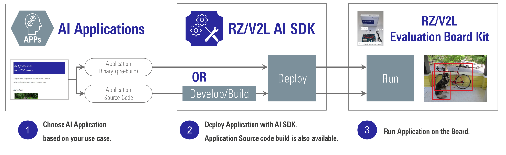

    

        

AI Applications and AI SDK 
on RZ/V series
        

    

    

        

         
         
            <i>
<h2 class="sub">The best solution for starting your AI applications.</h2>
<h5 class="sub">AI Applications and AI SDK are quick and easy solutions for starting AI.   
It provides various AI applications for free.</h5>
            </i>
        

 
        

             
             
        

        

             
            <a class=" text-right btn btn-secondary square-button" href="{{ site.url }}{{ site.baseurl }}">View AI Applications ></a>
            <a class="btn btn-secondary square-button" href="{{ site.url }}{{ site.baseurl }}" role="button">View AI SDK ></a>
        

    

 
 
 
<h3 id="getting-started" >Getting Started</h3>

    

        

Renesas RZ/V AI Software Development Kit (AI SDK) is the most comprehensive solution for building end-to-end accelerated AI applications.  AI SDK includes Yocto Linux with bootloader, Linux Kernel, Cross Compiler and a complete set of libraries for DRP-AI, graphics and codec.  
 
 
<i>Getting Started</i> is a complete guide to learn <b>how to run AI Applications</b>, which explains the procedure for setting up the development environment, compiling AI Applications, setting up the board and running AI Applications. 
 
<h5>Get your target board now and <a href="{{ site.url }}{{ site.baseurl }}">GET STARTED.</a></h5>  
        

        

        
        

    

 
 
 
 

<h3 id="ai-applications" align="center">AI Applications</h3>

AI Applications provides the source code, pre-build application binary and pre-trained AI model objects, 
which allow you to select the application from various use cases, and run it on the board immediately.

Choose the category of applications.

    

        

              
            <ul class="category">
                <li id="agriculture">
                    <a href="{{ site.url }}{{ site.baseurl }}#agriculture">Agriculture</a> 
                </li>
            </ul>
        

        

              
            <ul class="category">
                <li id="healthcare">       
                    <a href="{{ site.url }}{{ site.baseurl }}#healthcare">Healthcare</a>
                </li>
            </ul>
        

        

              
            <ul class="category">
                <li id="industrial">
                    <a href="{{ site.url }}{{ site.baseurl }}#industrial">Industrial</a>
                </li>
            </ul>
        

        

              
            <ul class="category">
                <li id="building">       
                    <a href="{{ site.url }}{{ site.baseurl }}#building">Smart Building</a>
                </li>
            </ul>
        

        

              
            <ul class="category">
                <li id="city">       
                    <a href="{{ site.url }}{{ site.baseurl }}#city">Smart City</a>
                </li>
            </ul>
        

        

              
            <ul class="category">
                <li id="home">
                    <a href="{{ site.url }}{{ site.baseurl }}#home">Smart Home</a>
                </li>
            </ul>
        

        

              
            <ul class="category">
                <li id="retail">
                    <a href="{{ site.url }}{{ site.baseurl }}#retail">Retail</a>
                </li>
            </ul>
        

    

 
 
<h3 id="demo" align="center">Demo</h3>

Currently under development

