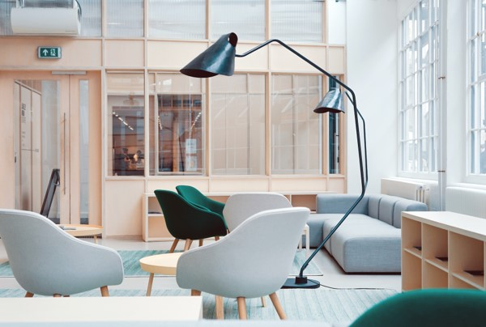
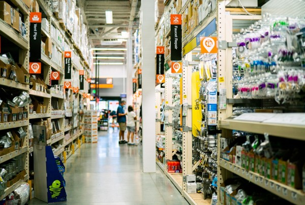

    

        

            AI Applications and AI SDK 
            on RZ/V series
        

    

    

        

             
             
            <i>
                <h1 class="sub">The best solution for starting your AI applications.</h1>
                <h5 class="sub">AI Applications and AI SDK are quick and easy solutions for starting AI.   
                    It provides various AI applications for free.</h5>
            </i>
        

         
        

             
             
        

        

             
            <a class=" text-right btn btn-secondary square-button" href="{{ site.url }}{{ site.baseurl }}">View AI Applications ></a>
            <a class="btn btn-secondary square-button" href="{{ site.url }}{{ site.baseurl }}" role="button">View AI SDK ></a>
        

    

 
 
 
<h3 id="new" >
    What's new
</h3>

    

        

            <h6 align="right" >
                2024.5.31
            </h6>
            
    This web page contains information about AI Applications and AI SDK v{{ site.version }}, which is not the latest version. 
    <b>Users are recommended to use the latest version in the following URL.</b> 
    <a href="{{ site.url }}/rzv_ai_sdk/latest">{{ site.url }}/rzv_ai_sdk/latest</a>
            
     
     
        

        

            <a class="btn btn-secondary square-button" href="{{ site.url }}{{ site.baseurl }}" role="button">
                View Version History >
            </a>
        

    

 
 
 
<h3 id="getting-started" >Getting Started</h3>

    

        

            Renesas RZ/V AI Software Development Kit (AI SDK) is the most comprehensive solution for building end-to-end accelerated AI applications.  AI SDK includes Yocto Linux with bootloader, Linux Kernel, Cross Compiler and a complete set of libraries for DRP-AI, graphics and codec.  
             
             
            <i>Getting Started</i> is a complete guide to learn <b>how to run AI Applications</b>, which explains the procedure for setting up the development environment, compiling AI Applications, setting up the board and running AI Applications.
              
            <h5>Get your target board now and <a href="{{ site.url }}{{ site.baseurl }}">GET STARTED.</a></h5>
            <a href="#video">Tutorial video</a> will help you understand better.  
        

        

            
        

    

 
 
 
 

<h3 id="ai-applications" align="center">AI Applications</h3>

    AI Applications provides the source code, pre-build application binary and pre-trained AI model objects, 
    which allow you to select the application from various use cases, and run it on the board immediately. 
    To see the overview about AI Applications, please refer to <a href="{{ site.url }}{{ site.baseurl }}">About AI Applications</a> page. 

Choose the category of applications.

    

        

              
            <ul class="category">
                <li id="agriculture">
                    <a href="{{ site.url }}{{ site.baseurl }}#agriculture">Agriculture</a> 
                </li>
            </ul>
        

        

              
            <ul class="category">
                <li id="healthcare">       
                    <a href="{{ site.url }}{{ site.baseurl }}#healthcare">Healthcare</a>
                </li>
            </ul>
        

        

              
            <ul class="category">
                <li id="industrial">
                    <a href="{{ site.url }}{{ site.baseurl }}#industrial">Industrial</a>
                </li>
            </ul>
        

        

              
            <ul class="category">
                <li id="building">       
                    <a href="{{ site.url }}{{ site.baseurl }}#building">Smart Building</a>
                </li>
            </ul>
        

        

              
            <ul class="category">
                <li id="city">       
                    <a href="{{ site.url }}{{ site.baseurl }}#city">Smart City</a>
                </li>
            </ul>
        

        

              
            <ul class="category">
                <li id="home">
                    <a href="{{ site.url }}{{ site.baseurl }}#home">Smart Home</a>
                </li>
            </ul>
        

        

              
            <ul class="category">
                <li id="retail">
                    <a href="{{ site.url }}{{ site.baseurl }}#retail">Retail</a>
                </li>
            </ul>
        

    

 
 
<h3 id="demo">Demo</h3>

    

        

            With the demo binary, users can try the AI Applications without having AI SDK environment. 
            Download the Demo and refer to <a href= "{{ site.url }}{{ site.baseurl }}">How to Use Guide</a> for more details.
             
             
            <a class="btn btn-primary download-button" href="https://www.renesas.com/document/sws/rzv2l-ai-applications-demo-sd-image-version-210" role="button">
                Download RZ/V2L EVK Demo
            </a>
             
             
            <h6>
                <b>Notes:
                    <ol>
                        <li>Demo is based on AI Applications v2.10 and RZ/V2L AI SDK v2.10.</li>
                        <li>Demo zip filesize is around 3.4GB.</li>
                        <li>Demo zip file is created using the evaluation version of RZ/V2L Graphics Library and Codecs Library, which has a limitation that system stops runinng after around 10 hours.</li>
                    </ol>
                </b>
            </h6>
             
        

    

 
 
<h3 id="video">Video</h3>
 
<h5 id="training-video"><b>Training video</b></h5>

    

        

            <iframe width="100%" height="55%" src="https://www.youtube.com/embed/ErmISuWkkBQ" title="YouTube video player" frameborder="0" allow="accelerometer; autoplay; clipboard-write; encrypted-media; gyroscope; picture-in-picture; web-share" allowfullscreen>
            </iframe>
            <ul class="videodetails">
                <li>
                    <a href="https://youtu.be/ErmISuWkkBQ">RZ/V2H AI Applications Tutorial - Getting Started v3.00 (Youtube) </a>
                      
                    For <b>RZ/V2H</b> AI SDK <b>v3.00</b> (latest). 
                    This is a tutorial video explaining the content of getting started. 
                    This tutorial is for RZ/V2H EVK. 
                    The AI SDK only supports eSD bootloader.
                </li>
            </ul>
        

        

            <iframe width="100%" height="55%" src="https://www.youtube.com/embed/CPeE2q3TdOY" title="YouTube video player" frameborder="0" allow="accelerometer; autoplay; clipboard-write; encrypted-media; gyroscope; picture-in-picture; web-share" allowfullscreen>
            </iframe>
            <ul class="videodetails">
                <li>
                    <a href="https://youtu.be/CPeE2q3TdOY">RZ/V2L AI Applications Tutorial - Getting Started v2.10 (Youtube) </a>
                      
                    For <b>RZ/V2L</b> AI SDK <b>v2.10</b> (latest). 
                    This is a tutorial video explaining the content of getting started. 
                    This tutorial is for RZ/V2L EVK. 
                    The AI SDK supports both eSD bootloder and eMMC bootloader. 
                    In this video, eSD bootloader is used.
                </li>
            </ul>
        

        

            <iframe width="100%" height="55%" src="https://www.youtube.com/embed/wFbTomH8oPs" title="YouTube video player" frameborder="0" allow="accelerometer; autoplay; clipboard-write; encrypted-media; gyroscope; picture-in-picture; web-share" allowfullscreen>
            </iframe>
            <ul class="videodetails">
                <li>
                    <a href="https://youtu.be/wFbTomH8oPs">RZ/V2L AI Applications Tutorial - Getting Started v1.00 (Youtube) </a>
                      
                    For <b>RZ/V2L</b> AI SDK <b>v1.00</b>. 
                    This is a tutorial video explaining the content of getting started. 
                    This tutorial is for RZ/V2L EVK. 
                    The AI SDK only supports eMMC bootloader.
                </li>
            </ul>
        

    

 
 
 
 
<h3 id="blog">Blogs</h3>

    

        

             
            <!-- Template Start -->
            <!-- 
            

                <h5 class="mb-2">
                    <a href="★LINK★">★Title★</a>
                </h5>
                

                    

                        

                            ★Overview★（ブログ掲載時に指定している文章）
                        

                        

                            Published: <b>★掲載日：Mmm. dd, yyyy.</b>
                        

                    

                

            

             
            
 -->
            <!-- Template End -->
            

                <h5 class="mb-2">
                    <a href="https://www.renesas.com/blogs/check-out-latest-features-ai-applications-v210">Check Out the Latest Features in AI Applications v2.10!</a>
                </h5>
                

                    

                        

                            Introducing the lineup of RZ/V AI applications, offered with AI Applications v2.10.
                        

                        

                            Published: <b>Dec. 22, 2023.</b>
                        

                    

                

            

             
            

            

                <h5 class="mb-2">
                    <a href="https://www.renesas.com/blogs/check-out-new-features-ai-applications-v200">Check Out the New Features in AI Applications v2.00!</a>
                </h5>
                

                    

                        

                            To facilitate the tedious task of designing AI solutions from scratch, Renesas proposes RZ/V MPU AI Apps, AI applications that can be easily implemented without AI training.
                        

                        

                            Published: <b>Sep. 22, 2023.</b>
                        

                    

                

            

             
            

            

                <h5 class="mb-2">
                    <a href="https://www.renesas.com/blogs/lets-find-ai-apps-you-want-introducing-renesas-ai-apps-available-free-charge">Let's find the AI Apps You Want, Introducing Renesas AI Apps Available Free of Charge</a>
                </h5>
                

                    

                        

                            Introduction to RZ/V AI applications that can be easily implemented without AI training
                        

                        

                            Published: <b>Jun. 12, 2023.</b>
                        

                    

                

            

             
            

        

    

 
 

    

        

            <a class="btn btn-secondary square-button" href="{{ site.url }}{{ site.baseurl }}#page-top" role="button">
                Back to Top >
            </a>
        

    

