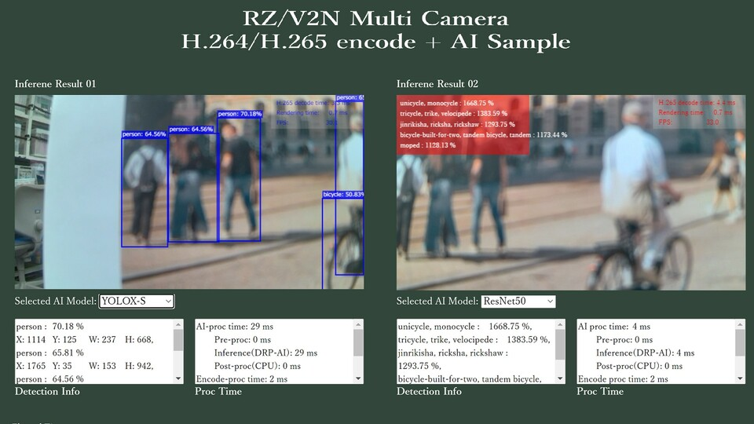
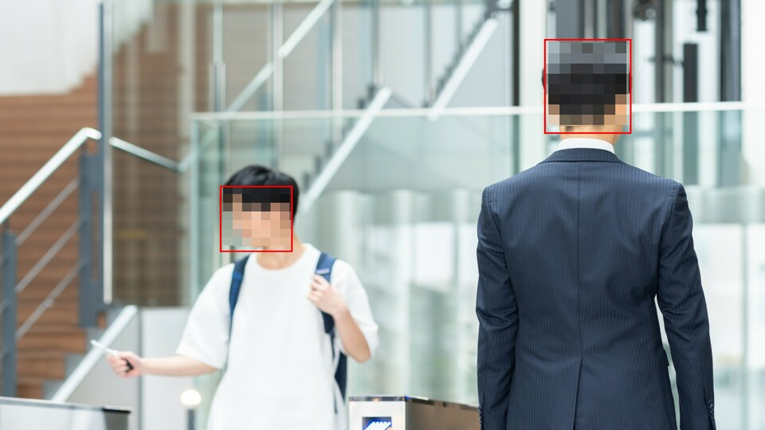
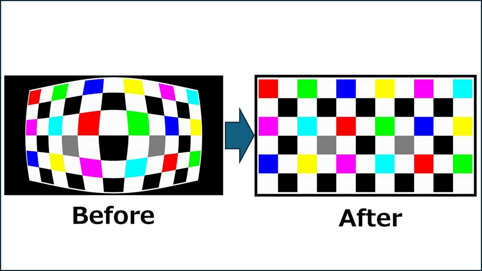
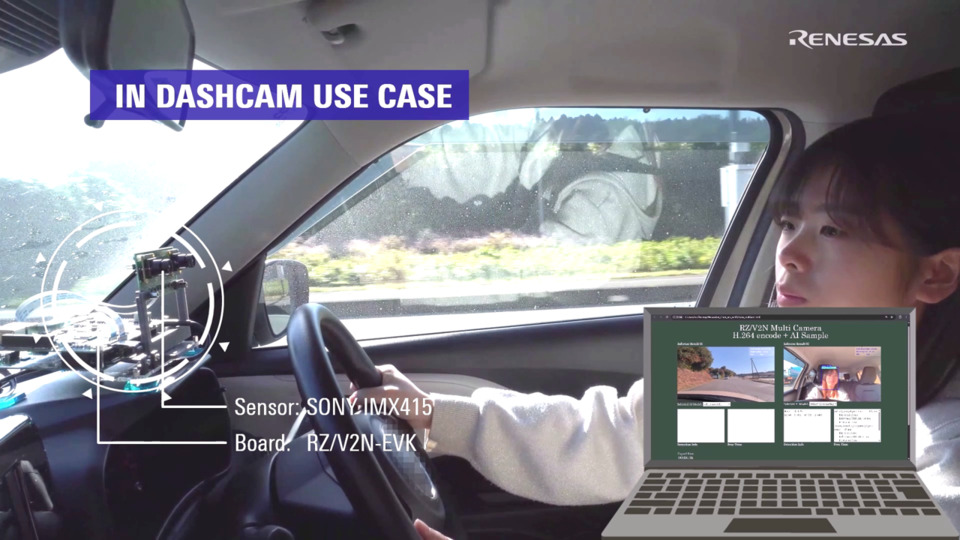
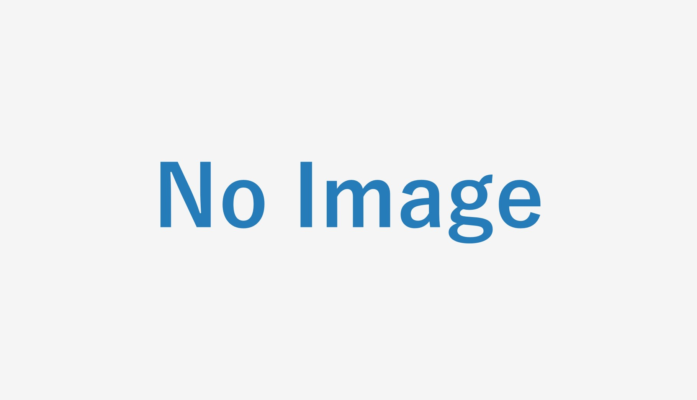
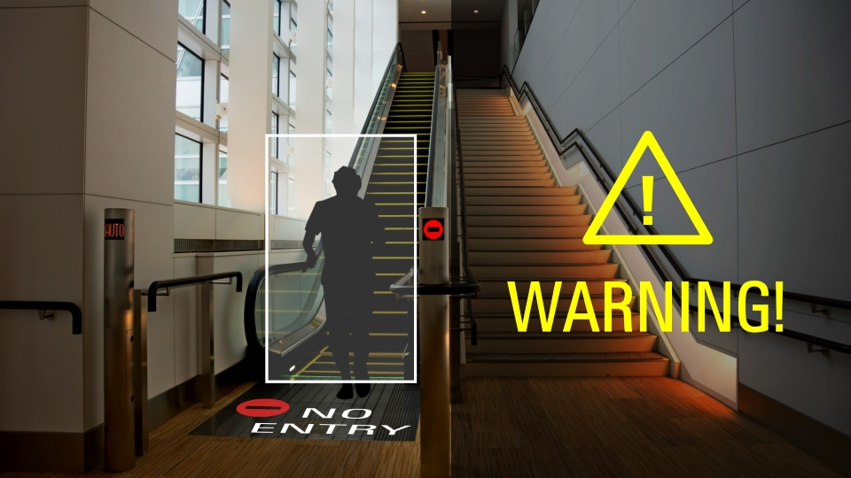

    

        

            RZ/V Reference Applications
        

    

 
 
This page shows the RZ/V Reference Applications, which are a set of sample applications that help your solution development not only for AI, but also for camera control, encoding, etc.. 
For any enquiries, please use Renesas Technical Support. 
<a class="btn btn-secondary square-button ms-3 mt-1" 
    style="text-align:left;" 
    href="https://www.renesas.com/support" 
    role="button"
    target="_blank" 
    rel="noopener noreferrer">
    
        Technical Support >
         
        
            Forum, FAQ and Support Tickets. 
        
    
</a>
 
 

    

        

            <li class="griditem" style="list-style: none;">
                
                <dt class="mt-1" style="color: #2a289d;">Dual Camera Video Encode + AI Reference</dt>
                <h6 class="appstatus" align="right"><b> </b></h6>
                

                    The reference application for camera system control with LSI-integrated ISP. 
                    Input images are captured by two camera sensors via MIPI-I/F, which are processed by the LSI-integrated ISP. 
                    Each image is subjected to encoding and AI processing.  
                    AI processing options are classification, object detection, etc.. 
                    The output can be checked on PC sent via Ethernet.
                     
                     
                    The sample application is included in the RZ/V ISP Support Package and requires users to submit secure access request.  
                

                <dl>
                    <dd style="display: flex">
                        

                            <a class="partnerlinkbutton" 
                                href="https://www.renesas.com/software-tool/rzv2n-isp-support-package" 
                                style="color:white"
                                target="_blank" rel="noopener noreferrer">
                                RZ/V2N >
                            </a>
                        

                    </dd>
                </dl>
            </li>
        

        

            <li class="griditem" style="list-style: none;">
                
                <dt class="mt-1" style="color: #2a289d;">Face mosaic application</dt>
                <h6 class="appstatus" align="right"><b> </b></h6>
                

                    Image data is captured using a USB camera, and human heads are detected using AI processing.  
                    The detected heads are subjected to a mosaic process, and the results are displayed on a monitor via HDMI. 
                    On RZ/V2H, image processing is performed by OpenCV Accelerator.  
                

                <dl>
                    <dd style="display: flex">
                        

                            <a class="partnerlinkbutton" 
                                href="https://github.com/renesas-rz/rzv_sample_apps/tree/main/S01_face_mosaic" 
                                style="color:white"
                                target="_blank" rel="noopener noreferrer">
                                Click >
                            </a>
                        

                    </dd>
                </dl>
            </li>
        

        

            <li class="griditem" style="list-style: none;">
                
                <dt class="mt-1" style="color: #2a289d;">Lens distortion correction application</dt>
                <h6 class="appstatus" align="right"><b> </b></h6>
                

                    Image data is captured using a MIPI camera, and lens distortion is corrected using OpenCV's remap.  
                    The processed results are displayed alongside the camera image on a display via HDMI.  
                    Image processing can also be performed by OpenCV Accelerator. 
                    This application also has a calibration function, so it can handle distortion caused by various lenses.  
                

                <dl>
                    <dd style="display: flex">
                        

                            <a class="partnerlinkbutton" 
                                href="https://github.com/renesas-rz/rzv_sample_apps/tree/main/S02_remap" 
                                style="color:white"
                                target="_blank" rel="noopener noreferrer">
                                Click >
                            </a>
                        

                    </dd>
                </dl>
            </li>
        

         
         
        

            <li class="griditem" style="list-style: none;">
                
                <dt class="mt-1" style="color: #2a289d;">Dashcam System Control Reference</dt>
                <h6 class="appstatus" align="right"><b> </b></h6>
                

                    The reference application for dashcam system. 
                    Input images are captured by two camera sensors via MIPI-I/F which are processed by the LSI-integrated ISP. 
                    Each image is subjected to video encoding and AI processing. 
                    AI processing can be selected from the Driver Monitoring, the gaze detection, etc..   
                    Output can be verified in two ways.  
                    <ul class="mb-0">
                        <li>
                        The result can be displayed on PC via Ethernet; 
                        </li>
                        <li>
                        The output image is saved on microSD card for recording purposes. 
                        </li>
                    </ul>
                     
                    The application is included in the RZ/V ISP Support Package as <b>"Sample application No.2"</b>, and requires users to submit secure access request. 
                      
                

                <dl>
                    <dd style="display: flex">
                        

                            <a class="partnerlinkbutton" 
                                href="https://www.renesas.com/software-tool/rzv2n-isp-support-package" 
                                style="color:white"
                                target="_blank" rel="noopener noreferrer">
                                RZ/V2N >
                            </a>
                        

                    </dd>
                </dl>
            </li>
        
 
         
    

<!-- Template -->
    <!-- 

        

            <h3>Company Name</h3>
        

        

            Company overview, features, etc. 
        

        

            
        

    

     
    

        

            <li class="griditem" style="list-style: none;">
                
                <dt class="mt-1" style="color: #2a289d;">Application Name</dt>
                <h6 class="appstatus" align="right"><b> </b></h6>
                

                    The application image size must be size of 960x540. The maximum number of characters for application name above and application explanation (this statement) is note stated, but note that longer sentense may not look fancy.  
                

                <dl>
                    <dd style="display: flex">
                        

                            <a class="partnerlinkbutton" 
                                href="" 
                                style="color:white"
                                target="_blank"
                                rel="noopener noreferrer">
                                Click >
                            </a>
                        

                    </dd>
                </dl>
            </li>
        

        

            <li class="griditem" style="list-style: none;">
                
                <dt class="mt-1" style="color: #2a289d;">Application Name</dt>
                <h6 class="appstatus" align="right"><b> </b></h6>
                

                    Explanation Explanation  Explanation  Explanation  Explanation  Explanation  Explanation  Explanation  Explanation  Explanation  Explanation  Explanation.  
                

                <dl>
                    <dd style="display: flex">
                        

                            <a class="partnerlinkbutton" 
                                href="" 
                                style="color:white"
                                target="_blank"
                                rel="noopener noreferrer">
                                Click >
                            </a>
                        

                    </dd>
                </dl>
            </li>
        

    
 -->
<!-- Template End -->
     
     
     
    

        

            <a class="btn btn-secondary square-button" href="{{ site.url }}{{ site.baseurl }}" role="button">
                Back to Home >
            </a>
        

    

