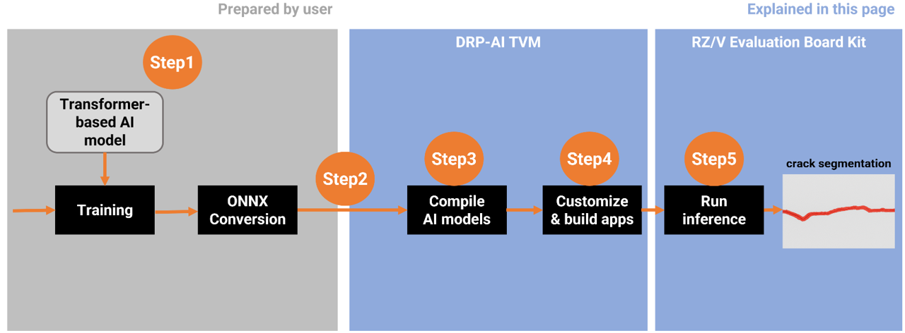
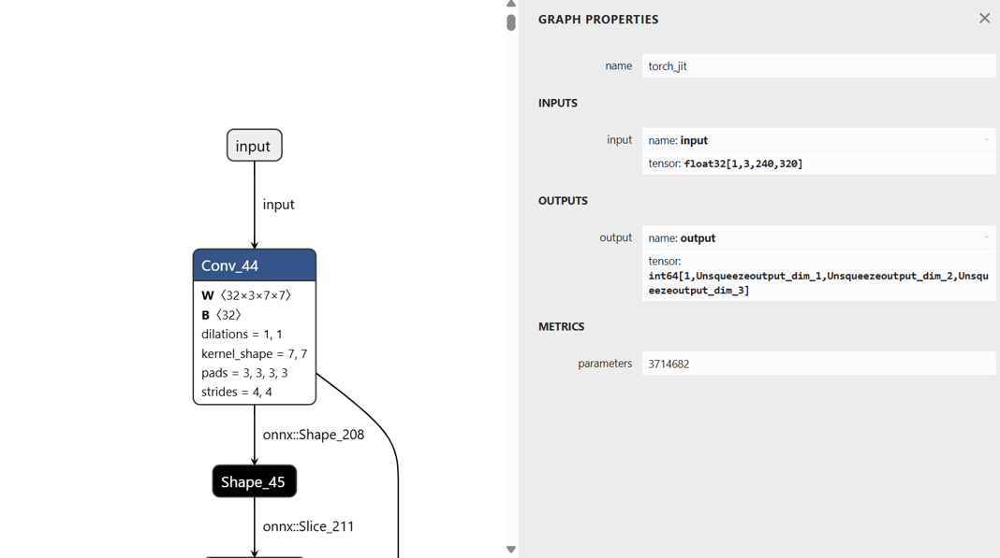
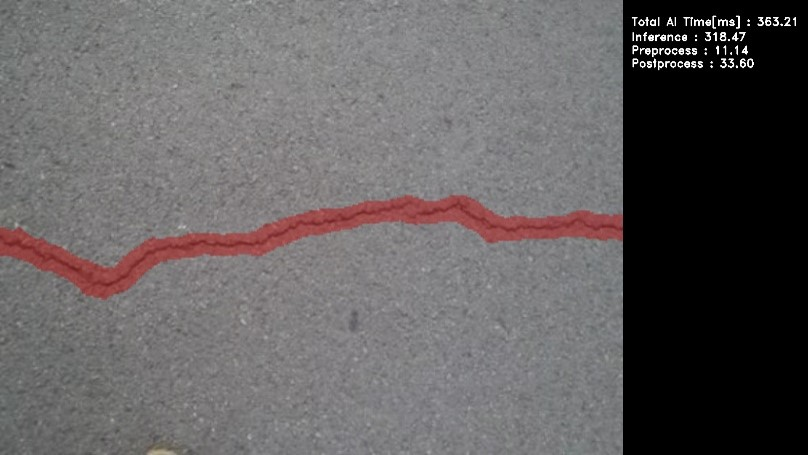

    

        

        How to replace a Transformer-based AI model
        

    

 
 
<h5>This document explains how to replace and execute a Transformer-based AI model (e.g., SegFormer) on the <b>RZ/V2N</b> platform using the DRP-AI TVM runtime.
 </h5>
<h5>The following is an example of how to implement the SegFormer model on <b>RZ/V2N</b> by adapting the existing <code>Q09_crack_segmentation</code> sample application.</h5>
<h3>Introduction</h3>

  

    

      <h4 class="u_line">Model Overview</h4>
      <a href="https://github.com/open-mmlab/mmsegmentation/tree/main/configs/segformer" target="_blank" rel="noopener noreferrer">Segformer</a>  is a state-of-the-art semantic segmentation model that combines Transformers with lightweight multilayer perceptron (MLP) decoders. It leverages a hierarchical Transformer-based encoder (e.g., MiT-Mix Vision Transformer) to extract multi-scale features and a lightweight MLP decoder to produce high-resolution segmentation maps. 
    

    

      <h4 class="u_line">Work Flow</h4>
      In this workflow, the process begins with preparing a Transformer-based AI model and ends with running inference on the RZ/V2N board. 
      From Step 1 to Step 5, each stage corresponds to the sections described below in this guide.
       
       
    

  

   

<ul class="mt-1 mb-1">
  <li><a href="#step1">Step1: Prepare the SegFormer ONNX model</a></li>
  <li><a href="#step2">Setp2: Setup Environment</a></li>
  <li><a href="#step3">Step3: Compile AI Model with DRP-AI TVM</a></li>
  <li><a href="#step4">Step4: Build the Application</a></li>
  <li><a href="#step5">Step5: Deploy and Run Application on the Board</a></li>
</ul>

 
<h3 id="step1" >Step 1: Prepare the SegFormer ONNX Model </h3>
In your environment, prepare your own SegFormer model and convert it into ONNX format, which will be used in Step 3. 
This step provides an <b>example</b> for reference purposes.
<h4 class="mt-5 u_line">1. Operating Environment </h4>
<table class="gstable">
    <tr>
        <th>Category</th>
        <th>Item</th>
        <th>Version</th>
    </tr>
    <tr>
        <td rowspan="1">Hardware</td>
        <td>Ubuntu Desktop  
        &nbsp;&nbsp;&nbsp;&nbsp;GPU: NVIDIA GPU with CUDA support</td>
        <td>20.04</td>
    </tr>
    <tr>
        <td rowspan="8">Software</td>
        <td>Python</td>
        <td>3.10.6</td>
    </tr>
    <tr>
        <td>PyTorch</td>
        <td>1.12.0+cu116</td>
    </tr>
    <tr>
        <td>Torchvision</td>
        <td>0.13.0+cu116</td>
    </tr>
    <tr>
        <td>pip</td>
        <td>25.3</td>
    </tr>
    <tr>
        <td>ONNX version</td>
        <td>1.19.0</td>
    </tr>
    <tr>
        <td>Opset version</td>
        <td>11</td>
    </tr>
    <tr>
        <td>mmcv-full</td>
        <td>1.6.0</td>
    </tr>
    <tr>
        <td>mmsegmentation</td>
        <td>0.30.0</td>
    </tr>
</table>
<h4 class="mt-5 u_line">2. SegFomer implementation details</h4>
  SegFormer is implemented based on the <a href="https://github.com/open-mmlab/mmsegmentation" target="_blank" rel="noopener noreferrer">MMSegmentation</a> repository. 
  The training code was used from the MMSegmentation GitHub repository on the master branch, which is based on the mmcv library. The MMSegmentation package should be installed from the repository using the command below: 

git clone https://github.com/open-mmlab/mmsegmentation
cd mmsegmentation
git checkout 38900d5c51395dde78b494d9e86a8ed92cc81b49
pip install -v -e .

<h4 class="mt-5 u_line">3. Model Conversion</h4>
  After training the model and obtaining the PyTorch checkpoint file (<code>.pth</code>), the next step is to convert it into the ONNX format. 
  This conversion can be done using PyTorch's standard API, <code> torch.onnx</code>(<a href="https://docs.pytorch.org/docs/1.12/onnx.html" target="_blank" rel="noopener noreferrer">PyTorch 1.12</a>), which takes your trained model and a sample input tensor to generate an ONNX model file as output.
 
 
 
<h3 id="step2" >Step 2: Setup AI SDK Environment </h3>
  

    Note
    Make sure that you have installed <a href="https://docs.docker.com/" target="_blank" rel="noopener noreferrer">Docker</a> on your Linux PC.
  

 
Once the ONNX model is generated, the next step is to prepare the execution environment for model compilation and deployment. 
<ol>
 <li>Please follow the Step 1 ~ 5 in the official RZ/V AI SDK Getting Started guide below to set up the AI SDK environment and launch the Docker container.
   <ul class="mt-1 mb-1">
    <li><a href="https://renesas-rz.github.io/rzv_ai_sdk/6.10/getting_started.html" target="_blank" rel="noopener noreferrer">RZ/V AI SDK Getting Started (v6.10)</a>
    </li> 
   </ul>
 </li>
</ol>  
  <table class="gstable">
    <tr style="white-space: nowrap;">
      <th>Targer Board</th>
      <th>PRODUCT</th>
      <th>AI SDK</th>
      <th>DRP-AI TVM</th>
      <th>DRP-AI Translator</th>
    </tr>
    <tr>
      <td>RZ/V2N Evaluation Board Kit (EVK)
      </td>
      <td>RZ/V2N</td>
      <td>v6.00</td>
      <td>v2.5.1 (AI SDK v6.00)</td>
      <td>i8 v1.04 (AI SDK v6.00)</td>
    </tr>
  </table>
  After completing Getting Started Step 1 ~ 5, the Docker container environment will be running and ready. 
 
 
<h3 id="step3" >Step 3: Compile AI Model with DRP-AI TVM</h3>
This chapter explains how to compile your ONNX model using DRP-AI TVM to make it executable on the RZ/V2N EVK.

  Note
    Before proceeding with Step 3, make sure that you have completed Step 2 and the Docker container has been created successfully.

<h4 class="mt-5 u_line">3-1. Copy Your ONNX Model into the Working Directory</h4>
Please choose any preferred method to copy your ONNX model into the working directory inside the Docker container, which is <code>$TVM_ROOT/tutorials</code>.   
In this document, we provide an <b>example</b> using the <code>docker cp</code> command for simplicity. 
<ol>
 <li>If you are currently inside the <b>Docker container</b>, run the following command to exit. 

exit

 </li>
 <li>Run the following command on <b>host PC</b> to copy the ONNX model into the working directory on your <b>Docker container</b>.


sudo docker cp <path_to_file>/segformer.onnx rzv2n_ai_sdk_container:${TVM_ROOT}/tutorials/


  

  Note
    The example use <code>segformer.onnx</code>, please replace it with your own ONNX model file name.
  

 </li>
</ol>
<h4 class="mt-5 u_line">3-2. Move to the Working Directory</h4>
<ol>
 <li>If the Docker container is not currently running, start it with the following command on your <b>host PC</b>.

sudo docker start -i rzv2n_ai_sdk_container

 </li>
 <li>Once inside the <b>Docker container</b>, move to the working directory by running the following command.

cd ${TVM_ROOT}/tutorials/ 

 </li>
</ol>
<h4 class="mt-5 u_line">3-3. Confirm the model information</h4>
To compile the model with DRP-AI TVM, please verify the settings you used during training. 

  Note
    If any of these conditions differ from the training settings, the model accuracy will significantly drop.

  <b>Example of settings to verify</b>
  <ul>
    <li>Input shape (e.g., 1x3x240x320)</li>
    <li>Color order (e.g., RGB or BGR)</li>
    <li>
      Preprocess
      <ul>
        <li>Normalization (mean and std)</li>
        <li>Resize algorithm and input size</li>
      </ul>
    </li>
    <li>Tensor layout (e.g., NCHW or NHWC)</li>
  </ul>

          <u><b>Example:</b></u> 
          Some of the settings can also be checked in <a href="https://netron.app/" target="_blank" rel="noopener noreferrer">Netron</a>. 
          Input shape: [1,3,240,320] 
          Tensor layout: NCHW     
    

         
    

<h4 class="mt-5 u_line">3-4. Modify the sample script</h4>
Next, modify the sample script according to your model information . The input image format must match the conditions used during training (e.g., image size, normalization, channel order, etc.). 
In this guide, we use <a href="https://github.com/renesas-rz/rzv_drp-ai_tvm/blob/main/tutorials/compile_onnx_model_quant.py" target="_blank" rel="noopener noreferrer">compile_onnx_model_quant.py</a> as the working example.  
Please <b>adjust the preprocessing steps</b> according to the settings confirmed in Step 3-3. 
 
Renesas modified the following process to match the SegFormer model input specification. And the modified version is provided as a reference.  
<ol>
 <li>
 Replaced the original ImageNet preprocessing in L.101~L.112 with a simplified version aligned to the SegFormer model. 

 
- def pre_process_imagenet_pytorch(img, mean=[0.485, 0.456, 0.406], stdev=[0.229, 0.224, 0.225], dims=None, need_transpose=False):   
-   img = cv2.cvtColor(img, cv2.COLOR_BGR2RGB)
-   img = Image.fromarray(img)
-   img = F.resize(img, 256, Image.BILINEAR)
-   img = F.center_crop(img, 224)
-   img = F.to_tensor(img)
-   std = stdev
-   img = F.normalize(img, mean, std, inplace=False)
-   if not need_transpose:
-      img = img.permute(1, 2, 0) # NHWC
-   img = np.asarray(img, dtype='float32')
-   return img

+ def preprocess_image(image):
+   mean = np.array([123.675, 116.28, 103.53], dtype=np.float32)
+   std = np.array([58.395, 57.12, 57.375], dtype=np.float32)
+   img_scale = (320, 240)
+   resized_image = cv2.resize(image, img_scale)
+   img_float = resized_image.astype(np.float32)
+   img_normalized = (img_float - mean) / std
+   img_chw = img_normalized.transpose(2, 0, 1)
+   return img_chw
 

 </li>
 <li>
  Add the following line between L.155 and L.157 to print the input details of ONNX model. 

  for inp in model_inputs:
      if inp not in model_initializers:
          model_vars.append(inp)
          
+ print(f"Model inputs: {onnx_model.graph.input}")

  np.random.seed(41264126)

 </li>
 <li>
  Replace the L.209 to match the input format required by the SegFormer model. 

  for i in range(len(input_list)):
      img_file_name = str(input_list[i])
      image = cv2.imread(img_file_name)
-     input_data = pre_process_imagenet_pytorch(image, mean, stdev, need_transpose=True)
+     input_data = preprocess_image(image)
      input_data = np.expand_dims(input_data, 0)
      rt_mod.set_input(0, input_data)
      rt_mod.run()
      print("calib data", img_file_name)

 </li>
 <li>
  Update the L.221. 

  drp_config = {
      "target": "InterpreterQuant",
      "drp_compiler_version": opts["drp_compiler_version"],
      "quantization_tool": opts["quantization_tool"],
      "quantization_option": opts["quantization_option"],
-     "calibration_data": record_dirmodel_vars.append(inp)
+     "calibration_data": record_dir
  }

 </li>
</ol>
This completes the modification of the sample script.
<h4 class="mt-5 u_line">3-5. Compilation</h4>
Using the modified sample script from the previous section, the SegFormer model can be compiled with the following command on your <b>Docker container</b> created in Step 2. 

python3 compile_onnx_model_quant.py \
    ./segformer.onnx \                # target ONNX model file to compile
    -o ../data/segformer \            # specify the output directory for compiled files
    -t $SDK \                         # path to the SDK (toolchain)
    -d $TRANSLATOR \                  # path to the DRP-AI Translator
    -c $QUANTIZER                     # path to the DRP-AI Quantize


  Note
    No calibration data was used in this sample case. Calibration is typically recommended, however, it was not required here since the inference results were nearly identical, and omitting calibration shortens the compilation time.

<h4 class="mt-5 u_line">3-6. Confirming the output</h4>
After the compilation, the compiled AI model will be generated under the specified output directory.  
In this example, the output directory was set to <code><b>${TVM_ROOT}/data/segformer/</b></code>.  
Check the generated files using the following command:

ls ${TVM_ROOT}/data/segformer/

<ul>
 <li>If the following files are printed, the model files have been generated successfully.
 <pre style="margin:0;">
deploy.json    deploy.params    deploy.so    input_0.bin    interpreter_out    preprocess</pre>
 </li>
</ul>
 
 
<h3 id="step4" >Step 4: Build the Application</h3>
<h4 class="mt-5 u_line">Overview</h4>
To run inference with the AI model compiled by DRP-AI TVM, a C++ inference application is required. 
Since the Segformer model is segmentation model trained with crack segmentation dataset, we can modify the source code of AI Applications, <a href="https://github.com/renesas-rz/rzv_ai_sdk/blob/v6.10/Q09_crack_segmentation/README.md" target="_blank" rel="noopener noreferrer">Q09_crack_segmentation</a>. 
Following table shows the summary of application elements.
Bold letters require the modification in the source code.
<table class="gstable">
    <tr>
    <th>Category</th>
    <th>Item</th>
    <th>Q09_crack_segmentation</th>
    <th>This page</th>
    <th>Comment</th>
    </tr>
    <tr>
      <td rowspan="11">
        AI Model
      </td>
      <td>
        Model name
      </td>
     <td>
        U-Net
      </td>
      <td>
        <b>SegFormer</b>
      </td>  
      <td> 
      </td>
    </tr>
    <tr>
      <td>
        AI task
      </td>
      <td>
        Segmentation
      </td>
      <td>
        Segmentation
      </td>
      <td> 
      </td>
    </tr>
    <tr>
      <td>
        Dataset
      </td>
      <td>
        Crack segmentation dataset
      </td>
      <td>
        Crack segmentation dataset
      </td>
      <td> 
      </td>
    </tr>
    <tr>
      <td>
        Target class
      </td>
      <td>
        Background/Crack
      </td>
      <td>
        Background/Crack
      </td>
      <td> 
      </td>
    </tr>
    <tr>
      <td>
        Number of class
      </td>
      <td>
       2
      </td>
      <td>
       2
      </td>
      <td> 
      </td>
    </tr>
    <tr>
      <td>
        Input size
      </td>
      <td>
       224x224x3
      </td>
      <td>
       <b>240x320x3</b>
      </td>
      <td> 
      </td>
    </tr>
    <tr>
      <td>
        Output size
      </td>
      <td>
       224x224x1
      </td>
      <td>
       <b>240x320x1</b>
      </td>
      <td> 
      </td>
    </tr>
    <tr>
      <td>
        Input datatype
      </td>
      <td>
       floating-point type
      </td>
      <td>
       floating-point type
      </td>
      <td> 
      </td>
    </tr>
    <tr>
      <td>
        Output datatype
      </td>
      <td>
       floating-point type
      </td>
      <td>
       <b>integer type</b>
      </td>
      <td> 
      </td>
    </tr>
    <tr>
      <td>
        Pre-processing
      </td>
      <td>
       Pre-processing for U-Net
      </td>
      <td>
       <b>Pre-processing for SegFormer</b>
      </td>
       <td style="vertical-align: middle;"><small>Differences in Pre-processing will be explained in<i>Section 4-2: Modify the Source Code</i>.</small>
      </td>
    </tr>
    <tr>
      <td>
        Post-processing
      </td>
      <td>
       Post-processing for U-Net
      </td>
      <td>
       <b>Post-processing for SegFormer</b>
      </td>
      <td style="vertical-align: middle;"><small>Differences in Pre-processing will be explained in<i>Section 4-2: Modify the Source Code</i>.</small>
      </td>
    </tr>
    <tr>
      <td rowspan="5">
        Application
      </td>
      <td>
        Target board
      </td>
      <td>
        RZ/V2H, RZ/V2N, RZ/V2L
      </td>
      <td>
        <b>RZ/V2N (, RZ/V2H)</b>
      </td>
      <td style="vertical-align: middle;"><small>
       RZ/V2N and RZ/V2H are brother chips, same application can run on the board. </small>
      </td>
    </tr>
    <tr>
      <td>
        Model folder name
      </td>
      <td>
      "crack_segmentation_model"
      </td>
      <td>
       <b>"segformer_model"</b>
      </td>
      <td> 
      </td>
    </tr>
    <tr>
      <td>
        Application input data
      </td>
      <td>
        USB Camera 1ch (640x480)
      </td>
      <td>
        USB Camera 1ch (640x480)
      </td>
      <td> 
      </td>
    </tr>
    <tr>
      <td>
        Application output
      </td>
      <td>
       HDMI display 1920x1080
      </td>
      <td>
       HDMI display 1920x1080
      </td>
      <td> 
      </td>
    </tr>
    <tr>
      <td>
        Segmentation result display
      </td>
      <td>
       RZ/V2H, RZ/V2N: Heatmap 
       RZ/V2L: Green highlight
      </td>
      <td>
       <b>RZ/V2N: Red highlight</b>
      </td>
      <td>
      </td>
    </tr>
  </table>
<h4 class="mt-5 u_line">4-1. Prepare the Application</h4>
Check the <a href="https://github.com/renesas-rz/rzv_ai_sdk/blob/v6.10/Q09_crack_segmentation/README.md" target="_blank" rel="noopener noreferrer">Q09_crack_segmentation</a> application, follow the instruction "Application File Generation 1-4" to go to the application source code directory. 
<h4 class="mt-5 u_line">4-2. Modify the Source Code</h4>
Edit the following source file to adapt the application to the SegFormer model compiled in Step 3. 
Path: <code>${PROJECT_PATH}/Q09_crack_segmentation/src/crack_segmentation.cpp</code>
 
 
The following code examples show the differences between the original U-Net model and the SegFormer model.
<ol>
  <li>Modify the definition of the AI model's input size (L.101~L.102). 

   /*Model input info*/
-  #define MODEL_IN_H          (224)
-  #define MODEL_IN_W          (224)
+  #define MODEL_IN_H          (240)
+  #define MODEL_IN_W          (320)

  </li>
<li>Modify the AI model's output datatype in L.152, L.370 and L.467. 
 <ul>
  <li>L.152 

 
-  std::vector<float> floatarr(1);
+  std::vector<uint64_t> intarr(1);
 
    
  </li>
  <li>L.370 

   ******************************************/
-  float *start_runtime(float *input)   
+  uint64_t *start_runtime(float *input)
   {
       int ret = 0;
       /* Set Pre-processing output to be inference input. */
       model_runtime.SetInput(0, input);
      ... remaining code omitted ... 
   }
 
  </li>
  <li>L.467 

   int ret = 0;
-  float *output; 
+  uint64_t *output;
   /*font size to be used for text output*/
 
    </li>
 </ul>
</li>
  <li>Add a color palette for the red highlight implementation by inserting the following lines below L.178. 

   /* Map to store input source list */
   std::map<std::string, int> input_source_map =
   {
       #ifndef V2N
           {"VIDEO", 1},
       #endif
       {"IMAGE", 2},
       {"USB", 3},
       #ifdef V2L
           {"MIPI", 4}
       #endif

   };
 
+  std::vector<cv::Vec3b> palette = 
+  {
+      {0,0,200},
+      {0,0,0}
+  };
 
  </li>
  <li> Modify image resizing, add mean/std normalization, remove RGB conversion (L.352~L.362), and delete the image resizing process (L.492~L.494) for SegFormer pre-processing. 
<ul>
 <li>L.352~L.362 

-  cv::Mat start_preprocessing(cv::Mat frame)
-  cv::Mat start_preprocessing(cv::Mat frame)
-  {
-      cv::cvtColor(frame, frame, cv::COLOR_BGR2RGB);
-      frame = hwc2chw(frame);
-      /*convert to FP32*/
-      frame.convertTo(frame, CV_32FC3,1.0 / 255.0, 0);
-      /*deep copy, if not continuous*/
-      if (!frame.isContinuous())
-      frame = frame.clone();
-      return frame;
-  }
+  cv::Mat start_preprocessing(const cv::Mat& image) 
+  {
+      cv::Scalar mean = {123.675f, 116.28f, 103.53f};
+      cv::Scalar std = {58.395f, 57.12f, 57.375f};
+      cv::Size img_scale(MODEL_IN_W,MODEL_IN_H);
+      cv::Mat processed_image;
+      cv::resize(image, processed_image, img_scale);
+      processed_image.convertTo(processed_image, CV_32FC3);
+      processed_image -= mean;
+      processed_image /= std;
+      processed_image = hwc2chw(processed_image);
+      return processed_image;
+  }
 
 </li>
 <li>L.492~L.494 

-  cv::Size size(MODEL_IN_H, MODEL_IN_W);
-  /*resize the image to the model input size*/
-  cv::resize(frame, frame, size); 
 
 </li>
</ul>
  </li>
  <li>Update the post-processing and variable definitions according to the model's output datatype (L.410~L.422).
   

-  floatarr.resize(g_out_size_arr);
    /* Post-processing for FP16 */
-  if (InOutDataType::FLOAT16 == std::get<0>(output_buffer))
-  {
-      /* Extract data in FP16 <uint16_t>. */
-      uint16_t *data_ptr = reinterpret_cast<uint16_t *>(std::get<1>(output_buffer));
-      for (int n = 0; n < g_out_size_arr; n++)
-      {
-           /* Cast FP16 output data to FP32. */
-           floatarr[n] = float16_to_float32(data_ptr[n]);
-      }
-  }
-  return floatarr.data();
+  intarr.resize(g_out_size_arr);
    /* Post-processing for FP16 */
+  if (InOutDataType::INT64 == std::get<0>(output_buffer))
+  {
+      /* Extract data in INT64 <uint16_t>. */
+     uint64_t *data_ptr = reinterpret_cast<uint64_t *>(std::get<1>(output_buffer));
+     for (int n = 0; n < g_out_size_arr; n++)
+     {
+          intarr[n] = data_ptr[n];
+     }
+  }
+  return intarr.data();
 
  </li>
  <li>Update the post-processing step by removing <code>colour_convert</code> and overlaying the colorized segmentation result directly onto the input image data (L.425~L.456). 

-  /*****************************************
-   * Function Name : colour_convert
-   * Description   : function to convert white colour to green colour.
-   * Arguments     : Mat image
-   * Return value  : Mat result
-   ******************************************/
-   cv::Mat colour_convert(cv::Mat image)
-   {
-       /* Convert the image to HSV */ 
-       cv::Mat hsv;
-       cv::cvtColor(image, hsv, cv::COLOR_BGR2HSV);
-       /* Define the lower and upper HSV range for white color */
-       cv::Scalar lower_white = cv::Scalar(0, 0, 200); // Adjust these values as needed
-       cv::Scalar upper_white = cv::Scalar(180, 30, 255); // Adjust these values as needed
-       /* Create a mask for the white color */
-       cv::Mat mask;
-       cv::inRange(hsv, lower_white, upper_white, mask);
-       /* Create a green image */
-       cv::Mat green_image = cv::Mat::zeros(image.size(), image.type());
-       green_image.setTo(cv::Scalar(0, 100, 0), mask);
-       /* Replace white regions in the original image with green */
-       cv::Mat result;
-       cv::bitwise_and(image, image, result, ~mask);
-       cv::add(result, green_image, result);
-       cv::resize(result, result, cv::Size(MODEL_IN_H, MODEL_IN_W));
-       /* return result */
-       return result;
-   }
+   cv::Mat overlay_segmentation(const cv::Mat& original_image, const cv::Mat& processed_mask, float alpha = 0.4f) 
+   {
+        int original_height = original_image.rows;
+        int original_width = original_image.cols;
+        cv::Mat mask_resized;
+        cv::resize(processed_mask, mask_resized, cv::Size(original_width, original_height), 0, 0, cv::INTER_NEAREST);
+        cv::Mat output_mask = cv::Mat::zeros(original_image.size(), original_image.type());
+        for (int y = 0; y < mask_resized.rows; ++y) 
+        {
+            for (int x = 0; x < mask_resized.cols; ++x) 
+            {
+                int class_id = mask_resized.at<uchar>(y, x);
+                if (class_id < 1) 
+                {
+                    output_mask.at<cv::Vec3b>(y, x) = palette[class_id];
+                }
+                else
+                {
+                    output_mask.at<cv::Vec3b>(y, x) = original_image.at<cv::Vec3b>(y, x);
+                }
+            }
+        }
+        cv::Mat overlayed_image;
+        cv::addWeighted(original_image, 1.0f - alpha, output_mask, alpha, 0.0, overlayed_image);
+        return overlayed_image;
+   }
 
  </li>
  <li>Modify the <code>run_inference()</code> function to return a cloned frame in L.483. 

   cv::Mat input_frame,output_frame;
-  input_frame = frame; 
+  input_frame = frame.clone();
 
 
  </li>
  <li>Update segmentation result display to SegFormer red-highlight style by applying <code>overlay_segmentation</code> (L.509~L.527).
   

-  #ifdef V2H
-     /* convert float32 format to opencv mat image format */ 
-     cv::Mat img_mask(MODEL_IN_H,MODEL_IN_W,CV_32F,(void*)output);
-     /* setting minimum threshold to heatmap */ 
-     cv::threshold(img_mask,img_mask,min_threshold,0.0,cv::THRESH_TOZERO);
-     cv::normalize(img_mask, img_mask, 0.0, 1.0, cv::NORM_MINMAX);
-     /* Scale the float values to 0-255 range for visualization */
-     cv::Mat heatmap_scaled;
-     img_mask.convertTo(heatmap_scaled, CV_8U, 255.0);
-     /* Create a grayscale heatmap */
-     cv::applyColorMap(heatmap_scaled, img_mask, cv::COLORMAP_INFERNO);
-  #elif V2L
-     /* convert float32 format to opencv mat image format */ 
-     cv::Mat img_mask(MODEL_IN_H,MODEL_IN_W,CV_32F,(void*)output); 
-     cv::threshold(img_mask,img_mask,-0.5,255,cv::THRESH_BINARY);  
-     img_mask.convertTo(img_mask,CV_8UC1);
-  #endif  
+  cv::Mat mask(MODEL_IN_H, MODEL_IN_W, CV_8UC1);
+  for (int i = 0; i < MODEL_IN_H; ++i) 
+  {
+    for (int j = 0; j < MODEL_IN_W; ++j) 
+    {
+        mask.at<uchar>(i, j) = static_cast<uchar>(output[i * MODEL_IN_W + j]);
+    }
+  }
+  output_frame = overlay_segmentation(input_frame, mask);
 
  </li>
  <li>Remove the post-processing for U-Net; for SegFormer, the process is consolidated into <code>overlay_segmentation</code> (L.537~L.561). 

-  total_time = pre_time + ai_time + post_time;
-  cv::cvtColor(img_mask, output_frame, cv::COLOR_RGB2BGR);
-  /* convert white colour from output frame to green colour */
-  output_frame = colour_convert(output_frame);
-  cv::resize(input_frame, input_frame, cv::Size(IMAGE_OUTPUT_WIDTH, IMAGE_OUTPUT_HEIGHT));
-  cv ::cvtColor(input_frame, input_frame, cv::COLOR_RGB2BGR);
-  cv::resize(output_frame, output_frame, cv::Size(IMAGE_OUTPUT_WIDTH, IMAGE_OUTPUT_HEIGHT));
-  #ifdef V2H
-      cv::threshold(output_frame, output_frame, 0.7, 255, 3);
-  #endif
-  /* blending both input and ouput frames that have same size and format and combined one single frame */
-  cv::addWeighted(input_frame, 1.0, output_frame, 0.5, 0.0, output_frame);
-  #ifdef V2H
-      /* resize the output image with respect to output window size */
-      cv::cvtColor(output_frame, output_frame, cv::COLOR_RGB2BGR);
-  #elif V2L
-      /* resize the output image with respect to output window size */
-      cv::cvtColor(output_frame, output_frame, cv::COLOR_BGR2RGB);
-  #endif
+  total_time = pre_time + ai_time + post_time;
 
  </li>
  <li>Modify the model folder name in L.730. 

   /* Model Binary */
-  std::string model_dir = "crack_segmentation_model";
+  std::string model_dir = "segformer_model";
 
 
  </li>
</ol>
<h4 class="mt-5 u_line">4-3. Build the Application</h4>
Follow the <a href="https://github.com/renesas-rz/rzv_ai_sdk/blob/v6.10/Q09_crack_segmentation/README.md" target="_blank" rel="noopener noreferrer">Q09_crack_segmentation</a> "Application File Generation 4 to 7" to build the application. 
After running the commands, the following application file would be generated in the <code>${PROJECT_PATH}/Q09_crack_segmentation/src/build</code>.
<ul>
  <li><code>crack_segmentation</code></li>
</ul>
 
 
<h3 id="step5" >Step 5: Deploy and Run Application on the Board</h3>
This step explains how to deloy and run application on the RZ/V2N board.
<h4 class="mt-5 u_line">5-1. Deploy Stage</h4>

  

    

      <h4 class="u_line">Prerequisites</h4>
      This section assumes that the microSD card setup has been completed by following Step 7-1 of <a href="https://renesas-rz.github.io/rzv_ai_sdk/latest/getting_started.html#step7" target="_blank" rel="noopener noreferrer">Getting Started Guide</a>  provided by Renesas.
    

    

    Note
    If you prefer to deploy the files via <b>SCP</b> instead of using a microSD card, please refer to "5. Run on the Board" in the official  <a href="https://renesas-rz.github.io/rzv_drp-ai_tvm/compile_your_own_model.html" target="_blank" rel="noopener noreferrer">How to compile Your Own Model | DRP-AI TVM on RZ/V series</a> guide. 
    

    

     <h4 class="u_line">File Configuration</h4>
     For deployment, the following files are required for the Segformer application
     (generated in Step 4).
      
     <table class="gstable">
     <tr>
     <th>File</th>
      <th>Details</th>
      </tr>
      <tr>
        <td>
        <code>deploy.so</code>
        </td>
        <td>
        DRP-AI TVM compiled model (generated in Step 3)
        </td>
      </tr>
      <tr>
        <td>
        <code>deploy.json</code>
        </td>
        <td>
        Model graph definition file (generated in Step 3)
        </td>
      </tr>
      <tr>
        <td>
        <code>deploy.params</code>
        </td>
        <td>
        Model parameter file (generated in Step 3)
        </td>
      </tr>
      <tr>
        <td>
        <code>crack_segmentation</code>
        </td>
        <td>
        Application executable file (generated in Step 4)
        </td>
      </tr>
      <tr>
        <td>
        <code>libtvm_runtime.so</code>
        </td>
        <td>
        TVM runtime library required by the application
        </td>
      </tr>
     </table>
    

    

    <h4 class="u_line">Instruction</h4>
    <ol>
      <li>Insert the microSD card to Linux PC.
      </li>
      <li>Run the following commands to mount the partition 2, which contains the root filesystem. 

sudo mkdir /mnt/sd -p
sudo mount /dev/sdb2 /mnt/sd

        

          Warning
          Change <code>/dev/sdb</code> to your microSD card device name.
        

      </li>
      <li>Create the application directory on root filesystem.

sudo mkdir /mnt/sd/home/weston/transformer/segformer_model

    

      Note
      Directory name "<b><code>transformer</code></b>" can be determined by user.
    

      </li>
      <li>Copy the necessary files in execution environment to the <code>/home/weston/transformer</code> directory of the rootfs (SD Card) for the board. 
      Use the following command to copy the files to root filesystem.

sudo cp $WORK/ai_sdk_setup/data/segformer/deploy.json /mnt/sd/home/weston/transformer/segformer_model
sudo cp $WORK/ai_sdk_setup/data/segformer/deploy.params /mnt/sd/home/weston/transformer/segformer_model 
sudo cp $WORK/ai_sdk_setup/data/segformer/deploy.so /mnt/sd/home/weston/transformer/segformer_model 
sudo cp $WORK/ai_sdk_setup/data/rzv_ai_sdk/Q09_crack_segmentation/src/build/crack_segmentation /mnt/sd/home/weston/transformer

          </li>
          <li>Check if <code>libtvm_runtime.so</code> exists under <code>/usr/lib</code> directory of the rootfs (SD card) on the board.
          </li>
          <li>Folder structure in the rootfs (SD Card) would look like:
          

    <pre><code>
    |-- usr
    |   `-- lib
    |       `-- libtvm_runtime.so
    `-- home
      `-- weston
        `-- transformer
            |-- segformer_model
            |   |-- deploy.json
            |   |-- deploy.params
            |    `-- deploy.so
            `-- crack_segmentation
    </code></pre>
          

          </li>
      <li>Run the following command to sync the data with memory. 

sync

      </li>
      <li>Run the following command to unmount the partition 2. 

sudo umount /mnt/sd

      </li>
      <li>Eject the microSD card by running the following command and remove the microSD card from Linux PC. 

sudo eject /dev/sdb

    

          Warning
          Change <code>/dev/sdb</code> to your microSD card device name.
    

      </li>
      <li>Follow the instruction <a href="https://renesas-rz.github.io/rzv_ai_sdk/6.10/getting_started_v2n.html#step7" target="_blank" rel="noopener noreferrer">RZ/V2N EVK Getting Started Step 7-3: Boot RZ/V2N EVK</a> to boot.
      </li>
    </ol>
    

  

<h4 class="mt-5 u_line">5-2. Run Stage</h4>

  

    

    <h4 class="u_line">Prerequisites</h4>
    This section expects the user to have completed Step 7-3 of <a href="https://renesas-rz.github.io/rzv_ai_sdk/latest/getting_started.html#step7" target="_blank" rel="noopener noreferrer">Getting Started Guide</a>  provided by Renesas.
     
    After completion of the guide, the user is expected of following things.
    <ul>
      <li>The board setup is done.</li>
      <li>The board is booted with microSD card, which contains the application file.</li>
    </ul>
    

    

    <h4 class="u_line">Instruction</h4>
    <ol>
      <li>On Board terminal, go to the <code>transformer</code> directory of the rootfs. 

cd /home/weston/transformer/

        

        Note
          Directory name "<code><b>transformer</b></code>" can be determined by user.
        

      </li>
      <li>Run the application. 

su 
./crack_segmentation USB
exit # After terminated the application.

      </li>
      <li>Following window shows up on HDMI screen. </li>
      

        

          
        

      

      

        

        <table>
        <tr>
          <th>Board</th>
          <th>AI inference time</th>
        </tr>
        <tr>
        <td>RZ/V2N EVK</td>
        <td>Approximately 320 ms</td>
        </tr>
        </table>
        

      

      <li>To terminate the application, switch the application window to the terminal by using <code>Super(windows key)+Tab</code> and press ENTER key on the terminal of the board.
      </li></ol>
    

  

<h4 class="mt-5 u_line">This is the ending of replacing a Transformer-based AI model.</h4>

  

    

      <a class="btn btn-secondary square-button" href="#page-top" role="button">
Back to Top >
      </a>
    

  

